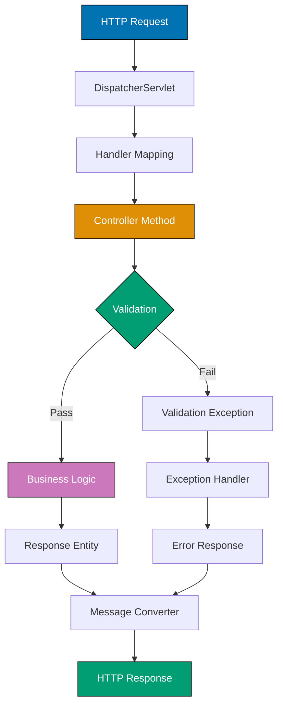

## Problem

Building RESTful APIs requires handling HTTP requests, validating input, serializing responses, and managing errors consistently. Manual implementation leads to repetitive code and inconsistent API behavior.

```java
// Problematic approach - servlet-based, repetitive
protected void doGet(HttpServletRequest req, HttpServletResponse resp) {
    String json = "{\"status\":\"ok\"}";
    resp.setContentType("application/json");
    resp.getWriter().write(json); // Manual JSON serialization, error handling
}
```

This guide shows practical techniques for building production-ready REST APIs with Spring Boot.

## Solution

### 1. Basic REST Controller

Spring Boot provides annotations for clean REST API implementation.

**Setup** (Maven dependencies):

```xml
<dependency>
    <groupId>org.springframework.boot</groupId>
    <artifactId>spring-boot-starter-web</artifactId>
    <version>3.2.1</version>
</dependency>
<dependency>
    <groupId>org.springframework.boot</groupId>
    <artifactId>spring-boot-starter-validation</artifactId>
    <version>3.2.1</version>
</dependency>
```

**Simple REST controller**:

```java
import org.springframework.web.bind.annotation.*;
import org.springframework.http.ResponseEntity;
import org.springframework.http.HttpStatus;
import java.util.List;

@RestController
@RequestMapping("/api/users")
public class UserController {
    private final UserService userService;

    public UserController(UserService userService) {
        this.userService = userService;
    }

    @GetMapping
    public ResponseEntity<List<User>> getAllUsers() {
        List<User> users = userService.findAll();
        return ResponseEntity.ok(users);
    }

    @GetMapping("/{id}")
    public ResponseEntity<User> getUserById(@PathVariable Long id) {
        User user = userService.findById(id);
        if (user == null) {
            return ResponseEntity.notFound().build();
        }
        return ResponseEntity.ok(user);
    }

    @PostMapping
    public ResponseEntity<User> createUser(@RequestBody User user) {
        User created = userService.save(user);
        return ResponseEntity
            .status(HttpStatus.CREATED)
            .body(created);
    }

    @PutMapping("/{id}")
    public ResponseEntity<User> updateUser(
        @PathVariable Long id,
        @RequestBody User user
    ) {
        if (!userService.exists(id)) {
            return ResponseEntity.notFound().build();
        }
        user.setId(id);
        User updated = userService.update(user);
        return ResponseEntity.ok(updated);
    }

    @DeleteMapping("/{id}")
    public ResponseEntity<Void> deleteUser(@PathVariable Long id) {
        if (!userService.exists(id)) {
            return ResponseEntity.notFound().build();
        }
        userService.delete(id);
        return ResponseEntity.noContent().build();
    }
}
```

### 2. Request Validation

Use Bean Validation (JSR-380) for input validation.

**DTO with validation annotations**:

```java
import jakarta.validation.constraints.*;
import com.fasterxml.jackson.annotation.JsonProperty;

public class CreateUserRequest {
    @NotBlank(message = "Username is required")
    @Size(min = 3, max = 50, message = "Username must be 3-50 characters")
    @Pattern(regexp = "^[a-zA-Z0-9_]+$",
             message = "Username can only contain letters, numbers, and underscores")
    private String username;

    @NotBlank(message = "Email is required")
    @Email(message = "Email must be valid")
    private String email;

    @NotBlank(message = "Password is required")
    @Size(min = 8, max = 100, message = "Password must be 8-100 characters")
    @Pattern(regexp = "^(?=.*[a-z])(?=.*[A-Z])(?=.*\\d).*$",
             message = "Password must contain uppercase, lowercase, and digit")
    private String password;

    @Min(value = 18, message = "Age must be at least 18")
    @Max(value = 120, message = "Age must be at most 120")
    private Integer age;

    // Getters and setters
    public String getUsername() { return username; }
    public void setUsername(String username) { this.username = username; }

    public String getEmail() { return email; }
    public void setEmail(String email) { this.email = email; }

    public String getPassword() { return password; }
    public void setPassword(String password) { this.password = password; }

    public Integer getAge() { return age; }
    public void setAge(Integer age) { this.age = age; }
}
```

**Controller with validation**:

```java
import jakarta.validation.Valid;
import org.springframework.validation.BindingResult;
import org.springframework.validation.FieldError;

@RestController
@RequestMapping("/api/users")
public class UserController {
    private final UserService userService;

    public UserController(UserService userService) {
        this.userService = userService;
    }

    @PostMapping
    public ResponseEntity<?> createUser(
        @Valid @RequestBody CreateUserRequest request,
        BindingResult bindingResult
    ) {
        if (bindingResult.hasErrors()) {
            Map<String, String> errors = new HashMap<>();
            for (FieldError error : bindingResult.getFieldErrors()) {
                errors.put(error.getField(), error.getDefaultMessage());
            }
            return ResponseEntity
                .badRequest()
                .body(new ErrorResponse("Validation failed", errors));
        }

        User user = userService.createUser(request);
        return ResponseEntity
            .status(HttpStatus.CREATED)
            .body(user);
    }
}
```

### 3. Global Exception Handling

Handle exceptions consistently across all endpoints.

**Exception handler**:

```java
import org.springframework.web.bind.annotation.ExceptionHandler;
import org.springframework.web.bind.annotation.RestControllerAdvice;
import org.springframework.web.bind.MethodArgumentNotValidException;
import org.springframework.http.HttpStatus;
import org.springframework.http.ResponseEntity;
import java.time.LocalDateTime;
import java.util.HashMap;
import java.util.Map;

@RestControllerAdvice
public class GlobalExceptionHandler {

    @ExceptionHandler(ResourceNotFoundException.class)
    public ResponseEntity<ErrorResponse> handleResourceNotFound(
        ResourceNotFoundException ex
    ) {
        ErrorResponse error = new ErrorResponse(
            HttpStatus.NOT_FOUND.value(),
            ex.getMessage(),
            LocalDateTime.now()
        );
        return ResponseEntity
            .status(HttpStatus.NOT_FOUND)
            .body(error);
    }

    @ExceptionHandler(MethodArgumentNotValidException.class)
    public ResponseEntity<ErrorResponse> handleValidationErrors(
        MethodArgumentNotValidException ex
    ) {
        Map<String, String> errors = new HashMap<>();
        ex.getBindingResult().getFieldErrors().forEach(error ->
            errors.put(error.getField(), error.getDefaultMessage())
        );

        ErrorResponse error = new ErrorResponse(
            HttpStatus.BAD_REQUEST.value(),
            "Validation failed",
            LocalDateTime.now(),
            errors
        );
        return ResponseEntity
            .status(HttpStatus.BAD_REQUEST)
            .body(error);
    }

    @ExceptionHandler(Exception.class)
    public ResponseEntity<ErrorResponse> handleGenericException(
        Exception ex
    ) {
        ErrorResponse error = new ErrorResponse(
            HttpStatus.INTERNAL_SERVER_ERROR.value(),
            "An unexpected error occurred",
            LocalDateTime.now()
        );
        return ResponseEntity
            .status(HttpStatus.INTERNAL_SERVER_ERROR)
            .body(error);
    }
}

// Error response DTO
public class ErrorResponse {
    private int status;
    private String message;
    private LocalDateTime timestamp;
    private Map<String, String> errors;

    public ErrorResponse(int status, String message, LocalDateTime timestamp) {
        this.status = status;
        this.message = message;
        this.timestamp = timestamp;
    }

    public ErrorResponse(int status, String message, LocalDateTime timestamp,
                        Map<String, String> errors) {
        this(status, message, timestamp);
        this.errors = errors;
    }

    // Getters and setters
}

// Custom exception
public class ResourceNotFoundException extends RuntimeException {
    public ResourceNotFoundException(String message) {
        super(message);
    }
}
```

### 4. Response Pagination

Handle large datasets with pagination.

**Paginated response**:

```java
import org.springframework.data.domain.Page;
import org.springframework.data.domain.Pageable;
import org.springframework.data.domain.PageRequest;
import org.springframework.data.domain.Sort;

@RestController
@RequestMapping("/api/users")
public class UserController {
    private final UserService userService;

    public UserController(UserService userService) {
        this.userService = userService;
    }

    @GetMapping
    public ResponseEntity<PagedResponse<User>> getUsers(
        @RequestParam(defaultValue = "0") int page,
        @RequestParam(defaultValue = "20") int size,
        @RequestParam(defaultValue = "id") String sortBy,
        @RequestParam(defaultValue = "asc") String sortDir
    ) {
        Sort sort = sortDir.equalsIgnoreCase("desc")
            ? Sort.by(sortBy).descending()
            : Sort.by(sortBy).ascending();

        Pageable pageable = PageRequest.of(page, size, sort);
        Page<User> userPage = userService.findAll(pageable);

        PagedResponse<User> response = new PagedResponse<>(
            userPage.getContent(),
            userPage.getNumber(),
            userPage.getSize(),
            userPage.getTotalElements(),
            userPage.getTotalPages(),
            userPage.isLast()
        );

        return ResponseEntity.ok(response);
    }
}

// Paged response DTO
public class PagedResponse<T> {
    private List<T> content;
    private int page;
    private int size;
    private long totalElements;
    private int totalPages;
    private boolean last;

    public PagedResponse(List<T> content, int page, int size,
                        long totalElements, int totalPages, boolean last) {
        this.content = content;
        this.page = page;
        this.size = size;
        this.totalElements = totalElements;
        this.totalPages = totalPages;
        this.last = last;
    }

    // Getters and setters
}
```

## How It Works

### Request Processing Flow



**Key concepts**:

1. **@RestController**: Combines @Controller and @ResponseBody (automatic JSON serialization)
2. **@RequestMapping**: Maps HTTP requests to handler methods
3. **ResponseEntity**: Provides full control over HTTP response (status, headers, body)
4. **@Valid**: Triggers Bean Validation on request body
5. **@RestControllerAdvice**: Centralized exception handling across all controllers

### HTTP Status Codes

Use semantic HTTP status codes:

- **200 OK**: Successful GET, PUT, PATCH
- **201 Created**: Successful POST (resource created)
- **204 No Content**: Successful DELETE (no response body)
- **400 Bad Request**: Validation failure or malformed request
- **404 Not Found**: Resource doesn't exist
- **500 Internal Server Error**: Server-side error

## Variations

### Content Negotiation

Support multiple response formats (JSON, XML):

```java
@GetMapping(produces = {MediaType.APPLICATION_JSON_VALUE,
                        MediaType.APPLICATION_XML_VALUE})
public ResponseEntity<User> getUser(@PathVariable Long id) {
    User user = userService.findById(id);
    return ResponseEntity.ok(user);
}
```

**Request example**:

```bash
# JSON response
curl -H "Accept: application/json" http://localhost:8080/api/users/1

# XML response
curl -H "Accept: application/xml" http://localhost:8080/api/users/1
```

### HATEOAS (Hypermedia)

Add links to responses for discoverability:

```java
import org.springframework.hateoas.EntityModel;
import org.springframework.hateoas.Link;
import static org.springframework.hateoas.server.mvc.WebMvcLinkBuilder.*;

@GetMapping("/{id}")
public ResponseEntity<EntityModel<User>> getUser(@PathVariable Long id) {
    User user = userService.findById(id);
    if (user == null) {
        return ResponseEntity.notFound().build();
    }

    EntityModel<User> resource = EntityModel.of(user);
    Link selfLink = linkTo(methodOn(UserController.class)
        .getUser(id)).withSelfRel();
    Link usersLink = linkTo(methodOn(UserController.class)
        .getAllUsers()).withRel("users");

    resource.add(selfLink, usersLink);
    return ResponseEntity.ok(resource);
}
```

**Response example**:

```json
{
  "id": 1,
  "username": "john_doe",
  "email": "john@example.com",
  "_links": {
    "self": { "href": "http://localhost:8080/api/users/1" },
    "users": { "href": "http://localhost:8080/api/users" }
  }
}
```

### API Versioning

Version your API using URL path or headers:

```java
// URL-based versioning
@RestController
@RequestMapping("/api/v1/users")
public class UserV1Controller { }

@RestController
@RequestMapping("/api/v2/users")
public class UserV2Controller { }

// Header-based versioning
@RestController
@RequestMapping("/api/users")
public class UserController {
    @GetMapping(headers = "X-API-Version=1")
    public ResponseEntity<User> getUserV1(@PathVariable Long id) { }

    @GetMapping(headers = "X-API-Version=2")
    public ResponseEntity<UserV2> getUserV2(@PathVariable Long id) { }
}
```

## Common Pitfalls

**Pitfall 1: Exposing Internal Entities**

Don't return database entities directly - use DTOs:

```java
// Bad: Exposing entity with sensitive fields
@GetMapping("/{id}")
public User getUser(@PathVariable Long id) {
    return userRepository.findById(id); // May expose password, internal IDs
}

// Good: Use DTO to control exposed fields
@GetMapping("/{id}")
public UserResponse getUser(@PathVariable Long id) {
    User user = userRepository.findById(id);
    return new UserResponse(user.getId(), user.getUsername(), user.getEmail());
    // Password and internal fields not exposed
}
```

**Pitfall 2: Ignoring Security**

Always secure sensitive endpoints:

```java
import org.springframework.security.access.prepost.PreAuthorize;

@RestController
@RequestMapping("/api/users")
public class UserController {
    @GetMapping
    public List<User> getAllUsers() { } // Public

    @PreAuthorize("hasRole('ADMIN')")
    @DeleteMapping("/{id}")
    public ResponseEntity<Void> deleteUser(@PathVariable Long id) {
        // Only admins can delete users
    }
}
```

**Pitfall 3: Missing Pagination**

Avoid returning unbounded lists:

```java
// Bad: Returns all users (could be millions)
@GetMapping
public List<User> getAllUsers() {
    return userRepository.findAll(); // Memory issue with large datasets
}

// Good: Paginated response
@GetMapping
public Page<User> getAllUsers(Pageable pageable) {
    return userRepository.findAll(pageable);
}
```

**Pitfall 4: Inconsistent Error Responses**

Use consistent error format across all endpoints:

```java
// Good: Standardized error response structure
public class ErrorResponse {
    private int status;
    private String message;
    private LocalDateTime timestamp;
    private Map<String, String> errors; // Field-level errors for validation

    // Always include these fields for all errors
}
```

## Related Patterns

**Related Tutorial**: See [Intermediate Tutorial - Web Development](/en/learn/swe/prog-lang/python/tutorials/intermediate#web-development) for Spring Boot fundamentals and [Beginner Tutorial - HTTP Basics](/en/learn/swe/prog-lang/python/tutorials/beginner#http-basics) for HTTP protocol introduction.

**Related How-To**: See [Work with Databases](/en/learn/swe/prog-lang/java/how-to/work-with-databases) for data persistence in REST APIs and [Exception Handling](/en/learn/swe/prog-lang/java/how-to/exception-handling) for error handling patterns.

**Related Cookbook**: See Cookbook recipes "REST API Endpoint Patterns", "Request Validation", and "API Error Handling" for copy-paste ready REST API implementations.

**Related Explanation**: See [Best Practices - REST API Design](/en/learn/swe/prog-lang/python/explanation/best-practices#rest-api-design) for API design principles.

## Further Reading

- [Spring Boot Reference - Web](https://docs.spring.io/spring-boot/reference/web/index.html) - Official Spring Boot web documentation
- [REST API Design Best Practices](https://restfulapi.net/) - RESTful API design guidelines
- [Bean Validation Specification](https://beanvalidation.org/2.0/spec/) - JSR-380 Bean Validation
- [RFC 7231 - HTTP Semantics](https://www.rfc-editor.org/rfc/rfc7231) - HTTP status codes and methods
