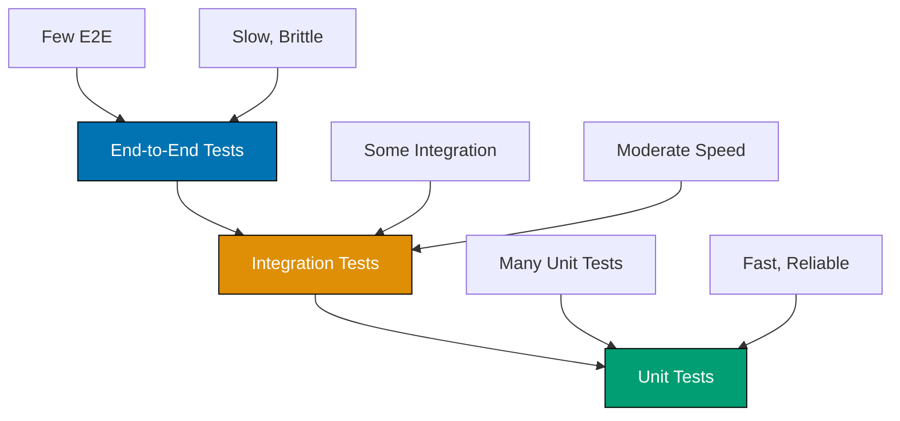

## Problem

Untested code leads to bugs, regressions, and fear of refactoring. Manual testing is slow, error-prone, and doesn't scale. Poor test organization makes tests hard to maintain and understand.

```java
// Problematic approach - no tests
public class UserService {
    public User createUser(String username, String email) {
        // Complex logic - no verification it works
        // Bugs discovered in production
        return new User(username, email);
    }
}
```

This guide shows practical techniques for implementing comprehensive testing strategies with JUnit 5 and Mockito.

## Solution

### 1. JUnit 5 Basics

Write unit tests with JUnit 5 (Jupiter).

**Setup** (Maven dependencies):

```xml
<dependency>
    <groupId>org.junit.jupiter</groupId>
    <artifactId>junit-jupiter</artifactId>
    <version>5.10.1</version>
    <scope>test</scope>
</dependency>
<dependency>
    <groupId>org.mockito</groupId>
    <artifactId>mockito-junit-jupiter</artifactId>
    <version>5.8.0</version>
    <scope>test</scope>
</dependency>
```

**Basic test structure**:

```java
import org.junit.jupiter.api.*;
import static org.junit.jupiter.api.Assertions.*;

class CalculatorTest {
    private Calculator calculator;

    @BeforeAll
    static void setupAll() {
        System.out.println("Run once before all tests");
    }

    @BeforeEach
    void setup() {
        calculator = new Calculator();
        System.out.println("Run before each test");
    }

    @Test
    void addShouldReturnSumOfTwoNumbers() {
        // Arrange
        int a = 5;
        int b = 3;

        // Act
        int result = calculator.add(a, b);

        // Assert
        assertEquals(8, result, "5 + 3 should equal 8");
    }

    @Test
    void divideShouldThrowExceptionWhenDividingByZero() {
        assertThrows(ArithmeticException.class, () -> {
            calculator.divide(10, 0);
        });
    }

    @Test
    @DisplayName("Multiply should handle negative numbers correctly")
    void multiplyShouldHandleNegativeNumbers() {
        assertEquals(-15, calculator.multiply(-5, 3));
        assertEquals(-15, calculator.multiply(5, -3));
        assertEquals(15, calculator.multiply(-5, -3));
    }

    @Test
    @Disabled("Not implemented yet")
    void testFutureFeature() {
        // Skipped during test execution
    }

    @AfterEach
    void tearDown() {
        calculator = null;
        System.out.println("Run after each test");
    }

    @AfterAll
    static void tearDownAll() {
        System.out.println("Run once after all tests");
    }
}
```

### 2. Parameterized Tests

Test multiple inputs efficiently with parameterized tests.

**Parameterized test patterns**:

```java
import org.junit.jupiter.params.ParameterizedTest;
import org.junit.jupiter.params.provider.*;
import java.util.stream.Stream;

class ParameterizedTestExamples {
    // ValueSource - simple values
    @ParameterizedTest
    @ValueSource(ints = {1, 2, 3, 4, 5})
    void testPositiveNumbers(int number) {
        assertTrue(number > 0);
    }

    @ParameterizedTest
    @ValueSource(strings = {"", "  ", "\t", "\n"})
    void testBlankStrings(String input) {
        assertTrue(input.isBlank());
    }

    // CsvSource - multiple parameters
    @ParameterizedTest
    @CsvSource({
        "1, 1, 2",
        "2, 3, 5",
        "5, 7, 12",
        "100, 200, 300"
    })
    void testAddition(int a, int b, int expected) {
        Calculator calc = new Calculator();
        assertEquals(expected, calc.add(a, b));
    }

    // MethodSource - complex objects
    @ParameterizedTest
    @MethodSource("provideUsersForValidation")
    void testUserValidation(User user, boolean expectedValid) {
        UserValidator validator = new UserValidator();
        assertEquals(expectedValid, validator.isValid(user));
    }

    static Stream<Arguments> provideUsersForValidation() {
        return Stream.of(
            Arguments.of(new User("john", "john@example.com"), true),
            Arguments.of(new User("", "john@example.com"), false),
            Arguments.of(new User("john", "invalid"), false),
            Arguments.of(new User(null, "john@example.com"), false)
        );
    }

    // EnumSource - test all enum values
    @ParameterizedTest
    @EnumSource(DayOfWeek.class)
    void testAllDaysOfWeek(DayOfWeek day) {
        assertNotNull(day);
        assertTrue(day.toString().length() > 0);
    }

    // NullAndEmptySource
    @ParameterizedTest
    @NullAndEmptySource
    @ValueSource(strings = {" ", "\t", "\n"})
    void testNullEmptyAndBlank(String input) {
        assertTrue(input == null || input.isBlank());
    }

    // Custom display names
    @ParameterizedTest(name = "[{index}] {0} + {1} = {2}")
    @CsvSource({"1,1,2", "2,3,5", "5,7,12"})
    void testWithCustomDisplayName(int a, int b, int expected) {
        assertEquals(expected, a + b);
    }
}
```

### 3. Mocking with Mockito

Isolate units under test by mocking dependencies.

**Mockito basics**:

```java
import org.mockito.*;
import org.junit.jupiter.api.Test;
import org.junit.jupiter.api.extension.ExtendWith;
import org.mockito.junit.jupiter.MockitoExtension;
import static org.mockito.Mockito.*;
import static org.junit.jupiter.api.Assertions.*;

@ExtendWith(MockitoExtension.class)
class UserServiceTest {
    @Mock
    private UserRepository userRepository;

    @Mock
    private EmailService emailService;

    @InjectMocks
    private UserService userService;

    @Test
    void createUserShouldSaveAndSendEmail() {
        // Arrange
        User user = new User("john", "john@example.com");
        when(userRepository.save(any(User.class))).thenReturn(user);

        // Act
        User result = userService.createUser("john", "john@example.com");

        // Assert
        assertNotNull(result);
        verify(userRepository).save(any(User.class));
        verify(emailService).sendWelcomeEmail(user);
    }

    @Test
    void getUserShouldReturnUserFromRepository() {
        // Arrange
        Long userId = 1L;
        User mockUser = new User("john", "john@example.com");
        when(userRepository.findById(userId)).thenReturn(Optional.of(mockUser));

        // Act
        User result = userService.getUser(userId);

        // Assert
        assertEquals(mockUser, result);
        verify(userRepository).findById(userId);
    }

    @Test
    void getUserShouldThrowExceptionWhenNotFound() {
        // Arrange
        Long userId = 999L;
        when(userRepository.findById(userId)).thenReturn(Optional.empty());

        // Act & Assert
        assertThrows(ResourceNotFoundException.class, () -> {
            userService.getUser(userId);
        });
    }

    @Test
    void testArgumentCaptor() {
        // Arrange
        ArgumentCaptor<User> userCaptor = ArgumentCaptor.forClass(User.class);
        User user = new User("john", "john@example.com");
        when(userRepository.save(any(User.class))).thenReturn(user);

        // Act
        userService.createUser("john", "john@example.com");

        // Assert - capture and verify saved user
        verify(userRepository).save(userCaptor.capture());
        User capturedUser = userCaptor.getValue();
        assertEquals("john", capturedUser.getUsername());
        assertEquals("john@example.com", capturedUser.getEmail());
    }

    @Test
    void testMultipleInvocations() {
        // Arrange
        User user1 = new User("user1", "user1@example.com");
        User user2 = new User("user2", "user2@example.com");

        // Act
        userService.processUsers(List.of(user1, user2));

        // Assert
        verify(emailService, times(2)).sendWelcomeEmail(any(User.class));
        verify(emailService).sendWelcomeEmail(user1);
        verify(emailService).sendWelcomeEmail(user2);
    }

    @Test
    void testVoidMethod() {
        // Arrange
        doNothing().when(emailService).sendWelcomeEmail(any(User.class));

        // Or verify exception thrown
        doThrow(new EmailException("SMTP error"))
            .when(emailService).sendWelcomeEmail(any(User.class));

        // Act & Assert
        assertThrows(EmailException.class, () -> {
            emailService.sendWelcomeEmail(new User("john", "john@example.com"));
        });
    }
}
```

### 4. Test Organization and Best Practices

Organize tests for maintainability and clarity.

**Test organization strategies**:

```java
import org.junit.jupiter.api.*;

// Nested test classes for logical grouping
@DisplayName("User Service")
class UserServiceTest {
    private UserService userService;
    private UserRepository userRepository;

    @BeforeEach
    void setup() {
        userRepository = mock(UserRepository.class);
        userService = new UserService(userRepository);
    }

    @Nested
    @DisplayName("When creating user")
    class CreateUserTests {
        @Test
        @DisplayName("should save user to repository")
        void shouldSaveUserToRepository() {
            User user = new User("john", "john@example.com");
            when(userRepository.save(any(User.class))).thenReturn(user);

            userService.createUser("john", "john@example.com");

            verify(userRepository).save(any(User.class));
        }

        @Test
        @DisplayName("should throw exception for blank username")
        void shouldThrowExceptionForBlankUsername() {
            assertThrows(ValidationException.class, () -> {
                userService.createUser("", "john@example.com");
            });
        }

        @Test
        @DisplayName("should throw exception for invalid email")
        void shouldThrowExceptionForInvalidEmail() {
            assertThrows(ValidationException.class, () -> {
                userService.createUser("john", "invalid-email");
            });
        }
    }

    @Nested
    @DisplayName("When updating user")
    class UpdateUserTests {
        @Test
        @DisplayName("should update existing user")
        void shouldUpdateExistingUser() {
            Long userId = 1L;
            User existingUser = new User("john", "john@example.com");
            when(userRepository.findById(userId)).thenReturn(Optional.of(existingUser));

            userService.updateUser(userId, "john_doe", "john.doe@example.com");

            verify(userRepository).save(argThat(user ->
                user.getUsername().equals("john_doe") &&
                user.getEmail().equals("john.doe@example.com")
            ));
        }

        @Test
        @DisplayName("should throw exception when user not found")
        void shouldThrowExceptionWhenUserNotFound() {
            Long userId = 999L;
            when(userRepository.findById(userId)).thenReturn(Optional.empty());

            assertThrows(ResourceNotFoundException.class, () -> {
                userService.updateUser(userId, "john", "john@example.com");
            });
        }
    }

    @Nested
    @DisplayName("When deleting user")
    class DeleteUserTests {
        @Test
        @DisplayName("should delete existing user")
        void shouldDeleteExistingUser() {
            Long userId = 1L;
            when(userRepository.existsById(userId)).thenReturn(true);

            userService.deleteUser(userId);

            verify(userRepository).deleteById(userId);
        }

        @Test
        @DisplayName("should throw exception when user not found")
        void shouldThrowExceptionWhenUserNotFound() {
            Long userId = 999L;
            when(userRepository.existsById(userId)).thenReturn(false);

            assertThrows(ResourceNotFoundException.class, () -> {
                userService.deleteUser(userId);
            });
        }
    }
}
```

### 5. Test-Driven Development (TDD)

Write tests before implementation.

**TDD cycle (Red-Green-Refactor)**:

```java
// Step 1: Write failing test (RED)
@Test
void calculateDiscountShouldApply10PercentForVipCustomers() {
    PricingService pricing = new PricingService();
    Customer vipCustomer = new Customer("VIP", CustomerType.VIP);

    double price = pricing.calculateDiscount(100.0, vipCustomer);

    assertEquals(90.0, price); // 10% discount
}
// Test fails - calculateDiscount doesn't exist yet

// Step 2: Write minimal code to pass (GREEN)
public class PricingService {
    public double calculateDiscount(double price, Customer customer) {
        if (customer.getType() == CustomerType.VIP) {
            return price * 0.9; // 10% discount
        }
        return price;
    }
}
// Test passes

// Step 3: Refactor (REFACTOR)
public class PricingService {
    private static final double VIP_DISCOUNT = 0.10;
    private static final double REGULAR_DISCOUNT = 0.0;

    public double calculateDiscount(double price, Customer customer) {
        double discountRate = getDiscountRate(customer.getType());
        return price * (1 - discountRate);
    }

    private double getDiscountRate(CustomerType type) {
        return switch (type) {
            case VIP -> VIP_DISCOUNT;
            case REGULAR -> REGULAR_DISCOUNT;
        };
    }
}
// Test still passes, code cleaner

// Step 4: Add more tests
@Test
void calculateDiscountShouldApplyNoDiscountForRegularCustomers() {
    PricingService pricing = new PricingService();
    Customer regularCustomer = new Customer("Regular", CustomerType.REGULAR);

    double price = pricing.calculateDiscount(100.0, regularCustomer);

    assertEquals(100.0, price); // No discount
}

// Continue TDD cycle for all requirements
```

## How It Works

### Test Pyramid



**Key concepts**:

1. **Unit Tests**: Test individual methods/classes in isolation (70-80% of tests)
2. **Integration Tests**: Test interactions between components (15-25% of tests)
3. **End-to-End Tests**: Test complete user workflows (5-10% of tests)
4. **Test Pyramid**: Many fast unit tests, fewer slow integration/E2E tests
5. **Arrange-Act-Assert**: Structure tests clearly (setup, execute, verify)

### Test Lifecycle

JUnit 5 test lifecycle hooks:

- **@BeforeAll**: Run once before all tests (static method)
- **@BeforeEach**: Run before each test method
- **@Test**: Individual test case
- **@AfterEach**: Run after each test method
- **@AfterAll**: Run once after all tests (static method)

## Variations

### Spring Boot Testing

```java
import org.springframework.boot.test.context.SpringBootTest;
import org.springframework.test.context.junit.jupiter.SpringExtension;
import org.springframework.beans.factory.annotation.Autowired;

@SpringBootTest
@ExtendWith(SpringExtension.class)
class UserServiceIntegrationTest {
    @Autowired
    private UserService userService;

    @Autowired
    private UserRepository userRepository;

    @Test
    void integrationTestWithRealDatabase() {
        User user = userService.createUser("john", "john@example.com");

        User found = userRepository.findById(user.getId()).orElseThrow();
        assertEquals("john", found.getUsername());
    }
}

// Web layer testing
@WebMvcTest(UserController.class)
class UserControllerTest {
    @Autowired
    private MockMvc mockMvc;

    @MockBean
    private UserService userService;

    @Test
    void getUserShouldReturnUser() throws Exception {
        User user = new User(1L, "john", "john@example.com");
        when(userService.getUser(1L)).thenReturn(user);

        mockMvc.perform(get("/api/users/1"))
            .andExpect(status().isOk())
            .andExpect(jsonPath("$.username").value("john"));
    }
}
```

### AssertJ Fluent Assertions

```java
import static org.assertj.core.api.Assertions.*;

@Test
void testWithAssertJ() {
    User user = new User("john", "john@example.com");

    assertThat(user.getUsername())
        .isNotNull()
        .isEqualTo("john")
        .startsWith("jo")
        .hasSize(4);

    assertThat(user.getEmail())
        .contains("@")
        .endsWith(".com");

    List<User> users = List.of(user);
    assertThat(users)
        .hasSize(1)
        .contains(user)
        .extracting(User::getUsername)
        .contains("john");
}
```

### Test Containers

```java
import org.testcontainers.containers.PostgreSQLContainer;
import org.testcontainers.junit.jupiter.Container;
import org.testcontainers.junit.jupiter.Testcontainers;

@Testcontainers
class DatabaseIntegrationTest {
    @Container
    static PostgreSQLContainer<?> postgres = new PostgreSQLContainer<>("postgres:15")
        .withDatabaseName("testdb")
        .withUsername("test")
        .withPassword("test");

    @Test
    void testWithRealDatabase() {
        // Test with real PostgreSQL container
        String jdbcUrl = postgres.getJdbcUrl();
        // Connect and test
    }
}
```

## Common Pitfalls

**Pitfall 1: Testing Implementation Details**

Test behavior, not implementation:

```java
// Bad: Testing implementation
@Test
void testInternalCachingLogic() {
    userService.getUser(1L);
    verify(userService.cache).put(1L, any()); // Testing internal cache
}

// Good: Testing behavior
@Test
void getUserShouldReturnSameUserOnSecondCall() {
    User user1 = userService.getUser(1L);
    User user2 = userService.getUser(1L);
    assertSame(user1, user2); // Behavior: returns same instance
}
```

**Pitfall 2: Fragile Tests**

Avoid tests that break on minor changes:

```java
// Bad: Hard-coded values
@Test
void testToString() {
    User user = new User("john", "john@example.com");
    assertEquals("User[name=john, email=john@example.com]", user.toString());
    // Breaks if toString format changes
}

// Good: Test essential properties
@Test
void testToString() {
    User user = new User("john", "john@example.com");
    String result = user.toString();
    assertThat(result).contains("john", "john@example.com");
}
```

**Pitfall 3: Test Interdependence**

Tests should be independent:

```java
// Bad: Tests depend on execution order
static User globalUser;

@Test
void test1_createUser() {
    globalUser = userService.createUser("john", "john@example.com");
}

@Test
void test2_updateUser() {
    userService.updateUser(globalUser.getId(), "john_doe", "..."); // Depends on test1
}

// Good: Independent tests
@Test
void createUserShouldSaveToDatabase() {
    User user = userService.createUser("john", "john@example.com");
    assertNotNull(user.getId());
}

@Test
void updateUserShouldModifyExistingUser() {
    User user = userService.createUser("john", "john@example.com");
    userService.updateUser(user.getId(), "john_doe", "...");
    // Each test self-contained
}
```

**Pitfall 4: Ignoring Test Failures**

Never ignore or disable failing tests:

```java
// Bad: Disabling failing test
@Test
@Disabled("Fails sometimes") // Technical debt!
void flakyTest() {
    // Fix instead of disabling
}

// Good: Fix flaky tests
@Test
void reliableTest() {
    // Deterministic test
    // No timing dependencies
    // No shared state
}
```

## Related Patterns

**Related Tutorial**: See [Intermediate Tutorial - Testing](../tutorials/intermediate.md#testing) for testing fundamentals and [Advanced Tutorial - TDD](../tutorials/advanced.md#tdd) for test-driven development.

**Related How-To**: See [Write Effective Tests](./write-effective-tests.md) for test best practices and [Dependency Injection with Spring](./dependency-injection-spring.md) for testable dependency management.

**Related Cookbook**: See Cookbook recipes "JUnit 5 Test Templates", "Mockito Patterns", and "Test Organization Strategies" for copy-paste ready testing implementations.

**Related Explanation**: See [Best Practices - Testing](../explanation/best-practices.md#testing) for testing principles.

## Further Reading

- [JUnit 5 User Guide](https://junit.org/junit5/docs/current/user-guide/) - Official JUnit 5 documentation
- [Mockito Documentation](https://javadoc.io/doc/org.mockito/mockito-core/latest/org/mockito/Mockito.html) - Mockito API reference
- [Test-Driven Development](https://www.oreilly.com/library/view/test-driven-development/0321146530/) - Kent Beck's TDD book
- [Spring Boot Testing](https://docs.spring.io/spring-boot/reference/testing/index.html) - Spring Boot test support
