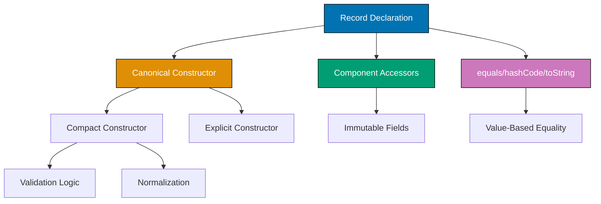

## Problem

Creating immutable data classes requires extensive boilerplate code for constructors, getters, equals, hashCode, and toString methods. This verbosity obscures the actual data structure.

```java
// Problematic approach - verbose boilerplate
public final class Point {
    private final int x;
    private final int y;

    public Point(int x, int y) {
        this.x = x;
        this.y = y;
    }

    public int getX() { return x; }
    public int getY() { return y; }

    @Override
    public boolean equals(Object obj) {
        if (this == obj) return true;
        if (!(obj instanceof Point)) return false;
        Point other = (Point) obj;
        return x == other.x && y == other.y;
    }

    @Override
    public int hashCode() {
        return Objects.hash(x, y);
    }

    @Override
    public String toString() {
        return "Point[x=" + x + ", y=" + y + "]";
    }
}
```

This guide shows practical techniques for using Java records to eliminate boilerplate and create clean, immutable data carriers.

## Solution

### 1. Basic Record Definition

Records provide automatic implementation of constructor, getters, equals, hashCode, and toString.

**Simple record**:

```java
// Equivalent to 50+ lines of traditional class
public record Point(int x, int y) {}

// Usage
Point p1 = new Point(10, 20);
System.out.println(p1.x());        // Accessor: x()
System.out.println(p1.y());        // Accessor: y()
System.out.println(p1);            // Point[x=10, y=20]

Point p2 = new Point(10, 20);
System.out.println(p1.equals(p2)); // true (value-based equality)
System.out.println(p1.hashCode() == p2.hashCode()); // true

// Records are immutable - no setters
// p1.x = 15; // Compilation error
```

**Record with validation**:

```java
public record User(String username, String email, int age) {
    // Compact constructor - validates parameters
    public User {
        if (username == null || username.isBlank()) {
            throw new IllegalArgumentException("Username cannot be blank");
        }
        if (email == null || !email.contains("@")) {
            throw new IllegalArgumentException("Invalid email format");
        }
        if (age < 0 || age > 150) {
            throw new IllegalArgumentException("Invalid age: " + age);
        }
    }

    // Custom method
    public boolean isAdult() {
        return age >= 18;
    }

    // Static factory method
    public static User createGuest() {
        return new User("guest", "guest@example.com", 0);
    }
}

// Usage
User user = new User("john_doe", "john@example.com", 25);
System.out.println(user.isAdult()); // true

// Validation triggered
try {
    new User("", "invalid", -5); // Throws IllegalArgumentException
} catch (IllegalArgumentException e) {
    System.err.println(e.getMessage());
}
```

### 2. Records with Additional Behavior

Add methods and implement interfaces while maintaining immutability.

**Record with methods and interfaces**:

```java
public record Temperature(double celsius) implements Comparable<Temperature> {
    // Compact constructor with normalization
    public Temperature {
        if (celsius < -273.15) {
            throw new IllegalArgumentException("Below absolute zero");
        }
    }

    // Conversion methods
    public double fahrenheit() {
        return celsius * 9/5 + 32;
    }

    public double kelvin() {
        return celsius + 273.15;
    }

    // Interface implementation
    @Override
    public int compareTo(Temperature other) {
        return Double.compare(this.celsius, other.celsius);
    }

    // Static factory methods
    public static Temperature fromFahrenheit(double fahrenheit) {
        return new Temperature((fahrenheit - 32) * 5/9);
    }

    public static Temperature fromKelvin(double kelvin) {
        return new Temperature(kelvin - 273.15);
    }

    // Derived properties
    public boolean isFreezing() {
        return celsius <= 0;
    }

    public boolean isBoiling() {
        return celsius >= 100;
    }
}

// Usage
Temperature temp = new Temperature(25.0);
System.out.println(temp.celsius());      // 25.0
System.out.println(temp.fahrenheit());   // 77.0
System.out.println(temp.kelvin());       // 298.15

Temperature cold = Temperature.fromFahrenheit(32.0);
System.out.println(cold.isFreezing());   // true

// Sorting
List<Temperature> temps = List.of(
    new Temperature(25), new Temperature(10), new Temperature(30)
);
List<Temperature> sorted = temps.stream()
    .sorted()
    .toList();
```

### 3. Pattern Matching with Records (Java 21+)

Decompose records using pattern matching in switch expressions.

**Pattern matching**:

```java
public sealed interface Shape permits Circle, Rectangle, Triangle {}

public record Circle(double radius) implements Shape {
    public Circle {
        if (radius <= 0) throw new IllegalArgumentException("Invalid radius");
    }
}

public record Rectangle(double width, double height) implements Shape {
    public Rectangle {
        if (width <= 0 || height <= 0) {
            throw new IllegalArgumentException("Invalid dimensions");
        }
    }
}

public record Triangle(double base, double height) implements Shape {
    public Triangle {
        if (base <= 0 || height <= 0) {
            throw new IllegalArgumentException("Invalid dimensions");
        }
    }
}

public class ShapeCalculator {
    // Pattern matching with records (Java 21+)
    public static double calculateArea(Shape shape) {
        return switch (shape) {
            case Circle(double r) -> Math.PI * r * r;
            case Rectangle(double w, double h) -> w * h;
            case Triangle(double b, double h) -> 0.5 * b * h;
        };
    }

    // Pattern matching with guards
    public static String describe(Shape shape) {
        return switch (shape) {
            case Circle(double r) when r > 10 -> "Large circle";
            case Circle(double r) -> "Small circle";
            case Rectangle(double w, double h) when w == h -> "Square";
            case Rectangle(double w, double h) -> "Rectangle";
            case Triangle(double b, double h) -> "Triangle";
        };
    }

    public static void main(String[] args) {
        Shape circle = new Circle(5.0);
        Shape rectangle = new Rectangle(4.0, 6.0);
        Shape square = new Rectangle(5.0, 5.0);

        System.out.println(calculateArea(circle));    // 78.54
        System.out.println(calculateArea(rectangle)); // 24.0

        System.out.println(describe(circle));         // Small circle
        System.out.println(describe(square));         // Square
    }
}
```

### 4. Nested Records and Collections

Use records for complex data structures.

**Nested records**:

```java
public record Address(String street, String city, String zipCode) {
    public Address {
        if (street == null || city == null || zipCode == null) {
            throw new IllegalArgumentException("Address fields cannot be null");
        }
    }
}

public record Person(String name, int age, Address address) {
    public Person {
        if (name == null || name.isBlank()) {
            throw new IllegalArgumentException("Name cannot be blank");
        }
        if (age < 0) {
            throw new IllegalArgumentException("Age cannot be negative");
        }
        if (address == null) {
            throw new IllegalArgumentException("Address cannot be null");
        }
    }

    // Method to create updated person with new address
    public Person withAddress(Address newAddress) {
        return new Person(this.name, this.age, newAddress);
    }

    // Method to create updated person with new age
    public Person withAge(int newAge) {
        return new Person(this.name, newAge, this.address);
    }
}

// Usage
Address addr = new Address("123 Main St", "Springfield", "12345");
Person person = new Person("John Doe", 30, addr);

// Immutable update - creates new instance
Address newAddr = new Address("456 Oak Ave", "Springfield", "12345");
Person relocated = person.withAddress(newAddr);

System.out.println(person.address().street());    // 123 Main St
System.out.println(relocated.address().street()); // 456 Oak Ave
```

**Record with collections**:

```java
import java.util.List;
import java.util.Collections;

public record Order(String orderId, List<String> items, double total) {
    // Defensive copy in compact constructor
    public Order {
        if (orderId == null || orderId.isBlank()) {
            throw new IllegalArgumentException("Order ID required");
        }
        if (items == null) {
            throw new IllegalArgumentException("Items cannot be null");
        }
        if (total < 0) {
            throw new IllegalArgumentException("Total cannot be negative");
        }
        // Create immutable copy to prevent external modification
        items = List.copyOf(items);
    }

    // Custom accessor that returns unmodifiable view
    @Override
    public List<String> items() {
        return items; // Already immutable from constructor
    }

    public int itemCount() {
        return items.size();
    }
}

// Usage
List<String> orderItems = new ArrayList<>(List.of("Item1", "Item2"));
Order order = new Order("ORD-001", orderItems, 99.99);

// External modification doesn't affect record
orderItems.add("Item3");
System.out.println(order.itemCount()); // Still 2

// Cannot modify record's items
// order.items().add("Item4"); // UnsupportedOperationException
```

## How It Works

### Record Structure



**Key concepts**:

1. **Immutability**: All record components are implicitly final (cannot be changed after construction)
2. **Value-Based Equality**: equals() compares values, not references
3. **Compact Constructor**: Special syntax for validation without repeating parameter assignments
4. **Component Accessors**: Getters named after components (not prefixed with "get")
5. **Serialization**: Records are serializable with compact serialization format

### Record Restrictions

Records have specific constraints:

- Cannot extend classes (implicitly extend java.lang.Record)
- Cannot declare instance fields (only static fields allowed)
- Cannot be abstract
- Components are implicitly final
- Can implement interfaces
- Can have static members

## Variations

### Local Records (Java 16+)

Define records within methods for local data structures:

```java
public List<String> findTopStudents(List<Student> students) {
    // Local record - scoped to method
    record StudentScore(String name, double average) {}

    return students.stream()
        .map(s -> new StudentScore(s.getName(), s.getGradeAverage()))
        .filter(ss -> ss.average() >= 90.0)
        .sorted((a, b) -> Double.compare(b.average(), a.average()))
        .map(StudentScore::name)
        .toList();
}
```

### Generic Records

Records can be generic:

```java
public record Pair<T, U>(T first, U second) {
    public Pair<U, T> swap() {
        return new Pair<>(second, first);
    }
}

// Usage
Pair<String, Integer> pair = new Pair<>("Age", 25);
Pair<Integer, String> swapped = pair.swap();
System.out.println(swapped); // Pair[first=25, second=Age]
```

### Records as DTOs

Use records for Data Transfer Objects:

```java
// API response DTO
public record ApiResponse<T>(
    boolean success,
    T data,
    String message,
    int statusCode
) {
    public static <T> ApiResponse<T> success(T data) {
        return new ApiResponse<>(true, data, "Success", 200);
    }

    public static <T> ApiResponse<T> error(String message, int statusCode) {
        return new ApiResponse<>(false, null, message, statusCode);
    }
}

// Usage
ApiResponse<User> response = ApiResponse.success(user);
ApiResponse<Void> error = ApiResponse.error("Not found", 404);
```

## Common Pitfalls

**Pitfall 1: Mutable Components**

Records with mutable components break immutability:

```java
// Bad: Mutable component
public record BadOrder(List<String> items) {}

List<String> list = new ArrayList<>(List.of("Item1"));
BadOrder order = new BadOrder(list);
list.add("Item2"); // Modifies order's items!

// Good: Defensive copy
public record GoodOrder(List<String> items) {
    public GoodOrder {
        items = List.copyOf(items); // Immutable copy
    }
}
```

**Pitfall 2: Serialization Without Validation**

Deserialization bypasses compact constructor validation:

```java
// Record with validation
public record ValidatedUser(String username, int age) {
    public ValidatedUser {
        if (age < 0) throw new IllegalArgumentException("Invalid age");
    }
}

// Deserialization may bypass validation - use readResolve
public record SafeUser(String username, int age) implements Serializable {
    public SafeUser {
        validate(username, age);
    }

    private static void validate(String username, int age) {
        if (age < 0) throw new IllegalArgumentException("Invalid age");
    }

    // Called after deserialization
    private Object readResolve() {
        validate(username, age);
        return this;
    }
}
```

**Pitfall 3: Using Records for Entities**

Don't use records for JPA entities or mutable domain objects:

```java
// Bad: Record as JPA entity (records are immutable)
// @Entity
// public record User(Long id, String name) {} // Won't work with JPA

// Good: Use regular class for entities
@Entity
public class User {
    @Id
    private Long id;
    private String name;
    // Mutable - JPA can update fields
}

// Good: Use record for value objects
public record UserId(Long value) {
    public UserId {
        if (value == null || value <= 0) {
            throw new IllegalArgumentException("Invalid user ID");
        }
    }
}
```

**Pitfall 4: Overcomplicating Records**

Keep records simple - use classes for complex behavior:

```java
// Bad: Record with too much logic
public record ComplexUser(String name, int age) {
    public ComplexUser {
        // 50 lines of validation
    }

    // 20 business methods
    public void updateProfile() {}
    public void sendEmail() {}
    // ... many more methods
}

// Good: Use class for complex behavior
public class User {
    private final String name;
    private final int age;
    // Complex business logic here
}

// Good: Use record for simple data
public record UserDto(String name, int age) {}
```

## Related Patterns

**Related Tutorial**: See [Advanced Tutorial - Modern Java Features](../tutorials/advanced.md#modern-java) for records and pattern matching and [Intermediate Tutorial - Immutability](../tutorials/intermediate.md#immutability) for immutable design patterns.

**Related How-To**: See [Use Sealed Classes](./use-sealed-classes.md) for sealed hierarchies with records and [Pattern Matching](./pattern-matching.md) for advanced pattern matching.

**Related Cookbook**: See Cookbook recipes "Record Validation Patterns", "Record with Collections", and "Record-Based DTOs" for copy-paste ready record implementations.

**Related Explanation**: See [Best Practices - Immutability](../explanation/best-practices.md#immutability) for immutability principles.

## Further Reading

- [JEP 395: Records](https://openjdk.org/jeps/395) - Java Enhancement Proposal for records
- [Java Records Tutorial](https://docs.oracle.com/en/java/javase/21/language/records.html) - Official Oracle tutorial
- [Effective Java Records](https://www.baeldung.com/java-record-keyword) - Best practices for records
- [Pattern Matching for Java](https://openjdk.org/jeps/441) - Pattern matching with records
