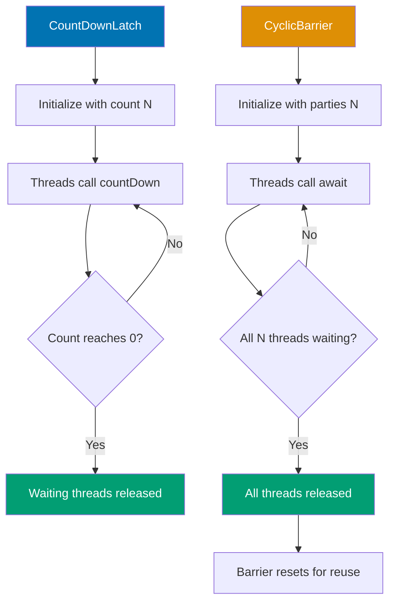
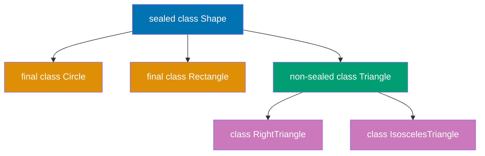
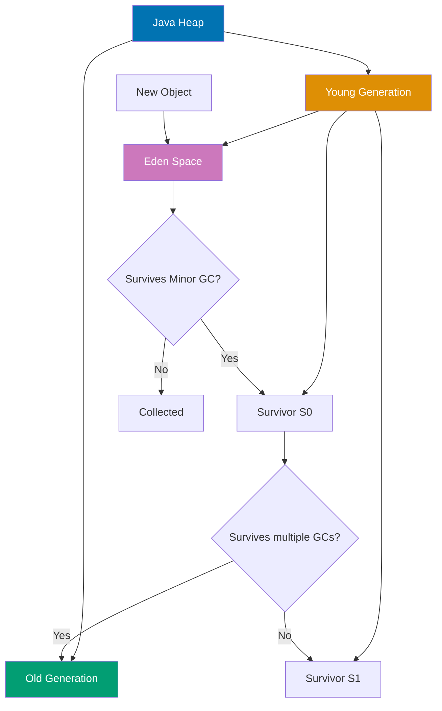
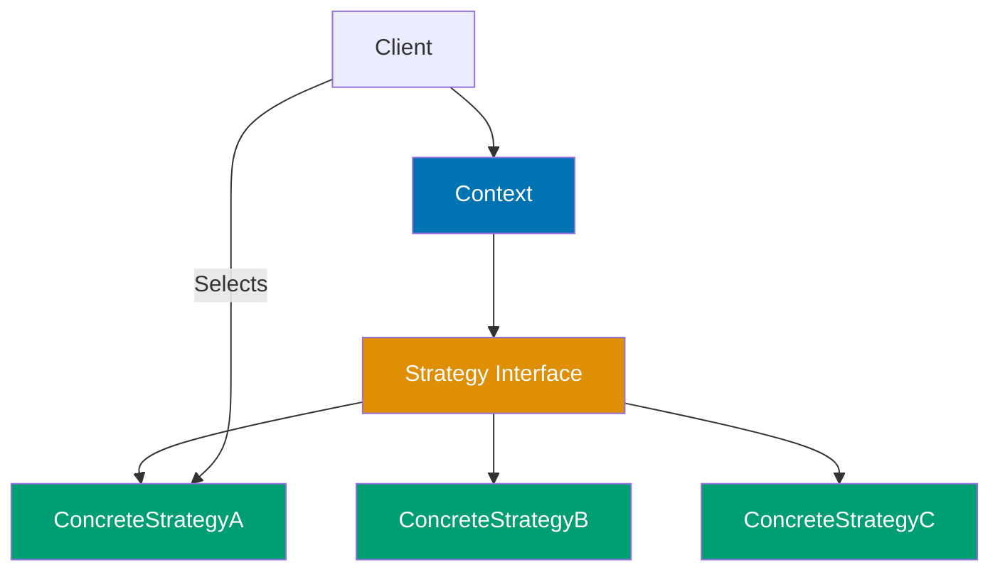
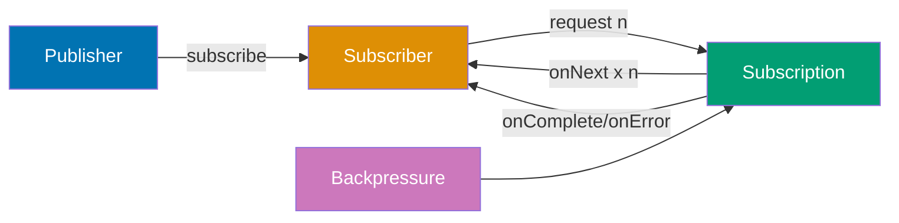
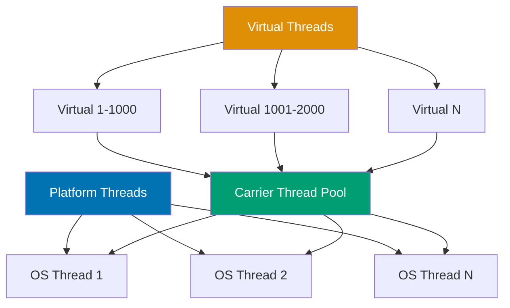

Master advanced Java concepts through 25 annotated code examples. Build on intermediate foundations to explore advanced concurrency, JVM internals, design patterns, and modern Java features.

## Group 1: Advanced Concurrency

### Example 36: Concurrent Collections

Concurrent collections provide thread safety with better performance than synchronized wrappers. `ConcurrentHashMap` offers lock striping. `BlockingQueue` supports producer-consumer patterns.

**Code**:

```java
import java.util.concurrent.*;
import java.util.*;

// ConcurrentHashMap - thread-safe without blocking entire map
ConcurrentHashMap<String, Integer> map = new ConcurrentHashMap<>();

// putIfAbsent - atomic operation
map.putIfAbsent("key1", 100); // => null (key added)
Integer existing = map.putIfAbsent("key1", 200); // => 100 (key exists, not replaced)

// computeIfAbsent - compute value if absent
map.computeIfAbsent("key2", k -> k.length() * 10); // => 40 (key2.length() * 10)

// merge - combine values
map.put("count", 1);
map.merge("count", 5, (old, val) -> old + val); // => 6 (1 + 5)

// CopyOnWriteArrayList - thread-safe list, copy-on-write
CopyOnWriteArrayList<String> list = new CopyOnWriteArrayList<>();
list.add("A");
list.add("B");

// Safe iteration even if list modified during iteration
for (String s : list) {
    System.out.println(s);
    list.add("C"); // Safe - iterator uses snapshot
}

// ConcurrentLinkedQueue - non-blocking FIFO queue
ConcurrentLinkedQueue<String> queue = new ConcurrentLinkedQueue<>();
queue.offer("First");
queue.offer("Second");
String head = queue.poll(); // => "First"

// BlockingQueue - producer-consumer pattern
BlockingQueue<Integer> blockingQueue = new ArrayBlockingQueue<>(10);

// Producer thread
Thread producer = new Thread(() -> {
    try {
        for (int i = 0; i < 5; i++) {
            blockingQueue.put(i); // Blocks if queue full
            System.out.println("Produced: " + i);
        }
    } catch (InterruptedException e) {}
});

// Consumer thread
Thread consumer = new Thread(() -> {
    try {
        for (int i = 0; i < 5; i++) {
            Integer item = blockingQueue.take(); // Blocks if queue empty
            System.out.println("Consumed: " + item);
        }
    } catch (InterruptedException e) {}
});

producer.start();
consumer.start();
```

**Key Takeaway**: `ConcurrentHashMap` provides thread-safe operations with lock striping. `CopyOnWriteArrayList` is safe for iteration-heavy workloads. `BlockingQueue` enables producer-consumer patterns with blocking operations. These collections offer better performance than `Collections.synchronizedXxx()` wrappers.

---

### Example 37: Atomic Variables

Atomic variables use hardware-level Compare-And-Swap (CAS) operations for lock-free concurrency. They provide better performance than synchronized blocks for simple state updates. Ideal for counters, flags, and references.

**Code**:

```java
import java.util.concurrent.atomic.*;

// AtomicInteger - thread-safe integer operations
AtomicInteger counter = new AtomicInteger(0);

// Atomic operations
int current = counter.get(); // => 0
counter.set(10); // Set to 10
int previous = counter.getAndIncrement(); // => 10 (returns old value, increments to 11)
int newValue = counter.incrementAndGet(); // => 12 (increments, returns new value)

// compareAndSet - atomic compare-and-swap
boolean success = counter.compareAndSet(12, 20); // => true (if current == 12, set to 20)
boolean failure = counter.compareAndSet(12, 30); // => false (current is 20, not 12)

// updateAndGet - atomic update with lambda
counter.updateAndGet(v -> v * 2); // => 40 (20 * 2)

// accumulateAndGet - atomic accumulation
counter.accumulateAndGet(5, (current, update) -> current + update); // => 45 (40 + 5)

// AtomicLong - for long values
AtomicLong longCounter = new AtomicLong(1000L);
longCounter.addAndGet(500); // => 1500

// AtomicBoolean - for flags
AtomicBoolean flag = new AtomicBoolean(false);
boolean wasSet = flag.getAndSet(true); // => false (old value), now true

// AtomicReference - for object references
AtomicReference<String> ref = new AtomicReference<>("Hello");
ref.compareAndSet("Hello", "World"); // => true, ref now "World"
String value = ref.get(); // => "World"

// Practical example: thread-safe counter without locks
AtomicInteger sharedCounter = new AtomicInteger(0);
Runnable task = () -> {
    for (int i = 0; i < 1000; i++) {
        sharedCounter.incrementAndGet(); // Thread-safe increment
    }
};

Thread t1 = new Thread(task);
Thread t2 = new Thread(task);
t1.start();
t2.start();
t1.join();
t2.join();
System.out.println("Final count: " + sharedCounter.get()); // => 2000 (always correct)
```

**Key Takeaway**: Atomic variables use CAS for lock-free thread safety. Better performance than synchronized for simple operations. Use `incrementAndGet()` for post-increment, `getAndIncrement()` for pre-increment behavior. `compareAndSet()` enables atomic conditional updates.

---

### Example 38: CountDownLatch and CyclicBarrier

`CountDownLatch` allows threads to wait until a set of operations completes. `CyclicBarrier` synchronizes threads at a common barrier point. Both coordinate multi-threaded workflows but serve different patterns.



**Code**:

```java
import java.util.concurrent.*;

// CountDownLatch - wait for multiple events
CountDownLatch latch = new CountDownLatch(3); // Wait for 3 events

// Worker threads count down
for (int i = 0; i < 3; i++) {
    int taskId = i;
    new Thread(() -> {
        System.out.println("Task " + taskId + " starting");
        try { Thread.sleep(1000); } catch (InterruptedException e) {}
        System.out.println("Task " + taskId + " done");
        latch.countDown(); // Decrement count
    }).start();
}

// Main thread waits for all tasks
latch.await(); // Blocks until count reaches 0
System.out.println("All tasks completed!"); // Prints after all 3 tasks done

// CyclicBarrier - synchronize threads at barrier
CyclicBarrier barrier = new CyclicBarrier(3, () -> {
    System.out.println("All threads reached barrier!"); // Barrier action
});

// Threads wait at barrier
for (int i = 0; i < 3; i++) {
    int threadId = i;
    new Thread(() -> {
        try {
            System.out.println("Thread " + threadId + " working");
            Thread.sleep(1000);
            System.out.println("Thread " + threadId + " waiting at barrier");
            barrier.await(); // Wait for all threads
            System.out.println("Thread " + threadId + " continues after barrier");
        } catch (Exception e) {}
    }).start();
}

// Barrier can be reused (cyclic)
// After all threads pass, barrier resets for next use

// Semaphore - control access to limited resources
Semaphore semaphore = new Semaphore(2); // Allow 2 concurrent accesses

Runnable task = () -> {
    try {
        semaphore.acquire(); // Acquire permit (blocks if none available)
        System.out.println(Thread.currentThread().getName() + " acquired permit");
        Thread.sleep(2000); // Simulate work
        System.out.println(Thread.currentThread().getName() + " releasing permit");
        semaphore.release(); // Release permit
    } catch (InterruptedException e) {}
};

// 5 threads compete for 2 permits
for (int i = 0; i < 5; i++) {
    new Thread(task, "Thread-" + i).start();
}
```

**Key Takeaway**: `CountDownLatch` is one-time use for waiting on multiple events. `CyclicBarrier` is reusable for synchronizing threads at a common point. `Semaphore` controls access to limited resources with permits. Choose based on coordination pattern.

---

### Example 39: Fork/Join Framework

Fork/Join framework enables efficient parallel processing of recursive tasks. It uses work-stealing queues where idle threads steal work from busy threads. Powers parallel streams under the hood.

**Code**:

```java
import java.util.concurrent.*;

// RecursiveTask - returns a result
class SumTask extends RecursiveTask<Long> {
    private final long[] array;
    private final int start, end;
    private static final int THRESHOLD = 1000;

    public SumTask(long[] array, int start, int end) {
        this.array = array;
        this.start = start;
        this.end = end;
    }

    @Override
    protected Long compute() {
        int length = end - start;

        // Base case: compute directly if small enough
        if (length <= THRESHOLD) {
            long sum = 0;
            for (int i = start; i < end; i++) {
                sum += array[i];
            }
            return sum;
        }

        // Recursive case: split into subtasks
        int mid = start + length / 2;
        SumTask leftTask = new SumTask(array, start, mid);
        SumTask rightTask = new SumTask(array, mid, end);

        leftTask.fork(); // Async execute left
        long rightResult = rightTask.compute(); // Compute right in current thread
        long leftResult = leftTask.join(); // Wait for left result

        return leftResult + rightResult;
    }
}

// Using ForkJoinPool
long[] numbers = new long[10000];
for (int i = 0; i < numbers.length; i++) {
    numbers[i] = i + 1;
}

ForkJoinPool pool = new ForkJoinPool(); // Default: Runtime.availableProcessors() threads
SumTask task = new SumTask(numbers, 0, numbers.length);
long result = pool.invoke(task); // => 50005000 (sum of 1 to 10000)

// RecursiveAction - no result (void)
class PrintTask extends RecursiveAction {
    private final int start, end;
    private static final int THRESHOLD = 10;

    public PrintTask(int start, int end) {
        this.start = start;
        this.end = end;
    }

    @Override
    protected void compute() {
        if (end - start <= THRESHOLD) {
            for (int i = start; i < end; i++) {
                System.out.println("Processing: " + i);
            }
        } else {
            int mid = start + (end - start) / 2;
            PrintTask left = new PrintTask(start, mid);
            PrintTask right = new PrintTask(mid, end);
            invokeAll(left, right); // Fork both and wait for completion
        }
    }
}

PrintTask printTask = new PrintTask(0, 100);
pool.invoke(printTask); // Prints 0 to 99 in parallel

// Parallel streams use ForkJoinPool.commonPool()
long parallelSum = java.util.stream.LongStream.range(1, 10001)
    .parallel() // Uses ForkJoinPool internally
    .sum(); // => 50005000
```

**Key Takeaway**: Fork/Join splits recursive tasks for parallel execution. `RecursiveTask<V>` returns results, `RecursiveAction` doesn't. Work-stealing balances load across threads. Use for divide-and-conquer algorithms. Parallel streams leverage this framework.

---

## Group 2: Advanced Language Features

### Example 40: Annotations and Reflection

Annotations add metadata to code for compile-time and runtime processing. Reflection inspects and manipulates code at runtime. Together they enable frameworks like Spring and JUnit to work their magic.

**Code**:

```java
import java.lang.annotation.*;
import java.lang.reflect.*;

// Custom annotation definition
@Retention(RetentionPolicy.RUNTIME) // Available at runtime
@Target(ElementType.METHOD) // Can be applied to methods
@interface Test {
    String description() default ""; // Annotation parameter
    int timeout() default 0;
}

// Another annotation for classes
@Retention(RetentionPolicy.RUNTIME)
@Target(ElementType.TYPE)
@interface Component {
    String value();
}

// Using custom annotations
@Component("UserService")
class UserService {
    @Test(description = "Verify user creation", timeout = 5000)
    public void testCreateUser() {
        System.out.println("Testing user creation");
    }

    @Test(description = "Verify user deletion")
    public void testDeleteUser() {
        System.out.println("Testing user deletion");
    }

    public void helperMethod() {
        // No annotation
    }
}

// Reflection - inspecting annotations at runtime
Class<?> clazz = UserService.class;

// Check if class has annotation
if (clazz.isAnnotationPresent(Component.class)) {
    Component component = clazz.getAnnotation(Component.class);
    System.out.println("Component name: " + component.value()); // => "UserService"
}

// Find all methods with @Test annotation
Method[] methods = clazz.getDeclaredMethods();
for (Method method : methods) {
    if (method.isAnnotationPresent(Test.class)) {
        Test test = method.getAnnotation(Test.class);
        System.out.println("Test: " + method.getName());
        System.out.println("  Description: " + test.description());
        System.out.println("  Timeout: " + test.timeout());

        // Invoke method using reflection
        try {
            Object instance = clazz.getDeclaredConstructor().newInstance();
            method.invoke(instance); // Calls the test method
        } catch (Exception e) {
            e.printStackTrace();
        }
    }
}

// Reflection - inspecting class structure
Field[] fields = clazz.getDeclaredFields();
for (Field field : fields) {
    System.out.println("Field: " + field.getName() + " (" + field.getType() + ")");
}

// Accessing private fields (be careful!)
class Person {
    private String name = "Alice";
}

Person person = new Person();
Field nameField = Person.class.getDeclaredField("name");
nameField.setAccessible(true); // Bypass private access
String name = (String) nameField.get(person); // => "Alice"
nameField.set(person, "Bob"); // Modify private field

// Built-in annotations
@Override // Compile-time check for method overriding
@Deprecated(since = "2.0") // Mark as deprecated
@SuppressWarnings("unchecked") // Suppress compiler warnings
class Example {
    @Override
    public String toString() { return "Example"; }
}
```

**Key Takeaway**: Annotations add metadata with `@interface`. `@Retention` controls lifecycle (SOURCE/CLASS/RUNTIME). `@Target` specifies where annotations apply. Reflection reads annotations and manipulates code at runtime via `Class`, `Method`, `Field`. Enables framework magic but slower than direct access.

---

### Example 41: Enums with Behavior

Enums are type-safe constants that can have fields, methods, and constant-specific behavior. They're more powerful than simple integer constants and integrate seamlessly with switch statements.

**Code**:

```java
// Basic enum
enum Day {
    MONDAY, TUESDAY, WEDNESDAY, THURSDAY, FRIDAY, SATURDAY, SUNDAY
}

Day today = Day.MONDAY;
System.out.println(today); // => MONDAY
System.out.println(today.ordinal()); // => 0 (position in enum)

// Enum with fields and methods
enum Planet {
    MERCURY(3.303e23, 2.4397e6),
    VENUS(4.869e24, 6.0518e6),
    EARTH(5.976e24, 6.37814e6),
    MARS(6.421e23, 3.3972e6);

    private final double mass; // kg
    private final double radius; // meters

    // Constructor (always private)
    Planet(double mass, double radius) {
        this.mass = mass;
        this.radius = radius;
    }

    public double surfaceGravity() {
        final double G = 6.67300E-11;
        return G * mass / (radius * radius);
    }

    public double surfaceWeight(double otherMass) {
        return otherMass * surfaceGravity();
    }
}

double earthWeight = 75.0; // kg
double marsWeight = Planet.MARS.surfaceWeight(earthWeight); // => ~28.4 kg

// Enum with abstract methods (constant-specific behavior)
enum Operation {
    PLUS {
        @Override
        public double apply(double x, double y) { return x + y; }
    },
    MINUS {
        @Override
        public double apply(double x, double y) { return x - y; }
    },
    TIMES {
        @Override
        public double apply(double x, double y) { return x * y; }
    },
    DIVIDE {
        @Override
        public double apply(double x, double y) { return x / y; }
    };

    public abstract double apply(double x, double y);
}

double result = Operation.PLUS.apply(5, 3); // => 8.0
double product = Operation.TIMES.apply(4, 7); // => 28.0

// Enum methods
Day[] days = Day.values(); // => [MONDAY, TUESDAY, ...]
Day day = Day.valueOf("FRIDAY"); // => FRIDAY

// Switch with enum (exhaustive in modern Java)
String typeOfDay = switch (today) {
    case MONDAY, TUESDAY, WEDNESDAY, THURSDAY, FRIDAY -> "Weekday";
    case SATURDAY, SUNDAY -> "Weekend";
};

// EnumSet - efficient set implementation for enums
import java.util.*;
EnumSet<Day> weekend = EnumSet.of(Day.SATURDAY, Day.SUNDAY);
EnumSet<Day> weekdays = EnumSet.range(Day.MONDAY, Day.FRIDAY);

// EnumMap - efficient map with enum keys
EnumMap<Day, String> schedule = new EnumMap<>(Day.class);
schedule.put(Day.MONDAY, "Team meeting");
schedule.put(Day.WEDNESDAY, "Code review");
```

**Key Takeaway**: Enums are type-safe constants with fields, methods, and constructors. Constant-specific behavior via abstract methods enables polymorphism. `values()` and `valueOf()` provide iteration and lookup. `EnumSet` and `EnumMap` offer efficient enum-based collections.

---

### Example 42: Sealed Classes and Pattern Matching

Sealed classes restrict which classes can extend or implement them, enabling exhaustive pattern matching. Pattern matching eliminates casts and enables type-safe, concise code. Available in Java 17+.



**Code**:

```java
// Sealed class - restricted inheritance hierarchy
sealed class Shape permits Circle, Rectangle, Triangle {
    // Only Circle, Rectangle, Triangle can extend Shape
}

// Permitted subclasses must be final, sealed, or non-sealed
final class Circle extends Shape {
    private final double radius;
    public Circle(double radius) { this.radius = radius; }
    public double area() { return Math.PI * radius * radius; }
}

final class Rectangle extends Shape {
    private final double width, height;
    public Rectangle(double width, double height) {
        this.width = width;
        this.height = height;
    }
    public double area() { return width * height; }
}

non-sealed class Triangle extends Shape {
    // non-sealed: allows further subclassing
    private final double base, height;
    public Triangle(double base, double height) {
        this.base = base;
        this.height = height;
    }
    public double area() { return 0.5 * base * height; }
}

// Pattern matching for instanceof (Java 16+)
Object obj = "Hello";
if (obj instanceof String s) {
    // s is automatically cast to String in this scope
    System.out.println(s.toUpperCase()); // => "HELLO"
}

// Pattern matching with sealed classes
Shape shape = new Circle(5.0);

// Switch pattern matching (Java 17+, enhanced in Java 21)
double area = switch (shape) {
    case Circle c -> Math.PI * c.radius * c.radius;
    case Rectangle r -> r.width * r.height;
    case Triangle t -> 0.5 * t.base * t.height;
    // Exhaustive: compiler knows all possible subtypes
};

// Pattern matching with guards (Java 21+)
String description = switch (shape) {
    case Circle c when c.radius > 10 -> "Large circle";
    case Circle c -> "Small circle";
    case Rectangle r when r.width == r.height -> "Square";
    case Rectangle r -> "Rectangle";
    case Triangle t -> "Triangle";
};

// Record patterns (Java 19+, finalized in Java 21)
record Point(int x, int y) {}

Object point = new Point(10, 20);
if (point instanceof Point(int x, int y)) {
    System.out.println("x: " + x + ", y: " + y); // => x: 10, y: 20
}

// Nested record patterns
record ColoredPoint(Point point, String color) {}

Object cp = new ColoredPoint(new Point(5, 10), "red");
if (cp instanceof ColoredPoint(Point(int x, int y), String color)) {
    System.out.println("Point at (" + x + ", " + y + ") is " + color);
    // => Point at (5, 10) is red
}

// Sealed interfaces
sealed interface Result permits Success, Failure {}
record Success(String data) implements Result {}
record Failure(String error) implements Result {}

Result result = new Success("Data loaded");
String message = switch (result) {
    case Success(String data) -> "Success: " + data;
    case Failure(String error) -> "Error: " + error;
};
```

**Key Takeaway**: Sealed classes restrict inheritance with `sealed` and `permits`. Subclasses must be `final`, `sealed`, or `non-sealed`. Pattern matching for `instanceof` eliminates casts. Switch pattern matching enables exhaustive type checking. Record patterns destructure records in pattern matching.

---

### Example 43: Modules (Java Platform Module System)

Modules provide stronger encapsulation than packages, enabling better dependency management and smaller runtime images. Defined via `module-info.java`, modules explicitly declare dependencies and exports.

**Code**:

```java
// module-info.java in com.example.myapp module
module com.example.myapp {
    // Require other modules
    requires java.base; // Implicit, always available
    requires java.sql; // Explicit dependency on SQL module
    requires transitive java.logging; // Transitive: consumers get logging too

    // Export packages (make them accessible to other modules)
    exports com.example.myapp.api; // Public API
    exports com.example.myapp.internal to com.example.test; // Qualified export

    // Open packages for reflection (for frameworks like Spring, Hibernate)
    opens com.example.myapp.model; // Deep reflection allowed
    opens com.example.myapp.entity to org.hibernate.orm; // Qualified open

    // Provide service implementation
    provides com.example.myapp.api.Service
        with com.example.myapp.impl.ServiceImpl;

    // Use service
    uses com.example.myapp.api.Service;
}

// Without modules (pre-Java 9), all public classes are globally accessible
// With modules, only exported packages are accessible

// Checking module from code
Module module = String.class.getModule();
System.out.println(module.getName()); // => "java.base"
System.out.println(module.isNamed()); // => true

// Unnamed module (classpath code)
// Code on classpath runs in unnamed module, can access all modules

// Module layers and layers
ModuleLayer bootLayer = ModuleLayer.boot();
Set<Module> modules = bootLayer.modules();
modules.forEach(m -> System.out.println(m.getName()));

// Creating custom runtime images with jlink
// jlink --module-path $JAVA_HOME/jmods:mods --add-modules com.example.myapp --output customjre
// Creates minimal JRE with only required modules

// Module visibility example
// In com.example.myapp.api package (exported):
package com.example.myapp.api;
public class PublicService {
    // Accessible to other modules
}

// In com.example.myapp.internal package (not exported):
package com.example.myapp.internal;
public class InternalUtil {
    // NOT accessible to other modules, even though public
    // Stronger encapsulation than package-private
}

// Module benefits:
// 1. Reliable configuration: missing dependencies detected at startup
// 2. Strong encapsulation: internal packages truly internal
// 3. Scalable: module graph prevents accidental dependencies
// 4. Smaller deployments: jlink creates custom runtime images
```

**Key Takeaway**: Modules provide stronger encapsulation via `module-info.java`. `requires` declares dependencies, `exports` makes packages accessible. `opens` allows deep reflection. `transitive` propagates dependencies. Modules enable reliable configuration and smaller runtime images with jlink.

---

### Example 44: var and Type Inference

`var` enables local variable type inference, reducing boilerplate while preserving static typing. The compiler infers types from initializers. Use for readability when types are obvious, avoid when clarity suffers.

**Code**:

```java
// var for local variables (Java 10+)
var message = "Hello"; // Inferred as String
var count = 42; // Inferred as int
var price = 19.99; // Inferred as double

// Works with generics (reduces verbosity)
var list = new ArrayList<String>(); // Inferred as ArrayList<String>
var map = new HashMap<String, Integer>(); // HashMap<String, Integer>

// Diamond operator with var
var names = new ArrayList<>(); // Inferred as ArrayList<Object> (be careful!)
var scores = List.of(95, 87, 92); // Inferred as List<Integer>

// var in loops
var numbers = List.of(1, 2, 3, 4, 5);
for (var num : numbers) { // num inferred as Integer
    System.out.println(num);
}

for (var i = 0; i < 10; i++) { // i inferred as int
    System.out.println(i);
}

// var with streams
var stream = numbers.stream()
    .filter(n -> n > 2)
    .map(n -> n * 2); // Inferred as Stream<Integer>

// When var improves readability
var userRepository = new UserRepositoryImpl(); // Type obvious from right side
var configuration = ConfigurationLoader.load("config.json");

// When var reduces readability (avoid these)
var data = process(); // What type is data? Unclear!
var x = calculate(y); // What is x? Need to check calculate() return type

// var limitations
// Cannot use without initializer
// var x; // ERROR: cannot infer type

// Cannot use with null
// var name = null; // ERROR: cannot infer from null

// Cannot use for fields
class Example {
    // var field = "value"; // ERROR: var only for local variables
}

// Cannot use for method parameters
// void method(var param) {} // ERROR

// Cannot use for method return types
// var getValue() { return 42; } // ERROR

// var with method references
var comparator = Comparator.comparing(String::length); // Comparator<String>

// var doesn't change semantics, only reduces verbosity
var text = "Hello"; // Still statically typed as String
// text = 42; // ERROR: incompatible types

// Best practices
// ✅ Use var when type is obvious from right-hand side
var users = userService.getAllUsers();

// ✅ Use var for complex generic types
var result = new HashMap<String, List<Map<String, Object>>>();

// ❌ Avoid var when type isn't clear
var value = compute(); // What type? Check method signature

// ❌ Avoid var for primitives when literal type unclear
var flag = false; // Is it boolean or Boolean? Obvious here, but...
var number = 1; // int or Integer or long? Better: int number = 1;
```

**Key Takeaway**: `var` infers local variable types from initializers, reducing boilerplate while preserving static typing. Use when types are obvious from context. Limited to local variables—not fields, parameters, or return types. Doesn't change semantics, only syntax.

---

## Group 3: JVM and Performance

### Example 45: Garbage Collection Basics

Garbage collection automatically reclaims memory from unreachable objects. The generational hypothesis (most objects die young) drives GC design. Understanding GC helps optimize application performance.



**Code**:

```java
// Object lifecycle
class MyObject {
    private byte[] data = new byte[1024]; // 1KB
}

// Objects created in Eden space (Young Gen)
MyObject obj1 = new MyObject(); // Allocated in Eden
MyObject obj2 = new MyObject();

// obj1 becomes unreachable
obj1 = null; // Eligible for GC

// Minor GC occurs when Eden fills
// Surviving objects move to Survivor space
// After multiple survivals, promoted to Old Gen

// GC roots (always reachable):
// 1. Local variables in active methods
// 2. Static fields
// 3. Active threads
// 4. JNI references

// Example: memory leak via static collection
class MemoryLeakExample {
    private static List<byte[]> cache = new ArrayList<>();

    public static void addToCache(byte[] data) {
        cache.add(data); // Never removed, eventually OutOfMemoryError
    }
}

// Weak references allow GC even if referenced
import java.lang.ref.*;

// Strong reference (default) - prevents GC
String strongRef = new String("Will not be collected");

// Soft reference - collected only if memory pressure
SoftReference<String> softRef = new SoftReference<>(new String("Collected if needed"));
String value = softRef.get(); // May return null if collected

// Weak reference - collected at next GC
WeakReference<String> weakRef = new WeakReference<>(new String("Collected soon"));
String weakValue = weakRef.get(); // May return null after GC

// Phantom reference - for cleanup hooks
ReferenceQueue<String> queue = new ReferenceQueue<>();
PhantomReference<String> phantomRef = new PhantomReference<>(
    new String("For cleanup"), queue
);
// get() always returns null, used with ReferenceQueue for notifications

// System.gc() suggests GC (doesn't guarantee it)
System.gc(); // Hint to JVM, not a command

// Monitoring GC (via JVM flags)
// -XX:+PrintGCDetails - Print GC logs
// -XX:+PrintGCDateStamps - Add timestamps
// -Xms512m -Xmx2g - Set min/max heap size

// GC types (algorithmic overview)
// Serial GC: Single-threaded, simple
// Parallel GC: Multi-threaded, throughput-focused
// G1 GC: Region-based, balanced (default in Java 9+)
// ZGC: Ultra-low latency, large heaps (Java 15+)
// Shenandoah: Low-latency, concurrent (Java 12+)

// Finalizers (deprecated, avoid!)
@Deprecated
class BadExample {
    @Override
    protected void finalize() throws Throwable {
        // Unpredictable timing, performance impact
        // Use try-with-resources or Cleaner instead
    }
}

// Modern cleanup with Cleaner (Java 9+)
import java.lang.ref.Cleaner;

class Resource {
    private static final Cleaner cleaner = Cleaner.create();

    private final Cleaner.Cleanable cleanable;

    Resource() {
        this.cleanable = cleaner.register(this, new CleanupAction());
    }

    private static class CleanupAction implements Runnable {
        @Override
        public void run() {
            // Cleanup code here
            System.out.println("Resource cleaned up");
        }
    }
}
```

**Key Takeaway**: GC reclaims memory from unreachable objects. Young generation (Eden + Survivor) for new objects, old generation for long-lived objects. GC roots determine reachability. Soft/weak references allow GC-friendly caching. Avoid finalizers; use Cleaner or try-with-resources.

---

### Example 46: Memory Management and Reference Types

Java provides four reference types to control GC behavior. Strong references prevent collection. Soft references enable memory-sensitive caches. Weak references allow collection despite references. Phantom references enable pre-mortem cleanup.

**Code**:

```java
import java.lang.ref.*;
import java.util.*;

// Strong reference (default) - prevents GC
String strong = new String("Cannot be collected while referenced");
strong = null; // Now eligible for GC

// Soft reference - memory-sensitive caching
class ImageCache {
    private Map<String, SoftReference<byte[]>> cache = new HashMap<>();

    public void addImage(String key, byte[] image) {
        cache.put(key, new SoftReference<>(image));
    }

    public byte[] getImage(String key) {
        SoftReference<byte[]> ref = cache.get(key);
        if (ref != null) {
            byte[] image = ref.get();
            if (image != null) {
                return image; // Cache hit
            } else {
                cache.remove(key); // Was collected, remove entry
            }
        }
        return null; // Cache miss
    }
}

// Soft references cleared only when heap is nearly full
// Ideal for caches that can be regenerated

// Weak reference - collected at next GC
WeakReference<String> weak = new WeakReference<>(new String("Collected soon"));
String value = weak.get();
if (value != null) {
    System.out.println(value);
} else {
    System.out.println("Already collected");
}

// WeakHashMap - auto-remove entries when keys collected
WeakHashMap<Object, String> weakMap = new WeakHashMap<>();
Object key = new Object();
weakMap.put(key, "value");
System.out.println(weakMap.size()); // => 1

key = null; // Key becomes weakly reachable
System.gc(); // Suggest GC
Thread.sleep(100); // Give GC time
System.out.println(weakMap.size()); // => 0 (entry auto-removed)

// Phantom reference - for cleanup notification
class ResourceWithCleanup {
    private static ReferenceQueue<ResourceWithCleanup> queue =
        new ReferenceQueue<>();
    private static Set<PhantomReference<ResourceWithCleanup>> refs =
        new HashSet<>();

    private String resourceId;

    ResourceWithCleanup(String id) {
        this.resourceId = id;
        refs.add(new PhantomReference<>(this, queue));
    }

    static void cleanupThread() {
        new Thread(() -> {
            while (true) {
                try {
                    Reference<?> ref = queue.remove(); // Blocks until available
                    // Object has been finalized, perform cleanup
                    System.out.println("Cleanup triggered");
                    refs.remove(ref);
                } catch (InterruptedException e) {}
            }
        }).start();
    }
}

// Reference comparison
Object obj = new Object();

// Strong: obj -> Object (prevents GC)
SoftReference<Object> soft = new SoftReference<>(obj);
// Soft: obj -> SoftRef -> Object (GC if memory pressure)

WeakReference<Object> weak2 = new WeakReference<>(obj);
// Weak: obj -> WeakRef -> Object (GC at next cycle)

PhantomReference<Object> phantom = new PhantomReference<>(obj, new ReferenceQueue<>());
// Phantom: obj -> PhantomRef -> Object (get() always null, for cleanup)

// Reachability hierarchy (from strongest to weakest)
// 1. Strongly reachable: via strong reference chain from GC root
// 2. Softly reachable: only via soft references
// 3. Weakly reachable: only via weak references
// 4. Phantom reachable: finalized, only phantom refs remain
// 5. Unreachable: no references, ready for collection

// Practical: metadata cache with weak keys
class MetadataCache {
    private WeakHashMap<Class<?>, String> metadata = new WeakHashMap<>();

    public void register(Class<?> clazz, String meta) {
        metadata.put(clazz, meta);
    }

    public String get(Class<?> clazz) {
        return metadata.get(clazz);
    }

    // When Class<?> objects are unloaded (classloader gone),
    // entries auto-removed from map
}
```

**Key Takeaway**: Four reference types control GC: strong (default, prevents GC), soft (memory-sensitive caching), weak (GC-friendly caching), phantom (cleanup hooks). `WeakHashMap` auto-removes entries when keys collected. Soft references cleared under memory pressure, weak at next GC.

---

### Example 47: Performance Monitoring and Profiling

Java provides rich tools for monitoring and profiling applications. JMX exposes runtime metrics. JFR enables low-overhead production profiling. JMH provides accurate microbenchmarks. Profile before optimizing.

**Code**:

```java
import java.lang.management.*;
import javax.management.*;

// JMX - Java Management Extensions
ManagementFactory.getRuntimeMXBean().getName(); // => "12345@hostname" (PID@host)

// Memory monitoring
MemoryMXBean memoryBean = ManagementFactory.getMemoryMXBean();
MemoryUsage heapUsage = memoryBean.getHeapMemoryUsage();
System.out.println("Heap used: " + heapUsage.getUsed() / 1024 / 1024 + " MB");
System.out.println("Heap max: " + heapUsage.getMax() / 1024 / 1024 + " MB");

// Thread monitoring
ThreadMXBean threadBean = ManagementFactory.getThreadMXBean();
System.out.println("Live threads: " + threadBean.getThreadCount());
System.out.println("Peak threads: " + threadBean.getPeakThreadCount());

// Detect deadlocks
long[] deadlockedThreads = threadBean.findDeadlockedThreads();
if (deadlockedThreads != null) {
    System.out.println("Deadlock detected!");
}

// GC monitoring
List<GarbageCollectorMXBean> gcBeans = ManagementFactory.getGarbageCollectorMXBeans();
for (GarbageCollectorMXBean gcBean : gcBeans) {
    System.out.println("GC: " + gcBean.getName());
    System.out.println("  Collections: " + gcBean.getCollectionCount());
    System.out.println("  Time (ms): " + gcBean.getCollectionTime());
}

// CPU time for current thread
long cpuTime = threadBean.getCurrentThreadCpuTime();
long userTime = threadBean.getCurrentThreadUserTime();
System.out.println("CPU time (ns): " + cpuTime);

// Class loading monitoring
ClassLoadingMXBean classBean = ManagementFactory.getClassLoadingMXBean();
System.out.println("Loaded classes: " + classBean.getLoadedClassCount());
System.out.println("Total loaded: " + classBean.getTotalLoadedClassCount());

// Compilation monitoring (JIT)
CompilationMXBean compBean = ManagementFactory.getCompilationMXBean();
System.out.println("JIT compilation time (ms): " + compBean.getTotalCompilationTime());

// Simple performance measurement
long start = System.nanoTime();
// Code to measure
for (int i = 0; i < 1000000; i++) {
    Math.sqrt(i);
}
long end = System.nanoTime();
System.out.println("Elapsed (ms): " + (end - start) / 1_000_000);

// JMH (Java Microbenchmark Harness) - external library
// More accurate than System.nanoTime() due to warmup, JIT, etc.
/*
@Benchmark
public void benchmarkMethod() {
    // Code to benchmark
    doWork();
}
*/

// JFR (Java Flight Recorder) - low-overhead profiling
// Start: java -XX:StartFlightRecording=duration=60s,filename=recording.jfr MyApp
// Analyze with JDK Mission Control

// Common profiling tools (external)
// - jconsole: GUI for JMX monitoring
// - jvisualvm: Profiling, heap dumps, thread dumps
// - JDK Mission Control: JFR analysis
// - Async-profiler: Low-overhead CPU/memory profiling
// - YourKit, JProfiler: Commercial profilers

// Heap dump on OutOfMemoryError
// -XX:+HeapDumpOnOutOfMemoryError -XX:HeapDumpPath=/path/to/dump

// Thread dump
// kill -3 <pid> (sends SIGQUIT, prints thread dump to stdout)
// jstack <pid> (external tool)

// Performance anti-patterns to avoid:
// 1. String concatenation in loops (use StringBuilder)
// 2. Excessive object creation in hot paths
// 3. Synchronization bottlenecks
// 4. Inefficient algorithms (O(n²) when O(n log n) exists)
// 5. Premature optimization (profile first!)
```

**Key Takeaway**: JMX exposes runtime metrics via MXBeans (memory, threads, GC, classes). JFR enables low-overhead production profiling. Tools: jconsole, jvisualvm, JMC. JMH for accurate microbenchmarks. Profile before optimizing—measure, don't guess.

---

### Example 48: Common Performance Patterns

Choosing appropriate data structures and algorithms dramatically impacts performance. StringBuilder for string building. ArrayList for indexed access. HashMap for lookups. Lazy initialization for expensive objects. Profile before optimizing.

**Code**:

```java
import java.util.*;

// String concatenation - avoid in loops
String bad = "";
for (int i = 0; i < 1000; i++) {
    bad += i; // Creates new String each iteration (O(n²) complexity)
}

// Use StringBuilder instead
StringBuilder good = new StringBuilder();
for (int i = 0; i < 1000; i++) {
    good.append(i); // O(n) complexity
}
String result = good.toString();

// ArrayList vs LinkedList
List<Integer> arrayList = new ArrayList<>();
List<Integer> linkedList = new LinkedList<>();

// ArrayList: O(1) random access, O(n) insertion in middle
arrayList.get(50); // Fast
arrayList.add(0, 100); // Slow (shifts elements)

// LinkedList: O(n) random access, O(1) insertion if iterator
linkedList.get(50); // Slow (traverses nodes)
Iterator<Integer> it = linkedList.iterator();
it.next();
((LinkedList<Integer>) linkedList).add(1, 100); // Still O(n) without iterator position

// Prefer ArrayList unless frequent insertions/deletions in middle

// HashMap resizing - set initial capacity if size known
Map<String, Integer> inefficient = new HashMap<>(); // Default capacity 16, resizes at 75% load
for (int i = 0; i < 1000; i++) {
    inefficient.put("key" + i, i); // Multiple resizes
}

Map<String, Integer> efficient = new HashMap<>(1000 * 4 / 3); // Avoid resizes
for (int i = 0; i < 1000; i++) {
    efficient.put("key" + i, i); // No resizes
}

// Stream vs for-loop performance
List<Integer> numbers = new ArrayList<>();
for (int i = 0; i < 1000000; i++) {
    numbers.add(i);
}

// Stream: more readable, potential parallelization, overhead
long streamSum = numbers.stream()
    .filter(n -> n % 2 == 0)
    .mapToLong(n -> n)
    .sum();

// For-loop: faster for simple operations, less overhead
long loopSum = 0;
for (int n : numbers) {
    if (n % 2 == 0) {
        loopSum += n;
    }
}

// Parallel stream for CPU-intensive work
long parallelSum = numbers.parallelStream()
    .filter(n -> n % 2 == 0)
    .mapToLong(n -> n)
    .sum(); // Faster for large datasets, CPU-bound tasks

// Lazy initialization - delay expensive object creation
class ExpensiveObject {
    private static ExpensiveObject instance;

    public static ExpensiveObject getInstance() {
        if (instance == null) {
            instance = new ExpensiveObject(); // Created only when needed
        }
        return instance;
    }
}

// Thread-safe lazy initialization (double-checked locking)
class ThreadSafeLazy {
    private static volatile ThreadSafeLazy instance;

    public static ThreadSafeLazy getInstance() {
        if (instance == null) { // First check (no locking)
            synchronized (ThreadSafeLazy.class) {
                if (instance == null) { // Second check (with lock)
                    instance = new ThreadSafeLazy();
                }
            }
        }
        return instance;
    }
}

// Object pooling (rarely beneficial in modern JVMs)
// Modern GC is fast; pooling adds complexity
// Only consider for:
// - JDBC connections
// - Thread pools
// - Expensive external resources

// Avoiding unnecessary object creation
// Bad
Integer badCount = new Integer(42); // Creates object

// Good
Integer goodCount = 42; // Uses Integer.valueOf() cache (-128 to 127)

// EnumSet/EnumMap - efficient for enums
enum Color { RED, GREEN, BLUE }
Set<Color> colors = EnumSet.of(Color.RED, Color.BLUE); // Bit vector internally

// Effective caching with appropriate eviction
Map<String, String> cache = new LinkedHashMap<>(100, 0.75f, true) {
    @Override
    protected boolean removeEldestEntry(Map.Entry<String, String> eldest) {
        return size() > 100; // LRU cache with max 100 entries
    }
};
```

**Key Takeaway**: Use `StringBuilder` for string concatenation in loops. Prefer `ArrayList` over `LinkedList` for most cases. Set HashMap initial capacity to avoid resizes. Streams for readability, loops for raw performance. Lazy initialization delays expensive object creation. Profile before optimizing.

---

## Group 4: Design Patterns

### Example 49: Connection Pool Factory Pattern

Production database applications use connection pooling to reuse expensive database connections. This example demonstrates Singleton (pool manager), Factory (connection creation), and Builder (configuration) patterns in a real-world context.

**Code**:

```java
import java.sql.*;
import java.util.*;
import java.util.concurrent.*;

// Database connection interface
interface DatabaseConnection {
    void connect() throws SQLException;
    void disconnect();
    ResultSet executeQuery(String sql) throws SQLException;
    boolean isConnected();
    String getConnectionString();
}

// PostgreSQL connection implementation
class PostgresConnection implements DatabaseConnection {
    private Connection connection;
    private final String connString;

    public PostgresConnection(String host, int port, String database) {
        this.connString = String.format("jdbc:postgresql://%s:%d/%s",
                                       host, port, database);
    }

    @Override
    public void connect() throws SQLException {
        connection = DriverManager.getConnection(connString);
        System.out.println("Connected to PostgreSQL: " + connString);
    }

    @Override
    public void disconnect() {
        try {
            if (connection != null) connection.close();
            System.out.println("Disconnected from PostgreSQL");
        } catch (SQLException e) {
            e.printStackTrace();
        }
    }

    @Override
    public ResultSet executeQuery(String sql) throws SQLException {
        return connection.createStatement().executeQuery(sql);
    }

    @Override
    public boolean isConnected() {
        try {
            return connection != null && !connection.isClosed();
        } catch (SQLException e) {
            return false;
        }
    }

    @Override
    public String getConnectionString() { return connString; }
}

// MySQL connection implementation
class MySQLConnection implements DatabaseConnection {
    private Connection connection;
    private final String connString;

    public MySQLConnection(String host, int port, String database) {
        this.connString = String.format("jdbc:mysql://%s:%d/%s",
                                       host, port, database);
    }

    @Override
    public void connect() throws SQLException {
        connection = DriverManager.getConnection(connString);
        System.out.println("Connected to MySQL: " + connString);
    }

    @Override
    public void disconnect() {
        try {
            if (connection != null) connection.close();
            System.out.println("Disconnected from MySQL");
        } catch (SQLException e) {
            e.printStackTrace();
        }
    }

    @Override
    public ResultSet executeQuery(String sql) throws SQLException {
        return connection.createStatement().executeQuery(sql);
    }

    @Override
    public boolean isConnected() {
        try {
            return connection != null && !connection.isClosed();
        } catch (SQLException e) {
            return false;
        }
    }

    @Override
    public String getConnectionString() { return connString; }
}

// Factory for creating database connections
class ConnectionFactory {
    public static DatabaseConnection create(String dbType, String host,
                                           int port, String database) {
        return switch (dbType.toLowerCase()) {
            case "postgres", "postgresql" ->
                new PostgresConnection(host, port, database);
            case "mysql" ->
                new MySQLConnection(host, port, database);
            default ->
                throw new IllegalArgumentException("Unsupported database: " + dbType);
        };
    }
}

// Connection configuration using Builder pattern
class ConnectionConfig {
    private final String dbType;
    private final String host;
    private final int port;
    private final String database;
    private final int poolSize;
    private final int timeout;

    private ConnectionConfig(Builder builder) {
        this.dbType = builder.dbType;
        this.host = builder.host;
        this.port = builder.port;
        this.database = builder.database;
        this.poolSize = builder.poolSize;
        this.timeout = builder.timeout;
    }

    // Fluent Builder
    public static class Builder {
        private final String dbType;
        private final String host;
        private final String database;
        private int port = 5432; // Default for Postgres
        private int poolSize = 10;
        private int timeout = 30;

        public Builder(String dbType, String host, String database) {
            this.dbType = dbType;
            this.host = host;
            this.database = database;
        }

        public Builder port(int port) {
            this.port = port;
            return this; // => Fluent API
        }

        public Builder poolSize(int size) {
            this.poolSize = size;
            return this;
        }

        public Builder timeout(int seconds) {
            this.timeout = seconds;
            return this;
        }

        public ConnectionConfig build() {
            return new ConnectionConfig(this);
        }
    }

    public String getDbType() { return dbType; }
    public String getHost() { return host; }
    public int getPort() { return port; }
    public String getDatabase() { return database; }
    public int getPoolSize() { return poolSize; }
    public int getTimeout() { return timeout; }
}

// Connection Pool using Singleton pattern
class ConnectionPool {
    private static volatile ConnectionPool instance; // Singleton instance
    private final Queue<DatabaseConnection> availableConnections;
    private final Set<DatabaseConnection> inUseConnections;
    private final ConnectionConfig config;

    private ConnectionPool(ConnectionConfig config) {
        this.config = config;
        this.availableConnections = new ConcurrentLinkedQueue<>();
        this.inUseConnections = ConcurrentHashMap.newKeySet();

        // Pre-create pool connections
        for (int i = 0; i < config.getPoolSize(); i++) {
            DatabaseConnection conn = ConnectionFactory.create(
                config.getDbType(),
                config.getHost(),
                config.getPort(),
                config.getDatabase()
            );
            availableConnections.offer(conn);
        }
        System.out.println("Connection pool initialized with " +
                         config.getPoolSize() + " connections");
    }

    // Thread-safe Singleton with double-checked locking
    public static ConnectionPool getInstance(ConnectionConfig config) {
        if (instance == null) {
            synchronized (ConnectionPool.class) {
                if (instance == null) {
                    instance = new ConnectionPool(config);
                }
            }
        }
        return instance;
    }

    public DatabaseConnection acquire() throws InterruptedException {
        DatabaseConnection conn = availableConnections.poll();
        if (conn == null) {
            System.out.println("Pool exhausted, creating new connection");
            conn = ConnectionFactory.create(
                config.getDbType(),
                config.getHost(),
                config.getPort(),
                config.getDatabase()
            );
        }
        inUseConnections.add(conn);
        return conn; // => Connection from pool or newly created
    }

    public void release(DatabaseConnection conn) {
        if (inUseConnections.remove(conn)) {
            availableConnections.offer(conn);
            System.out.println("Connection returned to pool");
        }
    }

    public void shutdown() {
        for (DatabaseConnection conn : availableConnections) {
            conn.disconnect();
        }
        for (DatabaseConnection conn : inUseConnections) {
            conn.disconnect();
        }
        System.out.println("Connection pool shut down");
    }

    public int getAvailableCount() { return availableConnections.size(); }
    public int getInUseCount() { return inUseConnections.size(); }
}

// Usage example combining all patterns
ConnectionConfig config = new ConnectionConfig.Builder("postgres", "localhost", "mydb")
    .port(5432)
    .poolSize(20)
    .timeout(60)
    .build(); // => Builder pattern

ConnectionPool pool = ConnectionPool.getInstance(config); // => Singleton

// Acquire connection from pool
DatabaseConnection conn = pool.acquire(); // => Factory creates connection
try {
    conn.connect();
    ResultSet rs = conn.executeQuery("SELECT * FROM users");
    // Process results...
} catch (SQLException e) {
    e.printStackTrace();
} finally {
    pool.release(conn); // => Return to pool for reuse
}

// Pool statistics
System.out.println("Available: " + pool.getAvailableCount());
System.out.println("In use: " + pool.getInUseCount());

pool.shutdown(); // Cleanup
```

**Key Takeaway**: This demonstrates all three creational patterns in production context. **Singleton** ensures one connection pool instance (thread-safe with double-checked locking). **Factory** creates database connections by type (Postgres, MySQL) enabling polymorphism. **Builder** constructs complex configuration with fluent API, avoiding telescoping constructors. Connection pooling is essential for production databases—creating connections is expensive (100-1000ms), reusing them is fast (1ms). This pattern appears in all production database libraries (HikariCP, C3P0, Apache DBCP).

---

### Example 50: Strategy, Observer, Decorator

Behavioral patterns define communication between objects. Strategy encapsulates algorithms. Observer enables one-to-many notifications. Decorator adds responsibilities dynamically without subclassing.



**Code**:

```java
// Strategy pattern - encapsulate algorithms

interface PaymentStrategy {
    void pay(int amount);
}

class CreditCardStrategy implements PaymentStrategy {
    private String cardNumber;

    public CreditCardStrategy(String cardNumber) {
        this.cardNumber = cardNumber;
    }

    @Override
    public void pay(int amount) {
        System.out.println("Paid " + amount + " using Credit Card " + cardNumber);
    }
}

class PayPalStrategy implements PaymentStrategy {
    private String email;

    public PayPalStrategy(String email) {
        this.email = email;
    }

    @Override
    public void pay(int amount) {
        System.out.println("Paid " + amount + " using PayPal " + email);
    }
}

class ShoppingCart {
    private PaymentStrategy paymentStrategy;

    public void setPaymentStrategy(PaymentStrategy strategy) {
        this.paymentStrategy = strategy;
    }

    public void checkout(int amount) {
        paymentStrategy.pay(amount);
    }
}

ShoppingCart cart = new ShoppingCart();
cart.setPaymentStrategy(new CreditCardStrategy("1234-5678"));
cart.checkout(100); // => "Paid 100 using Credit Card 1234-5678"

cart.setPaymentStrategy(new PayPalStrategy("user@example.com"));
cart.checkout(50); // => "Paid 50 using PayPal user@example.com"

// Strategy with lambdas (simpler for simple algorithms)
interface Comparator<T> {
    int compare(T o1, T o2);
}

List<String> names = Arrays.asList("Alice", "Bob", "Charlie");
names.sort((a, b) -> a.length() - b.length()); // Lambda as strategy

// Observer pattern - one-to-many dependency

interface Observer {
    void update(String message);
}

class Subject {
    private List<Observer> observers = new ArrayList<>();

    public void attach(Observer observer) {
        observers.add(observer);
    }

    public void detach(Observer observer) {
        observers.remove(observer);
    }

    public void notifyObservers(String message) {
        for (Observer observer : observers) {
            observer.update(message);
        }
    }
}

class EmailObserver implements Observer {
    @Override
    public void update(String message) {
        System.out.println("Email sent: " + message);
    }
}

class SMSObserver implements Observer {
    @Override
    public void update(String message) {
        System.out.println("SMS sent: " + message);
    }
}

Subject subject = new Subject();
subject.attach(new EmailObserver());
subject.attach(new SMSObserver());
subject.notifyObservers("New update available");
// => Email sent: New update available
// => SMS sent: New update available

// Decorator pattern - add behavior dynamically

interface Coffee {
    double cost();
    String description();
}

class SimpleCoffee implements Coffee {
    @Override
    public double cost() { return 2.0; }

    @Override
    public String description() { return "Simple coffee"; }
}

// Decorator base class
abstract class CoffeeDecorator implements Coffee {
    protected Coffee coffee;

    public CoffeeDecorator(Coffee coffee) {
        this.coffee = coffee;
    }
}

class MilkDecorator extends CoffeeDecorator {
    public MilkDecorator(Coffee coffee) { super(coffee); }

    @Override
    public double cost() { return coffee.cost() + 0.5; }

    @Override
    public String description() { return coffee.description() + ", milk"; }
}

class SugarDecorator extends CoffeeDecorator {
    public SugarDecorator(Coffee coffee) { super(coffee); }

    @Override
    public double cost() { return coffee.cost() + 0.2; }

    @Override
    public String description() { return coffee.description() + ", sugar"; }
}

Coffee coffee = new SimpleCoffee();
coffee = new MilkDecorator(coffee);
coffee = new SugarDecorator(coffee);
System.out.println(coffee.description()); // => "Simple coffee, milk, sugar"
System.out.println(coffee.cost()); // => 2.7
```

**Key Takeaway**: Strategy encapsulates algorithms, enabling runtime selection. Lambdas simplify strategy for simple cases. Observer enables one-to-many notifications, decoupling subjects from observers. Decorator adds behavior dynamically through composition, avoiding subclass explosion.

---

### Example 51: Dependency Injection Basics

Dependency Injection (DI) inverts control, allowing dependencies to be provided externally rather than created internally. Enhances testability, flexibility, and maintainability. Constructor injection preferred for required dependencies.

**Code**:

```java
// Without DI - tight coupling
class OrderServiceBad {
    private EmailService emailService = new EmailService(); // Hardcoded dependency

    public void placeOrder(Order order) {
        // Process order
        emailService.send("Order placed"); // Cannot mock for testing
    }
}

// With DI - loose coupling via interface
interface NotificationService {
    void send(String message);
}

class EmailService implements NotificationService {
    @Override
    public void send(String message) {
        System.out.println("Email: " + message);
    }
}

class SMSService implements NotificationService {
    @Override
    public void send(String message) {
        System.out.println("SMS: " + message);
    }
}

// Constructor injection (preferred for required dependencies)
class OrderService {
    private final NotificationService notificationService;

    public OrderService(NotificationService notificationService) {
        this.notificationService = notificationService; // Injected
    }

    public void placeOrder(Order order) {
        // Process order
        notificationService.send("Order placed");
    }
}

// Using the service
NotificationService emailService = new EmailService();
OrderService orderService = new OrderService(emailService);
orderService.placeOrder(new Order());

// Easily switch implementation
NotificationService smsService = new SMSService();
OrderService orderService2 = new OrderService(smsService);

// Setter injection (for optional dependencies)
class ReportService {
    private Logger logger;

    public void setLogger(Logger logger) {
        this.logger = logger; // Optional dependency
    }

    public void generateReport() {
        if (logger != null) {
            logger.log("Report generated");
        }
    }
}

// Benefits of DI
// 1. Testability - inject mocks/stubs
class MockNotificationService implements NotificationService {
    public List<String> sentMessages = new ArrayList<>();

    @Override
    public void send(String message) {
        sentMessages.add(message); // Track for assertions
    }
}

MockNotificationService mock = new MockNotificationService();
OrderService testService = new OrderService(mock);
testService.placeOrder(new Order());
assert mock.sentMessages.contains("Order placed");

// 2. Flexibility - change behavior without modifying code
// 3. Maintainability - dependencies explicit in constructor

// Manual DI container (simple example)
class DIContainer {
    private Map<Class<?>, Object> services = new HashMap<>();

    public <T> void register(Class<T> type, T instance) {
        services.put(type, instance);
    }

    @SuppressWarnings("unchecked")
    public <T> T resolve(Class<T> type) {
        return (T) services.get(type);
    }
}

DIContainer container = new DIContainer();
container.register(NotificationService.class, new EmailService());
NotificationService service = container.resolve(NotificationService.class);

// Spring Framework DI (conceptual)
/*
@Component
class OrderService {
    private final NotificationService notificationService;

    @Autowired // Spring injects dependency
    public OrderService(NotificationService notificationService) {
        this.notificationService = notificationService;
    }
}

@Component
class EmailService implements NotificationService {
    // Spring creates instance
}
*/

// DI principles
// - Depend on abstractions (interfaces), not concretions
// - Constructor injection for required dependencies
// - Setter injection for optional dependencies
// - Avoid service locator pattern (anti-pattern)
```

**Key Takeaway**: DI inverts control—dependencies injected, not created internally. Constructor injection for required dependencies, setter for optional. Enhances testability via mock injection. Depend on interfaces for flexibility. DI containers automate wiring in frameworks.

---

### Example 52: Immutability Patterns

Immutable objects cannot be modified after creation, providing inherent thread safety and simplicity. Use final fields, no setters, defensive copying for mutable components. Records automate immutable class creation.

**Code**:

```java
// Immutable class - traditional approach
final class ImmutablePoint {
    private final int x;
    private final int y;

    public ImmutablePoint(int x, int y) {
        this.x = x;
        this.y = y;
    }

    public int getX() { return x; }
    public int getY() { return y; }

    // No setters - state cannot change

    // Operations return new instances
    public ImmutablePoint move(int dx, int dy) {
        return new ImmutablePoint(x + dx, y + dy);
    }

    @Override
    public boolean equals(Object obj) {
        if (!(obj instanceof ImmutablePoint other)) return false;
        return x == other.x && y == other.y;
    }

    @Override
    public int hashCode() {
        return Objects.hash(x, y);
    }
}

ImmutablePoint p1 = new ImmutablePoint(10, 20);
ImmutablePoint p2 = p1.move(5, 5); // => new ImmutablePoint(15, 25)
// p1 unchanged: (10, 20)

// Immutable class with mutable component - defensive copying
final class ImmutablePerson {
    private final String name;
    private final Date birthDate; // Date is mutable!

    public ImmutablePerson(String name, Date birthDate) {
        this.name = name;
        this.birthDate = new Date(birthDate.getTime()); // Defensive copy
    }

    public String getName() { return name; }

    public Date getBirthDate() {
        return new Date(birthDate.getTime()); // Return copy, not original
    }
}

Date date = new Date();
ImmutablePerson person = new ImmutablePerson("Alice", date);
date.setTime(0); // Doesn't affect person.birthDate (defensive copy)

// Records - immutable data carriers (Java 14+)
record Point(int x, int y) {
    // Automatically generates:
    // - private final fields
    // - constructor
    // - getters (x(), y())
    // - equals(), hashCode(), toString()
}

Point p = new Point(10, 20);
System.out.println(p.x()); // => 10
// No setters - immutable by default

// Compact constructor for validation
record PositivePoint(int x, int y) {
    public PositivePoint {
        if (x < 0 || y < 0) {
            throw new IllegalArgumentException("Coordinates must be positive");
        }
    }
}

// Immutable collections (Java 9+)
List<String> immutableList = List.of("A", "B", "C");
// immutableList.add("D"); // UnsupportedOperationException

Set<Integer> immutableSet = Set.of(1, 2, 3);
Map<String, Integer> immutableMap = Map.of("one", 1, "two", 2);

// Copying to immutable (Java 10+)
List<String> mutable = new ArrayList<>(List.of("X", "Y"));
List<String> copy = List.copyOf(mutable); // Immutable copy

// Benefits of immutability
// 1. Thread safety - no synchronization needed
final class SharedCounter {
    private final int count;

    public SharedCounter(int count) { this.count = count; }

    public SharedCounter increment() {
        return new SharedCounter(count + 1);
    }

    public int getCount() { return count; }

    // Safe to share across threads without locks
}

// 2. Cacheability - hash code never changes
Map<ImmutablePoint, String> cache = new HashMap<>();
ImmutablePoint key = new ImmutablePoint(5, 10);
cache.put(key, "Value"); // Safe - key cannot mutate

// 3. Simplicity - no defensive copying needed
public void processPoint(ImmutablePoint point) {
    // No worry about caller modifying point
}

// 4. Failure atomicity - partially constructed objects impossible
// (all fields set in constructor before object accessible)

// Persistent data structures (conceptual)
// Immutable collections that share structure for efficiency
// Example: adding to immutable list creates new list sharing most nodes
```

**Key Takeaway**: Immutable objects use final fields, no setters, and defensive copying for mutable components. Records automate immutable class creation. Immutable collections via `List.of()`, `Set.of()`, `Map.of()`. Benefits: thread safety, simplicity, cacheability, failure atomicity.

---

### Example 53: SOLID Principles in Java

SOLID principles guide maintainable object-oriented design. Single Responsibility (one reason to change). Open/Closed (open for extension, closed for modification). Liskov Substitution (subtypes substitutable). Interface Segregation (many specific interfaces). Dependency Inversion (depend on abstractions).

**Code**:

```java
// Single Responsibility Principle (SRP)
// A class should have one reason to change

// Bad - multiple responsibilities
class UserServiceBad {
    public void createUser(User user) {
        // Validate user
        // Save to database
        // Send email
        // Log activity
        // Multiple reasons to change!
    }
}

// Good - single responsibility per class
class UserValidator {
    public boolean validate(User user) {
        // Only validation logic
        return user.getName() != null && user.getEmail() != null;
    }
}

class UserRepository {
    public void save(User user) {
        // Only database operations
    }
}

class EmailService {
    public void sendWelcomeEmail(User user) {
        // Only email sending
    }
}

class UserService {
    private final UserValidator validator;
    private final UserRepository repository;
    private final EmailService emailService;

    public void createUser(User user) {
        if (validator.validate(user)) {
            repository.save(user);
            emailService.sendWelcomeEmail(user);
        }
    }
}

// Open/Closed Principle (OCP)
// Open for extension, closed for modification

// Bad - modifying class for new behavior
class AreaCalculatorBad {
    public double calculate(Object shape) {
        if (shape instanceof Circle) {
            Circle c = (Circle) shape;
            return Math.PI * c.radius * c.radius;
        } else if (shape instanceof Rectangle) {
            Rectangle r = (Rectangle) shape;
            return r.width * r.height;
        }
        // Adding new shape requires modifying this method
        return 0;
    }
}

// Good - extend via polymorphism
interface Shape {
    double area();
}

class Circle implements Shape {
    double radius;
    public double area() { return Math.PI * radius * radius; }
}

class Rectangle implements Shape {
    double width, height;
    public double area() { return width * height; }
}

class Triangle implements Shape {
    double base, height;
    public double area() { return 0.5 * base * height; }
}

class AreaCalculator {
    public double calculate(Shape shape) {
        return shape.area(); // No modification needed for new shapes
    }
}

// Liskov Substitution Principle (LSP)
// Subtypes must be substitutable for base types

// Bad - violates LSP
class Bird {
    public void fly() { System.out.println("Flying"); }
}

class Penguin extends Bird {
    @Override
    public void fly() {
        throw new UnsupportedOperationException("Penguins can't fly");
        // Violates LSP: cannot substitute Penguin for Bird
    }
}

// Good - respects LSP
interface Flyable {
    void fly();
}

class Sparrow implements Flyable {
    public void fly() { System.out.println("Sparrow flying"); }
}

class Penguin2 {
    public void swim() { System.out.println("Penguin swimming"); }
    // Doesn't implement Flyable - no LSP violation
}

// Interface Segregation Principle (ISP)
// Many specific interfaces better than one general

// Bad - fat interface
interface WorkerBad {
    void work();
    void eat();
    void sleep();
}

class RobotBad implements WorkerBad {
    public void work() { /* work */ }
    public void eat() { /* robots don't eat - forced to implement */ }
    public void sleep() { /* robots don't sleep - forced to implement */ }
}

// Good - segregated interfaces
interface Workable {
    void work();
}

interface Eatable {
    void eat();
}

interface Sleepable {
    void sleep();
}

class Human implements Workable, Eatable, Sleepable {
    public void work() { /* work */ }
    public void eat() { /* eat */ }
    public void sleep() { /* sleep */ }
}

class Robot implements Workable {
    public void work() { /* work */ }
    // Only implements what it needs
}

// Dependency Inversion Principle (DIP)
// Depend on abstractions, not concretions

// Bad - depends on concrete class
class OrderProcessorBad {
    private MySQLDatabase database = new MySQLDatabase();

    public void process(Order order) {
        database.save(order); // Tightly coupled to MySQL
    }
}

// Good - depends on abstraction
interface Database {
    void save(Order order);
}

class MySQLDatabase implements Database {
    public void save(Order order) { /* MySQL implementation */ }
}

class PostgreSQLDatabase implements Database {
    public void save(Order order) { /* PostgreSQL implementation */ }
}

class OrderProcessor {
    private final Database database;

    public OrderProcessor(Database database) {
        this.database = database; // Depends on abstraction
    }

    public void process(Order order) {
        database.save(order); // Works with any Database implementation
    }
}
```

**Key Takeaway**: SOLID principles enable maintainable design. SRP: one reason to change per class. OCP: extend via polymorphism, not modification. LSP: subtypes substitutable without breaking behavior. ISP: many specific interfaces over one fat interface. DIP: depend on abstractions via interfaces.

---

## Group 5: Advanced Topics

### Example 54: Custom ClassLoaders

ClassLoaders dynamically load classes into the JVM. The delegation model ensures core classes load first. Custom loaders enable plugins, hot-reloading, and bytecode manipulation. Each loader creates an isolation boundary.

**Code**:

```java
import java.io.*;
import java.nio.file.*;

// ClassLoader hierarchy
ClassLoader systemClassLoader = ClassLoader.getSystemClassLoader();
System.out.println("System: " + systemClassLoader);
// => sun.misc.Launcher$AppClassLoader

ClassLoader platformClassLoader = systemClassLoader.getParent();
System.out.println("Platform: " + platformClassLoader);
// => sun.misc.Launcher$ExtClassLoader (Java 8) or PlatformClassLoader (Java 9+)

ClassLoader bootstrapClassLoader = platformClassLoader.getParent();
System.out.println("Bootstrap: " + bootstrapClassLoader);
// => null (bootstrap loader is native)

// Delegation model: child delegates to parent before loading
// Bootstrap -> Platform -> System -> Custom

// Custom ClassLoader
class CustomClassLoader extends ClassLoader {
    private String classPath;

    public CustomClassLoader(String classPath) {
        this.classPath = classPath;
    }

    @Override
    protected Class<?> findClass(String name) throws ClassNotFoundException {
        try {
            // Convert class name to file path
            String fileName = name.replace('.', '/') + ".class";
            Path path = Paths.get(classPath, fileName);
            byte[] classBytes = Files.readAllBytes(path);

            // Define class from bytes
            return defineClass(name, classBytes, 0, classBytes.length);
        } catch (IOException e) {
            throw new ClassNotFoundException("Could not load class: " + name, e);
        }
    }
}

// Using custom ClassLoader
CustomClassLoader loader = new CustomClassLoader("/path/to/classes");
Class<?> clazz = loader.loadClass("com.example.MyClass");
Object instance = clazz.getDeclaredConstructor().newInstance();

// Class identity determined by (class name + ClassLoader)
// Same class loaded by different loaders are different classes!
ClassLoader loader1 = new CustomClassLoader("/path1");
ClassLoader loader2 = new CustomClassLoader("/path2");
Class<?> class1 = loader1.loadClass("MyClass");
Class<?> class2 = loader2.loadClass("MyClass");
// class1 != class2 (different loaders)

// Hot reload use case
class HotReloadClassLoader extends ClassLoader {
    private String classPath;

    public HotReloadClassLoader(String classPath) {
        this.classPath = classPath;
    }

    public Class<?> reload(String name) throws Exception {
        // Create new loader for each reload (isolates class versions)
        CustomClassLoader freshLoader = new CustomClassLoader(classPath);
        return freshLoader.loadClass(name);
    }
}

// Plugin system use case
class PluginLoader extends ClassLoader {
    public void loadPlugin(String jarPath) throws Exception {
        // Load classes from JAR file
        // Each plugin gets isolated ClassLoader
    }
}

// ClassLoader methods
Class<?> loadedClass = String.class;
ClassLoader loader3 = loadedClass.getClassLoader();
// => null (bootstrap loader loaded String)

URL resource = loader3.getResource("config.properties");
// Find resource in classpath

InputStream stream = loader3.getResourceAsStream("data.txt");
// Load resource as stream

// Context ClassLoader (for frameworks)
Thread thread = Thread.currentThread();
ClassLoader contextLoader = thread.getContextClassLoader();
thread.setContextClassLoader(new CustomClassLoader("/custom/path"));

// OSGi and module systems use ClassLoader isolation
// Each bundle/module has own ClassLoader for dependency isolation
```

**Key Takeaway**: ClassLoaders dynamically load classes with delegation model (child → parent → bootstrap). Custom loaders enable plugins, hot-reloading, and isolation. Class identity = class name + ClassLoader. `findClass()` for custom loading, `defineClass()` converts bytes to classes.

---

### Example 55: Bytecode Manipulation with ASM/ByteBuddy

Bytecode manipulation enables runtime code generation, proxying, and instrumentation. ASM provides low-level bytecode control. ByteBuddy offers high-level API. Used in AOP frameworks, mocking libraries, and profilers.

**Code**:

```java
// Bytecode basics (conceptual)
// Java source -> javac -> .class file (bytecode) -> JVM

// Class file structure:
// Magic number (0xCAFEBABE)
// Version information
// Constant pool
// Access flags
// This class, super class
// Interfaces
// Fields
// Methods (bytecode instructions)
// Attributes

// ASM - low-level bytecode manipulation (external library)
/*
import org.objectweb.asm.*;

ClassWriter cw = new ClassWriter(ClassWriter.COMPUTE_FRAMES);
cw.visit(Opcodes.V17, Opcodes.ACC_PUBLIC, "GeneratedClass", null, "java/lang/Object", null);

// Add method: public String hello() { return "Hello"; }
MethodVisitor mv = cw.visitMethod(
    Opcodes.ACC_PUBLIC,
    "hello",
    "()Ljava/lang/String;",
    null,
    null
);
mv.visitCode();
mv.visitLdcInsn("Hello");
mv.visitInsn(Opcodes.ARETURN);
mv.visitMaxs(1, 1);
mv.visitEnd();

cw.visitEnd();

byte[] bytecode = cw.toByteArray();

// Load generated class
CustomClassLoader loader = new CustomClassLoader();
Class<?> clazz = loader.defineClass("GeneratedClass", bytecode);
Object instance = clazz.getDeclaredConstructor().newInstance();
Method method = clazz.getMethod("hello");
String result = (String) method.invoke(instance); // => "Hello"
*/

// ByteBuddy - high-level bytecode generation (external library)
/*
import net.bytebuddy.ByteBuddy;
import net.bytebuddy.implementation.FixedValue;
import net.bytebuddy.matcher.ElementMatchers;

// Create class that extends Object
Class<?> dynamicType = new ByteBuddy()
    .subclass(Object.class)
    .method(ElementMatchers.named("toString"))
    .intercept(FixedValue.value("Hello from ByteBuddy"))
    .make()
    .load(getClass().getClassLoader())
    .getLoaded();

Object instance = dynamicType.getDeclaredConstructor().newInstance();
System.out.println(instance.toString()); // => "Hello from ByteBuddy"

// Method interception (proxying)
class Service {
    public String getData() {
        return "Original data";
    }
}

Class<?> proxied = new ByteBuddy()
    .subclass(Service.class)
    .method(ElementMatchers.named("getData"))
    .intercept(MethodDelegation.to(new Interceptor()))
    .make()
    .load(Service.class.getClassLoader())
    .getLoaded();

class Interceptor {
    public String intercept(@SuperCall Callable<String> zuper) throws Exception {
        String original = zuper.call();
        return "Intercepted: " + original;
    }
}
*/

// Use cases for bytecode manipulation
// 1. AOP (Aspect-Oriented Programming) - Spring AOP, AspectJ
// 2. Mocking frameworks - Mockito, EasyMock
// 3. ORM frameworks - Hibernate lazy loading
// 4. Profilers and monitoring - JProfiler, YourKit
// 5. Code generation - MapStruct, Lombok (compile-time)
// 6. Dynamic proxies - Java's Proxy class

// Java's built-in dynamic proxy
interface HelloService {
    String sayHello(String name);
}

HelloService proxy = (HelloService) java.lang.reflect.Proxy.newProxyInstance(
    HelloService.class.getClassLoader(),
    new Class<?>[] { HelloService.class },
    (proxy1, method, args) -> {
        System.out.println("Before method: " + method.getName());
        String result = "Hello, " + args[0];
        System.out.println("After method");
        return result;
    }
);

proxy.sayHello("Alice");
// => Before method: sayHello
// => After method
// Returns: "Hello, Alice"

// Limitations of Java Proxy: only works with interfaces
// ByteBuddy/CGLib can proxy classes

// Agent instrumentation (java.lang.instrument)
// Modify bytecode at load time via Java agent
// -javaagent:agent.jar
/*
public class Agent {
    public static void premain(String args, Instrumentation inst) {
        inst.addTransformer(new ClassFileTransformer() {
            public byte[] transform(...) {
                // Modify bytecode of classes as they load
            }
        });
    }
}
*/
```

**Key Takeaway**: Bytecode manipulation enables runtime code generation and instrumentation. ASM provides low-level control, ByteBuddy offers high-level API. Used in AOP, mocking, ORM, profiling. Java's `Proxy` for interfaces, ByteBuddy for classes. Agents instrument classes at load time.

---

### Example 56: JNI and Native Code

Java Native Interface (JNI) bridges Java and native code (C/C++). Useful for legacy system integration, hardware access, and performance-critical operations. Adds complexity and platform dependency.

**Code**:

```java
// JNI workflow:
// 1. Declare native method in Java
// 2. Compile Java class
// 3. Generate C header with javah (Java 8) or javac -h (Java 9+)
// 4. Implement native method in C/C++
// 5. Compile native code to shared library (.so, .dll, .dylib)
// 6. Load library and call native method

// Step 1: Declare native method
class NativeExample {
    // Native method declaration
    public native int add(int a, int b);
    public native String getMessage();

    // Load native library
    static {
        System.loadLibrary("native_example"); // Loads libnative_example.so/.dll/.dylib
    }

    public static void main(String[] args) {
        NativeExample example = new NativeExample();
        int result = example.add(5, 3); // => 8 (computed in C)
        System.out.println("Result: " + result);

        String message = example.getMessage(); // => "Hello from C"
        System.out.println(message);
    }
}

// Step 2 & 3: Generate header
// javac -h . NativeExample.java
// Creates: NativeExample.h

/*
Step 4: Implement in C (NativeExample.c)

#include <jni.h>
#include "NativeExample.h"

JNIEXPORT jint JNICALL Java_NativeExample_add(JNIEnv *env, jobject obj, jint a, jint b) {
    return a + b;
}

JNIEXPORT jstring JNICALL Java_NativeExample_getMessage(JNIEnv *env, jobject obj) {
    return (*env)->NewStringUTF(env, "Hello from C");
}
*/

// Step 5: Compile native code
// gcc -shared -fPIC -I${JAVA_HOME}/include -I${JAVA_HOME}/include/linux -o libnative_example.so NativeExample.c

// JNI type mappings
// Java      -> C
// boolean   -> jboolean
// byte      -> jbyte
// char      -> jchar
// short     -> jshort
// int       -> jint
// long      -> jlong
// float     -> jfloat
// double    -> jdouble
// Object    -> jobject
// String    -> jstring
// array     -> jarray

// Calling Java methods from C
/*
JNIEXPORT void JNICALL Java_Example_callbackDemo(JNIEnv *env, jobject obj) {
    // Get class
    jclass cls = (*env)->GetObjectClass(env, obj);

    // Get method ID
    jmethodID mid = (*env)->GetMethodID(env, cls, "javaMethod", "()V");

    // Call method
    (*env)->CallVoidMethod(env, obj, mid);
}
*/

// Accessing Java fields from C
/*
JNIEXPORT jint JNICALL Java_Example_getField(JNIEnv *env, jobject obj) {
    jclass cls = (*env)->GetObjectClass(env, obj);
    jfieldID fid = (*env)->GetFieldID(env, cls, "fieldName", "I");
    return (*env)->GetIntField(env, obj, fid);
}
*/

// JNI exceptions
/*
if (error) {
    jclass exClass = (*env)->FindClass(env, "java/lang/Exception");
    (*env)->ThrowNew(env, exClass, "Error message");
    return;
}
*/

// Use cases for JNI
// 1. Legacy system integration (existing C/C++ code)
// 2. Hardware access (device drivers, system calls)
// 3. Performance-critical operations (though JIT often matches C)
// 4. Platform-specific features (Windows API, POSIX)

// Alternatives to JNI
// 1. Java Native Access (JNA) - easier than JNI, no C code needed
// 2. Panama Foreign Function API (Java 19+) - modern replacement
// 3. Pure Java implementations - often sufficient with modern JIT

// Performance considerations
// - JNI calls have overhead (crossing JVM boundary)
// - Use for computationally intensive operations, not trivial calls
// - Batch operations to minimize crossings

// Memory management
// - Java GC doesn't manage native memory
// - Must manually free native allocations
// - Use try-finally or try-with-resources pattern

// Example: Panama Foreign Function API (Java 19+, preview)
/*
import java.lang.foreign.*;

Linker linker = Linker.nativeLinker();
SymbolLookup stdlib = linker.defaultLookup();

FunctionDescriptor descriptor = FunctionDescriptor.of(
    ValueLayout.JAVA_INT,
    ValueLayout.JAVA_INT,
    ValueLayout.JAVA_INT
);

MethodHandle strlen = linker.downcallHandle(
    stdlib.find("strlen").orElseThrow(),
    FunctionDescriptor.of(ValueLayout.JAVA_LONG, ValueLayout.ADDRESS)
);
*/
```

**Key Takeaway**: JNI bridges Java and native C/C++ code. Declare `native` methods, generate headers, implement in C, compile to shared library, load with `System.loadLibrary()`. Used for legacy integration, hardware access, platform-specific features. Adds complexity and platform dependency. Modern alternatives: JNA, Panama Foreign API.

---

### Example 57: MicroProfile and Cloud-Native Java

MicroProfile standardizes enterprise Java microservices. Specifications for REST, configuration, health checks, metrics, fault tolerance, and JWT authentication. Enables cloud-native Java with containers and Kubernetes.

**Code**:

```java
// MicroProfile specifications overview
// - JAX-RS: RESTful web services
// - Config: Externalized configuration
// - Health: Health check endpoints
// - Metrics: Application metrics
// - Fault Tolerance: Circuit breaker, retry, bulkhead, timeout
// - JWT Auth: JSON Web Token authentication
// - OpenAPI: API documentation
// - Rest Client: Type-safe REST clients

// JAX-RS - REST endpoints
import javax.ws.rs.*;
import javax.ws.rs.core.*;

@Path("/users")
@Produces(MediaType.APPLICATION_JSON)
@Consumes(MediaType.APPLICATION_JSON)
class UserResource {
    @GET
    public Response getAllUsers() {
        List<User> users = userService.findAll();
        return Response.ok(users).build();
    }

    @GET
    @Path("/{id}")
    public Response getUser(@PathParam("id") Long id) {
        User user = userService.find(id);
        return Response.ok(user).build();
    }

    @POST
    public Response createUser(User user) {
        userService.create(user);
        return Response.status(Response.Status.CREATED).entity(user).build();
    }

    @PUT
    @Path("/{id}")
    public Response updateUser(@PathParam("id") Long id, User user) {
        userService.update(id, user);
        return Response.ok(user).build();
    }

    @DELETE
    @Path("/{id}")
    public Response deleteUser(@PathParam("id") Long id) {
        userService.delete(id);
        return Response.noContent().build();
    }
}

// MicroProfile Config - externalized configuration
import org.eclipse.microprofile.config.inject.ConfigProperty;

@ApplicationScoped
class ConfigExample {
    @Inject
    @ConfigProperty(name = "database.url")
    String databaseUrl; // Injected from config source

    @Inject
    @ConfigProperty(name = "database.timeout", defaultValue = "30")
    int timeout;
}

// Config sources: system properties, environment variables, microprofile-config.properties

// Health checks
import org.eclipse.microprofile.health.*;

@Health
@ApplicationScoped
class DatabaseHealthCheck implements HealthCheck {
    @Override
    public HealthCheckResponse call() {
        boolean isHealthy = checkDatabaseConnection();
        return HealthCheckResponse.named("database")
            .state(isHealthy)
            .withData("connection", "active")
            .build();
    }
}

// Liveness vs Readiness
@Liveness // Pod should be restarted if fails
class LivenessCheck implements HealthCheck { /*...*/ }

@Readiness // Pod should not receive traffic if fails
class ReadinessCheck implements HealthCheck { /*...*/ }

// Metrics
import org.eclipse.microprofile.metrics.annotation.*;

@ApplicationScoped
class MetricsExample {
    @Counted(name = "user_requests", description = "Number of user requests")
    @Timed(name = "user_request_time", description = "Time to process user requests")
    public void processUser() {
        // Method execution counted and timed
    }

    @Gauge(name = "active_users", unit = MetricUnits.NONE)
    public long getActiveUsers() {
        return userService.countActive();
    }
}

// Fault Tolerance
import org.eclipse.microprofile.faultto tolerance.*;

@ApplicationScoped
class FaultToleranceExample {
    @Retry(maxRetries = 3, delay = 1000) // Retry up to 3 times, 1 second delay
    public String callExternalService() {
        return externalService.getData();
    }

    @CircuitBreaker(
        requestVolumeThreshold = 4,
        failureRatio = 0.5,
        delay = 5000
    )
    public String callUnreliableService() {
        // Circuit opens if 50% of 4 requests fail
        // Opens for 5 seconds before half-open state
        return unreliableService.getData();
    }

    @Timeout(1000) // Timeout after 1 second
    @Fallback(fallbackMethod = "fallbackMethod")
    public String callSlowService() {
        return slowService.getData();
    }

    public String fallbackMethod() {
        return "Fallback data";
    }

    @Bulkhead(value = 5, waitingTaskQueue = 10)
    public String limitedConcurrency() {
        // Max 5 concurrent executions, 10 waiting
        return service.getData();
    }
}

// JWT Authentication
import org.eclipse.microprofile.jwt.*;

@ApplicationScoped
class SecureResource {
    @Inject
    JsonWebToken jwt;

    @GET
    @Path("/secure")
    @RolesAllowed("user")
    public String secureEndpoint() {
        String username = jwt.getName();
        return "Hello, " + username;
    }
}

// Containerization (Docker)
/*
FROM openjdk:17-jdk-slim
COPY target/myapp.jar /app.jar
EXPOSE 8080
ENTRYPOINT ["java", "-jar", "/app.jar"]
*/

// Kubernetes deployment
/*
apiVersion: apps/v1
kind: Deployment
metadata:
  name: myapp
spec:
  replicas: 3
  template:
    spec:
      containers:
      - name: myapp
        image: myapp:latest
        ports:
        - containerPort: 8080
        livenessProbe:
          httpGet:
            path: /health/live
            port: 8080
        readinessProbe:
          httpGet:
            path: /health/ready
            port: 8080
*/
```

**Key Takeaway**: MicroProfile standardizes cloud-native Java microservices. JAX-RS for REST, Config for externalized configuration, Health for liveness/readiness probes, Metrics for observability, Fault Tolerance (retry, circuit breaker, timeout, bulkhead) for resilience. Integrates with Docker and Kubernetes.

---

### Example 58: Reactive Programming with Reactive Streams

Reactive Streams enable asynchronous data processing with backpressure. Publishers emit data, Subscribers consume, Subscriptions control flow. Project Reactor (Flux/Mono) provides practical implementation. Ideal for high-throughput, non-blocking I/O.



**Code**:

```java
// Reactive Streams API (Java 9+ Flow API)
import java.util.concurrent.Flow.*;

// Publisher interface
interface Publisher<T> {
    void subscribe(Subscriber<? super T> subscriber);
}

// Subscriber interface
interface Subscriber<T> {
    void onSubscribe(Subscription subscription);
    void onNext(T item);
    void onError(Throwable throwable);
    void onComplete();
}

// Subscription interface
interface Subscription {
    void request(long n); // Request n items (backpressure)
    void cancel(); // Cancel subscription
}

// Simple Publisher implementation
class SimplePublisher implements Publisher<Integer> {
    @Override
    public void subscribe(Subscriber<? super Integer> subscriber) {
        subscriber.onSubscribe(new Subscription() {
            private boolean cancelled = false;

            @Override
            public void request(long n) {
                if (cancelled) return;
                for (int i = 0; i < n; i++) {
                    subscriber.onNext(i);
                }
                subscriber.onComplete();
            }

            @Override
            public void cancel() {
                cancelled = true;
            }
        });
    }
}

// Simple Subscriber implementation
class SimpleSubscriber implements Subscriber<Integer> {
    private Subscription subscription;

    @Override
    public void onSubscribe(Subscription subscription) {
        this.subscription = subscription;
        subscription.request(5); // Request 5 items (backpressure control)
    }

    @Override
    public void onNext(Integer item) {
        System.out.println("Received: " + item);
    }

    @Override
    public void onError(Throwable throwable) {
        System.err.println("Error: " + throwable.getMessage());
    }

    @Override
    public void onComplete() {
        System.out.println("Complete");
    }
}

SimplePublisher publisher = new SimplePublisher();
publisher.subscribe(new SimpleSubscriber());

// Project Reactor - practical reactive programming (external library)
/*
import reactor.core.publisher.*;

// Mono - 0 or 1 element
Mono<String> mono = Mono.just("Hello");
mono.subscribe(System.out::println); // => "Hello"

Mono<String> empty = Mono.empty();
Mono<String> error = Mono.error(new RuntimeException("Error"));

// Flux - 0 to N elements
Flux<Integer> flux = Flux.just(1, 2, 3, 4, 5);
flux.subscribe(System.out::println); // => 1, 2, 3, 4, 5

// Transformation operators
Flux<Integer> mapped = flux.map(i -> i * 2); // => 2, 4, 6, 8, 10
Flux<Integer> filtered = flux.filter(i -> i % 2 == 0); // => 2, 4
Flux<Integer> flatMapped = flux.flatMap(i -> Flux.range(0, i)); // Flattens nested publishers

// Backpressure strategies
Flux<Integer> limited = flux.limitRate(2); // Request 2 at a time
Flux<Integer> buffered = flux.buffer(3); // Buffer into chunks of 3
Flux<Integer> windowed = flux.window(3); // Window into Flux<Flux<T>>

// Error handling
Flux<Integer> withFallback = flux
    .map(i -> {
        if (i == 3) throw new RuntimeException("Error at 3");
        return i;
    })
    .onErrorReturn(0); // Fallback value on error

Flux<Integer> withRetry = flux.retry(3); // Retry up to 3 times

// Combining publishers
Flux<String> merged = Flux.merge(Flux.just("A", "B"), Flux.just("C", "D"));
Flux<String> zipped = Flux.zip(Flux.just(1, 2), Flux.just("A", "B"),
    (num, letter) -> num + letter); // => "1A", "2B"

// Schedulers (threading)
Flux<Integer> async = flux.subscribeOn(Schedulers.parallel()); // Subscribe on parallel thread
Flux<Integer> asyncOps = flux.publishOn(Schedulers.boundedElastic()); // Operations on elastic thread

// Hot vs Cold publishers
// Cold: starts emitting when subscribed (Flux.just, Flux.range)
// Hot: emits regardless of subscribers (ConnectableFlux)

ConnectableFlux<Integer> hot = flux.publish();
hot.subscribe(i -> System.out.println("Sub 1: " + i));
hot.subscribe(i -> System.out.println("Sub 2: " + i));
hot.connect(); // Start emitting
*/

// Reactive vs Imperative comparison
// Imperative (blocking)
List<String> results = new ArrayList<>();
for (String url : urls) {
    String data = httpClient.get(url); // Blocks
    results.add(data);
}

// Reactive (non-blocking)
/*
Flux.fromIterable(urls)
    .flatMap(url -> webClient.get(url)) // Non-blocking, concurrent
    .collectList()
    .subscribe(results -> {
        // All results ready
    });
*/

// Use cases for Reactive Streams
// 1. High-throughput systems (millions of requests/sec)
// 2. Non-blocking I/O (database, HTTP, message queues)
// 3. Event streaming (real-time data pipelines)
// 4. Backpressure handling (prevent overwhelming slow consumers)

// When NOT to use reactive
// 1. Simple CRUD applications (overkill, complexity not justified)
// 2. CPU-bound operations (blocking acceptable)
// 3. Team unfamiliar with reactive paradigm
```

**Key Takeaway**: Reactive Streams enable async data processing with backpressure. Publisher emits, Subscriber consumes, Subscription controls flow with `request(n)`. Project Reactor provides Flux (0-N) and Mono (0-1) with rich operators. Ideal for high-throughput, non-blocking I/O. Backpressure prevents overwhelming slow consumers.

---

## Group 6: Modern Java

### Example 59: Virtual Threads (Project Loom, Java 21+)

Virtual threads enable millions of lightweight threads with low overhead. M:N mapping to platform threads. Ideal for I/O-bound workloads. Simplifies concurrent code without callbacks. Available in Java 21+.



**Code**:

```java
// Traditional platform thread (heavyweight)
Thread platformThread = new Thread(() -> {
    System.out.println("Platform thread: " + Thread.currentThread());
});
platformThread.start();

// Virtual thread (lightweight, Java 21+)
Thread virtualThread = Thread.ofVirtual().start(() -> {
    System.out.println("Virtual thread: " + Thread.currentThread());
});

// Create virtual thread with name
Thread namedVirtual = Thread.ofVirtual()
    .name("my-virtual-thread")
    .start(() -> {
        System.out.println(Thread.currentThread().getName());
    });

// Executor for virtual threads
ExecutorService executor = Executors.newVirtualThreadPerTaskExecutor();
executor.submit(() -> {
    System.out.println("Task in virtual thread");
});
executor.close(); // Auto-closes when all tasks complete

// Massive concurrency with virtual threads
// Platform threads: 1000s max (each ~1MB stack)
// Virtual threads: millions possible (each ~1KB)

try (var executor = Executors.newVirtualThreadPerTaskExecutor()) {
    for (int i = 0; i < 1_000_000; i++) {
        int taskId = i;
        executor.submit(() -> {
            // 1 million concurrent tasks!
            System.out.println("Task " + taskId);
        });
    }
} // Auto-waits for completion

// Virtual threads excel at I/O-bound work
ExecutorService ioExecutor = Executors.newVirtualThreadPerTaskExecutor();
ioExecutor.submit(() -> {
    // Blocking I/O doesn't block platform thread
    String data = httpClient.get("https://api.example.com");
    // Virtual thread unmounts from carrier while waiting
    System.out.println(data);
});

// Structured concurrency (preview feature)
/*
try (var scope = new StructuredTaskScope.ShutdownOnFailure()) {
    Future<String> user = scope.fork(() -> fetchUser(userId));
    Future<String> orders = scope.fork(() -> fetchOrders(userId));

    scope.join(); // Wait for both
    scope.throwIfFailed(); // Propagate exceptions

    return new UserData(user.resultNow(), orders.resultNow());
}
*/

// Virtual thread characteristics
// 1. Cheap to create (millions possible)
// 2. Unmount from carrier thread when blocking
// 3. No thread pooling needed (create per-task)
// 4. Same Thread API, different implementation

// When virtual threads excel
// - High concurrency I/O (web servers, database queries)
// - Blocking I/O operations (network, file)
// - Simplifies async code (no callbacks)

// When virtual threads DON'T help
// - CPU-bound work (same cores available)
// - Synchronized blocks (pins carrier thread)
// - Native code (JNI pins carrier thread)

// Pinning (carrier thread blocked)
synchronized (lock) {
    // Blocks carrier thread (bad for virtual threads)
    Thread.sleep(1000);
}

// Solution: use ReentrantLock instead
ReentrantLock lock = new ReentrantLock();
lock.lock();
try {
    // Doesn't pin carrier thread
    Thread.sleep(1000);
} finally {
    lock.unlock();
}

// Thread.sleep() with virtual threads
Thread.sleep(1000); // Virtual thread unmounts, doesn't block carrier

// Comparing platform vs virtual threads
// Platform: 1-1 mapping to OS thread, expensive, limited
// Virtual: M-N mapping to carrier threads, cheap, millions

// Migration from platform to virtual threads
// Old
ExecutorService old = Executors.newFixedThreadPool(10);

// New
ExecutorService newEx = Executors.newVirtualThreadPerTaskExecutor();

// Code unchanged, just swap executor

// Virtual thread debugging
// jcmd <pid> Thread.dump_to_file -format=json <file>
// Virtual threads visible in thread dumps
```

**Key Takeaway**: Virtual threads are lightweight (millions possible) with M:N mapping to platform threads. Ideal for I/O-bound workloads—unmount from carrier when blocking. Create per-task with `Thread.ofVirtual()` or `Executors.newVirtualThreadPerTaskExecutor()`. Avoid synchronized blocks (pins carrier), use `ReentrantLock`. Simplifies concurrency without callbacks.

---

### Example 60: Modern Java Best Practices

Modern Java emphasizes immutability, composition, type safety, and simplicity. Records for data, sealed classes for domain modeling, pattern matching for cleaner code. Testing and modularity are essential. Streams and Optional improve expressiveness.

**Code**:

```java
// Prefer composition over inheritance
// Bad - inheritance for code reuse
class Stack extends ArrayList {
    // Inherits methods that break stack semantics (add at index, etc.)
}

// Good - composition
class Stack {
    private List items = new ArrayList<>();

    public void push(Object item) { items.add(item); }
    public Object pop() { return items.remove(items.size() - 1); }
    // Only expose stack operations
}

// Use streams judiciously (readability vs performance)
// Stream: readable, potential parallelization
List<String> names = users.stream()
    .filter(u -> u.isActive())
    .map(User::getName)
    .collect(Collectors.toList());

// For-loop: faster for simple operations
List<String> names2 = new ArrayList<>();
for (User u : users) {
    if (u.isActive()) {
        names2.add(u.getName());
    }
}

// Leverage records for data carriers
record Point(int x, int y) {}
record Person(String name, int age) {}

Point p = new Point(10, 20);
// Auto-generated: constructor, getters, equals, hashCode, toString

// Sealed classes for domain modeling
sealed interface Result permits Success, Failure {}
record Success(String data) implements Result {}
record Failure(String error) implements Result {}

// Pattern matching for cleaner code
String message = switch (result) {
    case Success(String data) -> "Success: " + data;
    case Failure(String error) -> "Error: " + error;
};

// Immutability by default
// Bad - mutable
class MutablePoint {
    public int x, y;
}

// Good - immutable
record ImmutablePoint(int x, int y) {}

// Explicit nullability with Optional
// Bad - null return
public User findUser(Long id) {
    return null; // Implicit null
}

// Good - Optional
public Optional<User> findUser(Long id) {
    return Optional.ofNullable(repository.find(id));
}

user.ifPresent(u -> System.out.println(u.getName()));

// Use var for obvious types
var users = userRepository.findAll(); // Type obvious from method name
var count = users.size(); // Type obvious

// Testing as first-class activity
@Test
void shouldCreateUser() {
    // Arrange
    User user = new User("Alice", "alice@example.com");

    // Act
    userService.create(user);

    // Assert
    User saved = userRepository.find(user.getId());
    assertEquals("Alice", saved.getName());
}

// Modern module organization
// module-info.java
module com.example.app {
    requires java.sql;
    exports com.example.app.api;
    opens com.example.app.entity to org.hibernate.orm;
}

// Prefer method references over lambdas
// Lambda
users.forEach(u -> System.out.println(u));

// Method reference (cleaner)
users.forEach(System.out::println);

// Use try-with-resources for AutoCloseable
try (var reader = new BufferedReader(new FileReader("file.txt"))) {
    return reader.readLine();
} // Auto-closed

// Avoid premature optimization
// 1. Write clear code first
// 2. Profile to find bottlenecks
// 3. Optimize where measurements prove necessary

// Document public APIs
/**
 * Calculates the sum of two integers.
 *
 * @param a the first integer
 * @param b the second integer
 * @return the sum of a and b
 */
public int add(int a, int b) {
    return a + b;
}

// Use enums for type-safe constants
enum Status { PENDING, APPROVED, REJECTED }

// Modern exception handling
try {
    riskyOperation();
} catch (IOException | SQLException e) {
    // Multi-catch
    logger.error("Operation failed", e);
}

// Text blocks for multi-line strings (Java 15+)
String json = """
    {
        "name": "Alice",
        "age": 30
    }
    """;

// Switch expressions (Java 14+)
int numLetters = switch (day) {
    case MONDAY, FRIDAY, SUNDAY -> 6;
    case TUESDAY -> 7;
    default -> throw new IllegalArgumentException();
};

// Helpful NullPointerExceptions (Java 14+)
// Shows which variable was null in chain
// user.getAddress().getStreet() => "Cannot invoke getStreet() because getAddress() returned null"

// Modern Java philosophy
// - Immutability reduces bugs
// - Composition over inheritance
// - Explicit over implicit (Optional, sealed classes)
// - Type safety (records, sealed classes, pattern matching)
// - Simplicity (avoid over-engineering)
// - Testing and observability built-in
```

**Key Takeaway**: Modern Java emphasizes immutability (records, final), composition over inheritance, type safety (sealed classes, pattern matching), and explicitness (Optional). Use streams for readability, records for data, sealed classes for modeling. Testing essential. Avoid premature optimization—profile first. Simplicity over complexity.

---
