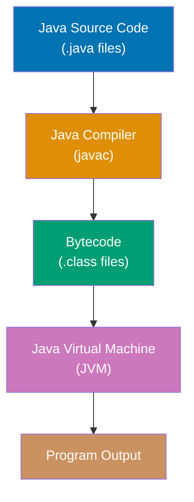
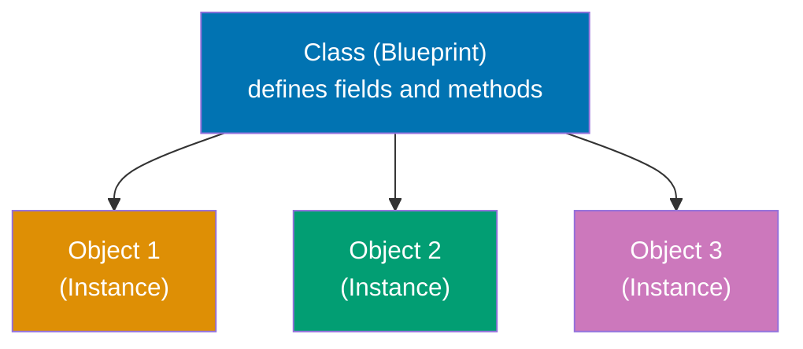
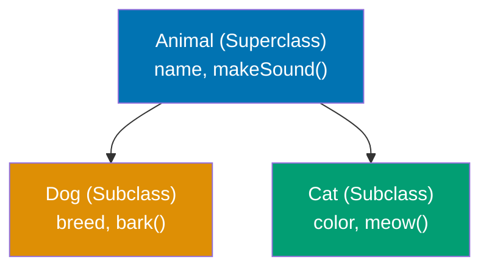
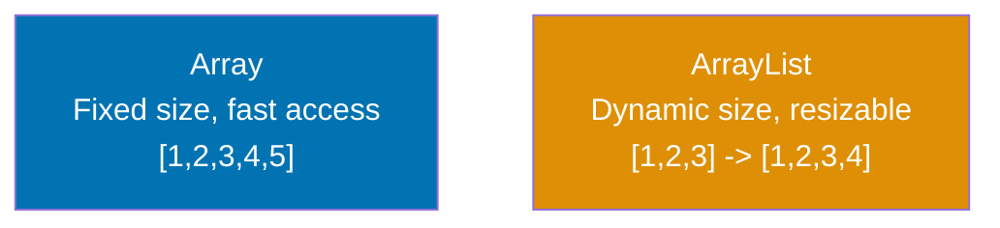
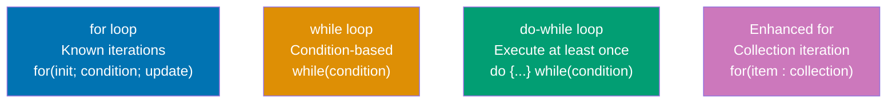

Learn Java fundamentals through 15 annotated code examples. Each example is self-contained, runnable in JShell or as standalone classes, and heavily commented to show what each line does, expected outputs, and intermediate values.

## Group 1: First Steps

### Example 1: Hello World and JVM Compilation

Java programs run on the JVM (Java Virtual Machine). Code is compiled to bytecode (`.class` files) that the JVM executes. This example shows the simplest Java program and how the compilation pipeline works.



**Code**:

```java
// Define a class - the basic unit of code organization in Java
public class HelloWorld {
    // Every Java application needs a main method as the entry point
    // public: accessible from anywhere
    // static: belongs to the class, not instances
    // void: doesn't return a value
    // String[] args: command-line arguments
    public static void main(String[] args) {
        // System.out.println writes to standard output
        System.out.println("Hello, World!"); // => prints "Hello, World!"
        // main returns implicitly (void return type)
    }
}

// To compile: javac HelloWorld.java (creates HelloWorld.class)
// To run: java HelloWorld (executes the bytecode)

// Single-line comments use //
/* Multi-line comments
   use /* and */
// Javadoc comments use /** for documentation */
```

**Key Takeaway**: Java code is organized into classes. The `main` method is the entry point. Code compiles to bytecode and runs on the JVM, providing platform independence.

---

### Example 2: Variables and Type System

Java is statically typed with two categories: primitive types (stored on stack) and reference types (stored on heap). Types can be declared explicitly or inferred with `var`.

**Code**:

```java
// Primitive types (8 total) - stored directly in memory
byte b = 127; // => 127 (8-bit signed integer, -128 to 127)
short s = 32000; // => 32000 (16-bit signed integer)
int i = 42; // => 42 (32-bit signed integer, default for whole numbers)
long l = 1000000L; // => 1000000 (64-bit signed, note L suffix)

float f = 3.14f; // => 3.14 (32-bit floating point, note f suffix)
double d = 3.14159; // => 3.14159 (64-bit floating point, default for decimals)

boolean bool = true; // => true (true or false only)
char c = 'A'; // => 'A' (16-bit Unicode character, single quotes)

// Reference types - variables hold references (memory addresses)
String str = "Hello"; // => "Hello" (String is a class, not primitive)
int[] array = {1, 2, 3}; // => [1, 2, 3] (arrays are reference types)

// Type inference with var (Java 10+) - compiler infers type
var num = 100; // => 100 (inferred as int)
var text = "World"; // => "World" (inferred as String)
var list = new java.util.ArrayList<String>(); // => [] (inferred type)

// Final variables (constants) - cannot be reassigned
final int CONST = 42; // => 42
// CONST = 50; // ERROR: cannot reassign final variable

// Default values for instance variables (not local variables)
// Primitives: 0, 0.0, false, '\u0000'
// References: null

// Type casting
int x = 10;
double y = x; // => 10.0 (implicit widening cast, no precision loss)
double z = 9.8;
int w = (int) z; // => 9 (explicit narrowing cast, loses decimal part)

// Null only applies to reference types
String nullStr = null; // => null (OK for reference types)
// int nullInt = null; // ERROR: primitives cannot be null
```

**Key Takeaway**: Java distinguishes primitives (value stored directly) from reference types (value stored on heap). `var` reduces boilerplate while maintaining compile-time type safety. Primitives have default values; references default to `null`.

---

### Example 3: Basic Data Types and Operations

Java provides rich operators for primitives. Strings are immutable reference types. Autoboxing converts primitives to wrapper classes automatically.

**Code**:

```java
// Arithmetic operators
int a = 10, b = 3;
int sum = a + b; // => 13 (addition)
int diff = a - b; // => 7 (subtraction)
int prod = a * b; // => 30 (multiplication)
int quot = a / b; // => 3 (integer division, truncates)
int rem = a % b; // => 1 (remainder/modulo)

// Comparison operators (return boolean)
boolean equal = (a == b); // => false (equality)
boolean notEqual = (a != b); // => true (inequality)
boolean greater = (a > b); // => true (greater than)
boolean less = (a <= b); // => false (less than or equal)

// Logical operators
boolean x = true, y = false;
boolean and = x && y; // => false (logical AND, short-circuits)
boolean or = x || y; // => true (logical OR, short-circuits)
boolean not = !x; // => false (logical NOT)

// String operations (Strings are immutable objects)
String s1 = "Hello";
String s2 = "World";
String concat = s1 + " " + s2; // => "Hello World" (concatenation with +)
int length = s1.length(); // => 5 (string length)
String sub = s1.substring(1, 4); // => "ell" (substring from index 1 to 3)
char first = s1.charAt(0); // => 'H' (character at index 0)

// String immutability
String original = "Java";
String modified = original.concat(" Programming"); // => "Java Programming"
// original is still "Java" - concat created a NEW string

// StringBuilder for mutable strings (efficient for repeated modifications)
StringBuilder sb = new StringBuilder("Start");
sb.append(" ").append("Building"); // => "Start Building" (modifies in-place)
String result = sb.toString(); // => "Start Building" (convert to String)

// Autoboxing and unboxing (automatic conversion)
Integer objInt = 42; // => 42 (autoboxing: int -> Integer)
int primInt = objInt; // => 42 (unboxing: Integer -> int)

// Wrapper classes: Byte, Short, Integer, Long, Float, Double, Boolean, Character
Integer wrapped = Integer.valueOf(100); // => 100 (explicit boxing)
int unwrapped = wrapped.intValue(); // => 100 (explicit unboxing)
```

**Key Takeaway**: Java provides comprehensive operators for primitives. Strings are immutable—operations create new strings. Use `StringBuilder` for efficient repeated modifications. Autoboxing converts primitives to objects automatically for collections and generics.

---

## Group 2: Object-Oriented Foundation

### Example 4: Classes and Objects

Classes are blueprints that define state (fields) and behavior (methods). Objects are instances created from classes. Constructors initialize object state.



**Code**:

```java
// Class definition with fields (state) and methods (behavior)
public class Person {
    // Fields (instance variables) - each object has its own copy
    private String name; // private: only accessible within this class
    private int age;

    // Constructor - special method called when creating objects with 'new'
    public Person(String name, int age) {
        // 'this' refers to the current instance
        this.name = name; // Distinguish field from parameter
        this.age = age;
    }

    // Constructor overloading - multiple constructors with different parameters
    public Person(String name) {
        this(name, 0); // Call other constructor using this()
    }

    // Default constructor (no parameters) - Java provides one if you don't
    public Person() {
        this("Unknown", 0);
    }

    // Instance method - operates on instance data
    public void greet() {
        System.out.println("Hi, I'm " + name); // => "Hi, I'm Alice"
    }

    // Getter method (accessor)
    public String getName() {
        return name; // => returns the name field
    }

    // Setter method (mutator)
    public void setAge(int age) {
        this.age = age; // Updates the age field
    }

    // Method overloading - same name, different parameters
    public void celebrate() {
        System.out.println(name + " is celebrating!");
    }

    public void celebrate(String event) {
        System.out.println(name + " is celebrating " + event + "!");
    }
}

// Creating objects (instances) using 'new' keyword
Person alice = new Person("Alice", 30); // => Person instance
Person bob = new Person("Bob"); // => Person instance (age defaults to 0)

// Calling instance methods
alice.greet(); // => prints "Hi, I'm Alice"
String aliceName = alice.getName(); // => "Alice"
alice.setAge(31); // Updates alice's age to 31

// Method overloading in action
bob.celebrate(); // => prints "Bob is celebrating!"
bob.celebrate("birthday"); // => prints "Bob is celebrating birthday!"

// Access modifiers control visibility:
// public: accessible from anywhere
// private: accessible only within the class
// protected: accessible within package and subclasses
// (default/package-private): accessible within package
```

**Key Takeaway**: Classes define the structure and behavior; objects are instances with their own state. Constructors initialize objects. `this` refers to the current instance. Access modifiers (`private`, `public`) control encapsulation.

---

### Example 5: Inheritance and Polymorphism

Inheritance creates IS-A relationships where subclasses inherit fields and methods from superclasses. Polymorphism allows treating subclass objects as superclass references.



**Code**:

```java
// Superclass (parent class)
public class Animal {
    protected String name; // protected: accessible to subclasses

    public Animal(String name) {
        this.name = name;
    }

    // Method to be overridden
    public void makeSound() {
        System.out.println(name + " makes a sound");
    }
}

// Subclass (child class) using 'extends' keyword
public class Dog extends Animal {
    private String breed;

    // Constructor with 'super' to call superclass constructor
    public Dog(String name, String breed) {
        super(name); // MUST be first statement, calls Animal(name)
        this.breed = breed;
    }

    // Method overriding with @Override annotation (recommended)
    @Override
    public void makeSound() {
        System.out.println(name + " barks: Woof!"); // => "Rex barks: Woof!"
    }

    // Subclass-specific method
    public void fetch() {
        System.out.println(name + " fetches the ball!");
    }
}

public class Cat extends Animal {
    public Cat(String name) {
        super(name);
    }

    @Override
    public void makeSound() {
        System.out.println(name + " meows: Meow!"); // => "Whiskers meows: Meow!"
    }
}

// Creating instances
Dog dog = new Dog("Rex", "Labrador"); // => Dog instance
Cat cat = new Cat("Whiskers"); // => Cat instance

// Polymorphism - treating subclass as superclass reference
Animal animal1 = dog; // => Rex (Dog) stored as Animal reference
Animal animal2 = cat; // => Whiskers (Cat) stored as Animal reference

// Runtime polymorphism - method called based on actual object type
animal1.makeSound(); // => "Rex barks: Woof!" (Dog's version)
animal2.makeSound(); // => "Whiskers meows: Meow!" (Cat's version)

// animal1.fetch(); // ERROR: Animal reference doesn't have fetch()
((Dog) animal1).fetch(); // => OK: cast to Dog first, then call fetch()

// Object class - root of all classes
Object obj = dog; // => Every class inherits from Object

// Common Object methods to override
public class Animal {
    // ... fields and constructor ...

    @Override
    public String toString() {
        return "Animal[name=" + name + "]"; // => "Animal[name=Rex]"
    }

    @Override
    public boolean equals(Object other) {
        if (other instanceof Animal) {
            return name.equals(((Animal) other).name);
        }
        return false;
    }

    @Override
    public int hashCode() {
        return name.hashCode(); // => hash code based on name
    }
}

// final keyword prevents inheritance or overriding
final class FinalClass {} // Cannot be extended
// class Sub extends FinalClass {} // ERROR

public class Base {
    public final void cannotOverride() {} // Cannot be overridden
}
```

**Key Takeaway**: Inheritance (`extends`) creates IS-A relationships and enables code reuse. `super` accesses superclass members. Polymorphism allows subclass objects through superclass references. Override `toString()`, `equals()`, and `hashCode()` for proper object behavior. Use `final` to prevent inheritance or overriding.

---

### Example 6: Interfaces and Abstraction

Interfaces define contracts (what methods a class must implement) without implementation. Classes can implement multiple interfaces, enabling flexible type hierarchies.

**Code**:

```java
// Interface definition - defines contract (what, not how)
public interface Drawable {
    // Abstract method (implicitly public abstract)
    void draw();

    // Interfaces can have constants (implicitly public static final)
    double PI = 3.14159;

    // Default methods (Java 8+) - provide implementation
    default void print() {
        System.out.println("Drawing..."); // => "Drawing..."
    }

    // Static methods (Java 8+)
    static void info() {
        System.out.println("Drawable interface"); // => "Drawable interface"
    }
}

// Another interface
public interface Movable {
    void move(int x, int y);
}

// Class implementing interface(s) using 'implements' keyword
public class Circle implements Drawable {
    private int radius;

    public Circle(int radius) {
        this.radius = radius;
    }

    // Must implement all abstract methods from interface
    @Override
    public void draw() {
        System.out.println("Drawing circle with radius " + radius);
    }
}

// Implementing multiple interfaces (multiple inheritance of type)
public class Rectangle implements Drawable, Movable {
    private int width, height;
    private int x, y;

    public Rectangle(int width, int height) {
        this.width = width;
        this.height = height;
    }

    @Override
    public void draw() {
        System.out.println("Drawing rectangle " + width + "x" + height);
    }

    @Override
    public void move(int newX, int newY) {
        this.x = newX;
        this.y = newY;
        System.out.println("Moved to (" + x + ", " + y + ")");
    }
}

// Using interfaces
Drawable circle = new Circle(10); // => Interface reference
circle.draw(); // => "Drawing circle with radius 10"
circle.print(); // => "Drawing..." (default method)

Drawable rect = new Rectangle(20, 30); // => Rectangle as Drawable
rect.draw(); // => "Drawing rectangle 20x30"

// Abstract classes vs Interfaces
public abstract class Shape {
    // Can have state (fields)
    protected String color;

    // Can have constructors
    public Shape(String color) {
        this.color = color;
    }

    // Can have concrete methods
    public String getColor() {
        return color;
    }

    // Can have abstract methods
    public abstract double area();
}

public class Square extends Shape {
    private double side;

    public Square(String color, double side) {
        super(color);
        this.side = side;
    }

    @Override
    public double area() {
        return side * side; // => side²
    }
}

// Marker interfaces (no methods) - used for type checking
public interface Serializable {} // Empty interface

// Functional interfaces (Java 8+) - exactly one abstract method
@FunctionalInterface
public interface Calculator {
    int calculate(int a, int b); // Single abstract method

    // Can still have default and static methods
    default void log(String msg) {
        System.out.println("Log: " + msg);
    }
}

// Lambda expressions work with functional interfaces
Calculator add = (a, b) -> a + b; // => Lambda implementing Calculator
int sum = add.calculate(5, 3); // => 8
```

**Key Takeaway**: Interfaces define contracts without implementation. Classes can `implements` multiple interfaces for flexible type systems. Abstract classes can have state and constructors; interfaces cannot (before Java 8). Default methods allow adding behavior to interfaces. Functional interfaces enable lambda expressions.

---

## Group 3: Core Collections

### Example 7: Arrays and Lists

Arrays have fixed size and fast access. Lists (like `ArrayList`) are dynamic and provide rich operations. Generics ensure type safety for collections.



**Code**:

```java
import java.util.ArrayList;
import java.util.Arrays;
import java.util.List;

// Array declaration and initialization
int[] numbers = {1, 2, 3, 4, 5}; // => [1, 2, 3, 4, 5]
String[] names = new String[3]; // => [null, null, null] (default values)

// Array access and modification
int first = numbers[0]; // => 1 (zero-indexed)
numbers[2] = 30; // => [1, 2, 30, 4, 5] (modifies array in-place)

// Array length (property, not method)
int len = numbers.length; // => 5

// Enhanced for loop (for-each) - read-only iteration
for (int num : numbers) {
    System.out.println(num); // => prints 1, 2, 30, 4, 5
}

// Traditional for loop - allows index access
for (int i = 0; i < numbers.length; i++) {
    System.out.println(numbers[i]); // => same output
}

// Arrays utility class
String arrStr = Arrays.toString(numbers); // => "[1, 2, 30, 4, 5]"
int[] sorted = {5, 2, 8, 1, 9};
Arrays.sort(sorted); // => [1, 2, 5, 8, 9] (sorts in-place)

// ArrayList - dynamic, resizable list
ArrayList<String> list = new ArrayList<>(); // Generic type in <>
list.add("Alice"); // => ["Alice"]
list.add("Bob"); // => ["Alice", "Bob"]
list.add("Charlie"); // => ["Alice", "Bob", "Charlie"]

// List operations
String element = list.get(1); // => "Bob" (get by index)
list.set(1, "Robert"); // => ["Alice", "Robert", "Charlie"] (replace)
list.remove(0); // => ["Robert", "Charlie"] (remove by index)
list.remove("Charlie"); // => ["Robert"] (remove by value)

int size = list.size(); // => 1 (current size)
boolean contains = list.contains("Robert"); // => true
boolean isEmpty = list.isEmpty(); // => false

// Adding at specific position
list.add(0, "Start"); // => ["Start", "Robert"] (insert at index 0)

// List interface (parent of ArrayList)
List<Integer> nums = new ArrayList<>();
nums.add(10);
nums.add(20);
nums.add(30); // => [10, 20, 30]

// Arrays.asList() - creates fixed-size list backed by array
List<String> fixedList = Arrays.asList("A", "B", "C"); // => ["A", "B", "C"]
// fixedList.add("D"); // ERROR: UnsupportedOperationException (fixed size)

// List.of() (Java 9+) - creates immutable list
List<String> immutable = List.of("X", "Y", "Z"); // => ["X", "Y", "Z"]
// immutable.add("W"); // ERROR: UnsupportedOperationException (immutable)

// Converting between arrays and lists
String[] array = {"One", "Two", "Three"};
List<String> listFromArray = new ArrayList<>(Arrays.asList(array)); // => mutable list
String[] arrayFromList = list.toArray(new String[0]); // => array

// Generics provide compile-time type safety
ArrayList<Integer> ints = new ArrayList<>();
ints.add(42); // => OK
// ints.add("text"); // ERROR: compile-time type check prevents this

// Raw type (no generics) - avoid this
ArrayList raw = new ArrayList(); // => Warning: raw type
raw.add(100); // => OK (any object)
raw.add("mixed"); // => OK but dangerous
```

**Key Takeaway**: Arrays have fixed size with fast access. `ArrayList` is dynamic with rich operations. Generics (`<Type>`) provide type safety. `Arrays.asList()` creates fixed-size list. `List.of()` creates immutable list. Enhanced for-each loop simplifies iteration.

---

### Example 8: Maps and HashMap

Maps store key-value pairs. `HashMap` provides O(1) average lookup time using hash-based indexing. Different implementations offer different ordering guarantees.

**Code**:

```java
import java.util.HashMap;
import java.util.Map;
import java.util.TreeMap;
import java.util.LinkedHashMap;

// HashMap - unordered, allows one null key and multiple null values
HashMap<String, Integer> ages = new HashMap<>();

// put() adds or updates key-value pairs
ages.put("Alice", 30); // => {"Alice": 30}
ages.put("Bob", 25); // => {"Alice": 30, "Bob": 25}
ages.put("Charlie", 35); // => {"Alice": 30, "Bob": 25, "Charlie": 35}

// get() retrieves value by key
Integer aliceAge = ages.get("Alice"); // => 30
Integer missing = ages.get("David"); // => null (key doesn't exist)

// getOrDefault() provides fallback value
int davidAge = ages.getOrDefault("David", 0); // => 0 (default value)

// containsKey() and containsValue()
boolean hasAlice = ages.containsKey("Alice"); // => true
boolean has25 = ages.containsValue(25); // => true

// remove() removes key-value pair
ages.remove("Bob"); // => {"Alice": 30, "Charlie": 35}

// putIfAbsent() only puts if key doesn't exist
ages.putIfAbsent("Alice", 40); // => No change (key exists)
ages.putIfAbsent("David", 28); // => {"Alice": 30, "Charlie": 35, "David": 28}

// size() returns number of entries
int count = ages.size(); // => 3

// Iteration methods
for (String key : ages.keySet()) {
    System.out.println(key); // => "Alice", "Charlie", "David" (unordered)
}

for (Integer value : ages.values()) {
    System.out.println(value); // => 30, 35, 28 (unordered)
}

// entrySet() for both key and value
for (Map.Entry<String, Integer> entry : ages.entrySet()) {
    System.out.println(entry.getKey() + ": " + entry.getValue());
    // => "Alice: 30", "Charlie: 35", "David: 28"
}

// Map.of() (Java 9+) - immutable map with up to 10 entries
Map<String, String> codes = Map.of(
    "US", "United States",
    "UK", "United Kingdom",
    "JP", "Japan"
); // => immutable map
// codes.put("CN", "China"); // ERROR: UnsupportedOperationException

// TreeMap - sorted by keys (natural ordering or Comparator)
TreeMap<String, Integer> sorted = new TreeMap<>();
sorted.put("Zebra", 3);
sorted.put("Apple", 1);
sorted.put("Mango", 2); // => {"Apple": 1, "Mango": 2, "Zebra": 3} (sorted keys)

// LinkedHashMap - maintains insertion order
LinkedHashMap<String, Integer> ordered = new LinkedHashMap<>();
ordered.put("First", 1);
ordered.put("Second", 2);
ordered.put("Third", 3); // => maintains insertion order

// Null handling in HashMap
HashMap<String, String> map = new HashMap<>();
map.put(null, "NullKey"); // => OK: one null key allowed
map.put("key1", null); // => OK: null values allowed
map.put("key2", null); // => OK: multiple null values allowed

// Computing values based on keys
ages.compute("Alice", (k, v) -> v + 1); // => Alice: 31
ages.computeIfAbsent("Eve", k -> 29); // => adds Eve: 29 if absent
ages.merge("Alice", 1, (old, val) -> old + val); // => Alice: 32 (31 + 1)
```

**Key Takeaway**: `HashMap` provides O(1) average lookup for key-value pairs. `get()`, `put()`, `remove()`, `containsKey()` are core operations. `TreeMap` sorts keys. `LinkedHashMap` maintains insertion order. `Map.of()` creates immutable maps. Iterate using `keySet()`, `values()`, or `entrySet()`.

---

### Example 9: Sets for Uniqueness

Sets ensure element uniqueness automatically. `HashSet` provides O(1) operations. Proper `equals()` and `hashCode()` implementation is essential for correct behavior.

**Code**:

```java
import java.util.HashSet;
import java.util.Set;
import java.util.TreeSet;
import java.util.LinkedHashSet;

// HashSet - unordered, no duplicates
HashSet<String> set = new HashSet<>();

// add() adds element if not present
set.add("Apple"); // => true (added), set: {"Apple"}
set.add("Banana"); // => true, set: {"Apple", "Banana"}
set.add("Apple"); // => false (already exists, not added)

// Set maintains uniqueness
System.out.println(set); // => [Apple, Banana] (unordered)

// contains() checks membership
boolean hasApple = set.contains("Apple"); // => true
boolean hasCherry = set.contains("Cherry"); // => false

// remove() removes element
set.remove("Banana"); // => true (was present), set: {"Apple"}
set.remove("Cherry"); // => false (wasn't present)

// size() and isEmpty()
int count = set.size(); // => 1
boolean empty = set.isEmpty(); // => false

// Set operations (mathematical set operations)
Set<Integer> set1 = new HashSet<>();
set1.add(1);
set1.add(2);
set1.add(3); // => {1, 2, 3}

Set<Integer> set2 = new HashSet<>();
set2.add(2);
set2.add(3);
set2.add(4); // => {2, 3, 4}

// Union - addAll() modifies set1
Set<Integer> union = new HashSet<>(set1);
union.addAll(set2); // => {1, 2, 3, 4} (all elements from both sets)

// Intersection - retainAll() keeps only common elements
Set<Integer> intersection = new HashSet<>(set1);
intersection.retainAll(set2); // => {2, 3} (elements in both sets)

// Difference - removeAll() removes elements present in set2
Set<Integer> difference = new HashSet<>(set1);
difference.removeAll(set2); // => {1} (elements in set1 but not set2)

// Set.of() (Java 9+) - immutable set
Set<String> colors = Set.of("Red", "Green", "Blue"); // => immutable
// colors.add("Yellow"); // ERROR: UnsupportedOperationException

// TreeSet - sorted set (elements must be Comparable)
TreeSet<Integer> sortedSet = new TreeSet<>();
sortedSet.add(5);
sortedSet.add(1);
sortedSet.add(3); // => {1, 3, 5} (sorted in natural order)

// LinkedHashSet - maintains insertion order
LinkedHashSet<String> orderedSet = new LinkedHashSet<>();
orderedSet.add("First");
orderedSet.add("Second");
orderedSet.add("Third"); // => maintains insertion order

// equals() and hashCode() importance for custom objects
class Person {
    String name;
    int age;

    Person(String name, int age) {
        this.name = name;
        this.age = age;
    }

    // MUST override equals() and hashCode() for proper Set behavior
    @Override
    public boolean equals(Object obj) {
        if (obj instanceof Person) {
            Person other = (Person) obj;
            return name.equals(other.name) && age == other.age;
        }
        return false;
    }

    @Override
    public int hashCode() {
        return name.hashCode() + age; // Simple hash combination
    }
}

Set<Person> people = new HashSet<>();
people.add(new Person("Alice", 30));
people.add(new Person("Alice", 30)); // => Not added (equals() returns true)
System.out.println(people.size()); // => 1 (uniqueness enforced)
```

**Key Takeaway**: Sets ensure automatic uniqueness. `HashSet` provides O(1) operations. `TreeSet` sorts elements. `LinkedHashSet` maintains insertion order. Custom objects in sets MUST override `equals()` and `hashCode()` correctly. Set operations: `addAll()` (union), `retainAll()` (intersection), `removeAll()` (difference).

---

## Group 4: Control Flow and Methods

### Example 10: Conditional Statements

Java provides multiple conditional structures. Modern switch expressions (Java 12+) reduce boilerplate. Pattern matching (Java 17+) enables type checking and casting in one step.

**Code**:

```java
// if-else statements
int score = 85;

if (score >= 90) {
    System.out.println("Grade: A");
} else if (score >= 80) {
    System.out.println("Grade: B"); // => "Grade: B" (this branch executes)
} else if (score >= 70) {
    System.out.println("Grade: C");
} else {
    System.out.println("Grade: F");
}

// Nested conditionals
boolean hasLicense = true;
int age = 20;

if (age >= 18) {
    if (hasLicense) {
        System.out.println("Can drive"); // => "Can drive"
    } else {
        System.out.println("Need license");
    }
} else {
    System.out.println("Too young");
}

// Traditional switch statement
String day = "Monday";

switch (day) {
    case "Monday":
    case "Tuesday":
    case "Wednesday":
    case "Thursday":
    case "Friday":
        System.out.println("Weekday"); // => "Weekday"
        break; // IMPORTANT: prevents fall-through
    case "Saturday":
    case "Sunday":
        System.out.println("Weekend");
        break;
    default:
        System.out.println("Invalid day");
}

// Switch expressions (Java 12+) - cleaner syntax, no break needed
String dayType = switch (day) {
    case "Monday", "Tuesday", "Wednesday", "Thursday", "Friday" -> "Weekday";
    case "Saturday", "Sunday" -> "Weekend";
    default -> "Invalid";
}; // => "Weekday"

// Switch with blocks
int numLetters = switch (day) {
    case "Monday", "Friday", "Sunday" -> 6;
    case "Tuesday" -> 7;
    case "Wednesday" -> {
        System.out.println("Midweek!");
        yield 9; // yield returns value from block
    }
    default -> 0;
}; // => 6

// Pattern matching for switch (Java 17+, preview)
Object obj = "Hello";

String result = switch (obj) {
    case String s -> "String of length " + s.length(); // => "String of length 5"
    case Integer i -> "Integer: " + i;
    case null -> "Null value";
    default -> "Unknown type";
};

// Ternary operator (condition ? true : false)
int num = 10;
String parity = (num % 2 == 0) ? "even" : "odd"; // => "even"

// Chaining ternary (discouraged for readability)
String size = (num < 10) ? "small" : (num < 100) ? "medium" : "large"; // => "medium"
```

**Key Takeaway**: `if-else` handles boolean conditions. Traditional `switch` requires `break` to prevent fall-through. Switch expressions (Java 12+) return values directly and eliminate `break`. Pattern matching (Java 17+) combines type checking and casting. Ternary operator provides concise conditional expressions.

---

### Example 11: Loops and Iteration

Java offers multiple loop types for different use cases. Enhanced for-each simplifies collection iteration. `break` exits loops; `continue` skips to next iteration.



**Code**:

```java
import java.util.ArrayList;
import java.util.Iterator;
import java.util.List;

// for loop - initialization; condition; update
for (int i = 0; i < 5; i++) {
    System.out.println(i); // => prints 0, 1, 2, 3, 4
}

// Multiple variables in for loop
for (int i = 0, j = 10; i < j; i++, j--) {
    System.out.println(i + " " + j); // => "0 10", "1 9", "2 8", "3 7", "4 6"
}

// while loop - condition evaluated before each iteration
int count = 0;
while (count < 3) {
    System.out.println("Count: " + count); // => "Count: 0", "Count: 1", "Count: 2"
    count++;
}

// do-while loop - executes at least once (condition checked after)
int num = 0;
do {
    System.out.println("Number: " + num); // => "Number: 0"
    num++;
} while (num < 0); // Condition is false, but block executed once

// Enhanced for loop (for-each) - read-only iteration over arrays/collections
String[] names = {"Alice", "Bob", "Charlie"};
for (String name : names) {
    System.out.println(name); // => "Alice", "Bob", "Charlie"
}

List<Integer> numbers = List.of(10, 20, 30);
for (int n : numbers) {
    System.out.println(n); // => 10, 20, 30
}

// break - exits loop immediately
for (int i = 0; i < 10; i++) {
    if (i == 5) {
        break; // Exits loop when i is 5
    }
    System.out.println(i); // => prints 0, 1, 2, 3, 4
}

// continue - skips to next iteration
for (int i = 0; i < 5; i++) {
    if (i == 2) {
        continue; // Skip when i is 2
    }
    System.out.println(i); // => prints 0, 1, 3, 4 (skips 2)
}

// Nested loops
for (int i = 1; i <= 3; i++) {
    for (int j = 1; j <= 3; j++) {
        System.out.print(i * j + " "); // => "1 2 3 2 4 6 3 6 9 "
    }
    System.out.println();
}

// Labeled break and continue (for nested loops)
outer: for (int i = 0; i < 3; i++) {
    for (int j = 0; j < 3; j++) {
        if (i == 1 && j == 1) {
            break outer; // Breaks out of outer loop
        }
        System.out.println(i + "," + j);
    }
}

// Iterator - manual iteration with hasNext() and next()
List<String> list = new ArrayList<>();
list.add("A");
list.add("B");
list.add("C");

Iterator<String> iterator = list.iterator();
while (iterator.hasNext()) {
    String item = iterator.next(); // => "A", "B", "C"
    System.out.println(item);
    // Can safely remove during iteration
    if (item.equals("B")) {
        iterator.remove(); // => list becomes ["A", "C"]
    }
}

// Iterable interface - classes implementing this can use enhanced for
// (ArrayList, HashSet, etc. implement Iterable)
Iterable<Integer> iterable = List.of(1, 2, 3);
for (int val : iterable) {
    System.out.println(val); // => 1, 2, 3
}
```

**Key Takeaway**: `for` loops have explicit initialization and update. `while` checks condition first. `do-while` executes at least once. Enhanced for-each simplifies collection iteration. `break` exits loops; `continue` skips to next iteration. `Iterator` provides manual iteration with safe removal.

---

### Example 12: Methods and Return Types

Methods define behavior with typed parameters and return values. Method overloading allows same name with different parameters. Static methods belong to the class; instance methods to objects.

**Code**:

```java
// Method declaration: returnType methodName(parameters)
public static int add(int a, int b) {
    return a + b; // => returns sum
}

// Calling static method
int sum = add(5, 3); // => 8

// void methods - no return value
public static void greet(String name) {
    System.out.println("Hello, " + name); // => "Hello, Alice"
    // return; // implicit return for void methods
}

// Methods can have multiple return statements
public static String getGrade(int score) {
    if (score >= 90) {
        return "A"; // Returns and exits method
    } else if (score >= 80) {
        return "B";
    } else if (score >= 70) {
        return "C";
    } else {
        return "F";
    }
    // No code after all return paths - compile error if unreachable code
}

// Method overloading - same name, different parameters
public static int multiply(int a, int b) {
    return a * b; // => two parameters
}

public static int multiply(int a, int b, int c) {
    return a * b * c; // => three parameters
}

public static double multiply(double a, double b) {
    return a * b; // => different parameter types
}

// Calls resolved at compile-time based on parameters
int result1 = multiply(2, 3); // => 6 (calls first version)
int result2 = multiply(2, 3, 4); // => 24 (calls second version)
double result3 = multiply(2.5, 3.0); // => 7.5 (calls third version)

// Varargs (variable arguments) - zero or more arguments
public static int sum(int... numbers) { // ... creates array
    int total = 0;
    for (int n : numbers) {
        total += n;
    }
    return total;
}

int s1 = sum(); // => 0 (no arguments)
int s2 = sum(1, 2, 3); // => 6 (three arguments)
int s3 = sum(1, 2, 3, 4, 5); // => 15 (five arguments)

// Varargs must be last parameter
public static void print(String prefix, int... numbers) {
    System.out.print(prefix + ": ");
    for (int n : numbers) {
        System.out.print(n + " ");
    }
}

// Static methods vs instance methods
class Calculator {
    // Static method - belongs to class, accessed via ClassName.method()
    public static int add(int a, int b) {
        return a + b;
    }

    // Instance method - belongs to objects, accessed via object.method()
    private int value;

    public void setValue(int v) {
        this.value = v; // Can access instance fields
    }

    public int getValue() {
        return value;
    }

    // Static method cannot access instance fields
    public static void cannotAccessInstance() {
        // System.out.println(value); // ERROR: non-static field
    }
}

// Calling static method
int result = Calculator.add(10, 20); // => 30

// Calling instance method
Calculator calc = new Calculator();
calc.setValue(100);
int val = calc.getValue(); // => 100

// Method references (Java 8+) - reusable method as object
// ClassName::staticMethod or object::instanceMethod
import java.util.function.Function;

Function<String, Integer> parseMethod = Integer::parseInt; // Method reference
int parsed = parseMethod.apply("123"); // => 123

// Return type covariance (overriding can return subtype)
class Animal {
    public Animal reproduce() {
        return new Animal();
    }
}

class Dog extends Animal {
    @Override
    public Dog reproduce() { // Returns Dog (subtype of Animal)
        return new Dog(); // => OK: covariant return type
    }
}
```

**Key Takeaway**: Methods have return types and parameters. `void` methods return nothing. Method overloading allows same name with different signatures. Varargs (`...`) accept variable arguments as array. Static methods belong to class; instance methods to objects. Method references (`::`) enable functional programming.

---

## Group 5: Exception Handling and Basics

### Example 13: Exception Handling

Java distinguishes checked exceptions (compile-time enforced) from unchecked exceptions (runtime). `try-catch-finally` handles exceptions. `try-with-resources` manages resources automatically.

**Code**:

```java
import java.io.*;

// try-catch for exception handling
public static void divideExample() {
    try {
        int result = 10 / 0; // ArithmeticException thrown here
        System.out.println(result); // This line never executes
    } catch (ArithmeticException e) {
        System.out.println("Cannot divide by zero!"); // => Executed
        System.out.println("Error: " + e.getMessage()); // => "/ by zero"
    }
    System.out.println("Program continues"); // => Executes normally
}

// Multiple catch blocks - most specific first
public static void parseExample(String input) {
    try {
        int num = Integer.parseInt(input); // May throw NumberFormatException
        int result = 100 / num; // May throw ArithmeticException
        System.out.println(result);
    } catch (NumberFormatException e) {
        System.out.println("Invalid number format"); // => If input is "abc"
    } catch (ArithmeticException e) {
        System.out.println("Division error"); // => If num is 0
    } catch (Exception e) {
        System.out.println("Other error"); // => Catch-all (most general last)
    }
}

// finally block - always executes (even if exception thrown or caught)
public static void finallyExample() {
    FileReader reader = null;
    try {
        reader = new FileReader("file.txt");
        // Read file operations...
    } catch (IOException e) {
        System.out.println("Error reading file");
    } finally {
        // Cleanup code - always runs
        if (reader != null) {
            try {
                reader.close(); // Close resource
            } catch (IOException e) {
                System.out.println("Error closing file");
            }
        }
        System.out.println("Cleanup complete"); // => Always executes
    }
}

// try-with-resources (Java 7+) - automatic resource management
public static void tryWithResourcesExample() {
    // Resources in () are AutoCloseable - closed automatically
    try (FileReader reader = new FileReader("data.txt");
         BufferedReader buffered = new BufferedReader(reader)) {
        String line = buffered.readLine();
        System.out.println(line);
    } catch (IOException e) {
        System.out.println("File error: " + e.getMessage());
    }
    // reader and buffered automatically closed, even if exception thrown
}

// throw keyword - manually throw exception
public static void validateAge(int age) {
    if (age < 0) {
        throw new IllegalArgumentException("Age cannot be negative");
    }
    if (age < 18) {
        throw new IllegalStateException("Must be 18 or older");
    }
    System.out.println("Valid age: " + age);
}

// Checked exceptions - must be declared with 'throws' or caught
public static void readFile(String filename) throws IOException {
    FileReader reader = new FileReader(filename); // IOException is checked
    // Must declare throws IOException or catch it
}

// Calling method that throws checked exception
public static void caller() {
    try {
        readFile("test.txt"); // Must catch checked exception
    } catch (IOException e) {
        System.out.println("File not found: " + e.getMessage());
    }
}

// Unchecked exceptions (RuntimeException subclasses) - not required to catch
// NullPointerException, ArithmeticException, ArrayIndexOutOfBoundsException, etc.
public static void uncheckedExample() {
    String str = null;
    // str.length(); // NullPointerException - unchecked, no catch required

    int[] arr = {1, 2, 3};
    // int x = arr[5]; // ArrayIndexOutOfBoundsException - unchecked
}

// Custom exceptions
class InsufficientFundsException extends Exception {
    public InsufficientFundsException(String message) {
        super(message);
    }
}

public static void withdraw(double amount, double balance) throws InsufficientFundsException {
    if (amount > balance) {
        throw new InsufficientFundsException("Balance: " + balance + ", Requested: " + amount);
    }
    System.out.println("Withdrawal successful");
}

// Exception hierarchy
// Throwable
//   ├── Error (JVM errors, don't catch)
//   └── Exception
//       ├── IOException (checked)
//       ├── SQLException (checked)
//       └── RuntimeException (unchecked)
//           ├── NullPointerException
//           ├── ArithmeticException
//           └── IllegalArgumentException
```

**Key Takeaway**: `try-catch` handles exceptions. `finally` always executes for cleanup. `try-with-resources` auto-closes `AutoCloseable` resources. Checked exceptions (compile-time) require `throws` declaration or catching. Unchecked exceptions (runtime) don't require explicit handling. `throw` manually throws exceptions.

---

### Example 14: Common Utility Classes

Java provides rich utility classes for common operations. `Math`, `String`, `Arrays`, `Collections`, and `Objects` offer static methods that simplify tasks.

**Code**:

```java
import java.util.*;

// Math class - mathematical operations (all static methods)
int absolute = Math.abs(-10); // => 10 (absolute value)
int maximum = Math.max(5, 10); // => 10 (larger value)
int minimum = Math.min(5, 10); // => 5 (smaller value)

double power = Math.pow(2, 3); // => 8.0 (2³)
double squareRoot = Math.sqrt(16); // => 4.0 (√16)
double rounded = Math.round(3.7); // => 4.0 (rounds to nearest integer)
double ceiling = Math.ceil(3.2); // => 4.0 (rounds up)
double floor = Math.floor(3.8); // => 3.0 (rounds down)

double random = Math.random(); // => 0.0 to 1.0 (exclusive)
int randomInt = (int) (Math.random() * 100); // => 0 to 99

// Math constants
double pi = Math.PI; // => 3.141592653589793
double e = Math.E; // => 2.718281828459045

// String methods (extensive utility methods)
String text = "  Hello World  ";

int length = text.length(); // => 15 (includes spaces)
String trimmed = text.trim(); // => "Hello World" (removes leading/trailing spaces)
String upper = text.toUpperCase(); // => "  HELLO WORLD  "
String lower = text.toLowerCase(); // => "  hello world  "

boolean starts = text.trim().startsWith("Hello"); // => true
boolean ends = text.trim().endsWith("World"); // => true
boolean contains = text.contains("World"); // => true

String replaced = text.replace("World", "Java"); // => "  Hello Java  "
String[] parts = "apple,banana,cherry".split(","); // => ["apple", "banana", "cherry"]
String joined = String.join("-", "A", "B", "C"); // => "A-B-C"

// String formatting
String formatted = String.format("Name: %s, Age: %d", "Alice", 30);
// => "Name: Alice, Age: 30"

// String comparison
String s1 = "hello";
String s2 = "hello";
String s3 = "HELLO";

boolean equals = s1.equals(s2); // => true (content comparison)
boolean same = (s1 == s2); // => true (reference comparison - same object)
boolean equalsIgnoreCase = s1.equalsIgnoreCase(s3); // => true
int comparison = s1.compareTo(s2); // => 0 (lexicographic order: 0 = equal, <0 = less, >0 = greater)

// Arrays utility class
int[] numbers = {5, 2, 8, 1, 9};

Arrays.sort(numbers); // => [1, 2, 5, 8, 9] (sorts in-place)
String arrayStr = Arrays.toString(numbers); // => "[1, 2, 5, 8, 9]"

int index = Arrays.binarySearch(numbers, 5); // => 2 (index of 5, array must be sorted)
int[] filled = new int[5];
Arrays.fill(filled, 7); // => [7, 7, 7, 7, 7]

int[] copy = Arrays.copyOf(numbers, 3); // => [1, 2, 5] (first 3 elements)
int[] range = Arrays.copyOfRange(numbers, 1, 4); // => [2, 5, 8] (index 1 to 3)

boolean equal = Arrays.equals(numbers, copy); // => false (different lengths)

// Collections utility class
List<Integer> list = new ArrayList<>(Arrays.asList(3, 1, 4, 1, 5));

Collections.sort(list); // => [1, 1, 3, 4, 5] (sorts in-place)
Collections.reverse(list); // => [5, 4, 3, 1, 1] (reverses in-place)
Collections.shuffle(list); // => randomizes order

int max = Collections.max(list); // => 5 (maximum element)
int min = Collections.min(list); // => 1 (minimum element)
int freq = Collections.frequency(list, 1); // => 2 (count of 1s)

Collections.fill(list, 0); // => [0, 0, 0, 0, 0]
Collections.replaceAll(list, 0, 9); // => [9, 9, 9, 9, 9]

// Objects utility class (Java 7+)
String nullableStr = null;

// requireNonNull throws NullPointerException if null
Objects.requireNonNull(nullableStr, "String cannot be null"); // => throws NPE

// Safe null handling
boolean isNull = Objects.isNull(nullableStr); // => true
boolean notNull = Objects.nonNull(nullableStr); // => false

// Safe equals (handles nulls)
String a = "test";
String b = null;
boolean safeEquals = Objects.equals(a, b); // => false (no NPE)

// Hash code generation
int hash = Objects.hash("Alice", 30, "Engineer"); // => combined hash code
```

**Key Takeaway**: `Math` provides mathematical operations and constants. `String` has extensive methods for manipulation and comparison. `Arrays` utility offers sorting, searching, and array operations. `Collections` utility provides algorithms for lists. `Objects` utility handles null-safe operations and hash generation.

---

### Example 15: Introduction to Streams

Streams enable functional-style operations on collections. Intermediate operations (lazy) return streams. Terminal operations (eager) trigger execution and produce results.


**Code**:

```java
import java.util.*;
import java.util.stream.*;

// Creating streams from collections
List<Integer> numbers = List.of(1, 2, 3, 4, 5, 6, 7, 8, 9, 10);
Stream<Integer> stream = numbers.stream(); // => creates stream from list

// filter() - intermediate operation (keeps elements matching predicate)
Stream<Integer> evens = numbers.stream()
    .filter(n -> n % 2 == 0); // => keeps 2, 4, 6, 8, 10 (lazy, not executed yet)

// map() - intermediate operation (transforms each element)
Stream<Integer> squared = numbers.stream()
    .map(n -> n * n); // => 1, 4, 9, 16, 25, ... (lazy)

// sorted() - intermediate operation (sorts elements)
List<Integer> unsorted = List.of(5, 2, 8, 1, 9);
Stream<Integer> sorted = unsorted.stream()
    .sorted(); // => 1, 2, 5, 8, 9 (lazy)

// distinct() - intermediate operation (removes duplicates)
List<Integer> duplicates = List.of(1, 2, 2, 3, 3, 3);
Stream<Integer> unique = duplicates.stream()
    .distinct(); // => 1, 2, 3 (lazy)

// limit() - intermediate operation (takes first N elements)
Stream<Integer> limited = numbers.stream()
    .limit(5); // => 1, 2, 3, 4, 5 (lazy)

// Method chaining (fluent API) - combine operations
List<Integer> result = numbers.stream()
    .filter(n -> n % 2 == 0)    // Keep evens: 2, 4, 6, 8, 10
    .map(n -> n * n)             // Square: 4, 16, 36, 64, 100
    .sorted()                    // Sort: 4, 16, 36, 64, 100
    .collect(Collectors.toList()); // Terminal: collect to List
// => [4, 16, 36, 64, 100]

// collect() - terminal operation (collects to collection)
List<Integer> evenList = numbers.stream()
    .filter(n -> n % 2 == 0)
    .collect(Collectors.toList()); // => [2, 4, 6, 8, 10]

Set<Integer> evenSet = numbers.stream()
    .filter(n -> n % 2 == 0)
    .collect(Collectors.toSet()); // => {2, 4, 6, 8, 10}

// forEach() - terminal operation (performs action on each element)
numbers.stream()
    .filter(n -> n > 5)
    .forEach(n -> System.out.println(n)); // => prints 6, 7, 8, 9, 10

// count() - terminal operation (returns count)
long count = numbers.stream()
    .filter(n -> n > 5)
    .count(); // => 5

// reduce() - terminal operation (combines elements)
int sum = numbers.stream()
    .reduce(0, (a, b) -> a + b); // => 55 (sum of all numbers)

Optional<Integer> max = numbers.stream()
    .reduce((a, b) -> a > b ? a : b); // => Optional[10] (maximum)

// Lambda expressions - concise syntax for functional interfaces
// (parameters) -> expression
List<String> names = List.of("Alice", "Bob", "Charlie", "David");

List<String> shortNames = names.stream()
    .filter(name -> name.length() <= 5) // Lambda: name -> boolean
    .collect(Collectors.toList()); // => ["Alice", "Bob", "David"]

List<String> uppercased = names.stream()
    .map(name -> name.toUpperCase()) // Lambda: name -> String
    .collect(Collectors.toList()); // => ["ALICE", "BOB", "CHARLIE", "DAVID"]

// Streams are single-use (can't reuse after terminal operation)
Stream<Integer> s = numbers.stream();
long c1 = s.count(); // => 10 (terminal operation, stream consumed)
// long c2 = s.count(); // ERROR: stream already operated upon

// Re-create stream for multiple operations
long evenCount = numbers.stream().filter(n -> n % 2 == 0).count(); // => 5
long oddCount = numbers.stream().filter(n -> n % 2 != 0).count(); // => 5

// Intermediate operations are lazy - only execute when terminal operation called
Stream<Integer> lazy = numbers.stream()
    .filter(n -> {
        System.out.println("Filtering " + n);
        return n % 2 == 0;
    })
    .map(n -> {
        System.out.println("Mapping " + n);
        return n * n;
    });
// Nothing printed yet - operations not executed

List<Integer> eager = lazy.collect(Collectors.toList());
// NOW operations execute: "Filtering 1", "Filtering 2", "Mapping 2", ...
```

**Key Takeaway**: Streams enable functional-style operations on collections. Intermediate operations (`filter`, `map`, `sorted`, `distinct`, `limit`) are lazy and return streams. Terminal operations (`collect`, `forEach`, `count`, `reduce`) trigger execution and produce results. Lambda expressions provide concise syntax. Streams are single-use and must be recreated for multiple operations.
