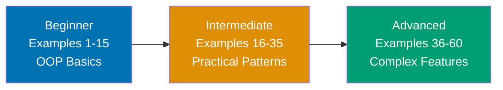

**Want to quickly master Java through working examples?** This by-example guide teaches 90% of Java through 60+ annotated code examples organized by complexity level.

## What Is By-Example Learning?

By-example learning is an **example-first approach** where you learn through annotated, runnable code rather than narrative explanations. Each example is self-contained, immediately executable in JShell (Java's interactive shell) or as standalone classes, and heavily commented to show:

- **What each line does** - Inline comments explain the purpose and mechanism
- **Expected outputs** - Using `// =>` notation to show results
- **Intermediate values** - Variable states and object flows made visible
- **Key takeaways** - 1-2 sentence summaries of core concepts

This approach is **ideal for experienced developers** (seasonal programmers or software engineers) who are familiar with at least one programming language and want to quickly understand Java's syntax, idioms, and unique features through working code.

Unlike narrative tutorials that build understanding through explanation and storytelling, by-example learning lets you **see the code first, run it second, and understand it through direct interaction**. You learn by doing, not by reading about doing.

## Learning Path



Progress from fundamentals through practical patterns to advanced JVM features and modern Java capabilities. Each level builds on the previous, increasing in sophistication and introducing more Java-specific concepts.

## Coverage Philosophy

This by-example guide provides **90% coverage of Java** through practical, annotated examples. The 90% figure represents the depth and breadth of concepts covered, not a time estimate—focus is on **outcomes and understanding**, not duration.

### What's Covered

- **Core syntax** - Variables, types, operators, control flow, methods
- **Object-oriented programming** - Classes, objects, inheritance, polymorphism, interfaces, abstraction
- **Collections framework** - List, Set, Map, Queue, generics, iterators
- **Functional programming** - Lambdas, method references, streams, Optional
- **Exception handling** - Try-catch-finally, checked vs unchecked exceptions, custom exceptions
- **File I/O** - NIO.2, streams, serialization, JSON
- **Concurrency** - Threads, synchronization, ExecutorService, CompletableFuture, virtual threads
- **Testing** - JUnit, Mockito, test patterns
- **JVM internals** - Garbage collection, memory management, bytecode, class loading
- **Design patterns** - Singleton, Factory, Builder, Strategy, Observer, Decorator, Dependency Injection
- **Modern Java features** - Records, sealed classes, pattern matching, modules, var

### What's NOT Covered

This guide focuses on **learning-oriented examples**, not problem-solving recipes or production deployment. For additional topics:

- **Production deployment patterns** - See [Intermediate Tutorial](/en/learn/swe/prog-lang/java/tutorials/intermediate) and [Advanced Tutorial](/en/learn/swe/prog-lang/java/tutorials/advanced)
- **Deep framework knowledge** - Spring, Hibernate, JavaFX covered at introductory level only
- **Real-world project architecture** - See [Explanation: Best Practices](/en/learn/swe/prog-lang/java/explanation/best-practices)

The 90% coverage goal maintains humility—no tutorial can cover everything. This guide teaches the **core concepts that unlock the remaining 10%** through your own exploration and project work.

## How to Use This Guide

1. **Sequential or selective** - Read examples in order for progressive learning, or jump to specific topics when switching from another language
2. **Run everything** - Copy and paste examples into JShell or create standalone `.java` files to see outputs yourself. Experimentation solidifies understanding.
3. **Modify and explore** - Change values, add print statements, break things intentionally. Learn through experimentation.
4. **Use as reference** - Bookmark examples for quick lookups when you forget syntax or patterns
5. **Complement with narrative tutorials** - By-example learning is code-first; pair with comprehensive tutorials for deeper explanations

**Best workflow**: Open JShell or your IDE in one window, this guide in another. Run each example as you read it. When you encounter something unfamiliar, run the example, modify it, see what changes.

## Relationship to Other Tutorials

Understanding where by-example fits in the tutorial ecosystem helps you choose the right learning path:

| Tutorial Type    | Coverage                 | Approach                       | Target Audience        | When to Use                                          |
| ---------------- | ------------------------ | ------------------------------ | ---------------------- | ---------------------------------------------------- |
| **By Example**   | 90% through 60+ examples | Code-first, annotated examples | Experienced developers | Quick language pickup, reference, language switching |
| **Quick Start**  | 5-30% touchpoints        | Hands-on project               | Newcomers to Java      | First taste, decide if worth learning                |
| **Beginner**     | 0-60% comprehensive      | Narrative, explanatory         | Complete beginners     | Deep understanding, first programming language       |
| **Intermediate** | 60-85%                   | Practical applications         | Past basics            | Production patterns, frameworks                      |
| **Advanced**     | 85-95%                   | Complex systems                | Experienced Java devs  | JVM internals, distributed systems                   |
| **Cookbook**     | Problem-oriented         | Recipe, solution-focused       | All levels             | Specific problems, common tasks                      |

**By Example vs. Quick Start**: By Example provides 90% coverage through examples vs. Quick Start's 5-30% through a single project. By Example is code-first reference; Quick Start is hands-on introduction.

**By Example vs. Beginner Tutorial**: By Example is code-first for experienced developers; Beginner Tutorial is narrative-first for complete beginners. By Example shows patterns; Beginner Tutorial explains concepts.

**By Example vs. Cookbook**: By Example is learning-oriented with progressive examples building language knowledge. Cookbook is problem-solving oriented with standalone recipes for specific tasks. By Example teaches concepts; Cookbook solves problems.

## Prerequisites

**Required**:

- Java installed and working (JDK 17 or later recommended, see [Initial Setup](/en/learn/swe/prog-lang/java/tutorials/initial-setup))
- Experience with at least one programming language
- Ability to run code in JShell or compile Java programs

**Recommended (helpful but not required)**:

- Familiarity with object-oriented programming concepts (classes, inheritance, polymorphism)
- Experience with statically typed languages (C++, C#, TypeScript)
- Understanding of compilation and bytecode basics

**No prior Java experience required** - This guide assumes you're new to Java but experienced with programming in general. You should be comfortable reading code, understanding basic programming concepts (variables, functions, loops), and learning through hands-on experimentation.

## Structure of Each Example

Every example follows this consistent format:

````markdown
### Example N: Concept Name

Brief explanation of the concept in 2-3 sentences. Explains **what** the concept is and **why** it matters.

[OPTIONAL: Mermaid diagram when concept relationships need visualization]

**Code**:

```java
// Comment explaining what this section does
public class Example {
    // Inline comment for each significant line
    public static void main(String[] args) {
        int result = operation(); // => expected_output_value
        // Intermediate values shown in comments
        int transformed = transform(result); // => intermediate_value
        System.out.println(transformed); // => final_output
    }
}
```

**Key Takeaway**: 1-2 sentence summary highlighting the most important insight or pattern from this example.
````

The **brief explanation** provides context. The **code** is heavily annotated with inline comments and `// =>` output notation. The **key takeaway** distills the concept to its essence.

Mermaid diagrams appear when **visual representation clarifies concept relationships** - showing data flow, object hierarchies, or abstract structures. Not every example needs a diagram; they're used strategically to enhance understanding.

## Ready to Start?

Jump into the beginner examples to start learning Java through code:

- [Beginner Examples (1-15)](/en/learn/swe/prog-lang/java/tutorials/by-example/beginner) - Basic syntax, OOP fundamentals, collections, control flow
- [Intermediate Examples (16-35)](/en/learn/swe/prog-lang/java/tutorials/by-example/intermediate) - Advanced OOP, generics, functional programming, concurrency
- [Advanced Examples (36-60)](/en/learn/swe/prog-lang/java/tutorials/by-example/advanced) - JVM internals, design patterns, modern Java features

Each example is self-contained and runnable. Start with Example 1, or jump to topics that interest you most.
