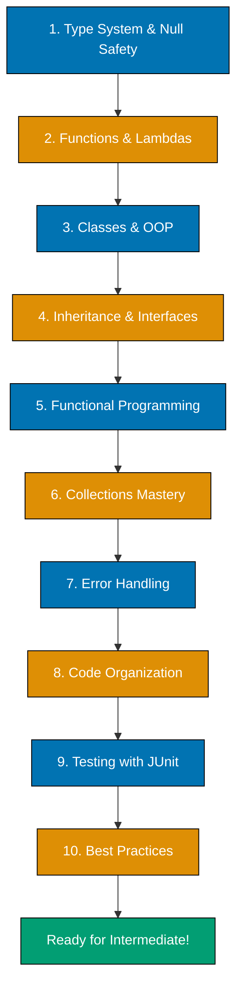

---

**Master Kotlin from the ground up.** This comprehensive tutorial covers everything you need to know to write production-quality Kotlin code. You'll learn the type system, object-oriented programming, functional programming basics, collections, error handling, testing, and Kotlin idioms.

## What You'll Achieve

By the end of this tutorial, you'll be able to:

- ✅ Write type-safe Kotlin code with proper null safety
- ✅ Build class hierarchies with inheritance and interfaces
- ✅ Apply functional programming patterns with higher-order functions
- ✅ Work with collections using idiomatic Kotlin operations
- ✅ Handle errors effectively with exceptions and Result types
- ✅ Organize code with packages and visibility modifiers
- ✅ Write comprehensive tests with JUnit 5 and assertions
- ✅ Apply SOLID principles to Kotlin code
- ✅ Build complete projects using Kotlin best practices
- ✅ Read and write professional Kotlin code confidently

## Prerequisites

- **Completed** [Initial Setup](/en/learn/swe/prog-lang/kotlin/tutorials/initial-setup) - You have Kotlin and IntelliJ IDEA installed
- **Optional** [Quick Start](/en/learn/swe/prog-lang/kotlin/tutorials/quick-start) - Familiarity with basic syntax helps but isn't required

## Learning Path Overview

This tutorial covers **0-60% of Kotlin** - comprehensive fundamentals. You'll build a solid foundation covering:

- **Type System** - Variables, types, null safety (Kotlin's signature feature)
- **Object-Oriented Programming** - Classes, inheritance, interfaces, sealed classes
- **Functional Programming** - Lambdas, higher-order functions, scope functions
- **Collections** - Lists, sets, maps, sequences, and collection operations
- **Error Handling** - Exceptions, Result types, null handling patterns
- **Testing** - JUnit 5, assertions, test organization
- **Code Organization** - Packages, visibility, module structure
- **Best Practices** - Kotlin idioms, SOLID principles, clean code

**Structure**: This tutorial is organized into 10 parts with hands-on examples and exercises throughout.



---

## Part 1: Type System and Variables

### Understanding Val and Var

Kotlin distinguishes between immutable and mutable variables.

```kotlin
fun main() {
    // Immutable - cannot be reassigned (prefer this)
    val name = "Alice"
    val age = 25
    // name = "Bob"  // ERROR: val cannot be reassigned

    // Mutable - can be reassigned
    var score = 85
    score = 90  // OK: var can be reassigned
    println("New score: $score")
}
```

**Rule of thumb**: Use `val` by default. Only use `var` when you need to reassign.

### Type Inference and Explicit Types

```kotlin
fun main() {
    // Type inference - compiler figures out the type
    val x = 42              // Int
    val pi = 3.14159        // Double
    val message = "Hello"   // String
    val isReady = true      // Boolean

    // Explicit types - sometimes necessary or clearer
    val billion: Long = 1_000_000_000L
    val percentage: Float = 0.1f
    val initial: Char = 'K'

    println("$x, $pi, $message, $isReady")
}
```

### Primitive Types

Kotlin has these primitive types (compiled to Java primitives when possible):

```kotlin
fun main() {
    // Integer types
    val byte: Byte = 127                    // 8 bits: -128 to 127
    val short: Short = 32767                // 16 bits: -32,768 to 32,767
    val int: Int = 2147483647               // 32 bits (default for integers)
    val long: Long = 9_223_372_036_854_775_807L  // 64 bits

    // Floating point types
    val float: Float = 3.14f                // 32 bits (requires 'f' suffix)
    val double: Double = 3.14159            // 64 bits (default for decimals)

    // Text and logic
    val char: Char = 'K'                    // Single character (16 bits Unicode)
    val boolean: Boolean = true             // true or false

    // String
    val text: String = "Kotlin is awesome"  // Not primitive, but fundamental

    println("Int: $int, Double: $double, Char: $char")
}
```

### Type Conversion

Kotlin requires explicit conversion between types (no implicit conversion).

```kotlin
fun main() {
    val intValue = 42
    val longValue: Long = intValue.toLong()
    val doubleValue: Double = intValue.toDouble()
    val stringValue: String = intValue.toString()

    println("Int: $intValue")
    println("Long: $longValue")
    println("Double: $doubleValue")
    println("String: $stringValue")

    // Explicit conversion prevents accidental bugs
    // val wrongLong: Long = intValue  // ERROR: type mismatch
}
```

### String Templates

Kotlin provides powerful string interpolation.

```kotlin
fun main() {
    val name = "Alice"
    val age = 25
    val height = 1.68

    // Simple interpolation with $
    println("Name: $name")

    // Expression interpolation with ${}
    println("Age next year: ${age + 1}")
    println("Height in cm: ${height * 100}")

    // Calling methods
    println("Uppercase name: ${name.uppercase()}")

    // Multiline strings with triple quotes
    val poem = """
        Roses are red,
        Violets are blue,
        Kotlin is concise,
        And type-safe too!
    """.trimIndent()

    println(poem)
}
```

### Nullable Types - Kotlin's Signature Feature

Kotlin's type system distinguishes between nullable and non-nullable types.

```kotlin
fun main() {
    // Non-nullable (default) - CANNOT be null
    val name: String = "Alice"
    // val nullName: String = null  // ERROR: null cannot be assigned

    // Nullable - MUST explicitly allow null with "?"
    val nickname: String? = null  // OK: ? means nullable
    val validNickname: String? = "Ali"  // OK: can be non-null too

    println(name.length)          // OK: name is never null
    // println(nickname.length)   // ERROR: nullable type, might be null
}
```

### Safe Calls and Elvis Operator

```kotlin
fun main() {
    val nickname: String? = null

    // Safe call "?." - returns null if receiver is null
    val length = nickname?.length
    println(length)  // Prints: null

    // Elvis operator "?:" - provides default value
    val displayName = nickname ?: "Anonymous"
    println(displayName)  // Prints: Anonymous

    // Chaining safe calls
    val upper = nickname?.trim()?.uppercase()
    println(upper)  // Prints: null

    // Combining safe call and Elvis
    val safeLength = nickname?.length ?: 0
    println("Length: $safeLength")  // Prints: Length: 0
}
```

### Let Function for Null Safety

```kotlin
fun main() {
    val nickname: String? = "Alice"

    // Execute block only if not null
    nickname?.let {
        println("Nickname: $it")
        println("Length: ${it.length}")
        println("Uppercase: ${it.uppercase()}")
    }

    // If nickname was null, nothing would print

    // Real-world example
    val email: String? = getUserEmail()
    email?.let { validEmail ->
        sendWelcomeEmail(validEmail)
        logEmailSent(validEmail)
    } ?: run {
        println("No email provided")
    }
}

fun getUserEmail(): String? = null
fun sendWelcomeEmail(email: String) = println("Sent to $email")
fun logEmailSent(email: String) = println("Logged: $email")
```

### Not-Null Assertion (!!) - Use Sparingly

```kotlin
fun main() {
    val nickname: String? = "Alice"

    // "!!" asserts "I'm certain this is not null"
    val length = nickname!!.length
    println(length)  // Prints: 5

    // WARNING: If nickname was null, this throws NullPointerException
    // Only use when you're absolutely certain it's not null

    // Better alternatives:
    // 1. Safe call: nickname?.length
    // 2. Elvis: nickname?.length ?: 0
    // 3. Let: nickname?.let { it.length }
}
```

**Best practice**: Use `!!` only when you're absolutely certain a value is not null. Prefer safe calls and Elvis operator.

---

## Part 2: Functions and Lambdas

### Function Basics

```kotlin
// Basic function
fun greet(name: String): String {
    return "Hello, $name!"
}

// Single-expression function (concise)
fun add(x: Int, y: Int): Int = x + y

// Type inference for return type
fun multiply(x: Int, y: Int) = x * y

// Unit return type (like void in Java)
fun printSum(x: Int, y: Int): Unit {
    println(x + y)
}

// Unit is default, can be omitted
fun printProduct(x: Int, y: Int) {
    println(x * y)
}

fun main() {
    println(greet("Alice"))
    println(add(5, 3))
    println(multiply(5, 3))
    printSum(10, 20)
    printProduct(10, 20)
}
```

### Default Parameters

```kotlin
fun createUser(
    name: String,
    age: Int = 18,
    country: String = "USA",
    isActive: Boolean = true
): String {
    return "User($name, $age, $country, active=$isActive)"
}

fun main() {
    println(createUser("Alice"))
    println(createUser("Bob", 25))
    println(createUser("Charlie", 30, "Canada"))
    println(createUser("Diana", 28, "UK", false))
}
```

**Advantage**: Eliminates need for method overloading (common in Java).

### Named Arguments

```kotlin
fun createUser(name: String, age: Int, country: String) = "$name, $age, $country"

fun main() {
    // Positional arguments
    println(createUser("Alice", 25, "USA"))

    // Named arguments (order doesn't matter)
    println(createUser(age = 30, country = "Canada", name = "Bob"))

    // Mix positional and named (positional must come first)
    println(createUser("Charlie", country = "UK", age = 35))
}
```

**Advantage**: Improves readability, especially with many parameters.

### Varargs

```kotlin
fun sum(vararg numbers: Int): Int {
    return numbers.sum()
}

fun main() {
    println(sum(1, 2, 3))           // Prints: 6
    println(sum(10, 20, 30, 40))    // Prints: 100

    // Spread operator to pass array
    val nums = intArrayOf(1, 2, 3, 4, 5)
    println(sum(*nums))             // Prints: 15
}
```

### Lambda Expressions

```kotlin
fun main() {
    // Lambda syntax: { parameters -> body }
    val sum = { x: Int, y: Int -> x + y }
    println(sum(5, 3))  // Prints: 8

    // Type inference for lambda types
    val greet: (String) -> String = { name -> "Hello, $name!" }
    println(greet("Alice"))

    // Single parameter - use "it"
    val double: (Int) -> Int = { it * 2 }
    println(double(5))  // Prints: 10

    // Multiple statements in lambda
    val calculate: (Int, Int) -> Int = { a, b ->
        val sum = a + b
        val product = a * b
        sum + product  // Last expression is returned
    }
    println(calculate(3, 4))  // Prints: 19 (7 + 12)
}
```

### Higher-Order Functions

Functions that take functions as parameters or return functions.

```kotlin
fun performOperation(x: Int, y: Int, operation: (Int, Int) -> Int): Int {
    return operation(x, y)
}

fun getOperation(type: String): (Int, Int) -> Int {
    return when (type) {
        "add" -> { a, b -> a + b }
        "multiply" -> { a, b -> a * b }
        "subtract" -> { a, b -> a - b }
        else -> { a, b -> a + b }
    }
}

fun main() {
    println(performOperation(5, 3) { a, b -> a + b })    // Prints: 8
    println(performOperation(5, 3) { a, b -> a * b })    // Prints: 15

    val addFunc = getOperation("add")
    println(addFunc(10, 20))  // Prints: 30

    val multiplyFunc = getOperation("multiply")
    println(multiplyFunc(10, 20))  // Prints: 200
}
```

### Trailing Lambda Syntax

If the last parameter is a lambda, you can move it outside parentheses.

```kotlin
fun repeat(times: Int, action: () -> Unit) {
    for (i in 1..times) {
        action()
    }
}

fun main() {
    // Standard syntax
    repeat(3, { println("Hello") })

    // Trailing lambda syntax (preferred)
    repeat(3) {
        println("Hello")
    }

    // If lambda is the only parameter, parentheses can be omitted
    listOf(1, 2, 3).forEach {
        println(it)
    }
}
```

### Inline Functions

Inline functions reduce lambda overhead by inlining code at call site.

```kotlin
inline fun measureTime(block: () -> Unit): Long {
    val start = System.currentTimeMillis()
    block()
    val end = System.currentTimeMillis()
    return end - start
}

fun main() {
    val time = measureTime {
        var sum = 0
        for (i in 1..1_000_000) {
            sum += i
        }
        println("Sum: $sum")
    }
    println("Time: ${time}ms")
}
```

**Use case**: Performance-critical higher-order functions, especially with collection operations.

---

## Part 3: Object-Oriented Programming

### Classes and Constructors

```kotlin
// Primary constructor in class header
class Person(val name: String, var age: Int) {
    // Init block runs when object is created
    init {
        require(age >= 0) { "Age cannot be negative" }
        println("Created person: $name")
    }

    // Member function
    fun greet() {
        println("Hello, I'm $name, $age years old")
    }

    // Secondary constructor
    constructor(name: String) : this(name, 0) {
        println("Using secondary constructor")
    }
}

fun main() {
    val person1 = Person("Alice", 25)
    person1.greet()

    val person2 = Person("Bob")
    person2.greet()
}
```

### Properties and Backing Fields

```kotlin
class Rectangle(val width: Int, val height: Int) {
    // Computed property (no backing field)
    val area: Int
        get() = width * height

    val perimeter: Int
        get() = 2 * (width + height)

    // Custom getter and setter
    var diagonal: Double = 0.0
        get() = Math.sqrt((width * width + height * height).toDouble())
        private set  // Setter is private
}

class Person {
    var name: String = ""
        set(value) {
            field = value.trim()  // "field" is the backing field
        }

    var age: Int = 0
        set(value) {
            require(value >= 0) { "Age cannot be negative" }
            field = value
        }
}

fun main() {
    val rect = Rectangle(10, 20)
    println("Area: ${rect.area}")
    println("Perimeter: ${rect.perimeter}")
    println("Diagonal: ${rect.diagonal}")

    val person = Person()
    person.name = "  Alice  "
    person.age = 25
    println("Name: '${person.name}'")  // Prints trimmed name
}
```

### Inheritance

```kotlin
// Open class (can be inherited)
open class Animal(val name: String) {
    open fun makeSound() {
        println("$name makes a sound")
    }

    fun sleep() {
        println("$name is sleeping")
    }
}

class Dog(name: String) : Animal(name) {
    override fun makeSound() {
        println("$name barks: Woof woof!")
    }

    fun fetch() {
        println("$name fetches the ball")
    }
}

class Cat(name: String) : Animal(name) {
    override fun makeSound() {
        println("$name meows: Meow meow!")
    }
}

fun main() {
    val dog = Dog("Buddy")
    dog.makeSound()
    dog.sleep()
    dog.fetch()

    val cat = Cat("Whiskers")
    cat.makeSound()
    cat.sleep()
}
```

**Note**: Kotlin classes are `final` by default. Use `open` to allow inheritance. Methods are also `final` by default. Use `open` to allow overriding.

### Abstract Classes

```kotlin
abstract class Shape {
    abstract val name: String
    abstract fun area(): Double

    fun describe() {
        println("$name with area ${area()}")
    }
}

class Circle(val radius: Double) : Shape() {
    override val name = "Circle"
    override fun area() = Math.PI * radius * radius
}

class Square(val side: Double) : Shape() {
    override val name = "Square"
    override fun area() = side * side
}

fun main() {
    val shapes: List<Shape> = listOf(
        Circle(5.0),
        Square(4.0)
    )

    shapes.forEach { it.describe() }
}
```

### Interfaces

```kotlin
interface Drawable {
    fun draw()
}

interface Clickable {
    fun click() {
        println("Clicked!")  // Default implementation
    }
}

class Button : Drawable, Clickable {
    override fun draw() {
        println("Drawing button")
    }

    override fun click() {
        println("Button clicked!")
    }
}

class Icon : Drawable, Clickable {
    override fun draw() {
        println("Drawing icon")
    }
    // Uses default click() implementation
}

fun main() {
    val button = Button()
    button.draw()
    button.click()

    val icon = Icon()
    icon.draw()
    icon.click()
}
```

### Data Classes

Data classes automatically generate `equals()`, `hashCode()`, `toString()`, `copy()`, and destructuring.

```kotlin
data class User(val name: String, val age: Int, val email: String)

fun main() {
    val user1 = User("Alice", 25, "alice@example.com")
    val user2 = User("Alice", 25, "alice@example.com")

    // Automatic toString()
    println(user1)  // Prints: User(name=Alice, age=25, email=alice@example.com)

    // Structural equality (compares values)
    println(user1 == user2)  // Prints: true

    // Copy with modifications
    val olderUser = user1.copy(age = 26)
    println(olderUser)

    // Destructuring
    val (name, age, email) = user1
    println("Name: $name, Age: $age, Email: $email")
}
```

### Sealed Classes

Sealed classes restrict inheritance to a known set of subclasses.

```kotlin
sealed class Result {
    data class Success(val data: String) : Result()
    data class Error(val message: String) : Result()
    object Loading : Result()
}

fun handleResult(result: Result) {
    when (result) {
        is Result.Success -> println("Success: ${result.data}")
        is Result.Error -> println("Error: ${result.message}")
        Result.Loading -> println("Loading...")
        // No "else" needed - compiler knows all cases
    }
}

fun main() {
    handleResult(Result.Success("Data loaded"))
    handleResult(Result.Error("Network error"))
    handleResult(Result.Loading)
}
```

**Use case**: Representing restricted state machines, API responses, validation results.

### Object Declarations (Singletons)

```kotlin
object DatabaseConfig {
    val url = "jdbc:postgresql://localhost/mydb"
    val username = "admin"

    fun connect() {
        println("Connecting to $url as $username")
    }
}

fun main() {
    DatabaseConfig.connect()
    println(DatabaseConfig.url)

    // Only one instance exists
    val config1 = DatabaseConfig
    val config2 = DatabaseConfig
    println(config1 === config2)  // Prints: true (same instance)
}
```

### Companion Objects

```kotlin
class User private constructor(val name: String, val age: Int) {
    companion object Factory {
        fun create(name: String, age: Int): User {
            require(age >= 0) { "Age cannot be negative" }
            return User(name, age)
        }

        const val MIN_AGE = 0
        const val MAX_AGE = 150
    }
}

fun main() {
    val user = User.create("Alice", 25)
    println(user.name)

    println("Min age: ${User.MIN_AGE}")
    println("Max age: ${User.MAX_AGE}")
}
```

**Use case**: Factory methods, constants, utilities related to a class.

---

## Part 4: Collections and Sequences

### Creating Collections

```kotlin
fun main() {
    // Immutable lists (read-only)
    val numbers = listOf(1, 2, 3, 4, 5)
    val names = listOf("Alice", "Bob", "Charlie")

    // Mutable lists
    val mutableNumbers = mutableListOf(1, 2, 3)
    mutableNumbers.add(4)
    mutableNumbers.remove(2)

    // Sets (unique elements)
    val uniqueNumbers = setOf(1, 2, 2, 3)  // [1, 2, 3]
    val mutableSet = mutableSetOf(1, 2, 3)

    // Maps (key-value pairs)
    val ages = mapOf(
        "Alice" to 25,
        "Bob" to 30,
        "Charlie" to 35
    )

    val mutableAges = mutableMapOf("Alice" to 25)
    mutableAges["Bob"] = 30

    println(numbers)
    println(uniqueNumbers)
    println(ages)
}
```

### Collection Operations - Transformations

```kotlin
fun main() {
    val numbers = listOf(1, 2, 3, 4, 5)

    // Map - transform each element
    val doubled = numbers.map { it * 2 }
    println(doubled)  // [2, 4, 6, 8, 10]

    // MapNotNull - transform and filter out nulls
    val strings = listOf("1", "2", "abc", "3")
    val parsed = strings.mapNotNull { it.toIntOrNull() }
    println(parsed)  // [1, 2, 3]

    // FlatMap - flatten nested collections
    val nested = listOf(listOf(1, 2), listOf(3, 4))
    val flattened = nested.flatMap { it }
    println(flattened)  // [1, 2, 3, 4]

    // MapIndexed - map with index
    val indexed = numbers.mapIndexed { index, value -> "$index: $value" }
    println(indexed)  // [0: 1, 1: 2, 2: 3, 3: 4, 4: 5]
}
```

### Collection Operations - Filtering

```kotlin
fun main() {
    val numbers = listOf(1, 2, 3, 4, 5, 6, 7, 8, 9, 10)

    // Filter - keep elements matching predicate
    val evens = numbers.filter { it % 2 == 0 }
    println(evens)  // [2, 4, 6, 8, 10]

    // FilterNot - keep elements not matching predicate
    val odds = numbers.filterNot { it % 2 == 0 }
    println(odds)  // [1, 3, 5, 7, 9]

    // FilterIndexed - filter with index
    val everyOther = numbers.filterIndexed { index, _ -> index % 2 == 0 }
    println(everyOther)  // [1, 3, 5, 7, 9]

    // Take and Drop
    val firstThree = numbers.take(3)
    println(firstThree)  // [1, 2, 3]

    val withoutFirstThree = numbers.drop(3)
    println(withoutFirstThree)  // [4, 5, 6, 7, 8, 9, 10]
}
```

### Collection Operations - Aggregation

```kotlin
fun main() {
    val numbers = listOf(1, 2, 3, 4, 5)

    // Basic aggregations
    println(numbers.sum())      // 15
    println(numbers.average())  // 3.0
    println(numbers.max())      // 5
    println(numbers.min())      // 1
    println(numbers.count())    // 5

    // Reduce - combine elements left to right
    val product = numbers.reduce { acc, n -> acc * n }
    println(product)  // 120 (1 * 2 * 3 * 4 * 5)

    // Fold - reduce with initial value
    val sum = numbers.fold(0) { acc, n -> acc + n }
    println(sum)  // 15

    val concatenated = numbers.fold("") { acc, n -> "$acc$n" }
    println(concatenated)  // "12345"
}
```

### Collection Operations - Predicates

```kotlin
fun main() {
    val numbers = listOf(1, 2, 3, 4, 5)

    // Any - true if any element matches
    println(numbers.any { it > 3 })   // true
    println(numbers.any { it > 10 })  // false

    // All - true if all elements match
    println(numbers.all { it > 0 })   // true
    println(numbers.all { it > 3 })   // false

    // None - true if no elements match
    println(numbers.none { it < 0 })  // true
    println(numbers.none { it > 3 })  // false

    // Find - first element matching predicate (or null)
    val found = numbers.find { it > 3 }
    println(found)  // 4

    // Partition - split into matching and non-matching
    val (evens, odds) = numbers.partition { it % 2 == 0 }
    println("Evens: $evens, Odds: $odds")  // Evens: [2, 4], Odds: [1, 3, 5]
}
```

### Working with Maps

```kotlin
fun main() {
    val ages = mapOf(
        "Alice" to 25,
        "Bob" to 30,
        "Charlie" to 35
    )

    // Access
    println(ages["Alice"])     // 25
    println(ages["Diana"])     // null
    println(ages.getValue("Alice"))  // 25
    // ages.getValue("Diana")  // Throws exception

    // Filter
    val youngPeople = ages.filter { it.value < 30 }
    println(youngPeople)  // {Alice=25}

    // Map keys and values
    val upperNames = ages.mapKeys { it.key.uppercase() }
    println(upperNames)  // {ALICE=25, BOB=30, CHARLIE=35}

    val nextYear = ages.mapValues { it.value + 1 }
    println(nextYear)  // {Alice=26, Bob=31, Charlie=36}

    // Iteration
    ages.forEach { (name, age) ->
        println("$name is $age years old")
    }
}
```

### Sequences for Lazy Evaluation

Sequences process elements lazily (one at a time) instead of eagerly (all at once).

```kotlin
fun main() {
    val numbers = listOf(1, 2, 3, 4, 5)

    // Eager evaluation (list) - creates intermediate lists
    val resultList = numbers
        .map { it * 2 }
        .filter { it > 5 }
        .take(2)
    println(resultList)

    // Lazy evaluation (sequence) - no intermediate collections
    val resultSeq = numbers.asSequence()
        .map { it * 2 }
        .filter { it > 5 }
        .take(2)
        .toList()
    println(resultSeq)

    // Infinite sequence
    val infiniteSequence = generateSequence(1) { it + 1 }
    val first10 = infiniteSequence.take(10).toList()
    println(first10)  // [1, 2, 3, 4, 5, 6, 7, 8, 9, 10]
}
```

**Use sequences when**:

- Working with large collections
- Chaining multiple operations
- Not all elements will be processed

---

## Part 5: Error Handling

### Basic Exception Handling

```kotlin
fun divide(a: Int, b: Int): Int {
    if (b == 0) {
        throw IllegalArgumentException("Cannot divide by zero")
    }
    return a / b
}

fun main() {
    try {
        val result = divide(10, 0)
        println(result)
    } catch (e: IllegalArgumentException) {
        println("Error: ${e.message}")
    } catch (e: Exception) {
        println("Unexpected error: ${e.message}")
    } finally {
        println("Cleanup code runs regardless")
    }
}
```

### Try as an Expression

```kotlin
fun parseIntSafe(input: String): Int {
    return try {
        input.toInt()
    } catch (e: NumberFormatException) {
        0  // Default value on error
    }
}

fun main() {
    println(parseIntSafe("123"))   // 123
    println(parseIntSafe("abc"))   // 0
}
```

### Checked Exceptions Don't Exist

Kotlin doesn't have checked exceptions (unlike Java). You don't need to declare or catch exceptions.

```kotlin
// No "throws" declaration needed
fun readFile(path: String): String {
    // This might throw IOException, but no declaration needed
    return java.io.File(path).readText()
}

fun main() {
    // Caller can choose whether to handle or let it propagate
    try {
        val content = readFile("file.txt")
        println(content)
    } catch (e: Exception) {
        println("Error reading file: ${e.message}")
    }
}
```

### Nothing Type

`Nothing` represents "never returns successfully" - useful for functions that always throw or loop forever.

```kotlin
fun fail(message: String): Nothing {
    throw IllegalStateException(message)
}

fun main() {
    val value: String? = null
    val result = value ?: fail("Value cannot be null")
    // Compiler knows fail() never returns, so result is always non-null here
    println(result.length)
}
```

### Result Type for Functional Error Handling

```kotlin
fun parseInt(input: String): Result<Int> {
    return try {
        Result.success(input.toInt())
    } catch (e: NumberFormatException) {
        Result.failure(e)
    }
}

fun main() {
    val result1 = parseInt("123")
    result1.onSuccess { println("Success: $it") }
    result1.onFailure { println("Failure: ${it.message}") }

    val result2 = parseInt("abc")
    result2.onSuccess { println("Success: $it") }
    result2.onFailure { println("Failure: ${it.message}") }

    // Get value or default
    val value = parseInt("xyz").getOrDefault(0)
    println(value)  // 0
}
```

---

## Part 6: Packages and Visibility

### Package Declaration

```kotlin
// File: com/example/utils/StringUtils.kt
package com.example.utils

fun reverse(text: String): String {
    return text.reversed()
}

class StringHelper {
    fun capitalize(text: String) = text.replaceFirstChar { it.uppercase() }
}
```

### Importing

```kotlin
// File: Main.kt
import com.example.utils.reverse
import com.example.utils.StringHelper

// Import with alias
import com.example.utils.reverse as rev

// Wildcard import (import everything)
import com.example.utils.*

fun main() {
    println(reverse("Kotlin"))
    println(rev("Hello"))

    val helper = StringHelper()
    println(helper.capitalize("kotlin"))
}
```

### Visibility Modifiers

Kotlin has four visibility modifiers:

```kotlin
// Top-level declarations
public class PublicClass       // Visible everywhere (default)
internal class InternalClass   // Visible within same module
private class PrivateClass     // Visible within same file

// Class members
class Example {
    public val a = 1           // Visible everywhere (default)
    private val b = 2          // Visible within class only
    protected val c = 3        // Visible within class and subclasses
    internal val d = 4         // Visible within same module
}
```

**Module** = A set of Kotlin files compiled together (e.g., Gradle project, Maven project).

---

## Part 7: Extension Functions

### Creating Extensions

```kotlin
// Extend String
fun String.isPalindrome(): Boolean {
    val cleaned = this.lowercase().replace(" ", "")
    return cleaned == cleaned.reversed()
}

// Extend Int
fun Int.squared() = this * this

// Extend List
fun <T> List<T>.secondOrNull(): T? {
    return if (this.size >= 2) this[1] else null
}

fun main() {
    println("racecar".isPalindrome())  // true
    println("hello".isPalindrome())    // false

    println(5.squared())  // 25

    println(listOf(1, 2, 3).secondOrNull())  // 2
    println(listOf(1).secondOrNull())        // null
}
```

### Extensions Don't Modify Classes

Extensions are resolved statically and don't actually modify the class.

```kotlin
class Example {
    fun foo() = "Member function"
}

fun Example.foo() = "Extension function"

fun main() {
    val example = Example()
    println(example.foo())  // Prints: Member function
    // Member functions always win over extensions
}
```

### Nullable Receiver Extensions

```kotlin
fun String?.orDefault(default: String): String {
    return this ?: default
}

fun main() {
    val name: String? = null
    println(name.orDefault("Anonymous"))  // Anonymous

    val validName: String? = "Alice"
    println(validName.orDefault("Anonymous"))  // Alice
}
```

---

## Part 8: Scope Functions

Kotlin provides five scope functions: `let`, `run`, `with`, `apply`, `also`. They differ in how they access the context object and what they return.

### Let - Null-Safe Operations

```kotlin
fun main() {
    val name: String? = "Alice"

    name?.let {
        println("Name: $it")
        println("Length: ${it.length}")
    }

    // Transform and return
    val length = name?.let { it.length } ?: 0
    println(length)
}
```

**Use case**: Execute code on non-null values, transform values.

### Run - Execute Block on Object

```kotlin
fun main() {
    val message = "Hello".run {
        println("Original: $this")
        this.uppercase()
    }
    println(message)  // HELLO

    // Useful for complex initialization
    val config = run {
        val host = "localhost"
        val port = 8080
        "$host:$port"
    }
    println(config)  // localhost:8080
}
```

**Use case**: Execute block and return result.

### With - Group Function Calls

```kotlin
data class Person(var name: String, var age: Int)

fun main() {
    val person = Person("Alice", 25)

    val description = with(person) {
        name = "Bob"
        age = 30
        "Name: $name, Age: $age"
    }

    println(description)  // Name: Bob, Age: 30
}
```

**Use case**: Calling multiple functions on same object.

### Apply - Configure Objects

```kotlin
data class Person(var name: String = "", var age: Int = 0)

fun main() {
    val person = Person().apply {
        name = "Alice"
        age = 25
    }

    println(person)  // Person(name=Alice, age=25)
}
```

**Use case**: Object configuration (builder pattern).

### Also - Additional Operations

```kotlin
fun main() {
    val numbers = mutableListOf(1, 2, 3)
        .also { println("Original: $it") }
        .apply { add(4) }
        .also { println("After add: $it") }

    println(numbers)
}
```

**Use case**: Side effects (logging, debugging) while maintaining chaining.

### Choosing the Right Scope Function

| Function | Object Reference | Return Value   | Use Case                      |
| -------- | ---------------- | -------------- | ----------------------------- |
| `let`    | `it`             | Lambda result  | Transform value, null safety  |
| `run`    | `this`           | Lambda result  | Execute block, compute result |
| `with`   | `this`           | Lambda result  | Group calls on object         |
| `apply`  | `this`           | Context object | Configure object              |
| `also`   | `it`             | Context object | Side effects                  |

---

## Part 9: Testing with JUnit 5

### Basic Tests

```kotlin
import org.junit.jupiter.api.Test
import kotlin.test.assertEquals
import kotlin.test.assertTrue
import kotlin.test.assertFalse

class CalculatorTest {
    @Test
    fun `addition works correctly`() {
        assertEquals(8, 5 + 3)
        assertEquals(0, 5 + (-5))
    }

    @Test
    fun `multiplication works correctly`() {
        assertEquals(15, 5 * 3)
        assertEquals(0, 5 * 0)
    }
}

class StringTest {
    @Test
    fun `string operations work`() {
        val text = "Kotlin"
        assertEquals(6, text.length)
        assertTrue(text.startsWith("Kot"))
        assertFalse(text.endsWith("x"))
    }
}
```

### Testing with Setup and Teardown

```kotlin
import org.junit.jupiter.api.BeforeEach
import org.junit.jupiter.api.AfterEach
import org.junit.jupiter.api.Test
import kotlin.test.assertEquals

class UserServiceTest {
    lateinit var userService: UserService

    @BeforeEach
    fun setup() {
        userService = UserService()
        println("Setup complete")
    }

    @AfterEach
    fun teardown() {
        println("Teardown complete")
    }

    @Test
    fun `can create user`() {
        val user = userService.createUser("Alice", 25)
        assertEquals("Alice", user.name)
        assertEquals(25, user.age)
    }
}

data class User(val name: String, val age: Int)
class UserService {
    fun createUser(name: String, age: Int) = User(name, age)
}
```

### Testing Exceptions

```kotlin
import org.junit.jupiter.api.Test
import org.junit.jupiter.api.assertThrows
import kotlin.test.assertEquals

class ValidationTest {
    @Test
    fun `negative age throws exception`() {
        val exception = assertThrows<IllegalArgumentException> {
            validateAge(-5)
        }
        assertEquals("Age cannot be negative", exception.message)
    }
}

fun validateAge(age: Int) {
    require(age >= 0) { "Age cannot be negative" }
}
```

---

## Part 10: SOLID Principles in Kotlin

### Single Responsibility Principle

Each class should have one reason to change.

```kotlin
// BAD: Multiple responsibilities
class UserManager {
    fun createUser(name: String) { /* ... */ }
    fun saveToDatabase(user: User) { /* ... */ }
    fun sendWelcomeEmail(email: String) { /* ... */ }
}

// GOOD: Separate responsibilities
class UserService {
    fun createUser(name: String): User = User(name, 0)
}

class UserRepository {
    fun save(user: User) { /* Save to database */ }
}

class EmailService {
    fun sendWelcomeEmail(email: String) { /* Send email */ }
}
```

### Open/Closed Principle

Open for extension, closed for modification.

```kotlin
// Using sealed classes for extensibility
sealed class PaymentMethod {
    data class CreditCard(val number: String) : PaymentMethod()
    data class PayPal(val email: String) : PaymentMethod()
    data class Bitcoin(val address: String) : PaymentMethod()
}

fun processPayment(payment: PaymentMethod, amount: Double) {
    when (payment) {
        is PaymentMethod.CreditCard -> println("Charging card: ${payment.number}")
        is PaymentMethod.PayPal -> println("Charging PayPal: ${payment.email}")
        is PaymentMethod.Bitcoin -> println("Charging Bitcoin: ${payment.address}")
    }
}
```

### Liskov Substitution Principle

Subtypes must be substitutable for their base types.

```kotlin
open class Rectangle(open val width: Int, open val height: Int) {
    open fun area() = width * height
}

// This violates LSP (square changes behavior)
// Better to separate concerns or use composition
data class Square(val side: Int) {
    fun area() = side * side
}
```

### Interface Segregation Principle

Clients shouldn't depend on interfaces they don't use.

```kotlin
// BAD: Fat interface
interface Worker {
    fun work()
    fun eat()
    fun sleep()
}

// GOOD: Segregated interfaces
interface Workable {
    fun work()
}

interface Eatable {
    fun eat()
}

interface Sleepable {
    fun sleep()
}

class Human : Workable, Eatable, Sleepable {
    override fun work() = println("Working")
    override fun eat() = println("Eating")
    override fun sleep() = println("Sleeping")
}

class Robot : Workable {
    override fun work() = println("Working")
    // Doesn't need eat() or sleep()
}
```

### Dependency Inversion Principle

Depend on abstractions, not concretions.

```kotlin
// Abstraction
interface MessageSender {
    fun send(message: String)
}

// Concrete implementations
class EmailSender : MessageSender {
    override fun send(message: String) = println("Email: $message")
}

class SmsSender : MessageSender {
    override fun send(message: String) = println("SMS: $message")
}

// High-level module depends on abstraction
class NotificationService(private val sender: MessageSender) {
    fun notify(message: String) {
        sender.send(message)
    }
}

fun main() {
    val emailService = NotificationService(EmailSender())
    emailService.notify("Hello via email")

    val smsService = NotificationService(SmsSender())
    smsService.notify("Hello via SMS")
}
```

---

## Practice Exercises

### Exercise 1: Todo List (Basic Collections and Classes)

Create a command-line todo list application.

**Requirements**:

- Add tasks with description and priority (High, Medium, Low)
- Mark tasks as complete
- List all tasks
- Filter by priority
- Use data classes and collections

### Exercise 2: Library Management (OOP and Inheritance)

Create a simple library system.

**Requirements**:

- Book class with title, author, ISBN
- Different book types (Physical, EBook) with type-specific properties
- Library class to manage books
- Borrow and return functionality
- Use inheritance and interfaces

### Exercise 3: Calculator (Functions and Error Handling)

Build a calculator with proper error handling.

**Requirements**:

- Basic operations (+, -, \*, /)
- Handle division by zero
- Handle invalid input
- Use Result type for error handling
- Write comprehensive tests

### Exercise 4: User Management (Complete Application)

Build a user management system.

**Requirements**:

- User data class with validation
- UserRepository for storage (in-memory)
- UserService for business logic
- Proper null safety
- Extension functions for user operations
- Full test coverage

---

## 🎯 Capstone Project: Task Manager CLI

Build a complete command-line task manager to consolidate all concepts.

### Requirements

**Data Model**:

- Task: id, title, description, priority (High/Medium/Low), status (Todo/InProgress/Done), createdAt, dueDate
- Use data classes and sealed classes

**Features**:

1. Create task
2. List all tasks
3. Filter by status
4. Filter by priority
5. Mark task as complete
6. Delete task
7. Search tasks by title

**Technical Requirements**:

- Use collections (List, Map)
- Implement Repository pattern
- Use null safety properly
- Extension functions for formatting
- Result type for error handling
- Comprehensive tests (80%+ coverage)
- SOLID principles

### Example Code Structure

```kotlin
data class Task(
    val id: Int,
    val title: String,
    val description: String,
    val priority: Priority,
    val status: Status,
    val createdAt: Long = System.currentTimeMillis(),
    val dueDate: Long? = null
)

enum class Priority { HIGH, MEDIUM, LOW }
enum class Status { TODO, IN_PROGRESS, DONE }

class TaskRepository {
    private val tasks = mutableMapOf<Int, Task>()
    private var nextId = 1

    fun add(task: Task): Task {
        val newTask = task.copy(id = nextId++)
        tasks[newTask.id] = newTask
        return newTask
    }

    fun getAll(): List<Task> = tasks.values.toList()
    fun getById(id: Int): Task? = tasks[id]
    fun update(task: Task) { tasks[task.id] = task }
    fun delete(id: Int) { tasks.remove(id) }
}

class TaskService(private val repository: TaskRepository) {
    fun createTask(title: String, description: String, priority: Priority): Result<Task> {
        if (title.isBlank()) {
            return Result.failure(IllegalArgumentException("Title cannot be empty"))
        }
        val task = Task(0, title, description, priority, Status.TODO)
        return Result.success(repository.add(task))
    }

    fun listTasks(): List<Task> = repository.getAll()

    fun filterByStatus(status: Status): List<Task> {
        return repository.getAll().filter { it.status == status }
    }

    fun markComplete(id: Int): Result<Task> {
        val task = repository.getById(id)
            ?: return Result.failure(IllegalArgumentException("Task not found"))
        val updated = task.copy(status = Status.DONE)
        repository.update(updated)
        return Result.success(updated)
    }
}

fun main() {
    val repository = TaskRepository()
    val service = TaskService(repository)

    // Create tasks
    service.createTask("Learn Kotlin", "Complete Beginner tutorial", Priority.HIGH)
    service.createTask("Build project", "Create task manager", Priority.MEDIUM)

    // List all tasks
    service.listTasks().forEach { println(it) }

    // Filter by status
    val todoTasks = service.filterByStatus(Status.TODO)
    println("TODO tasks: ${todoTasks.size}")
}
```

### Success Criteria

- All features implemented and working
- Proper error handling (no crashes)
- Null safety used correctly
- Tests pass with >80% coverage
- Code follows Kotlin idioms
- SOLID principles applied

---

## What to Learn Next

### Continue Your Kotlin Journey

1. **[Intermediate Kotlin](/en/learn/swe/prog-lang/kotlin/tutorials/intermediate)** - Production patterns: advanced coroutines, design patterns, databases, REST APIs, performance optimization

2. **[Kotlin How-To Guides](/en/learn/swe/prog-lang/kotlin/how-to/)** - Problem-solving guides for specific tasks like null safety patterns, coroutines, data classes, Java migration

3. **[Kotlin Cookbook](/en/learn/swe/prog-lang/kotlin/how-to/cookbook)** - Copy-paste recipes for common tasks organized by category

### Recommended Learning Path

After completing this tutorial, you have solid fundamentals (0-60% coverage). Recommended next steps:

1. **Build projects** - Apply what you learned in real projects
2. **Learn coroutines deeply** - Intermediate tutorial covers advanced async patterns
3. **Explore frameworks** - Ktor (web), Exposed (database), Compose (UI)
4. **Read Kotlin docs** - Official documentation for deep reference

---

## Key Takeaways

You've now mastered Kotlin fundamentals:

- ✅ **Null Safety** - Kotlin's killer feature preventing null pointer exceptions
- ✅ **Type System** - val vs var, type inference, primitive types
- ✅ **Functions** - Default parameters, lambdas, higher-order functions
- ✅ **OOP** - Classes, inheritance, interfaces, data classes, sealed classes
- ✅ **Collections** - Lists, sets, maps, powerful operations
- ✅ **Error Handling** - Exceptions, Result type, Nothing type
- ✅ **Code Organization** - Packages, visibility modifiers, extensions
- ✅ **Testing** - JUnit 5, assertions, test organization
- ✅ **SOLID Principles** - Clean code design in Kotlin

**What makes you ready for production**:

- Writing null-safe code by default
- Choosing val over var for immutability
- Using data classes for simple data holders
- Leveraging collection operations over loops
- Handling errors gracefully with Result type
- Testing code comprehensively
- Organizing code with packages and visibility
- Applying SOLID principles

## Next Steps

Continue your Kotlin journey with these resources:

- **[Intermediate Kotlin](/en/learn/swe/prog-lang/kotlin/tutorials/intermediate)** - Master production patterns and advanced topics
- **[Kotlin Cookbook](/en/learn/swe/prog-lang/kotlin/how-to/cookbook)** - Ready-to-use code recipes for common tasks
- **[Kotlin Best Practices](/en/learn/swe/prog-lang/kotlin/explanation/best-practices)** - Professional coding standards
- **[Kotlin Anti-Patterns](/en/learn/swe/prog-lang/kotlin/explanation/anti-patterns)** - Common mistakes and how to avoid them
- **[Kotlin Cheat Sheet](/en/learn/swe/prog-lang/kotlin/reference/cheat-sheet)** - Quick syntax reference

---

**Beginner Tutorial Complete!** You're now ready for intermediate Kotlin or to start building real projects. Keep practicing and exploring the ecosystem!
