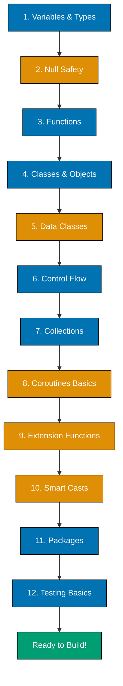

---

# Kotlin Quick Start

**Learn enough Kotlin to explore independently.** This tutorial gives you a quick tour of Kotlin's essential features. You'll explore variables, null safety, functions, classes, collections, and basic coroutines through practical examples. Perfect for getting a quick overview before diving into comprehensive learning.

## What You'll Achieve

By the end of this tutorial, you'll be able to:

- ✅ Understand val vs var and Kotlin's type inference
- ✅ Use Kotlin's null safety system to prevent crashes
- ✅ Write functions with default parameters and lambdas
- ✅ Create classes, data classes, and objects
- ✅ Work with collections idiomatically
- ✅ Understand basic coroutines for async operations
- ✅ Read Kotlin code and understand what it does
- ✅ Know what makes Kotlin special compared to Java
- ✅ Know what to learn next for deeper expertise

## Prerequisites

- Completed [Initial Setup for Kotlin](/en/learn/swe/prog-lang/kotlin/tutorials/initial-setup) - You have Kotlin installed and can run programs
- Or just run the Initial Setup tutorial first

## Learning Path

This Quick Start covers **5-30% of Kotlin knowledge**. It's a **breadth-first** approach - touching all major topics shallowly. For each concept, we show:

1. **Syntax** - How to write it
2. **Example** - Real code
3. **What it does** - Brief explanation
4. **Where to learn more** - Reference to Beginner tutorial for depth

**Note**: This is NOT comprehensive. For thorough learning, see [Complete Beginner's Guide to Kotlin](/en/learn/swe/prog-lang/kotlin/tutorials/beginner).

---

## Kotlin Learning Path

Here's the journey we'll take through 12 core Kotlin concepts:



**Legend**: Blue (#0173B2) = Foundational concepts | Orange (#DE8F05) = Kotlin-specific features | Teal (#029E73) = Ready state

---

## 1. Variables and Types

Kotlin uses **type inference** - the compiler figures out types automatically.

### Val vs Var

```kotlin
fun main() {
    val immutable = "Cannot change"    // Like "final" in Java
    var mutable = "Can change"         // Regular variable

    // immutable = "New value"  // ERROR: val cannot be reassigned
    mutable = "New value"       // OK: var can be reassigned

    println(immutable)
    println(mutable)
}
```

### Type Inference and Explicit Types

```kotlin
fun main() {
    // Type inference (compiler figures it out)
    val age = 25              // Int
    val price = 19.99         // Double
    val name = "Alice"        // String
    val isActive = true       // Boolean

    // Explicit types (optional, but sometimes useful)
    val population: Long = 8_000_000_000
    val discount: Float = 0.1f
    val grade: Char = 'A'

    println("$name is $age years old")
    println("Price: $$price")
}
```

### What's Happening

- **`val`** - Immutable (read-only) reference - prefer this by default
- **`var`** - Mutable (reassignable) variable - use when you need to change the value
- **Type inference** - Kotlin infers types from the value, so you don't need to write them
- **Underscore in numbers** - `8_000_000_000` for readability (like commas in English)
- **String interpolation** - `$name` embeds variables, `${expression}` embeds expressions

**Best practice**: Use `val` by default. Only use `var` when you need mutability.

**Learn more**: See Beginner tutorial section "Variables and Type System" for complete coverage.

---

## 2. Null Safety

**This is Kotlin's killer feature.** Kotlin prevents null pointer exceptions at compile time.

### Nullable Types

```kotlin
fun main() {
    // Non-nullable (default) - cannot be null
    val name: String = "Alice"
    // name = null  // ERROR: Null cannot be assigned

    // Nullable - must explicitly allow null with "?"
    val nickname: String? = null  // OK: "?" means nullable

    println(name.length)          // OK: name is never null
    // println(nickname.length)   // ERROR: might be null
}
```

### Safe Calls and Elvis Operator

```kotlin
fun main() {
    val nickname: String? = null

    // Safe call "?." - returns null if receiver is null
    val length = nickname?.length
    println(length)  // Prints: null

    // Elvis operator "?:" - provides default value
    val displayName = nickname ?: "Anonymous"
    println(displayName)  // Prints: Anonymous

    // Chaining safe calls
    val upperName = nickname?.uppercase()?.substring(0, 3)
    println(upperName)  // Prints: null
}
```

### Let Function for Null-Safe Scopes

```kotlin
fun main() {
    val nickname: String? = "Alice"

    // Execute code only if not null
    nickname?.let {
        println("Nickname length: ${it.length}")
        println("Uppercase: ${it.uppercase()}")
    }

    // If nickname was null, nothing would print
}
```

### The Not-Null Assertion "!!" (Use Sparingly)

```kotlin
fun main() {
    val nickname: String? = "Alice"

    // "!!" says "I'm certain this is not null"
    val length = nickname!!.length
    println(length)  // Prints: 5

    // WARNING: If nickname was null, this throws NullPointerException
    // Use safe calls instead: nickname?.length
}
```

### What's Happening

- **`String`** - Cannot be null (safe by default)
- **`String?`** - Can be null (explicit opt-in to nullability)
- **`?.`** - Safe call operator - returns null if receiver is null
- **`?:`** - Elvis operator - provides default value for null cases
- **`?.let {}`** - Executes block only if not null
- **`!!`** - Forces non-null (throws exception if null) - avoid if possible

**Best practice**: Use `?` only when you truly need nullable values. Use `?.` and `?:` instead of `!!`.

**Learn more**: See Beginner tutorial section "Null Safety" for complete patterns.

---

## 3. Functions

Kotlin makes functions concise and expressive.

### Basic Functions

```kotlin
fun greet(name: String): String {
    return "Hello, $name!"
}

fun main() {
    val message = greet("Alice")
    println(message)  // Prints: Hello, Alice!
}
```

### Single-Expression Functions

```kotlin
// Function body is a single expression - no "return" needed
fun add(x: Int, y: Int): Int = x + y

// Type inference works for return types too
fun multiply(x: Int, y: Int) = x * y

fun main() {
    println(add(5, 3))       // Prints: 8
    println(multiply(5, 3))  // Prints: 15
}
```

### Default Parameters and Named Arguments

```kotlin
fun createUser(
    name: String,
    age: Int = 18,           // Default value
    country: String = "USA"  // Default value
): String {
    return "$name, $age years old, from $country"
}

fun main() {
    println(createUser("Alice"))                        // Uses defaults
    println(createUser("Bob", 25))                      // Overrides age
    println(createUser("Charlie", country = "Canada"))  // Named argument
    println(createUser(name = "Diana", age = 30, country = "UK"))  // All named
}
```

### Lambda Expressions

```kotlin
fun main() {
    // Lambda syntax: { parameters -> body }
    val sum = { x: Int, y: Int -> x + y }
    println(sum(5, 3))  // Prints: 8

    // Type inference for lambdas
    val greet: (String) -> String = { name -> "Hello, $name!" }
    println(greet("Alice"))  // Prints: Hello, Alice!

    // Single parameter - use "it"
    val double: (Int) -> Int = { it * 2 }
    println(double(5))  // Prints: 10
}
```

### Higher-Order Functions

```kotlin
fun performOperation(x: Int, y: Int, operation: (Int, Int) -> Int): Int {
    return operation(x, y)
}

fun main() {
    val result1 = performOperation(5, 3) { a, b -> a + b }
    val result2 = performOperation(5, 3) { a, b -> a * b }

    println(result1)  // Prints: 8
    println(result2)  // Prints: 15
}
```

### What's Happening

- **Single-expression functions** - Use `=` instead of `{}` for one-line functions
- **Default parameters** - Provide default values, reducing method overloading
- **Named arguments** - Call functions with parameter names for clarity
- **Lambdas** - Anonymous functions that can be passed around
- **`it`** - Implicit name for single parameter in lambdas
- **Higher-order functions** - Functions that take functions as parameters

**Best practice**: Use single-expression functions for simple cases. Use default parameters instead of overloading.

**Learn more**: See Beginner tutorial section "Functions and Lambdas" for complete patterns.

---

## 4. Classes and Objects

Kotlin classes are concise compared to Java.

### Basic Classes

```kotlin
// Simple class with primary constructor
class Person(val name: String, var age: Int) {
    fun greet() {
        println("Hello, I'm $name, $age years old")
    }
}

fun main() {
    val person = Person("Alice", 25)
    person.greet()

    // "val" properties are read-only
    println(person.name)
    // person.name = "Bob"  // ERROR: val cannot be reassigned

    // "var" properties are mutable
    person.age = 26
    println(person.age)
}
```

### Companion Objects (Like Static in Java)

```kotlin
class MathUtils {
    companion object {
        fun add(x: Int, y: Int) = x + y
        fun multiply(x: Int, y: Int) = x * y
    }
}

fun main() {
    println(MathUtils.add(5, 3))       // Prints: 8
    println(MathUtils.multiply(5, 3))  // Prints: 15
}
```

### Object Declarations (Singletons)

```kotlin
object DatabaseConfig {
    val url = "jdbc:postgresql://localhost/mydb"
    val username = "admin"

    fun connect() {
        println("Connecting to $url as $username")
    }
}

fun main() {
    DatabaseConfig.connect()
    println(DatabaseConfig.url)
}
```

### What's Happening

- **Primary constructor** - Constructor parameters in class header: `class Person(val name: String)`
- **`val`/`var` in constructor** - Automatically creates properties
- **Companion object** - Like Java static members, but more powerful
- **Object declaration** - Creates a singleton (only one instance exists)

**Best practice**: Use `object` for singletons. Use companion objects for factory methods.

**Learn more**: See Beginner tutorial section "Classes and Objects" for inheritance, interfaces, and more.

---

## 5. Data Classes

Data classes are perfect for holding data - Kotlin generates useful methods automatically.

### Creating Data Classes

```kotlin
data class User(val name: String, val age: Int, val email: String)

fun main() {
    val user = User("Alice", 25, "alice@example.com")

    // Automatically generated toString()
    println(user)  // Prints: User(name=Alice, age=25, email=alice@example.com)

    // Automatically generated equals() and hashCode()
    val user2 = User("Alice", 25, "alice@example.com")
    println(user == user2)  // Prints: true (structural equality)

    // Automatically generated copy() method
    val olderUser = user.copy(age = 26)
    println(olderUser)  // Prints: User(name=Alice, age=26, email=alice@example.com)

    // Destructuring declarations
    val (name, age, email) = user
    println("Name: $name, Age: $age")
}
```

### When to Use Data Classes

```kotlin
// Good use cases for data classes:
data class Product(val id: Int, val name: String, val price: Double)
data class Point(val x: Int, val y: Int)
data class ApiResponse(val status: Int, val data: String)

// NOT good for data classes (behavior-heavy classes):
// class UserService(val repository: UserRepository) { ... }
```

### What's Happening

- **`data class`** - Automatically generates `toString()`, `equals()`, `hashCode()`, `copy()`
- **`toString()`** - Pretty-prints the object
- **`equals()`** - Compares by value (structural equality), not reference
- **`copy()`** - Creates a copy with some properties changed
- **Destructuring** - Extract properties: `val (name, age) = user`

**Best practice**: Use data classes for simple data holders. Don't use for classes with complex behavior.

**Learn more**: See Beginner tutorial section "Data Classes" for complete patterns.

---

## 6. Control Flow

Kotlin's control flow is more expressive than Java's.

### If as an Expression

```kotlin
fun main() {
    val score = 85

    // "if" returns a value in Kotlin
    val grade = if (score >= 90) {
        "A"
    } else if (score >= 80) {
        "B"
    } else if (score >= 70) {
        "C"
    } else {
        "F"
    }

    println("Grade: $grade")  // Prints: Grade: B
}
```

### When Expression (Like Switch but Better)

```kotlin
fun main() {
    val dayOfWeek = 3

    val dayName = when (dayOfWeek) {
        1 -> "Monday"
        2 -> "Tuesday"
        3 -> "Wednesday"
        4 -> "Thursday"
        5 -> "Friday"
        6, 7 -> "Weekend"  // Multiple values
        else -> "Invalid"
    }

    println(dayName)  // Prints: Wednesday
}
```

### When with Conditions

```kotlin
fun main() {
    val score = 85

    val result = when {
        score >= 90 -> "Excellent"
        score >= 80 -> "Good"
        score >= 70 -> "Average"
        else -> "Needs improvement"
    }

    println(result)  // Prints: Good
}
```

### When with Type Checks

```kotlin
fun describe(obj: Any): String {
    return when (obj) {
        is String -> "String of length ${obj.length}"
        is Int -> "Integer with value $obj"
        is List<*> -> "List with ${obj.size} items"
        else -> "Unknown type"
    }
}

fun main() {
    println(describe("Hello"))      // Prints: String of length 5
    println(describe(42))           // Prints: Integer with value 42
    println(describe(listOf(1, 2))) // Prints: List with 2 items
}
```

### Ranges and Loops

```kotlin
fun main() {
    // For loop with range
    for (i in 1..5) {
        print("$i ")  // Prints: 1 2 3 4 5
    }
    println()

    // For loop with until (exclusive end)
    for (i in 1 until 5) {
        print("$i ")  // Prints: 1 2 3 4
    }
    println()

    // For loop with step
    for (i in 1..10 step 2) {
        print("$i ")  // Prints: 1 3 5 7 9
    }
    println()

    // Downward iteration
    for (i in 5 downTo 1) {
        print("$i ")  // Prints: 5 4 3 2 1
    }
    println()

    // While loop
    var count = 0
    while (count < 3) {
        println("Count: $count")
        count++
    }
}
```

### What's Happening

- **`if` expression** - Returns a value (no ternary operator needed)
- **`when` expression** - More powerful than Java's switch (works with any type)
- **Ranges** - `1..5` (inclusive), `1 until 5` (exclusive)
- **`step`** - Skip values in range
- **`downTo`** - Iterate backward
- **Smart casts** - After `is` check, Kotlin automatically casts the variable

**Best practice**: Use `when` instead of long if-else chains. Use ranges for iteration.

**Learn more**: See Beginner tutorial section "Control Flow" for complete patterns.

---

## 7. Collections

Kotlin provides powerful collection operations out of the box.

### Creating Collections

```kotlin
fun main() {
    // Immutable list (read-only)
    val numbers = listOf(1, 2, 3, 4, 5)

    // Mutable list
    val mutableNumbers = mutableListOf(1, 2, 3)
    mutableNumbers.add(4)

    // Set (unique elements)
    val uniqueNumbers = setOf(1, 2, 2, 3)  // 2 appears only once

    // Map (key-value pairs)
    val ages = mapOf(
        "Alice" to 25,
        "Bob" to 30,
        "Charlie" to 35
    )

    println(numbers)       // Prints: [1, 2, 3, 4, 5]
    println(uniqueNumbers) // Prints: [1, 2, 3]
    println(ages["Alice"]) // Prints: 25
}
```

### Collection Operations

```kotlin
fun main() {
    val numbers = listOf(1, 2, 3, 4, 5)

    // Map - transform each element
    val doubled = numbers.map { it * 2 }
    println(doubled)  // Prints: [2, 4, 6, 8, 10]

    // Filter - keep elements matching condition
    val evens = numbers.filter { it % 2 == 0 }
    println(evens)  // Prints: [2, 4]

    // Sum, average, max, min
    println(numbers.sum())     // Prints: 15
    println(numbers.average()) // Prints: 3.0
    println(numbers.max())     // Prints: 5

    // Any, all, none
    println(numbers.any { it > 3 })  // Prints: true
    println(numbers.all { it > 0 })  // Prints: true
    println(numbers.none { it < 0 }) // Prints: true

    // Chaining operations
    val result = numbers
        .filter { it % 2 == 0 }
        .map { it * it }
        .sum()
    println(result)  // Prints: 20 (2²+ 4² = 4 + 16)
}
```

### What's Happening

- **`listOf()`** - Creates immutable list
- **`mutableListOf()`** - Creates mutable list
- **`setOf()`** - Creates set (no duplicates)
- **`mapOf()`** - Creates map (key-value pairs)
- **`to`** - Creates pair: `"Alice" to 25`
- **Collection operations** - `map`, `filter`, `sum`, `max`, etc.
- **Chaining** - Combine multiple operations fluently

**Best practice**: Use immutable collections by default. Use collection operations instead of loops.

**Learn more**: See Beginner tutorial section "Collections" for complete operations and sequences.

---

## 8. Coroutines Basics

Coroutines make async programming simple and readable.

### Basic Coroutine

```kotlin
import kotlinx.coroutines.*

fun main() = runBlocking {
    launch {
        delay(1000)
        println("World!")
    }

    println("Hello,")
}

// Output:
// Hello,
// World! (after 1 second)
```

### Async and Await

```kotlin
import kotlinx.coroutines.*

fun main() = runBlocking {
    val deferred1 = async {
        delay(1000)
        10
    }

    val deferred2 = async {
        delay(1000)
        20
    }

    // Both run concurrently
    val result = deferred1.await() + deferred2.await()
    println("Result: $result")  // Prints after ~1 second (not 2)
}
```

### What's Happening

- **`runBlocking`** - Starts a coroutine and blocks until it completes (for main functions)
- **`launch`** - Starts a coroutine that doesn't return a value
- **`async`** - Starts a coroutine that returns a value (via `Deferred`)
- **`delay()`** - Suspends coroutine without blocking thread
- **`await()`** - Waits for result from `async`

**Best practice**: Use coroutines instead of threads for async operations. Use `async`/`await` for concurrent tasks.

**Learn more**: See Intermediate tutorial section "Coroutines" for structured concurrency, dispatchers, and Flow.

---

## 9. Extension Functions

Extension functions let you add functions to existing classes without modifying them.

### Creating Extension Functions

```kotlin
// Add a function to String class
fun String.isPalindrome(): Boolean {
    val cleaned = this.lowercase().replace(" ", "")
    return cleaned == cleaned.reversed()
}

// Add a function to Int class
fun Int.squared(): Int = this * this

fun main() {
    println("racecar".isPalindrome())  // Prints: true
    println("hello".isPalindrome())    // Prints: false

    println(5.squared())  // Prints: 25
    println(10.squared()) // Prints: 100
}
```

### Extension Functions with Nullable Receivers

```kotlin
fun String?.orDefault(default: String): String {
    return this ?: default
}

fun main() {
    val name: String? = null
    println(name.orDefault("Anonymous"))  // Prints: Anonymous

    val validName: String? = "Alice"
    println(validName.orDefault("Anonymous"))  // Prints: Alice
}
```

### What's Happening

- **Extension function** - Adds function to existing class
- **`this`** - Refers to the receiver object
- **Nullable receiver** - Extension can handle nullable types
- **No modification** - Original class is not changed (extension is syntactic sugar)

**Best practice**: Use extensions for utility functions. Don't overuse - keep classes cohesive.

**Learn more**: See Beginner tutorial section "Extension Functions" for complete patterns.

---

## 10. Smart Casts

Kotlin automatically casts variables after type checks.

### Automatic Casting

```kotlin
fun describe(obj: Any): String {
    if (obj is String) {
        // obj is automatically cast to String
        return "String of length ${obj.length}"
    }

    if (obj is Int) {
        // obj is automatically cast to Int
        return "Number: ${obj + 10}"
    }

    return "Unknown type"
}

fun main() {
    println(describe("Hello"))  // Prints: String of length 5
    println(describe(42))       // Prints: Number: 52
}
```

### Smart Casts with When

```kotlin
fun processValue(value: Any?) {
    when (value) {
        null -> println("Null value")
        is String -> println("String: ${value.uppercase()}")
        is Int -> println("Int: ${value * 2}")
        is List<*> -> println("List size: ${value.size}")
        else -> println("Unknown type")
    }
}

fun main() {
    processValue(null)
    processValue("hello")
    processValue(42)
    processValue(listOf(1, 2, 3))
}
```

### What's Happening

- **`is`** - Type check operator
- **Smart cast** - After `is` check, Kotlin automatically casts the variable
- **Works with** - `if`, `when`, `&&`, `||`
- **Null checks** - Also trigger smart casts for nullable types

**Best practice**: Use smart casts instead of explicit casts. Kotlin handles it automatically.

**Learn more**: See Beginner tutorial section "Type Checks and Casts" for complete patterns.

---

## 11. Packages and Imports

Kotlin organizes code using packages.

### Declaring Packages

```kotlin
// File: src/main/kotlin/com/example/utils/StringUtils.kt
package com.example.utils

fun String.capitalize(): String {
    return this.replaceFirstChar { it.uppercase() }
}

fun reverse(text: String): String {
    return text.reversed()
}
```

### Importing and Using

```kotlin
// File: src/main/kotlin/Main.kt
import com.example.utils.capitalize
import com.example.utils.reverse

fun main() {
    println("hello".capitalize())  // Prints: Hello
    println(reverse("hello"))      // Prints: olleh
}
```

### Import Aliases

```kotlin
import com.example.utils.reverse as rev

fun main() {
    println(rev("Kotlin"))  // Prints: niltoK
}
```

### What's Happening

- **`package`** - Declares package name (matches directory structure)
- **`import`** - Makes code from other packages available
- **`import ... as`** - Renames import to avoid conflicts
- **Wildcard import** - `import com.example.utils.*` imports everything

**Best practice**: Use specific imports. Use aliases to resolve naming conflicts.

**Learn more**: See Beginner tutorial section "Packages and Modules" for complete organization patterns.

---

## 12. Testing Basics

Kotlin works seamlessly with JUnit for testing.

### Simple Test

```kotlin
import org.junit.jupiter.api.Test
import kotlin.test.assertEquals

class CalculatorTest {
    @Test
    fun `addition works correctly`() {
        val result = 2 + 2
        assertEquals(4, result)
    }

    @Test
    fun `string concatenation works`() {
        val greeting = "Hello, " + "Kotlin"
        assertEquals("Hello, Kotlin", greeting)
    }
}
```

### Testing Functions

```kotlin
fun add(x: Int, y: Int) = x + y

class MathTest {
    @Test
    fun `add returns sum of two numbers`() {
        assertEquals(8, add(5, 3))
        assertEquals(0, add(5, -5))
        assertEquals(-8, add(-5, -3))
    }
}
```

### What's Happening

- **`@Test`** - Marks function as a test
- **Backticks** - Allow test names with spaces for readability
- **`assertEquals()`** - Asserts expected value equals actual value
- **JUnit 5** - Standard testing framework for JVM

**Best practice**: Write tests with descriptive names. Test edge cases and normal cases.

**Learn more**: See Beginner tutorial section "Testing" for complete testing patterns and MockK.

---

## What Makes Kotlin Special?

Now that you've seen the basics, here's what makes Kotlin stand out:

1. **Null Safety** - Eliminates null pointer exceptions through the type system
2. **Conciseness** - Write less code while maintaining readability (compare with Java examples)
3. **Expressiveness** - `if`, `when`, and other constructs are expressions that return values
4. **Modern Features** - Data classes, extension functions, coroutines, lambdas out of the box
5. **Java Interoperability** - Use any Java library seamlessly, migrate gradually from Java
6. **Pragmatic** - Combines OOP and functional programming without dogma
7. **Tooling** - Excellent IntelliJ IDEA support, built by the same company

**Comparison with Java**:

- **Less boilerplate** - No getters/setters, no `new` keyword, no semicolons
- **Safer** - Null safety prevents crashes
- **More concise** - Data classes replace verbose POJOs
- **Better async** - Coroutines are simpler than threads/callbacks
- **Smarter** - Type inference, smart casts reduce repetition

Kotlin is "Java, but better" - all the power with modern language design.

---

## Next Steps

Congratulations! You now know the core concepts that make up 5-30% of Kotlin.

### Continue Learning

**Choose Your Path**:

1. **[Complete Beginner's Guide to Kotlin](/en/learn/swe/prog-lang/kotlin/tutorials/beginner)** - Deep dive into everything you just learned, plus comprehensive coverage of OOP, functional programming, collections, testing, and more. Go here for thorough foundation.

2. **[Intermediate Kotlin](/en/learn/swe/prog-lang/kotlin/tutorials/intermediate)** - Production patterns including advanced coroutines, design patterns, databases, REST APIs, and performance. Good if you already know Java well.

3. **[Kotlin How-To Guides](/en/learn/swe/prog-lang/kotlin/how-to/)** - Problem-solving guides for specific tasks like null safety patterns, coroutines, data classes, and Java migration.

4. **[Kotlin Cookbook](/en/learn/swe/prog-lang/kotlin/how-to/cookbook)** - Copy-paste recipes for common tasks organized by category.

### What You Learned

You can now:

- ✅ Use `val` and `var` with type inference
- ✅ Handle nullable types safely with `?`, `?.`, `?:`, and `?.let`
- ✅ Write functions with default parameters and lambdas
- ✅ Create classes, data classes, and objects
- ✅ Use `when` expressions for powerful pattern matching
- ✅ Work with collections using `map`, `filter`, and other operations
- ✅ Write basic coroutines with `launch` and `async`
- ✅ Add functions to existing classes with extensions
- ✅ Rely on smart casts after type checks
- ✅ Organize code with packages and imports
- ✅ Write basic tests with JUnit

### Practice Projects

Try building these to reinforce your knowledge:

1. **Todo List** - Create a simple command-line todo app using lists and data classes
2. **Calculator** - Build a calculator using `when` expressions for operations
3. **Word Counter** - Read a file and count words using collection operations
4. **API Client** - Make HTTP requests using coroutines (with ktor-client library)

### Additional Resources

- **Official Kotlin Docs**: [https://kotlinlang.org/docs/home.html](https://kotlinlang.org/docs/home.html)
- **Kotlin Koans** (interactive exercises): [https://play.kotlinlang.org/koans](https://play.kotlinlang.org/koans)
- **Kotlin by Example**: [https://play.kotlinlang.org/byExample/overview](https://play.kotlinlang.org/byExample/overview)
- **Kotlin Standard Library**: [https://kotlinlang.org/api/latest/jvm/stdlib/](https://kotlinlang.org/api/latest/jvm/stdlib/)

---

**Quick Start Complete!** You're now ready for deeper Kotlin learning or to start building projects.
