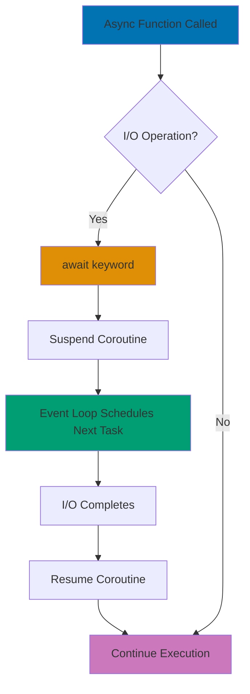

## Problem

Modern Python applications require efficient concurrent I/O operations. Simple sequential code blocks on network/disk operations, wasting CPU cycles and degrading user experience.

## Solution

### 1. Advanced asyncio Patterns

```python
import asyncio
from typing import List, Any

# Async context managers
class AsyncDatabaseConnection:
    async def __aenter__(self):
        self.conn = await self._connect()
        return self.conn

    async def __aexit__(self, exc_type, exc_val, exc_tb):
        await self.conn.close()

    async def _connect(self):
        # Simulate connection
        await asyncio.sleep(0.1)
        return {"status": "connected"}

# Usage
async def fetch_data():
    async with AsyncDatabaseConnection() as conn:
        # Connection automatically closed after block
        return await conn.get("SELECT * FROM users")
```

### 2. Concurrent Request Handling with aiohttp

```python
import aiohttp
import asyncio
from typing import List, Dict

async def fetch_url(session: aiohttp.ClientSession, url: str) -> Dict:
    """Fetch single URL with timeout and error handling."""
    try:
        async with session.get(url, timeout=aiohttp.ClientTimeout(total=10)) as response:
            return {
                "url": url,
                "status": response.status,
                "data": await response.json()
            }
    except asyncio.TimeoutError:
        return {"url": url, "error": "timeout"}
    except Exception as e:
        return {"url": url, "error": str(e)}

async def fetch_multiple_urls(urls: List[str]) -> List[Dict]:
    """Fetch multiple URLs concurrently."""
    async with aiohttp.ClientSession() as session:
        tasks = [fetch_url(session, url) for url in urls]
        return await asyncio.gather(*tasks)

# Usage
urls = [
    "https://api.example.com/users/1",
    "https://api.example.com/users/2",
    "https://api.example.com/users/3"
]
results = asyncio.run(fetch_multiple_urls(urls))
```

### 3. Async Generators for Streaming

```python
import asyncio
from typing import AsyncIterator

async def fetch_paginated_data(page_size: int = 100) -> AsyncIterator[Dict]:
    """Stream paginated API results without loading all into memory."""
    page = 1
    while True:
        # Simulate API call
        await asyncio.sleep(0.1)
        data = await fetch_page(page, page_size)

        if not data:
            break

        for item in data:
            yield item

        page += 1

async def fetch_page(page: int, size: int) -> List[Dict]:
    """Simulate fetching a page of data."""
    # Simulated data - would be actual API call
    if page > 3:
        return []
    return [{"id": i, "page": page} for i in range(size)]

# Usage - process items as they arrive
async def process_all_items():
    async for item in fetch_paginated_data(page_size=50):
        await process_item(item)

async def process_item(item: Dict):
    # Process individual item
    print(f"Processing {item['id']}")
```

### 4. Task Groups for Structured Concurrency

```python
import asyncio
from typing import List

async def download_file(url: str, filename: str):
    """Download a single file."""
    await asyncio.sleep(1)  # Simulate download
    print(f"Downloaded {filename}")
    return filename

async def download_files_structured(urls: List[str]):
    """Use task groups for automatic cancellation on error."""
    async with asyncio.TaskGroup() as tg:
        tasks = [
            tg.create_task(download_file(url, f"file_{i}.dat"))
            for i, url in enumerate(urls)
        ]

    # All tasks complete or all cancelled if one fails
    return [task.result() for task in tasks]

# Python 3.11+ feature - automatic cleanup
urls = ["http://example.com/file1", "http://example.com/file2"]
try:
    results = asyncio.run(download_files_structured(urls))
except* Exception as eg:
    # Handle exception group
    for exc in eg.exceptions:
        print(f"Task failed: {exc}")
```

### 5. Rate Limiting with Semaphores

```python
import asyncio
from typing import List, Callable, Any

class RateLimiter:
    """Rate limiter using semaphore and delays."""

    def __init__(self, max_concurrent: int, requests_per_second: float):
        self.semaphore = asyncio.Semaphore(max_concurrent)
        self.delay = 1.0 / requests_per_second
        self.last_request = 0

    async def acquire(self):
        """Acquire rate limit permission."""
        async with self.semaphore:
            # Ensure minimum delay between requests
            now = asyncio.get_event_loop().time()
            time_since_last = now - self.last_request

            if time_since_last < self.delay:
                await asyncio.sleep(self.delay - time_since_last)

            self.last_request = asyncio.get_event_loop().time()
            yield

async def rate_limited_fetch(
    limiter: RateLimiter,
    url: str
) -> Dict:
    """Fetch URL with rate limiting."""
    async with limiter.acquire():
        # Actual request happens here
        await asyncio.sleep(0.1)  # Simulate request
        return {"url": url, "status": "success"}

# Usage: Max 5 concurrent, 10 requests/second
async def fetch_with_limits():
    limiter = RateLimiter(max_concurrent=5, requests_per_second=10)
    urls = [f"https://api.example.com/item/{i}" for i in range(100)]

    tasks = [rate_limited_fetch(limiter, url) for url in urls]
    return await asyncio.gather(*tasks)
```

### 6. Background Task Management

```python
import asyncio
from typing import Set

class BackgroundTasks:
    """Manage background tasks with graceful shutdown."""

    def __init__(self):
        self.tasks: Set[asyncio.Task] = set()

    def create_task(self, coro) -> asyncio.Task:
        """Create and track background task."""
        task = asyncio.create_task(coro)
        self.tasks.add(task)
        task.add_done_callback(self.tasks.discard)
        return task

    async def shutdown(self):
        """Cancel all tasks and wait for completion."""
        for task in self.tasks:
            task.cancel()

        await asyncio.gather(*self.tasks, return_exceptions=True)

# Usage
async def background_worker(name: str):
    """Long-running background task."""
    try:
        while True:
            print(f"{name} working...")
            await asyncio.sleep(1)
    except asyncio.CancelledError:
        print(f"{name} cancelled")
        raise

async def main():
    bg_tasks = BackgroundTasks()

    # Start background workers
    bg_tasks.create_task(background_worker("Worker-1"))
    bg_tasks.create_task(background_worker("Worker-2"))

    # Do main work
    await asyncio.sleep(5)

    # Graceful shutdown
    await bg_tasks.shutdown()

asyncio.run(main())
```

## How It Works



**Key Mechanisms:**

1. **Event Loop**: Single-threaded event loop manages all async operations
2. **Coroutines**: Functions defined with `async def` that can be suspended with `await`
3. **Tasks**: Wrapped coroutines scheduled for execution by the event loop
4. **Futures**: Placeholder objects representing results of async operations

**Execution Flow:**

```python
# When you call await:
result = await some_async_function()

# 1. Current coroutine suspends
# 2. Control returns to event loop
# 3. Event loop schedules other tasks
# 4. When some_async_function() completes, current coroutine resumes
# 5. Result assigned to variable
```

## Variations

### Async Iterator for Database Cursor

```python
class AsyncCursor:
    """Async iterator for large database results."""

    def __init__(self, query: str):
        self.query = query
        self.position = 0
        self.batch_size = 100

    def __aiter__(self):
        return self

    async def __anext__(self):
        # Fetch next batch
        batch = await self._fetch_batch(self.position, self.batch_size)

        if not batch:
            raise StopAsyncIteration

        self.position += len(batch)
        return batch

    async def _fetch_batch(self, offset: int, limit: int):
        await asyncio.sleep(0.1)  # Simulate query
        # Return empty after 5 batches
        if offset >= 500:
            return []
        return [{"id": i} for i in range(offset, offset + limit)]

# Usage
async def process_large_resultset():
    cursor = AsyncCursor("SELECT * FROM large_table")

    async for batch in cursor:
        for row in batch:
            await process_row(row)
```

### Timeout Handling

```python
import asyncio

async def fetch_with_timeout(url: str, timeout: float = 5.0):
    """Fetch with timeout protection."""
    try:
        return await asyncio.wait_for(
            fetch_data(url),
            timeout=timeout
        )
    except asyncio.TimeoutError:
        return {"error": "Request timed out", "url": url}

async def fetch_data(url: str):
    # Simulate slow request
    await asyncio.sleep(10)
    return {"data": "result"}

# Usage
result = await fetch_with_timeout("https://slow-api.com", timeout=3.0)
```

### Retry Logic with Exponential Backoff

```python
import asyncio
from typing import Callable, TypeVar, Any

T = TypeVar('T')

async def retry_with_backoff(
    func: Callable[..., T],
    max_retries: int = 3,
    base_delay: float = 1.0,
    *args,
    **kwargs
) -> T:
    """Retry async function with exponential backoff."""

    for attempt in range(max_retries):
        try:
            return await func(*args, **kwargs)
        except Exception as e:
            if attempt == max_retries - 1:
                raise

            delay = base_delay * (2 ** attempt)
            print(f"Attempt {attempt + 1} failed: {e}. Retrying in {delay}s...")
            await asyncio.sleep(delay)

# Usage
async def unreliable_api_call():
    # Simulated flaky API
    import random
    if random.random() < 0.7:
        raise Exception("API Error")
    return {"status": "success"}

result = await retry_with_backoff(unreliable_api_call, max_retries=5)
```

## Common Pitfalls

### 1. Blocking the Event Loop

**Problem**: Calling blocking I/O in async functions freezes the event loop.

```python
import asyncio
import time

# ❌ Bad: Blocks event loop
async def bad_sleep():
    time.sleep(5)  # Blocks entire event loop!
    return "done"

# ✅ Good: Non-blocking sleep
async def good_sleep():
    await asyncio.sleep(5)  # Suspends coroutine only
    return "done"
```

**Solution**: Use async alternatives or run blocking code in executor:

```python
import asyncio
from concurrent.futures import ThreadPoolExecutor

def blocking_operation():
    """CPU-intensive or blocking I/O."""
    time.sleep(5)
    return "result"

async def run_blocking_safely():
    loop = asyncio.get_event_loop()
    executor = ThreadPoolExecutor()

    # Run in thread pool to avoid blocking event loop
    result = await loop.run_in_executor(executor, blocking_operation)
    return result
```

### 2. Not Awaiting Coroutines

**Problem**: Forgetting `await` creates unawaited coroutine warnings.

```python
# ❌ Bad: Coroutine never executes
async def fetch_data():
    return {"data": "value"}

async def main():
    result = fetch_data()  # Warning: coroutine was never awaited
    print(result)  # Prints: <coroutine object fetch_data>

# ✅ Good: Await the coroutine
async def main():
    result = await fetch_data()  # Properly awaited
    print(result)  # Prints: {'data': 'value'}
```

### 3. Mixing Sync and Async Code Incorrectly

**Problem**: Can't call async functions from sync code without event loop.

```python
# ❌ Bad: Can't await in sync function
def sync_function():
    result = await async_function()  # SyntaxError!
    return result

# ✅ Good: Use asyncio.run or create event loop
def sync_function():
    return asyncio.run(async_function())

# ✅ Better: Keep async chain intact
async def async_wrapper():
    return await async_function()
```

### 4. Not Handling Task Cancellation

**Problem**: Tasks can be cancelled - cleanup code might not run.

```python
# ❌ Bad: Resource leak on cancellation
async def bad_resource_handling():
    resource = await acquire_resource()
    await long_operation()
    await resource.close()  # Never called if cancelled!

# ✅ Good: Always cleanup resources
async def good_resource_handling():
    resource = await acquire_resource()
    try:
        await long_operation()
    finally:
        await resource.close()  # Always called

# ✅ Better: Use async context managers
async def best_resource_handling():
    async with acquire_resource() as resource:
        await long_operation()
    # Automatic cleanup
```

### 5. Creating Too Many Concurrent Tasks

**Problem**: Unlimited concurrency overwhelms system resources.

```python
# ❌ Bad: 10000 concurrent connections!
async def bad_concurrent_requests():
    urls = [f"http://api.com/item/{i}" for i in range(10000)]
    tasks = [fetch_url(url) for url in urls]
    return await asyncio.gather(*tasks)

# ✅ Good: Limit concurrency with semaphore
async def good_concurrent_requests():
    semaphore = asyncio.Semaphore(10)  # Max 10 concurrent
    urls = [f"http://api.com/item/{i}" for i in range(10000)]

    async def bounded_fetch(url):
        async with semaphore:
            return await fetch_url(url)

    tasks = [bounded_fetch(url) for url in urls]
    return await asyncio.gather(*tasks)
```

## Related Patterns

**Related Tutorial**: See [Advanced Tutorial - Async Programming](../tutorials/advanced.md#async-programming).
**Related How-To**: See [Work with Async Databases](./work-with-databases.md).
**Related Cookbook**: See Cookbook recipe "Advanced Async Patterns".
