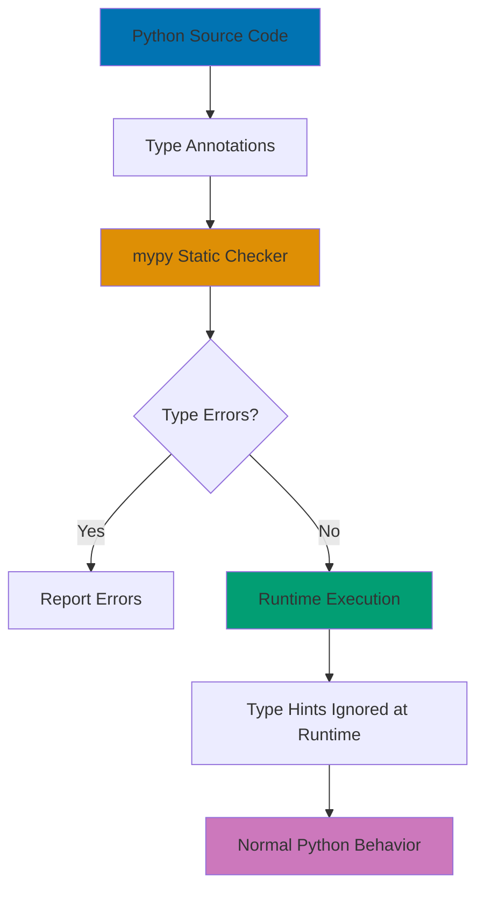

## Problem

Python's dynamic typing enables rapid development but causes runtime errors from type mismatches. Type hints provide static type checking without sacrificing flexibility, catching errors before production.

## Solution

### 1. Basic Type Annotations

```python
from typing import List, Dict, Set, Tuple, Optional

# Function annotations
def greet(name: str) -> str:
    """Greet user by name."""
    return f"Hello, {name}!"

def calculate_average(numbers: List[float]) -> float:
    """Calculate average of numbers."""
    if not numbers:
        return 0.0
    return sum(numbers) / len(numbers)

# Variable annotations
age: int = 25
scores: List[int] = [85, 90, 92]
user_data: Dict[str, str] = {"name": "John", "email": "john@example.com"}
unique_ids: Set[int] = {1, 2, 3}
coordinates: Tuple[float, float] = (10.5, 20.3)

# Optional types
def find_user(user_id: int) -> Optional[Dict[str, str]]:
    """Return user or None if not found."""
    users = {1: {"name": "Alice"}, 2: {"name": "Bob"}}
    return users.get(user_id)

# Multiple types with Union
from typing import Union

def process_id(user_id: Union[int, str]) -> str:
    """Process user ID as int or string."""
    return str(user_id)
```

### 2. Advanced Generic Types

```python
from typing import TypeVar, Generic, List, Callable

# Generic type variables
T = TypeVar('T')
K = TypeVar('K')
V = TypeVar('V')

# Generic function
def first_element(items: List[T]) -> Optional[T]:
    """Return first element or None."""
    return items[0] if items else None

# Usage - mypy infers types
number_list: List[int] = [1, 2, 3]
first_num: Optional[int] = first_element(number_list)  # Type: Optional[int]

string_list: List[str] = ["a", "b", "c"]
first_str: Optional[str] = first_element(string_list)  # Type: Optional[str]

# Generic class
class Stack(Generic[T]):
    """Generic stack data structure."""

    def __init__(self) -> None:
        self._items: List[T] = []

    def push(self, item: T) -> None:
        """Push item onto stack."""
        self._items.append(item)

    def pop(self) -> Optional[T]:
        """Pop item from stack."""
        return self._items.pop() if self._items else None

    def peek(self) -> Optional[T]:
        """Peek at top item."""
        return self._items[-1] if self._items else None

# Usage with type safety
int_stack: Stack[int] = Stack()
int_stack.push(1)
int_stack.push(2)
value: Optional[int] = int_stack.pop()  # mypy knows this is Optional[int]

str_stack: Stack[str] = Stack()
str_stack.push("hello")
# str_stack.push(123)  # mypy error: Argument 1 has incompatible type "int"

# Generic dictionary wrapper
class Cache(Generic[K, V]):
    """Generic cache with key-value pairs."""

    def __init__(self) -> None:
        self._data: Dict[K, V] = {}

    def set(self, key: K, value: V) -> None:
        """Set cache value."""
        self._data[key] = value

    def get(self, key: K) -> Optional[V]:
        """Get cache value."""
        return self._data.get(key)

# Usage
user_cache: Cache[int, str] = Cache()
user_cache.set(1, "Alice")
name: Optional[str] = user_cache.get(1)
```

### 3. Protocol for Structural Subtyping

```python
from typing import Protocol, runtime_checkable

@runtime_checkable
class Drawable(Protocol):
    """Protocol for drawable objects."""

    def draw(self) -> str:
        """Draw the object."""
        ...

class Circle:
    """Circle implements Drawable protocol."""

    def __init__(self, radius: float):
        self.radius = radius

    def draw(self) -> str:
        return f"Drawing circle with radius {self.radius}"

class Square:
    """Square implements Drawable protocol."""

    def __init__(self, side: float):
        self.side = side

    def draw(self) -> str:
        return f"Drawing square with side {self.side}"

# Function accepts any Drawable
def render(shape: Drawable) -> None:
    """Render any drawable shape."""
    print(shape.draw())

# Usage - no explicit inheritance needed
circle = Circle(5.0)
square = Square(10.0)

render(circle)  # Works - Circle has draw method
render(square)  # Works - Square has draw method

# Runtime check
print(isinstance(circle, Drawable))  # True

# More complex protocol
class Comparable(Protocol):
    """Protocol for comparable objects."""

    def __lt__(self, other: "Comparable") -> bool:
        """Less than comparison."""
        ...

    def __gt__(self, other: "Comparable") -> bool:
        """Greater than comparison."""
        ...

def find_max(items: List[Comparable]) -> Comparable:
    """Find maximum element."""
    if not items:
        raise ValueError("Empty list")

    max_item = items[0]
    for item in items[1:]:
        if item > max_item:
            max_item = item
    return max_item
```

### 4. TypedDict for Structured Dictionaries

```python
from typing import TypedDict, Required, NotRequired

# Basic TypedDict
class UserDict(TypedDict):
    """Typed dictionary for user data."""
    id: int
    username: str
    email: str
    age: int

# Usage with type checking
def create_user(user_data: UserDict) -> None:
    """Create user from typed dict."""
    print(f"Creating user: {user_data['username']}")

user: UserDict = {
    "id": 1,
    "username": "john_doe",
    "email": "john@example.com",
    "age": 30
}

create_user(user)  # Type safe

# Invalid - mypy error
# bad_user: UserDict = {
#     "id": 1,
#     "username": "john_doe",
#     # Missing required fields!
# }

# Optional fields with NotRequired (Python 3.11+)
class UserProfile(TypedDict):
    """User profile with optional bio."""
    username: Required[str]
    email: Required[str]
    bio: NotRequired[str]
    avatar_url: NotRequired[str]

profile: UserProfile = {
    "username": "alice",
    "email": "alice@example.com"
    # bio and avatar_url are optional
}

# total=False for all optional fields
class PartialUser(TypedDict, total=False):
    """All fields optional."""
    id: int
    username: str
    email: str

partial: PartialUser = {"username": "bob"}  # Valid

# Nested TypedDict
class Address(TypedDict):
    """Address typed dict."""
    street: str
    city: str
    postal_code: str

class Employee(TypedDict):
    """Employee with nested address."""
    id: int
    name: str
    address: Address

employee: Employee = {
    "id": 1,
    "name": "Jane Doe",
    "address": {
        "street": "123 Main St",
        "city": "San Francisco",
        "postal_code": "94105"
    }
}
```

### 5. Callable Types for Functions

```python
from typing import Callable, List

# Function that takes int and returns str
IntToStr = Callable[[int], str]

def apply_formatter(value: int, formatter: IntToStr) -> str:
    """Apply formatter function to value."""
    return formatter(value)

# Usage
def format_as_hex(n: int) -> str:
    return hex(n)

def format_as_binary(n: int) -> str:
    return bin(n)

result1 = apply_formatter(42, format_as_hex)  # "0x2a"
result2 = apply_formatter(42, format_as_binary)  # "0b101010"

# Generic callback type
Callback = Callable[[T], None]

def process_items(items: List[T], callback: Callback[T]) -> None:
    """Process items with callback."""
    for item in items:
        callback(item)

# Usage
def print_item(item: int) -> None:
    print(f"Processing: {item}")

numbers = [1, 2, 3, 4, 5]
process_items(numbers, print_item)

# Higher-order function types
Transform = Callable[[T], U]

def map_list(items: List[T], transform: Transform[T, U]) -> List[U]:
    """Map transformation over list."""
    return [transform(item) for item in items]

# Usage
def double(x: int) -> int:
    return x * 2

doubled = map_list([1, 2, 3], double)  # List[int]

def to_string(x: int) -> str:
    return str(x)

strings = map_list([1, 2, 3], to_string)  # List[str]
```

### 6. Static Type Checking with mypy

```bash
# Install mypy
pip install mypy

# Check single file
mypy script.py

# Check entire project
mypy src/

# Strict mode (recommended)
mypy --strict src/

# Configuration file: mypy.ini or pyproject.toml
```

**mypy.ini configuration**:

```ini
[mypy]
python_version = 3.11
warn_return_any = True
warn_unused_configs = True
disallow_untyped_defs = True
disallow_any_generics = True
disallow_subclassing_any = True
disallow_untyped_calls = True
disallow_incomplete_defs = True
check_untyped_defs = True
no_implicit_optional = True
warn_redundant_casts = True
warn_unused_ignores = True
warn_no_return = True
warn_unreachable = True
strict_equality = True

# Per-module options
[mypy-tests.*]
disallow_untyped_defs = False
```

**Example with mypy checks**:

```python
from typing import List, Optional

def find_index(items: List[int], target: int) -> Optional[int]:
    """Find index of target in items."""
    try:
        return items.index(target)
    except ValueError:
        return None

# mypy validates this
index: Optional[int] = find_index([1, 2, 3], 2)

if index is not None:
    # mypy knows index is int here (type narrowing)
    print(f"Found at index: {index}")

# mypy catches this error
# bad_call: Optional[int] = find_index("not a list", 2)
# error: Argument 1 to "find_index" has incompatible type "str"; expected "List[int]"
```

## How It Works



**Type Checking Flow:**

1. **Development**: Write code with type annotations
2. **Static Analysis**: mypy analyzes code without executing
3. **Error Detection**: Catches type mismatches, missing attributes, incompatible operations
4. **Runtime**: Type hints have zero runtime overhead (ignored by interpreter)
5. **IDE Integration**: IDEs use hints for autocomplete and error highlighting

## Variations

### Literal Types for Specific Values

```python
from typing import Literal

Mode = Literal["read", "write", "append"]

def open_file(filename: str, mode: Mode) -> None:
    """Open file with specific mode."""
    print(f"Opening {filename} in {mode} mode")

open_file("data.txt", "read")  # Valid
# open_file("data.txt", "invalid")  # mypy error: incompatible type
```

### Final to Prevent Overriding

```python
from typing import Final

API_KEY: Final[str] = "secret-key-123"
# API_KEY = "new-key"  # mypy error: Cannot assign to final name

class Base:
    def method(self) -> None:
        pass

from typing import final

class Derived(Base):
    @final
    def method(self) -> None:
        """This method cannot be overridden."""
        pass

# class SubDerived(Derived):
#     def method(self) -> None:  # mypy error: Cannot override final method
#         pass
```

### Overload for Multiple Signatures

```python
from typing import overload, Union

@overload
def process(value: int) -> str:
    ...

@overload
def process(value: str) -> int:
    ...

def process(value: Union[int, str]) -> Union[str, int]:
    """Process int to str or str to int."""
    if isinstance(value, int):
        return str(value)
    return len(value)

# mypy knows:
result1: str = process(42)  # Type: str
result2: int = process("hello")  # Type: int
```

## Common Pitfalls

### 1. Using List/Dict Instead of list/dict

**Problem**: Old syntax deprecated in Python 3.9+.

```python
# ❌ Deprecated: Capital List/Dict
from typing import List, Dict

def old_style(items: List[int]) -> Dict[str, int]:
    return {}

# ✅ Modern: Lowercase list/dict (Python 3.9+)
def new_style(items: list[int]) -> dict[str, int]:
    return {}
```

### 2. Ignoring Optional for None Returns

**Problem**: Functions returning None need Optional.

```python
# ❌ Bad: Missing Optional
def find_user(user_id: int) -> dict:
    """May return None but type doesn't show it."""
    if user_id == 1:
        return {"name": "Alice"}
    return None  # mypy error: incompatible return type

# ✅ Good: Explicit Optional
from typing import Optional

def find_user(user_id: int) -> Optional[dict]:
    """Explicitly handles None case."""
    if user_id == 1:
        return {"name": "Alice"}
    return None  # Type safe
```

### 3. Using Any Too Liberally

**Problem**: Any disables type checking.

```python
from typing import Any

# ❌ Bad: Defeats purpose of type hints
def process_data(data: Any) -> Any:
    # No type safety at all!
    return data.something()

# ✅ Good: Use specific types or generics
def process_data(data: Dict[str, int]) -> int:
    return sum(data.values())

# ✅ Better: Use TypeVar for flexibility with safety
from typing import TypeVar

T = TypeVar('T')

def identity(value: T) -> T:
    return value
```

### 4. Not Handling Type Narrowing

**Problem**: Not checking types before operations.

```python
# ❌ Bad: No type guard
def bad_length(value: Union[str, list]) -> int:
    return len(value)  # Works but mypy might warn

# ✅ Good: Type narrowing with isinstance
def good_length(value: Union[str, list]) -> int:
    if isinstance(value, str):
        # mypy knows value is str here
        return len(value)
    else:
        # mypy knows value is list here
        return len(value)

# ✅ Better: Use TypeGuard for reusable checks
from typing import TypeGuard

def is_string(value: Union[str, list]) -> TypeGuard[str]:
    return isinstance(value, str)

def process(value: Union[str, list]) -> int:
    if is_string(value):
        # mypy knows value is str
        return len(value.upper())
    else:
        # mypy knows value is list
        return len(value)
```

### 5. Circular Import Issues with TYPE_CHECKING

**Problem**: Type hints cause circular imports.

```python
# ❌ Bad: Circular import
# file: user.py
from post import Post

class User:
    def __init__(self):
        self.posts: List[Post] = []

# file: post.py
from user import User  # Circular import!

class Post:
    def __init__(self, author: User):
        self.author = author

# ✅ Good: Use TYPE_CHECKING
# file: user.py
from typing import TYPE_CHECKING, List

if TYPE_CHECKING:
    from post import Post

class User:
    def __init__(self):
        self.posts: List["Post"] = []  # String annotation

# file: post.py
from typing import TYPE_CHECKING

if TYPE_CHECKING:
    from user import User

class Post:
    def __init__(self, author: "User"):
        self.author = author
```

## Related Patterns

**Related Tutorial**: See [Intermediate Tutorial - Type Hints](../tutorials/intermediate.md#type-hints).
**Related How-To**: See [Implement Data Validation](./data-validation-patterns.md).
**Related Cookbook**: See Cookbook recipe "Type Safety Patterns".
