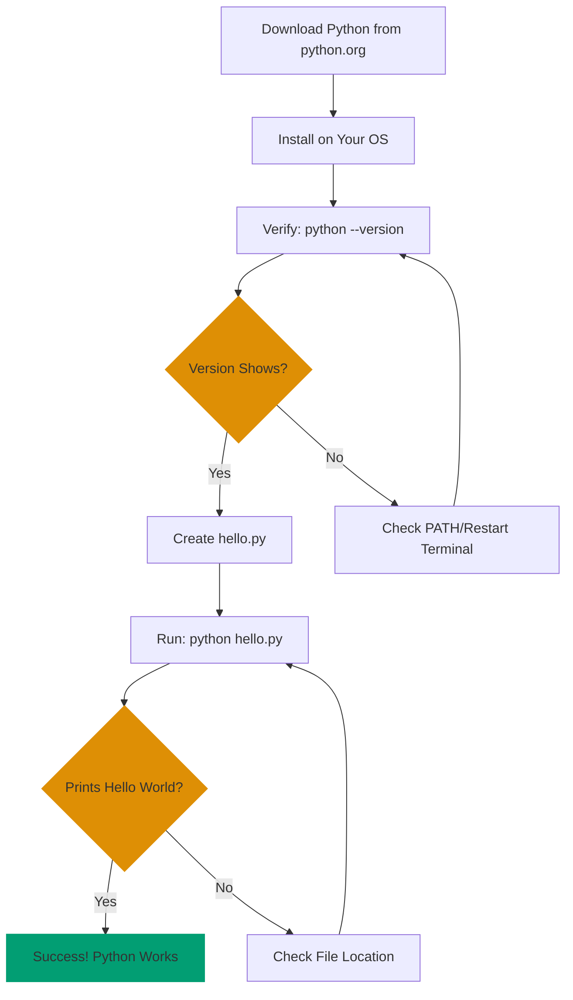

**Get Python up and running quickly.** This guide covers installation and your first "Hello, World!" program. No programming experience needed.

## 🎯 What You'll Accomplish

By the end of this tutorial, you'll have:

- ✅ Python installed and verified
- ✅ Your first Python program running
- ✅ Confidence that Python works on your system

## 🔄 Installation Verification Flow

Here's the simple path from download to running code:



This diagram shows every verification checkpoint - you'll know immediately if something's wrong and where to look.

## 📋 Prerequisites

- Basic familiarity with your computer's terminal/command line
- No programming experience needed
- Internet connection to download Python

## 💾 Step 1: Download and Install Python

### Windows

1. Visit [python.org/downloads](https://www.python.org/downloads/)
2. Click the "Download Python 3.x.x" button (latest stable version)
3. Run the installer
4. **CRITICAL**: Check "Add Python to PATH" before clicking "Install Now"
5. Click "Install Now" and follow the prompts

### macOS

**Option 1: Official Installer (Recommended)**

1. Visit [python.org/downloads](https://www.python.org/downloads/)
2. Choose the appropriate version:
   - **Apple Silicon** (M1/M2/M3): Download universal installer (works for both)
   - **Intel**: Download universal installer
3. Run the installer and follow the prompts

**Option 2: Homebrew**

```bash
# Install Homebrew if not already installed
/bin/bash -c "$(curl -fsSL https://raw.githubusercontent.com/Homebrew/install/HEAD/install.sh)"

# Install Python
brew install python

# Verify (see next section)
python3 --version
```

### Linux

Using package manager (Ubuntu/Debian):

```bash
# Update package list
sudo apt update

# Install Python 3
sudo apt install python3 python3-pip

# Verify (see next section)
python3 --version
```

For other distributions:

- **Fedora/RHEL**: `sudo dnf install python3`
- **Arch**: `sudo pacman -S python`

## ✅ Step 2: Verify Installation

Open a new terminal/command prompt and run:

```bash
# Windows
python --version

# macOS/Linux
python3 --version
```

**Expected output**:

```
Python 3.13.7
```

(Version number will vary - Python 3.12.x, 3.13.x, or 3.14.x are all current and supported)

**If you get an error**:

- "command not found": Python isn't in your PATH. Try restarting your terminal.
- On Windows: Re-run installer and check "Add Python to PATH".
- On macOS/Linux: Python might be installed as `python3` only.

## 🚀 Step 3: Create Your First Program

Create a new file called `hello.py`:

```python
print("Hello, World!")
```

**What this means** (don't memorize, just read):

- `print()` - Built-in function that outputs text to the screen
- `"Hello, World!"` - A string (text) to be printed
- No semicolons, no main function, no imports needed

## ▶️ Step 4: Run Your Program

In the same directory as `hello.py`:

```bash
# Windows
python hello.py

# macOS/Linux
python3 hello.py
```

**Expected output**:

```
Hello, World!
```

Congratulations! You've run your first Python program!

## 🧪 Step 5: Explore the Interactive Shell

Python includes an interactive shell (REPL - Read-Eval-Print Loop) for experimenting:

```bash
# Windows
python

# macOS/Linux
python3
```

You'll see a prompt like `>>>`. Try some commands:

```python
>>> print("Hello!")
Hello!
>>> 2 + 2
4
>>> name = "Alice"
>>> print(f"Hello, {name}!")
Hello, Alice!
>>> exit()
```

Type `exit()` or press `Ctrl+D` (macOS/Linux) or `Ctrl+Z` then Enter (Windows) to exit.

## 📦 Step 6: Verify pip (Package Manager)

Python includes `pip`, the package installer. Verify it works:

```bash
# Windows
python -m pip --version

# macOS/Linux
python3 -m pip --version
```

**Expected output**:

```
pip 23.3.1 from /path/to/pip (python 3.12)
```

## ✔️ Verification Checklist

Before moving forward, verify:

- [ ] `python --version` (or `python3 --version`) shows Python 3.13.x or 3.14.x
- [ ] `python hello.py` prints "Hello, World!"
- [ ] Interactive shell (`python` or `python3`) starts and responds to commands
- [ ] `python -m pip --version` shows pip is installed

## 🎉 You're Done!

You've successfully installed Python and run your first program. You're ready for the next step.

## 📚 What's Next?

Now that Python is working, you have two paths:

**Quick learner**: [Python Quick Start](quick-start)

- Learn core syntax and basic patterns
- Understand enough to explore Python independently

**Comprehensive learner**: [Complete Beginner's Guide to Python](beginner)

- Comprehensive coverage of Python fundamentals
- Hands-on exercises and practice
- Ready to build real applications

**Problem solver**: Check the How-To Guides for practical Python solutions

## 🆘 Troubleshooting

**Problem**: "python: command not found" after installation

**Solution**:

1. Verify installation completed successfully
2. Restart your terminal/command prompt
3. On Windows: Re-run installer and check "Add Python to PATH"
4. On macOS/Linux: Try `python3` instead of `python`

**Problem**: Multiple Python versions installed

**Solution**: Verify which Python is in use:

```bash
# Check Python location
which python3  # macOS/Linux
where python   # Windows

# Check all installed versions
python3 --version
python3.11 --version
python3.12 --version
```

Use the specific version command (e.g., `python3.12 hello.py`) if needed.

**Problem**: "hello.py: file not found" when running

**Solution**: Ensure you're in the same directory as `hello.py`. Check with:

```bash
ls       # macOS/Linux, shows files in current directory
dir      # Windows, shows files in current directory
```

**Problem**: "Permission denied" when running on macOS/Linux

**Solution**: You don't need execute permissions for Python scripts. Run with:

```bash
python3 hello.py
```

Not:

```bash
./hello.py  # This requires execute permissions
```

**Problem**: pip not found or outdated

**Solution**: Upgrade pip:

```bash
# Windows
python -m pip install --upgrade pip

# macOS/Linux
python3 -m pip install --upgrade pip
```

---

**Still stuck?** Visit [Python Documentation](https://docs.python.org/) or the [Python Community Forums](https://discuss.python.org/).
