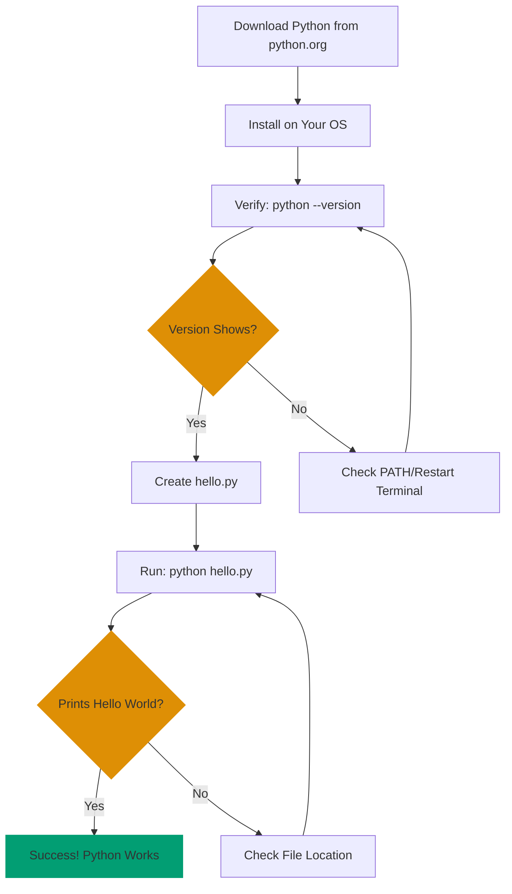

Want to start programming in Python but not sure where to begin? Installing Python is straightforward, and you'll run your first program soon. This guide walks you through installation on any operating system and gets you writing code immediately - no programming experience needed.

## 🎯 What You'll Accomplish

By the end of this tutorial, you'll have:

- ✅ Python installed and verified
- ✅ Your first Python program running
- ✅ Confidence that Python works on your system

## 🔄 Installation Verification Flow

Here's the simple path from download to running code:



This diagram shows every verification checkpoint - you'll know immediately if something's wrong and where to look.

## 📋 Prerequisites

- Basic familiarity with your computer's terminal/command line
- No programming experience needed
- Internet connection to download Python

**After installation**, explore the [Python Cookbook](/en/learn/swe/prog-lang/python/how-to/cookbook) for practical recipes or start with the [Quick Start tutorial](/en/learn/swe/prog-lang/python/tutorials/quick-start) to learn core syntax.

## 💾 Step 1: Download and Install Python

### Windows

1. Visit [python.org/downloads](https://www.python.org/downloads/)
2. Click the "Download Python 3.x.x" button (latest stable version)
3. Run the installer
4. **CRITICAL**: Check "Add Python to PATH" before clicking "Install Now"
   - This makes Python accessible from any command prompt
   - Without this, you'll need to manually add Python to your PATH later
5. Click "Install Now" and follow the prompts
6. Wait for installation to complete
7. Close the installer when you see "Setup was successful"

**Windows Installation Tips**:

- The installer adds Python to `C:\Users\YourName\AppData\Local\Programs\Python\Python3xx\`
- If you forget to check "Add to PATH", you can:
  - Rerun the installer and select "Modify"
  - Or add manually: Control Panel → System → Advanced → Environment Variables
- Administrator privileges may be required
- Antivirus software might slow down installation

### macOS

**Option 1: Official Installer (Recommended)**

1. Visit [python.org/downloads](https://www.python.org/downloads/)
2. Choose the appropriate version:
   - **Apple Silicon** (M1/M2/M3): Download universal installer (works for both)
   - **Intel**: Download universal installer
3. Run the installer and follow the prompts

**Option 2: Homebrew**

```bash
# Install Homebrew if not already installed
/bin/bash -c "$(curl -fsSL https://raw.githubusercontent.com/Homebrew/install/HEAD/install.sh)"

# Install Python
brew install python

# Verify (see next section)
python3 --version
```

**macOS Installation Tips**:

- macOS comes with Python 2.7 pre-installed (deprecated) - ignore it
- Always use `python3` command on macOS, not `python`
- Homebrew Python installs to `/opt/homebrew/bin/python3` (Apple Silicon) or `/usr/local/bin/python3` (Intel)
- Official installer includes IDLE (Python IDE) and documentation
- Xcode Command Line Tools might be required for Homebrew
- If you see certificate errors, run `/Applications/Python\ 3.xx/Install\ Certificates.command`

### Linux

Using package manager (Ubuntu/Debian):

```bash
# Update package list
sudo apt update

# Install Python 3
sudo apt install python3 python3-pip

# Verify (see next section)
python3 --version
```

For other distributions:

- **Fedora/RHEL**: `sudo dnf install python3`
- **Arch**: `sudo pacman -S python`
- **openSUSE**: `sudo zypper install python3`
- **Gentoo**: `sudo emerge dev-lang/python`

**Linux Installation Tips**:

- Most Linux distributions include Python 3 by default
- Check existing Python: `python3 --version`
- Install `python3-venv` for virtual environment support (Ubuntu/Debian)
- Install `python3-dev` if you'll compile Python packages (Ubuntu/Debian)
- Use distribution packages for system integration
- Consider `pyenv` for managing multiple Python versions

## ✅ Step 2: Verify Installation

Open a new terminal/command prompt and run:

```bash
# Windows
python --version

# macOS/Linux
python3 --version
```

**Expected output**:

```
Python 3.13.7
```

(Version number will vary - Python 3.12.x, 3.13.x, or 3.14.x are all current and supported)

**If you get an error**:

- "command not found": Python isn't in your PATH. Try restarting your terminal.
- On Windows: Re-run installer and check "Add Python to PATH".
- On macOS/Linux: Python might be installed as `python3` only.

## 🚀 Step 3: Create Your First Program

Create a new file called `hello.py` using any text editor:

**Using a Text Editor**:

- **Windows**: Notepad, Notepad++, VS Code
- **macOS**: TextEdit (in Plain Text mode), VS Code, Sublime Text
- **Linux**: nano, vim, gedit, VS Code

**Using Command Line**:

```bash
# Windows (Command Prompt)
echo print("Hello, World!") > hello.py

# macOS/Linux (Terminal)
echo 'print("Hello, World!")' > hello.py
```

**File Contents**:

```python
print("Hello, World!")
```

**What this means** (don't memorize, just read):

- `print()` - Built-in function that outputs text to the screen
- `"Hello, World!"` - A string (text) to be printed
- No semicolons, no main function, no imports needed
- Python uses indentation instead of braces `{}`
- `.py` extension tells your system this is a Python file

**Important**: Save as `.py` file, not `.txt`. If using Windows Notepad, choose "All Files" in "Save as type" dropdown.

## ▶️ Step 4: Run Your Program

In the same directory as `hello.py`:

```bash
# Windows
python hello.py

# macOS/Linux
python3 hello.py
```

**Expected output**:

```
Hello, World!
```

Congratulations! You've run your first Python program!

## 🧪 Step 5: Explore the Interactive Shell

Python includes an interactive shell (REPL - Read-Eval-Print Loop) for experimenting:

```bash
# Windows
python

# macOS/Linux
python3
```

You'll see a prompt like `>>>`. Try some commands:

```python
>>> print("Hello!")
Hello!
>>> 2 + 2
4
>>> name = "Alice"
>>> print(f"Hello, {name}!")
Hello, Alice!
>>> exit()
```

Type `exit()` or press `Ctrl+D` (macOS/Linux) or `Ctrl+Z` then Enter (Windows) to exit.

The interactive shell is perfect for experimenting - you'll use it extensively in the [Quick Start tutorial](/en/learn/swe/prog-lang/python/tutorials/quick-start) and [Beginner tutorial](/en/learn/swe/prog-lang/python/tutorials/beginner).

## 📦 Step 6: Verify pip (Package Manager)

Python includes `pip`, the package installer. Verify it works:

```bash
# Windows
python -m pip --version

# macOS/Linux
python3 -m pip --version
```

**Expected output**:

```
pip 23.3.1 from /path/to/pip (python 3.12)
```

**What is pip?**:

- Package installer for Python (pip installs packages)
- Manages third-party libraries from [PyPI](https://pypi.org/)
- Essential for installing tools like Django, Flask, NumPy, etc.
- Always use `python -m pip` instead of just `pip` to avoid version conflicts
- Comes pre-installed with Python 3.4+

For best practices on managing packages, see [Manage Python packages effectively](/en/learn/swe/prog-lang/python/how-to/manage-dependencies-and-environments) and [Use virtual environments](/en/learn/swe/prog-lang/python/how-to/manage-dependencies-and-environments).

**Common pip commands** (you'll use these later):

```bash
# Install a package
python -m pip install package_name

# List installed packages
python -m pip list

# Upgrade pip itself
python -m pip install --upgrade pip
```

## ✔️ Verification Checklist

Before moving forward, verify:

- [ ] `python --version` (or `python3 --version`) shows Python 3.13.x or 3.14.x
- [ ] `python hello.py` prints "Hello, World!"
- [ ] Interactive shell (`python` or `python3`) starts and responds to commands
- [ ] `python -m pip --version` shows pip is installed

## 🎉 You're Done!

You've successfully installed Python and run your first program. You're ready for the next step.

## 📚 What's Next?

Now that Python is working, choose your learning path:

**Quick learner**: [Python Quick Start](/en/learn/swe/prog-lang/python/tutorials/quick-start)

- Learn core syntax and basic patterns in one session
- Understand enough to explore Python independently
- Great for experienced programmers learning Python

**Comprehensive learner**: [Complete Beginner's Guide to Python](/en/learn/swe/prog-lang/python/tutorials/beginner)

- Comprehensive coverage of Python fundamentals
- Hands-on exercises and practice
- Build a solid foundation for real applications

**Problem solver**: [Python Cookbook](/en/learn/swe/prog-lang/python/how-to/cookbook)

- Jump straight into practical recipes
- Copy-paste-modify approach
- Solutions to common Python tasks

**Reference seeker**: [Python Cheat Sheet](/en/learn/swe/prog-lang/python/reference/cheat-sheet)

- Quick syntax reference
- Common patterns at a glance
- Perfect for quick lookups

## 🆘 Troubleshooting

### Common Installation Issues

**Problem**: "python: command not found" after installation

**Solution**:

1. Verify installation completed successfully
2. Restart your terminal/command prompt (this refreshes PATH)
3. On Windows: Re-run installer and check "Add Python to PATH"
4. On macOS/Linux: Try `python3` instead of `python`
5. Verify PATH contains Python:
   ```bash
   echo $PATH  # macOS/Linux
   echo %PATH%  # Windows
   ```

**Problem**: Multiple Python versions installed

**Solution**: Verify which Python is in use:

```bash
# Check Python location
which python3  # macOS/Linux
where python   # Windows

# Check all installed versions
python3 --version
python3.11 --version
python3.12 --version
python3.13 --version
```

Use the specific version command (e.g., `python3.12 hello.py`) if needed.

**Best practice**: Use [pyenv](https://github.com/pyenv/pyenv) to manage multiple Python versions cleanly. See also [Manage Python versions effectively](/en/learn/swe/prog-lang/python/how-to/manage-python-versions) for detailed guidance.

**Problem**: "hello.py: file not found" when running

**Solution**: Ensure you're in the same directory as `hello.py`. Check with:

```bash
ls       # macOS/Linux, shows files in current directory
dir      # Windows, shows files in current directory
pwd      # Print working directory (both)
```

Navigate to the correct directory:

```bash
cd path/to/directory  # Change directory
```

**Problem**: "Permission denied" when running on macOS/Linux

**Solution**: You don't need execute permissions for Python scripts. Run with:

```bash
python3 hello.py
```

Not:

```bash
./hello.py  # This requires execute permissions
```

If you want to run as `./hello.py`, add shebang and permissions:

```python
#!/usr/bin/env python3
print("Hello, World!")
```

```bash
chmod +x hello.py
./hello.py
```

**Problem**: pip not found or outdated

**Solution**: Upgrade pip:

```bash
# Windows
python -m pip install --upgrade pip

# macOS/Linux
python3 -m pip install --upgrade pip
```

**Problem**: SSL certificate errors on macOS

**Solution**: Install certificates:

```bash
# Find and run the certificate installer
/Applications/Python\ 3.13/Install\ Certificates.command
```

This is common after fresh Python installation on macOS.

**Problem**: "SyntaxError" when running Python 2 code with Python 3

**Solution**: Python 3 syntax differs from Python 2. Common differences:

- `print` is a function: `print("text")` not `print "text"`
- Division returns float: `5/2 = 2.5` not `2`
- Use Python 3 tutorials and code examples

### Platform-Specific Issues

**Windows**: If Python installed but `python` command doesn't work:

1. Search for "Edit environment variables" in Start menu
2. Click "Environment Variables"
3. Find "Path" in System variables
4. Add Python installation path (e.g., `C:\Users\YourName\AppData\Local\Programs\Python\Python313\`)

**macOS**: If Homebrew Python conflicts with system Python:

```bash
# Use Homebrew Python explicitly
/opt/homebrew/bin/python3  # Apple Silicon
/usr/local/bin/python3     # Intel
```

**Linux**: If `pip` requires sudo:

```bash
# Don't use sudo with pip!
# Instead, install packages for user only:
python3 -m pip install --user package_name
```

Or use virtual environments (recommended, covered in [Quick Start tutorial](/en/learn/swe/prog-lang/python/tutorials/quick-start) and [Use virtual environments](/en/learn/swe/prog-lang/python/how-to/manage-dependencies-and-environments)).

---

**Still stuck?** Visit [Python Documentation](https://docs.python.org/) or the [Python Community Forums](https://discuss.python.org/). Also check our [Python Resources](/en/learn/swe/prog-lang/python/reference/resources) for more learning materials and community links.
