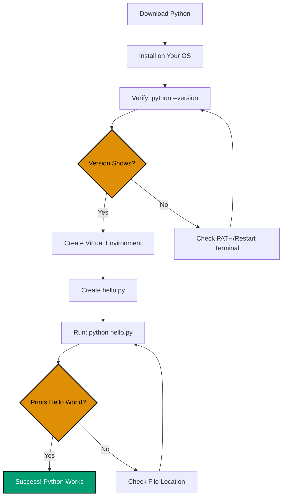

**Get Python up and running quickly.** This guide covers installation, virtual environment setup, and your first "Hello, World!" program. No programming experience needed.

## 🎯 What You'll Accomplish

By the end of this tutorial, you'll have:

- ✅ Python installed and verified
- ✅ Virtual environment configured
- ✅ Your first Python program running
- ✅ A code editor ready for Python development
- ✅ Confidence that Python works on your system

## 🔄 Installation Verification Flow

Here's the simple path from download to running code:



This diagram shows every verification checkpoint - you'll know immediately if something's wrong and where to look.

## 📋 Prerequisites

- Basic familiarity with your computer's terminal/command line
- No programming experience needed
- Internet connection to download Python
- Administrator access to install software

## 🎓 Coverage

This tutorial covers **0-5%** of Python knowledge - just the essentials to get started. You'll learn enough to install Python, verify it works, and run your first program.

## 💾 Step 1: Download and Install Python

### Windows Installation

**Option 1: Official Installer (Recommended for Beginners)**

1. Visit [python.org/downloads](https://www.python.org/downloads/)
2. Click the "Download Python 3.x.x" button (latest stable version, 3.11+ recommended)
3. Run the installer (`.exe` file)
4. **CRITICAL**: Check "Add Python to PATH" before clicking "Install Now"
5. Click "Install Now" and follow the prompts
6. Verify by opening Command Prompt and running `python --version`

**Option 2: Windows Package Manager (winget)**

Modern Windows 11 includes winget, the official package manager:

```powershell
# Install latest Python
winget install Python.Python.3.13

# Or specify version
winget install Python.Python.3.12
```

After installation, restart your terminal and verify with `python --version`.

**Option 3: Chocolatey (Advanced)**

If you use Chocolatey for package management:

```powershell
# Install Chocolatey if needed (run as Administrator)
# See https://chocolatey.org/install for instructions

# Install Python
choco install python

# Verify
python --version
```

**Which option should you choose?**

- **New to programming**: Use Option 1 (official installer)
- **Comfortable with command line**: Use Option 2 (winget)
- **Already use Chocolatey**: Use Option 3

### macOS Installation

**Option 1: Official Installer (Recommended for Beginners)**

1. Visit [python.org/downloads](https://www.python.org/downloads/)
2. Choose the appropriate version:
   - **Apple Silicon** (M1/M2/M3/M4): Download universal installer
   - **Intel**: Download universal installer (same file works for both)
3. Run the installer (`.pkg` file) and follow the prompts
4. Open Terminal and verify with `python3 --version`

**Option 2: Homebrew (Recommended for Developers)**

Homebrew is the most popular package manager for macOS:

```bash
# Install Homebrew if not already installed
/bin/bash -c "$(curl -fsSL https://raw.githubusercontent.com/Homebrew/install/HEAD/install.sh)"

# Install Python (installs latest stable version)
brew install python

# Verify
python3 --version

# Optional: Link python3 to python
# This allows you to use 'python' instead of 'python3'
brew link python
```

**Option 3: pyenv (Multiple Python Versions)**

Use pyenv when you need to manage multiple Python versions:

```bash
# Install pyenv via Homebrew
brew install pyenv

# Add pyenv to shell configuration
echo 'export PYENV_ROOT="$HOME/.pyenv"' >> ~/.zshrc
echo 'export PATH="$PYENV_ROOT/bin:$PATH"' >> ~/.zshrc
echo 'eval "$(pyenv init --path)"' >> ~/.zshrc

# Restart terminal or reload configuration
source ~/.zshrc

# Install Python 3.12
pyenv install 3.12.7

# Set as global default
pyenv global 3.12.7

# Verify
python --version
```

**Which option should you choose?**

- **New to programming**: Use Option 1 (official installer)
- **Regular macOS developer**: Use Option 2 (Homebrew)
- **Need multiple Python versions**: Use Option 3 (pyenv)

### Linux Installation

**Ubuntu/Debian**

```bash
# Update package list
sudo apt update

# Install Python 3 and pip
sudo apt install python3 python3-pip python3-venv

# Verify
python3 --version
pip3 --version
```

**Fedora/RHEL/CentOS**

```bash
# Update system
sudo dnf update

# Install Python 3
sudo dnf install python3 python3-pip

# Verify
python3 --version
pip3 --version
```

**Arch Linux**

```bash
# Update system
sudo pacman -Syu

# Install Python
sudo pacman -S python python-pip

# Verify
python --version
pip --version
```

**openSUSE**

```bash
# Install Python
sudo zypper install python3 python3-pip

# Verify
python3 --version
pip3 --version
```

**Using pyenv (All Distributions)**

For managing multiple Python versions on Linux:

```bash
# Install build dependencies (Ubuntu/Debian example)
sudo apt install -y make build-essential libssl-dev zlib1g-dev \
  libbz2-dev libreadline-dev libsqlite3-dev wget curl llvm \
  libncursesw5-dev xz-utils tk-dev libxml2-dev libxmlsec1-dev \
  libffi-dev liblzma-dev

# Install pyenv
curl https://pyenv.run | bash

# Add to shell configuration (~/.bashrc or ~/.zshrc)
echo 'export PYENV_ROOT="$HOME/.pyenv"' >> ~/.bashrc
echo 'export PATH="$PYENV_ROOT/bin:$PATH"' >> ~/.bashrc
echo 'eval "$(pyenv init --path)"' >> ~/.bashrc

# Reload configuration
source ~/.bashrc

# Install Python version
pyenv install 3.12.7

# Set as global default
pyenv global 3.12.7

# Verify
python --version
```

## ✅ Step 2: Verify Installation

Open a new terminal/command prompt and run:

```bash
# Windows
python --version

# macOS/Linux
python3 --version
```

**Expected output**:

```
Python 3.13.11
```

**Version compatibility**: Python 3.11, 3.12, 3.13, or 3.14 are all excellent choices. Python 3.10 still works but consider upgrading for better performance.

**If you get an error**:

- "command not found": Python isn't in your PATH. Try restarting your terminal.
- On Windows: Re-run installer and check "Add Python to PATH".
- On macOS/Linux: Python might be installed as `python3` only (this is normal).

## 🔧 Step 3: Set Up Virtual Environment

Virtual environments isolate Python projects from each other, preventing dependency conflicts. This is a best practice you should always follow.

### Understanding Virtual Environments

**Why use virtual environments?**

- **Isolation**: Each project has its own dependencies
- **No conflicts**: Different projects can use different package versions
- **Clean system**: Don't pollute system Python with project packages
- **Reproducibility**: Easy to share exact dependency versions

**Three popular tools**:

1. **venv** - Built into Python (recommended for beginners)
2. **virtualenv** - Enhanced version with more features
3. **poetry** - Modern dependency management (advanced)

### Option 1: venv (Built-in, Recommended)

```bash
# Create a virtual environment named 'venv'
# Windows
python -m venv venv

# macOS/Linux
python3 -m venv venv

# Activate the virtual environment
# Windows (Command Prompt)
venv\Scripts\activate.bat

# Windows (PowerShell)
venv\Scripts\Activate.ps1

# macOS/Linux
source venv/bin/activate

# Your prompt should change to show (venv)
# Example: (venv) user@machine:~$

# Verify virtual environment is active
which python   # macOS/Linux
where python   # Windows
# Should point to the venv directory

# Deactivate when done (optional for now)
deactivate
```

### Option 2: virtualenv (Enhanced Features)

```bash
# Install virtualenv
pip install virtualenv

# Create virtual environment
virtualenv venv

# Activate (same commands as venv above)
# Windows (Command Prompt)
venv\Scripts\activate.bat

# macOS/Linux
source venv/bin/activate

# Deactivate when done
deactivate
```

### Option 3: Poetry (Modern, All-in-One)

Poetry handles both virtual environments and dependency management:

```bash
# Install poetry (macOS/Linux)
curl -sSL https://install.python-poetry.org | python3 -

# Install poetry (Windows PowerShell)
(Invoke-WebRequest -Uri https://install.python-poetry.org -UseBasicParsing).Content | py -

# Add poetry to PATH (check installation output for instructions)

# Create a new project with virtual environment
poetry new my-python-project
cd my-python-project

# Or initialize in existing directory
poetry init

# Install dependencies (creates virtual environment automatically)
poetry install

# Activate virtual environment
poetry shell

# Run commands in virtual environment without activating
poetry run python script.py

# Deactivate
exit
```

**Which should you use?**

- **Learning Python**: Use venv (built-in, no extra installation)
- **Professional projects**: Use poetry (modern, handles dependencies well)
- **Need backward compatibility**: Use virtualenv (works with older Python)

For this tutorial, we'll use **venv** since it's built into Python.

## 🚀 Step 4: Create Your First Program

With your virtual environment activated (you should see `(venv)` in your prompt), create a new file called `hello.py`:

```python
print("Hello, World!")
```

**What this means** (don't memorize, just read):

- `print()` - Built-in function that outputs text to the screen
- `"Hello, World!"` - A string (text) to be printed
- No semicolons, no main function, no imports needed

**Save the file** in your project directory (the same directory where you created `venv`).

## ▶️ Step 5: Run Your Program

In the same directory as `hello.py`, with virtual environment activated:

```bash
# Windows
python hello.py

# macOS/Linux
python hello.py  # or python3 hello.py
```

**Expected output**:

```
Hello, World!
```

Congratulations! You've run your first Python program in a virtual environment!

## 🧪 Step 6: Explore the Interactive Shell

Python includes an interactive shell (REPL - Read-Eval-Print Loop) for experimenting:

```bash
# Windows
python

# macOS/Linux
python3  # or just python if in virtual environment
```

You'll see a prompt like `>>>`. Try some commands:

```python
>>> print("Hello!")
Hello!
>>> 2 + 2
4
>>> name = "Alice"
>>> print(f"Hello, {name}!")
Hello, Alice!
>>> 10 * 5
50
>>> "Python" + " " + "Rocks!"
'Python Rocks!'
>>> exit()
```

Type `exit()` or press `Ctrl+D` (macOS/Linux) or `Ctrl+Z` then Enter (Windows) to exit.

## 📦 Step 7: Verify pip (Package Manager)

Python includes `pip`, the package installer. With virtual environment activated:

```bash
# Check pip version
pip --version

# Or explicitly use pip3
pip3 --version
```

**Expected output**:

```
pip 25.3 from /path/to/venv/lib/python3.12/site-packages/pip (python 3.12)
```

**Upgrade pip** (recommended):

```bash
# Inside virtual environment
pip install --upgrade pip
```

## 🛠️ Step 8: Configure Your Code Editor

### VS Code (Recommended)

Visual Studio Code is free and has excellent Python support.

1. **Install VS Code**: Download from [code.visualstudio.com](https://code.visualstudio.com/)

2. **Install Python Extension**:
   - Open VS Code
   - Click Extensions icon (or press `Ctrl+Shift+X`)
   - Search for "Python" (by Microsoft)
   - Click Install

3. **Configure Python Interpreter**:
   - Open your project folder in VS Code
   - Press `Ctrl+Shift+P` (or `Cmd+Shift+P` on macOS)
   - Type "Python: Select Interpreter"
   - Choose the interpreter from your virtual environment (`./venv/bin/python`)

4. **Recommended VS Code Settings** (optional):
   - Press `Ctrl+,` to open settings
   - Search for "python formatting provider" and select "black" or "autopep8"
   - Search for "python linting enabled" and enable it
   - Search for "python linting pylint enabled" and enable it

### PyCharm (Professional IDE)

PyCharm is a full-featured Python IDE (free Community edition available).

1. **Install PyCharm**: Download from [jetbrains.com/pycharm](https://www.jetbrains.com/pycharm/)
   - Community Edition (free) is perfect for learning
   - Professional Edition (paid) adds web development features

2. **Create/Open Project**:
   - File → New Project
   - Choose location
   - Select "Previously configured interpreter" and point to your `venv/bin/python`

3. **PyCharm auto-detects** virtual environments and handles most configuration automatically.

### Other Editors

**Sublime Text**: Install "Anaconda" package for Python support

**Vim/Neovim**: Use python-mode plugin or configure LSP with pyright

**Emacs**: Use elpy or python-mode

**For beginners**, we recommend **VS Code** - it's free, lightweight, and has great Python tooling.

## ✔️ Verification Checklist

Before moving forward, verify:

- [ ] `python --version` (or `python3 --version`) shows Python 3.11.x or newer
- [ ] Virtual environment created and can be activated (prompt shows `(venv)`)
- [ ] `python hello.py` prints "Hello, World!" inside virtual environment
- [ ] Interactive shell (`python` or `python3`) starts and responds to commands
- [ ] `pip --version` shows pip is installed in virtual environment
- [ ] Code editor is configured and recognizes Python

## 🎉 You're Done!

You've successfully:

- ✅ Installed Python
- ✅ Created a virtual environment
- ✅ Run your first program
- ✅ Configured a code editor

You're ready for the next step in your Python journey!

## 📚 What's Next?

Now that Python is working, you have two paths:

**Quick learner**: [Python Quick Start](quick-start)

- Learn core syntax and basic patterns in 10 touchpoints
- Understand enough to explore Python independently
- Covers 5-30% of Python knowledge

**Comprehensive learner**: [Complete Beginner's Guide to Python](beginner)

- Comprehensive coverage of Python fundamentals (0-60% coverage)
- Hands-on exercises and practice
- Ready to build real applications

**Problem solver**: Check the [How-To Guides](/en/learn/swe/prog-lang/python/how-to/overview) for practical Python solutions

## 🆘 Troubleshooting

### Installation Issues

**Problem**: "python: command not found" after installation

**Solution**:

1. Verify installation completed successfully
2. Restart your terminal/command prompt
3. On Windows: Re-run installer and check "Add Python to PATH"
4. On macOS/Linux: Try `python3` instead of `python`
5. Check if Python is installed but not in PATH:

```bash
# macOS/Linux - find Python
which python3
whereis python3

# Windows - find Python
where python
```

**Problem**: Multiple Python versions installed

**Solution**: Verify which Python is in use:

```bash
# Check Python location
which python3  # macOS/Linux
where python   # Windows

# Check all installed versions
python3 --version
python3.11 --version
python3.12 --version
python3.13 --version
```

Use the specific version command (e.g., `python3.12 hello.py`) if needed, or use pyenv to manage versions.

**Problem**: "Permission denied" during installation (macOS/Linux)

**Solution**:

- Use `sudo` for system-wide installation: `sudo apt install python3`
- Or use Homebrew/pyenv which install to user directory (no sudo needed)

### Virtual Environment Issues

**Problem**: "venv: command not found" or "No module named venv"

**Solution**:

```bash
# Ubuntu/Debian - install python3-venv
sudo apt install python3-venv

# Or use virtualenv instead
pip install --user virtualenv
virtualenv venv
```

**Problem**: PowerShell script execution policy prevents activation (Windows)

**Solution**:

```powershell
# Check current policy
Get-ExecutionPolicy

# Temporarily allow scripts (run PowerShell as Administrator)
Set-ExecutionPolicy RemoteSigned -Scope CurrentUser

# Now activate virtual environment
venv\Scripts\Activate.ps1

# Alternatively, use Command Prompt instead of PowerShell
venv\Scripts\activate.bat
```

**Problem**: Virtual environment doesn't activate (no prompt change)

**Solution**:

1. Verify you're running the correct activate script
2. Try explicitly sourcing it: `source venv/bin/activate` (macOS/Linux)
3. Check if virtual environment was created successfully: `ls venv/` should show bin/, lib/, etc.

**Problem**: Packages installed globally instead of in virtual environment

**Solution**:

1. Verify virtual environment is active (check prompt for `(venv)`)
2. Check pip location: `which pip` (should point to venv directory)
3. If not active, run activation command again

### File and Path Issues

**Problem**: "hello.py: file not found" when running

**Solution**: Ensure you're in the same directory as `hello.py`. Check with:

```bash
ls       # macOS/Linux, shows files in current directory
dir      # Windows, shows files in current directory
pwd      # macOS/Linux, shows current directory
cd       # Windows, shows current directory
```

If in wrong directory, navigate to the correct one:

```bash
cd path/to/your/project
```

**Problem**: "Permission denied" when running on macOS/Linux

**Solution**: You don't need execute permissions for Python scripts. Run with:

```bash
python3 hello.py
```

Not:

```bash
./hello.py  # This requires execute permissions and shebang
```

### Package Manager Issues

**Problem**: pip not found or outdated

**Solution**: Upgrade pip in virtual environment:

```bash
# Activate virtual environment first
# Then upgrade pip
python -m pip install --upgrade pip

# Or use pip3
python3 -m pip install --upgrade pip
```

**Problem**: pip install fails with SSL/certificate errors

**Solution**:

```bash
# Temporary fix (not recommended for production)
pip install --trusted-host pypi.org --trusted-host files.pythonhosted.org package-name

# Better fix - update certificates
# macOS
/Applications/Python\ 3.12/Install\ Certificates.command

# Ubuntu/Debian
sudo apt install ca-certificates
sudo update-ca-certificates
```

### Editor Configuration Issues

**Problem**: VS Code doesn't recognize virtual environment

**Solution**:

1. Open Command Palette (`Ctrl+Shift+P`)
2. Type "Python: Select Interpreter"
3. Choose interpreter from `./venv/bin/python` or `.\venv\Scripts\python.exe`
4. Reload VS Code window if needed

**Problem**: PyCharm shows "No Python interpreter"

**Solution**:

1. File → Settings → Project → Python Interpreter
2. Click gear icon → Add
3. Select "Existing environment"
4. Browse to `venv/bin/python` (or `venv\Scripts\python.exe` on Windows)

---

**Still stuck?** Visit [Python Documentation](https://docs.python.org/), [Python Community Forums](https://discuss.python.org/), or [Stack Overflow](https://stackoverflow.com/questions/tagged/python).

## 📖 Quick Reference

**Installation Commands**:

```bash
# Windows (winget)
winget install Python.Python.3.13

# macOS (Homebrew)
brew install python

# Ubuntu/Debian
sudo apt install python3 python3-pip python3-venv

# Verify
python --version  # or python3 --version
```

**Virtual Environment Commands**:

```bash
# Create
python -m venv venv

# Activate
source venv/bin/activate  # macOS/Linux
venv\Scripts\activate.bat  # Windows

# Deactivate
deactivate

# Remove (delete directory)
rm -rf venv  # macOS/Linux
rmdir /s venv  # Windows
```

**pip Commands**:

```bash
# Check version
pip --version

# Upgrade pip
pip install --upgrade pip

# Install package
pip install package-name

# List installed packages
pip list

# Freeze dependencies
pip freeze > requirements.txt

# Install from requirements
pip install -r requirements.txt
```
