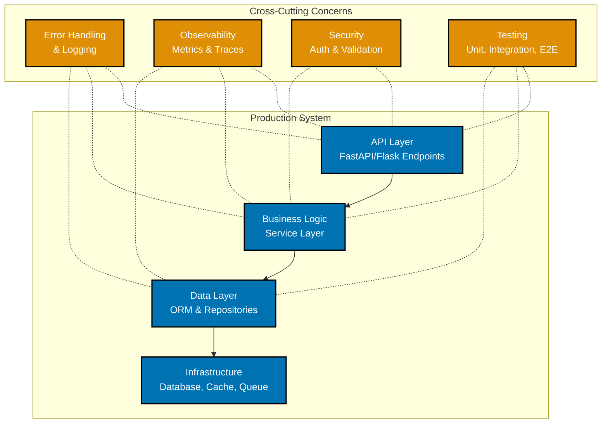

**Ready to build production-grade systems?** This tutorial teaches professional Python techniques used in companies like Instagram, Spotify, and Dropbox. You'll learn advanced OOP patterns, concurrency with asyncio, testing strategies, and deployment practices.

**Prerequisites**: Complete the [Beginner tutorial](/learn/swe/prog-lang/python/tutorials/beginner) or have equivalent Python experience. For even deeper expertise, progress to the [Advanced tutorial](/learn/swe/prog-lang/python/tutorials/advanced).

## 🎯 Learning Objectives

After this tutorial, you'll be able to:

- Implement advanced OOP patterns (decorators, descriptors, metaclasses)
- Build concurrent systems with asyncio and threading
- Write comprehensive test suites with pytest and mocking
- Design applications using SOLID principles and design patterns
- Optimize performance using profiling and best practices
- Work with databases using SQLAlchemy ORM
- Build REST APIs with Flask or FastAPI
- Deploy Python applications with proper configuration management

## 🏗️ Production Python Architecture

Professional Python development involves multiple layers working together:



This tutorial covers techniques for building each layer and implementing cross-cutting concerns professionally. For foundational concepts, review the [Beginner tutorial](/learn/swe/prog-lang/python/tutorials/beginner).

---

## Section 1: Advanced Object-Oriented Programming

For practical OOP patterns, see [Work with classes effectively](/learn/swe/prog-lang/python/how-to/work-with-classes-effectively) and [Use decorators effectively](/learn/swe/prog-lang/python/how-to/use-decorators-effectively).

### Decorators

Decorators modify or enhance functions and methods:

```python
import functools
import time

# Simple decorator
def timer(func):
    @functools.wraps(func)
    def wrapper(*args, **kwargs):
        start = time.time()
        result = func(*args, **kwargs)
        end = time.time()
        print(f"{func.__name__} took {end - start:.4f}s")
        return result
    return wrapper

@timer
def slow_function():
    time.sleep(1)
    return "Done"

slow_function()
# Output: slow_function took 1.0001s

# Decorator with arguments
def repeat(times):
    def decorator(func):
        @functools.wraps(func)
        def wrapper(*args, **kwargs):
            for _ in range(times):
                result = func(*args, **kwargs)
            return result
        return wrapper
    return decorator

@repeat(times=3)
def greet(name):
    print(f"Hello, {name}!")

greet("Alice")
# Output: Hello, Alice!
#         Hello, Alice!
#         Hello, Alice!

# Class decorator
def singleton(cls):
    instances = {}
    @functools.wraps(cls)
    def get_instance(*args, **kwargs):
        if cls not in instances:
            instances[cls] = cls(*args, **kwargs)
        return instances[cls]
    return get_instance

@singleton
class Database:
    def __init__(self):
        print("Database initialized")

db1 = Database()  # Database initialized
db2 = Database()  # No output (same instance)
print(db1 is db2)  # True
```

### Descriptors

Descriptors control attribute access:

```python
class Validator:
    def __init__(self, min_value=None, max_value=None):
        self.min_value = min_value
        self.max_value = max_value

    def __set_name__(self, owner, name):
        self.name = name

    def __get__(self, instance, owner):
        if instance is None:
            return self
        return instance.__dict__.get(self.name)

    def __set__(self, instance, value):
        if self.min_value is not None and value < self.min_value:
            raise ValueError(f"{self.name} must be >= {self.min_value}")
        if self.max_value is not None and value > self.max_value:
            raise ValueError(f"{self.name} must be <= {self.max_value}")
        instance.__dict__[self.name] = value

class Person:
    age = Validator(min_value=0, max_value=150)
    salary = Validator(min_value=0)

    def __init__(self, age, salary):
        self.age = age
        self.salary = salary

person = Person(30, 50000)
print(person.age)  # 30

# person.age = -5  # ValueError: age must be >= 0
# person.age = 200  # ValueError: age must be <= 150
```

### Context Managers

Custom context managers for resource management:

```python
from contextlib import contextmanager

# Using class
class FileManager:
    def __init__(self, filename, mode):
        self.filename = filename
        self.mode = mode
        self.file = None

    def __enter__(self):
        self.file = open(self.filename, self.mode)
        return self.file

    def __exit__(self, exc_type, exc_val, exc_tb):
        if self.file:
            self.file.close()
        # Return False to propagate exceptions
        return False

with FileManager("test.txt", "w") as f:
    f.write("Hello, World!")

# Using generator (contextmanager decorator)
@contextmanager
def database_connection(db_url):
    # Setup
    conn = create_connection(db_url)
    try:
        yield conn
    finally:
        # Cleanup
        conn.close()

with database_connection("postgresql://localhost") as conn:
    conn.execute("SELECT * FROM users")
```

### Metaclasses

Metaclasses control class creation:

```python
class SingletonMeta(type):
    _instances = {}

    def __call__(cls, *args, **kwargs):
        if cls not in cls._instances:
            cls._instances[cls] = super().__call__(*args, **kwargs)
        return cls._instances[cls]

class Database(metaclass=SingletonMeta):
    def __init__(self):
        print("Database initialized")

db1 = Database()  # Database initialized
db2 = Database()  # No output
print(db1 is db2)  # True

# Validation metaclass
class ValidatedMeta(type):
    def __new__(mcs, name, bases, namespace):
        # Ensure class has required methods
        required = ['validate', 'save']
        for method in required:
            if method not in namespace:
                raise TypeError(f"Class {name} must implement {method}()")
        return super().__new__(mcs, name, bases, namespace)

class User(metaclass=ValidatedMeta):
    def validate(self):
        pass

    def save(self):
        pass
```

---

## Section 2: Concurrency and Parallelism

### Threading

Python's threading for I/O-bound tasks:

```python
import threading
import time
import queue

# Basic threading
def worker(name, delay):
    print(f"{name} starting")
    time.sleep(delay)
    print(f"{name} finished")

threads = []
for i in range(3):
    t = threading.Thread(target=worker, args=(f"Worker-{i}", 1))
    threads.append(t)
    t.start()

for t in threads:
    t.join()

# Thread-safe queue
def producer(q, items):
    for item in items:
        print(f"Producing {item}")
        q.put(item)
        time.sleep(0.1)
    q.put(None)  # Sentinel to signal completion

def consumer(q):
    while True:
        item = q.get()
        if item is None:
            break
        print(f"Consuming {item}")
        time.sleep(0.2)
        q.task_done()

q = queue.Queue()
producer_thread = threading.Thread(target=producer, args=(q, range(5)))
consumer_thread = threading.Thread(target=consumer, args=(q,))

producer_thread.start()
consumer_thread.start()

producer_thread.join()
consumer_thread.join()
```

### Multiprocessing

Python's multiprocessing for CPU-bound tasks:

```python
from multiprocessing import Pool, Process, Queue
import os

# Basic multiprocessing
def cpu_bound_task(n):
    pid = os.getpid()
    result = sum(i * i for i in range(n))
    return f"Process {pid}: {result}"

# Using Pool
with Pool(processes=4) as pool:
    results = pool.map(cpu_bound_task, [1000000, 2000000, 3000000])
    print(results)

# Process communication with Queue
def worker(q):
    while True:
        item = q.get()
        if item is None:
            break
        print(f"Processing {item}")

q = Queue()
processes = [Process(target=worker, args=(q,)) for _ in range(3)]

for p in processes:
    p.start()

for i in range(10):
    q.put(i)

for _ in processes:
    q.put(None)

for p in processes:
    p.join()
```

### Asyncio

Modern async/await for concurrent I/O:

```python
import asyncio
import aiohttp

# Basic async function
async def fetch_data(url):
    async with aiohttp.ClientSession() as session:
        async with session.get(url) as response:
            return await response.text()

async def main():
    urls = [
        "https://api.example.com/users/1",
        "https://api.example.com/users/2",
        "https://api.example.com/users/3"
    ]

    # Concurrent requests
    tasks = [fetch_data(url) for url in urls]
    results = await asyncio.gather(*tasks)
    return results

# Run async code
asyncio.run(main())

# Async generator
async def async_range(count):
    for i in range(count):
        await asyncio.sleep(0.1)
        yield i

async def consume_async_generator():
    async for value in async_range(5):
        print(value)

asyncio.run(consume_async_generator())

# Task management
async def task_example():
    async def task(name, delay):
        await asyncio.sleep(delay)
        print(f"{name} completed")
        return name

    # Create tasks
    task1 = asyncio.create_task(task("Task-1", 2))
    task2 = asyncio.create_task(task("Task-2", 1))

    # Wait for completion
    results = await asyncio.gather(task1, task2)
    print(f"Results: {results}")

asyncio.run(task_example())
```

**When to Use What**:

- **Threading**: I/O-bound tasks (network, file I/O) - limited by GIL
- **Multiprocessing**: CPU-bound tasks (computation) - true parallelism
- **Asyncio**: High-concurrency I/O (thousands of connections) - single thread

---

## Section 3: Advanced Testing

### Pytest Advanced Features

```python
import pytest

# Fixtures
@pytest.fixture
def database():
    # Setup
    db = create_database()
    yield db
    # Teardown
    db.close()

def test_user_creation(database):
    user = database.create_user("Alice")
    assert user.name == "Alice"

# Parametrize
@pytest.mark.parametrize("input,expected", [
    (2, 4),
    (3, 9),
    (4, 16),
    (5, 25),
])
def test_square(input, expected):
    assert input ** 2 == expected

# Marks
@pytest.mark.slow
def test_slow_operation():
    # Long-running test
    pass

@pytest.mark.skip(reason="Not implemented yet")
def test_future_feature():
    pass

# Fixtures with scope
@pytest.fixture(scope="module")
def expensive_setup():
    # Runs once per test module
    return setup_expensive_resource()

# Fixture dependencies
@pytest.fixture
def user():
    return {"name": "Alice", "email": "alice@example.com"}

@pytest.fixture
def authenticated_user(user):
    user["token"] = "secret-token"
    return user

def test_user_access(authenticated_user):
    assert "token" in authenticated_user
```

### Mocking

```python
from unittest.mock import Mock, patch, MagicMock

# Basic mock
def test_api_call():
    mock_api = Mock()
    mock_api.get_user.return_value = {"name": "Alice", "id": 1}

    result = mock_api.get_user(1)
    assert result["name"] == "Alice"
    mock_api.get_user.assert_called_once_with(1)

# Patching
class EmailService:
    def send_email(self, to, subject, body):
        # Actually sends email
        pass

def notify_user(user_id, message):
    service = EmailService()
    service.send_email(f"user{user_id}@example.com", "Notification", message)

@patch('__main__.EmailService')
def test_notify_user(mock_email_service):
    mock_instance = mock_email_service.return_value

    notify_user(123, "Hello!")

    mock_instance.send_email.assert_called_once_with(
        "user123@example.com",
        "Notification",
        "Hello!"
    )

# Mock side effects
def test_retry_logic():
    mock_api = Mock()
    mock_api.fetch.side_effect = [
        Exception("Network error"),
        Exception("Timeout"),
        {"data": "success"}
    ]

    # Retry logic would eventually succeed
    for _ in range(3):
        try:
            result = mock_api.fetch()
            break
        except Exception:
            continue

    assert result == {"data": "success"}
```

---

## Section 4: Design Patterns

### Singleton Pattern

```python
class Singleton:
    _instance = None

    def __new__(cls):
        if cls._instance is None:
            cls._instance = super().__new__(cls)
        return cls._instance

# Thread-safe singleton
import threading

class ThreadSafeSingleton:
    _instance = None
    _lock = threading.Lock()

    def __new__(cls):
        if cls._instance is None:
            with cls._lock:
                if cls._instance is None:
                    cls._instance = super().__new__(cls)
        return cls._instance
```

### Factory Pattern

```python
from abc import ABC, abstractmethod

class DataSource(ABC):
    @abstractmethod
    def connect(self):
        pass

    @abstractmethod
    def query(self, sql):
        pass

class MySQLDataSource(DataSource):
    def connect(self):
        print("Connecting to MySQL")

    def query(self, sql):
        print(f"MySQL Query: {sql}")

class PostgreSQLDataSource(DataSource):
    def connect(self):
        print("Connecting to PostgreSQL")

    def query(self, sql):
        print(f"PostgreSQL Query: {sql}")

class DataSourceFactory:
    @staticmethod
    def create(db_type):
        if db_type == "mysql":
            return MySQLDataSource()
        elif db_type == "postgresql":
            return PostgreSQLDataSource()
        else:
            raise ValueError(f"Unknown database type: {db_type}")

# Usage
db = DataSourceFactory.create("mysql")
db.connect()
```

### Observer Pattern

```python
class Subject:
    def __init__(self):
        self._observers = []

    def attach(self, observer):
        self._observers.append(observer)

    def detach(self, observer):
        self._observers.remove(observer)

    def notify(self, message):
        for observer in self._observers:
            observer.update(message)

class Observer:
    def __init__(self, name):
        self.name = name

    def update(self, message):
        print(f"{self.name} received: {message}")

# Usage
subject = Subject()
observer1 = Observer("Observer1")
observer2 = Observer("Observer2")

subject.attach(observer1)
subject.attach(observer2)

subject.notify("Event occurred!")
# Output: Observer1 received: Event occurred!
#         Observer2 received: Event occurred!
```

### Strategy Pattern

```python
from abc import ABC, abstractmethod

class PaymentStrategy(ABC):
    @abstractmethod
    def pay(self, amount):
        pass

class CreditCardPayment(PaymentStrategy):
    def pay(self, amount):
        print(f"Paying ${amount} with credit card")

class PayPalPayment(PaymentStrategy):
    def pay(self, amount):
        print(f"Paying ${amount} with PayPal")

class ShoppingCart:
    def __init__(self, payment_strategy: PaymentStrategy):
        self.payment_strategy = payment_strategy
        self.items = []

    def add_item(self, item, price):
        self.items.append((item, price))

    def checkout(self):
        total = sum(price for _, price in self.items)
        self.payment_strategy.pay(total)

# Usage
cart = ShoppingCart(CreditCardPayment())
cart.add_item("Book", 29.99)
cart.add_item("Pen", 4.99)
cart.checkout()  # Paying $34.98 with credit card
```

---

## Section 5: Performance Optimization

### Profiling

```python
import cProfile
import pstats
from io import StringIO

def slow_function():
    result = 0
    for i in range(1000000):
        result += i
    return result

# Profile function
profiler = cProfile.Profile()
profiler.enable()
slow_function()
profiler.disable()

# Print stats
stats = pstats.Stats(profiler)
stats.sort_stats('cumulative')
stats.print_stats(10)

# Line profiler (install: pip install line_profiler)
# @profile decorator and run: kernprof -l -v script.py
```

### Memory Profiling

```python
# Using memory_profiler (install: pip install memory_profiler)
from memory_profiler import profile

@profile
def memory_intensive():
    large_list = [i for i in range(1000000)]
    return sum(large_list)

# Run: python -m memory_profiler script.py
```

### Optimization Techniques

```python
# Use generators for large datasets
def read_large_file(filename):
    with open(filename) as f:
        for line in f:
            yield line.strip()

# Use __slots__ to reduce memory
class OptimizedPerson:
    __slots__ = ['name', 'age']  # No __dict__, less memory

    def __init__(self, name, age):
        self.name = name
        self.age = age

# Use lru_cache for expensive functions
from functools import lru_cache

@lru_cache(maxsize=128)
def fibonacci(n):
    if n < 2:
        return n
    return fibonacci(n-1) + fibonacci(n-2)

# Use set for membership tests
# O(1) instead of O(n) for lists
large_set = set(range(1000000))
1000 in large_set  # Fast

# Use list comprehensions instead of loops
# Faster and more Pythonic
squares = [x**2 for x in range(1000)]
```

---

## Section 6: Working with Databases

### SQLAlchemy ORM

```python
from sqlalchemy import create_engine, Column, Integer, String, ForeignKey
from sqlalchemy.ext.declarative import declarative_base
from sqlalchemy.orm import sessionmaker, relationship

Base = declarative_base()

class User(Base):
    __tablename__ = 'users'

    id = Column(Integer, primary_key=True)
    name = Column(String(50), nullable=False)
    email = Column(String(100), unique=True)
    posts = relationship("Post", back_populates="author")

class Post(Base):
    __tablename__ = 'posts'

    id = Column(Integer, primary_key=True)
    title = Column(String(200))
    content = Column(String)
    author_id = Column(Integer, ForeignKey('users.id'))
    author = relationship("User", back_populates="posts")

# Create engine and session
engine = create_engine('sqlite:///blog.db')
Base.metadata.create_all(engine)
Session = sessionmaker(bind=engine)
session = Session()

# Create user
user = User(name="Alice", email="alice@example.com")
session.add(user)
session.commit()

# Create post
post = Post(title="First Post", content="Hello, World!", author=user)
session.add(post)
session.commit()

# Query
users = session.query(User).filter_by(name="Alice").all()
user_with_posts = session.query(User).filter(User.id == 1).first()
print(user_with_posts.posts)
```

---

## Section 7: Building REST APIs

### FastAPI Example

```python
from fastapi import FastAPI, HTTPException, Depends
from pydantic import BaseModel
from typing import List

app = FastAPI()

class User(BaseModel):
    id: int
    name: str
    email: str

users_db = []

@app.get("/")
def read_root():
    return {"message": "Welcome to the API"}

@app.get("/users", response_model=List[User])
def get_users():
    return users_db

@app.get("/users/{user_id}", response_model=User)
def get_user(user_id: int):
    user = next((u for u in users_db if u["id"] == user_id), None)
    if user is None:
        raise HTTPException(status_code=404, detail="User not found")
    return user

@app.post("/users", response_model=User)
def create_user(user: User):
    users_db.append(user.dict())
    return user

@app.put("/users/{user_id}", response_model=User)
def update_user(user_id: int, user: User):
    existing = next((u for u in users_db if u["id"] == user_id), None)
    if existing is None:
        raise HTTPException(status_code=404, detail="User not found")
    existing.update(user.dict())
    return existing

@app.delete("/users/{user_id}")
def delete_user(user_id: int):
    global users_db
    users_db = [u for u in users_db if u["id"] != user_id]
    return {"message": "User deleted"}

# Run with: uvicorn main:app --reload
```

---

## Section 8: Configuration and Deployment

### Environment Configuration

```python
import os
from pydantic import BaseSettings

class Settings(BaseSettings):
    app_name: str = "My App"
    database_url: str
    secret_key: str
    debug: bool = False

    class Config:
        env_file = ".env"

settings = Settings()

# .env file
# DATABASE_URL=postgresql://localhost/mydb
# SECRET_KEY=super-secret
# DEBUG=True
```

### Logging

```python
import logging
from logging.handlers import RotatingFileHandler

# Configure logging
logging.basicConfig(
    level=logging.INFO,
    format='%(asctime)s - %(name)s - %(levelname)s - %(message)s',
    handlers=[
        logging.StreamHandler(),
        RotatingFileHandler('app.log', maxBytes=10485760, backupCount=5)
    ]
)

logger = logging.getLogger(__name__)

logger.info("Application started")
logger.warning("This is a warning")
logger.error("An error occurred")
```

## 🎉 Summary

Congratulations! You've completed the Python Intermediate tutorial. You've learned:

- ✅ Advanced OOP (decorators, descriptors, metaclasses)
- ✅ Concurrency patterns (threading, multiprocessing, asyncio)
- ✅ Advanced testing with pytest and mocking
- ✅ Design patterns (Singleton, Factory, Observer, Strategy)
- ✅ Performance profiling and optimization
- ✅ Database integration with SQLAlchemy
- ✅ REST API development with FastAPI
- ✅ Configuration management and deployment

## 📚 What's Next?

**Advanced Tutorial**: [Python Advanced](/learn/swe/prog-lang/python/tutorials/advanced)

- Python internals (GIL, memory management, bytecode)
- Advanced metaprogramming and AST manipulation
- C extensions and Cython for performance
- System design patterns for distributed systems
- Advanced debugging techniques

**Practical Recipes**: [Python Cookbook](/learn/swe/prog-lang/python/how-to/cookbook)

- Production-ready code patterns
- Real-world solutions
- Copy-paste-modify approach

**How-To Guides**: [Python How-To Guides](/learn/swe/prog-lang/python/how-to/overview)

- Focused tutorials on advanced techniques
- Best practices for production systems
- Deep dives into frameworks and tools

**Best Practices**: [Python Best Practices](/learn/swe/prog-lang/python/explanation/best-practices)

- Professional coding standards
- Performance and security guidelines
- Maintainability patterns

**Reference Materials**:

- [Python Cheat Sheet](/learn/swe/prog-lang/python/reference/cheat-sheet) - Quick syntax reference
- [Python Glossary](/learn/swe/prog-lang/python/reference/glossary) - Term definitions
- [Python Resources](/learn/swe/prog-lang/python/reference/resources) - Learning materials and tools

---

**Keep practicing and building!** The best way to master these patterns is to apply them in real projects. Check the [Anti-Patterns](/learn/swe/prog-lang/python/explanation/anti-patterns) guide to learn what to avoid.
