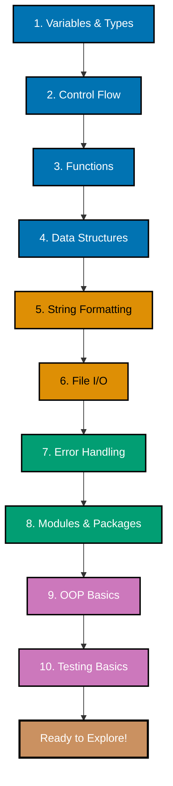

**Want to get productive with Python fast?** This Quick Start teaches you the essential syntax and core patterns you need to read Python code and try simple examples independently. You'll understand Python's approach to simplicity and readability.

For comprehensive coverage and hands-on practice, see the [Complete Beginner's Guide](beginner). For practical patterns and recipes, check out the [How-To Guides](/en/learn/swe/prog-lang/python/how-to/overview).

## 🎓 Coverage

This tutorial covers **5-30%** of Python knowledge - the essential touchpoints that let you explore Python independently. You'll learn enough to read code, write simple scripts, and understand Python's philosophy.

## 🗺️ Python Learning Path

This Quick Start gives you exposure to Python's 10 core concepts in order of importance:



Each section introduces ONE essential concept with practical examples. After completing all 10 touchpoints, you'll understand Python's philosophy and can start experimenting independently.

## 📋 Prerequisites

- Basic programming knowledge in any language
- Python installed (version 3.11+ recommended)
- Completed [Initial Setup](initial-setup) or have Python and a code editor ready

## 🎯 Touchpoint 1: Variables and Types

Python uses dynamic typing with optional type hints for clarity:

### Basic Types

```python
# Simple assignment (dynamic typing)
name = "Alice"
age = 30
height = 1.65
is_active = True
nothing = None

# Type hints (optional, for clarity and IDE support)
city: str = "Jakarta"
count: int = 42
price: float = 99.99
verified: bool = False

# Python infers types automatically
print(type(name))      # <class 'str'>
print(type(age))       # <class 'int'>
print(type(height))    # <class 'float'>
print(type(is_active)) # <class 'bool'>
```

### Multiple Assignment and Unpacking

```python
# Multiple assignment
x, y, z = 10, 20, 30
print(x, y, z)  # 10 20 30

# Swapping values (Pythonic way)
a, b = 5, 10
a, b = b, a
print(a, b)  # 10 5

# Unpacking sequences
numbers = [1, 2, 3]
first, second, third = numbers
print(first, second, third)  # 1 2 3
```

### Constants and Naming Conventions

```python
# Constants (by convention, ALL_CAPS - not enforced)
MAX_RETRIES = 3
API_URL = "https://api.example.com"
DEFAULT_TIMEOUT = 30

# Variable naming conventions
user_name = "alice"      # snake_case (recommended)
userName = "alice"       # camelCase (less common)
_internal_var = "data"   # leading underscore (internal use)
```

**Key Types**:

- `str` - Text (immutable)
- `int` - Whole numbers (unlimited precision!)
- `float` - Decimal numbers (IEEE 754)
- `bool` - `True` or `False` (capitalized)
- `None` - Absence of value (like `null` in other languages)

**Immutability**: Strings, numbers, and tuples are immutable (cannot be changed after creation).

**Duck Typing**: Python uses duck typing - "If it walks like a duck and quacks like a duck, it's a duck." Types are determined by behavior, not explicit declarations.

---

## 🎯 Touchpoint 2: Control Flow

Python uses **indentation** (not braces) for code blocks - this is syntax, not style.

### If/Elif/Else

```python
# Basic if statement
age = 18
if age >= 18:
    print("Adult")
elif age >= 13:
    print("Teenager")
else:
    print("Child")

# Comparison operators
x = 10
if x > 5:       # Greater than
    pass
if x >= 10:     # Greater than or equal
    pass
if x == 10:     # Equal (note: == not =)
    pass
if x != 5:      # Not equal
    pass

# Logical operators
has_ticket = True
is_vip = False

if has_ticket and not is_vip:
    print("Regular entry")
elif has_ticket and is_vip:
    print("VIP entry")
else:
    print("No entry")

# Ternary operator (inline if)
status = "Adult" if age >= 18 else "Minor"
print(status)
```

### For Loops

```python
# Loop over range
for i in range(5):
    print(i)  # Prints: 0, 1, 2, 3, 4

# range with start and end
for i in range(2, 7):
    print(i)  # Prints: 2, 3, 4, 5, 6

# range with step
for i in range(0, 10, 2):
    print(i)  # Prints: 0, 2, 4, 6, 8

# Loop over list (Pythonic way)
fruits = ["apple", "banana", "cherry"]
for fruit in fruits:
    print(fruit)

# Enumerate for index + value
for index, fruit in enumerate(fruits):
    print(f"{index}: {fruit}")
# Output:
# 0: apple
# 1: banana
# 2: cherry
```

### While Loops

```python
# Basic while loop
count = 0
while count < 3:
    print(count)
    count += 1

# While with condition
user_input = ""
while user_input != "quit":
    user_input = input("Enter 'quit' to exit: ")
    print(f"You entered: {user_input}")
```

### Break, Continue, and Pass

```python
# Break: exit loop early
for i in range(10):
    if i == 5:
        break  # Stop at 5
    print(i)  # Prints: 0, 1, 2, 3, 4

# Continue: skip current iteration
for i in range(10):
    if i % 2 == 0:
        continue  # Skip even numbers
    print(i)  # Prints: 1, 3, 5, 7, 9

# Pass: do nothing (placeholder)
for i in range(5):
    if i == 3:
        pass  # TODO: implement later
    else:
        print(i)
```

**Key Points**:

- **Indentation is syntax** (4 spaces standard, NOT tabs)
- `range(n)` generates numbers from 0 to n-1
- `for item in collection` is the Pythonic way (direct iteration)
- Use `enumerate()` when you need both index and value
- `break` exits loop, `continue` skips to next iteration, `pass` does nothing

---

## 🎯 Touchpoint 3: Functions

Functions are first-class objects in Python - they can be assigned to variables, passed as arguments, and returned from other functions.

### Basic Functions

```python
# Simple function
def greet(name):
    return f"Hello, {name}!"

# Function with type hints (recommended)
def add(a: int, b: int) -> int:
    return a + b

# Function with default arguments
def power(base, exponent=2):
    return base ** exponent

# Multiple return values (tuple unpacking)
def divide(a, b):
    quotient = a // b   # Integer division
    remainder = a % b
    return quotient, remainder

# Usage
print(greet("Alice"))       # Hello, Alice!
print(add(5, 3))            # 8
print(power(5))             # 25 (exponent=2 by default)
print(power(5, 3))          # 125

q, r = divide(10, 3)
print(f"Quotient: {q}, Remainder: {r}")  # Quotient: 3, Remainder: 1
```

### \*args and \*\*kwargs

```python
# *args: variable positional arguments (tuple)
def sum_all(*args):
    total = 0
    for num in args:
        total += num
    return total

print(sum_all(1, 2, 3))        # 6
print(sum_all(1, 2, 3, 4, 5))  # 15

# **kwargs: variable keyword arguments (dict)
def print_info(**kwargs):
    for key, value in kwargs.items():
        print(f"{key}: {value}")

print_info(name="Alice", age=30, city="Jakarta")
# Output:
# name: Alice
# age: 30
# city: Jakarta

# Combined: regular args, *args, **kwargs
def flexible_function(required, *args, **kwargs):
    print(f"Required: {required}")
    print(f"Args: {args}")
    print(f"Kwargs: {kwargs}")

flexible_function("must_have", 1, 2, 3, name="Alice", age=30)
# Required: must_have
# Args: (1, 2, 3)
# Kwargs: {'name': 'Alice', 'age': 30}
```

### Lambda Functions

```python
# Lambda: anonymous one-line function
square = lambda x: x ** 2
print(square(5))  # 25

# Lambda with multiple arguments
add = lambda x, y: x + y
print(add(3, 4))  # 7

# Common use: sorting with custom key
people = [
    {"name": "Alice", "age": 30},
    {"name": "Bob", "age": 25},
    {"name": "Charlie", "age": 35}
]

# Sort by age
sorted_people = sorted(people, key=lambda p: p["age"])
print(sorted_people)
# [{'name': 'Bob', 'age': 25}, {'name': 'Alice', 'age': 30}, {'name': 'Charlie', 'age': 35}]

# Lambda in map/filter
numbers = [1, 2, 3, 4, 5]
squared = list(map(lambda x: x ** 2, numbers))
evens = list(filter(lambda x: x % 2 == 0, numbers))
print(squared)  # [1, 4, 9, 16, 25]
print(evens)    # [2, 4]
```

### Docstrings

```python
def calculate_area(length: float, width: float) -> float:
    """
    Calculate the area of a rectangle.

    Args:
        length (float): Length of the rectangle
        width (float): Width of the rectangle

    Returns:
        float: Area of the rectangle

    Example:
        >>> calculate_area(5, 3)
        15.0
    """
    return length * width

# Access docstring
print(calculate_area.__doc__)
```

**Key Points**:

- Functions can have default arguments (must come after required ones)
- `*args` captures variable positional arguments as a tuple
- `**kwargs` captures variable keyword arguments as a dict
- Lambdas are concise but limited to one expression
- Docstrings document function behavior (triple-quoted strings)
- Type hints improve code clarity and enable IDE autocompletion

---

## 🎯 Touchpoint 4: Data Structures

Python has powerful built-in collections: lists, tuples, sets, and dictionaries.

### Lists (Ordered, Mutable)

```python
# Creating lists
numbers = [1, 2, 3, 4, 5]
mixed = [1, "hello", 3.14, True]
empty = []

# Adding elements
numbers.append(6)           # Add to end
numbers.insert(0, 0)        # Insert at position 0
numbers.extend([7, 8, 9])   # Add multiple elements

# Accessing elements
first = numbers[0]          # First element
last = numbers[-1]          # Last element (negative indexing)
second_last = numbers[-2]   # Second to last

# Slicing
slice1 = numbers[1:4]       # Elements 1-3 (end is exclusive)
slice2 = numbers[:3]        # First 3 elements
slice3 = numbers[3:]        # Elements from index 3 onward
slice4 = numbers[::2]       # Every second element
slice5 = numbers[::-1]      # Reverse the list

print(numbers)              # [0, 1, 2, 3, 4, 5, 6, 7, 8, 9]
print(slice4)               # [0, 2, 4, 6, 8]
print(slice5)               # [9, 8, 7, 6, 5, 4, 3, 2, 1, 0]

# List operations
print(len(numbers))         # Length: 10
print(5 in numbers)         # Membership: True
numbers.remove(5)           # Remove first occurrence of 5
popped = numbers.pop()      # Remove and return last element
numbers.sort()              # Sort in place
numbers.reverse()           # Reverse in place

# List comprehension (Pythonic way to create lists)
squares = [x ** 2 for x in range(10)]
evens = [x for x in range(20) if x % 2 == 0]
print(squares)  # [0, 1, 4, 9, 16, 25, 36, 49, 64, 81]
print(evens)    # [0, 2, 4, 6, 8, 10, 12, 14, 16, 18]
```

### Tuples (Ordered, Immutable)

```python
# Creating tuples
coordinates = (10, 20)
single_element = (42,)      # Note the comma
empty_tuple = ()

# Unpacking
x, y = coordinates
print(x, y)  # 10 20

# Tuples are immutable
# coordinates[0] = 15  # This would raise TypeError

# Use cases for tuples
# 1. Return multiple values from function
def get_min_max(numbers):
    return min(numbers), max(numbers)

min_val, max_val = get_min_max([1, 5, 3, 9, 2])
print(f"Min: {min_val}, Max: {max_val}")  # Min: 1, Max: 9

# 2. Dictionary keys (tuples are hashable)
locations = {
    (0, 0): "origin",
    (1, 0): "east",
    (0, 1): "north"
}
print(locations[(0, 0)])  # origin
```

### Sets (Unordered, Unique Elements)

```python
# Creating sets
fruits = {"apple", "banana", "cherry"}
numbers = {1, 2, 3, 4, 5}
empty_set = set()  # Note: {} creates empty dict, not set

# Adding elements
fruits.add("date")
fruits.update(["elderberry", "fig"])  # Add multiple

# Set operations
set1 = {1, 2, 3, 4, 5}
set2 = {4, 5, 6, 7, 8}

print(set1 | set2)  # Union: {1, 2, 3, 4, 5, 6, 7, 8}
print(set1 & set2)  # Intersection: {4, 5}
print(set1 - set2)  # Difference: {1, 2, 3}
print(set1 ^ set2)  # Symmetric difference: {1, 2, 3, 6, 7, 8}

# Remove duplicates from list
numbers_with_dupes = [1, 2, 2, 3, 3, 3, 4, 5]
unique_numbers = list(set(numbers_with_dupes))
print(unique_numbers)  # [1, 2, 3, 4, 5] (order not guaranteed)
```

### Dictionaries (Key-Value Pairs)

```python
# Creating dictionaries
person = {
    "name": "Alice",
    "age": 30,
    "city": "Jakarta",
    "skills": ["Python", "JavaScript"]
}

# Accessing values
print(person["name"])           # Alice
print(person.get("age"))        # 30 (safe access)
print(person.get("email", "N/A"))  # N/A (default if key doesn't exist)

# Adding/modifying
person["email"] = "alice@example.com"  # Add new key
person["age"] = 31                     # Update existing key

# Removing
del person["city"]                  # Remove key-value pair
email = person.pop("email")         # Remove and return value

# Iterating
for key in person:
    print(f"{key}: {person[key]}")

for key, value in person.items():
    print(f"{key}: {value}")

for key in person.keys():
    print(key)

for value in person.values():
    print(value)

# Dictionary comprehension
squares = {x: x ** 2 for x in range(6)}
print(squares)  # {0: 0, 1: 1, 2: 4, 3: 9, 4: 16, 5: 25}

# Nested dictionaries
users = {
    "alice": {"age": 30, "city": "Jakarta"},
    "bob": {"age": 25, "city": "Bandung"}
}
print(users["alice"]["city"])  # Jakarta
```

**Key Points**:

- **Lists**: Ordered, mutable, allow duplicates - use for sequences
- **Tuples**: Ordered, immutable, hashable - use for fixed collections
- **Sets**: Unordered, unique elements - use for membership testing and removing duplicates
- **Dictionaries**: Key-value pairs, insertion order preserved (Python 3.7+) - use for mappings
- List/dict/set comprehensions are Pythonic and concise
- Negative indexing: `-1` is last element, `-2` is second to last, etc.
- Slicing: `[start:end:step]` - end is exclusive

---

## 🎯 Touchpoint 5: String Formatting

Python offers multiple string formatting approaches, with f-strings being the modern standard.

### F-Strings (Python 3.6+, Recommended)

```python
name = "Alice"
age = 30
price = 19.99

# Basic f-strings
print(f"Hello, {name}!")
print(f"{name} is {age} years old")

# Formatting numbers
print(f"Price: ${price:.2f}")           # 2 decimal places: $19.99
print(f"Pi: {3.14159:.3f}")             # 3 decimal places: 3.142
print(f"Large number: {1000000:,}")     # Thousands separator: 1,000,000
print(f"Percentage: {0.856:.1%}")       # Percentage: 85.6%

# Alignment and padding
print(f"{'Left':<10}|")       # Left align in 10 chars
print(f"{'Right':>10}|")      # Right align
print(f"{'Center':^10}|")     # Center align

# Expressions in f-strings
x = 5
y = 10
print(f"{x} + {y} = {x + y}")           # 5 + 10 = 15
print(f"Double: {x * 2}")               # Double: 10

# Calling functions in f-strings
def greet(name):
    return f"Hello, {name}"

print(f"{greet('Alice')}")              # Hello, Alice

# Multi-line f-strings
message = f"""
Dear {name},

You are {age} years old.
Your order total is ${price:.2f}.

Best regards
"""
print(message)
```

### String Methods

```python
text = "  Hello, World!  "

# Case conversion
print(text.lower())         # "  hello, world!  "
print(text.upper())         # "  HELLO, WORLD!  "
print(text.title())         # "  Hello, World!  "
print(text.capitalize())    # "  hello, world!  "

# Whitespace handling
print(text.strip())         # "Hello, World!" (remove leading/trailing)
print(text.lstrip())        # "Hello, World!  " (remove leading)
print(text.rstrip())        # "  Hello, World!" (remove trailing)

# Searching
print(text.find("World"))   # 9 (index of first occurrence)
print(text.count("l"))      # 3 (number of occurrences)
print(text.startswith("  H"))  # True
print(text.endswith("!  "))    # True

# Splitting and joining
sentence = "apple,banana,cherry"
fruits = sentence.split(",")       # ["apple", "banana", "cherry"]
rejoined = " | ".join(fruits)      # "apple | banana | cherry"

# Replacing
new_text = text.replace("World", "Python")
print(new_text)  # "  Hello, Python!  "
```

### String Formatting (Older Styles)

```python
name = "Alice"
age = 30

# str.format() - Python 2.6+
print("Hello, {}!".format(name))
print("{} is {} years old".format(name, age))
print("{name} is {age} years old".format(name=name, age=age))

# % formatting - Legacy (avoid in new code)
print("Hello, %s!" % name)
print("%s is %d years old" % (name, age))
```

**Key Points**:

- **F-strings are the modern standard** - use them for new code
- F-strings support expressions, function calls, and formatting specs
- `:.<number>f` formats floats to specific decimal places
- Triple quotes (`"""` or `'''`) create multi-line strings
- String methods return new strings (strings are immutable)
- Use `.strip()`, `.lstrip()`, `.rstrip()` to remove whitespace

---

## 🎯 Touchpoint 6: File I/O

Python makes file handling simple and safe with context managers.

### Reading Files

```python
# Basic file reading (not recommended - doesn't handle closing)
file = open("data.txt", "r")
content = file.read()
file.close()

# Context manager (recommended - auto-closes file)
with open("data.txt", "r") as file:
    content = file.read()
    print(content)
# File is automatically closed after the with block

# Read line by line
with open("data.txt", "r") as file:
    for line in file:
        print(line.strip())  # strip() removes newline characters

# Read all lines into list
with open("data.txt", "r") as file:
    lines = file.readlines()
    print(lines)  # List of lines including \n characters

# Read specific number of characters
with open("data.txt", "r") as file:
    chunk = file.read(100)  # Read first 100 characters
    print(chunk)
```

### Writing Files

```python
# Write to file (overwrites existing content)
with open("output.txt", "w") as file:
    file.write("Hello, World!\n")
    file.write("This is a new line.\n")

# Write multiple lines
lines = ["Line 1\n", "Line 2\n", "Line 3\n"]
with open("output.txt", "w") as file:
    file.writelines(lines)

# Append to file (doesn't overwrite)
with open("output.txt", "a") as file:
    file.write("Appended line\n")
```

### File Modes

```python
# Common file modes:
# "r"  - Read (default) - file must exist
# "w"  - Write (creates new or truncates existing)
# "a"  - Append (creates new or appends to existing)
# "x"  - Exclusive create (fails if file exists)
# "r+" - Read and write
# "b"  - Binary mode (e.g., "rb", "wb")

# Binary file handling
with open("image.png", "rb") as file:
    binary_data = file.read()

with open("copy.png", "wb") as file:
    file.write(binary_data)
```

### Using pathlib (Modern, Recommended)

```python
from pathlib import Path

# Create Path object
file_path = Path("data.txt")

# Read text
content = file_path.read_text()
print(content)

# Write text
file_path.write_text("Hello from pathlib!")

# Read bytes
binary = file_path.read_bytes()

# Check if file exists
if file_path.exists():
    print("File exists")

# Get file info
print(f"Size: {file_path.stat().st_size} bytes")
print(f"Is file: {file_path.is_file()}")
print(f"Is directory: {file_path.is_dir()}")

# Working with directories
directory = Path("my_folder")
directory.mkdir(exist_ok=True)  # Create directory if doesn't exist

# List files in directory
for item in directory.iterdir():
    print(item)

# Glob patterns
for txt_file in Path(".").glob("*.txt"):
    print(txt_file)
```

**Key Points**:

- Always use context managers (`with` statement) - ensures files are properly closed
- `"r"` for reading, `"w"` for writing (overwrites), `"a"` for appending
- `pathlib.Path` is the modern, object-oriented approach
- `.read()` reads entire file, `.readline()` reads one line, `.readlines()` reads all lines
- `.strip()` removes leading/trailing whitespace including newlines
- Binary mode (`"rb"`, `"wb"`) for non-text files (images, PDFs, etc.)

---

## 🎯 Touchpoint 7: Error Handling

Python uses exceptions for error handling with a philosophy of "Easier to Ask for Forgiveness than Permission" (EAFP).

### Try/Except Basics

```python
# Basic try/except
try:
    number = int("abc")  # This will raise ValueError
except ValueError:
    print("Cannot convert to integer")

# Catching the exception object
try:
    number = int("abc")
except ValueError as e:
    print(f"Error: {e}")
    # Output: Error: invalid literal for int() with base 10: 'abc'

# Multiple except blocks
try:
    result = 10 / 0
except ZeroDivisionError:
    print("Cannot divide by zero")
except ValueError:
    print("Invalid value")
except Exception as e:
    print(f"Unexpected error: {e}")
```

### Try/Except/Else/Finally

```python
# else: runs if no exception
try:
    file = open("data.txt", "r")
except FileNotFoundError:
    print("File not found")
else:
    # Runs only if no exception occurred
    content = file.read()
    print(content)
    file.close()

# finally: always runs (cleanup code)
try:
    file = open("data.txt", "r")
    content = file.read()
except FileNotFoundError:
    print("File not found")
finally:
    # Always runs, even if exception occurred
    if 'file' in locals() and not file.closed:
        file.close()
        print("File closed")

# Better approach: use context manager
try:
    with open("data.txt", "r") as file:
        content = file.read()
except FileNotFoundError:
    print("File not found")
# No need for finally - context manager handles closing
```

### Common Exceptions

```python
# ValueError - invalid value
try:
    int("not a number")
except ValueError:
    print("Invalid number format")

# TypeError - wrong type
try:
    "hello" + 5
except TypeError:
    print("Cannot concatenate string and int")

# KeyError - missing dictionary key
try:
    person = {"name": "Alice"}
    email = person["email"]
except KeyError:
    print("Key not found")

# IndexError - invalid list index
try:
    numbers = [1, 2, 3]
    value = numbers[10]
except IndexError:
    print("Index out of range")

# FileNotFoundError - file doesn't exist
try:
    with open("missing.txt", "r") as file:
        content = file.read()
except FileNotFoundError:
    print("File not found")

# AttributeError - attribute doesn't exist
try:
    text = "hello"
    text.nonexistent_method()
except AttributeError:
    print("Attribute not found")
```

### EAFP vs LBYL

```python
# EAFP: Easier to Ask for Forgiveness than Permission (Pythonic)
try:
    value = my_dict["key"]
except KeyError:
    value = "default"

# LBYL: Look Before You Leap (less Pythonic)
if "key" in my_dict:
    value = my_dict["key"]
else:
    value = "default"

# EAFP example with files
try:
    with open("config.json", "r") as file:
        config = json.load(file)
except FileNotFoundError:
    config = {"default": "settings"}

# LBYL equivalent (more verbose)
import os
if os.path.exists("config.json"):
    with open("config.json", "r") as file:
        config = json.load(file)
else:
    config = {"default": "settings"}
```

### Raising Exceptions

```python
# Raise built-in exception
def divide(a, b):
    if b == 0:
        raise ValueError("Cannot divide by zero")
    return a / b

try:
    result = divide(10, 0)
except ValueError as e:
    print(f"Error: {e}")

# Re-raise exception
try:
    risky_operation()
except Exception as e:
    print(f"Logging error: {e}")
    raise  # Re-raise the same exception

# Custom exceptions
class InvalidAgeError(Exception):
    """Raised when age is invalid"""
    pass

def set_age(age):
    if age < 0 or age > 150:
        raise InvalidAgeError(f"Invalid age: {age}")
    return age

try:
    set_age(200)
except InvalidAgeError as e:
    print(f"Error: {e}")
```

**Key Points**:

- Python encourages **EAFP**: try operations, handle exceptions
- Specific exceptions before general ones (order matters)
- `finally` block always executes (cleanup code)
- Use context managers (`with`) to handle resource cleanup automatically
- `raise` to throw exceptions, optionally with custom messages
- Create custom exceptions by inheriting from `Exception`

---

## 🎯 Touchpoint 8: Modules and Packages

Python code is organized in modules (single files) and packages (directories of modules).

### Importing Modules

```python
# Import entire module
import math
print(math.pi)           # 3.141592653589793
print(math.sqrt(16))     # 4.0
print(math.ceil(4.3))    # 5

# Import specific items
from math import pi, sqrt, ceil
print(pi)                # 3.141592653589793
print(sqrt(16))          # 4.0
print(ceil(4.3))         # 5

# Import with alias
import datetime as dt
now = dt.datetime.now()
print(now)

# Import multiple items
from collections import Counter, defaultdict, deque

# Import all (avoid in production - pollutes namespace)
from math import *
print(cos(0))            # 1.0
```

### Common Standard Library Modules

```python
# os - Operating system interface
import os
print(os.getcwd())              # Current directory
print(os.listdir("."))          # List files in current dir
os.mkdir("new_folder")          # Create directory

# sys - System-specific parameters
import sys
print(sys.version)              # Python version
print(sys.platform)             # Platform (linux, win32, darwin)
print(sys.argv)                 # Command-line arguments

# json - JSON parsing
import json
data = {"name": "Alice", "age": 30}
json_string = json.dumps(data)           # Python to JSON
parsed = json.loads(json_string)         # JSON to Python

with open("data.json", "w") as file:
    json.dump(data, file)                # Write to file

with open("data.json", "r") as file:
    loaded = json.load(file)             # Read from file

# datetime - Date and time
import datetime
now = datetime.datetime.now()
print(now)                               # 2025-12-19 10:30:45.123456
print(now.strftime("%Y-%m-%d"))          # 2025-12-19
print(now.strftime("%H:%M:%S"))          # 10:30:45

birthday = datetime.date(1990, 5, 15)
age = (datetime.date.today() - birthday).days // 365

# random - Random number generation
import random
print(random.randint(1, 10))             # Random int between 1-10
print(random.random())                   # Random float 0.0-1.0
print(random.choice(["a", "b", "c"]))    # Random element

numbers = [1, 2, 3, 4, 5]
random.shuffle(numbers)                  # Shuffle in place
print(numbers)

# re - Regular expressions
import re
text = "My email is alice@example.com"
pattern = r"[\w\.-]+@[\w\.-]+\.\w+"
match = re.search(pattern, text)
if match:
    print(match.group())                 # alice@example.com

# collections - Specialized data structures
from collections import Counter, defaultdict

# Counter - count elements
fruits = ["apple", "banana", "apple", "cherry", "banana", "apple"]
counter = Counter(fruits)
print(counter)                           # Counter({'apple': 3, 'banana': 2, 'cherry': 1})
print(counter.most_common(2))            # [('apple', 3), ('banana', 2)]

# defaultdict - default values for missing keys
from collections import defaultdict
word_count = defaultdict(int)            # Default to 0
for word in ["hello", "world", "hello"]:
    word_count[word] += 1
print(dict(word_count))                  # {'hello': 2, 'world': 1}
```

### Creating Your Own Modules

```python
# File: my_module.py
"""
This is my custom module for mathematical operations.
"""

def add(a, b):
    """Add two numbers"""
    return a + b

def multiply(a, b):
    """Multiply two numbers"""
    return a * b

PI = 3.14159

# File: main.py
import my_module

result = my_module.add(5, 3)
print(result)                            # 8
print(my_module.PI)                      # 3.14159
```

### Packages (Directory Structure)

```
my_package/
    __init__.py              # Makes it a package (can be empty)
    module1.py
    module2.py
    sub_package/
        __init__.py
        module3.py
```

```python
# Import from package
from my_package import module1
from my_package.sub_package import module3

# Import specific function from module in package
from my_package.module1 import my_function
```

**Key Standard Library Modules**:

- `os` - Operating system interface (files, directories, environment)
- `sys` - System-specific parameters (arguments, version, platform)
- `json` - JSON encoding/decoding
- `datetime` - Date and time manipulation
- `random` - Random number generation
- `re` - Regular expressions
- `math` - Mathematical functions
- `collections` - Specialized data structures (Counter, defaultdict, deque)
- `pathlib` - Object-oriented filesystem paths
- `csv` - CSV file reading/writing
- `itertools` - Iterator functions
- `functools` - Higher-order functions

**Key Points**:

- Modules are single Python files (`.py`)
- Packages are directories containing `__init__.py`
- Use `import module` to import entire module
- Use `from module import item` for specific items
- Use aliases (`as`) to shorten long module names
- Standard library is extensive - explore [docs.python.org](https://docs.python.org/3/library/)

---

## 🎯 Touchpoint 9: OOP Basics

Python supports object-oriented programming with classes, inheritance, and special methods.

### Classes and Objects

```python
# Define a class
class Person:
    """A simple Person class"""

    # Constructor
    def __init__(self, name, age):
        self.name = name  # Instance attribute
        self.age = age

    # Instance method
    def greet(self):
        return f"Hello, I'm {self.name} and I'm {self.age} years old"

    # Method with parameters
    def have_birthday(self):
        self.age += 1
        return f"Happy birthday! Now {self.age} years old"

# Create objects (instances)
alice = Person("Alice", 30)
bob = Person("Bob", 25)

# Call methods
print(alice.greet())        # Hello, I'm Alice and I'm 30 years old
print(bob.greet())          # Hello, I'm Bob and I'm 25 years old

# Modify attributes
alice.have_birthday()
print(alice.age)            # 31
```

### Class Attributes vs Instance Attributes

```python
class Dog:
    # Class attribute (shared by all instances)
    species = "Canis familiaris"

    def __init__(self, name, breed):
        # Instance attributes (unique to each instance)
        self.name = name
        self.breed = breed

    def describe(self):
        return f"{self.name} is a {self.breed}"

dog1 = Dog("Buddy", "Golden Retriever")
dog2 = Dog("Max", "Labrador")

print(dog1.species)         # Canis familiaris (class attribute)
print(dog2.species)         # Canis familiaris (same for all)
print(dog1.describe())      # Buddy is a Golden Retriever
print(dog2.describe())      # Max is a Labrador
```

### Inheritance

```python
# Base class
class Animal:
    def __init__(self, name):
        self.name = name

    def speak(self):
        return f"{self.name} makes a sound"

# Derived class
class Dog(Animal):
    def speak(self):
        return f"{self.name} barks"

class Cat(Animal):
    def speak(self):
        return f"{self.name} meows"

# Using inheritance
dog = Dog("Buddy")
cat = Cat("Whiskers")

print(dog.speak())          # Buddy barks
print(cat.speak())          # Whiskers meows

# Check inheritance
print(isinstance(dog, Dog))     # True
print(isinstance(dog, Animal))  # True
print(isinstance(cat, Dog))     # False
```

### Special Methods (Magic Methods)

```python
class Point:
    def __init__(self, x, y):
        self.x = x
        self.y = y

    # String representation
    def __str__(self):
        return f"Point({self.x}, {self.y})"

    def __repr__(self):
        return f"Point(x={self.x}, y={self.y})"

    # Addition operator
    def __add__(self, other):
        return Point(self.x + other.x, self.y + other.y)

    # Equality operator
    def __eq__(self, other):
        return self.x == other.x and self.y == other.y

    # Length (distance from origin)
    def __abs__(self):
        return (self.x ** 2 + self.y ** 2) ** 0.5

p1 = Point(1, 2)
p2 = Point(3, 4)

print(p1)                   # Point(1, 2)
print(p1 + p2)              # Point(4, 6)
print(p1 == p2)             # False
print(abs(p1))              # 2.23606797749979
```

### Properties and Encapsulation

```python
class BankAccount:
    def __init__(self, owner, balance=0):
        self.owner = owner
        self._balance = balance  # Convention: _ indicates "internal use"

    # Getter property
    @property
    def balance(self):
        return self._balance

    # Setter property
    @balance.setter
    def balance(self, value):
        if value < 0:
            raise ValueError("Balance cannot be negative")
        self._balance = value

    def deposit(self, amount):
        if amount > 0:
            self._balance += amount
            return f"Deposited ${amount}. New balance: ${self._balance}"
        return "Invalid amount"

    def withdraw(self, amount):
        if amount > self._balance:
            return "Insufficient funds"
        self._balance -= amount
        return f"Withdrew ${amount}. New balance: ${self._balance}"

account = BankAccount("Alice", 1000)
print(account.balance)              # 1000
print(account.deposit(500))         # Deposited $500. New balance: $1500
print(account.withdraw(200))        # Withdrew $200. New balance: $1300

# Property setter validation
try:
    account.balance = -100          # Raises ValueError
except ValueError as e:
    print(f"Error: {e}")            # Error: Balance cannot be negative
```

**Key Points**:

- Classes define object blueprints, objects are instances
- `__init__` is the constructor method
- `self` refers to the instance (always first parameter in instance methods)
- Class attributes are shared, instance attributes are unique
- Inheritance allows code reuse (`class Child(Parent)`)
- Special methods like `__str__`, `__add__`, `__eq__` enable operator overloading
- `@property` decorator creates managed attributes with getters/setters
- Convention: `_attribute` indicates internal use (not truly private)

---

## 🎯 Touchpoint 10: Testing Basics

Python has excellent testing support with the `pytest` framework (most popular) and built-in `unittest`.

### Why Testing Matters

- Catch bugs early
- Enable refactoring with confidence
- Document expected behavior
- Improve code design

### Simple pytest Examples

```python
# File: calculator.py
def add(a, b):
    """Add two numbers"""
    return a + b

def multiply(a, b):
    """Multiply two numbers"""
    return a * b

def divide(a, b):
    """Divide two numbers"""
    if b == 0:
        raise ValueError("Cannot divide by zero")
    return a / b

# File: test_calculator.py
import pytest
from calculator import add, multiply, divide

# Test functions start with "test_"
def test_add():
    assert add(2, 3) == 5
    assert add(-1, 1) == 0
    assert add(0, 0) == 0

def test_multiply():
    assert multiply(2, 3) == 6
    assert multiply(-2, 3) == -6
    assert multiply(0, 5) == 0

def test_divide():
    assert divide(6, 2) == 3
    assert divide(5, 2) == 2.5

    # Test exception
    with pytest.raises(ValueError):
        divide(10, 0)

# Run tests: pytest test_calculator.py
```

### Testing with Multiple Cases

```python
# File: string_utils.py
def is_palindrome(text):
    """Check if text is a palindrome (ignores case and spaces)"""
    cleaned = text.replace(" ", "").lower()
    return cleaned == cleaned[::-1]

# File: test_string_utils.py
import pytest
from string_utils import is_palindrome

# Parametrized tests - test multiple cases
@pytest.mark.parametrize("text,expected", [
    ("racecar", True),
    ("hello", False),
    ("A man a plan a canal Panama", True),
    ("Was it a car or a cat I saw", True),
    ("python", False),
    ("", True),
])
def test_is_palindrome(text, expected):
    assert is_palindrome(text) == expected
```

### Testing Classes

```python
# File: bank_account.py
class BankAccount:
    def __init__(self, balance=0):
        self.balance = balance

    def deposit(self, amount):
        if amount <= 0:
            raise ValueError("Amount must be positive")
        self.balance += amount
        return self.balance

    def withdraw(self, amount):
        if amount > self.balance:
            raise ValueError("Insufficient funds")
        self.balance -= amount
        return self.balance

# File: test_bank_account.py
import pytest
from bank_account import BankAccount

class TestBankAccount:
    def test_initial_balance(self):
        account = BankAccount(100)
        assert account.balance == 100

    def test_deposit(self):
        account = BankAccount(100)
        new_balance = account.deposit(50)
        assert new_balance == 150
        assert account.balance == 150

    def test_deposit_negative_amount(self):
        account = BankAccount(100)
        with pytest.raises(ValueError):
            account.deposit(-10)

    def test_withdraw(self):
        account = BankAccount(100)
        new_balance = account.withdraw(30)
        assert new_balance == 70
        assert account.balance == 70

    def test_withdraw_insufficient_funds(self):
        account = BankAccount(50)
        with pytest.raises(ValueError):
            account.withdraw(100)
```

### Fixtures (Setup and Teardown)

```python
import pytest
from bank_account import BankAccount

# Fixture: reusable setup code
@pytest.fixture
def account():
    """Create a bank account with initial balance"""
    return BankAccount(100)

# Tests use fixture by name
def test_deposit_with_fixture(account):
    account.deposit(50)
    assert account.balance == 150

def test_withdraw_with_fixture(account):
    account.withdraw(30)
    assert account.balance == 70
```

### Running Tests

```bash
# Install pytest
pip install pytest

# Run all tests
pytest

# Run specific test file
pytest test_calculator.py

# Run with verbose output
pytest -v

# Run tests matching pattern
pytest -k "palindrome"

# Show print statements
pytest -s

# Stop at first failure
pytest -x

# Run with coverage report
pip install pytest-cov
pytest --cov=calculator --cov-report=html
```

### Assertions

```python
def test_assertions():
    # Equality
    assert 2 + 2 == 4
    assert "hello" == "hello"

    # Inequality
    assert 5 != 3

    # Membership
    assert "a" in "apple"
    assert 5 in [1, 2, 3, 4, 5]

    # Boolean
    assert True
    assert not False

    # None checking
    value = None
    assert value is None
    assert value is not False  # None is not False

    # Exceptions
    with pytest.raises(ZeroDivisionError):
        1 / 0

    # Approximate equality (floats)
    assert 0.1 + 0.2 == pytest.approx(0.3)
```

**Key Points**:

- **pytest** is the most popular Python testing framework
- Test functions start with `test_`
- Use `assert` statements for checks
- `pytest.raises()` tests for expected exceptions
- `@pytest.mark.parametrize` runs same test with different inputs
- Fixtures provide reusable setup code
- Run tests with `pytest` command
- Good tests are: fast, isolated, repeatable, self-validating, timely

---

## ✅ Next Steps

Congratulations! You've completed all 10 touchpoints and covered 5-30% of Python. You now have the foundation to explore Python independently!

### Deepen Your Knowledge

1. **Complete Beginner Tutorial**: [Complete Beginner's Guide to Python](beginner)
   - Comprehensive coverage of Python fundamentals (0-60%)
   - Hands-on exercises with 4 difficulty levels
   - Deep dive into OOP, decorators, context managers, generators

2. **Practical Patterns**: [Python Cookbook](/en/learn/swe/prog-lang/python/how-to/cookbook)
   - 30+ battle-tested recipes
   - Real-world code patterns
   - Production-ready solutions

3. **How-To Guides**: Browse [Python How-To Guides](/en/learn/swe/prog-lang/python/how-to/overview)
   - Problem-focused solutions
   - Best practices for common tasks
   - Advanced techniques

### Practice Ideas

1. **Build Small Projects**:
   - Todo list application (file storage)
   - Temperature converter (functions, user input)
   - Dice rolling simulator (random module)
   - Contact book (dictionaries, file I/O)
   - Simple web scraper (requests + BeautifulSoup)

2. **Challenge Yourself**:
   - Solve problems on [LeetCode](https://leetcode.com/)
   - Complete [Python exercises on Exercism](https://exercism.org/tracks/python)
   - Build automation scripts for daily tasks

3. **Read Code**:
   - Explore popular Python projects on GitHub
   - Read Python standard library source code
   - Study open-source projects in your domain

### Resources

- **Official Documentation**: [docs.python.org](https://docs.python.org/)
- **Python Package Index**: [pypi.org](https://pypi.org/) - discover libraries
- **Real Python**: [realpython.com](https://realpython.com/) - tutorials and articles
- **Python Community**: [discuss.python.org](https://discuss.python.org/)
- **Python Enhancement Proposals (PEPs)**: [peps.python.org](https://peps.python.org/) - language evolution

## 🎯 Self-Assessment

After completing this Quick Start, you should be able to:

- [ ] Read and understand Python syntax including indentation
- [ ] Work with Python's basic types (str, int, float, bool, None)
- [ ] Use control flow (if/elif/else, for, while, break, continue)
- [ ] Write functions with parameters, defaults, \*args, \*\*kwargs
- [ ] Manipulate data structures (lists, tuples, sets, dictionaries)
- [ ] Format strings with f-strings and use string methods
- [ ] Read and write files using context managers
- [ ] Handle errors with try/except/finally
- [ ] Import and use standard library modules
- [ ] Create classes, use inheritance, and understand OOP basics
- [ ] Write simple tests with pytest and assertions
- [ ] Understand Python's philosophy of readability and simplicity

If you can do these, you're ready to explore Python code and build simple applications independently!

## 💡 Python Philosophy (The Zen of Python)

```python
import this
```

Run this in Python to see the Zen of Python - guiding principles for Python design:

- **Beautiful is better than ugly**
- **Explicit is better than implicit**
- **Simple is better than complex**
- **Readability counts**
- **There should be one-- and preferably only one --obvious way to do it**

Happy coding! 🐍
