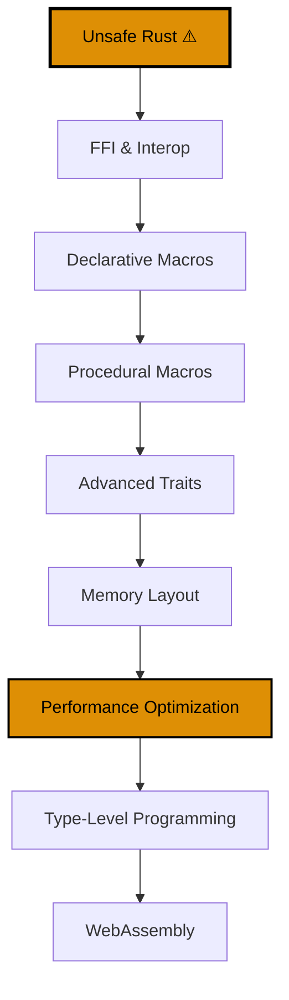

**Want to master expert-level Rust?** This tutorial covers advanced topics for systems programming, optimization, and specialized use cases.

## Coverage

This tutorial covers **85-95%** of Rust knowledge - expert-level topics for specialized domains.

## Prerequisites

- [Intermediate Tutorial](/en/learn/swe/prog-lang/rust/tutorials/intermediate) complete
- Strong understanding of lifetimes, traits, and smart pointers
- Experience with concurrent and async Rust
- Production Rust project experience recommended

## Learning Outcomes

By the end of this tutorial, you will:

- Write unsafe Rust code correctly and safely
- Interact with C libraries through FFI
- Create declarative and procedural macros
- Implement advanced trait patterns (supertraits, phantom types)
- Understand memory layout and representation
- Profile and optimize Rust code for performance
- Use type-level programming techniques
- Compile Rust to WebAssembly

---

## Learning Path



**Color Palette**: Orange (#DE8F05 - requires careful attention)

---

## Section 1: Unsafe Rust

**Unsafe Rust** opts out of some of Rust's safety guarantees.

### Five Unsafe Superpowers

In unsafe blocks, you can:

1. Dereference raw pointers
2. Call unsafe functions or methods
3. Access or modify mutable static variables
4. Implement unsafe traits
5. Access fields of unions

**Borrow checker still enforces borrowing rules** - unsafe doesn't disable all checks.

### Raw Pointers

```rust
fn main() {
    let mut num = 5;

    let r1 = &num as *const i32;  // Immutable raw pointer
    let r2 = &mut num as *mut i32;  // Mutable raw pointer

    unsafe {
        println!("r1 is: {}", *r1);
        println!("r2 is: {}", *r2);
    }
}
```

**Raw pointers**:

- Can be immutable or mutable (`*const T`, `*mut T`)
- Allowed to ignore borrowing rules
- No guaranteed validity
- Allowed to be null
- No automatic cleanup

**Creating raw pointers is safe** - dereferencing requires `unsafe`.

### Calling Unsafe Functions

```rust
unsafe fn dangerous() {
    println!("This is dangerous!");
}

fn main() {
    unsafe {
        dangerous();
    }
}
```

### Creating Safe Abstraction over Unsafe Code

```rust
use std::slice;

fn split_at_mut(values: &mut [i32], mid: usize) -> (&mut [i32], &mut [i32]) {
    let len = values.len();
    let ptr = values.as_mut_ptr();

    assert!(mid <= len);

    unsafe {
        (
            slice::from_raw_parts_mut(ptr, mid),
            slice::from_raw_parts_mut(ptr.add(mid), len - mid),
        )
    }
}

fn main() {
    let mut v = vec![1, 2, 3, 4, 5, 6];
    let (left, right) = split_at_mut(&mut v, 3);

    assert_eq!(left, &mut [1, 2, 3]);
    assert_eq!(right, &mut [4, 5, 6]);
}
```

**This is safe** because we uphold invariants (mid <= len, pointers valid).

### extern Functions (FFI)

```rust
extern "C" {
    fn abs(input: i32) -> i32;
}

fn main() {
    unsafe {
        println!("Absolute value of -3 according to C: {}", abs(-3));
    }
}
```

**`extern "C"`** uses C calling convention.

### Accessing or Modifying Mutable Static Variables

```rust
static mut COUNTER: u32 = 0;

fn add_to_count(inc: u32) {
    unsafe {
        COUNTER += inc;
    }
}

fn main() {
    add_to_count(3);

    unsafe {
        println!("COUNTER: {}", COUNTER);
    }
}
```

**Mutable static variables** are unsafe because of potential data races.

### Unsafe Traits

```rust
unsafe trait Foo {
    // methods go here
}

unsafe impl Foo for i32 {
    // method implementations go here
}
```

**Unsafe trait**: At least one method has invariants compiler can't verify.

**Example**: `Send` and `Sync` are unsafe traits (manually implementing them is unsafe).

### When to Use Unsafe

**Good reasons**:

- Calling FFI functions
- Implementing safe abstractions with better performance
- Interfacing with hardware (embedded systems)

**Bad reasons**:

- "Fighting the borrow checker"
- Avoiding learning proper ownership patterns
- Premature optimization

**Safety contract**: Document invariants unsafe code relies on.

```rust
/// # Safety
///
/// `ptr` must point to valid memory and be properly aligned.
/// `len` must not exceed the allocation size.
unsafe fn from_raw_parts<'a>(ptr: *const u8, len: usize) -> &'a [u8] {
    std::slice::from_raw_parts(ptr, len)
}
```

---

## Section 2: FFI and Interop

### Calling C from Rust

**C header (math.h)**:

```c
int add(int a, int b);
```

**Rust**:

```rust
extern "C" {
    fn add(a: i32, b: i32) -> i32;
}

fn main() {
    unsafe {
        println!("3 + 5 = {}", add(3, 5));
    }
}
```

### Calling Rust from C

```rust
#[no_mangle]
pub extern "C" fn double_input(input: i32) -> i32 {
    input * 2
}
```

**`#[no_mangle]`**: Prevents Rust from mangling function name.

**C code**:

```c
extern int double_input(int input);

int main() {
    int result = double_input(5);
    printf("Result: %d\n", result);
    return 0;
}
```

### Using bindgen

**Cargo.toml**:

```toml
[build-dependencies]
bindgen = "0.69"
```

**build.rs**:

```rust
extern crate bindgen;

use std::env;
use std::path::PathBuf;

fn main() {
    println!("cargo:rustc-link-lib=mylib");
    println!("cargo:rerun-if-changed=wrapper.h");

    let bindings = bindgen::Builder::default()
        .header("wrapper.h")
        .parse_callbacks(Box::new(bindgen::CargoCallbacks))
        .generate()
        .expect("Unable to generate bindings");

    let out_path = PathBuf::from(env::var("OUT_DIR").unwrap());
    bindings
        .write_to_file(out_path.join("bindings.rs"))
        .expect("Couldn't write bindings!");
}
```

**Usage**:

```rust
include!(concat!(env!("OUT_DIR"), "/bindings.rs"));

fn main() {
    unsafe {
        // Use generated bindings
    }
}
```

### Repr Annotations

```rust
#[repr(C)]
struct Point {
    x: f64,
    y: f64,
}
```

**`#[repr(C)]`**: Ensures struct has C-compatible layout.

**Other representations**:

- `#[repr(C)]`: C compatibility
- `#[repr(transparent)]`: Single-field wrapper (same layout as field)
- `#[repr(packed)]`: Remove padding
- `#[repr(align(N))]`: Specify alignment

---

## Section 3: Declarative Macros

Declarative macros match patterns and generate code.

### macro_rules!

```rust
macro_rules! say_hello {
    () => {
        println!("Hello!");
    };
}

fn main() {
    say_hello!();
}
```

### Matching Patterns

```rust
macro_rules! create_function {
    ($func_name:ident) => {
        fn $func_name() {
            println!("You called {:?}()", stringify!($func_name));
        }
    };
}

create_function!(foo);
create_function!(bar);

fn main() {
    foo();
    bar();
}
```

**Designators**:

- `item`: Item (function, struct, module, etc.)
- `block`: Block expression
- `stmt`: Statement
- `pat`: Pattern
- `expr`: Expression
- `ty`: Type
- `ident`: Identifier
- `path`: Path (e.g., `std::collections::HashMap`)
- `tt`: Token tree
- `meta`: Meta item (attribute content)
- `lifetime`: Lifetime parameter

### Repetition

```rust
macro_rules! create_functions {
    ($($func_name:ident),*) => {
        $(
            fn $func_name() {
                println!("You called {:?}()", stringify!($func_name));
            }
        )*
    };
}

create_functions!(foo, bar, baz);

fn main() {
    foo();
    bar();
    baz();
}
```

**Repetition syntax**: `$(...)*` (zero or more), `$(...)+` (one or more)

### vec! Macro Implementation

```rust
macro_rules! vec {
    ( $( $x:expr ),* ) => {
        {
            let mut temp_vec = Vec::new();
            $(
                temp_vec.push($x);
            )*
            temp_vec
        }
    };
}
```

### Hygiene

```rust
macro_rules! using_a {
    ($e:expr) => {
        {
            let a = 42;
            $e
        }
    };
}

fn main() {
    let four = using_a!(a / 10);  // Uses 'a' from macro, not outer scope
    println!("{}", four);
}
```

Macros are **hygienic** - variables inside don't conflict with outside.

---

## Section 4: Procedural Macros

Procedural macros operate on Rust code as input and produce Rust code as output.

### Three Types

1. **Derive macros**: `#[derive(MyTrait)]`
2. **Attribute-like macros**: `#[route(GET, "/")]`
3. **Function-like macros**: `sql!("SELECT * FROM users")`

### Creating a Derive Macro

**Cargo.toml**:

```toml
[lib]
proc-macro = true

[dependencies]
syn = "2.0"
quote = "1.0"
```

**src/lib.rs**:

```rust
use proc_macro::TokenStream;
use quote::quote;
use syn;

#[proc_macro_derive(HelloMacro)]
pub fn hello_macro_derive(input: TokenStream) -> TokenStream {
    let ast = syn::parse(input).unwrap();
    impl_hello_macro(&ast)
}

fn impl_hello_macro(ast: &syn::DeriveInput) -> TokenStream {
    let name = &ast.ident;
    let gen = quote! {
        impl HelloMacro for #name {
            fn hello_macro() {
                println!("Hello, Macro! My name is {}!", stringify!(#name));
            }
        }
    };
    gen.into()
}
```

**Usage**:

```rust
use hello_macro::HelloMacro;
use hello_macro_derive::HelloMacro;

#[derive(HelloMacro)]
struct Pancakes;

fn main() {
    Pancakes::hello_macro();
}
```

### Attribute-like Macros

```rust
#[proc_macro_attribute]
pub fn route(attr: TokenStream, item: TokenStream) -> TokenStream {
    // Implementation
}
```

**Usage**:

```rust
#[route(GET, "/")]
fn index() {}
```

### Function-like Macros

```rust
#[proc_macro]
pub fn sql(input: TokenStream) -> TokenStream {
    // Implementation
}
```

**Usage**:

```rust
let query = sql!(SELECT * FROM users WHERE id = 1);
```

---

## Section 5: Advanced Traits

### Associated Types

```rust
pub trait Iterator {
    type Item;  // Associated type

    fn next(&mut self) -> Option<Self::Item>;
}

impl Iterator for Counter {
    type Item = u32;

    fn next(&mut self) -> Option<Self::Item> {
        // Implementation
    }
}
```

**Associated types vs generic parameters**:

- **Associated types**: One implementation per type
- **Generic parameters**: Multiple implementations possible

### Default Generic Type Parameters

```rust
use std::ops::Add;

#[derive(Debug, Copy, Clone, PartialEq)]
struct Point {
    x: i32,
    y: i32,
}

impl Add for Point {
    type Output = Point;

    fn add(self, other: Point) -> Point {
        Point {
            x: self.x + other.x,
            y: self.y + other.y,
        }
    }
}
```

**Add trait definition**:

```rust
trait Add<Rhs=Self> {  // Default generic parameter
    type Output;
    fn add(self, rhs: Rhs) -> Self::Output;
}
```

### Supertraits

```rust
use std::fmt;

trait OutlinePrint: fmt::Display {
    fn outline_print(&self) {
        let output = self.to_string();
        let len = output.len();
        println!("{}", "*".repeat(len + 4));
        println!("*{}*", " ".repeat(len + 2));
        println!("* {} *", output);
        println!("*{}*", " ".repeat(len + 2));
        println!("{}", "*".repeat(len + 4));
    }
}

struct Point {
    x: i32,
    y: i32,
}

impl fmt::Display for Point {
    fn fmt(&self, f: &mut fmt::Formatter) -> fmt::Result {
        write!(f, "({}, {})", self.x, self.y)
    }
}

impl OutlinePrint for Point {}

fn main() {
    let p = Point { x: 3, y: 5 };
    p.outline_print();
}
```

### Newtype Pattern

```rust
use std::fmt;

struct Wrapper(Vec<String>);

impl fmt::Display for Wrapper {
    fn fmt(&self, f: &mut fmt::Formatter) -> fmt::Result {
        write!(f, "[{}]", self.0.join(", "))
    }
}

fn main() {
    let w = Wrapper(vec![String::from("hello"), String::from("world")]);
    println!("w = {}", w);
}
```

**Newtype pattern** allows implementing external traits on external types.

### Phantom Types

```rust
use std::marker::PhantomData;

struct Kilometers;
struct Miles;

struct Distance<Unit> {
    value: f64,
    _marker: PhantomData<Unit>,
}

impl Distance<Kilometers> {
    fn to_miles(self) -> Distance<Miles> {
        Distance {
            value: self.value * 0.621371,
            _marker: PhantomData,
        }
    }
}

fn main() {
    let distance = Distance::<Kilometers> {
        value: 100.0,
        _marker: PhantomData,
    };
    let miles = distance.to_miles();
    println!("{} miles", miles.value);
}
```

**PhantomData** provides type information without runtime cost.

---

## Section 6: Memory Layout

### Memory Representation

```rust
use std::mem;

fn main() {
    println!("Size of i32: {}", mem::size_of::<i32>());  // 4 bytes
    println!("Size of bool: {}", mem::size_of::<bool>());  // 1 byte
    println!("Size of Option<i32>: {}", mem::size_of::<Option<i32>>());  // 8 bytes
    println!("Size of Option<bool>: {}", mem::size_of::<Option<bool>>());  // 1 byte (optimized!)
}
```

### Zero-Sized Types (ZST)

```rust
use std::mem;

struct Nothing;

fn main() {
    println!("Size of Nothing: {}", mem::size_of::<Nothing>());  // 0 bytes!
}
```

**Use cases**: Marker types, phantom types, unit structs.

### Drop and RAII

```rust
struct CustomSmartPointer {
    data: String,
}

impl Drop for CustomSmartPointer {
    fn drop(&mut self) {
        println!("Dropping CustomSmartPointer with data `{}`!", self.data);
    }
}

fn main() {
    let c = CustomSmartPointer {
        data: String::from("my stuff"),
    };
    let d = CustomSmartPointer {
        data: String::from("other stuff"),
    };
    println!("CustomSmartPointers created.");
}
```

**Output**:

```
CustomSmartPointers created.
Dropping CustomSmartPointer with data `other stuff`!
Dropping CustomSmartPointer with data `my stuff`!
```

**RAII** (Resource Acquisition Is Initialization): Resources acquired in constructor, released in destructor.

### Memory Ordering

```rust
use std::sync::atomic::{AtomicUsize, Ordering};
use std::sync::Arc;
use std::thread;

fn main() {
    let counter = Arc::new(AtomicUsize::new(0));
    let mut handles = vec![];

    for _ in 0..10 {
        let counter = Arc::clone(&counter);
        let handle = thread::spawn(move || {
            counter.fetch_add(1, Ordering::SeqCst);
        });
        handles.push(handle);
    }

    for handle in handles {
        handle.join().unwrap();
    }

    println!("Result: {}", counter.load(Ordering::SeqCst));
}
```

**Ordering options**:

- `Relaxed`: Weakest, no synchronization
- `Acquire`: For loads
- `Release`: For stores
- `AcqRel`: For read-modify-write
- `SeqCst`: Strongest, total ordering

---

## Section 7: Performance Optimization

### Profiling with cargo-flamegraph

**Install**:

```bash
cargo install flamegraph
```

**Run**:

```bash
cargo flamegraph
```

Generates interactive flamegraph showing where time is spent.

### Avoiding Allocations

**Bad**:

```rust
fn process_data(data: &[i32]) -> Vec<i32> {
    let mut result = Vec::new();
    for &item in data {
        if item % 2 == 0 {
            result.push(item);
        }
    }
    result
}
```

**Better** (use iterator, no intermediate Vec):

```rust
fn process_data(data: &[i32]) -> impl Iterator<Item = i32> + '_ {
    data.iter().copied().filter(|&x| x % 2 == 0)
}
```

### Benchmarking with criterion

**Cargo.toml**:

```toml
[dev-dependencies]
criterion = "0.5"

[[bench]]
name = "my_benchmark"
harness = false
```

**benches/my_benchmark.rs**:

```rust
use criterion::{black_box, criterion_group, criterion_main, Criterion};

fn fibonacci(n: u64) -> u64 {
    match n {
        0 => 1,
        1 => 1,
        n => fibonacci(n-1) + fibonacci(n-2),
    }
}

fn criterion_benchmark(c: &mut Criterion) {
    c.bench_function("fib 20", |b| b.iter(|| fibonacci(black_box(20))));
}

criterion_group!(benches, criterion_benchmark);
criterion_main!(benches);
```

**Run**:

```bash
cargo bench
```

### Inline Hints

```rust
#[inline(always)]
fn add(a: i32, b: i32) -> i32 {
    a + b
}

#[inline(never)]
fn complex_calculation() {
    // Large function you don't want inlined
}
```

**Inlining**:

- `#[inline]`: Suggests to compiler
- `#[inline(always)]`: Forces inlining
- `#[inline(never)]`: Prevents inlining

### Using Cow (Clone on Write)

```rust
use std::borrow::Cow;

fn capitalize(s: &str) -> Cow<str> {
    if s.is_empty() || s.chars().next().unwrap().is_uppercase() {
        Cow::Borrowed(s)  // No allocation
    } else {
        let mut chars = s.chars();
        let first = chars.next().unwrap().to_uppercase().to_string();
        Cow::Owned(first + chars.as_str())  // Allocate only if needed
    }
}

fn main() {
    let s1 = "hello";
    let s2 = "World";

    println!("{}", capitalize(s1));  // Allocates
    println!("{}", capitalize(s2));  // No allocation
}
```

---

## Section 8: Type-Level Programming

### Const Generics

```rust
fn print_array<T: std::fmt::Debug, const N: usize>(arr: [T; N]) {
    for item in arr {
        println!("{:?}", item);
    }
}

fn main() {
    let arr1 = [1, 2, 3];
    let arr2 = [1, 2, 3, 4, 5];

    print_array(arr1);
    print_array(arr2);
}
```

**Const generics** allow generic parameters to be values (not just types).

### Type-State Pattern

```rust
struct Locked;
struct Unlocked;

struct Door<State> {
    _state: std::marker::PhantomData<State>,
}

impl Door<Locked> {
    fn new() -> Self {
        Door { _state: std::marker::PhantomData }
    }

    fn unlock(self) -> Door<Unlocked> {
        println!("Door unlocked");
        Door { _state: std::marker::PhantomData }
    }
}

impl Door<Unlocked> {
    fn open(self) {
        println!("Door opened");
    }

    fn lock(self) -> Door<Locked> {
        println!("Door locked");
        Door { _state: std::marker::PhantomData }
    }
}

fn main() {
    let door = Door::<Locked>::new();
    let door = door.unlock();
    door.open();
    // Can't open a locked door - won't compile:
    // let door = Door::<Locked>::new();
    // door.open();  // ❌ Error
}
```

**Type-state pattern** uses types to enforce state machine at compile time.

### Compile-Time Computation

```rust
const fn factorial(n: u64) -> u64 {
    match n {
        0 | 1 => 1,
        _ => n * factorial(n - 1),
    }
}

const FACTORIAL_10: u64 = factorial(10);

fn main() {
    println!("10! = {}", FACTORIAL_10);  // Computed at compile time!
}
```

**`const fn`** can be evaluated at compile time.

---

## Section 9: WebAssembly

### Setting Up wasm-pack

**Install**:

```bash
cargo install wasm-pack
```

### Creating a WASM Project

```bash
cargo new --lib hello-wasm
cd hello-wasm
```

**Cargo.toml**:

```toml
[lib]
crate-type = ["cdylib"]

[dependencies]
wasm-bindgen = "0.2"
```

**src/lib.rs**:

```rust
use wasm_bindgen::prelude::*;

#[wasm_bindgen]
pub fn greet(name: &str) -> String {
    format!("Hello, {}!", name)
}

#[wasm_bindgen]
pub fn add(a: i32, b: i32) -> i32 {
    a + b
}
```

### Building WASM

```bash
wasm-pack build --target web
```

### Using in HTML

**index.html**:

```html
<!DOCTYPE html>
<html>
  <head>
    <meta charset="utf-8" />
    <title>Hello WASM</title>
  </head>
  <body>
    <script type="module">
      import init, { greet, add } from "./pkg/hello_wasm.js";

      async function run() {
        await init();

        const greeting = greet("World");
        console.log(greeting);

        const sum = add(5, 3);
        console.log(`5 + 3 = ${sum}`);
      }

      run();
    </script>
  </body>
</html>
```

### DOM Manipulation with web-sys

**Cargo.toml**:

```toml
[dependencies]
wasm-bindgen = "0.2"

[dependencies.web-sys]
version = "0.3"
features = ["Document", "Element", "Window"]
```

**src/lib.rs**:

```rust
use wasm_bindgen::prelude::*;
use web_sys::Document;

#[wasm_bindgen(start)]
pub fn main() -> Result<(), JsValue> {
    let window = web_sys::window().expect("no global `window` exists");
    let document = window.document().expect("should have a document on window");
    let body = document.body().expect("document should have a body");

    let val = document.create_element("p")?;
    val.set_text_content(Some("Hello from Rust!"));

    body.append_child(&val)?;

    Ok(())
}
```

### Performance Optimization for WASM

**Cargo.toml**:

```toml
[profile.release]
opt-level = "z"  # Optimize for size
lto = true       # Link-time optimization
```

**Build optimized**:

```bash
wasm-pack build --target web --release
```

---

## Summary

You've completed Advanced Rust, covering **85-95%** of Rust knowledge!

### What You've Learned

1. ✅ **Unsafe Rust**: Raw pointers, unsafe functions, static variables, unsafe traits
2. ✅ **FFI**: Calling C from Rust, calling Rust from C, bindgen, repr annotations
3. ✅ **Declarative Macros**: macro_rules!, pattern matching, repetition, hygiene
4. ✅ **Procedural Macros**: Derive, attribute-like, function-like macros
5. ✅ **Advanced Traits**: Associated types, supertraits, newtype pattern, phantom types
6. ✅ **Memory Layout**: Representations, ZST, Drop/RAII, memory ordering
7. ✅ **Performance**: Profiling, benchmarking, avoiding allocations, inlining, Cow
8. ✅ **Type-Level Programming**: Const generics, type-state pattern, compile-time computation
9. ✅ **WebAssembly**: wasm-bindgen, DOM manipulation, optimization

---

## Next Steps

### Specialized Domains

Explore domain-specific Rust:

- **Embedded Systems**: [Embedded Rust Book](https://rust-embedded.github.io/book/)
- **Game Development**: Bevy engine, macroquad
- **Blockchain**: Substrate, CosmWasm
- **Operating Systems**: Writing an OS in Rust

### Practical Resources

- **[Cookbook](/en/learn/swe/prog-lang/rust/how-to/cookbook)** - Advanced recipes
- **[How-To Guides](/en/learn/swe/prog-lang/rust/how-to)** - Specialized patterns

### Contribute to Rust

- Join the Rust community
- Contribute to Rust projects on GitHub
- Help with Rust documentation
- Answer questions on users.rust-lang.org

### Internal Resources

- [Intermediate Rust](/en/learn/swe/prog-lang/rust/tutorials/intermediate) - Review production patterns
- [Complete Beginner's Guide](/en/learn/swe/prog-lang/rust/tutorials/beginner) - Refresh fundamentals
- [Quick Start](/en/learn/swe/prog-lang/rust/tutorials/quick-start) - Quick syntax review
- [Rust Best Practices](/en/learn/swe/prog-lang/rust/explanation/best-practices) - Expert standards
- [Rust Anti-Patterns](/en/learn/swe/prog-lang/rust/explanation/anti-patterns) - Advanced pitfalls
- [Rust Glossary](/en/learn/swe/prog-lang/rust/reference/glossary) - Expert terminology

### External Resources

- [Rustonomicon](https://doc.rust-lang.org/nomicon/) - Dark arts of unsafe Rust
- [Rust Performance Book](https://nnethercote.github.io/perf-book/)
- [Async Rust Book](https://rust-lang.github.io/async-book/)
- [Embedded Rust Book](https://rust-embedded.github.io/book/)

---

**Congratulations!** You've achieved expert-level Rust mastery. Continue exploring with the [Cookbook](/en/learn/swe/prog-lang/rust/how-to/cookbook) and [How-To Guides](/en/learn/swe/prog-lang/rust/how-to) for production patterns.
