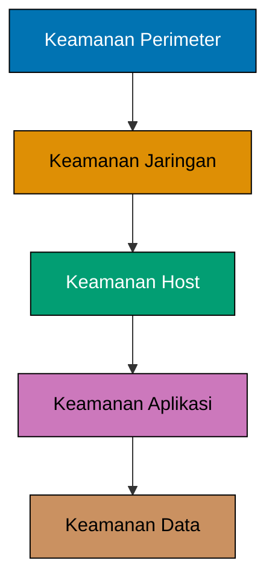
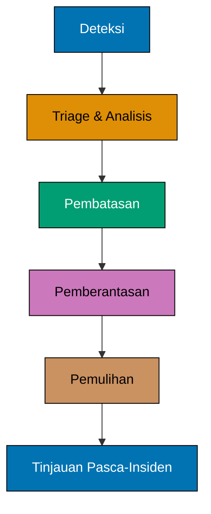
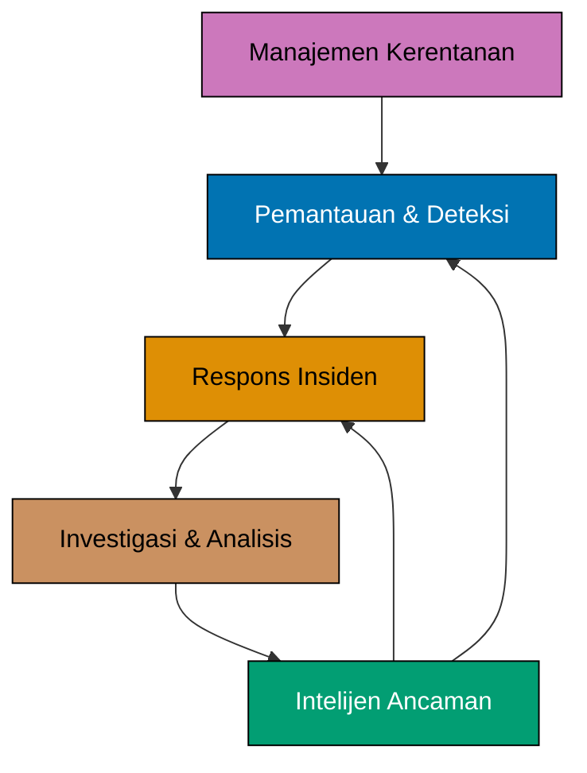
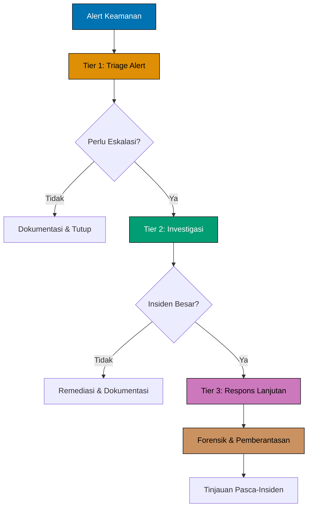

Keamanan defensif adalah praktik melindungi sistem komputer, jaringan, dan data dari serangan siber melalui langkah-langkah proaktif, pemantauan berkelanjutan, dan respons insiden yang cepat. Berbeda dengan keamanan ofensif yang mensimulasikan serangan untuk menemukan kerentanan, keamanan defensif fokus membangun perlindungan yang kuat dan mendeteksi ancaman saat terjadi.

## Konsep Inti

Bayangkan keamanan defensif seperti sistem keamanan rumah komprehensif yang mencakup kunci, alarm, kamera, dan penjaga. Sementara keamanan ofensif menguji apakah pertahanan Anda dapat ditembus, keamanan defensif memastikan perlindungan tersebut bekerja dengan handal setiap hari.

Prinsip fundamentalnya sederhana: **keamanan adalah proses berkelanjutan, bukan solusi satu kali**. Tim keamanan defensif terus memantau, mendeteksi, merespons, dan memulihkan dari insiden keamanan sambil memelihara dan meningkatkan langkah-langkah perlindungan.

## Metodologi Kunci

Keamanan defensif mencakup beberapa pendekatan komplementer:

### Defense-in-Depth

Defense-in-depth adalah strategi keamanan berlapis yang menerapkan beberapa kontrol pelindung di seluruh sistem. Jika satu lapisan gagal, lapisan lain terus memberikan perlindungan.

Setiap lapisan menangani vektor serangan yang berbeda:

- **Keamanan perimeter**: Firewall, VPN, dan perlindungan edge
- **Keamanan jaringan**: Segmentasi, deteksi intrusi, pemantauan traffic
- **Keamanan host**: Antivirus, patch management, endpoint detection
- **Keamanan aplikasi**: Validasi input, autentikasi, otorisasi
- **Keamanan data**: Enkripsi, kontrol akses, sistem backup

### Pemantauan dan Analisis Keamanan

Blue team terus memantau sistem untuk aktivitas mencurigakan menggunakan sistem Security Information and Event Management (SIEM), alat analisis log, dan network traffic analyzer. Visibilitas ini memungkinkan deteksi ancaman dini sebelum serangan menyebabkan kerusakan signifikan.

### Respons Insiden

Ketika insiden keamanan terjadi, tim defensif mengikuti proses respons terstruktur untuk menahan, memberantas, dan memulihkan dari serangan sambil melestarikan bukti untuk analisis dan proses hukum.

### Intelijen Ancaman

Keamanan defensif memanfaatkan intelijen ancaman dari berbagai sumber (feed komersial, komunitas berbagi informasi, analisis internal) untuk memahami taktik, teknik, dan prosedur penyerang. Pengetahuan ini mendorong peningkatan pertahanan proaktif.

## Keamanan Defensif vs. Ofensif

Hubungan antara keamanan defensif dan ofensif bersifat simbiotik, saling memperkuat:

| Aspek          | Keamanan Defensif                           | Keamanan Ofensif                              |
| -------------- | ------------------------------------------- | --------------------------------------------- |
| **Pendekatan** | Perlindungan dan pemantauan berkelanjutan   | Simulasi serangan dengan batas waktu          |
| **Tujuan**     | Mencegah, mendeteksi, dan merespons ancaman | Mengidentifikasi kerentanan sebelum penyerang |
| **Pola Pikir** | "Bagaimana cara melindungi ini?"            | "Bagaimana cara membobol ini?"                |
| **Alat**       | SIEM, IDS/IPS, firewall, antivirus          | Framework eksploitasi, scanner                |
| **Hasil**      | Sistem yang diperkuat, laporan insiden      | Penilaian kerentanan, proof-of-concepts       |
| **Timeline**   | Operasi berkelanjutan                       | Keterlibatan periodik                         |
| **Tipe Tim**   | Blue team, analis SOC                       | Red team, penetration tester                  |


Keamanan efektif memerlukan kedua pendekatan bekerja bersama. Keamanan defensif mengimplementasikan perlindungan, sementara keamanan ofensif menguji efektivitasnya. Operasi purple team menggabungkan kedua perspektif untuk menciptakan peningkatan keamanan komprehensif.


## Peran dalam Keamanan Siber Modern

Keamanan defensif memainkan beberapa peran kritis dalam perlindungan organisasi:

### Pemantauan Ancaman Berkelanjutan

Organisasi menghadapi upaya serangan konstan dari bot otomatis, penyerang oportunistik, dan aktor ancaman canggih. Keamanan defensif menyediakan pemantauan 24/7 melalui Security Operations Center (SOC) yang mendeteksi dan merespons ancaman secara real-time.

### Kepatuhan dan Tata Kelola

Kerangka kerja regulasi (GDPR, PCI DSS, HIPAA, SOC 2) mengamanatkan kontrol keamanan tertentu. Keamanan defensif mengimplementasikan dan memelihara kontrol ini, menyediakan jejak audit dan bukti kepatuhan.

### Kesinambungan Bisnis

Ketika insiden terjadi, keamanan defensif meminimalkan downtime dan kehilangan data melalui respons insiden, disaster recovery, dan perencanaan kesinambungan bisnis. Ini melestarikan operasi bisnis dan kepercayaan pelanggan.

### Arsitektur Keamanan

Tim defensif merancang dan mengimplementasikan arsitektur keamanan yang menyeimbangkan perlindungan dengan kebutuhan bisnis. Ini mencakup segmentasi jaringan, kontrol akses, manajemen identitas, dan praktik pengembangan aman.

## Praktik dan Alat Umum

Profesional keamanan defensif menggunakan teknologi dan praktik beragam di berbagai domain:

### Keamanan Jaringan

Melindungi infrastruktur jaringan dari intrusi dan akses tidak sah:

- **Firewall**: Next-generation firewall (NGFW) dengan kesadaran aplikasi dan intelijen ancaman
- **Intrusion Detection/Prevention**: Sistem seperti Snort, Suricata, Zeek untuk analisis traffic jaringan
- **Segmentasi Jaringan**: VLAN, arsitektur zero-trust, mikrosegmentasi
- **VPN dan Remote Access**: Konektivitas remote aman dengan multi-factor authentication

### Perlindungan Endpoint

Mengamankan perangkat individual (laptop, server, perangkat mobile):

- **Antivirus/Anti-malware**: Sistem deteksi berbasis signature dan behavioral
- **Endpoint Detection and Response (EDR)**: CrowdStrike, Carbon Black, Microsoft Defender untuk threat hunting lanjutan
- **Patch Management**: Sistem otomatis untuk menerapkan pembaruan keamanan
- **Application Whitelisting**: Membatasi eksekusi hanya untuk aplikasi yang disetujui

### Pemantauan Keamanan dan SIEM

Mengagregasi dan menganalisis event keamanan di seluruh organisasi:

- **Platform SIEM**: Splunk, ELK Stack, QRadar untuk pengumpulan dan korelasi log
- **User and Entity Behavior Analytics (UEBA)**: Mendeteksi pola perilaku anomali
- **Threat Hunting**: Pencarian proaktif untuk ancaman yang tidak terdeteksi di lingkungan
- **Manajemen Alert**: Tuning dan prioritas alert keamanan untuk mengurangi false positive

### Manajemen Identitas dan Akses

Mengontrol siapa yang dapat mengakses sumber daya apa:

- **Sistem Autentikasi**: Multi-factor authentication (MFA), single sign-on (SSO)
- **Privileged Access Management (PAM)**: Mengamankan dan memantau akun administratif
- **Identity Governance**: Role-based access control (RBAC), prinsip least privilege
- **Directory Services**: Active Directory, LDAP, cloud identity provider

### Manajemen Kerentanan

Mengidentifikasi dan memperbaiki kelemahan keamanan:

- **Vulnerability Scanner**: Scanning rutin dengan alat seperti Nessus, Qualys, OpenVAS
- **Patch Management**: Memprioritaskan dan menerapkan patch keamanan secara sistematis
- **Configuration Management**: Memastikan sistem mengikuti standar hardening keamanan
- **Asset Management**: Memelihara inventaris akurat semua aset IT

### Respons Insiden

Pendekatan terstruktur untuk menangani insiden keamanan:

- **Platform Respons Insiden**: TheHive, SOAR (Security Orchestration, Automation, and Response)
- **Alat Forensik**: Analisis memori, imaging disk, rekonstruksi timeline
- **Protokol Komunikasi**: Prosedur eskalasi, notifikasi stakeholder
- **Playbook**: Prosedur respons yang telah ditentukan untuk tipe insiden umum


Alat keamanan hanya efektif jika dikonfigurasi, dipantau, dan dipelihara dengan benar. Banyak pelanggaran keamanan terjadi bukan karena organisasi kekurangan alat, tetapi karena alat yang ada salah dikonfigurasi atau alert tidak diperhatikan.


## Strategi Defense-in-Depth

Keamanan defensif efektif menerapkan beberapa lapisan perlindungan:

### Pertahanan Perimeter

Garis perlindungan pertama mengontrol batas jaringan:

- **Border firewall**: Menyaring traffic yang masuk dan keluar jaringan
- **Email security gateway**: Memblokir phishing dan email berisi malware
- **Web application firewall (WAF)**: Melindungi aplikasi web dari serangan umum
- **Perlindungan DDoS**: Mitigasi serangan distributed denial-of-service

### Pertahanan Jaringan

Perlindungan jaringan internal membatasi lateral movement:

- **Segmentasi jaringan**: Mengisolasi sistem dan data kritis
- **Internal firewall**: Mengontrol traffic antar zona jaringan
- **Network access control (NAC)**: Memverifikasi kepatuhan perangkat sebelum akses jaringan
- **Intrusion prevention system**: Memblokir pola traffic berbahaya secara otomatis

### Pertahanan Host

Melindungi sistem individual dari kompromi:

- **Hardening sistem operasi**: Menonaktifkan layanan yang tidak perlu, konfigurasi kuat
- **Perlindungan endpoint**: Anti-malware, kontrol aplikasi, enkripsi perangkat
- **Patch management**: Menjaga sistem tetap update dengan patch keamanan
- **Host-based firewall**: Mengontrol koneksi jaringan per perangkat

### Pertahanan Aplikasi

Mengamankan aplikasi dari eksploitasi:

- **Praktik pengembangan aman**: Pengujian keamanan, code review, threat modeling
- **Validasi input**: Mencegah serangan injection
- **Autentikasi dan otorisasi**: Memastikan hanya pengguna berwenang mengakses fitur
- **Pengujian keamanan aplikasi**: Analisis statis (SAST), analisis dinamis (DAST)

### Pertahanan Data

Melindungi informasi sensitif:

- **Klasifikasi data**: Mengidentifikasi dan memberi label data sensitif
- **Enkripsi**: Melindungi data at rest dan in transit
- **Data loss prevention (DLP)**: Mencegah eksfiltrasi data tidak sah
- **Backup dan recovery**: Memastikan data dapat dipulihkan setelah insiden

## Respons Insiden dan Pemantauan

Keamanan defensif unggul dalam mendeteksi dan merespons ancaman aktif:

### Kemampuan Deteksi

Beberapa metode deteksi mengidentifikasi berbagai tipe ancaman:

- **Deteksi berbasis signature**: Mengidentifikasi malware dan pola serangan yang diketahui
- **Deteksi anomali**: Menemukan perilaku tidak biasa yang mungkin mengindikasikan kompromi
- **Analisis perilaku**: Memahami pola normal untuk mengidentifikasi penyimpangan
- **Korelasi intelijen ancaman**: Mencocokkan aktivitas dengan indikator ancaman yang diketahui

### Security Operations Center (SOC)

Tim terpusat memantau keamanan 24/7:

- **Analis Tier 1**: Triage alert awal dan penanganan insiden dasar
- **Analis Tier 2**: Investigasi mendalam dan analisis ancaman lanjutan
- **Spesialis Tier 3**: Respons insiden, forensik, threat hunting
- **Manajemen SOC**: Metrik, peningkatan proses, optimisasi alat

### Proses Respons Insiden

Metodologi terstruktur untuk menangani insiden keamanan:

1. **Persiapan**: Membangun kapabilitas, alat, dan prosedur sebelum insiden terjadi
2. **Deteksi dan Analisis**: Mengidentifikasi insiden potensial dan menentukan ruang lingkupnya
3. **Pembatasan**: Membatasi penyebaran insiden sambil melestarikan bukti
4. **Pemberantasan**: Menghapus keberadaan penyerang dan menutup vektor serangan
5. **Pemulihan**: Mengembalikan sistem ke operasi normal dengan aman
6. **Aktivitas Pasca-Insiden**: Mendokumentasikan pelajaran yang dipetik dan meningkatkan pertahanan


Latihan respons insiden rutin (tabletop exercise, simulasi) memastikan tim dapat merespons secara efektif ketika insiden nyata terjadi. Praktik mengungkap celah dalam prosedur, alat, dan komunikasi sebelum menjadi kegagalan kritis.


## Area dan Peran Kunci Keamanan Defensif

Keamanan defensif mencakup beberapa area khusus, masing-masing dengan peran yang didedikasikan yang berkontribusi pada perlindungan organisasi yang komprehensif. Area-area ini bekerja bersama untuk menciptakan postur keamanan yang kohesif:

### Pemantauan dan Deteksi

Area ini fokus pada pengawasan berkelanjutan terhadap sistem, jaringan, dan aplikasi untuk mengidentifikasi aktivitas mencurigakan dan insiden keamanan potensial secara real-time.

**Peran Analis SOC:**

Analis SOC (Security Operations Center) berfungsi sebagai pembela garis depan, memantau alert dan event keamanan sepanjang waktu. Mereka menganalisis log dari berbagai sumber, melakukan triage alert keamanan, dan menentukan apakah aktivitas yang terdeteksi merupakan ancaman nyata atau false positive.

**Tanggung Jawab Utama:**

- Memantau dashboard SIEM dan alat keamanan untuk aktivitas mencurigakan
- Melakukan triage awal alert keamanan dan mengkategorikan insiden berdasarkan tingkat keparahan
- Mengorelasikan event dari berbagai sumber untuk mengidentifikasi pola serangan
- Mengeskalasi insiden yang terkonfirmasi ke tim respons insiden
- Mendokumentasikan temuan dan memelihara sistem pelacakan insiden

**Keterampilan dan Alat:**

Keterampilan teknis mencakup analisis log, pengenalan pola, dan pemahaman protokol jaringan serta sistem operasi. Analis SOC bekerja dengan platform SIEM (Splunk, ELK Stack, QRadar), sistem deteksi intrusi, alat pemantauan jaringan, dan sistem ticketing. Pemikiran analitis yang kuat dan kemampuan bekerja di bawah tekanan selama event keamanan sangat penting.

**Kontribusi:**

Analis SOC menyediakan sistem peringatan dini yang kritis yang memungkinkan respons cepat terhadap ancaman. Kemampuan mereka untuk dengan cepat mengidentifikasi dan mengeskalasi ancaman nyata mencegah insiden kecil menjadi pelanggaran besar.

### Respons Insiden

Respons Insiden fokus pada pengelolaan insiden keamanan melalui proses terstruktur yang menahan, memberantas, dan memulihkan dari serangan sambil meminimalkan dampak bisnis.

**Peran Incident Responder:**

Incident Responder memimpin respons terkoordinasi terhadap insiden keamanan yang terkonfirmasi, membuat keputusan kritis tentang strategi pembatasan dan prosedur pemulihan. Mereka berkoordinasi lintas tim teknis, manajemen, dan stakeholder eksternal selama insiden aktif.

**Tanggung Jawab Utama:**

- Memimpin upaya respons insiden mengikuti playbook dan prosedur yang telah ditetapkan
- Membuat keputusan cepat tentang strategi pembatasan dan pendekatan pemulihan
- Berkoordinasi dengan berbagai tim (IT, legal, komunikasi, manajemen) selama insiden
- Melestarikan bukti digital untuk analisis forensik dan proses hukum potensial
- Melakukan tinjauan pasca-insiden dan merekomendasikan peningkatan keamanan
- Mengembangkan dan memelihara playbook respons insiden

**Keterampilan dan Alat:**

Keahlian mencakup metodologi penanganan insiden (NIST, SANS), dasar-dasar forensik, dasar analisis malware, dan manajemen proyek selama situasi krisis. Alat mencakup platform respons insiden (TheHive, sistem SOAR), alat forensik, platform komunikasi, dan sistem dokumentasi. Kepemimpinan yang kuat, pengambilan keputusan di bawah tekanan, dan keterampilan komunikasi sangat penting.

**Kontribusi:**

Incident Responder meminimalkan kerusakan dari insiden keamanan melalui tindakan cepat dan terkoordinasi. Kepemimpinan mereka selama krisis melindungi operasi bisnis dan memastikan organisasi dapat pulih dengan cepat dan sepenuhnya.

### Intelijen Ancaman

Intelijen Ancaman fokus pada pengumpulan, analisis, dan penerapan pengetahuan tentang ancaman saat ini dan yang muncul untuk meningkatkan kapabilitas defensif secara proaktif.

**Peran Security Engineer (Fokus Intelijen Ancaman):**

Security Engineer yang berspesialisasi dalam intelijen ancaman mengubah data ancaman mentah menjadi intelijen yang dapat ditindaklanjuti yang memperkuat pertahanan organisasi. Mereka menjembatani kesenjangan antara informasi ancaman eksternal dan operasi keamanan internal.

**Tanggung Jawab Utama:**

- Mengumpulkan intelijen ancaman dari feed komersial, sumber terbuka, dan komunitas berbagi
- Menganalisis taktik, teknik, dan prosedur (TTP) aktor ancaman menggunakan framework seperti MITRE ATT&CK
- Menerjemahkan intelijen ancaman menjadi aturan deteksi dan kontrol keamanan
- Menyediakan konteks dan rekomendasi kepada analis SOC dan incident responder
- Melacak kampanye ancaman dan menilai relevansinya terhadap organisasi
- Berkolaborasi dengan tim keamanan ofensif untuk memvalidasi pertahanan terhadap ancaman dunia nyata

**Keterampilan dan Alat:**

Keterampilan mencakup analisis ancaman, pemahaman metodologi adversary, teknik analisis intelijen, dan scripting untuk otomasi. Alat mencakup platform intelijen ancaman (TIP), framework MITRE ATT&CK, feed ancaman, malware sandbox, dan alat open-source intelligence (OSINT). Pemikiran analitis dan kemampuan melihat pola di berbagai sumber informasi yang berbeda sangat penting.

**Kontribusi:**

Security Engineer yang fokus pada intelijen ancaman memungkinkan pertahanan proaktif dengan membantu organisasi mengantisipasi dan mempersiapkan diri terhadap ancaman sebelum menyerang. Pekerjaan mereka memastikan pertahanan berkembang untuk menangani teknik serangan yang muncul.

### Manajemen Kerentanan

Manajemen Kerentanan fokus pada identifikasi, penilaian, prioritas, dan remediasi kelemahan keamanan di seluruh infrastruktur dan aplikasi organisasi.

**Peran Vulnerability Analyst:**

Vulnerability Analyst secara sistematis mengidentifikasi dan menilai kelemahan keamanan, bekerja dengan tim di seluruh organisasi untuk memastikan kerentanan diperbaiki berdasarkan risiko dan dampak bisnis.

**Tanggung Jawab Utama:**

- Melakukan scanning kerentanan rutin di seluruh jaringan, sistem, dan aplikasi
- Menganalisis hasil scan untuk memvalidasi kerentanan sejati dan menghilangkan false positive
- Menilai dan memprioritaskan kerentanan berdasarkan eksploitabilitas, dampak bisnis, dan intelijen ancaman
- Melacak upaya remediasi dan memastikan kerentanan ditangani dengan benar
- Menghasilkan metrik dan laporan tentang tren kerentanan dan efektivitas remediasi
- Berkolaborasi dengan administrator sistem dan developer tentang strategi remediasi

**Keterampilan dan Alat:**

Pengetahuan teknis mencakup metodologi penilaian kerentanan, analisis risiko, pemahaman tipe kerentanan umum (OWASP Top 10, database CVE), dan proses patching. Alat mencakup scanner kerentanan (Nessus, Qualys, OpenVAS), sistem manajemen aset, platform manajemen patch, dan alat pelaporan. Keterampilan komunikasi yang kuat membantu menyampaikan risiko teknis kepada tim teknis dan stakeholder bisnis.

**Kontribusi:**

Vulnerability Analyst mengurangi permukaan serangan organisasi dengan secara sistematis mengidentifikasi dan mendorong remediasi kelemahan keamanan. Prioritas mereka memastikan sumber daya fokus pada risiko paling kritis terlebih dahulu.

### Investigasi dan Analisis

Investigasi dan Analisis fokus pada pemeriksaan teknis mendalam terhadap insiden keamanan, malware, dan bukti digital untuk memahami bagaimana serangan terjadi dan mencegah insiden di masa depan.

**Peran Digital Forensics Analyst:**

Digital Forensics Analyst melakukan investigasi teknis terperinci terhadap insiden keamanan, memeriksa bukti digital untuk merekonstruksi timeline serangan, mengidentifikasi indikator kompromi, dan mendukung upaya respons insiden.

**Tanggung Jawab Utama:**

- Melakukan analisis forensik terhadap sistem yang disusupi, termasuk memori, disk, dan artefak jaringan
- Merekonstruksi timeline serangan dan menentukan ruang lingkup insiden keamanan
- Mengekstrak dan menganalisis bukti digital sambil memelihara chain of custody
- Mengidentifikasi indikator kompromi (IOC) untuk deteksi dan pencegahan
- Menganalisis sampel malware untuk memahami kapabilitas dan perilaku
- Mendokumentasikan temuan dalam laporan teknis terperinci untuk respons insiden dan proses hukum
- Memberikan kesaksian ahli dalam proses hukum ketika diperlukan

**Keterampilan dan Alat:**

Keahlian teknis mendalam mencakup metodologi forensik, internal sistem operasi (Windows, Linux), analisis file system, forensik memori, dan analisis malware. Alat mencakup suite forensik (EnCase, FTK), alat analisis memori (Volatility), alat imaging disk, environment analisis malware, dan alat analisis timeline. Perhatian terhadap detail, pendekatan metodis, dan kemampuan mendokumentasikan temuan teknis dengan jelas sangat kritis.

**Kontribusi:**

Digital Forensics Analyst menyediakan pemahaman teknis mendalam tentang insiden keamanan yang diperlukan untuk sepenuhnya memberantas ancaman dan mencegah kekambuhan. Analisis terperinci mereka mengungkap cerita lengkap tentang bagaimana serangan terjadi, memungkinkan remediasi komprehensif dan peningkatan pertahanan.

## Security Operations Centre (SOC)

Security Operations Centre (SOC) adalah fasilitas terpusat di mana tim keamanan terus memantau, mendeteksi, menganalisis, dan merespons insiden keamanan siber. SOC berfungsi sebagai pusat saraf operasi keamanan defensif organisasi, menyediakan visibilitas 24/7 terhadap postur keamanan dan mengkoordinasikan respons terhadap ancaman.

### Struktur dan Tim SOC

SOC modern mengatur analis ke dalam tier berdasarkan keahlian dan tanggung jawab:

**Analis Tier 1** (Triage Alert dan Respons Awal):

- Memantau dashboard SIEM dan alert alat keamanan secara berkelanjutan
- Melakukan klasifikasi awal dan prioritas event keamanan
- Menangani insiden rutin mengikuti prosedur operasi standar
- Mengeskalasi insiden kompleks atau tingkat keparahan tinggi ke Tier 2
- Mendokumentasikan semua tindakan dan temuan dalam sistem ticketing
- Mempertahankan kesadaran terhadap lanskap ancaman saat ini

**Analis Tier 2** (Investigasi Mendalam):

- Melakukan analisis mendalam terhadap insiden keamanan yang dieskalasi
- Melakukan korelasi log lanjutan di berbagai sumber data
- Menginvestigasi potensi pelanggaran keamanan dan menentukan ruang lingkup
- Mengembangkan dan menyesuaikan aturan deteksi berdasarkan intelijen ancaman
- Membimbing dan memberikan panduan kepada analis Tier 1
- Berkoordinasi dengan tim IT untuk tindakan remediasi

**Spesialis Tier 3** (Respons Ahli dan Hunting):

- Memimpin respons insiden untuk event keamanan besar
- Melakukan forensik digital lanjutan dan analisis malware
- Melakukan threat hunting proaktif untuk menemukan ancaman tersembunyi
- Mengembangkan alat dan otomasi kustom untuk operasi keamanan
- Berfungsi sebagai ahli subjek untuk domain tertentu (keamanan jaringan, keamanan cloud, dll.)
- Berkontribusi pada keputusan arsitektur dan strategi keamanan

### Aktivitas Harian SOC

Tim SOC melakukan berbagai aktivitas sepanjang setiap shift:

**Pemantauan dan Triage Alert**:

- Pemantauan berkelanjutan terhadap platform SIEM untuk alert keamanan
- Meninjau alert IDS/IPS untuk potensi intrusi
- Menganalisis notifikasi endpoint detection and response (EDR)
- Menilai alert keamanan email untuk kampanye phishing
- Memprioritaskan alert berdasarkan tingkat keparahan, kritikalitas aset, dan konteks ancaman

**Investigasi Insiden**:

- Mengumpulkan dan mengorelasikan log dari berbagai sumber (firewall, proxy, endpoint, aplikasi)
- Menganalisis tangkapan traffic jaringan untuk pola mencurigakan
- Meninjau user and entity behavior analytics (UEBA) untuk anomali
- Menginvestigasi kegagalan autentikasi dan upaya eskalasi privilege
- Menentukan apakah aktivitas yang terdeteksi merupakan insiden keamanan sejati

**Threat Hunting**:

- Pencarian proaktif indikator kompromi (IOC) di seluruh lingkungan
- Investigasi berbasis hipotesis berdasarkan intelijen ancaman
- Analisis baseline untuk mengidentifikasi penyimpangan dari perilaku normal
- Pembuatan query untuk mengungkap ancaman tersembunyi yang tidak tertangkap oleh alat otomatis
- Dokumentasi metodologi dan temuan hunting

**Analisis Log**:

- Meninjau log sistem, aplikasi, dan keamanan untuk event mencurigakan
- Mengidentifikasi pola yang mungkin mengindikasikan kampanye serangan
- Memvalidasi pengumpulan log dan memastikan sistem kritis dipantau
- Mengatasi masalah parsing dan ingestion log
- Memelihara kebijakan retensi log untuk kepatuhan

**Pembuatan Laporan**:

- Membuat laporan metrik keamanan harian, mingguan, dan bulanan
- Mendokumentasikan timeline insiden dan tindakan respons
- Menghasilkan laporan intelijen ancaman untuk stakeholder
- Menghasilkan laporan kepatuhan untuk auditor
- Mengkomunikasikan postur keamanan kepada manajemen

**Koordinasi dengan Tim Lain**:

- Bekerja dengan operasi IT untuk meremediasi kerentanan
- Berkolaborasi dengan tim jaringan untuk menerapkan aturan pemblokiran
- Bermitra dengan tim aplikasi untuk menginvestigasi event keamanan
- Melibatkan legal dan HR untuk pelanggaran kebijakan
- Berkoordinasi dengan tim respons insiden eksternal bila diperlukan

### SIEM (Security Information and Event Management)

Platform SIEM berfungsi sebagai fondasi operasi SOC, menyediakan visibilitas terpusat dan kapabilitas analisis.

**Apa itu SIEM**:

Sistem SIEM mengumpulkan, mengagregasi, dan menganalisis data terkait keamanan dari seluruh lingkungan IT. Sistem ini mengorelasikan event dari berbagai sumber untuk mengidentifikasi pola yang mungkin mengindikasikan insiden keamanan, memungkinkan analis mendeteksi ancaman yang tidak terlihat saat melihat sistem individual secara terpisah.

**Kapabilitas Kunci SIEM**:

**Agregasi Log**:

- Mengumpulkan log dari firewall, server, endpoint, aplikasi, layanan cloud, dan perangkat jaringan
- Menormalkan format log dari berbagai vendor menjadi skema terpadu
- Menyediakan penyimpanan terpusat dengan kebijakan retensi
- Memastikan integritas log dan bukti tamper-evidence

**Korelasi dan Analitik**:

- Menerapkan aturan korelasi untuk mengidentifikasi pola serangan di berbagai event
- Mendeteksi serangan multi-tahap dengan menghubungkan aktivitas terkait seiring waktu
- Menggunakan machine learning untuk mengidentifikasi perilaku anomali
- Memperkaya event dengan intelijen ancaman dan konteks aset

**Alert dan Notifikasi**:

- Menghasilkan alert ketika aturan korelasi cocok dengan pola mencurigakan
- Memprioritaskan alert berdasarkan tingkat keparahan dan dampak bisnis
- Merutekan notifikasi ke tim respons yang sesuai
- Mengurangi false positive melalui tuning dan validasi

**Dashboard dan Visualisasi**:

- Menyediakan dashboard pemantauan keamanan real-time
- Memvisualisasikan pola serangan, tren, dan hotspot
- Menampilkan status kepatuhan dan metrik audit
- Memungkinkan dashboard kustom untuk berbagai kebutuhan stakeholder

**Cara Analis SOC Menggunakan SIEM Setiap Hari**:

Analis SOC berinteraksi dengan platform SIEM sepanjang shift mereka:

- **Serah terima shift pagi**: Meninjau alert dan insiden semalam dari dashboard SIEM
- **Pemantauan berkelanjutan**: Mengawasi feed alert real-time dan metrik keamanan
- **Investigasi**: Query SIEM untuk log terperinci saat menginvestigasi event keamanan
- **Korelasi**: Membangun pencarian kustom untuk menghubungkan event terkait di berbagai sistem
- **Tuning**: Menyesuaikan aturan deteksi berdasarkan false positive dan ancaman yang muncul
- **Pelaporan**: Menghasilkan laporan kepatuhan dan operasional dari data SIEM
- **Threat hunting**: Membuat query kompleks untuk mencari ancaman tersembunyi

**Platform SIEM Populer**:

- **Splunk**: SIEM komersial terkemuka dengan pencarian dan analitik yang kuat
- **IBM QRadar**: SIEM enterprise dengan korelasi kuat dan analisis flow
- **Microsoft Sentinel**: SIEM cloud-native terintegrasi dengan ekosistem Azure
- **ELK Stack** (Elasticsearch, Logstash, Kibana): Solusi SIEM open-source
- **Sumo Logic**: SIEM berbasis cloud dengan kapabilitas machine learning
- **LogRhythm**: SIEM fokus pada deteksi dan respons ancaman yang cepat


Efektivitas SIEM sangat bergantung pada konfigurasi yang tepat, tuning, dan keahlian analis. Platform itu sendiri hanyalah alat - analis terampil mengubah data SIEM menjadi intelijen keamanan yang dapat ditindaklanjuti.


### Metrik dan KPI SOC

SOC mengukur efektivitas melalui indikator kinerja kunci:

**Metrik Operasional**:

- **Mean Time to Detect (MTTD)**: Waktu rata-rata dari kompromi hingga deteksi
- **Mean Time to Respond (MTTR)**: Waktu rata-rata dari deteksi hingga pembatasan
- **Volume Alert**: Jumlah alert keamanan yang dihasilkan per hari/minggu
- **False Positive Rate**: Persentase alert yang bukan insiden keamanan sejati
- **Escalation Rate**: Persentase alert Tier 1 yang dieskalasi ke tier lebih tinggi

**Metrik Kualitas**:

- **Detection Coverage**: Persentase teknik serangan yang dicakup oleh pemantauan
- **Incident Severity Distribution**: Rincian insiden berdasarkan kritikalitas
- **Threat Intelligence Integration**: Jumlah indikator ancaman yang dipantau secara aktif
- **Playbook Coverage**: Persentase tipe insiden dengan prosedur respons terdokumentasi
- **Analyst Training Hours**: Pendidikan berkelanjutan dan pengembangan keterampilan

**Metrik Dampak Bisnis**:

- **Incidents Prevented**: Event keamanan yang dihentikan sebelum menyebabkan kerusakan
- **Downtime Avoided**: Kesinambungan bisnis yang dipertahankan melalui respons cepat
- **Compliance Violations**: Kepatuhan kebijakan keamanan dan regulasi
- **Cost Avoidance**: Estimasi kerugian finansial yang dicegah oleh operasi SOC

## Langkah Defensif Inti

Keamanan defensif efektif bergantung pada langkah-langkah pelindung fundamental yang bekerja bersama untuk menciptakan perlindungan komprehensif:

### 1. Pelatihan Karyawan

Kesalahan manusia tetap menjadi penyebab utama insiden keamanan, membuat edukasi karyawan menjadi langkah defensif kritis.

**Program Kesadaran Keamanan**:

- **Sesi pelatihan rutin**: Kursus kesadaran keamanan kuartalan atau tahunan yang mencakup ancaman saat ini
- **Onboarding karyawan baru**: Pelatihan keamanan sebagai bagian dari proses onboarding karyawan
- **Pengingat berkelanjutan**: Tips keamanan bulanan, newsletter, dan pembaruan bulletin board
- **Modul khusus topik**: Penanganan data, keamanan password, keamanan fisik, social engineering
- **Pengukuran dan pelacakan**: Tes penilaian untuk memverifikasi retensi pengetahuan
- **Pembangunan budaya**: Menciptakan budaya organisasi yang sadar keamanan

**Simulasi Phishing**:

- **Kampanye phishing simulasi**: Pengujian rutin dengan email phishing palsu yang realistis
- **Kesulitan progresif**: Dimulai sederhana, secara bertahap memperkenalkan serangan yang lebih canggih
- **Umpan balik langsung**: Pop-up edukatif ketika pengguna mengklik tautan mencurigakan
- **Mekanisme pelaporan**: Melatih karyawan untuk melaporkan email mencurigakan
- **Pelacakan metrik**: Tingkat klik, tingkat pelaporan, peningkatan seiring waktu
- **Pelatihan tertarget**: Coaching tambahan untuk pengguna yang konsisten gagal simulasi

**Pelatihan Keamanan Berbasis Peran**:

- **Developer**: Praktik coding aman, OWASP Top 10, pengujian keamanan
- **Administrator IT**: Hardening sistem, patch management, kontrol akses
- **Eksekutif**: Business email compromise, CEO fraud, serangan tertarget
- **Tim keuangan**: Payment fraud, invoice scam, verifikasi wire transfer
- **Personel HR**: Serangan social engineering, credential harvesting
- **Customer support**: Privasi data, pengenalan social engineering


Pelatihan keamanan paling efektif ketika menarik, relevan dengan pekerjaan sehari-hari karyawan, dan diperkuat secara teratur. Pelatihan tahunan sekali tidak cukup - kesadaran keamanan harus berkelanjutan.


### 2. Intrusion Detection Systems (IDS)

IDS memantau traffic jaringan dan aktivitas sistem untuk mengidentifikasi perilaku mencurigakan dan serangan potensial.

**Network-Based IDS (NIDS)**:

IDS jaringan menganalisis traffic jaringan untuk pola berbahaya:

- **Deployment**: Ditempatkan di titik jaringan strategis (perimeter, DMZ, segmen kritis)
- **Analisis traffic**: Memeriksa konten paket dan aliran traffic secara real-time
- **Analisis protokol**: Mendeteksi anomali dan pelanggaran protokol
- **Coverage**: Memantau semua perangkat pada segmen jaringan
- **Visibilitas**: Menyediakan deteksi ancaman di seluruh jaringan
- **Alat populer**: Snort, Suricata, Zeek (sebelumnya Bro)

**Host-Based IDS (HIDS)**:

IDS host memantau sistem individual untuk aktivitas mencurigakan:

- **Deployment**: Diinstal sebagai agent pada server, workstation, dan sistem kritis
- **Pemantauan log**: Menganalisis log sistem, log aplikasi, dan audit trail
- **Integritas file**: Mendeteksi perubahan tidak sah pada file kritis
- **Pemantauan proses**: Mengidentifikasi eksekusi dan perilaku proses mencurigakan
- **Granularitas**: Menyediakan visibilitas terperinci terhadap aktivitas host tertentu
- **Alat populer**: OSSEC, Wazuh, Tripwire

**Deteksi Berbasis Signature**:

- **Pattern matching**: Mengidentifikasi signature serangan yang diketahui dan indikator malware
- **Database**: Memelihara library pola ancaman yang diketahui
- **Akurasi**: False positive rendah untuk ancaman yang diketahui
- **Limitasi**: Tidak dapat mendeteksi serangan baru atau termodifikasi (kerentanan zero-day)
- **Pemeliharaan**: Memerlukan pembaruan signature rutin

**Deteksi Berbasis Anomali**:

- **Baseline learning**: Membangun pola perilaku normal
- **Deteksi penyimpangan**: Mengidentifikasi aktivitas yang berbeda dari baseline
- **Adaptabilitas**: Dapat mendeteksi ancaman baru dan tidak diketahui
- **Tantangan**: Tingkat false positive lebih tinggi yang memerlukan tuning
- **Machine learning**: Sistem modern menggunakan AI untuk meningkatkan akurasi


IDS adalah sistem detection-only - mereka memberikan alert pada aktivitas mencurigakan tetapi tidak memblokirnya. Untuk pemblokiran otomatis, organisasi memerlukan Intrusion Prevention Systems (IPS), yang secara aktif memblokir ancaman yang terdeteksi.


### 3. Firewall

Firewall berfungsi sebagai garis pertahanan pertama, mengontrol traffic jaringan berdasarkan kebijakan keamanan.

**Network Firewall**:

Firewall tradisional menyaring traffic di batas jaringan:

- **Packet filtering**: Memeriksa header paket (IP sumber/tujuan, port, protokol)
- **Stateful inspection**: Melacak status koneksi dan memastikan paket respons cocok dengan permintaan
- **Rule-based**: Menerapkan aturan allow/deny berdasarkan kebijakan keamanan
- **Deployment**: Perimeter (internet edge), segmentasi internal, batas datacenter
- **Use case**: Memblokir akses eksternal tidak sah, memisahkan zona jaringan
- **Contoh**: Cisco ASA, Palo Alto Networks, Fortinet FortiGate

**Web Application Firewall (WAF)**:

WAF melindungi aplikasi web dari serangan lapisan aplikasi:

- **Inspeksi HTTP/HTTPS**: Menganalisis konten traffic web, bukan hanya header
- **Perlindungan OWASP**: Melindungi dari SQL injection, XSS, CSRF, dan serangan web lainnya
- **Mode deployment**: Reverse proxy, transparent bridge, cloud-based
- **Aturan kustom**: Perlindungan yang disesuaikan untuk kerentanan aplikasi tertentu
- **Virtual patching**: Perlindungan sementara sementara perbaikan permanen dikembangkan
- **Contoh**: ModSecurity, Cloudflare WAF, AWS WAF, F5 Advanced WAF

**Next-Generation Firewall (NGFW)**:

NGFW menggabungkan firewall tradisional dengan fitur keamanan lanjutan:

- **Application awareness**: Mengidentifikasi dan mengontrol aplikasi tertentu, bukan hanya port
- **User identity**: Menerapkan kebijakan berdasarkan pengguna/grup, bukan hanya alamat IP
- **Integrated IPS**: Kapabilitas intrusion prevention built-in
- **Inspeksi SSL/TLS**: Mendekripsi traffic terenkripsi untuk inspeksi
- **Threat intelligence**: Mengintegrasikan feed ancaman eksternal untuk perlindungan dinamis
- **Integrasi cloud**: Kebijakan konsisten di seluruh lingkungan on-premises dan cloud
- **Contoh**: Palo Alto Networks PA-Series, Cisco Firepower, Check Point NGFW

**Best Practice Firewall**:

- **Default deny**: Blokir semua traffic secara default, izinkan hanya komunikasi yang diperlukan secara eksplisit
- **Least privilege**: Berikan akses minimum yang diperlukan untuk fungsi bisnis
- **Tinjauan rutin**: Audit aturan firewall kuartalan untuk menghapus entri yang sudah usang
- **Change management**: Dokumentasikan semua perubahan aturan dengan justifikasi bisnis
- **Logging dan pemantauan**: Aktifkan logging komprehensif untuk analisis keamanan
- **High availability**: Deploy firewall redundan untuk mencegah single point of failure

### 4. Kebijakan Keamanan

Kebijakan keamanan menetapkan aturan, prosedur, dan standar yang mengatur praktik keamanan organisasi.

**Acceptable Use Policy (AUP)**:

Mendefinisikan penggunaan yang sesuai untuk sumber daya IT organisasi:

- **Scope**: Email, internet, komputer, perangkat mobile, sumber daya jaringan
- **Aktivitas yang diizinkan**: Penggunaan bisnis yang sah, penggunaan pribadi terbatas
- **Aktivitas yang dilarang**: Konten ilegal, pelecehan, instalasi software tidak sah
- **Konsekuensi**: Tindakan disipliner untuk pelanggaran kebijakan
- **Pengakuan**: Karyawan menandatangani penerimaan selama onboarding
- **Siklus tinjauan**: Tinjauan dan pembaruan tahunan

**Kebijakan Kontrol Akses**:

Mengatur siapa yang dapat mengakses sumber daya apa:

- **Prinsip least privilege**: Pengguna menerima akses minimum yang diperlukan untuk peran mereka
- **Separation of duties**: Operasi kritis memerlukan beberapa orang
- **Persyaratan autentikasi**: Kompleksitas password, multi-factor authentication
- **Tinjauan akses**: Verifikasi periodik bahwa hak akses tetap sesuai
- **Prosedur terminasi**: Pencabutan akses segera ketika karyawan keluar
- **Privileged access**: Kontrol khusus untuk akun administratif

**Kebijakan Respons Insiden**:

Mendefinisikan prosedur untuk menangani insiden keamanan:

- **Klasifikasi insiden**: Tingkat keparahan dan kriteria kategorisasi
- **Prosedur pelaporan**: Cara karyawan melaporkan insiden yang dicurigai
- **Peran tim respons**: Tanggung jawab anggota tim respons insiden
- **Jalur eskalasi**: Kapan dan bagaimana mengeskalasi insiden
- **Protokol komunikasi**: Komunikasi internal dan eksternal selama insiden
- **Persyaratan pasca-insiden**: Dokumentasi, tinjauan, dan pelajaran yang dipetik

**Kebijakan Klasifikasi Data**:

Menetapkan cara menangani berbagai jenis informasi:

- **Tingkat klasifikasi**: Publik, internal, konfidensial, terbatas
- **Persyaratan penanganan**: Penyimpanan, transmisi, berbagi, aturan retensi per level
- **Labeling**: Cara menandai dokumen dan data dengan klasifikasi
- **Pembatasan akses**: Siapa yang dapat mengakses setiap tingkat klasifikasi
- **Persyaratan enkripsi**: Kapan enkripsi wajib
- **Prosedur pembuangan**: Metode penghapusan dan pemusnahan aman

**Kebijakan Keamanan Kritis Lainnya**:

- **Kebijakan password**: Kompleksitas, panjang, rotasi, larangan berbagi
- **Kebijakan remote work**: Penggunaan VPN, keamanan perangkat, persyaratan jaringan rumah
- **Bring Your Own Device (BYOD)**: Persyaratan keamanan perangkat pribadi
- **Kebijakan change management**: Proses terkontrol untuk perubahan sistem
- **Kebijakan backup dan recovery**: Frekuensi backup, retensi, persyaratan pengujian
- **Kebijakan vendor management**: Persyaratan keamanan untuk pihak ketiga


Kebijakan keamanan hanya efektif ketika dikomunikasikan dengan jelas, ditegakkan secara konsisten, dan ditinjau secara teratur. Kebijakan harus menyeimbangkan persyaratan keamanan dengan praktikalitas bisnis untuk mendapatkan kepatuhan karyawan.


**Faktor Keberhasilan Implementasi Kebijakan**:

- **Dukungan eksekutif**: Komitmen kepemimpinan dan endorsement yang terlihat
- **Bahasa yang jelas**: Hindari jargon, buat kebijakan yang dapat dipahami oleh semua karyawan
- **Persyaratan yang wajar**: Kebijakan harus praktis dan dapat diimplementasikan
- **Pelatihan rutin**: Edukasi berkelanjutan tentang persyaratan kebijakan
- **Penegakan**: Penerapan konsekuensi yang konsisten untuk pelanggaran
- **Continuous improvement**: Perbarui kebijakan berdasarkan pelajaran yang dipetik dan ancaman yang berkembang

## Kolaborasi dengan Keamanan Ofensif

Tim keamanan defensif dan ofensif bekerja terbaik saat berkolaborasi:

### Operasi Purple Team

Purple teaming menggabungkan red team (ofensif) dan blue team (defensif) untuk meningkatkan keamanan:

- **Serangan terkontrol**: Red team mengeksekusi teknik tertentu sementara blue team mendeteksi
- **Tuning deteksi**: Menyesuaikan aturan pemantauan berdasarkan feedback red team
- **Celah kapabilitas**: Mengidentifikasi blind spot dalam deteksi dan respons
- **Peningkatan proses**: Menyempurnakan respons insiden berdasarkan skenario realistis

### Remediasi Kerentanan

Temuan keamanan ofensif mendorong peningkatan defensif:

- **Prioritas**: Memfokuskan remediasi pada kerentanan berdampak tertinggi
- **Kontrol kompensasi**: Menerapkan perlindungan sementara sementara perbaikan permanen diterapkan
- **Verifikasi**: Mengonfirmasi kerentanan benar-benar diperbaiki melalui pengujian ulang
- **Analisis root cause**: Memahami mengapa kerentanan ada untuk mencegah kekambuhan

## Jalur Pembelajaran

Membangun keahlian keamanan defensif memerlukan pengetahuan teknis yang luas:

1. **Fundamental networking**: TCP/IP, routing, switching, protokol jaringan
2. **Sistem operasi**: Administrasi dan keamanan sistem Windows dan Linux
3. **Konsep keamanan**: CIA triad, autentikasi, otorisasi, kriptografi
4. **Analisis log**: Memahami log sistem, korelasi event, teknik investigasi
5. **Scripting dan otomasi**: Python, PowerShell, Bash untuk otomasi keamanan
6. **Respons insiden**: Threat hunting, forensik, analisis malware
7. **Alat keamanan**: Pengalaman langsung dengan SIEM, EDR, firewall, dan platform pemantauan

## Rangkuman

Keamanan defensif menyediakan fondasi keamanan siber organisasi melalui perlindungan berkelanjutan, pemantauan, dan respons insiden. Dengan menerapkan pertahanan berlapis, memelihara pemantauan waspada, dan merespons insiden dengan cepat, tim defensif melindungi operasi bisnis dan data sensitif dari ancaman yang terus berkembang.

Bidang ini menggabungkan keahlian teknis dengan keunggulan operasional dan pemikiran strategis. Seiring ancaman siber semakin canggih, keamanan defensif tetap penting untuk memelihara postur keamanan dan resiliensi organisasi.

Baik melalui operasi SOC, respons insiden, atau arsitektur keamanan, profesional keamanan defensif berfungsi sebagai penjaga organisasi yang persisten, melindungi sistem siang dan malam dari ancaman konstan.
