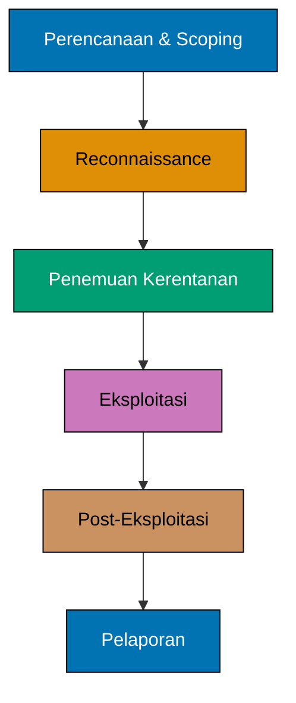

Keamanan ofensif adalah praktik proaktif untuk menguji dan menyerang sistem komputer, jaringan, dan aplikasi guna mengidentifikasi kerentanan sebelum pelaku jahat mengeksploitasinya. Berbeda dengan keamanan defensif yang fokus membangun penghalang pelindung, keamanan ofensif mensimulasikan serangan dunia nyata untuk menemukan dan memperbaiki kelemahan.

## Konsep Inti

Bayangkan keamanan ofensif seperti menyewa pencuri profesional untuk menguji keamanan rumah Anda. Para peretas etis ini menggunakan alat dan teknik yang sama dengan penjahat siber, tetapi tujuan mereka adalah memperkuat pertahanan, bukan menyebabkan kerusakan.

Prinsip fundamentalnya sederhana: **pertahanan terbaik adalah memahami cara berpikir dan beroperasi penyerang**. Dengan mengadopsi pola pikir penyerang, profesional keamanan dapat mengidentifikasi titik buta yang mungkin terlewatkan oleh langkah-langkah defensif tradisional.

## Metodologi Kunci

Keamanan ofensif mencakup beberapa pendekatan khusus:

### Penetration Testing

Penetration testing (pen testing) adalah penilaian terstruktur dengan batas waktu di mana profesional keamanan berusaha menembus sistem atau jaringan tertentu. Tim mengikuti ruang lingkup dan aturan keterlibatan yang telah ditentukan, mendokumentasikan kerentanan, dan memberikan panduan perbaikan.

### Operasi Red Team

Red teaming membawa keamanan ofensif lebih jauh dengan mensimulasikan serangan canggih dan persisten dalam periode yang lebih lama. Red team beroperasi secara terselubung, menguji bukan hanya kontrol teknis tetapi juga respons manusia, kemampuan deteksi insiden, dan proses keamanan organisasi.

Berbeda dengan penetration testing, operasi red team adalah simulasi adversarial di mana tim bertahan (blue team) tidak selalu tahu kapan atau bagaimana serangan akan terjadi.

### Riset Kerentanan

Peneliti keamanan menganalisis perangkat lunak, perangkat keras, dan protokol untuk menemukan kerentanan yang sebelumnya tidak diketahui (zero-days). Riset ini mendorong peningkatan keamanan di seluruh ekosistem teknologi, dari sistem operasi hingga aplikasi web.

### Social Engineering

Keamanan ofensif tidak terbatas pada serangan teknis. Social engineering menguji kerentanan manusia melalui teknik seperti kampanye phishing, pretexting, dan pelanggaran keamanan fisik. Penilaian ini mengungkap bagaimana orang merespons manipulasi dan penipuan.

## Keamanan Ofensif vs. Defensif

Hubungan antara keamanan ofensif dan defensif bersifat komplementer, bukan adversarial:

| Aspek          | Keamanan Ofensif                       | Keamanan Defensif                            |
| -------------- | -------------------------------------- | -------------------------------------------- |
| **Pendekatan** | Simulasi serangan proaktif             | Perlindungan dan pemantauan reaktif          |
| **Tujuan**     | Menemukan kerentanan sebelum penyerang | Mencegah, mendeteksi, dan merespons serangan |
| **Pola Pikir** | "Bagaimana cara membobol ini?"         | "Bagaimana cara melindungi ini?"             |
| **Alat**       | Framework eksploitasi, scanner         | Firewall, IDS/IPS, antivirus                 |
| **Hasil**      | Laporan kerentanan, proof-of-concepts  | Sistem yang diperkuat, respons insiden       |
| **Timeline**   | Keterlibatan dengan batas waktu        | Operasi berkelanjutan                        |


Program keamanan paling efektif menggabungkan kedua pendekatan. Keamanan ofensif mengidentifikasi kelemahan, sementara keamanan defensif mengimplementasikan dan memelihara perlindungan. Ini menciptakan loop umpan balik untuk perbaikan berkelanjutan.


## Peran dalam Keamanan Siber Modern

Keamanan ofensif memainkan beberapa peran kritis dalam program keamanan komprehensif:

### Validasi Kontrol Keamanan

Langkah keamanan teoritis terlihat bagus di atas kertas, tetapi keamanan ofensif membuktikan apakah mereka benar-benar bekerja dalam praktik. Pengujian memvalidasi bahwa firewall, sistem deteksi intrusi, dan kebijakan keamanan benar-benar mencegah serangan nyata.

### Kepatuhan dan Manajemen Risiko

Banyak kerangka kerja regulasi (PCI DSS, HIPAA, SOC 2) memerlukan penilaian keamanan rutin. Keamanan ofensif memberikan bukti due diligence dan membantu organisasi mengkuantifikasi risiko keamanan untuk pengambilan keputusan bisnis.

### Kesadaran Keamanan

Ketika karyawan mengalami serangan phishing simulasi atau upaya social engineering, keamanan menjadi nyata, bukan abstrak. Latihan ofensif menciptakan pengalaman belajar yang berkesan yang meningkatkan budaya keamanan.

### Perbaikan Berkelanjutan

Teknologi dan ancaman terus berkembang. Keterlibatan keamanan ofensif rutin memastikan pertahanan sejalan dengan teknik serangan yang muncul dan kerentanan yang baru ditemukan.

## Praktik dan Alat Umum

Profesional keamanan ofensif menggunakan toolkit beragam yang mencakup berbagai fase serangan:

### Reconnaissance dan Pengumpulan Informasi

Sebelum menyerang, profesional mengumpulkan intelijen tentang target:

- **Alat OSINT**: Maltego, theHarvester, Shodan untuk pengumpulan informasi pasif
- **Network scanning**: Nmap untuk port scanning dan enumerasi layanan
- **Reconnaissance web**: Gobuster, Dirb untuk penemuan direktori dan file

### Vulnerability Scanning dan Analisis

Alat otomatis mengidentifikasi kelemahan yang diketahui:

- **Network scanner**: Nessus, OpenVAS untuk kerentanan infrastruktur
- **Web scanner**: Burp Suite, OWASP ZAP untuk pengujian keamanan aplikasi
- **Analisis kode**: Alat analisis statis dan dinamis untuk kerentanan perangkat lunak

### Framework Eksploitasi

Profesional menggunakan framework canggih untuk mengeksploitasi kerentanan yang ditemukan:

- **Metasploit**: Framework eksploitasi komprehensif dengan ribuan eksploit
- **Cobalt Strike**: Alat komersial untuk operasi red team dan simulasi adversary
- **Empire/PowerShell Empire**: Framework post-exploitation untuk lingkungan Windows

### Post-Exploitation dan Lateral Movement

Setelah kompromi awal, penyerang memperluas akses mereka:

- **Privilege escalation**: Mengeksploitasi miskonfigurasi untuk mendapatkan akses administratif
- **Credential harvesting**: Alat seperti Mimikatz mengekstrak password dari memori
- **Mekanisme persistensi**: Memastikan akses berkelanjutan bahkan setelah sistem reboot

### Pelaporan dan Dokumentasi

Fase akhir mengubah temuan teknis menjadi intelijen bisnis yang dapat ditindaklanjuti:

- **Prioritas kerentanan**: Mengurutkan masalah berdasarkan tingkat keparahan dan dampak bisnis
- **Demonstrasi proof-of-concept**: Menunjukkan kepada stakeholder bagaimana serangan bekerja
- **Panduan remediasi**: Memberikan rekomendasi perbaikan yang spesifik dan praktis


Semua alat dan teknik keamanan ofensif harus digunakan secara legal dan etis. Akses tidak sah ke sistem komputer adalah ilegal di sebagian besar yurisdiksi. Selalu dapatkan izin tertulis eksplisit sebelum melakukan penilaian keamanan.


## Pertimbangan Etis

Keamanan ofensif beroperasi di wilayah yang kompleks secara moral. Keterampilan yang sama yang digunakan untuk melindungi organisasi dapat menyebabkan kerugian besar jika disalahgunakan. Pedoman etis sangat penting:

### Otorisasi Legal

Setiap keterlibatan keamanan ofensif memerlukan otorisasi eksplisit dan terdokumentasi dari pemilik sistem. Ini mencakup definisi ruang lingkup yang jelas, metode pengujian yang disetujui, dan kerangka waktu pengujian yang ditentukan.

### Responsible Disclosure

Ketika peneliti menemukan kerentanan, mereka mengikuti praktik responsible disclosure: memberi tahu vendor secara pribadi, memberikan waktu untuk patch, dan mengoordinasikan pengungkapan publik untuk meminimalkan risiko.

### Standar Profesional

Organisasi seperti EC-Council (Certified Ethical Hacker) dan Offensive Security (OSCP, OSCE) menetapkan standar profesional dan kode etik untuk praktisi keamanan ofensif.

## Jalur Pembelajaran

Membangun keahlian keamanan ofensif memerlukan pengetahuan yang beragam:

1. **Fundamental networking**: Memahami TCP/IP, routing, dan protokol jaringan
2. **Sistem operasi**: Pengetahuan mendalam tentang Windows, Linux, dan model keamanan mereka
3. **Programming dan scripting**: Python, PowerShell, Bash untuk otomatisasi dan alat kustom
4. **Teknologi web**: HTTP, HTML, JavaScript, dan kerentanan web umum
5. **Konsep keamanan**: Kriptografi, autentikasi, prinsip kontrol akses
6. **Teknik serangan**: Praktik langsung di lingkungan terkontrol seperti HackTheBox atau TryHackMe

## Rangkuman

Keamanan ofensif memberikan perspektif penyerang yang diperlukan untuk membangun pertahanan yang kuat. Dengan secara proaktif mengidentifikasi dan mengeksploitasi kerentanan, profesional keamanan membantu organisasi memperkuat postur keamanan mereka sebelum serangan nyata terjadi.

Bidang ini menggabungkan keahlian teknis, pemecahan masalah kreatif, dan tanggung jawab etis. Seiring ancaman siber semakin canggih, keamanan ofensif tetap penting untuk memahami dan mitigasi risiko keamanan modern.

Baik melalui penetration testing, operasi red team, atau riset kerentanan, profesional keamanan ofensif berfungsi sebagai garis pertahanan pertama dengan berpikir seperti penyerang tetapi bertindak sebagai pelindung.
