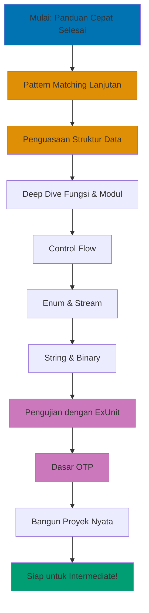

**Siap menguasai Elixir dan membangun aplikasi nyata?** Tutorial pemula komprehensif ini membawa Anda dari sintaks dasar hingga fundamental OTP, mencakup 0-60% dari yang Anda butuhkan untuk menulis kode Elixir berkualitas produksi.

## Prasyarat

**Wajib:**

- Sudah menyelesaikan [Pengaturan Awal](/belajar/swe/prog-lang/elixir/tutorials/initial-setup) dan [Panduan Cepat](/belajar/swe/prog-lang/elixir/tutorials/quick-start)
- Elixir 1.14+ terinstal
- Editor teks sudah dikonfigurasi
- Pengalaman dengan shell IEx

**Direkomendasikan:**

- Pengalaman pemrograman dasar (bahasa apapun)
- Pemahaman tentang fungsi dan struktur data
- Familiar dengan command line
- Git terinstal (untuk version control)

## Apa yang Akan Anda Pelajari

Tutorial ini menyediakan **cakupan komprehensif** fundamental Elixir:

**Bahasa Inti (Bagian 1-7):**

- Pattern matching lanjutan dengan guards dan pin operator
- Tur lengkap struktur data (list, tuple, map, keyword list, struct)
- Fungsi dan modul secara mendalam
- Penguasaan pipe operator
- Pola control flow
- Modul Enum dan Stream
- Manipulasi string dan binary

**Pengujian dan Kualitas (Bagian 8):**

- Framework pengujian ExUnit
- Pola Test-Driven Development
- Dokumentasi dengan ExDoc

**Dasar OTP (Bagian 9):**

- Proses dan message passing
- Pengenalan GenServer
- Error handling dengan supervisor

**Proyek Nyata (Bagian 10):**

- Aplikasi yang benar-benar berfungsi
- Best practices dan pola

## Jalur Pembelajaran



## Cakupan

Tutorial ini mencakup **0-60%** dari Elixir - semua yang Anda butuhkan untuk membangun aplikasi lengkap secara mandiri.

**Setelah menyelesaikan tutorial ini, Anda akan:**

- Menulis kode Elixir idiomatik mengikuti best practices
- Menggunakan semua struktur data utama secara efektif
- Membangun modul yang diuji dengan API yang jelas
- Memahami konkurensi dasar dengan proses
- Men-debug dan troubleshoot aplikasi Elixir
- Membaca dan memahami codebase Elixir dunia nyata

**Yang dicakup:**

- Sintaks dan semantik lengkap
- Semua struktur data built-in
- Pengujian dan dokumentasi
- Manajemen proses dasar
- Pola dan praktik dunia nyata

**Yang TIDAK dicakup (Intermediate/Advanced):**

- Framework web Phoenix
- Pola GenServer lanjutan
- Sistem terdistribusi
- Metaprogramming dan macro
- Optimisasi performa

## Bagian 1: Pattern Matching Lanjutan

### 1.1 Review Pattern Matching

Pattern matching adalah fitur paling powerful di Elixir. Mari kita pelajari lebih dalam dari Panduan Cepat.

```elixir
# Review dasar
{:ok, value} = {:ok, 42}
value  # => 42

# Pola bersarang
{:ok, {x, y}} = {:ok, {10, 20}}
x  # => 10
y  # => 20

# Pola list
[first, second | rest] = [1, 2, 3, 4, 5]
first   # => 1
second  # => 2
rest    # => [3, 4, 5]

# Pola map
%{name: name, age: age} = %{name: "Alice", age: 28, city: "Portland"}
name  # => "Alice"
age   # => 28
# Catatan: city diabaikan (tidak diekstrak)
```

### 1.2 Pin Operator (^)

Pin operator `^` menggunakan **nilai yang sudah ada** dari variabel alih-alih rebinding.

```elixir
# Tanpa pin - rebind x
x = 1
x = 2  # x sekarang 2
x  # => 2

# Dengan pin - match terhadap nilai yang ada
x = 1
^x = 1  # Berhasil! 1 cocok dengan 1
^x = 2  # ** (MatchError) - 2 tidak cocok dengan 1

# Use case nyata: menemukan nilai spesifik dalam list
x = 42
[^x, y, z] = [42, 10, 20]  # Berhasil! Elemen pertama cocok dengan 42
y  # => 10
z  # => 20

[^x, y, z] = [99, 10, 20]  # ** (MatchError) - 99 tidak cocok dengan 42

# Pin dalam function clause
defmodule Matcher do
  def check(value, ^value), do: "Sama!"
  def check(_value1, _value2), do: "Berbeda"
end

Matcher.check(5, 5)  # => "Sama!"
Matcher.check(5, 3)  # => "Berbeda"

# Pin dalam comprehension
numbers = [1, 2, 3, 4, 5]
target = 3
for ^target <- numbers, do: :found
# => [:found] - hanya cocok dimana nilainya 3
```

**Kapan menggunakan pin:**

- Matching terhadap variabel yang sudah ada
- Validasi nilai spesifik dalam pola
- Function clause dengan constraint spesifik

### 1.3 Guards

Guards menambahkan kondisi ke pattern matching. Mereka membuat function clause lebih spesifik.

**Guards dasar:**

```elixir
defmodule Number do
  def describe(n) when n < 0, do: "negatif"
  def describe(0), do: "nol"
  def describe(n) when n > 0, do: "positif"
end

Number.describe(-5)  # => "negatif"
Number.describe(0)   # => "nol"
Number.describe(10)  # => "positif"

# Multiple guards dengan `and`
def adult?(age) when is_integer(age) and age >= 18, do: true
def adult?(_), do: false

adult?(25)    # => true
adult?(15)    # => false
adult?("25")  # => false (bukan integer)

# Multiple guards dengan `or`
def vowel?(letter) when letter == "a" or letter == "e" or letter == "i" do
  true
end
def vowel?(_), do: false

vowel?("a")  # => true
vowel?("b")  # => false
```

**Yang diperbolehkan dalam guards:**

```elixir
# Pengecekan tipe
is_atom(x)
is_binary(x)
is_boolean(x)
is_float(x)
is_integer(x)
is_list(x)
is_map(x)
is_number(x)
is_tuple(x)

# Perbandingan
==, !=, ===, !==, <, >, <=, >=

# Operator boolean
and, or, not

# Aritmatika
+, -, *, /

# Lainnya
in, length, map_size, tuple_size
```

**Contoh guard kompleks:**

```elixir
defmodule Validator do
  # Validasi string mirip email
  def valid_email?(email) when is_binary(email) and byte_size(email) > 3 do
    String.contains?(email, "@")
  end
  def valid_email?(_), do: false

  # Cek apakah angka dalam rentang
  def in_range?(n, min, max) when is_number(n) and n >= min and n <= max do
    true
  end
  def in_range?(_, _, _), do: false

  # Validasi list tidak kosong
  def non_empty_list?(list) when is_list(list) and length(list) > 0 do
    true
  end
  def non_empty_list?(_), do: false
end

Validator.valid_email?("alice@example.com")  # => true
Validator.in_range?(5, 1, 10)                # => true
Validator.non_empty_list?([1, 2, 3])         # => true
```

### 1.4 Pattern Matching dalam Case dan Cond

**Ekspresi case:**

```elixir
# Case dengan pola
result = {:ok, %{name: "Alice", age: 28}}

message = case result do
  {:ok, %{name: name, age: age}} when age >= 18 ->
    "Pengguna dewasa: #{name}"

  {:ok, %{name: name}} ->
    "Pengguna: #{name}"

  {:error, reason} ->
    "Error: #{reason}"

  _ ->
    "Hasil tidak diketahui"
end

# Contoh nyata: penanganan respon HTTP
defmodule HTTPClient do
  def handle_response(response) do
    case response do
      {:ok, %{status: 200, body: body}} ->
        {:ok, body}

      {:ok, %{status: 404}} ->
        {:error, :not_found}

      {:ok, %{status: 500}} ->
        {:error, :server_error}

      {:error, reason} ->
        {:error, {:network_error, reason}}
    end
  end
end
```

**Ekspresi cond (multiple kondisi):**

```elixir
# Cond mengevaluasi kondisi dari atas ke bawah
defmodule Grade do
  def letter(score) do
    cond do
      score >= 90 -> "A"
      score >= 80 -> "B"
      score >= 70 -> "C"
      score >= 60 -> "D"
      true -> "F"  # Default case (selalu true)
    end
  end
end

Grade.letter(95)  # => "A"
Grade.letter(75)  # => "C"
Grade.letter(55)  # => "F"

# Cond dengan kondisi kompleks
defmodule Weather do
  def advice(temp, weather) do
    cond do
      temp > 30 and weather == :sunny ->
        "Panas dan cerah - tetap terhidrasi!"

      temp > 20 and weather == :rainy ->
        "Hujan hangat - bawa payung"

      temp < 10 ->
        "Dingin - pakai jaket"

      true ->
        "Cuaca menyenangkan - nikmati!"
    end
  end
end
```

### 1.5 Pattern Matching dalam Fungsi

**Multiple function clause:**

```elixir
defmodule Calculator do
  # Pattern match pada operasi dan argumen
  def calc(:add, a, b), do: a + b
  def calc(:subtract, a, b), do: a - b
  def calc(:multiply, a, b), do: a * b
  def calc(:divide, _a, 0), do: {:error, :division_by_zero}
  def calc(:divide, a, b), do: {:ok, a / b}
end

Calculator.calc(:add, 5, 3)      # => 8
Calculator.calc(:divide, 10, 0)  # => {:error, :division_by_zero}

# Proses struktur data berbeda
defmodule Formatter do
  def format({:user, name, age}) do
    "Pengguna: #{name} (#{age} tahun)"
  end

  def format({:product, name, price}) do
    "Produk: #{name} - $#{price}"
  end

  def format(data) when is_map(data) do
    "Map dengan #{map_size(data)} key"
  end

  def format(data) when is_list(data) do
    "List dengan #{length(data)} elemen"
  end
end

Formatter.format({:user, "Alice", 28})
# => "Pengguna: Alice (28 tahun)"

Formatter.format(%{a: 1, b: 2})
# => "Map dengan 2 key"
```

**Pola rekursif:**

```elixir
defmodule ListOps do
  # Sum dengan accumulator
  def sum(list), do: sum(list, 0)

  defp sum([], acc), do: acc
  defp sum([head | tail], acc) do
    sum(tail, acc + head)
  end

  # Flatten list bersarang
  def flatten([]), do: []
  def flatten([head | tail]) when is_list(head) do
    flatten(head) ++ flatten(tail)
  end
  def flatten([head | tail]) do
    [head | flatten(tail)]
  end

  # Cari elemen
  def find([], _target), do: nil
  def find([target | _tail], target), do: {:ok, target}
  def find([_head | tail], target), do: find(tail, target)
end

ListOps.sum([1, 2, 3, 4, 5])           # => 15
ListOps.flatten([[1, 2], [3, [4, 5]]]) # => [1, 2, 3, 4, 5]
ListOps.find([1, 2, 3, 4], 3)          # => {:ok, 3}
```

## Bagian 2: Deep Dive Struktur Data

### 2.1 List Secara Mendalam

List adalah linked list - pahami karakteristik performanya.

**Operasi list:**

```elixir
# Pembuatan
list = [1, 2, 3, 4, 5]

# Prepend (O(1) - cepat!)
[0 | list]  # => [0, 1, 2, 3, 4, 5]

# Append (O(n) - lambat!)
list ++ [6]  # => [1, 2, 3, 4, 5, 6]

# Concatenation
[1, 2] ++ [3, 4]  # => [1, 2, 3, 4]

# Subtraction
[1, 2, 3, 4] -- [2, 4]  # => [1, 3]

# Akses berdasarkan indeks (O(n) - lambat!)
Enum.at([1, 2, 3, 4], 2)  # => 3

# Head dan tail
hd([1, 2, 3])  # => 1
tl([1, 2, 3])  # => [2, 3]

# Cek keanggotaan (O(n))
2 in [1, 2, 3]  # => true

# Panjang (O(n))
length([1, 2, 3])  # => 3
```

**Kapan menggunakan list:**

- Membangun koleksi secara incremental (prepend)
- Memproses data secara berurutan (rekursi)
- Operasi mirip stack (push/pop dari depan)

**Kapan TIDAK menggunakan list:**

- Akses acak berdasarkan indeks (gunakan tuple atau map)
- Append yang sering (gunakan struktur lain)

**Penguasaan list comprehension:**

```elixir
# Comprehension dasar
for n <- 1..10, do: n * n
# => [1, 4, 9, 16, 25, 36, 49, 64, 81, 100]

# Multiple filter
for n <- 1..20,
    rem(n, 2) == 0,    # Hanya genap
    rem(n, 3) == 0,    # Hanya habis dibagi 3
    do: n
# => [6, 12, 18]

# Multiple generator
for x <- [1, 2, 3],
    y <- [:a, :b],
    do: {x, y}
# => [{1, :a}, {1, :b}, {2, :a}, {2, :b}, {3, :a}, {3, :b}]

# Pattern matching dalam generator
users = [
  %{name: "Alice", role: :admin},
  %{name: "Bob", role: :user},
  %{name: "Carol", role: :admin}
]

for %{name: name, role: :admin} <- users, do: name
# => ["Alice", "Carol"]

# Ke koleksi berbeda
for {k, v} <- %{a: 1, b: 2, c: 3}, into: %{}, do: {v, k}
# => %{1 => :a, 2 => :b, 3 => :c}

# Reduce comprehension
for n <- 1..5, reduce: 0 do
  sum -> sum + n
end
# => 15
```

### 2.2 Tuple

Tuple menyimpan koleksi fixed-size dengan akses cepat.

```elixir
# Pembuatan
tuple = {:ok, "Sukses", 42}

# Akses berdasarkan indeks (O(1) - cepat!)
elem(tuple, 0)  # => :ok
elem(tuple, 1)  # => "Sukses"
elem(tuple, 2)  # => 42

# Ukuran
tuple_size(tuple)  # => 3

# Update (membuat tuple baru)
put_elem(tuple, 1, "Diupdate")
# => {:ok, "Diupdate", 42}

# Pattern matching (penggunaan paling umum)
{:ok, message, code} = {:ok, "Sukses", 200}
message  # => "Sukses"
code     # => 200
```

**Pola tuple umum:**

```elixir
# Return value
def divide(a, b) when b != 0, do: {:ok, a / b}
def divide(_a, 0), do: {:error, :division_by_zero}

# Tagged tuple
{:user, "Alice", 28}
{:product, "Widget", 9.99}

# Koordinat
{10, 20}  # {x, y}
{10, 20, 30}  # {x, y, z}
```

**Kapan menggunakan tuple:**

- Koleksi fixed-size
- Return value dengan status
- Skenario pattern matching
- Akses indeks yang performance-critical

### 2.3 Map - Struktur Data Andalan

Map adalah key-value store dengan akses cepat.

**Membuat dan mengakses map:**

```elixir
# Dengan atom key
person = %{name: "Alice", age: 28, city: "Portland"}

# Akses
person[:name]   # => "Alice"
person.name     # => "Alice" (hanya bekerja dengan atom key)
person[:email]  # => nil

Map.get(person, :name)              # => "Alice"
Map.get(person, :email, "unknown")  # => "unknown" (default)

# Dengan string key
data = %{"name" => "Bob", "age" => 35}
data["name"]  # => "Bob"

# Mixed key (valid tapi tidak disarankan)
mixed = %{:atom_key => 1, "string_key" => 2}

# Dynamic key
key = :dynamic
%{key => "value"}  # => %{dynamic: "value"}
```

**Update map:**

```elixir
person = %{name: "Alice", age: 28}

# Update key yang ada
person = %{person | age: 29}
# => %{name: "Alice", age: 29}

# Tambah key baru (gunakan Map.put)
person = Map.put(person, :email, "alice@example.com")
# => %{name: "Alice", age: 29, email: "alice@example.com"}

# Update multiple key
person = %{person | name: "Alicia", age: 30}

# Merge map
defaults = %{role: "user", active: true}
person = Map.merge(defaults, person)

# Hapus key
person = Map.delete(person, :email)
```

**Map bersarang:**

```elixir
user = %{
  name: "Alice",
  contact: %{
    email: "alice@example.com",
    phone: "555-1234"
  },
  address: %{
    street: "123 Main St",
    city: "Portland"
  }
}

# Akses bersarang
user[:contact][:email]  # => "alice@example.com"
get_in(user, [:contact, :email])  # => "alice@example.com"

# Update bersarang
user = put_in(user, [:contact, :email], "newemail@example.com")
user = update_in(user, [:contact, :phone], &("1-" <> &1))

# Get dan update
{old_email, user} = pop_in(user, [:contact, :email])
```

**Fungsi map:**

```elixir
map = %{a: 1, b: 2, c: 3}

# Key dan value
Map.keys(map)    # => [:a, :b, :c]
Map.values(map)  # => [1, 2, 3]

# Cek key
Map.has_key?(map, :a)  # => true

# Transform value
Map.update!(map, :a, &(&1 * 10))  # => %{a: 10, b: 2, c: 3}

# Filter
Map.take(map, [:a, :c])  # => %{a: 1, c: 3}
Map.drop(map, [:b])      # => %{a: 1, c: 3}
```

**Kapan menggunakan map:**

- Data dinamis dengan field bernama
- Data mirip JSON
- Konfigurasi
- Lookup key cepat

### 2.4 Keyword List

Keyword list adalah list dari tuple `{key, value}` dengan atom key.

```elixir
# Pembuatan
opts = [size: 10, color: "red", border: true]
# Syntactic sugar untuk: [{:size, 10}, {:color, "red"}, {:border, true}]

# Akses
opts[:size]   # => 10
opts[:color]  # => "red"

Keyword.get(opts, :size)              # => 10
Keyword.get(opts, :missing, "default") # => "default"

# Update
opts = Keyword.put(opts, :size, 20)

# Duplicate key diperbolehkan!
opts = [size: 10, size: 20]  # Valid!
opts[:size]  # => 10 (occurrence pertama)

# Merge
Keyword.merge([a: 1, b: 2], [b: 3, c: 4])
# => [a: 1, b: 3, c: 4]
```

**Kapan menggunakan keyword list:**

- Opsi fungsi (use case paling umum)
- Urutan penting
- Duplicate key diperlukan

**Pola umum - opsi fungsi:**

```elixir
defmodule Database do
  def query(sql, opts \\ []) do
    timeout = Keyword.get(opts, :timeout, 5000)
    pool = Keyword.get(opts, :pool, :default)

    # Gunakan timeout dan pool...
    "Querying dengan timeout: #{timeout}, pool: #{pool}"
  end
end

Database.query("SELECT * FROM users")
# => "Querying dengan timeout: 5000, pool: default"

Database.query("SELECT * FROM users", timeout: 10000, pool: :replica)
# => "Querying dengan timeout: 10000, pool: replica"
```

### 2.5 Struct

Struct adalah map bernama dengan key terdefinisi dan jaminan compile-time.

**Mendefinisikan struct:**

```elixir
defmodule User do
  defstruct name: "", email: "", age: 0, role: :user

  # Dengan required key
  # defstruct [:name, :email, age: 0, role: :user]
end

# Buat struct
user = %User{name: "Alice", email: "alice@example.com", age: 28}
# => %User{name: "Alice", email: "alice@example.com", age: 28, role: :user}

# Akses (sama seperti map)
user.name   # => "Alice"
user[:age]  # => 28

# Update
user = %{user | age: 29}

# Pattern match
%User{name: name, age: age} = user
name  # => "Alice"
```

**Mengapa struct daripada map:**

```elixir
# Map memperbolehkan key apapun
person = %{name: "Alice", agee: 28}  # Typo! Tidak ada error

# Struct menegakkan key terdefinisi
user = %User{name: "Alice", agee: 28}
# ** (KeyError) key :agee not found in: %User{}

# Struct memiliki pengecekan compile-time
defmodule Service do
  def process(%User{} = user) do
    # Type-checked saat compile time
    "Memproses pengguna: #{user.name}"
  end
end
```

**Fungsi struct:**

```elixir
defmodule User do
  defstruct [:name, :email, age: 0]

  def new(name, email) do
    %User{name: name, email: email}
  end

  def adult?(%User{age: age}) when age >= 18, do: true
  def adult?(_), do: false

  def update_email(%User{} = user, new_email) do
    %{user | email: new_email}
  end
end

user = User.new("Alice", "alice@example.com")
User.adult?(user)  # => false (age default ke 0)

user = %{user | age: 28}
User.adult?(user)  # => true
```

**Kapan menggunakan struct:**

- Model domain (User, Product, Order, dll.)
- Data dengan field yang diketahui
- Type checking diperlukan
- Kontrak data yang jelas

### 2.6 Range

Range merepresentasikan urutan angka.

```elixir
# Pembuatan
range = 1..10
range = 1..10//2  # Step 2 (Elixir 1.12+)

# Cek keanggotaan
5 in 1..10   # => true
15 in 1..10  # => false

# Konversi ke list
Enum.to_list(1..5)  # => [1, 2, 3, 4, 5]

# Gunakan dalam comprehension
for n <- 1..10, do: n * n
# => [1, 4, 9, 16, 25, 36, 49, 64, 81, 100]

# Range descending
10..1  # Descending

# Character range
?a..?z  # => 97..122 (nilai ASCII)
```

### 2.7 Memilih Struktur Data yang Tepat

```elixir
# List - koleksi berurutan, prepending sering
shopping_cart = ["apel", "pisang", "jeruk"]

# Tuple - ukuran tetap, akses indeks cepat
coordinate = {10.5, 20.3}
result = {:ok, data}

# Map - key-value dinamis, lookup cepat
user = %{name: "Alice", email: "alice@example.com"}

# Keyword list - opsi fungsi, urutan penting
opts = [timeout: 5000, retry: 3]

# Struct - model domain, type safety
user = %User{name: "Alice", age: 28}

# Range - urutan angka
for page <- 1..10, do: fetch_page(page)
```

## Bagian 3: Penguasaan Fungsi dan Modul

### 3.1 Deep Dive Anonymous Function

**Capture operator (&):**

```elixir
# Long form
Enum.map([1, 2, 3], fn x -> x * 2 end)
# => [2, 4, 6]

# Short form dengan capture
Enum.map([1, 2, 3], &(&1 * 2))
# => [2, 4, 6]

# Capture fungsi yang ada
Enum.map(["hello", "world"], &String.upcase/1)
# => ["HELLO", "WORLD"]

# Multiple argumen
add = &(&1 + &2)
add.(5, 3)  # => 8

# Capture dengan ekspresi
multiply_by_10 = &(&1 * 10)
multiply_by_10.(5)  # => 50
```

**Closure:**

```elixir
# Fungsi menangkap outer scope
defmodule Counter do
  def create(initial) do
    fn -> initial end
  end

  def create_incrementer(start) do
    fn amount -> start + amount end
  end
end

get_ten = Counter.create(10)
get_ten.()  # => 10

inc_from_5 = Counter.create_incrementer(5)
inc_from_5.(3)  # => 8
inc_from_5.(10) # => 15

# Closure praktis
defmodule Filter do
  def greater_than(threshold) do
    fn value -> value > threshold end
  end
end

greater_than_10 = Filter.greater_than(10)
Enum.filter([5, 15, 8, 20, 12], greater_than_10)
# => [15, 20, 12]
```

### 3.2 Named Function Lanjutan

**Multiple clause dengan pattern matching:**

```elixir
defmodule FizzBuzz do
  def convert(n) when rem(n, 15) == 0, do: "FizzBuzz"
  def convert(n) when rem(n, 3) == 0, do: "Fizz"
  def convert(n) when rem(n, 5) == 0, do: "Buzz"
  def convert(n), do: n
end

Enum.map(1..15, &FizzBuzz.convert/1)
# => [1, 2, "Fizz", 4, "Buzz", "Fizz", 7, 8, "Fizz", "Buzz", 11, "Fizz", 13, 14, "FizzBuzz"]
```

**Default argument:**

```elixir
defmodule Greeter do
  def hello(name \\ "Dunia", punctuation \\ "!") do
    "Halo, #{name}#{punctuation}"
  end
end

Greeter.hello()                # => "Halo, Dunia!"
Greeter.hello("Alice")         # => "Halo, Alice!"
Greeter.hello("Bob", ".")      # => "Halo, Bob."
```

**Private function:**

```elixir
defmodule Calculator do
  def calculate(operation, a, b) do
    case operation do
      :add -> add(a, b)
      :multiply -> multiply(a, b)
      _ -> {:error, :unknown_operation}
    end
  end

  defp add(a, b), do: a + b
  defp multiply(a, b), do: a * b
end

Calculator.calculate(:add, 5, 3)  # => 8
Calculator.add(5, 3)  # ** (UndefinedFunctionError) - private!
```

**Function arity:**

```elixir
defmodule Math do
  # Arity berbeda adalah fungsi berbeda
  def add(a, b), do: a + b
  def add(a, b, c), do: a + b + c
end

# Referensi berdasarkan nama/arity
add_two = &Math.add/2
add_three = &Math.add/3

add_two.(5, 3)      # => 8
add_three.(5, 3, 2) # => 10
```

### 3.3 Organisasi Modul

**Module attribute:**

```elixir
defmodule Config do
  @default_timeout 5000
  @retry_count 3

  def timeout, do: @default_timeout
  def retries, do: @retry_count

  # Module attribute sebagai konstanta
  @max_connections 100

  def max_connections, do: @max_connections
end

Config.timeout()  # => 5000
```

**Nested module:**

```elixir
defmodule MyApp do
  defmodule User do
    defstruct [:name, :email]

    def new(name, email) do
      %User{name: name, email: email}
    end
  end

  defmodule Product do
    defstruct [:name, :price]

    def new(name, price) do
      %Product{name: name, price: price}
    end
  end
end

user = MyApp.User.new("Alice", "alice@example.com")
product = MyApp.Product.new("Widget", 9.99)

# Alias untuk kemudahan
alias MyApp.User
user = User.new("Bob", "bob@example.com")
```

**Import, alias, dan require:**

```elixir
defmodule Example do
  # Alias - perpendek nama modul
  alias MyApp.User
  alias MyApp.Product, as: Prod

  # Import - bawa fungsi ke scope
  import Enum, only: [map: 2, filter: 2]

  # Require - diperlukan untuk macro
  require Logger

  def process_users(users) do
    # Bisa gunakan User alih-alih MyApp.User
    users
    |> map(&User.display/1)
    |> filter(&User.active?/1)
  end
end
```

### 3.4 Penguasaan Pipe Operator

**Piping lanjutan:**

```elixir
# Pipe ke argumen non-pertama (gunakan anonymous function)
"hello"
|> String.upcase()
|> String.duplicate(3)
# => "HELLOHELLOHELLO"

# Ketika Anda perlu argumen non-pertama
data
|> process()
|> then(&save_to_db(:users, &1))  # Pipe ke arg kedua

# Pipe dengan pattern matching
{:ok, result} =
  data
  |> validate()
  |> transform()

# Debugging dalam pipeline dengan IO.inspect
[1, 2, 3, 4, 5]
|> Enum.map(&(&1 * 2))
|> IO.inspect(label: "Setelah map")
|> Enum.filter(&(&1 > 5))
|> IO.inspect(label: "Setelah filter")
|> Enum.sum()
```

**Pipeline dunia nyata:**

```elixir
defmodule DataProcessor do
  def process_csv(file_path) do
    file_path
    |> File.read!()
    |> String.split("\n")
    |> Enum.reject(&(&1 == ""))
    |> Enum.map(&String.split(&1, ","))
    |> Enum.map(&parse_row/1)
    |> Enum.filter(&valid_row?/1)
    |> Enum.map(&transform_row/1)
    |> save_to_database()
  end

  defp parse_row([name, age, city]) do
    %{name: name, age: String.to_integer(age), city: city}
  end

  defp valid_row?(%{age: age}), do: age >= 18

  defp transform_row(row) do
    Map.put(row, :status, :active)
  end

  defp save_to_database(rows) do
    # Simpan rows...
    {:ok, length(rows)}
  end
end
```

## Bagian 4: Control Flow

### 4.1 If dan Unless

```elixir
# If dasar
if true do
  "Ya"
else
  "Tidak"
end
# => "Ya"

# If satu baris
if true, do: "Ya", else: "Tidak"

# Unless (kebalikan if)
unless false do
  "Dieksekusi"
end
# => "Dieksekusi"

# If dengan pattern matching
result = {:ok, 42}
if {:ok, value} = result, do: value, else: nil
# => 42
```

**Kapan menggunakan if/unless:**

- Keputusan binary sederhana
- Kondisi mirip guard
- Hindari untuk logika kompleks (gunakan case/cond)

### 4.2 Case - Pattern Matching

```elixir
# Case dasar
result = {:ok, "data"}

case result do
  {:ok, data} -> "Sukses: #{data}"
  {:error, reason} -> "Error: #{reason}"
  _ -> "Tidak diketahui"
end

# Case dengan guard
value = 15

case value do
  n when n < 0 -> "Negatif"
  0 -> "Nol"
  n when n < 10 -> "Positif kecil"
  n when n < 100 -> "Positif sedang"
  _ -> "Positif besar"
end
# => "Positif sedang"

# Case bersarang
case File.read("data.txt") do
  {:ok, content} ->
    case Jason.decode(content) do
      {:ok, data} -> process(data)
      {:error, _} -> {:error, :invalid_json}
    end

  {:error, reason} ->
    {:error, {:file_error, reason}}
end
```

### 4.3 Cond - Multiple Kondisi

```elixir
# Cond untuk multiple kondisi
defmodule Weather do
  def advice(temp, humidity) do
    cond do
      temp > 35 -> "Sangat panas - tetap di dalam"
      temp > 30 and humidity > 80 -> "Panas dan lembab - minum air"
      temp > 25 -> "Hangat dan menyenangkan"
      temp > 15 -> "Sejuk - jaket tipis"
      temp > 5 -> "Dingin - pakai jaket"
      true -> "Sangat dingin - berlapis-lapis"
    end
  end
end
```

### 4.4 With - Happy Path Pipeline

```elixir
# With untuk skenario happy path
defmodule UserService do
  def create_user(params) do
    with {:ok, validated} <- validate(params),
         {:ok, user} <- insert_user(validated),
         {:ok, email_sent} <- send_welcome_email(user) do
      {:ok, user}
    else
      {:error, :validation_failed} ->
        {:error, "Data pengguna tidak valid"}

      {:error, :database_error} ->
        {:error, "Tidak bisa menyimpan pengguna"}

      {:error, :email_failed} ->
        {:error, "Pengguna dibuat tapi email gagal"}
    end
  end

  defp validate(%{name: name, email: email}) when byte_size(name) > 0 do
    if String.contains?(email, "@") do
      {:ok, %{name: name, email: email}}
    else
      {:error, :validation_failed}
    end
  end
  defp validate(_), do: {:error, :validation_failed}

  defp insert_user(data) do
    # Simulasi database insert
    {:ok, Map.put(data, :id, :rand.uniform(1000))}
  end

  defp send_welcome_email(user) do
    # Simulasi pengiriman email
    {:ok, true}
  end
end

UserService.create_user(%{name: "Alice", email: "alice@example.com"})
# => {:ok, %{name: "Alice", email: "alice@example.com", id: 123}}
```

## Bagian 5: Enum dan Stream

### 5.1 Modul Enum - Operasi Koleksi

**Mapping dan filtering:**

```elixir
# Map
Enum.map([1, 2, 3], &(&1 * 2))
# => [2, 4, 6]

# Filter
Enum.filter([1, 2, 3, 4, 5], &rem(&1, 2) == 0)
# => [2, 4]

# Reject (kebalikan filter)
Enum.reject([1, 2, 3, 4, 5], &rem(&1, 2) == 0)
# => [1, 3, 5]

# Map dan filter digabung
[1, 2, 3, 4, 5]
|> Enum.filter(&rem(&1, 2) == 0)
|> Enum.map(&(&1 * &1))
# => [4, 16]
```

**Reducing:**

```elixir
# Sum
Enum.sum([1, 2, 3, 4, 5])  # => 15

# Custom reduce
Enum.reduce([1, 2, 3, 4], 0, fn x, acc -> x + acc end)
# => 10

# Reduce ke map
["apel", "pisang", "aprikot"]
|> Enum.reduce(%{}, fn fruit, acc ->
  first_letter = String.first(fruit)
  Map.update(acc, first_letter, [fruit], &[fruit | &1])
end)
# => %{"a" => ["aprikot", "apel"], "p" => ["pisang"]}
```

**Sorting:**

```elixir
# Sort sederhana
Enum.sort([3, 1, 4, 1, 5, 9])
# => [1, 1, 3, 4, 5, 9]

# Sort descending
Enum.sort([3, 1, 4], :desc)
# => [4, 3, 1]

# Sort dengan fungsi custom
users = [
  %{name: "Bob", age: 35},
  %{name: "Alice", age: 28},
  %{name: "Carol", age: 42}
]

Enum.sort_by(users, & &1.age)
# => [%{name: "Alice", age: 28}, %{name: "Bob", age: 35}, %{name: "Carol", age: 42}]
```

**Finding:**

```elixir
# Cari yang pertama cocok
Enum.find([1, 2, 3, 4, 5], &(&1 > 3))
# => 4

# Find dengan default
Enum.find([1, 2, 3], &(&1 > 10), :not_found)
# => :not_found

# Di indeks
Enum.at([1, 2, 3, 4], 2)
# => 3

# Take/drop
Enum.take([1, 2, 3, 4, 5], 3)  # => [1, 2, 3]
Enum.drop([1, 2, 3, 4, 5], 2)  # => [3, 4, 5]
```

**Grouping dan splitting:**

```elixir
# Group by
users = [
  %{name: "Alice", city: "Portland"},
  %{name: "Bob", city: "Seattle"},
  %{name: "Carol", city: "Portland"}
]

Enum.group_by(users, & &1.city)
# => %{
#   "Portland" => [%{name: "Alice", city: "Portland"}, %{name: "Carol", city: "Portland"}],
#   "Seattle" => [%{name: "Bob", city: "Seattle"}]
# }

# Chunk
Enum.chunk_every([1, 2, 3, 4, 5, 6], 2)
# => [[1, 2], [3, 4], [5, 6]]

# Split
Enum.split([1, 2, 3, 4, 5], 3)
# => {[1, 2, 3], [4, 5]}
```

### 5.2 Stream - Lazy Enumeration

Stream menunda komputasi hingga diperlukan - bagus untuk dataset besar.

```elixir
# Eager (Enum) - proses segera
[1, 2, 3]
|> Enum.map(&(&1 * 2))
|> Enum.filter(&(&1 > 3))
# => [4, 6]
# Membuat list intermediate [2, 4, 6] lalu filter

# Lazy (Stream) - tanpa list intermediate
[1, 2, 3]
|> Stream.map(&(&1 * 2))
|> Stream.filter(&(&1 > 3))
|> Enum.to_list()
# => [4, 6]
# Proses setiap elemen melalui seluruh pipeline

# Stream infinite
Stream.iterate(0, &(&1 + 1))
|> Stream.take(10)
|> Enum.to_list()
# => [0, 1, 2, 3, 4, 5, 6, 7, 8, 9]

# Cycle tanpa batas
Stream.cycle([:a, :b, :c])
|> Stream.take(7)
|> Enum.to_list()
# => [:a, :b, :c, :a, :b, :c, :a]

# Praktis: proses file besar
File.stream!("large_file.csv")
|> Stream.map(&String.trim/1)
|> Stream.reject(&(&1 == ""))
|> Stream.map(&String.split(&1, ","))
|> Enum.take(100)  # Hanya proses 100 baris pertama
```

**Kapan menggunakan Stream:**

- Koleksi besar atau infinite
- Multiple transformasi (hindari list intermediate)
- Pipeline performance-critical
- Memproses file baris demi baris

## Bagian 6: String dan Binary

### 6.1 String Dasar

```elixir
# Pembuatan
str = "Halo, Dunia!"

# Concatenation
"Halo, " <> "Dunia!"  # => "Halo, Dunia!"

# Interpolation
name = "Alice"
"Halo, #{name}!"  # => "Halo, Alice!"

# Panjang
String.length("Halo")  # => 4

# Konversi case
String.upcase("halo")    # => "HALO"
String.downcase("HALO")  # => "halo"
String.capitalize("halo dunia")  # => "Halo dunia"

# Trimming
String.trim("  halo  ")  # => "halo"
String.trim_leading("  halo")  # => "halo"
String.trim_trailing("halo  ")  # => "halo"
```

### 6.2 Operasi String

```elixir
# Splitting
String.split("a,b,c", ",")  # => ["a", "b", "c"]
String.split("halo dunia")  # => ["halo", "dunia"]

# Joining
Enum.join(["a", "b", "c"], ",")  # => "a,b,c"

# Replace
String.replace("halo dunia", "dunia", "Elixir")
# => "halo Elixir"

# Contains
String.contains?("halo dunia", "dunia")  # => true
String.starts_with?("halo", "ha")  # => true
String.ends_with?("dunia", "ia")  # => true

# Slicing
String.slice("halo", 0..2)  # => "hal"
String.slice("halo", 1, 3)  # => "alo"

# Reverse
String.reverse("halo")  # => "olah"
```

### 6.3 Pattern Matching dengan String

```elixir
# Match awal
"Halo " <> rest = "Halo Dunia"
rest  # => "Dunia"

# Binary pattern matching (lanjutan)
<<head, rest::binary>> = "Halo"
head  # => 72 (ASCII 'H')
rest  # => "alo"

# Ekstrak karakter pertama
String.first("Halo")  # => "H"
String.last("Halo")   # => "o"
```

## Bagian 7: Pola dan Idiom Umum

### 7.1 Pola Rekursi

**Pola accumulator:**

```elixir
defmodule Math do
  # Fungsi publik
  def factorial(n) when n >= 0, do: factorial(n, 1)

  # Fungsi rekursif private dengan accumulator
  defp factorial(0, acc), do: acc
  defp factorial(n, acc) do
    factorial(n - 1, n * acc)
  end
end

Math.factorial(5)  # => 120
```

**Pemrosesan list:**

```elixir
defmodule ListProcessor do
  # Map dengan accumulator
  def my_map(list, fun), do: my_map(list, fun, [])

  defp my_map([], _fun, acc), do: Enum.reverse(acc)
  defp my_map([head | tail], fun, acc) do
    my_map(tail, fun, [fun.(head) | acc])
  end
end

ListProcessor.my_map([1, 2, 3], &(&1 * 2))
# => [2, 4, 6]
```

### 7.2 Pola Error Handling

**Tagged tuple:**

```elixir
defmodule FileHandler do
  def read_and_parse(path) do
    with {:ok, content} <- File.read(path),
         {:ok, data} <- Jason.decode(content) do
      {:ok, data}
    end
  end
end

# Caller menangani error
case FileHandler.read_and_parse("data.json") do
  {:ok, data} -> process(data)
  {:error, _} -> handle_error()
end
```

**Exception untuk kasus benar-benar exceptional:**

```elixir
defmodule BankAccount do
  # Operasi normal - tagged tuple
  def withdraw(balance, amount) when amount <= balance do
    {:ok, balance - amount}
  end
  def withdraw(_balance, _amount), do: {:error, :insufficient_funds}

  # Kasus exceptional - raise
  def withdraw!(balance, amount) when amount <= balance do
    balance - amount
  end
  def withdraw!(_balance, _amount) do
    raise "Dana tidak mencukupi!"
  end
end
```

### 7.3 Membangun Module API

```elixir
defmodule ShoppingCart do
  @moduledoc """
  Implementasi shopping cart dengan item dan total.
  """

  defstruct items: [], total: 0.0

  @doc """
  Membuat shopping cart kosong baru.

  ## Contoh

      iex> ShoppingCart.new()
      %ShoppingCart{items: [], total: 0.0}
  """
  def new, do: %ShoppingCart{}

  @doc """
  Menambah item ke cart.
  """
  def add_item(%ShoppingCart{items: items, total: total}, item, price) do
    %ShoppingCart{
      items: [item | items],
      total: total + price
    }
  end

  @doc """
  Mengembalikan total saat ini.
  """
  def get_total(%ShoppingCart{total: total}), do: total

  @doc """
  Mendaftar semua item dalam cart.
  """
  def list_items(%ShoppingCart{items: items}), do: Enum.reverse(items)
end
```

## Bagian 8: Pengujian dengan ExUnit

### 8.1 Pengujian Dasar

```elixir
# test/calculator_test.exs
defmodule CalculatorTest do
  use ExUnit.Case

  test "menambahkan dua angka" do
    assert Calculator.add(2, 3) == 5
  end

  test "mengurangkan dua angka" do
    assert Calculator.subtract(5, 3) == 2
  end

  test "menangani pembagian dengan nol" do
    assert Calculator.divide(10, 0) == {:error, :division_by_zero}
  end
end
```

Jalankan test:

```bash
mix test
```

### 8.2 Setup dan Context

```elixir
defmodule UserServiceTest do
  use ExUnit.Case

  # Jalankan sebelum setiap test
  setup do
    user = %User{name: "Test User", email: "test@example.com"}
    {:ok, user: user}
  end

  test "validasi email user", %{user: user} do
    assert UserService.valid_email?(user)
  end

  test "format tampilan user", %{user: user} do
    assert UserService.display(user) == "Test User <test@example.com>"
  end
end
```

### 8.3 Assertion

```elixir
# Equality
assert 1 + 1 == 2
refute 1 + 1 == 3

# Pattern matching
assert {:ok, value} = some_function()

# Exception
assert_raise ArithmeticError, fn ->
  1 / 0
end

# Close enough (float)
assert_in_delta 0.1 + 0.2, 0.3, 0.0001
```

## Bagian 9: Dasar OTP - Proses

### 9.1 Spawning Proses

```elixir
# Spawn sebuah proses
pid = spawn(fn -> IO.puts("Halo dari proses!") end)

# Kirim pesan
send(pid, {:hello, "Dunia"})

# Terima pesan
receive do
  {:hello, msg} -> IO.puts("Diterima: #{msg}")
after
  1000 -> IO.puts("Timeout!")
end
```

### 9.2 Komunikasi Proses

```elixir
defmodule Messenger do
  def listen do
    receive do
      {:say, msg} ->
        IO.puts("Pesan: #{msg}")
        listen()  # Panggilan rekursif untuk terus mendengarkan

      :stop ->
        IO.puts("Berhenti")
    end
  end
end

# Mulai listener
pid = spawn(&Messenger.listen/0)

# Kirim pesan
send(pid, {:say, "Halo"})
send(pid, {:say, "Dunia"})
send(pid, :stop)
```

### 9.3 Pengenalan GenServer

GenServer menyediakan pola client-server standar.

```elixir
defmodule Counter do
  use GenServer

  # Client API
  def start_link(initial_value) do
    GenServer.start_link(__MODULE__, initial_value, name: __MODULE__)
  end

  def increment do
    GenServer.call(__MODULE__, :increment)
  end

  def get_value do
    GenServer.call(__MODULE__, :get_value)
  end

  # Server Callback
  def init(initial_value) do
    {:ok, initial_value}
  end

  def handle_call(:increment, _from, state) do
    {:reply, state + 1, state + 1}
  end

  def handle_call(:get_value, _from, state) do
    {:reply, state, state}
  end
end

# Penggunaan
{:ok, _pid} = Counter.start_link(0)
Counter.increment()  # => 1
Counter.increment()  # => 2
Counter.get_value()  # => 2
```

## Bagian 10: Proyek Hands-On

### Proyek 1: Pengelola Todo List

```elixir
defmodule TodoList do
  defstruct items: [], next_id: 1

  def new, do: %TodoList{}

  def add_item(%TodoList{items: items, next_id: id}, description) do
    item = %{id: id, description: description, done: false}
    %TodoList{
      items: [item | items],
      next_id: id + 1
    }
  end

  def mark_done(%TodoList{items: items} = list, id) do
    updated_items = Enum.map(items, fn item ->
      if item.id == id do
        %{item | done: true}
      else
        item
      end
    end)

    %{list | items: updated_items}
  end

  def list_pending(%TodoList{items: items}) do
    items
    |> Enum.reject(& &1.done)
    |> Enum.reverse()
  end

  def list_completed(%TodoList{items: items}) do
    items
    |> Enum.filter(& &1.done)
    |> Enum.reverse()
  end
end

# Penggunaan
list = TodoList.new()
list = TodoList.add_item(list, "Beli bahan makanan")
list = TodoList.add_item(list, "Tulis kode")
list = TodoList.mark_done(list, 1)
TodoList.list_pending(list)
# => [%{id: 2, description: "Tulis kode", done: false}]
```

### Proyek 2: CSV Parser

```elixir
defmodule CSVParser do
  def parse(file_path) do
    file_path
    |> File.stream!()
    |> Stream.map(&String.trim/1)
    |> Stream.reject(&(&1 == ""))
    |> Enum.map(&parse_line/1)
    |> to_maps()
  end

  defp parse_line(line) do
    line
    |> String.split(",")
    |> Enum.map(&String.trim/1)
  end

  defp to_maps([headers | rows]) do
    Enum.map(rows, fn row ->
      headers
      |> Enum.zip(row)
      |> Map.new()
    end)
  end
end

# Penggunaan dengan data.csv:
# name,age,city
# Alice,28,Portland
# Bob,35,Seattle

CSVParser.parse("data.csv")
# => [
#   %{"name" => "Alice", "age" => "28", "city" => "Portland"},
#   %{"name" => "Bob", "age" => "35", "city" => "Seattle"}
# ]
```

### Proyek 3: Bank Account dengan GenServer

```elixir
defmodule BankAccount do
  use GenServer

  # Client API
  def start_link(initial_balance) do
    GenServer.start_link(__MODULE__, initial_balance)
  end

  def deposit(pid, amount) when amount > 0 do
    GenServer.call(pid, {:deposit, amount})
  end

  def withdraw(pid, amount) when amount > 0 do
    GenServer.call(pid, {:withdraw, amount})
  end

  def balance(pid) do
    GenServer.call(pid, :balance)
  end

  def transaction_history(pid) do
    GenServer.call(pid, :history)
  end

  # Server Callback
  def init(initial_balance) do
    state = %{
      balance: initial_balance,
      transactions: []
    }
    {:ok, state}
  end

  def handle_call({:deposit, amount}, _from, state) do
    new_balance = state.balance + amount
    transaction = {:deposit, amount, DateTime.utc_now()}

    new_state = %{
      balance: new_balance,
      transactions: [transaction | state.transactions]
    }

    {:reply, {:ok, new_balance}, new_state}
  end

  def handle_call({:withdraw, amount}, _from, state) do
    if amount <= state.balance do
      new_balance = state.balance - amount
      transaction = {:withdraw, amount, DateTime.utc_now()}

      new_state = %{
        balance: new_balance,
        transactions: [transaction | state.transactions]
      }

      {:reply, {:ok, new_balance}, new_state}
    else
      {:reply, {:error, :insufficient_funds}, state}
    end
  end

  def handle_call(:balance, _from, state) do
    {:reply, state.balance, state}
  end

  def handle_call(:history, _from, state) do
    {:reply, Enum.reverse(state.transactions), state}
  end
end

# Penggunaan
{:ok, account} = BankAccount.start_link(1000.0)
BankAccount.deposit(account, 500.0)    # => {:ok, 1500.0}
BankAccount.withdraw(account, 200.0)   # => {:ok, 1300.0}
BankAccount.balance(account)           # => 1300.0
BankAccount.transaction_history(account)
# => [{:deposit, 500.0, ~U[...]}, {:withdraw, 200.0, ~U[...]}]
```

## Bagian 11: Protocol dan Behaviour

### 11.1 Protocol - Polimorfisme di Elixir

Protocol memungkinkan Anda mendefinisikan fungsionalitas yang dapat diimplementasikan untuk tipe data berbeda.

**Mendefinisikan protocol:**

```elixir
defprotocol Drawable do
  @doc "Menggambar bentuk yang diberikan"
  def draw(shape)
end

# Implementasi untuk tipe berbeda
defimpl Drawable, for: Circle do
  def draw(%Circle{radius: radius}) do
    "Menggambar lingkaran dengan radius #{radius}"
  end
end

defimpl Drawable, for: Rectangle do
  def draw(%Rectangle{width: width, height: height}) do
    "Menggambar persegi panjang #{width}x#{height}"
  end
end

# Penggunaan
defmodule Circle do
  defstruct [:radius]
end

defmodule Rectangle do
  defstruct [:width, :height]
end

circle = %Circle{radius: 5}
rectangle = %Rectangle{width: 10, height: 20}

Drawable.draw(circle)      # => "Menggambar lingkaran dengan radius 5"
Drawable.draw(rectangle)   # => "Menggambar persegi panjang 10x20"
```

**Protocol built-in:**

```elixir
# String.Chars - implementasi to_string/1
defimpl String.Chars, for: User do
  def to_string(%User{name: name, email: email}) do
    "#{name} <#{email}>"
  end
end

user = %User{name: "Alice", email: "alice@example.com"}
to_string(user)  # => "Alice <alice@example.com>"
"Pengguna: #{user}"  # => "Pengguna: Alice <alice@example.com>"

# Inspect - implementasi inspect/2 (untuk debugging)
defimpl Inspect, for: User do
  def inspect(%User{name: name}, _opts) do
    "#User<#{name}>"
  end
end

user  # => #User<Alice> (di IEx)

# Enumerable - membuat tipe Anda bekerja dengan Enum
defmodule MyRange do
  defstruct [:from, :to]
end

defimpl Enumerable, for: MyRange do
  def count(%MyRange{from: from, to: to}) do
    {:ok, to - from + 1}
  end

  def member?(%MyRange{from: from, to: to}, value) do
    {:ok, value >= from and value <= to}
  end

  def reduce(%MyRange{from: from, to: to}, acc, fun) do
    Enum.to_list(from..to)
    |> Enumerable.List.reduce(acc, fun)
  end

  def slice(_range), do: {:error, __MODULE__}
end

range = %MyRange{from: 1, to: 5}
Enum.to_list(range)  # => [1, 2, 3, 4, 5]
Enum.sum(range)      # => 15
3 in range           # => true
```

**Contoh protocol dunia nyata:**

```elixir
defprotocol Serializable do
  @doc "Serialisasi data ke format JSON-compatible"
  def serialize(data)
end

defimpl Serializable, for: User do
  def serialize(%User{name: name, email: email, age: age}) do
    %{
      type: "user",
      data: %{
        name: name,
        email: email,
        age: age
      }
    }
  end
end

defimpl Serializable, for: Product do
  def serialize(%Product{name: name, price: price}) do
    %{
      type: "product",
      data: %{
        name: name,
        price: price
      }
    }
  end
end

# Gunakan dengan Jason untuk encoding JSON
user = %User{name: "Alice", email: "alice@example.com", age: 28}
user
|> Serializable.serialize()
|> Jason.encode!()
# => "{\"type\":\"user\",\"data\":{\"name\":\"Alice\",\"email\":\"alice@example.com\",\"age\":28}}"
```

### 11.2 Behaviour - Mendefinisikan Kontrak

Behaviour mendefinisikan kontrak yang harus diimplementasikan modul.

**Mendefinisikan behaviour:**

```elixir
defmodule Parser do
  @callback parse(String.t()) :: {:ok, term()} | {:error, String.t()}
  @callback format(term()) :: String.t()
end

# Implementasi behaviour
defmodule JSONParser do
  @behaviour Parser

  def parse(json_string) do
    case Jason.decode(json_string) do
      {:ok, data} -> {:ok, data}
      {:error, _} -> {:error, "JSON tidak valid"}
    end
  end

  def format(data) do
    Jason.encode!(data)
  end
end

defmodule CSVParser do
  @behaviour Parser

  def parse(csv_string) do
    rows = String.split(csv_string, "\n")
    {:ok, rows}
  end

  def format(rows) when is_list(rows) do
    Enum.join(rows, "\n")
  end
end

# Gunakan parser secara bergantian
defmodule DataProcessor do
  def process(data, parser_module) do
    with {:ok, parsed} <- parser_module.parse(data) do
      # Proses data yang di-parse...
      formatted = parser_module.format(parsed)
      {:ok, formatted}
    end
  end
end
```

**GenServer adalah behaviour:**

```elixir
# Ketika Anda use GenServer, Anda mengimplementasi behaviournya
defmodule MyServer do
  use GenServer

  # Callback yang diperlukan
  def init(args), do: {:ok, args}
  def handle_call(_msg, _from, state), do: {:reply, :ok, state}
  def handle_cast(_msg, state), do: {:noreply, state}
end
```

### 11.3 Protocol vs Behaviour

**Kapan menggunakan protocol:**

- Operasi polimorfis pada tipe berbeda
- Memperluas fungsionalitas untuk tipe yang ada
- Implementasi spesifik tipe

**Kapan menggunakan behaviour:**

- Mendefinisikan kontrak modul
- Memastikan modul mengimplementasi callback yang diperlukan
- Desain framework/library

## Bagian 12: File I/O dan Interaksi Sistem

### 12.1 Membaca dan Menulis File

**Membaca file:**

```elixir
# Baca seluruh file
{:ok, content} = File.read("data.txt")

# Baca dengan error handling
case File.read("data.txt") do
  {:ok, content} -> IO.puts(content)
  {:error, reason} -> IO.puts("Error: #{reason}")
end

# Read! - raise jika error
content = File.read!("data.txt")

# Baca baris demi baris (efisien untuk file besar)
File.stream!("large_file.txt")
|> Stream.map(&String.trim/1)
|> Enum.each(&IO.puts/1)
```

**Menulis file:**

```elixir
# Tulis seluruh konten
File.write("output.txt", "Halo, Dunia!")

# Write! - raise jika error
File.write!("output.txt", "Halo, Dunia!")

# Append ke file
File.write("log.txt", "Entry baru\n", [:append])

# Tulis list baris
lines = ["Baris 1", "Baris 2", "Baris 3"]
content = Enum.join(lines, "\n")
File.write("output.txt", content)
```

**Operasi file:**

```elixir
# Cek apakah file ada
File.exists?("data.txt")  # => true/false

# Dapatkan info file
{:ok, info} = File.stat("data.txt")
info.size  # Ukuran file dalam byte

# Copy file
File.cp("source.txt", "destination.txt")

# Hapus file
File.rm("temp.txt")

# Buat direktori
File.mkdir("new_folder")

# List direktori
{:ok, files} = File.ls(".")
files  # => ["file1.txt", "file2.txt", ...]

# Baca direktori secara rekursif
Path.wildcard("**/*.ex")
# => ["lib/app.ex", "lib/utils.ex", "test/app_test.exs", ...]
```

### 12.2 Operasi Path

```elixir
# Join path
Path.join(["home", "user", "documents", "file.txt"])
# => "home/user/documents/file.txt"

# Dapatkan nama direktori
Path.dirname("/home/user/file.txt")  # => "/home/user"

# Dapatkan nama file
Path.basename("/home/user/file.txt")  # => "file.txt"

# Dapatkan ekstensi
Path.extname("file.txt")  # => ".txt"

# Expand relative path
Path.expand("../file.txt")  # => "/full/path/to/file.txt"

# Cek apakah absolute
Path.absname?("/home/user")  # => true
Path.absname?("relative")    # => false
```

### 12.3 Perintah Sistem

```elixir
# Jalankan perintah sistem
System.cmd("ls", ["-la"])
# => {"file listing...", 0}

# Dapatkan variabel lingkungan
System.get_env("HOME")  # => "/home/user"

# Set variabel lingkungan
System.put_env("MY_VAR", "value")

# Dapatkan current working directory
File.cwd!()  # => "/current/directory"

# Ganti direktori
File.cd("new_directory")
```

## Bagian 13: Comprehension Lanjutan

### 13.1 Comprehension Kompleks

**Comprehension bersarang:**

```elixir
# Generate semua koordinat dalam grid
for x <- 1..3, y <- 1..3 do
  {x, y}
end
# => [{1, 1}, {1, 2}, {1, 3}, {2, 1}, {2, 2}, {2, 3}, {3, 1}, {3, 2}, {3, 3}]

# Dengan filter
for x <- 1..5,
    y <- 1..5,
    x + y == 6,
    do: {x, y}
# => [{1, 5}, {2, 4}, {3, 3}, {4, 2}, {5, 1}]

# Multiple generator dengan pattern matching
users = [
  %{name: "Alice", posts: [%{title: "Post 1"}, %{title: "Post 2"}]},
  %{name: "Bob", posts: [%{title: "Post 3"}]}
]

for %{name: name, posts: posts} <- users,
    %{title: title} <- posts,
    do: {name, title}
# => [{"Alice", "Post 1"}, {"Alice", "Post 2"}, {"Bob", "Post 3"}]
```

**Comprehension dengan reduce:**

```elixir
# Bangun map dari list
users = [
  %{id: 1, name: "Alice"},
  %{id: 2, name: "Bob"}
]

for %{id: id, name: name} <- users, into: %{} do
  {id, name}
end
# => %{1 => "Alice", 2 => "Bob"}

# Sum dengan opsi reduce
for n <- 1..10, reduce: 0 do
  sum -> sum + n
end
# => 55

# Bangun hasil terakumulasi
for word <- ["halo", "dunia"], reduce: "" do
  acc -> acc <> String.upcase(word) <> " "
end
# => "HALO DUNIA "
```

### 13.2 Bitstring Comprehension

```elixir
# Proses data binary
for <<byte <- "Halo">>, do: byte
# => [72, 97, 108, 111] (nilai ASCII)

# Filter byte
for <<byte <- "Halo">>, byte > 100, do: byte
# => [108, 111] (huruf > 'd')

# Konversi ke uppercase binary
for <<char <- "halo">>, into: "", do: <<char - 32>>
# => "HALO"
```

## Bagian 14: Debugging dan Troubleshooting

### 14.1 IO.inspect - Sahabat Terbaik Anda

```elixir
# Inspect value dalam pipeline
[1, 2, 3, 4, 5]
|> Enum.map(&(&1 * 2))
|> IO.inspect(label: "Setelah map")
|> Enum.filter(&(&1 > 5))
|> IO.inspect(label: "Setelah filter")
|> Enum.sum()

# Inspect mengembalikan nilai, jadi tidak merusak pipeline
result = [1, 2, 3]
         |> IO.inspect(label: "Input")
         |> Enum.sum()
         |> IO.inspect(label: "Result")
```

### 14.2 IEx.pry - Debugging Interaktif

```elixir
defmodule Debug do
  def complex_function(data) do
    result = transform(data)
    require IEx; IEx.pry()  # Eksekusi berhenti di sini
    result |> finalize()
  end

  defp transform(data), do: data * 2
  defp finalize(data), do: data + 10
end

# Di IEx
Debug.complex_function(5)
# Berhenti di pry, Anda bisa inspect variabel, coba kode, dll.
```

### 14.3 Pesan Error Umum

```elixir
# MatchError
{:ok, value} = {:error, :reason}
# ** (MatchError) no match of right hand side value: {:error, :reason}

# FunctionClauseError
defmodule Math do
  def double(n) when is_number(n), do: n * 2
end

Math.double("bukan angka")
# ** (FunctionClauseError) no function clause matching

# ArgumentError
Enum.at([1, 2, 3], "indeks tidak valid")
# ** (ArgumentError) ...

# KeyError
%{a: 1} |> Map.fetch!(:b)
# ** (KeyError) key :b not found

# ArithmeticError
1 / 0
# ** (ArithmeticError) bad argument in arithmetic expression
```

## Bagian 15: Deep Dive Proyek Mix

### 15.1 Konfigurasi Proyek

```elixir
# mix.exs
defmodule MyApp.MixProject do
  use Mix.Project

  def project do
    [
      app: :my_app,
      version: "0.1.0",
      elixir: "~> 1.14",
      start_permanent: Mix.env() == :prod,
      deps: deps(),
      # Opsi tambahan
      elixirc_paths: elixirc_paths(Mix.env()),
      test_coverage: [tool: ExCoveralls],
      preferred_cli_env: [
        coveralls: :test,
        "coveralls.detail": :test
      ]
    ]
  end

  def application do
    [
      extra_applications: [:logger],
      mod: {MyApp.Application, []}
    ]
  end

  defp deps do
    [
      {:jason, "~> 1.4"},
      {:httpoison, "~> 1.8"},
      {:ex_doc, "~> 0.29", only: :dev, runtime: false}
    ]
  end

  defp elixirc_paths(:test), do: ["lib", "test/support"]
  defp elixirc_paths(_), do: ["lib"]
end
```

### 15.2 Task Mix

```bash
# Task umum
mix compile        # Compile proyek
mix test           # Jalankan test
mix format         # Format kode
mix deps.get       # Dapatkan dependensi
mix deps.update    # Update dependensi
mix clean          # Hapus build artifact

# Jalankan test spesifik
mix test test/my_test.exs

# Jalankan test dengan coverage
mix test --cover

# Generate dokumentasi
mix docs

# Shell interaktif dengan proyek dimuat
iex -S mix

# Jalankan dalam mode produksi
MIX_ENV=prod mix compile
```

### 15.3 Custom Mix Task

```elixir
# lib/mix/tasks/hello.ex
defmodule Mix.Tasks.Hello do
  use Mix.Task

  @shortdoc "Mengucapkan halo"
  def run(_args) do
    IO.puts("Halo dari custom task!")
  end
end

# Jalankan:
# mix hello
```

## Bagian 16: Dokumentasi dengan ExDoc

### 16.1 Dokumentasi Modul

```elixir
defmodule Calculator do
  @moduledoc """
  Menyediakan operasi aritmatika dasar.

  ## Contoh

      iex> Calculator.add(2, 3)
      5

      iex> Calculator.divide(10, 2)
      {:ok, 5.0}
  """

  @doc """
  Menambahkan dua angka.

  ## Parameter

    - `a`: Angka pertama
    - `b`: Angka kedua

  ## Contoh

      iex> Calculator.add(5, 3)
      8

      iex> Calculator.add(0, 0)
      0
  """
  def add(a, b), do: a + b

  @doc """
  Membagi dua angka.

  Mengembalikan `{:ok, result}` jika sukses atau `{:error, reason}` jika gagal.

  ## Contoh

      iex> Calculator.divide(10, 2)
      {:ok, 5.0}

      iex> Calculator.divide(10, 0)
      {:error, :division_by_zero}
  """
  def divide(_a, 0), do: {:error, :division_by_zero}
  def divide(a, b), do: {:ok, a / b}
end
```

### 16.2 Doctest

```elixir
# Contoh dalam @doc adalah test yang bisa dieksekusi!
defmodule MathTest do
  use ExUnit.Case
  doctest Calculator  # Jalankan semua contoh dalam docs Calculator
end

# Jalankan dengan: mix test
```

## Latihan

### Level 1: Operasi Dasar

1. Implementasi `Math.gcd/2` (greatest common divisor) menggunakan rekursi
2. Buat `StringUtils.word_count/1` untuk menghitung kata dalam kalimat
3. Bangun `ListUtils.unique/1` untuk menghapus duplikat
4. Tulis `NumberUtils.is_prime?/1` untuk cek apakah angka prima
5. Implementasi `StringUtils.reverse_words/1` untuk membalik kata dalam kalimat

### Level 2: Struktur Data

1. Implementasi modul `Stack` dengan `push`, `pop`, dan `peek`
2. Buat modul `Queue` dengan `enqueue`, `dequeue`
3. Bangun modul `Set` menggunakan map

### Level 3: Aplikasi Nyata

1. Buku kontak dengan pencarian dan filtering
2. Tracker pengeluaran sederhana dengan kategori
3. Game berbasis teks dengan state management

### Level 4: Pengujian

1. Tulis test komprehensif untuk modul Stack Anda
2. Buat test suite untuk CSV parser dengan edge case
3. Test Todo List dengan property-based testing

## Langkah Selanjutnya

Selamat! Anda telah menguasai fundamental Elixir (cakupan 0-60%).

**Lanjutkan perjalanan Anda:**

1. **[Tutorial Intermediate](/belajar/swe/prog-lang/elixir/tutorials/intermediate)** - Deep dive OTP (60-85%)
   - Pola GenServer
   - Supervision tree
   - Framework Phoenix
   - Pola database Ecto

2. **[Cookbook](/belajar/swe/prog-lang/elixir/how-to/cookbook)** - Solusi untuk masalah umum
3. **Bangun Proyek** - Terapkan pengetahuan Anda ke aplikasi nyata

**Anda sekarang siap untuk:**

- Membangun aplikasi Elixir lengkap
- Menulis kode idiomatik dan teruji
- Memahami codebase Elixir dunia nyata
- Berkontribusi ke proyek Elixir
- Mempelajari pola Phoenix dan OTP

Terus berlatih dan membangun! Tutorial Intermediate menanti ketika Anda siap untuk pola tingkat produksi.
