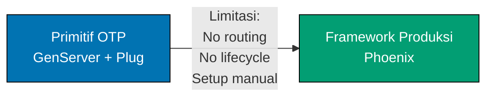

**Siap membangun sistem Elixir produksi?** Panduan Di Lapangan ini mengajarkan pola produksi dengan mengikuti prinsip **OTP-First**, memastikan Anda memahami fondasi BEAM sebelum framework.

## Apa Itu "Di Lapangan"?

Panduan Di Lapangan mengajarkan pengembangan Elixir produksi melalui pola implementasi dunia nyata. Berbeda dengan tutorial by-example yang mencapai 95% cakupan bahasa, panduan ini fokus pada skenario produksi spesifik menggunakan framework standar industri, library, dan pola enterprise.

**Perbedaan kunci**: By-example mengajarkan Elixir melalui kode. Di-lapangan mengajarkan **cara membangun sistem produksi** dengan Elixir.

Panduan ini menjawab keputusan adopsi framework: Kapan saya perlu Phoenix? Kapan Ecto tepat? Haruskah saya menggunakan GenServer mentah atau abstraksi tingkat lebih tinggi? Setiap panduan menunjukkan progresi dari primitif OTP ke framework produksi.

## Filosofi OTP-First

Kekuatan sejati Elixir terletak pada OTP (Open Telecom Platform), framework yang telah teruji dalam VM BEAM. Berbeda dengan bahasa lain di mana framework wajib, Elixir menyediakan alat konkurensi dan fault-tolerance siap produksi bawaan:

- **Proses dan message passing** - Primitif konkurensi ringan
- **GenServer** - Abstraksi server generik untuk manajemen state
- **Supervisor trees** - Pemulihan fault otomatis dan supervisi proses
- **Application behavior** - Manajemen lifecycle aplikasi
- **Process registries** - Pencarian dan discovery proses bernama

**Pendekatan Kami**: Pelajari primitif OTP terlebih dahulu, pahami kapan tidak cukup, lalu adopsi framework dengan pengetahuan penuh tentang trade-off.

### Mengapa Ini Penting

1. **Pemahaman fondasi** - Kenali primitif BEAM sebelum abstraksi Phoenix
2. **Pemilihan framework terinformasi** - Pahami masalah yang dipecahkan Phoenix dan Ecto
3. **Kesadaran masalah** - Lihat kompleksitas implementasi manual tanpa framework
4. **Independensi framework** - Pengetahuan OTP inti transfer lintas alat
5. **Pemahaman trade-off** - Kenali kapan framework menambah nilai vs overhead
6. **Kemampuan debugging** - Pahami apa yang dilakukan framework di balik layar
7. **Keterampilan optimasi** - Kenali bottleneck performa dalam desain proses
8. **Pencegahan bencana produksi** - Hindari kebocoran proses, kesalahan supervisi, message queue overflow

Setiap panduan mengikuti progresi ini: **Primitif OTP → Limitasi → Adopsi framework**

## Organisasi Panduan

36 panduan diorganisasi menjadi 7 kategori:

### 1. Fondasi (2 panduan)

Praktik terbaik inti dan anti-pattern untuk Elixir produksi:

- [Praktik Terbaik](/id/belajar/software-engineering/programming-languages/elixir/in-the-field/praktik-terbaik) - Pola dan idiom produksi
- [Anti Pattern](/id/belajar/software-engineering/programming-languages/elixir/in-the-field/anti-pattern) - Kesalahan umum dan code smell

### 2. OTP dan Konkurensi (7 panduan)

Pola konkurensi BEAM dan OTP fundamental:

- [Proses dan Message Passing](/id/belajar/software-engineering/programming-languages/elixir/in-the-field/proses-dan-message-passing) - Primitif proses → pola terstruktur
- [Pola Genserver](/id/belajar/software-engineering/programming-languages/elixir/in-the-field/pola-genserver) - Pola desain GenServer
- [Pohon Supervisor](/id/belajar/software-engineering/programming-languages/elixir/in-the-field/pohon-supervisor) - Strategi supervisi dan fault tolerance
- [Struktur Aplikasi](/id/belajar/software-engineering/programming-languages/elixir/in-the-field/struktur-aplikasi) - Behavior dan lifecycle aplikasi
- [Behavior Otp](/id/belajar/software-engineering/programming-languages/elixir/in-the-field/behavior-otp) - Pola GenServer, GenStage, Task
- [Pola Registry Proses](/id/belajar/software-engineering/programming-languages/elixir/in-the-field/pola-registry-proses) - Registry, via tuple, DynamicSupervisor
- [Pola Konkurensi](/id/belajar/software-engineering/programming-languages/elixir/in-the-field/pola-konkurensi) - Task.async, pemrosesan paralel, backpressure

### 3. Struktur Data (6 panduan)

Pola pattern matching dan struktur data:

- [Pattern Matching Produksi](/id/belajar/software-engineering/programming-languages/elixir/in-the-field/pattern-matching-produksi) - Teknik pattern matching lanjutan
- [Ets Dets](/id/belajar/software-engineering/programming-languages/elixir/in-the-field/ets-dets) - ETS/DETS untuk penyimpanan in-memory
- [Persistent Term](/id/belajar/software-engineering/programming-languages/elixir/in-the-field/persistent-term) - Penyimpanan global read-optimized
- [Pola Immutability](/id/belajar/software-engineering/programming-languages/elixir/in-the-field/pola-immutability) - Bekerja dengan data immutable
- [Struct Protocol](/id/belajar/software-engineering/programming-languages/elixir/in-the-field/struct-protocol) - Desain struct dan polimorfisme protocol
- [Spesifikasi Type](/id/belajar/software-engineering/programming-languages/elixir/in-the-field/spesifikasi-type) - Typespec dan Dialyzer

### 4. Pengembangan Web (6 panduan)

Pengembangan aplikasi web dengan Phoenix dan Ecto:

- [Framework Phoenix](/id/belajar/software-engineering/programming-languages/elixir/in-the-field/framework-phoenix) - Pola framework web Phoenix
- [Phoenix Channel](/id/belajar/software-engineering/programming-languages/elixir/in-the-field/phoenix-channel) - Komunikasi real-time dengan channel
- [Pola Ecto](/id/belajar/software-engineering/programming-languages/elixir/in-the-field/pola-ecto) - Akses database dengan Ecto
- [Desain Rest Api](/id/belajar/software-engineering/programming-languages/elixir/in-the-field/desain-rest-api) - Pola desain RESTful API
- [Graphql Absinthe](/id/belajar/software-engineering/programming-languages/elixir/in-the-field/graphql-absinthe) - GraphQL dengan Absinthe
- [Autentikasi Otorisasi](/id/belajar/software-engineering/programming-languages/elixir/in-the-field/autentikasi-otorisasi) - Pola auth dengan Guardian dan Pow

### 5. Testing dan Kualitas (4 panduan)

Strategi testing dan kualitas kode:

- [Strategi Testing](/id/belajar/software-engineering/programming-languages/elixir/in-the-field/strategi-testing) - ExUnit → property testing → integrasi
- [Test Driven Development](/id/belajar/software-engineering/programming-languages/elixir/in-the-field/test-driven-development) - Pola TDD dalam Elixir
- [Alat Kualitas Kode](/id/belajar/software-engineering/programming-languages/elixir/in-the-field/alat-kualitas-kode) - Credo, Dialyzer, analisis statis
- [Praktik Dokumentasi](/id/belajar/software-engineering/programming-languages/elixir/in-the-field/praktik-dokumentasi) - ExDoc, doctest, budaya dokumentasi

### 6. Deployment Produksi (7 panduan)

Pola siap produksi untuk reliabilitas dan performa:

- [Strategi Deployment](/id/belajar/software-engineering/programming-languages/elixir/in-the-field/strategi-deployment) - Release, container, clustering
- [Manajemen Konfigurasi](/id/belajar/software-engineering/programming-languages/elixir/in-the-field/manajemen-konfigurasi) - Config → runtime config → release
- [Logging Observability](/id/belajar/software-engineering/programming-languages/elixir/in-the-field/logging-observability) - Logger → telemetry → observability
- [Error Handling Resilience](/id/belajar/software-engineering/programming-languages/elixir/in-the-field/error-handling-resilience) - Let it crash, supervisi, circuit breaker
- [Optimasi Performa](/id/belajar/software-engineering/programming-languages/elixir/in-the-field/optimasi-performa) - Profiling, benchmarking, optimasi
- [Hot Code Upgrade](/id/belajar/software-engineering/programming-languages/elixir/in-the-field/hot-code-upgrade) - Deployment zero-downtime
- [Sistem Terdistribusi](/id/belajar/software-engineering/programming-languages/elixir/in-the-field/sistem-terdistribusi) - Clustering node, distributed Erlang

### 7. Build dan Ekosistem (4 panduan)

Alat build dan integrasi ekosistem:

- [Alat Build Mix](/id/belajar/software-engineering/programming-languages/elixir/in-the-field/alat-build-mix) - Task Mix, custom task, pipeline build
- [Manajemen Paket Hex](/id/belajar/software-engineering/programming-languages/elixir/in-the-field/manajemen-paket-hex) - Dependensi, versioning, publishing
- [Proyek Umbrella](/id/belajar/software-engineering/programming-languages/elixir/in-the-field/proyek-umbrella) - Organisasi proyek multi-app
- [Interop Nif Port](/id/belajar/software-engineering/programming-languages/elixir/in-the-field/interop-nif-port) - NIF, port, integrasi Rustler

## Jalur Pembelajaran Progresif

Setiap panduan mengikuti struktur ini:

1. **Mengapa Ini Penting** - Konteks produksi dan skenario dunia nyata
2. **Primitif OTP Dulu** - Pendekatan bawaan dengan contoh beranotasi
3. **Limitasi** - Kapan primitif OTP tidak cukup untuk produksi
4. **Framework Produksi** - Solusi standar industri dengan contoh
5. **Trade-off** - Tabel perbandingan jelas (kompleksitas, kurva belajar, maintenance)
6. **Praktik Terbaik** - Panduan actionable dengan contoh kode

### Contoh Progresi (Pengembangan Web)



**Primitif OTP**: Anda bisa membangun web server dengan GenServer + Plug, menangani HTTP manual.

**Limitasi**: Tidak ada pola routing, tidak ada lifecycle request, tidak ada asset pipeline, rantai middleware manual, penanganan context verbose.

**Framework Produksi**: Phoenix menyediakan routing, lifecycle hook, LiveView, Channel, asset pipeline, dan pola terstruktur.

**Trade-off**: Pelajari GenServer dan Plug terlebih dahulu untuk memahami apa yang diabstraksi Phoenix.

## Standar Anotasi Kode

Semua contoh kode mempertahankan **densitas anotasi 1.0-2.25** (baris komentar per baris kode) menggunakan notasi `# =>` untuk menjelaskan nilai, state, dan output.

**Contoh**:

```elixir
# OTP GenServer untuk manajemen state
defmodule Counter do
  use GenServer                              # => Import behavior GenServer
                                             # => Menyediakan init, handle_call, dll.

  def start_link(initial \\ 0) do
    GenServer.start_link(__MODULE__, initial, name: __MODULE__)
                                             # => Start proses, register nama
                                             # => initial: State awal
                                             # => Return {:ok, pid}
  end

  def init(initial) do
    {:ok, initial}                           # => State awal: nilai initial
                                             # => Type: {:ok, integer()}
  end

  def increment do
    GenServer.call(__MODULE__, :increment)   # => Call sinkron ke proses terdaftar
                                             # => Return nilai baru
  end

  def handle_call(:increment, _from, state) do
    new_state = state + 1                    # => Increment state
    {:reply, new_state, new_state}           # => Reply dengan nilai baru, update state
                                             # => Type: {:reply, integer(), integer()}
  end
end
```

## Siapa Yang Harus Menggunakan Panduan Ini?

- **Developer Elixir yang membangun sistem produksi** - Pelajari pola industri
- **Tim yang mengadopsi Elixir untuk layanan backend** - Tetapkan konvensi produksi
- **Developer yang bertransisi dari bahasa lain** - Pahami ekosistem produksi Elixir
- **Siapa saja yang mencari pola Elixir siap produksi** - Pemilihan framework, trade-off, praktik terbaik

## Pengetahuan Prasyarat

Panduan ini mengasumsikan keakraban dengan fundamental Elixir. Jika Anda baru di Elixir, mulai dengan:

- [Setup Awal](/id/belajar/software-engineering/programming-languages/elixir/setup-awal) - 0-5% cakupan Elixir (instalasi, tooling)
- [Mulai Cepat](/id/belajar/software-engineering/programming-languages/elixir/mulai-cepat) - 5-30% cakupan Elixir (sintaks dasar, program pertama)
- [By Example](/id/belajar/software-engineering/programming-languages/elixir/by-example) - 75-95% cakupan Elixir (75+ contoh beranotasi)

**Minimum**: Selesaikan Mulai Cepat (5-30% cakupan) sebelum mulai panduan Di Lapangan.

**Direkomendasikan**: Selesaikan By Example (75-95% cakupan) untuk fondasi komprehensif.

## Pendekatan Pembelajaran

**Bukan tutorial komprehensif**: Panduan ini menargetkan skenario produksi spesifik, bukan pembangunan keterampilan sekuensial. Lompat ke topik relevan berdasarkan kebutuhan proyek Anda.

**Pembelajaran code-first**: Contoh self-contained dan dapat dijalankan. Salin, eksekusi, modifikasi, eksperimen.

**Pragmatisme framework**: Kami mengajarkan primitif OTP terlebih dahulu, tetapi merekomendasikan framework ketika memberikan nilai produksi jelas.

## Referensi Konvensi

Panduan ini mengikuti [Konvensi In-the-Field](https://github.com/wahidyankf/open-sharia-enterprise/blob/main/governance/conventions/tutorials/in-the-field.md), yang mendefinisikan standar panduan implementasi produksi.
