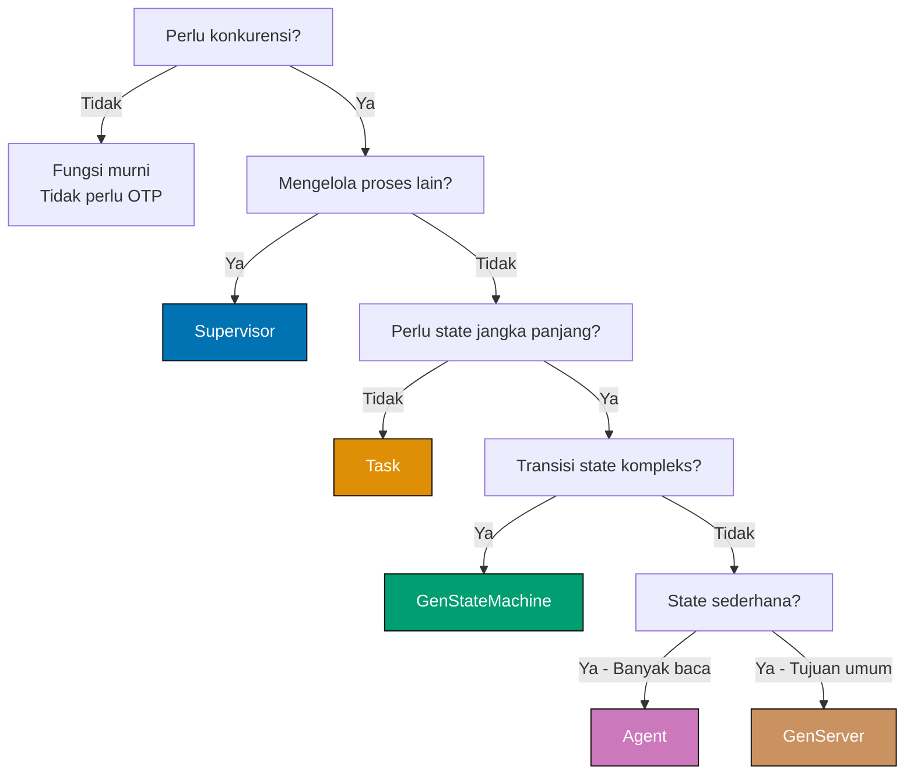
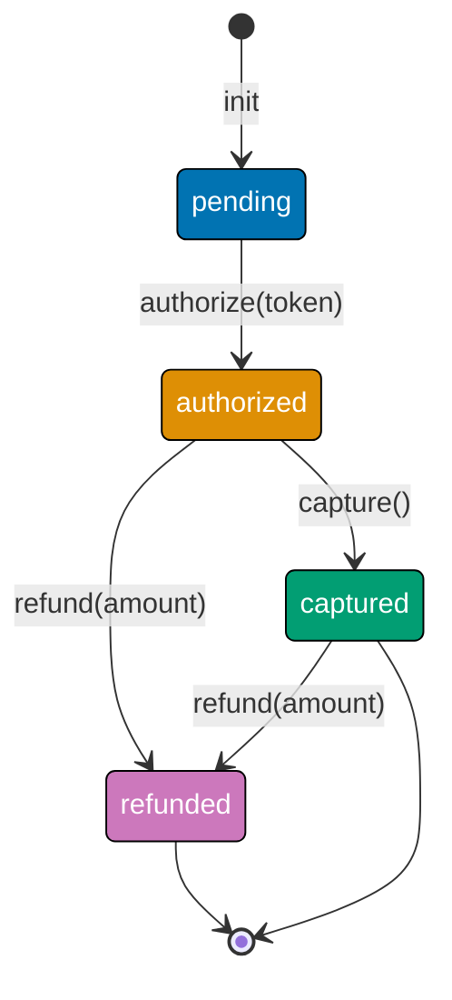
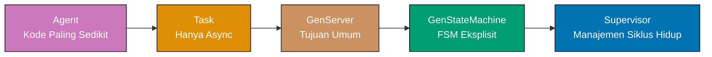

**Membangun sistem konkuren dengan OTP?** Panduan ini memberikan ikhtisar lengkap semua perilaku OTP, kriteria keputusan untuk memilih perilaku yang tepat, dan pola praktis untuk masing-masing. Pelajari kapan menggunakan GenServer, Supervisor, GenStateMachine, Task, dan Agent melalui skenario produksi nyata.

## Mengapa Perilaku OTP Penting

OTP (Open Telecom Platform) menyediakan abstraksi yang telah teruji untuk sistem konkuren dan toleran terhadap kesalahan. Setiap perilaku menyelesaikan tantangan produksi spesifik:

- **GenServer** - Proses stateful tujuan umum dengan panggilan sinkron/asinkron
- **Supervisor** - Pemulihan kesalahan otomatis dan manajemen siklus hidup proses
- **GenStateMachine** - Mesin state terbatas kompleks dengan transisi state eksplisit
- **Task** - Operasi asinkron berumur pendek tanpa state jangka panjang
- **Agent** - Kontainer state sederhana dengan boilerplate minimal

**Realitas produksi**: Memilih perilaku yang salah meningkatkan kompleksitas dan mengurangi maintainability.

**Pendekatan kami**: Matriks keputusan terlebih dahulu → Pahami setiap perilaku → Lihat pola produksi.

## Matriks Keputusan Perilaku OTP

Gunakan pohon keputusan ini untuk memilih perilaku yang sesuai:



### Panduan Pemilihan Cepat

| Kasus Penggunaan        | Perilaku                | Alasan                                         |
| ----------------------- | ----------------------- | ---------------------------------------------- |
| Supervisi proses        | Supervisor              | Restart otomatis, isolasi kesalahan            |
| Rate limiter API        | GenServer               | State persisten, akses tersinkronisasi         |
| Eksekusi job background | Task                    | Berumur pendek, async, tanpa state jangka lama |
| FSM workflow pembayaran | GenStateMachine         | Graf state kompleks, transisi eksplisit        |
| Cache konfigurasi       | Agent                   | Dioptimalkan baca, kontainer state sederhana   |
| Pool koneksi WebSocket  | GenServer               | State koneksi, callback siklus hidup           |
| Monitor health check    | Task.async + Supervisor | Operasi async dengan supervisi                 |
| State keranjang belanja | GenServer               | State mutable, update sinkron                  |

## GenServer - Manajemen State Umum

### Kapan Menggunakan GenServer

**Gunakan GenServer ketika Anda memerlukan**:

- Proses berumur panjang dengan state mutable
- Pola request-response sinkron (call)
- Pesan fire-and-forget asinkron (cast)
- Callback siklus hidup (init, terminate, handle_info)
- Logika bisnis kompleks seputar transisi state

### Pola Produksi - Rate Limiter API

```elixir
# Rate limiter berbasis GenServer dengan token bucket
defmodule RateLimiter do
  use GenServer                              # => Mengimpor perilaku GenServer
                                             # => Menyediakan init/1, handle_call/3, dll.

  @refill_rate 10                            # => Token per detik
  @bucket_size 100                           # => Token maksimum

  # => API Klien
  def start_link(opts \\ []) do
    GenServer.start_link(__MODULE__, opts, name: __MODULE__)
                                             # => Memulai proses, mendaftarkan nama
                                             # => Mengembalikan {:ok, pid}
  end

  def check_rate(user_id) do
    GenServer.call(__MODULE__, {:check, user_id})
                                             # => Panggilan sinkron
                                             # => Mengembalikan {:ok, :allowed} atau {:error, :rate_limited}
  end

  # => Callback Server
  def init(_opts) do
    :timer.send_interval(1000, :refill)      # => Jadwalkan refill setiap 1 detik
                                             # => Mengirim pesan :refill ke self()
    {:ok, %{}}                               # => State awal: map kosong
                                             # => Tipe: %{user_id => tokens}
  end

  def handle_call({:check, user_id}, _from, state) do
    tokens = Map.get(state, user_id, @bucket_size)
                                             # => Ambil token user, default ke bucket penuh
                                             # => Tipe: integer

    if tokens > 0 do
      new_state = Map.put(state, user_id, tokens - 1)
                                             # => Konsumsi 1 token
      {:reply, {:ok, :allowed}, new_state}   # => Izinkan request, update state
                                             # => Tipe: {:reply, term(), map()}
    else
      {:reply, {:error, :rate_limited}, state}
                                             # => Tolak request, state tidak berubah
    end
  end

  def handle_info(:refill, state) do
    new_state =
      state
      |> Enum.map(fn {user_id, tokens} ->
        {user_id, min(tokens + @refill_rate, @bucket_size)}
                                             # => Tambah token, maksimal bucket_size
                                             # => Tipe: {user_id, integer}
      end)
      |> Map.new()                           # => Konversi kembali ke map

    {:noreply, new_state}                    # => Update state, tidak perlu reply
                                             # => Tipe: {:noreply, map()}
  end
end

# Penggunaan
{:ok, _pid} = RateLimiter.start_link()       # => Memulai rate limiter
                                             # => Mengembalikan {:ok, pid}

RateLimiter.check_rate("user_123")           # => {:ok, :allowed}
RateLimiter.check_rate("user_123")           # => {:ok, :allowed} (tersisa 99)
# ... 100 panggilan kemudian ...
RateLimiter.check_rate("user_123")           # => {:error, :rate_limited}
```

### Trade-off GenServer

| Aspek               | Keuntungan                      | Kerugian                                      |
| ------------------- | ------------------------------- | --------------------------------------------- |
| **Manajemen State** | Kontrol penuh atas mutasi state | Harus menangani semua edge case secara manual |
| **Sinkronisasi**    | Semantik call/cast bawaan       | Bisa menjadi bottleneck jika terlalu sering   |
| **Siklus Hidup**    | Interface callback yang kaya    | Lebih banyak boilerplate daripada Agent       |
| **Kompleksitas**    | Menangani skenario kompleks     | Berlebihan untuk kontainer state sederhana    |

## Supervisor - Toleransi Kesalahan

### Kapan Menggunakan Supervisor

**Gunakan Supervisor ketika Anda memerlukan**:

- Restart proses otomatis saat gagal
- Isolasi kesalahan (mencegah kegagalan berantai)
- Manajemen siklus hidup proses (start, stop, restart)
- Supervision tree untuk sistem hierarkis
- Strategi restart berbeda (one_for_one, rest_for_one, one_for_all)

### Pola Produksi - Supervisi Pool Worker

```elixir
# Supervisor untuk pool koneksi database
defmodule DBConnectionPool do
  use Supervisor                             # => Mengimpor perilaku Supervisor
                                             # => Menyediakan init/1, start_link/1

  def start_link(opts) do
    Supervisor.start_link(__MODULE__, opts, name: __MODULE__)
                                             # => Memulai proses supervisor
                                             # => Mengembalikan {:ok, pid}
  end

  def init(opts) do
    pool_size = Keyword.get(opts, :pool_size, 10)
                                             # => Ambil ukuran pool, default 10
                                             # => Tipe: integer

    children =
      for i <- 1..pool_size do
        Supervisor.child_spec(
          {DBConnection, [id: i]},           # => Modul worker dan args
          id: {:db_connection, i}            # => ID unik untuk setiap worker
                                             # => Diperlukan untuk tracking restart
        )
      end                                    # => List 10 child spec
                                             # => Tipe: [child_spec()]

    Supervisor.init(children, strategy: :one_for_one)
                                             # => one_for_one: Hanya child yang gagal yang restart
                                             # => Opsi lain: :rest_for_one, :one_for_all
                                             # => Mengembalikan {:ok, {supervisor_flags, [child_spec]}}
  end
end

# Worker koneksi individual
defmodule DBConnection do
  use GenServer

  def start_link(opts) do
    id = Keyword.fetch!(opts, :id)           # => Opsi :id wajib
    GenServer.start_link(__MODULE__, id, name: via_tuple(id))
                                             # => Daftarkan dengan process registry
  end

  defp via_tuple(id) do
    {:via, Registry, {DBConnectionRegistry, id}}
                                             # => Penamaan berbasis Registry
                                             # => Memungkinkan lookup dinamis
  end

  def init(id) do
    # Koneksi ke database
    conn = establish_connection()            # => Membuka koneksi database
                                             # => Mengembalikan handle koneksi

    {:ok, %{id: id, conn: conn}}             # => Simpan ID dan koneksi
                                             # => Tipe: %{id: integer, conn: term()}
  end

  def handle_info(:connection_lost, state) do
    # Koneksi hilang - let it crash
    # Supervisor akan restart worker ini
    {:stop, :connection_lost, state}         # => Terminate proses
                                             # => Supervisor mendeteksi exit
                                             # => Memulai worker baru secara otomatis
  end

  defp establish_connection do
    # Logika koneksi database aktual
    :connection_handle                       # => Placeholder
  end
end

# Mulai supervision tree
{:ok, _sup} = DBConnectionPool.start_link(pool_size: 10)
                                             # => Memulai supervisor dengan 10 worker
                                             # => Semua worker dimulai otomatis
                                             # => Worker yang gagal restart otomatis
```

### Strategi Supervisor

| Strategi          | Perilaku                                                 | Kasus Penggunaan                     |
| ----------------- | -------------------------------------------------------- | ------------------------------------ |
| **:one_for_one**  | Hanya child yang gagal yang restart                      | Worker independen (connection pool)  |
| **:rest_for_one** | Child yang gagal + semua yang dimulai setelahnya restart | Rantai dependensi (db → cache → api) |
| **:one_for_all**  | Semua children restart jika ada yang gagal               | Komponen yang terhubung erat         |

## GenStateMachine - Mesin State Kompleks

### Kapan Menggunakan GenStateMachine

**Gunakan GenStateMachine ketika Anda memerlukan**:

- Mesin state terbatas eksplisit dengan graf state yang jelas
- Penanganan event spesifik state (event berbeda per state)
- Workflow kompleks dengan beberapa tahap
- Integritas transisi state terjamin
- Dokumentasi diagram state visual

**Catatan**: Memerlukan library `gen_state_machine`. Tambahkan ke `mix.exs`:

```elixir
{:gen_state_machine, "~> 3.0"}               # => Tambahkan ke deps
```

### Pola Produksi - FSM Workflow Pembayaran

```elixir
# Pemrosesan pembayaran dengan transisi state eksplisit
defmodule PaymentProcessor do
  use GenStateMachine                        # => Mengimpor perilaku GenStateMachine
                                             # => Menyediakan callback_mode/0, init/1, handle_event/4

  # State: :pending → :authorized → :captured | :refunded
  # Event: :authorize, :capture, :refund, :cancel

  # => API Klien
  def start_link(payment_id, amount) do
    GenStateMachine.start_link(__MODULE__, {payment_id, amount})
                                             # => Memulai proses state machine
                                             # => Mengembalikan {:ok, pid}
  end

  def authorize(pid, card_token) do
    GenStateMachine.call(pid, {:authorize, card_token})
                                             # => Transisi state sinkron
                                             # => Mengembalikan :ok atau {:error, reason}
  end

  def capture(pid) do
    GenStateMachine.call(pid, :capture)      # => Capture pembayaran yang diotorisasi
  end

  def refund(pid, amount) do
    GenStateMachine.call(pid, {:refund, amount})
                                             # => Inisiasi refund
  end

  # => Callback Server
  def callback_mode, do: :state_functions    # => Gunakan fungsi spesifik state
                                             # => Alternatif: :handle_event_function

  def init({payment_id, amount}) do
    data = %{
      payment_id: payment_id,
      amount: amount,
      authorized_amount: 0,
      captured_amount: 0
    }                                        # => Struktur data awal
                                             # => Tipe: map()

    {:ok, :pending, data}                    # => Mulai di state :pending
                                             # => Tipe: {:ok, state, data}
  end

  # => State: :pending
  def pending({:call, from}, {:authorize, card_token}, data) do
    case authorize_payment(card_token, data.amount) do
      {:ok, auth_id} ->
        new_data = %{data | authorized_amount: data.amount}
                                             # => Simpan jumlah yang diotorisasi

        {:next_state, :authorized, new_data, [{:reply, from, :ok}]}
                                             # => Transisi ke :authorized
                                             # => Reply ke pemanggil
                                             # => Tipe: {:next_state, state, data, [action]}

      {:error, reason} ->
        {:keep_state_and_data, [{:reply, from, {:error, reason}}]}
                                             # => Tetap di :pending
                                             # => Kembalikan error ke pemanggil
    end
  end

  def pending({:call, from}, _event, _data) do
    {:keep_state_and_data, [{:reply, from, {:error, :invalid_event}}]}
                                             # => Tolak event tidak valid di :pending
  end

  # => State: :authorized
  def authorized({:call, from}, :capture, data) do
    case capture_payment(data.payment_id, data.authorized_amount) do
      :ok ->
        new_data = %{data | captured_amount: data.authorized_amount}
                                             # => Catat jumlah yang dicapture

        {:next_state, :captured, new_data, [{:reply, from, :ok}]}
                                             # => Transisi ke :captured
                                             # => State terminal (tidak ada transisi lagi)

      {:error, reason} ->
        {:keep_state_and_data, [{:reply, from, {:error, reason}}]}
                                             # => Capture gagal, tetap :authorized
    end
  end

  def authorized({:call, from}, {:refund, amount}, data) do
    if amount <= data.authorized_amount do
      case refund_payment(data.payment_id, amount) do
        :ok ->
          new_data = %{data | authorized_amount: data.authorized_amount - amount}
                                             # => Kurangi jumlah yang diotorisasi

          {:next_state, :refunded, new_data, [{:reply, from, :ok}]}
                                             # => Transisi ke :refunded

        {:error, reason} ->
          {:keep_state_and_data, [{:reply, from, {:error, reason}}]}
      end
    else
      {:keep_state_and_data, [{:reply, from, {:error, :invalid_amount}}]}
                                             # => Jumlah melebihi yang diotorisasi
    end
  end

  def authorized({:call, from}, _event, _data) do
    {:keep_state_and_data, [{:reply, from, {:error, :invalid_event}}]}
  end

  # => State: :captured (terminal)
  def captured({:call, from}, {:refund, amount}, data) do
    if amount <= data.captured_amount do
      case refund_payment(data.payment_id, amount) do
        :ok ->
          new_data = %{data | captured_amount: data.captured_amount - amount}
          {:next_state, :refunded, new_data, [{:reply, from, :ok}]}

        {:error, reason} ->
          {:keep_state_and_data, [{:reply, from, {:error, reason}}]}
      end
    else
      {:keep_state_and_data, [{:reply, from, {:error, :invalid_amount}}]}
    end
  end

  def captured({:call, from}, _event, _data) do
    {:keep_state_and_data, [{:reply, from, {:error, :terminal_state}}]}
                                             # => Tidak bisa transisi dari :captured
  end

  # => State: :refunded (terminal)
  def refunded({:call, from}, _event, _data) do
    {:keep_state_and_data, [{:reply, from, {:error, :terminal_state}}]}
                                             # => Tidak ada transisi dari :refunded
  end

  # Fungsi helper
  defp authorize_payment(_token, _amount), do: {:ok, "auth_123"}
  defp capture_payment(_id, _amount), do: :ok
  defp refund_payment(_id, _amount), do: :ok
end

# Penggunaan
{:ok, pid} = PaymentProcessor.start_link("pay_123", 10000)
                                             # => Mulai di state :pending

PaymentProcessor.authorize(pid, "tok_visa") # => :ok
                                             # => Transisi: :pending → :authorized

PaymentProcessor.capture(pid)                # => :ok
                                             # => Transisi: :authorized → :captured

PaymentProcessor.refund(pid, 5000)           # => :ok
                                             # => Transisi: :captured → :refunded
```

### Visualisasi State Machine



### Trade-off GenStateMachine

| Aspek               | Keuntungan                                | Kerugian                                |
| ------------------- | ----------------------------------------- | --------------------------------------- |
| **Kejelasan State** | Graf state eksplisit, self-documenting    | Lebih banyak boilerplate dari GenServer |
| **Keamanan Tipe**   | Transisi tidak valid ditolak saat runtime | Memerlukan library eksternal            |
| **Debugging**       | Riwayat state jelas, mudah dilacak        | Kurva belajar lebih curam               |
| **Maintenance**     | Perubahan workflow eksplisit dalam kode   | Berlebihan untuk flag state sederhana   |

## Task - Operasi Asinkron

### Kapan Menggunakan Task

**Gunakan Task ketika Anda memerlukan**:

- Operasi asinkron berumur pendek (tanpa state jangka panjang)
- Eksekusi paralel operasi independen
- Pekerjaan async fire-and-forget
- Hasil async yang bisa ditunggu dengan timeout
- Operasi async yang disupervisi (Task.Supervisor)

### Pola Produksi - Panggilan API Paralel

```elixir
# Ambil profil user dari beberapa service secara paralel
defmodule ProfileAggregator do
  def fetch_profile(user_id) do
    # Mulai task untuk setiap service
    tasks = [
      Task.async(fn -> fetch_user_data(user_id) end),
                                             # => Spawn proses untuk user_data
                                             # => Mengembalikan %Task{pid: pid, ref: ref}

      Task.async(fn -> fetch_preferences(user_id) end),
                                             # => Spawn proses untuk preferences

      Task.async(fn -> fetch_recent_activity(user_id) end)
                                             # => Spawn proses untuk activity
    ]                                        # => List 3 task berjalan paralel
                                             # => Tipe: [%Task{}]

    # Tunggu semua task dengan timeout
    results = Task.await_many(tasks, 5000)   # => Tunggu maksimal 5 detik untuk semua
                                             # => Mengembalikan [result1, result2, result3]
                                             # => Raise error saat timeout
                                             # => Tipe: [term()]

    # Agregasi hasil
    [user_data, preferences, activity] = results
                                             # => Pattern match hasil

    %{
      user: user_data,
      preferences: preferences,
      recent_activity: activity
    }                                        # => Profil gabungan
                                             # => Tipe: map()
  end

  # Task.Supervisor untuk operasi async toleran kesalahan
  def fetch_profile_supervised(user_id) do
    tasks = [
      Task.Supervisor.async(ProfileTaskSup, fn -> fetch_user_data(user_id) end),
                                             # => Spawn task tersupervisi
                                             # => Terhubung ke supervisor, bukan pemanggil

      Task.Supervisor.async(ProfileTaskSup, fn -> fetch_preferences(user_id) end),
      Task.Supervisor.async(ProfileTaskSup, fn -> fetch_recent_activity(user_id) end)
    ]

    # Tunggu dengan timeout, tangani kegagalan
    results =
      tasks
      |> Task.await_many(5000)               # => Tunggu semua task
      |> Enum.map(fn
        {:ok, data} -> data                  # => Kasus sukses
        {:error, _} -> nil                   # => Kasus gagal - gunakan nil
      end)                                   # => List dengan kegagalan diganti nil
                                             # => Tipe: [term() | nil]

    [user_data, preferences, activity] = results

    %{
      user: user_data || %{},                # => Fallback ke map kosong
      preferences: preferences || %{},
      recent_activity: activity || []
    }
  end

  defp fetch_user_data(user_id) do
    # Simulasi panggilan API
    :timer.sleep(100)
    {:ok, %{id: user_id, name: "User #{user_id}"}}
  end

  defp fetch_preferences(user_id) do
    :timer.sleep(150)
    {:ok, %{theme: "dark", notifications: true}}
  end

  defp fetch_recent_activity(user_id) do
    :timer.sleep(200)
    {:ok, [%{action: "login", timestamp: DateTime.utc_now()}]}
  end
end

# Mulai Task.Supervisor di supervision tree aplikasi
children = [
  {Task.Supervisor, name: ProfileTaskSup}    # => Mensupervisi task async
                                             # => Mencegah kegagalan task crash pemanggil
]

Supervisor.start_link(children, strategy: :one_for_one)

# Penggunaan
profile = ProfileAggregator.fetch_profile("user_123")
                                             # => Mengembalikan dalam ~200ms (paralel)
                                             # => Sequential akan memakan ~450ms

profile_safe = ProfileAggregator.fetch_profile_supervised("user_456")
                                             # => Kegagalan tidak crash pemanggil
                                             # => Mengembalikan data parsial saat error
```

### Trade-off Task

| Aspek                   | Keuntungan                     | Kerugian                                 |
| ----------------------- | ------------------------------ | ---------------------------------------- |
| **Kesederhanaan**       | Boilerplate minimal, built-in  | Tidak ada manajemen state jangka panjang |
| **Paralelisme**         | Eksekusi paralel mudah         | Tidak cocok untuk proses persisten       |
| **Toleransi Kesalahan** | Task.Supervisor untuk keamanan | Tidak ada logika retry otomatis          |
| **Timeout**             | Dukungan timeout built-in      | Penanganan error manual diperlukan       |

## Agent - Kontainer State Sederhana

### Kapan Menggunakan Agent

**Gunakan Agent ketika Anda memerlukan**:

- Kontainer state sederhana (tanpa logika kompleks)
- Workload banyak baca (konfigurasi, cache)
- Boilerplate minimal untuk manajemen state
- Tidak perlu pembedaan call/cast
- Tidak perlu callback siklus hidup

### Pola Produksi - Cache Konfigurasi

```elixir
# Cache konfigurasi berbasis Agent
defmodule ConfigCache do
  use Agent                                  # => Mengimpor perilaku Agent
                                             # => Menyediakan start_link/1, get/1, update/2

  def start_link(_opts) do
    Agent.start_link(fn -> load_config() end, name: __MODULE__)
                                             # => Memulai agent dengan state awal
                                             # => load_config/0 berjalan di proses agent
                                             # => Mengembalikan {:ok, pid}
  end

  def get(key) do
    Agent.get(__MODULE__, fn state -> Map.get(state, key) end)
                                             # => Akses read-only ke state
                                             # => Fungsi berjalan di proses agent
                                             # => Mengembalikan value atau nil
                                             # => Tipe: term()
  end

  def get_all do
    Agent.get(__MODULE__, & &1)              # => Kembalikan seluruh state
                                             # => & &1 adalah fungsi identitas
                                             # => Tipe: map()
  end

  def put(key, value) do
    Agent.update(__MODULE__, fn state ->
      Map.put(state, key, value)             # => Update map state
    end)                                     # => Mengembalikan :ok
                                             # => State baru menggantikan yang lama
  end

  def reload do
    Agent.update(__MODULE__, fn _state ->
      load_config()                          # => Buang state lama
                                             # => Load config segar
    end)
  end

  defp load_config do
    # Load dari file/environment
    %{
      api_key: System.get_env("API_KEY"),
      timeout: 5000,
      retry_attempts: 3
    }                                        # => State awal
                                             # => Tipe: map()
  end
end

# Penggunaan
{:ok, _pid} = ConfigCache.start_link([])     # => Load config saat startup

ConfigCache.get(:timeout)                    # => 5000
ConfigCache.put(:timeout, 10000)             # => :ok
ConfigCache.get(:timeout)                    # => 10000

ConfigCache.reload()                         # => :ok (reload dari environment)
```

### Agent vs GenServer

| Fitur                | Agent                        | GenServer                               |
| -------------------- | ---------------------------- | --------------------------------------- |
| **Boilerplate**      | Minimal (`use Agent`)        | Sedang (callback)                       |
| **Akses State**      | Fungsi get/update            | handle_call/cast                        |
| **Siklus Hidup**     | Tidak ada                    | init, terminate, handle_info            |
| **Kasus Penggunaan** | State sederhana, banyak baca | Logika kompleks, kebutuhan siklus hidup |
| **Kurva Belajar**    | Ramah pemula                 | Menengah                                |

## Ringkasan Pemilihan Perilaku

### Tabel Referensi Cepat

| Kebutuhan                         | Perilaku yang Direkomendasikan | Alternatif                    |
| --------------------------------- | ------------------------------ | ----------------------------- |
| Mensupervisi proses lain          | Supervisor                     | N/A                           |
| State machine kompleks (5+ state) | GenStateMachine                | GenServer dengan field state  |
| Operasi async berumur pendek      | Task                           | spawn_link + receive          |
| State sederhana banyak baca       | Agent                          | GenServer (berlebihan)        |
| API dengan semantik call/cast     | GenServer                      | N/A                           |
| Connection pooling                | GenServer + Supervisor         | Library Poolboy               |
| Antrian job background            | GenServer + Supervisor         | Library Oban                  |
| Pemrosesan data real-time         | GenStage (berbasis stream)     | GenServer dengan backpressure |

### Spektrum Kompleksitas vs Kontrol



**Aturan praktis**:

- Mulai dengan perilaku paling sederhana yang menyelesaikan masalah
- Upgrade ke perilaku lebih kompleks saat keterbatasan muncul
- Selalu supervisi proses produksi (bahkan Agent)

## Anti-Pattern Umum

### ❌ Menggunakan GenServer untuk State Sederhana

```elixir
# ANTI-PATTERN: GenServer untuk penyimpanan config
defmodule ConfigGenServer do
  use GenServer

  def init(_), do: {:ok, %{timeout: 5000}}
  def handle_call(:get_timeout, _, state), do: {:reply, state.timeout, state}
  def handle_cast({:set_timeout, val}, state), do: {:noreply, %{state | timeout: val}}
end

# LEBIH BAIK: Gunakan Agent
defmodule ConfigAgent do
  use Agent

  def start_link(_), do: Agent.start_link(fn -> %{timeout: 5000} end, name: __MODULE__)
  def get_timeout, do: Agent.get(__MODULE__, & &1.timeout)
  def set_timeout(val), do: Agent.update(__MODULE__, &Map.put(&1, :timeout, val))
end
```

### ❌ Task untuk State Jangka Panjang

```elixir
# ANTI-PATTERN: Task dengan loop tak terbatas
Task.start(fn ->
  Stream.repeatedly(fn -> do_work() end)
  |> Enum.each(& &1)                         # => Tidak pernah terminate
end)                                         # => Tanpa supervisi, tanpa recovery

# LEBIH BAIK: GenServer dengan supervisi
defmodule Worker do
  use GenServer

  def init(_), do: {:ok, %{}, {:continue, :work}}
  def handle_continue(:work, state) do
    do_work()
    {:noreply, state, {:continue, :work}}    # => Loop tak terbatas dengan siklus hidup OTP yang tepat
  end
end

Supervisor.start_link([Worker], strategy: :one_for_one)
```

### ❌ GenStateMachine untuk Flag Sederhana

```elixir
# ANTI-PATTERN: FSM untuk state boolean
defmodule FeatureFlag do
  use GenStateMachine

  def enabled({:call, from}, :check, _) do
    {:keep_state_and_data, [{:reply, from, true}]}
  end

  def disabled({:call, from}, :check, _) do
    {:keep_state_and_data, [{:reply, from, false}]}
  end
end

# LEBIH BAIK: GenServer atau Agent
defmodule FeatureFlag do
  use Agent

  def start_link(_), do: Agent.start_link(fn -> false end, name: __MODULE__)
  def enabled?, do: Agent.get(__MODULE__, & &1)
  def enable, do: Agent.update(__MODULE__, fn _ -> true end)
  def disable, do: Agent.update(__MODULE__, fn _ -> false end)
end
```

## Praktik Terbaik

### 1. Selalu Supervisi Proses Produksi

```elixir
# Mulai semua perilaku di bawah supervisi
children = [
  {RateLimiter, []},                         # => GenServer
  {DBConnectionPool, pool_size: 10},         # => Supervisor
  {Task.Supervisor, name: MyTaskSup},        # => Task.Supervisor
  {ConfigCache, []}                          # => Agent
]

Supervisor.start_link(children, strategy: :one_for_one)
                                             # => Semua perilaku tersupervisi
                                             # => Restart otomatis saat gagal
```

### 2. Gunakan Process Registry untuk Penamaan Dinamis

```elixir
# Penamaan berbasis Registry untuk beberapa instance
{:ok, _} = Registry.start_link(keys: :unique, name: MyRegistry)

GenServer.start_link(MyWorker, init_args, name: {:via, Registry, {MyRegistry, worker_id}})
                                             # => Daftarkan berdasarkan ID
                                             # => Mendukung lookup dinamis

# Lookup
[{pid, _}] = Registry.lookup(MyRegistry, worker_id)
```

### 3. Implementasikan Timeout yang Tepat

```elixir
# GenServer dengan timeout call
GenServer.call(pid, :slow_operation, 30_000) # => Timeout 30 detik
                                             # => Raise exit setelah timeout

# Task dengan timeout
case Task.await(task, 5000) do
  result -> {:ok, result}
after
  0 -> {:error, :timeout}                    # => Cleanup setelah timeout
end
```

### 4. Gunakan GenStateMachine untuk Workflow Kompleks

**Ketika graf state memiliki 5+ state** atau **beberapa transisi per state**, lebih baik GenStateMachine daripada GenServer dengan field state.

### 5. Lebih Suka Task.Supervisor untuk Async Produksi

```elixir
# Task async aman produksi
Task.Supervisor.async_nolink(MySup, fn -> risky_operation() end)
                                             # => Kegagalan tidak crash pemanggil
                                             # => Supervisor menangani cleanup
```

## Langkah Selanjutnya

**Kuasai perilaku individual**:

- [Pola GenServer](/id/belajar/software-engineering/programming-languages/elixir/in-the-field/pola-genserver) - Deep dive pola desain GenServer
- [Supervision Tree](/id/belajar/software-engineering/programming-languages/elixir/in-the-field/supervision-tree) - Strategi supervisi dan toleransi kesalahan

**Pelajari integrasi supervisi**:

- [Struktur Aplikasi](/id/belajar/software-engineering/programming-languages/elixir/in-the-field/struktur-aplikasi) - Supervision tree dalam aplikasi

**Lihat pola lanjutan**:

- [Pola Process Registry](/id/belajar/software-engineering/programming-languages/elixir/in-the-field/pola-process-registry) - Lookup proses dinamis
- [Pola Konkurensi](/id/belajar/software-engineering/programming-languages/elixir/in-the-field/pola-konkurensi) - Pemrosesan paralel, backpressure

## Sumber Daya Tambahan

**Dokumentasi Resmi**:

- [GenServer Behavior](https://hexdocs.pm/elixir/GenServer.html) - Panduan GenServer resmi
- [Supervisor Behavior](https://hexdocs.pm/elixir/Supervisor.html) - Panduan Supervisor resmi
- [Task Module](https://hexdocs.pm/elixir/Task.html) - Dokumentasi Task
- [Agent Module](https://hexdocs.pm/elixir/Agent.html) - Dokumentasi Agent

**Library**:

- [gen_state_machine](https://hex.pm/packages/gen_state_machine) - Perilaku GenStateMachine
- [Registry](https://hexdocs.pm/elixir/Registry.html) - Process registry untuk penamaan dinamis
