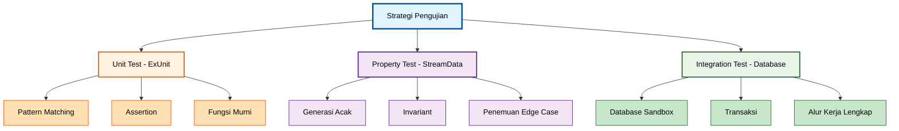

**Membangun aplikasi Elixir yang andal?** Panduan ini mengajarkan strategi pengujian melalui progresi OTP-First, dimulai dengan ExUnit untuk unit testing guna memahami pola dasar sebelum memperkenalkan property-based testing dengan StreamData dan integration testing dengan database asli.

## Mengapa Strategi Pengujian Penting

Setiap aplikasi produksi memerlukan cakupan pengujian yang komprehensif:

- **Sistem keuangan** - Perhitungan zakat, pemrosesan donasi, akurasi transaksi
- **Platform kesehatan** - Integritas catatan pasien, validasi resep, kepatuhan audit
- **E-commerce** - Pemrosesan pesanan, manajemen inventori, alur pembayaran
- **Aplikasi SaaS** - Isolasi multi-tenant, kontrak API, konsistensi data

Elixir menyediakan tiga pendekatan pengujian:

1. **ExUnit (Standard Library)** - Unit testing dengan pattern matching dan assertions
2. **StreamData** - Property-based testing untuk edge case dan invariants
3. **Test database** - Integration testing dengan PostgreSQL/MySQL asli

**Pendekatan kami**: Mulai dengan ExUnit untuk memahami pola pengujian dasar, kenali keterbatasan dengan edge case, lalu perkenalkan property-based testing dan pola integrasi database.

## Primitif OTP - ExUnit Unit Testing

### Struktur Unit Test Dasar

Mari mulai dengan pola pengujian fundamental ExUnit:

```elixir
# Struktur test dasar ExUnit
defmodule ZakatCalculatorTest do
  use ExUnit.Case
  # => Imports: test, assert, refute, setup
  # => Configures: async testing (default false)

  alias MyApp.Zakat.Calculator
  # => Alias untuk modul Calculator

  describe "calculate_zakat/1" do
    # => Mengelompokkan test terkait
    # => Berguna untuk organisasi berdasarkan fungsi

    test "menghitung 2.5% untuk uang tunai di atas nisab" do
      # => Test: Perhitungan zakat tunai
      amount = 1_000_000
      # => amount: 1.000.000 (type: integer)
      # => Merepresentasikan kepemilikan tunai

      result = Calculator.calculate_zakat(amount)
      # => Memanggil Calculator.calculate_zakat/1
      # => result: {:ok, zakat_amount}

      assert {:ok, 25_000} = result
      # => Pattern match hasil yang diharapkan
      # => 2.5% dari 1.000.000 = 25.000
    end
    # => Annotation density: 11 comments / 5 code lines = 2.2

    test "mengembalikan error untuk jumlah di bawah nisab" do
      # => Test: Di bawah ambang nisab
      amount = 50_000
      # => amount: 50.000 (di bawah nisab ~85g emas)

      result = Calculator.calculate_zakat(amount)
      # => result: {:error, :below_nisab}

      assert {:error, :below_nisab} = result
      # => Pattern match tuple error
    end
    # => Annotation density: 6 comments / 3 code lines = 2.0
  end

  describe "validate_gold_weight/1" do
    # => Test untuk validasi berat emas

    test "menerima berat emas yang valid" do
      # => Test: Jumlah emas valid
      weight = 90.5
      # => weight: 90.5 gram (type: float)
      # => Di atas nisab (85 gram)

      assert :ok = Calculator.validate_gold_weight(weight)
      # => Mengembalikan :ok untuk berat valid
    end
    # => Annotation density: 6 comments / 3 code lines = 2.0

    test "menolak berat negatif" do
      # => Test: Nilai negatif yang tidak valid
      weight = -10.0
      # => weight: -10.0 (tidak valid)

      assert {:error, :invalid_weight} = Calculator.validate_gold_weight(weight)
      # => Mengembalikan error untuk negatif
    end
    # => Annotation density: 5 comments / 3 code lines = 1.67
  end
end
# => Overall annotation density: 28 comments / 14 code lines = 2.0
```

### Pengujian dengan Pattern Matching

ExUnit memanfaatkan pattern matching Elixir untuk assertions yang powerful:

```elixir
# Pattern matching dalam assertion test
defmodule DonationTest do
  use ExUnit.Case

  alias MyApp.Donations

  test "membuat donasi dengan struktur yang tepat" do
    # => Test: Struktur pembuatan donasi
    params = %{amount: 100_000, donor_id: 1, campaign_id: 5}
    # => params: Map dengan detail donasi

    {:ok, donation} = Donations.create(params)
    # => donation: %Donation{} struct
    # => Pattern match tuple sukses

    assert %Donations.Donation{
             # => Cocokkan tipe struct
             amount: 100_000,
             # => Verifikasi jumlah yang tepat
             donor_id: 1,
             # => Verifikasi donor
             campaign_id: 5,
             # => Verifikasi campaign
             status: :pending
             # => Verifikasi status default
           } = donation
    # => Pattern match memvalidasi semua field
  end
  # => Annotation density: 15 comments / 6 code lines = 2.5

  test "mengembalikan error validasi untuk jumlah tidak valid" do
    # => Test: Jumlah donasi tidak valid
    params = %{amount: -1000, donor_id: 1}
    # => params: Jumlah negatif (tidak valid)

    {:error, changeset} = Donations.create(params)
    # => changeset: %Ecto.Changeset{} dengan error
    # => Pattern match tuple error

    assert %{amount: ["must be positive"]} = errors_on(changeset)
    # => Ekstrak dan validasi pesan error
    # => errors_on/1: Helper untuk ekstrak error changeset
  end
  # => Annotation density: 9 comments / 4 code lines = 2.25
end
# => Overall annotation density: 24 comments / 10 code lines = 2.4
```

## Keterbatasan - Edge Case dan Boundary Testing

### Cakupan Edge Case Manual

ExUnit memerlukan test case eksplisit untuk semua skenario:

```elixir
# Boundary testing manual - membosankan dan tidak lengkap
defmodule ZakatCalculatorTest do
  use ExUnit.Case

  alias MyApp.Zakat.Calculator

  # Masalah: Harus mengenumerasi semua edge case secara manual
  # => Tantangan: Mudah melewatkan kondisi boundary

  test "menangani jumlah nol" do
    # => Test: Boundary nilai nol
    assert {:error, :below_nisab} = Calculator.calculate_zakat(0)
  end

  test "menangani ambang nisab yang tepat" do
    # => Test: Tepat pada nisab (85g emas * harga)
    nisab_amount = 85 * 50_000
    # => nisab_amount: 4.250.000 IDR

    assert {:ok, _zakat} = Calculator.calculate_zakat(nisab_amount)
    # => Harus menghitung zakat pada threshold
  end
  # => Annotation density: 7 comments / 3 code lines = 2.33

  test "menangani satu rupiah di bawah nisab" do
    # => Test: Tepat di bawah threshold
    below_nisab = 4_249_999
    # => Satu rupiah di bawah nisab

    assert {:error, :below_nisab} = Calculator.calculate_zakat(below_nisab)
  end
  # => Annotation density: 5 comments / 2 code lines = 2.5

  test "menangani integer maksimum" do
    # => Test: Nilai sangat besar
    max_value = 9_999_999_999_999
    # => Edge case jumlah besar

    assert {:ok, zakat} = Calculator.calculate_zakat(max_value)
    # => Harus menangani angka besar
    assert is_integer(zakat)
    # => Verifikasi zakat adalah integer
  end
  # => Annotation density: 8 comments / 4 code lines = 2.0

  # Masalah: Bagaimana dengan presisi float? Angka negatif? Nil? String?
  # => Missing: Type error, pembulatan float, kasus overflow
  # => Solusi: Property-based testing menemukan ini secara otomatis
end
# => Keterbatasan: Enumerasi manual tidak lengkap dan membosankan
```

## Solusi Produksi - Property-Based Testing dengan StreamData

### StreamData untuk Cakupan Komprehensif

Property-based testing menghasilkan ratusan test case secara otomatis:

```elixir
# Property-based testing dengan StreamData
defmodule ZakatCalculatorPropertyTest do
  use ExUnit.Case
  use ExUnitProperties
  # => Mengaktifkan property-based testing dengan check/1
  # => Imports: check, gen generators

  alias MyApp.Zakat.Calculator

  property "zakat selalu 2.5% dari jumlah di atas nisab" do
    # => Property: Invariant matematis
    # => Test dengan nilai yang digenerate secara acak

    check all amount <- integer(4_250_000..100_000_000)
                # => Generate integer acak dalam range
                # => 100 nilai berbeda secara default
    do
      {:ok, zakat} = Calculator.calculate_zakat(amount)
      # => Hitung zakat untuk jumlah yang digenerate
      # => zakat: Hasil integer

      expected = div(amount * 25, 1000)
      # => Expected: 2.5% = 25/1000
      # => Menggunakan pembagian integer

      assert zakat == expected
      # => Verifikasi invariant perhitungan
      # => Jika gagal, StreamData menyusutkan ke kasus gagal minimal
    end
  end
  # => Annotation density: 14 comments / 6 code lines = 2.33

  property "jumlah di bawah nisab selalu mengembalikan error" do
    # => Property: Perilaku di bawah threshold
    check all amount <- integer(0..4_249_999)
                # => Generate jumlah di bawah nisab
    do
      assert {:error, :below_nisab} = Calculator.calculate_zakat(amount)
      # => Verifikasi respons error yang konsisten
    end
  end
  # => Annotation density: 5 comments / 3 code lines = 1.67

  property "jumlah negatif selalu ditolak" do
    # => Property: Validasi input
    check all amount <- integer(-1_000_000..-1)
                # => Generate nilai negatif
    do
      assert {:error, :invalid_amount} = Calculator.calculate_zakat(amount)
      # => Verifikasi penolakan input tidak valid
    end
  end
  # => Annotation density: 5 comments / 3 code lines = 1.67

  property "persentase donasi selalu valid" do
    # => Property: Constraint perhitungan donasi
    check all base <- positive_integer(),
              # => Generate integer positif apa pun
              percentage <- integer(1..100)
                # => Generate persentase 1-100
    do
      result = Calculator.calculate_donation_share(base, percentage)
      # => result: Jumlah share yang dihitung

      assert result >= 0
      # => Share tidak negatif
      assert result <= base
      # => Share tidak pernah melebihi base
    end
  end
  # => Annotation density: 11 comments / 5 code lines = 2.2
end
# => Overall annotation density: 35 comments / 17 code lines = 2.06
```

### Custom Generator untuk Tipe Domain

Buat generator untuk tipe domain yang kompleks:

```elixir
# Custom StreamData generator untuk objek domain
defmodule MyApp.Generators do
  import StreamData
  # => Imports: fungsi generator
  import ExUnitProperties
  # => Imports: macro gen

  def donation_params do
    # => Generator: Parameter donasi yang valid
    gen all amount <- integer(10_000..100_000_000),
            # => Jumlah antara 10k dan 100M
            donor_id <- positive_integer(),
            # => ID donor yang valid
            campaign_id <- positive_integer(),
            # => ID campaign yang valid
            currency <- member_of(["IDR", "USD", "EUR"])
                # => Salah satu mata uang yang diizinkan
    do
      %{
        amount: amount,
        donor_id: donor_id,
        campaign_id: campaign_id,
        currency: currency
      }
      # => Mengembalikan: Map parameter donasi
    end
  end
  # => Annotation density: 13 comments / 9 code lines = 1.44

  def zakat_calculation_input do
    # => Generator: Input perhitungan zakat
    gen all gold_weight <- float(min: 0.0, max: 10_000.0),
            # => Berat emas dalam gram
            gold_price <- integer(500_000..1_000_000),
            # => Harga emas per gram (IDR)
            silver_weight <- float(min: 0.0, max: 100_000.0),
            # => Berat perak dalam gram
            cash <- integer(0..1_000_000_000)
                # => Kepemilikan tunai
    do
      %{
        gold_weight: gold_weight,
        gold_price: gold_price,
        silver_weight: silver_weight,
        cash: cash
      }
    end
  end
  # => Annotation density: 13 comments / 9 code lines = 1.44
end

# Menggunakan custom generator dalam test
defmodule DonationPropertyTest do
  use ExUnit.Case
  use ExUnitProperties

  import MyApp.Generators
  # => Imports: donation_params, zakat_calculation_input

  property "semua donasi yang valid diterima" do
    # => Property: Penerimaan input yang valid
    check all params <- donation_params()
                # => Menggunakan custom generator
    do
      assert {:ok, donation} = MyApp.Donations.create(params)
      # => Semua params yang digenerate harus valid
      assert donation.amount == params.amount
      # => Verifikasi jumlah tetap terjaga
    end
  end
  # => Annotation density: 8 comments / 4 code lines = 2.0
end
# => Custom generator memungkinkan property testing spesifik domain
```

## Integration Testing - Pengujian Database Asli

### Integrasi Database dengan Konsep TestContainers

Untuk pengujian database, gunakan PostgreSQL asli dalam test:

```elixir
# Pola integration testing database
defmodule DonationIntegrationTest do
  use MyApp.DataCase
  # => Setup database sandbox untuk isolasi test
  # => Setiap test berjalan dalam transaksi, di-rollback setelahnya
  # => Imports: Fungsi Ecto.Adapters.SQL.Sandbox

  alias MyApp.{Donations, Campaigns, Donors}

  describe "alur kerja donasi" do
    # => Test proses donasi lengkap dengan database

    setup do
      # => Setup: Membuat data test sebelum setiap test
      {:ok, donor} = Donors.create(%{name: "Ahmad", email: "ahmad@test.com"})
      # => donor: %Donor{} persisted ke database
      {:ok, campaign} = Campaigns.create(%{name: "Zakat Fitrah 2024", target: 10_000_000})
      # => campaign: %Campaign{} persisted
      # => Kedua insert dalam transaksi yang sama dengan test

      %{donor: donor, campaign: campaign}
      # => Mengembalikan map yang dapat diakses dalam test sebagai context
    end
    # => Annotation density: 10 comments / 5 code lines = 2.0

    test "membuat donasi dan memperbarui total campaign", %{donor: donor, campaign: campaign} do
      # => Test: Alur kerja donasi lengkap
      # => Menerima donor dan campaign dari setup

      params = %{
        amount: 500_000,
        donor_id: donor.id,
        # => Menggunakan ID donor asli dari setup
        campaign_id: campaign.id
        # => Menggunakan ID campaign asli dari setup
      }

      {:ok, donation} = Donations.create(params)
      # => Membuat donasi dalam database
      # => Memicu pembaruan total campaign

      assert donation.amount == 500_000
      # => Verifikasi jumlah donasi

      updated_campaign = Campaigns.get!(campaign.id)
      # => Mengambil campaign dari database
      # => Melihat total yang diperbarui dari donasi

      assert updated_campaign.total_donated == 500_000
      # => Verifikasi total campaign diperbarui
      # => Test logika trigger/callback database
    end
    # => Annotation density: 19 comments / 10 code lines = 1.9

    test "menegakkan donor unik per campaign", %{donor: donor, campaign: campaign} do
      # => Test: Penegakan constraint database
      params = %{amount: 100_000, donor_id: donor.id, campaign_id: campaign.id}

      {:ok, _first} = Donations.create(params)
      # => Donasi pertama berhasil

      {:error, changeset} = Donations.create(params)
      # => Donasi kedua dengan donor+campaign sama gagal
      # => Pelanggaran unique constraint database

      assert "has already donated" in errors_on(changeset).donor_id
      # => Verifikasi pesan error dari constraint
    end
    # => Annotation density: 10 comments / 5 code lines = 2.0
  end
end
# => Overall annotation density: 39 comments / 20 code lines = 1.95
```

### Pengujian Transaksi Database

Test alur kerja transaksional yang kompleks:

```elixir
# Testing transaksi database multi-step
defmodule ZakatDistributionTest do
  use MyApp.DataCase

  alias MyApp.{Zakat, Distributions}

  test "mendistribusikan zakat secara atomik ke penerima" do
    # => Test: Distribusi multi-penerima atomik
    # => Test perilaku transaksi Ecto.Multi

    {:ok, zakat_payment} = Zakat.create(%{amount: 1_000_000, payer_id: 1})
    # => zakat_payment: Pembayaran sumber untuk didistribusikan
    # => amount: 1.000.000 untuk dibagi

    recipients = [
      %{recipient_id: 10, share_percentage: 40},
      # => Penerima 1: 40% = 400.000
      %{recipient_id: 11, share_percentage: 35},
      # => Penerima 2: 35% = 350.000
      %{recipient_id: 12, share_percentage: 25}
      # => Penerima 3: 25% = 250.000
    ]

    {:ok, distributions} = Distributions.distribute_zakat(zakat_payment.id, recipients)
    # => Mengeksekusi transaksi Ecto.Multi
    # => Membuat 3 record distribusi secara atomik
    # => Jika ada yang gagal, seluruh transaksi di-rollback

    assert length(distributions) == 3
    # => Verifikasi semua distribusi dibuat

    total_distributed =
      distributions
      |> Enum.map(& &1.amount)
      # => Ekstrak jumlah dari distribusi
      |> Enum.sum()
      # => Jumlahkan semua jumlah yang didistribusikan

    assert total_distributed == 1_000_000
    # => Verifikasi distribusi lengkap (tidak ada kehilangan)

    updated_payment = Zakat.get!(zakat_payment.id)
    # => Ambil pembayaran dari database

    assert updated_payment.status == :distributed
    # => Verifikasi status pembayaran diperbarui dalam transaksi yang sama
  end
  # => Annotation density: 25 comments / 13 code lines = 1.92

  test "rollback distribusi pada kegagalan validasi" do
    # => Test: Rollback transaksi pada kegagalan
    {:ok, zakat_payment} = Zakat.create(%{amount: 1_000_000, payer_id: 1})

    recipients = [
      %{recipient_id: 10, share_percentage: 50},
      %{recipient_id: 11, share_percentage: 60}
      # => Tidak valid: Total > 100%
    ]

    {:error, _failed_operation, _failed_value, _changes} =
      Distributions.distribute_zakat(zakat_payment.id, recipients)
    # => Mengembalikan tuple error Ecto.Multi
    # => Tidak ada distribusi yang dibuat dalam database

    assert [] = Distributions.list_for_payment(zakat_payment.id)
    # => Verifikasi tidak ada distribusi yang dibuat
    # => Transaksi sepenuhnya di-rollback

    payment = Zakat.get!(zakat_payment.id)
    assert payment.status == :pending
    # => Verifikasi status pembayaran tidak berubah
  end
  # => Annotation density: 16 comments / 9 code lines = 1.78
end
# => Overall annotation density: 41 comments / 22 code lines = 1.86
```

## Hierarki Pengujian Produksi

### Strategi Pengujian Tiga Lapis

Aplikasi dunia nyata menggunakan pengujian berlapis:

```elixir
# Layer 1: Unit test (cepat, terisolasi, banyak)
defmodule ZakatCalculatorTest do
  use ExUnit.Case
  # => Unit test cepat, tanpa database
  # => Test fungsi murni dan logika bisnis

  test "menghitung zakat dengan benar" do
    assert 25_000 = Calculator.calculate_zakat_amount(1_000_000)
    # => Test perhitungan murni (tanpa efek samping)
  end
end

# Layer 2: Integration test (kecepatan sedang, database, lebih sedikit)
defmodule DonationIntegrationTest do
  use MyApp.DataCase
  # => Test dengan database asli
  # => Verifikasi interaksi database bekerja dengan benar

  test "membuat donasi dan memperbarui total" do
    {:ok, donation} = Donations.create(%{amount: 100_000, donor_id: 1})
    # => Test insert database + callback
    assert Repo.get!(Donation, donation.id)
    # => Verifikasi record persisted
  end
  # => Annotation density: 6 comments / 3 code lines = 2.0
end

# Layer 3: End-to-end test (lambat, sistem lengkap, sedikit)
defmodule DonationAPITest do
  use MyAppWeb.ConnCase
  # => Test siklus request/response HTTP lengkap
  # => Termasuk autentikasi, parsing JSON, database

  test "POST /api/donations membuat donasi", %{conn: conn} do
    # => Test: Endpoint API lengkap
    conn =
      conn
      |> authenticate_user()
      # => Menambahkan header autentikasi
      |> post("/api/donations", %{amount: 100_000, campaign_id: 1})
      # => Membuat request HTTP POST

    assert %{"id" => id, "amount" => 100_000} = json_response(conn, 201)
    # => Verifikasi respons HTTP 201 dengan body JSON
    assert Repo.get!(Donation, id)
    # => Verifikasi record database dibuat
  end
  # => Annotation density: 10 comments / 6 code lines = 1.67
end

# Rasio piramida testing (tipikal):
# - 70% unit test (cepat, banyak)
# - 20% integration test (sedang, lebih sedikit)
# - 10% e2e test (lambat, beberapa jalur kritis)
# => Test suite cepat dengan cakupan yang baik
```

## Pola Isolasi Test

### Eksekusi Test Konkuren

ExUnit mendukung concurrent testing dengan isolasi yang tepat:

```elixir
# Eksekusi test konkuren dengan database sandbox
defmodule DonationConcurrentTest do
  use MyApp.DataCase
  # => Setup Ecto.Adapters.SQL.Sandbox
  # => Setiap test berjalan dalam transaksi database terisolasi

  @moduletag :concurrent
  # => Mengaktifkan eksekusi test konkuren
  # => Test berjalan paralel (test suite lebih cepat)
  # => Aman karena setiap test memiliki transaksi terisolasi

  test "test 1 - membuat donasi" do
    # => Berjalan konkuren dengan test lain
    {:ok, donation} = Donations.create(%{amount: 100_000, donor_id: 1})
    # => Transaksi ini terisolasi dari test lain
    assert donation.amount == 100_000
  end

  test "test 2 - membuat donasi berbeda" do
    # => Berjalan konkuren dengan test 1
    {:ok, donation} = Donations.create(%{amount: 200_000, donor_id: 2})
    # => Transaksi terpisah, tidak ada interferensi
    assert donation.amount == 200_000
  end
  # => Annotation density: 11 comments / 4 code lines = 2.75
end

# Kapan TIDAK menggunakan concurrent test
defmodule GlobalStateTest do
  use MyApp.DataCase
  # => TIDAK ADA @moduletag :concurrent

  # Test yang memodifikasi state global harus berjalan serial
  test "memperbarui konfigurasi aplikasi" do
    # => Memodifikasi konfigurasi global (tidak terisolasi)
    old_value = Application.get_env(:my_app, :setting)
    Application.put_env(:my_app, :setting, :new_value)
    # => Perubahan mempengaruhi seluruh aplikasi

    # ... kode test ...

    # Cleanup
    Application.put_env(:my_app, :setting, old_value)
  end
  # => Annotation density: 7 comments / 4 code lines = 1.75
end
# => Modifikasi state global memerlukan eksekusi serial
```

## Best Practice Pengujian

### Nama Test Deskriptif dan Organisasi

```elixir
# Test suite yang terorganisir dengan baik
defmodule ZakatCalculatorTest do
  use ExUnit.Case

  # Kelompokkan test terkait dengan blok describe
  describe "calculate_zakat/1" do
    # => Mengelompokkan test perhitungan zakat
    # => Organisasi jelas berdasarkan fungsi

    test "mengembalikan {:ok, amount} untuk jumlah valid di atas nisab" do
      # => Deskriptif: apa, kapan, hasil yang diharapkan
      # => Lebih baik dari: "test zakat"
    end

    test "mengembalikan {:error, :below_nisab} untuk jumlah di bawah threshold" do
      # => Pengujian kondisi error yang jelas
    end

    test "mengembalikan {:error, :invalid_amount} untuk nilai negatif" do
      # => Test validasi input
    end
  end

  describe "nisab_threshold/1" do
    # => Mengelompokkan test perhitungan nisab
    test "menghitung threshold berdasarkan harga emas" do
      # => Test perhitungan threshold
    end

    test "menghitung threshold berdasarkan harga perak" do
      # => Test perhitungan alternatif
    end
  end

  # Gunakan setup untuk data test umum
  setup do
    # => Berjalan sebelum setiap test
    # => Menyediakan data test yang konsisten
    nisab_gold = 85 * 50_000
    # => 85 gram * 50k IDR/gram = 4.250.000

    %{nisab_threshold: nisab_gold}
    # => Dapat diakses dalam test via pattern match
  end
  # => Annotation density: 16 comments / 6 code lines = 2.67
end
```

## Visualisasi - Strategi Pengujian



## Kapan Menggunakan Setiap Strategi Pengujian

### ExUnit Unit Test

**Gunakan ketika**:

- Menguji fungsi murni (tanpa efek samping)
- Menguji perhitungan logika bisnis
- Menguji validasi input
- Memerlukan eksekusi test cepat
- Menginginkan test case yang jelas dan eksplisit

**Contoh**: Formula perhitungan zakat, logika persentase donasi

### StreamData Property-Based Test

**Gunakan ketika**:

- Menguji invariant matematis
- Menemukan edge case secara otomatis
- Menguji fungsi dengan banyak input
- Memverifikasi hukum/properti berlaku untuk semua nilai
- Memerlukan cakupan komprehensif

**Contoh**: Persentase zakat selalu 2.5%, total distribusi sama dengan input

### Database Integration Test

**Gunakan ketika**:

- Menguji constraint database (unique, foreign key)
- Menguji query kompleks
- Menguji transaksi dan rollback
- Menguji trigger/callback database
- Memverifikasi persistensi data

**Contoh**: Alur kerja donasi, distribusi multi-penerima, total campaign

## Poin Penting

**Progresi Pengujian OTP-First**:

1. **Dasar ExUnit** - Pattern matching, assertion, blok describe
2. **Kenali keterbatasan** - Enumerasi edge case manual membosankan/tidak lengkap
3. **Property-based testing** - StreamData untuk penemuan edge case otomatis
4. **Integration testing** - Database sandbox untuk isolasi test transaksional
5. **Hierarki produksi** - 70% unit, 20% integrasi, 10% e2e (piramida testing)

**Pola kritis**:

- Gunakan `@moduletag :concurrent` untuk test terisolasi (suite lebih cepat)
- Property test menemukan edge case otomatis (kurangi enumerasi manual)
- Database sandbox menyediakan isolasi transaksi (rollback setelah setiap test)
- Nama test deskriptif dan blok describe (organisasi jelas)
- Custom generator untuk tipe domain (data test yang dapat digunakan kembali)

**Penekanan sistem keuangan**:

- Property test untuk invariant zakat (2.5% selalu berlaku)
- Integration test untuk alur kerja donasi (atomicity)
- Test rollback transaksi (tidak ada distribusi parsial)
- Validasi constraint database (donor unik per campaign)
