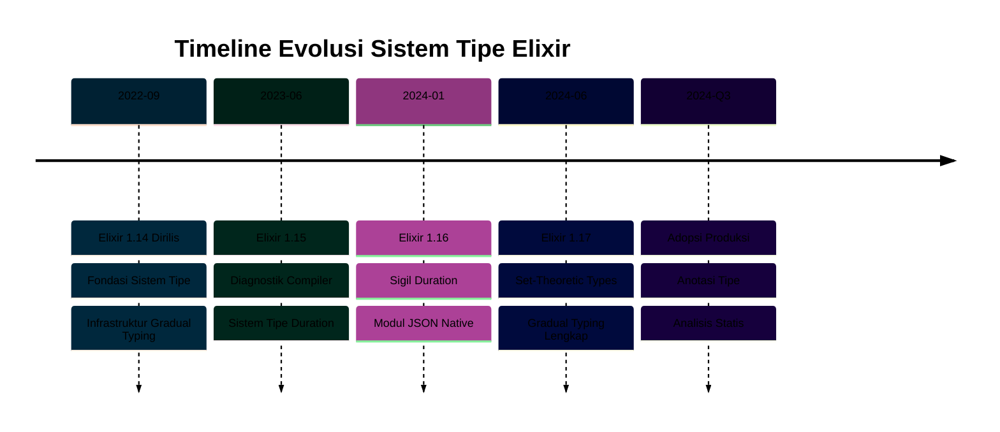

## Ringkasan Rilis

Elixir 1.14, dirilis pada September 2022, merupakan **RILIS TONGGAK** dalam evolusi Elixir. Rilis ini membangun fondasi untuk sistem tipe bertahap Elixir, memperkenalkan infrastruktur dan prinsip yang akan berkembang melalui rilis selanjutnya (1.15, 1.16, 1.17).

Rilis ini menghadirkan tiga fitur transformatif yang memperluas kemampuan Elixir di area kritis:

- **Fondasi Sistem Tipe**: Infrastruktur tipe set-theoretic bertahap yang menjadi dasar type checking waktu kompilasi
- **Makro Debugging dbg/2**: Debugging interaktif dengan inspeksi kode dan visualisasi pipeline
- **PartitionSupervisor**: Partisi proses dinamis untuk skalabilitas horizontal

Rilis ini secara fundamental mengubah bagaimana Elixir mendekati keamanan tipe sambil mempertahankan kompatibilitas mundur dan sifat dinamis bahasa.



## Fondasi Sistem Tipe

Elixir 1.14 memperkenalkan infrastruktur untuk **tipe set-theoretic bertahap**, pendekatan canggih yang memungkinkan pengecekan tipe statis tanpa mengorbankan fleksibilitas dinamis Elixir.

**Gradual typing** berarti tipe bersifat opsional. Anda dapat menambahkan anotasi tipe di mana mereka memberikan nilai (API publik, logika bisnis kritis) sambil membiarkan kode implementasi internal tanpa anotasi. Compiler memeriksa kode beranotasi secara statis tetapi memungkinkan pengetikan dinamis di tempat lain.

**Set-theoretic types** memperlakukan tipe sebagai set nilai dengan operasi union, intersection, dan negation. Fondasi matematis ini mendukung penalaran tipe yang presisi tentang pattern matching dan guards Elixir.

### Infrastruktur Sistem Tipe

```elixir
# Module attribute untuk konfigurasi sistem tipe
defmodule SaldoAkun do
  # Infrastruktur sistem tipe (1.14)
  # Anotasi tipe aktual hadir di 1.17

  @doc """
  Menghitung saldo tersedia setelah transaksi pending.
  """
  def saldo_tersedia(saldo, transaksi_pending) do
    # => saldo adalah total akun (mis., 10000.00)
    # => transaksi_pending adalah list jumlah (mis., [250.00, 100.00])
    Enum.reduce(transaksi_pending, saldo, fn transaksi, acc ->
      # => transaksi adalah jumlah pending (mis., 250.00)
      # => acc adalah saldo berjalan (mis., 10000.00)
      acc - transaksi
      # => Hasil: saldo berkurang (mis., 9750.00)
    end)
    # => Mengembalikan: saldo tersedia final (mis., 9650.00)
  end
end
```

Fondasi ini mencakup infrastruktur compiler untuk:

- **Type inference**: Menurunkan tipe dari kode tanpa anotasi
- **Type checking**: Memvalidasi tipe beranotasi terhadap tipe yang disimpulkan
- **Error reporting**: Pesan jelas ketika tipe tidak cocok
- **Gradual guarantee**: Kode bertipe dan tanpa tipe berinteroperasi dengan aman

### Mengapa Ini Adalah Tonggak

Rilis Elixir sebelumnya meningkatkan kemampuan yang ada secara incremental. Versi 1.14 memperkenalkan arah yang sepenuhnya baru untuk bahasa: pengecekan tipe waktu kompilasi. Pergeseran filosofis ini menempatkan Elixir bersama TypeScript dan Typed Racket sebagai pelopor dalam gradual typing.

Pekerjaan sistem tipe yang dimulai di 1.14 berlanjut melalui empat rilis:

- **1.14**: Infrastruktur dan prinsip
- **1.15**: Diagnostik compiler dan tipe Duration
- **1.16**: Sigil duration dan modul JSON dengan tipe
- **1.17**: Implementasi tipe set-theoretic lengkap

Komitmen multi-rilis ini menunjukkan pentingnya strategis fitur untuk masa depan Elixir.

## Makro Debugging dbg/2

Makro `dbg/2` merevolusi debugging Elixir dengan menyediakan inspeksi kode interaktif dengan setup minimal. Ini menggantikan pola debugging umum menambahkan pemanggilan `IO.inspect/2` di seluruh kode.

### Debugging Dasar

```elixir
# Hitung pembayaran bulanan pinjaman
pokok = 100000.00
# => pokok adalah 100.000,00 (jumlah pinjaman)

bunga = 0.05
# => bunga adalah 0.05 (5% bunga tahunan)

tahun = 30
# => tahun adalah 30 (jangka waktu pinjaman)

bayar_bulanan =
  pokok
  |> dbg()
  # => Mencetak: pokok = 100000.00
  |> Kernel.*(bunga / 12)
  # => Mencetak: result = 416.67 (bunga bulanan)
  |> dbg()
  # => Menampilkan perhitungan intermediate
  |> Kernel.*(1 + bunga / 12) ** (tahun * 12)
  # => Perhitungan bunga majemuk
  |> dbg()
  # => Mencetak: result = 1853.04
  |> Kernel./((1 + bunga / 12) ** (tahun * 12) - 1)
  # => Formula amortisasi
  # => Mencetak: bayar_bulanan = 536.82
```

### Debugging Pipeline

Makro unggul dalam debugging pipeline dengan menampilkan setiap langkah transformasi:

```elixir
# Proses batch transaksi
transaksi = [
  # => List map transaksi
  %{jumlah: 100.00, tipe: :debit, akun: "12345"},
  %{jumlah: 50.00, tipe: :kredit, akun: "12345"},
  %{jumlah: 200.00, tipe: :debit, akun: "12345"}
]

saldo_akun =
  transaksi
  |> dbg()
  # => Mencetak: transaksi = [%{jumlah: 100.00, ...}, ...]
  # => Menampilkan struktur list penuh
  |> Enum.filter(&(&1.tipe == :debit))
  # => Filter ke transaksi debit saja
  # => Mencetak: result = [%{jumlah: 100.00, ...}, %{jumlah: 200.00, ...}]
  |> dbg()
  # => Menampilkan list terfilter
  |> Enum.map(&Map.get(&1, :jumlah))
  # => Ekstrak jumlah
  # => Mencetak: result = [100.00, 200.00]
  |> Enum.sum()
  # => Jumlahkan jumlah debit
  # => Mencetak: saldo_akun = 300.00
```

### Pertimbangan Produksi

Makro `dbg/2` mencakup fitur keamanan untuk lingkungan produksi:

- **Aktivasi kondisional**: Aktifkan hanya di development/staging
- **Overhead performa**: Minimal ketika dinonaktifkan
- **Kontrol output**: Konfigurasi level verbosity
- **Integrasi IEx**: Bekerja mulus di interactive shell

```elixir
# Konfigurasi perilaku dbg/2
# Di config/dev.exs
config :elixir, :dbg, enabled: true

# Di config/prod.exs
config :elixir, :dbg, enabled: false
# => dbg/2 menjadi no-op di produksi
```

## PartitionSupervisor

`PartitionSupervisor` memungkinkan skalabilitas horizontal dengan mempartisi proses secara dinamis melintasi multiple supervisor. Ini mengatasi bottleneck umum di mana satu supervisor mengelola ribuan children menjadi kendala performa.

### Pola Skalabilitas

```elixir
# Pendekatan tradisional: bottleneck supervisor tunggal
children = [
  {DynamicSupervisor, name: ProsesTransaksi}
  # => Supervisor tunggal untuk semua transaksi
  # => Menjadi bottleneck pada volume tinggi
]

# Pendekatan PartitionSupervisor: supervisi terdistribusi
children = [
  {PartitionSupervisor,
   child_spec: DynamicSupervisor,
   # => Setiap partisi mendapat DynamicSupervisor sendiri
   name: ProsesTransaksi,
   # => Nama global untuk routing
   partitions: 10}
   # => Membuat 10 supervisor (satu per scheduler secara default)
   # => Mendistribusikan beban melintasi multiple proses
]
```

### Contoh Pemrosesan Transaksi

```elixir
defmodule AplikasiBank.Application do
  use Application

  def start(_type, _args) do
    children = [
      # Partition supervisor untuk prosesor transaksi
      {PartitionSupervisor,
       child_spec: WorkerTransaksi,
       # => Spesifikasi child untuk workers
       name: PartisiTransaksi,
       # => Nama global untuk routing
       partitions: System.schedulers_online()}
       # => Satu partisi per core CPU
       # => Memaksimalkan pemrosesan paralel
    ]

    opts = [strategy: :one_for_one, name: AplikasiBank.Supervisor]
    # => strategi supervisor: restart children yang gagal secara independen
    # => name untuk proses supervisor
    Supervisor.start_link(children, opts)
    # => Mengembalikan {:ok, pid} ketika supervisor start
  end
end
```

### Routing Proses

```elixir
# Start proses di partisi yang sesuai
def proses_transaksi(id_akun, jumlah) do
  # => id_akun adalah "ACC12345"
  # => jumlah adalah 1000.00

  # Route ke partisi berdasarkan hash id_akun
  kunci_partisi = {PartisiTransaksi, id_akun}
  # => Membuat tuple untuk routing PartitionSupervisor
  # => id_akun di-hash untuk menentukan partisi

  DynamicSupervisor.start_child(
    {:via, PartitionSupervisor, kunci_partisi},
    # => Route ke partisi spesifik berdasarkan id_akun
    {WorkerTransaksi, [id_akun, jumlah]}
    # => Child spec dengan argumen inisialisasi
  )
  # => Mengembalikan {:ok, pid} ketika worker start
  # => Worker berjalan di partisi yang cocok dengan id_akun
end
```

### Karakteristik Performa

**Manfaat**:

- **Mengurangi contention**: Multiple supervisor menangani request secara konkuren
- **Utilisasi CPU**: Partisi selaras dengan jumlah scheduler untuk distribusi optimal
- **Routing dapat diprediksi**: Key yang sama route ke partisi yang sama (penting untuk proses terkait)
- **Isolasi fault**: Kegagalan di satu partisi tidak memengaruhi yang lain

**Trade-off**:

- **Overhead kompleksitas**: Logika routing tambahan
- **Penggunaan memori**: Multiple proses supervisor
- **Distribusi non-uniform**: Routing berbasis hash dapat membuat beban tidak merata

## Diffing Pattern ExUnit

ExUnit mendapat diff pattern matching canggih yang membuat kegagalan test jauh lebih informatif. Ketika pattern match gagal, Anda melihat dengan tepat bagian mana yang cocok dan mana yang tidak.

### Perbandingan Sebelum dan Sesudah

```elixir
# Assertion test
test "pembuatan akun mengembalikan struktur yang diharapkan" do
  akun = AplikasiBank.buat_akun("John Doe", 1000.00)
  # => akun adalah result map dari buat_akun/2

  assert %{
    id: _,
    # => Mengharapkan field id (nilai apa pun)
    nama: "John Doe",
    # => Mengharapkan nama cocok persis
    saldo: 1000.00,
    # => Mengharapkan saldo cocok persis
    status: :aktif,
    # => Mengharapkan status aktif
    dibuat_pada: %DateTime{}
    # => Mengharapkan struct DateTime
  } = akun
  # => Pattern match terhadap akun yang dikembalikan
end

# Output kegagalan sebelum 1.14:
# ** (MatchError) no match of right hand side value: %{...}

# Output kegagalan setelah 1.14:
# Assertion with = failed
# code:  assert %{id: _, nama: "John Doe", saldo: 1000.00, ...} = akun
# left:  %{id: _, nama: "John Doe", saldo: 1000.00, status: :aktif, ...}
# right: %{id: "ACC123", nama: "John Doe", saldo: 500.00, status: :pending, ...}
#
# Pattern matching failed:
#   - saldo: expected 1000.00, got 500.00
#   - status: expected :aktif, got :pending
```

### Diff Struktur Bersarang

```elixir
# Pattern bersarang kompleks
test "pemrosesan transaksi membuat audit trail yang benar" do
  result = AplikasiBank.proses_transaksi(
    # => Memproses transaksi dengan detail lengkap
    id_akun: "ACC123",
    jumlah: 500.00,
    tipe: :debit
  )
  # => result adalah result transaksi dengan map bersarang

  assert %{
    status: :sukses,
    transaksi: %{
      # => Detail transaksi bersarang
      id: _,
      jumlah: 500.00,
      tipe: :debit
    },
    akun: %{
      # => State akun bersarang
      saldo: 4500.00,
      # => Saldo yang diharapkan setelah debit
      status: :aktif
    }
  } = result
  # => Match terhadap struktur result bersarang

  # Kegagalan menampilkan path tepat ke ketidakcocokan:
  # Pattern matching failed at akun.saldo:
  #   expected: 4500.00
  #   got: 4250.00
  # => Menunjukkan ketidakcocokan field bersarang
end
```

### Diff Koleksi

```elixir
# List pattern matching
test "riwayat transaksi berisi entri yang diharapkan" do
  riwayat = AplikasiBank.ambil_riwayat_transaksi("ACC123")
  # => riwayat adalah list map transaksi

  assert [
    %{tipe: :kredit, jumlah: 1000.00},
    # => Transaksi pertama yang diharapkan
    %{tipe: :debit, jumlah: 500.00},
    # => Transaksi kedua yang diharapkan
    %{tipe: :debit, jumlah: 250.00}
    # => Transaksi ketiga yang diharapkan
  ] = riwayat
  # => Match struktur list

  # Kegagalan menampilkan perbandingan elemen-per-elemen:
  # List matching failed at index 1:
  #   expected: %{tipe: :debit, jumlah: 500.00}
  #   got: %{tipe: :kredit, jumlah: 500.00}
  # Ketidakcocokan field tipe: :debit vs :kredit
  # => Menampilkan elemen list tepat dengan ketidakcocokan
end
```

## Perbaikan Lainnya

### Sintaks Slicing

Sintaks `..//` baru memungkinkan slicing koleksi berbasis step:

```elixir
# Saldo akun harian (30 hari)
saldo = [
  # => List nilai saldo harian
  1000.00, 1025.00, 1050.00, 1075.00, 1100.00,
  # => Hari 1-5
  1125.00, 1150.00, 1175.00, 1200.00, 1225.00,
  # => Hari 6-10
  # ... berlanjut ke hari 30
]

# Ekstrak saldo mingguan (setiap hari ke-7)
mingguan = Enum.slice(saldo, 0..-1//7)
# => Mulai di index 0, berakhir di -1 (terakhir), step 7
# => Mengembalikan: [1000.00, 1175.00, 1350.00, 1525.00, 1700.00]
# => Menampilkan saldo setiap 7 hari

# Ekstrak transaksi index genap
transaksi = [250.00, 100.00, 50.00, 300.00, 75.00, 200.00]
# => List jumlah transaksi

index_genap = Enum.slice(transaksi, 0..-1//2)
# => Step 2 memilih setiap elemen lainnya
# => Mengembalikan: [250.00, 50.00, 75.00]
# => Elemen pada index 0, 2, 4
```

### Peningkatan Protokol Enumerable

Protokol Enumerable menerima optimasi untuk dataset besar:

```elixir
# Pemrosesan dataset besar yang efisien
stream_transaksi =
  File.stream!("transaksi.csv")
  # => Membuka file sebagai stream (evaluasi lazy)
  |> Stream.map(&parse_transaksi/1)
  # => Parse setiap baris secara lazy
  |> Stream.filter(&(&1.jumlah > 1000.00))
  # => Filter transaksi nilai tinggi secara lazy
  # => Tidak ada memori dialokasikan sampai konsumsi

# Optimasi 1.14 mengurangi overhead memori
transaksi_besar = Enum.take(stream_transaksi, 100)
# => Ambil 100 transaksi yang cocok pertama
# => Berhenti memproses setelah 100 ditemukan (efisien)
# => Versi sebelumnya mungkin memproses seluruh file
```

### Pesan Error yang Lebih Baik

Pesan error compiler menjadi lebih presisi dan actionable:

```elixir
# Pattern match tidak valid
def hitung_bunga({:ok, saldo}, bunga) do
  saldo * bunga
end

hitung_bunga(:error, 0.05)
# => Melewatkan atom :error bukan tuple

# Pesan error yang ditingkatkan (1.14):
# ** (FunctionClauseError) no function clause matching in hitung_bunga/2
#
# Function clause:
#     def hitung_bunga({:ok, saldo}, bunga)
#                      ^^^^^^^^^^^^^^
# Attempted call:
#     hitung_bunga(:error, 0.05)
#                  ^^^^^^
#
# The call failed because:
#   - Argumen pertama mengharapkan tuple {:ok, saldo}
#   - Menerima atom :error sebagai gantinya
#
# Hint: Apakah Anda bermaksud melewatkan {:ok, saldo} atau {:error, alasan}?
# => Menampilkan lokasi ketidakcocokan tepat
# => Menyediakan saran konkret
```

## Mengapa Ini Adalah Rilis Tonggak

Elixir 1.14 memperkenalkan pergeseran fundamental dalam filosofi bahasa. Rilis sebelumnya meningkatkan kemampuan yang ada; rilis ini membangun wilayah yang sepenuhnya baru: pengecekan tipe waktu kompilasi.

**Pentingnya strategis**:

- **Fondasi sistem tipe**: Infrastruktur untuk gradual typing yang mencakup empat rilis
- **Ekspansi paradigma**: Menambahkan analisis statis tanpa mengorbankan fleksibilitas dinamis
- **Future-proofing**: Memposisikan Elixir untuk codebase yang lebih besar dan skalabilitas tim
- **Arah komunitas**: Menandakan komitmen pada keamanan tipe sebagai fitur bahasa inti

**Nilai praktis langsung**:

- **Makro dbg/2**: Secara dramatis meningkatkan pengalaman debugging
- **PartitionSupervisor**: Mengatasi bottleneck skalabilitas nyata
- **Diffing ExUnit**: Membuat kegagalan test lebih actionable
- **Kompatibilitas mundur**: Semua perbaikan bekerja dengan kode yang ada

Rilis ini menunjukkan kedewasaan Elixir: fitur baru utama yang memperluas kemampuan sambil mempertahankan prinsip inti bahasa tentang kesederhanaan dan pengalaman developer.

## Panduan Upgrade

### Migrasi dari 1.13

Elixir 1.14 mempertahankan kompatibilitas mundur yang kuat. Sebagian besar codebase upgrade tanpa perubahan.

**Langkah verifikasi**:

```bash
# Update mix.exs
# Ubah dari:
elixir: "~> 1.13"
# Ke:
elixir: "~> 1.14"

# Update dependencies
mix deps.update --all

# Jalankan test suite
mix test

# Periksa peringatan deprecation
mix compile --warnings-as-errors
```

**Strategi adopsi**:

1. **Coba dbg/2 di development**: Ganti pemanggilan `IO.inspect/2` dalam sesi debugging
2. **Evaluasi PartitionSupervisor**: Identifikasi supervisor throughput tinggi yang akan mendapat manfaat
3. **Review output ExUnit**: Amati pesan kegagalan test yang diperbaiki di CI
4. **Monitor evolusi sistem tipe**: Ikuti rilis 1.15, 1.16, 1.17 untuk sistem tipe penuh

**Breaking changes** (minimal):

- Tidak ada untuk aplikasi khas
- Beberapa edge case dalam metaprogramming mungkin memerlukan penyesuaian
- List lengkap di catatan rilis resmi

### Persiapan untuk Tipe

Fondasi sistem tipe Elixir 1.14 mempersiapkan untuk anotasi tipe masa depan (tersedia di 1.17):

**Praktik dokumentasi** (bermanfaat sekarang, diperlukan nanti):

```elixir
# Dokumentasikan tipe di @doc (1.14)
@doc """
Menghitung bunga majemuk.

## Parameter
- pokok: Decimal (jumlah pinjaman)
- bunga: Float (tingkat bunga tahunan, mis., 0.05 untuk 5%)
- tahun: Integer (jangka waktu pinjaman)

## Returns
- Decimal (jumlah total setelah bunga)
"""
def bunga_majemuk(pokok, bunga, tahun) do
  # Implementasi
end

# Masa depan (1.17) - anotasi tipe aktual:
@spec bunga_majemuk(Decimal.t(), float(), integer()) :: Decimal.t()
def bunga_majemuk(pokok, bunga, tahun) do
  # Implementasi
end
```

**Persiapkan codebase**:

- **Dokumentasikan signature fungsi dengan jelas**: Membuat anotasi tipe masa depan lebih mudah
- **Gunakan struktur data konsisten**: Menyederhanakan type inference
- **Minimalkan kode dinamis**: Sistem tipe bekerja terbaik dengan pola yang dapat diprediksi
- **Tambahkan anotasi @spec secara bertahap**: Opsional di 1.14, menjadi dapat diperiksa di 1.17

## Referensi

- [Pengumuman Rilis Elixir 1.14](https://elixir-lang.org/blog/2022/09/01/elixir-v1-14-0-released/)
- [Visi Sistem Tipe](https://elixir-lang.org/blog/2023/06/19/elixir-v1-15-0-released/) - Evolusi melalui 1.15
- [Set-Theoretic Types Paper](https://arxiv.org/abs/2306.06391) - Fondasi akademis
- [Dokumentasi dbg/2](https://hexdocs.pm/elixir/Kernel.html#dbg/2)
- [Dokumentasi PartitionSupervisor](https://hexdocs.pm/elixir/PartitionSupervisor.html)

---

**Terakhir Diperbarui**: 2025-02-05
**Versi Elixir**: 1.14+ (minimum), 1.17.x (stabil terbaru)
