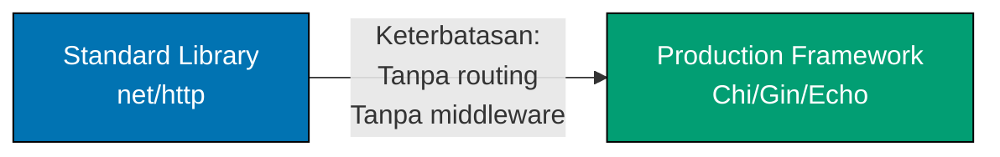

**Siap membangun sistem Go untuk produksi?** Panduan In-the-Field ini mengajarkan pola produksi dengan mengikuti prinsip **Standard Library First**, memastikan Anda memahami dasar-dasar sebelum framework.

## Apa Itu "In the Field"?

Panduan In-the-Field mengajarkan pengembangan Go produksi melalui pola implementasi dunia nyata. Berbeda dengan tutorial by-example yang mencapai cakupan bahasa 95%, panduan ini fokus pada skenario produksi spesifik menggunakan framework, library, dan pola enterprise standar industri.

**Perbedaan kunci**: By-example mengajarkan Go melalui kode. In-the-field mengajarkan **cara membangun sistem produksi** dengan Go.

## Filosofi Standard Library First

Standard library Go sangat komprehensif. Berbeda dengan bahasa lain di mana framework wajib, Go menyediakan alat siap produksi built-in untuk:

- **HTTP servers** (`net/http`) - Web server kelas produksi tanpa framework
- **Akses database** (`database/sql`) - Eksekusi query, primitif connection pooling
- **Penanganan JSON** (`encoding/json`) - Serialisasi dan deserialisasi
- **Testing** (package `testing`) - Unit testing, benchmarking, fuzzing
- **Concurrency** (goroutines, channels) - Primitif concurrency native

**Pendekatan kami**: Pelajari standard library terlebih dahulu, pahami kapan tidak cukup, lalu adopsi framework dengan pengetahuan penuh tentang trade-off.

### Mengapa Ini Penting

1. **Pemahaman fondasi** - Kenali primitif sebelum abstraksi
2. **Pemilihan framework yang terinformasi** - Pahami masalah yang diselesaikan framework
3. **Kesadaran masalah** - Lihat kompleksitas implementasi manual
4. **Independensi framework** - Pengetahuan inti berpindah lintas alat
5. **Pemahaman trade-off** - Kenali kapan framework menambah nilai vs overhead
6. **Kemampuan debugging** - Pahami apa yang dilakukan framework di balik layar
7. **Keterampilan optimasi** - Kenali bottleneck performa dan peluang optimasi
8. **Pencegahan bencana produksi** - Hindari connection leak, goroutine leak, masalah memori dari penyalahgunaan framework

## Organisasi Panduan

36 panduan diorganisir ke dalam 7 kategori:

### 1. Mulai Di Sini (2 panduan)

Panduan fondasi yang mencakup best practice dan anti-pattern produksi:

- [Best Practices](/id/belajar/software-engineering/programming-languages/golang/in-the-field/best-practices) - Pola dan idiom produksi
- [Anti Patterns](/id/belajar/software-engineering/programming-languages/golang/in-the-field/anti-patterns) - Kesalahan umum dan code smell

### 2. Konsep Inti (6 panduan)

Konsep Go fundamental untuk sistem produksi:

- Type System - Type safety dan type parameter (generics)
- Composition Patterns - Struct embedding dan composition
- Concurrency and Goroutines - Pola concurrency produksi
- Error Handling - Error wrapping, custom error, sentinel error
- Interface Design - Prinsip desain interface
- Generics - Type parameter dalam kode produksi

### 3. Integrasi (7 panduan)

Integrasi dengan sistem eksternal dan protokol:

- HTTP Services - `net/http` → Chi/Gin/Echo
- JSON API Integration - Klien dan server RESTful API
- SQL Databases - `database/sql` → sqlx → GORM
- NoSQL Databases - Integrasi MongoDB, Redis, Cassandra
- Grpc Protobuf - Layanan gRPC dan Protocol Buffers
- Messaging - Integrasi Kafka, RabbitMQ, NATS
- Testing Strategies - Testing → Testify → integration test

### 4. Pengembangan Aplikasi (5 panduan)

Membangun aplikasi siap produksi:

- Cli Applications - Alat CLI dengan Cobra
- Configuration - Hardcoded → env vars → Viper
- Logging Observability - `log` → Zap/Zerolog → OpenTelemetry
- Package Organization - Pola struktur proyek
- Code Generation - `go generate`, protobuf, stringer

### 5. Arsitektur (3 panduan)

Pola arsitektur enterprise:

- [Clean Architecture](/id/belajar/software-engineering/programming-languages/golang/in-the-field/clean-architecture) - Dependency inversion, arsitektur heksagonal
- [Domain Driven Design](/id/belajar/software-engineering/programming-languages/golang/in-the-field/domain-driven-design) - Pola DDD dalam Go
- [Microservices Patterns](/id/belajar/software-engineering/programming-languages/golang/in-the-field/microservices-patterns) - Komunikasi layanan, discovery, resilience

### 6. Produksi (7 panduan)

Pola siap produksi untuk reliabilitas, keamanan, dan performa:

- Authentication Authorization - Basic auth → JWT → OAuth2/OIDC
- Security Best Practices - Validasi input, secrets, crypto
- Caching - In-memory → Redis → distributed caching
- Resilience Patterns - Circuit breaker, retry, timeout
- Performance Optimization - Profiling, benchmarking, tuning
- Memory Management - GC tuning, memory profiling
- Cloud Native Patterns - Aplikasi 12-factor, service mesh

### 7. DevOps (6 panduan)

Tooling pengembangan dan deployment:

- Go Modules - Manajemen dependensi
- Build Compilation - Build tag, cross-compilation, optimasi
- Testing Qa - Table-driven test, mock, coverage
- Docker Containerization - Multi-stage build, minimal image
- Ci Cd Pipelines - GitHub Actions, GitLab CI, testing pipeline

## Jalur Pembelajaran Progresif

Setiap panduan mengikuti struktur ini:

1. **Why It Matters** - Konteks produksi dan skenario dunia nyata
2. **Standard Library First** - Pendekatan built-in dengan contoh teranotasi
3. **Limitations** - Kapan standard library tidak cukup untuk produksi
4. **Production Framework** - Solusi standar industri dengan contoh
5. **Trade-offs** - Tabel perbandingan jelas (kompleksitas, kurva belajar, maintenance)
6. **Best Practices** - Panduan actionable dengan contoh kode

### Contoh Progresi (HTTP Services)



**Standard Library**: `net/http` menyediakan HTTP server, tetapi routing dan middleware manual.

**Keterbatasan**: Tidak ada pola routing built-in, rantai middleware memerlukan implementasi manual, penanganan context verbose.

**Production Framework**: Chi (ringan), Gin (performa), atau Echo (fitur) menyediakan routing, middleware, dan manajemen context yang lebih mudah.

**Trade-off**: Pelajari pola `net/http` terlebih dahulu untuk memahami apa yang diabstraksikan framework.

## Standar Anotasi Kode

Semua contoh kode mempertahankan **densitas anotasi 1.0-2.25** (baris komentar per baris kode) menggunakan notasi `// =>` untuk menjelaskan nilai, state, dan output.

**Contoh**:

```go
// HTTP server standard library (net/http)
mux := http.NewServeMux()                   // => Buat request multiplexer (router)
                                            // => Tipe: *http.ServeMux
mux.HandleFunc("/", func(w http.ResponseWriter, r *http.Request) {
    w.Write([]byte("Hello World"))          // => Tulis response body
})                                          // => Closure menangkap mux
server := &http.Server{                     // => Konfigurasi HTTP server
    Addr:    ":8080",                       // => Listen pada port 8080
    Handler: mux,                           // => Gunakan mux untuk routing
}                                           // => Tipe: *http.Server
server.ListenAndServe()                     // => Blok, mulai server
                                            // => Return error jika gagal
```

## Siapa Yang Harus Menggunakan Panduan Ini?

- **Developer Go yang membangun sistem produksi** - Pelajari pola industri
- **Tim yang mengadopsi Go untuk layanan backend** - Tetapkan konvensi produksi
- **Developer yang transisi dari bahasa lain** - Pahami ekosistem produksi Go
- **Siapa pun yang mencari pola Go siap produksi** - Pemilihan framework, trade-off, best practice

## Pengetahuan Prasyarat

Panduan ini mengasumsikan keakraban dengan fundamental Go. Jika Anda baru mengenal Go, mulai dengan:

- Initial Setup - Cakupan Go 0-5% (instalasi, tooling)
- Quick Start - Cakupan Go 5-30% (sintaks dasar, program pertama)
- By Example - Cakupan Go 75-95% (85+ contoh teranotasi)

**Minimum**: Selesaikan Quick Start (cakupan 5-30%) sebelum memulai panduan In-the-Field.

**Rekomendasi**: Selesaikan By Example (cakupan 75-95%) untuk fondasi komprehensif.

## Pendekatan Pembelajaran

**Bukan tutorial komprehensif**: Panduan ini menargetkan skenario produksi spesifik, bukan pembangunan keterampilan berurutan. Lompat ke topik relevan berdasarkan kebutuhan proyek Anda.

**Pembelajaran code-first**: Contoh berdiri sendiri dan dapat dijalankan. Salin, eksekusi, modifikasi, eksperimen.

**Pragmatisme framework**: Kami mengajarkan standard library terlebih dahulu, tetapi merekomendasikan framework ketika mereka memberikan nilai produksi yang jelas.

## Referensi Konvensi

Panduan ini mengikuti [In-the-Field Convention](https://github.com/wahidyankf/open-sharia-enterprise/blob/main/governance/conventions/tutorials/in-the-field.md), yang mendefinisikan standar panduan implementasi produksi.
