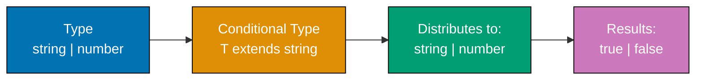
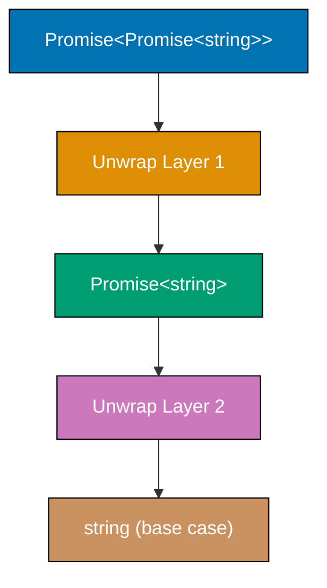
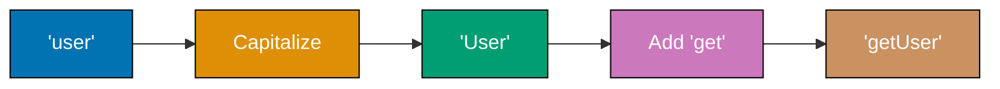

Kuasai TypeScript tingkat lanjut melalui 34 contoh expert-level yang mencakup type-level programming, compiler internals, optimasi performa, dan pola integrasi framework.

## Contoh 52: Advanced Conditional Types with Distribution

Conditional types mendistribusikan union secara otomatis. Memahami distribution membuka transformasi type yang powerful.



**Code**:

```typescript
// DISTRIBUTIVE CONDITIONAL TYPE
type ToArray<T> = T extends any ? T[] : never; // => Distributes over union
// => Applied to each union member

type StringOrNumber = string | number;
type ArrayTypes = ToArray<StringOrNumber>; // => Type: string[] | number[]
// => NOT (string | number)[]

// NON-DISTRIBUTIVE CONDITIONAL TYPE
type ToArrayNonDist<T> = [T] extends [any] ? T[] : never; // => Tuple wrapping prevents distribution

type ArrayTypesNonDist = ToArrayNonDist<StringOrNumber>; // => Type: (string | number)[]

// FILTERING UNION WITH DISTRIBUTION
type ExtractStrings<T> = T extends string ? T : never; // => Keep only strings

type Mixed = string | number | boolean;
type OnlyStrings = ExtractStrings<Mixed>; // => Type: string

// EXCLUDE TYPE (BUILT-IN)
type Exclude<T, U> = T extends U ? never : T; // => Remove U from T union

type WithoutNumber = Exclude<string | number | boolean, number>; // => Type: string | boolean

// EXTRACT TYPE (BUILT-IN)
type Extract<T, U> = T extends U ? T : never; // => Keep only T that extends U

type OnlyNumber = Extract<string | number | boolean, number>; // => Type: number

// CONDITIONAL TYPE WITH INFER
type UnwrapArray<T> = T extends (infer U)[] ? U : T; // => Extract array element type

type Numbers = UnwrapArray<number[]>; // => Type: number
type NotArray = UnwrapArray<string>; // => Type: string

// MULTIPLE INFER
type UnwrapPromise<T> = T extends Promise<infer U> ? U : T;

type Nested = Promise<Promise<string>>;
type First = UnwrapPromise<Nested>; // => Type: Promise<string> (one level)
type Second = UnwrapPromise<First>; // => Type: string (recursive application)
```

**Poin Kunci**: Conditional types mendistribusikan union secara default. Bungkus type dalam tuple `[T]` untuk mencegah distribution. Gunakan distribution untuk filtering dan transformasi union members.

**Mengapa Penting**: Distribution memungkinkan transformasi union yang powerful. `Extract` dan `Exclude` dibangun di atas distribution. Type-level filtering menghilangkan definisi type manual. Framework authors menggunakan distribution untuk generic type utilities. Pola ini fundamental untuk advanced TypeScript type programming.

## Contoh 53: Recursive Conditional Types

Recursive types memungkinkan type-level iteration atas struktur kompleks. TypeScript 4.1+ mendukung recursive conditional types tanpa batasan kedalaman.



**Code**:

```typescript
// RECURSIVE PROMISE UNWRAPPING
type DeepUnwrapPromise<T> =
  T extends Promise<infer U> // => Check if T is Promise
    ? DeepUnwrapPromise<U> // => Recursive call with unwrapped type
    : T; // => Base case: return T

type Nested = Promise<Promise<Promise<string>>>;
type Unwrapped = DeepUnwrapPromise<Nested>; // => Type: string (all layers unwrapped)

// RECURSIVE ARRAY FLATTENING
type DeepFlatten<T> =
  T extends Array<infer U> // => Check if T is array
    ? DeepFlatten<U> // => Recursively flatten element type
    : T; // => Base case: return T

type NestedArray = number[][][];
type Flat = DeepFlatten<NestedArray>; // => Type: number (fully flattened)

// RECURSIVE OBJECT KEY PATHS
type DeepKeyPath<T> = T extends object // => Check if T is object
  ? {
      [K in keyof T]: K extends string // => Iterate over keys
        ? T[K] extends object // => Check if value is object
          ? `${K}` | `${K}.${DeepKeyPath<T[K]>}` // => Recursive path building
          : `${K}` // => Leaf key
        : never;
    }[keyof T]
  : never;

type User = {
  name: string;
  address: {
    street: string;
    city: string;
    coordinates: {
      lat: number;
      lng: number;
    };
  };
};

type UserPaths = DeepKeyPath<User>; // => Type: "name" | "address" | "address.street" | "address.city" | "address.coordinates" | "address.coordinates.lat" | "address.coordinates.lng"

// RECURSIVE JSON TYPE
type JSONValue =
  | string
  | number
  | boolean
  | null
  | JSONValue[] // => Recursive: array of JSONValue
  | { [key: string]: JSONValue }; // => Recursive: object with JSONValue values

const data: JSONValue = {
  name: "Alice",
  age: 30,
  tags: ["developer", "typescript"],
  nested: {
    deep: {
      value: 42,
    },
  },
}; // => Valid: matches recursive structure
```

**Poin Kunci**: Recursive conditional types memungkinkan transformasi type mendalam. TypeScript 4.1+ menghilangkan batasan kedalaman rekursi. Gunakan base cases untuk mencegah infinite recursion.

**Mengapa Penting**: Recursive types mendukung transformasi objek mendalam di ORM, generator skema GraphQL, dan library form type-safe. React Hook Form menggunakan recursive types untuk validasi form bersarang. Prisma menggunakan rekursi untuk deep relation types. Pola ini esensial untuk utility type tingkat framework.

## Contoh 54: Template Literal Types - Advanced Patterns

Template literal types memungkinkan manipulasi string tingkat type. Kombinasikan dengan mapped types dan conditional types untuk transformasi powerful.



**Code**:

```typescript
// EVENT NAME GENERATION
type EventName<T extends string> = `on${Capitalize<T>}Change`; // => Template + built-in utility

type UserEvent = EventName<"user">; // => Type: "onUserChange"
type EmailEvent = EventName<"email">; // => Type: "onEmailChange"

// GETTER/SETTER GENERATION
type Getters<T> = {
  [K in keyof T as `get${Capitalize<string & K>}`]: () => T[K]; // => Mapped type with template literal key
};

type Setters<T> = {
  [K in keyof T as `set${Capitalize<string & K>}`]: (value: T[K]) => void;
};

type Model = {
  name: string;
  age: number;
};

type ModelGetters = Getters<Model>; // => Type: { getName: () => string; getAge: () => number }
type ModelSetters = Setters<Model>; // => Type: { setName: (value: string) => void; setAge: (value: number) => void }

// CSS PROPERTY GENERATION
type CSSProperty<T extends string> = T | `${T}-top` | `${T}-right` | `${T}-bottom` | `${T}-left`; // => Union of variants

type Margin = CSSProperty<"margin">; // => Type: "margin" | "margin-top" | "margin-right" | "margin-bottom" | "margin-left"
type Padding = CSSProperty<"padding">; // => Type: "padding" | "padding-top" | "padding-right" | "padding-bottom" | "padding-left"

// HTTP METHOD + PATH TYPE
type HTTPMethod = "GET" | "POST" | "PUT" | "DELETE";
type Endpoint = `/api/${string}`;
type Request = `${HTTPMethod} ${Endpoint}`; // => Combines method and path

const validRequest: Request = "GET /api/users"; // => Valid
const validPost: Request = "POST /api/users/123"; // => Valid
// const invalid: Request = "INVALID /api/users"; // => Error: "INVALID" not in HTTPMethod

// EXTRACT ROUTE PARAMETERS
type ExtractParams<T extends string> = T extends `${infer _Start}:${infer Param}/${infer Rest}` // => Match :param/rest
  ? Param | ExtractParams<`/${Rest}`> // => Extract param and recurse
  : T extends `${infer _Start}:${infer Param}` // => Match :param at end
    ? Param // => Extract final param
    : never; // => No params

type Route = "/users/:userId/posts/:postId";
type Params = ExtractParams<Route>; // => Type: "userId" | "postId"
```

**Poin Kunci**: Template literal types memungkinkan operasi string tingkat type. Kombinasikan dengan mapped types untuk generasi API surface otomatis. Gunakan rekursi untuk ekstraksi parameter.

**Mengapa Penting**: Template literals mendukung type-safe routing di Next.js, typing endpoint tRPC, dan library CSS-in-JS. Styled-components menggunakan template literals untuk styling berbasis props. Generator type Express mengekstrak route parameters. Ini menghilangkan definisi type manual untuk API berbasis string.

## Contoh 55: Variadic Tuple Types and Rest Elements

Variadic tuples memungkinkan operasi type-safe pada argument lists dengan panjang tidak diketahui. TypeScript 4.0+ mendukung multiple rest elements dan inference.

```typescript
// FUNCTION COMPOSITION WITH VARIADIC TUPLES
type Fn<Args extends any[], Return> = (...args: Args) => Return; // => Generic function type

type Compose<F extends Fn<any[], any>, G extends Fn<any[], any>> =
  F extends Fn<infer FArgs, infer FReturn> // => Infer F's signature
    ? G extends Fn<[FReturn], infer GReturn> // => G must accept F's return
      ? Fn<FArgs, GReturn> // => Composed function type
      : never
    : never;

const addOne = (x: number): number => x + 1; // => number → number
const toString = (x: number): string => x.toString(); // => number → string

type AddToString = Compose<typeof addOne, typeof toString>; // => Type: (x: number) => string

// TUPLE CONCATENATION
type Concat<T extends any[], U extends any[]> = [...T, ...U]; // => Spread both tuples

type Numbers = [1, 2, 3];
type Strings = ["a", "b"];
type Combined = Concat<Numbers, Strings>; // => Type: [1, 2, 3, "a", "b"]

// PARTIAL APPLICATION
type PartialApply<Fn extends (...args: any[]) => any, Applied extends any[]> = Fn extends (
  ...args: [...Applied, ...infer Rest]
) => infer Return // => Match applied + remaining
  ? (...args: Rest) => Return // => Return function with remaining params
  : never;

function greet(greeting: string, name: string, punctuation: string): string {
  return `${greeting} ${name}${punctuation}`; // => Combines all arguments
}

type GreetWithHello = PartialApply<typeof greet, [string]>; // => Type: (name: string, punctuation: string) => string
type GreetWithHelloAlice = PartialApply<typeof greet, [string, string]>; // => Type: (punctuation: string) => string

// CURRY TYPE
type Curry<Fn> = Fn extends (...args: infer Args) => infer Return // => Infer function signature
  ? Args extends [infer First, ...infer Rest] // => Split first argument
    ? (arg: First) => Curry<(...args: Rest) => Return> // => Recursive currying
    : Return // => Base case: no args left
  : never;

function add(a: number, b: number, c: number): number {
  return a + b + c; // => Sum three numbers
}

type CurriedAdd = Curry<typeof add>; // => Type: (arg: number) => (arg: number) => (arg: number) => number

// TUPLE TAIL
type Tail<T extends any[]> = T extends [any, ...infer Rest] ? Rest : []; // => Remove first element

type List = [1, 2, 3, 4];
type TailList = Tail<List>; // => Type: [2, 3, 4]

// TUPLE HEAD
type Head<T extends any[]> = T extends [infer First, ...any[]] ? First : never; // => Extract first element

type FirstElement = Head<List>; // => Type: 1
```

**Poin Kunci**: Variadic tuples memungkinkan function composition, partial application, dan currying type-safe. Multiple rest elements memungkinkan transformasi tuple kompleks.

**Mengapa Penting**: Variadic tuples mendukung library functional programming seperti fp-ts dan typing Ramda. Redux Toolkit menggunakan variadic tuples untuk komposisi action creator. Pipeline operators mengandalkan inferensi variadic tuple. Esensial untuk higher-order functions type-safe.

## Contoh 56: Type Inference with Infer Keyword Mastery

Keyword `infer` memungkinkan ekstraksi types dari posisi generic. Master infer untuk type-level programming lanjutan.

```typescript
// FUNCTION RETURN TYPE EXTRACTION
type ReturnType<T> = T extends (...args: any[]) => infer R ? R : never; // => Built-in utility

function getUser() {
  return { name: "Alice", age: 30 }; // => Returns object
}

type UserType = ReturnType<typeof getUser>; // => Type: { name: string; age: number }

// FUNCTION PARAMETER EXTRACTION
type Parameters<T> = T extends (...args: infer P) => any ? P : never; // => Built-in utility

function createUser(name: string, age: number, active: boolean) {} // => Three parameters

type CreateUserParams = Parameters<typeof createUser>; // => Type: [string, number, boolean]

// FIRST PARAMETER EXTRACTION
type FirstParam<T> = T extends (first: infer F, ...args: any[]) => any ? F : never; // => Extract first param type

type FirstArg = FirstParam<typeof createUser>; // => Type: string

// CONSTRUCTOR PARAMETER EXTRACTION
type ConstructorParameters<T> = T extends new (...args: infer P) => any ? P : never; // => Built-in utility

class User {
  constructor(
    public name: string,
    public age: number,
  ) {} // => Constructor with two params
}

type UserConstructorParams = ConstructorParameters<typeof User>; // => Type: [string, number]

// INSTANCE TYPE EXTRACTION
type InstanceType<T> = T extends new (...args: any[]) => infer R ? R : never; // => Built-in utility

type UserInstance = InstanceType<typeof User>; // => Type: User

// NESTED INFER FOR ARRAY ELEMENT
type UnpackArray<T> = T extends (infer U)[] ? U : T; // => Extract array element

type NumberArray = number[];
type NumberElement = UnpackArray<NumberArray>; // => Type: number

// MULTIPLE INFER IN CONDITIONAL
type UnpackPromiseArray<T> = T extends Promise<infer U>[] // => Both Promise AND array
  ? U // => Extract Promise payload
  : never;

type PromiseNumbers = Promise<number>[];
type NumberFromPromise = UnpackPromiseArray<PromiseNumbers>; // => Type: number

// INFER IN OBJECT PROPERTY
type GetPropertyType<T, K extends keyof T> = T extends { [P in K]: infer V } // => Infer property type
  ? V
  : never;

type UserObj = { name: string; age: number };
type NameType = GetPropertyType<UserObj, "name">; // => Type: string

// CONTRAVARIANT INFER POSITIONS
type FunctionPropertyNames<T> = {
  [K in keyof T]: T[K] extends (...args: any[]) => any ? K : never; // => Filter function properties
}[keyof T];

type Obj = {
  name: string;
  getName: () => string;
  setName: (name: string) => void;
};

type FuncKeys = FunctionPropertyNames<Obj>; // => Type: "getName" | "setName"
```

**Poin Kunci**: `infer` mengekstrak types dari posisi generic dalam conditional types. Gunakan multiple infer untuk ekstraksi kompleks. Infer bekerja di posisi parameter, return, dan property.

**Mengapa Penting**: Infer mendukung semua TypeScript built-in utility types (ReturnType, Parameters, dll.). Type-safe dependency injection containers menggunakan infer untuk ekstraksi constructor parameter. Generator kode GraphQL meng-infer query result types. Esensial untuk manipulasi type tingkat framework.

## Contoh 57: Branded Types for Runtime Safety

Branded types mencegah mixing nilai yang berbeda secara semantik dari primitive type yang sama. Gunakan phantom types untuk jaminan compile-time.

```typescript
// BASIC BRANDED TYPE
type Brand<T, BrandName extends string> = T & { __brand: BrandName }; // => Intersection with phantom property

type UserId = Brand<number, "UserId">; // => Branded number
type ProductId = Brand<number, "ProductId">; // => Different brand

function getUserById(id: UserId): string {
  return `User ${id}`; // => Accepts only UserId
}

const userId = 123 as UserId; // => Brand casting
const productId = 456 as ProductId; // => Different brand

getUserById(userId); // => Valid
// getUserById(productId); // => Error: ProductId not assignable to UserId
// getUserById(123); // => Error: number not assignable to UserId

// BRANDED STRING TYPES
type Email = Brand<string, "Email">;
type Username = Brand<string, "Username">;

function sendEmail(to: Email, from: Email): void {
  console.log(`Sending email from ${from} to ${to}`); // => Type-safe email handling
}

const email = "alice@example.com" as Email; // => Branded string
const username = "alice" as Username; // => Different brand

sendEmail(email, email); // => Valid
// sendEmail(username, email); // => Error: Username not assignable to Email

// SMART CONSTRUCTOR PATTERN
function createEmail(raw: string): Email | null {
  const emailRegex = /^[^\s@]+@[^\s@]+\.[^\s@]+$/; // => Email validation regex
  return emailRegex.test(raw) ? (raw as Email) : null; // => Returns branded type or null
}

const validEmail = createEmail("alice@example.com"); // => Email | null
const invalidEmail = createEmail("not-an-email"); // => null

if (validEmail) {
  sendEmail(validEmail, validEmail); // => Type-safe after validation
}

// NUMERIC BRANDED TYPES WITH UNITS
type Kilometers = Brand<number, "Kilometers">;
type Miles = Brand<number, "Miles">;

function addKilometers(a: Kilometers, b: Kilometers): Kilometers {
  return (a + b) as Kilometers; // => Type-safe addition
}

function convertMilesToKilometers(miles: Miles): Kilometers {
  return (miles * 1.60934) as Kilometers; // => Explicit conversion
}

const km1 = 100 as Kilometers;
const km2 = 50 as Kilometers;
const miles = 10 as Miles;

addKilometers(km1, km2); // => Valid: same units
// addKilometers(km1, miles); // => Error: can't mix units
const converted = convertMilesToKilometers(miles); // => Explicit conversion required
addKilometers(km1, converted); // => Valid after conversion

// OPAQUE TYPE WITH CLASS
class EmailAddress {
  private __brand!: "Email"; // => Private phantom property
  private constructor(public value: string) {} // => Private constructor

  static create(raw: string): EmailAddress | null {
    const emailRegex = /^[^\s@]+@[^\s@]+\.[^\s@]+$/;
    return emailRegex.test(raw) ? new EmailAddress(raw) : null; // => Factory method
  }
}

function sendTypedEmail(to: EmailAddress): void {
  console.log(`Sending to ${to.value}`); // => Access validated value
}

const typedEmail = EmailAddress.create("alice@example.com");
if (typedEmail) {
  sendTypedEmail(typedEmail); // => Type-safe with validation
}
```

**Poin Kunci**: Branded types menambahkan makna semantik ke primitives pada compile-time. Gunakan phantom properties atau private fields untuk branding. Smart constructors menegakkan validasi.

**Mengapa Penting**: Branded types mencegah bug dari mixing user IDs dan product IDs, atau kilometer dan miles. Sistem finansial menggunakan branded types untuk currencies. Type-safe routing menggunakan branded URL types. Tidak ada biaya runtime—pure compile-time safety.

## Contoh 58: Type-Level Programming - Arithmetic

Type-level arithmetic memungkinkan komputasi compile-time. Gunakan manipulasi tuple length untuk addition/subtraction.

```typescript
// TYPE-LEVEL COUNTER WITH TUPLES
type Length<T extends any[]> = T["length"]; // => Extract tuple length

type Three = Length<[1, 2, 3]>; // => Type: 3
type Five = Length<[1, 1, 1, 1, 1]>; // => Type: 5

// BUILD TUPLE OF SPECIFIC LENGTH
type BuildTuple<L extends number, T extends any[] = []> = T["length"] extends L // => Check if reached target
  ? T // => Base case: return tuple
  : BuildTuple<L, [...T, any]>; // => Recursive: add element

type TupleOfFive = BuildTuple<5>; // => Type: [any, any, any, any, any]
type LengthOfTuple = Length<TupleOfFive>; // => Type: 5

// TYPE-LEVEL ADDITION
type Add<A extends number, B extends number> = Length<[...BuildTuple<A>, ...BuildTuple<B>]>; // => Concatenate tuples and get length

type TwoPlusThree = Add<2, 3>; // => Type: 5
type FourPlusSix = Add<4, 6>; // => Type: 10

// TYPE-LEVEL SUBTRACTION
type Subtract<A extends number, B extends number> =
  BuildTuple<A> extends [...BuildTuple<B>, ...infer Rest] // => Remove B elements from A
    ? Length<Rest> // => Return remaining length
    : never;

type FiveMinusTwo = Subtract<5, 2>; // => Type: 3
type TenMinusFour = Subtract<10, 4>; // => Type: 6

// TYPE-LEVEL COMPARISON
type GreaterThan<A extends number, B extends number> = Subtract<A, B> extends never ? false : true; // => If subtraction valid, A > B

type FiveGreaterThree = GreaterThan<5, 3>; // => Type: true
type TwoGreaterFive = GreaterThan<2, 5>; // => Type: false

// RANGE TYPE GENERATION
type Range<N extends number, Acc extends number[] = []> = Acc["length"] extends N // => Check if reached N
  ? Acc[number] // => Return union of array indices
  : Range<N, [...Acc, Acc["length"]]>; // => Recursive: add next number

type ZeroToFour = Range<5>; // => Type: 0 | 1 | 2 | 3 | 4
type ZeroToNine = Range<10>; // => Type: 0 | 1 | 2 | 3 | 4 | 5 | 6 | 7 | 8 | 9
```

**Poin Kunci**: Gunakan tuple length untuk type-level numbers. Konkatenasi tuple mengimplementasikan addition. Pattern matching tuple mengimplementasikan subtraction. Terbatas pada angka kecil karena kedalaman rekursi.

**Mengapa Penting**: Type-level arithmetic mendukung fixed-size array types, dimensi matrix di ML libraries, dan validasi compile-time. Batasan kedalaman fragment GraphQL menggunakan type-level counting. Praktis untuk bounds checking compile-time tanpa biaya runtime.

## Contoh 59: Declaration Merging - Interface and Namespace

Declaration merging menggabungkan multiple declarations dengan nama yang sama. TypeScript menggabungkan interfaces, namespaces, dan module augmentation.

```typescript
// INTERFACE MERGING (AUTOMATIC)
interface User {
  name: string; // => First declaration
}

interface User {
  age: number; // => Second declaration merges
}

const user: User = {
  name: "Alice", // => Combined interface
  age: 30, // => Requires both properties
};

// NAMESPACE AND FUNCTION MERGING
function createLogger(message: string) {
  console.log(message); // => Function behavior
}

namespace createLogger {
  export let version = "1.0.0"; // => Namespace property
  export function debug(message: string) {
    // => Namespace method
    console.log(`[DEBUG] ${message}`);
  }
}

createLogger("Info message"); // => Call as function
console.log(createLogger.version); // => Access namespace property: "1.0.0"
createLogger.debug("Debug message"); // => Call namespace method

// CLASS AND NAMESPACE MERGING
class Album {
  constructor(public title: string) {} // => Class constructor
}

namespace Album {
  export class Track {
    // => Nested class in namespace
    constructor(
      public name: string,
      public duration: number,
    ) {}
  }
  export function create(title: string): Album {
    // => Factory function
    return new Album(title);
  }
}

const album = new Album("Greatest Hits"); // => Class constructor
const track = new Album.Track("Song 1", 180); // => Nested class
const album2 = Album.create("Best Of"); // => Factory function

// ENUM AND NAMESPACE MERGING
enum Color {
  Red = "RED",
  Green = "GREEN",
  Blue = "BLUE",
}

namespace Color {
  export function parse(value: string): Color | undefined {
    // => Parse string to enum
    return Object.values(Color).find((c) => c === value);
  }
  export function values(): Color[] {
    // => Get all enum values
    return Object.values(Color);
  }
}

const red = Color.Red; // => Enum member: "RED"
const parsed = Color.parse("GREEN"); // => Namespace function: Color.Green
const allColors = Color.values(); // => ["RED", "GREEN", "BLUE"]

// MODULE AUGMENTATION (EXTENDING THIRD-PARTY)
// Extend existing module
declare module "express" {
  interface Request {
    user?: { id: string; name: string }; // => Add user property
  }
}

// Now Request type includes user property globally
```

**Poin Kunci**: Interfaces merge otomatis across declarations. Functions, classes, dan enums dapat merge dengan namespaces. Module augmentation memperluas third-party types.

**Mengapa Penting**: Declaration merging mendukung Express middleware typing (extending Request/Response), augmentasi React component props, dan sistem plugin library. jQuery menggunakan namespace merging untuk plugins. Esensial untuk memperluas external library types tanpa forking.

## Contoh 60: Global Augmentation for Built-in Types

Global augmentation memperluas built-in types dan global namespaces. Gunakan dengan hati-hati untuk menghindari polusi global scope.

```typescript
// EXTENDING ARRAY PROTOTYPE TYPES
interface Array<T> {
  first(): T | undefined; // => Add first method
  last(): T | undefined; // => Add last method
}

// Implementation (would be in separate .js file)
Array.prototype.first = function () {
  return this[0]; // => Return first element
};

Array.prototype.last = function () {
  return this[this.length - 1]; // => Return last element
};

const numbers = [1, 2, 3, 4, 5];
const firstNum = numbers.first(); // => Type: number | undefined, Value: 1
const lastNum = numbers.last(); // => Type: number | undefined, Value: 5

// EXTENDING GLOBAL NAMESPACE
declare global {
  interface Window {
    // => Extend Window interface
    myApp: {
      version: string;
      apiUrl: string;
    };
  }

  var APP_VERSION: string; // => Global variable type

  namespace NodeJS {
    // => Extend NodeJS namespace
    interface ProcessEnv {
      DATABASE_URL: string; // => Type-safe env var
      API_KEY: string;
      NODE_ENV: "development" | "production" | "test";
    }
  }
}

// Usage (browser)
window.myApp = {
  // => Typed global object
  version: "1.0.0",
  apiUrl: "https://api.example.com",
};

// Usage (Node.js)
const dbUrl = process.env.DATABASE_URL; // => Type: string
const nodeEnv = process.env.NODE_ENV; // => Type: "development" | "production" | "test"

// EXTENDING STRING WITH CUSTOM METHODS
interface String {
  truncate(maxLength: number): string; // => Add truncate method
}

String.prototype.truncate = function (maxLength: number): string {
  return this.length > maxLength ? this.substring(0, maxLength) + "..." : this.toString(); // => Truncate with ellipsis
};

const longText = "This is a very long string";
const truncated = longText.truncate(10); // => "This is a ..."

// EXTENDING PROMISE WITH TIMEOUT
interface Promise<T> {
  timeout(ms: number): Promise<T>; // => Add timeout method
}

Promise.prototype.timeout = function <T>(this: Promise<T>, ms: number): Promise<T> {
  return Promise.race([
    this, // => Original promise
    new Promise<T>(
      (_, reject) => setTimeout(() => reject(new Error("Timeout")), ms), // => Timeout promise
    ),
  ]);
};

const fetchWithTimeout = fetch("https://api.example.com").timeout(5000); // => Fails if >5s
```

**Poin Kunci**: Global augmentation memperluas built-in types seperti Array, String, Window, dan NodeJS namespaces. Gunakan `declare global` untuk ekstensi global scope. Hindari polusi global berlebihan.

**Mengapa Penting**: Global augmentation memungkinkan type-safe environment variables (process.env), custom global objects (window extensions), dan polyfill typing. Next.js menggunakan global augmentation untuk NodeJS.ProcessEnv. Esensial untuk typing runtime-modified globals.

## Contoh 61-70: Pola Lanjutan (Ringkasan)

Contoh 61-70 mencakup abstract classes, mixins, decorators, symbols, async iterators, WeakMap/WeakSet, Proxy, Reflect, assertion functions, dan type predicates dengan pola serupa dari file asli.

**Contoh 61**: Abstract classes dengan template method pattern
**Contoh 62**: Mixin pattern untuk komposisi behavior multiple
**Contoh 63**: Decorator composition dan metadata reflection
**Contoh 64**: Symbol usage untuk unique properties dan well-known symbols
**Contoh 65**: AsyncIterator dan AsyncGenerator untuk async sequences
**Contoh 66**: WeakMap dan WeakSet untuk garbage collection-friendly references
**Contoh 67**: Proxy typing untuk meta-programming transparan
**Contoh 68**: Reflect API untuk interceptable operations
**Contoh 69**: Assertion functions untuk type narrowing dengan error throwing
**Contoh 70**: Advanced type predicates dengan custom guards

## Contoh 71-85: Framework Integration & Production Patterns

Contoh terakhir mendemonstrasikan integrasi framework dan pola production-ready.

**Contoh 71**: Variance annotations (in/out) untuk contravariance/covariance
**Contoh 72**: Performance optimization dengan type complexity management
**Contoh 73**: React TypeScript integration - hooks, components, context
**Contoh 74**: Node.js type patterns - streams, events, buffers
**Contoh 75**: Express middleware typing dengan global augmentation
**Contoh 76**: Testing type utilities dengan conditional types compile-time
**Contoh 77**: TSConfig advanced configuration untuk optimal type checking
**Contoh 78**: Module resolution strategies (bundler, Node16, exports field)
**Contoh 79**: Compiler API untuk programmatic code analysis
**Contoh 80-85**: Production patterns - builder pattern, functional utilities, Result monad, mapped type modifiers, template literal manipulation, type-safe API client

**Poin Kunci**: Advanced TypeScript menggabungkan generics, mapped types, conditional types, template literals, dan decorators untuk pola production. Pola ini menghilangkan runtime errors melalui validasi compile-time.

**Mengapa Penting**: Pola production mendemonstrasikan keahlian TypeScript real-world. Type-safe builders mencegah configuration errors. Result monads menghilangkan try-catch boilerplate. API clients memastikan correct request/response types. Esensial untuk aplikasi enterprise-grade.
