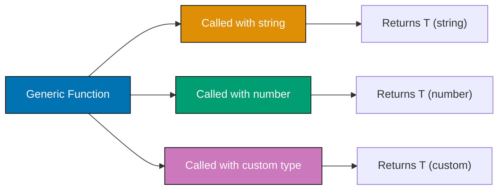
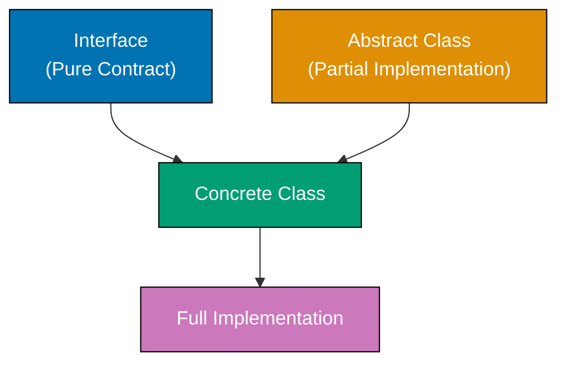

Pelajari TypeScript tingkat menengah melalui 30 contoh production-ready yang mencakup generics, utility types, decorators, pola async, modules, dan transformasi tipe lanjutan.

## Contoh 31: Generic Functions

Generic functions bekerja dengan beberapa tipe menggunakan type parameters. Mereka menyediakan type safety sambil tetap fleksibel.



**Kode**:

```typescript
// BASIC GENERIC FUNCTION
function identity<T>(value: T): T {
  // => T is type parameter
  // => Function preserves input type
  return value; // => Returns same type as input
}

const str = identity<string>("hello"); // => T = string, returns string
const num = identity<number>(42); // => T = number, returns number
const bool = identity(true); // => T inferred as boolean

console.log(str.toUpperCase()); // => Output: HELLO (string method available)
console.log(num.toFixed(2)); // => Output: 42.00 (number method available)

// GENERIC FUNCTION WITH ARRAY
function getFirst<T>(arr: T[]): T | undefined {
  // => T[] is array of T
  // => Returns T or undefined
  return arr[0]; // => First element
}

const firstNumber = getFirst([1, 2, 3]); // => T = number, returns number | undefined
const firstName = getFirst(["a", "b"]); // => T = string, returns string | undefined

console.log(firstNumber); // => Output: 1
console.log(firstName); // => Output: a

// GENERIC FUNCTION WITH MULTIPLE TYPE PARAMETERS
function pair<T, U>(first: T, second: U): [T, U] {
  // => Two type parameters
  // => Returns tuple [T, U]
  return [first, second]; // => Tuple with both types
}

const p1 = pair("name", 30); // => [string, number]
const p2 = pair(true, "yes"); // => [boolean, string]

console.log(p1); // => Output: ["name", 30]
console.log(p2); // => Output: [true, "yes"]

// GENERIC FUNCTION WITH CONSTRAINTS
function getLength<T extends { length: number }>(value: T): number {
  // => T must have length property
  // => Constraint ensures .length exists
  return value.length; // => Safe to access .length
}

console.log(getLength("hello")); // => Output: 5 (string has length)
console.log(getLength([1, 2, 3])); // => Output: 3 (array has length)
// console.log(getLength(42));           // => ERROR: number doesn't have length

// GENERIC FUNCTION FOR OBJECT PROPERTY ACCESS
function getProperty<T, K extends keyof T>(obj: T, key: K): T[K] {
  // => K must be key of T
  // => Return type is T[K]
  return obj[key]; // => Type-safe property access
}

const person = { name: "Alice", age: 30 };
const name = getProperty(person, "name"); // => Type: string (inferred from person["name"])
const age = getProperty(person, "age"); // => Type: number (inferred from person["age"])

console.log(name); // => Output: Alice
console.log(age); // => Output: 30
```

**Poin Kunci**: Generic functions menggunakan angle brackets `<T>` untuk mendefinisikan type parameters. Mereka mempertahankan informasi tipe di seluruh pemanggilan fungsi. Gunakan `extends` untuk membatasi tipe generik. Kombinasikan beberapa type parameters untuk operasi kompleks.

**Mengapa Penting**: Generics menghilangkan duplikasi kode sambil mempertahankan type safety. Metode array seperti `map<T>`, `filter<T>` adalah generic—mereka bekerja dengan tipe apapun. Utility Lodash/Ramda menggunakan generics untuk transformasi yang mempertahankan tipe. `useState<T>` React menyimpulkan tipe state dari nilai awal. Generics adalah fundamental untuk library dan framework yang type-safe.

## Contoh 32: Generic Classes

Generic classes mendefinisikan type parameters di tingkat class. Semua method berbagi scope type parameter yang sama.

**Kode**:

```typescript
// BASIC GENERIC CLASS
class Box<T> {
  // => T is class-level type parameter
  private value: T; // => Property of type T

  constructor(value: T) {
    // => Constructor accepts T
    this.value = value; // => Initialize with T value
  }

  getValue(): T {
    // => Returns T
    return this.value;
  }

  setValue(value: T): void {
    // => Accepts T
    this.value = value;
  }
}

const stringBox = new Box<string>("hello"); // => T = string
console.log(stringBox.getValue()); // => Output: hello

const numberBox = new Box(42); // => T inferred as number
console.log(numberBox.getValue()); // => Output: 42

// GENERIC CLASS WITH MULTIPLE TYPE PARAMETERS
class Pair<K, V> {
  // => Two type parameters
  constructor(
    public key: K,
    public value: V,
  ) {} // => Key-value pair

  toString(): string {
    return `${this.key}: ${this.value}`;
  }
}

const pair1 = new Pair("name", "Alice"); // => K = string, V = string
const pair2 = new Pair(1, true); // => K = number, V = boolean

console.log(pair1.toString()); // => Output: name: Alice
console.log(pair2.toString()); // => Output: 1: true

// GENERIC CLASS WITH CONSTRAINTS
class NumberBox<T extends number> {
  // => T must be number subtype
  constructor(private value: T) {}

  add(x: T): number {
    // => Arithmetic operations safe
    return this.value + x;
  }
}

const numBox = new NumberBox(10);
console.log(numBox.add(5)); // => Output: 15

// GENERIC CLASS FOR DATA STRUCTURES
class Stack<T> {
  // => Generic stack
  private items: T[] = []; // => Array of T

  push(item: T): void {
    // => Add item of type T
    this.items.push(item);
  }

  pop(): T | undefined {
    // => Remove and return T
    return this.items.pop();
  }

  peek(): T | undefined {
    // => View top without removing
    return this.items[this.items.length - 1];
  }

  isEmpty(): boolean {
    return this.items.length === 0;
  }
}

const numberStack = new Stack<number>(); // => Stack of numbers
numberStack.push(1);
numberStack.push(2);
numberStack.push(3);

console.log(numberStack.pop()); // => Output: 3
console.log(numberStack.peek()); // => Output: 2

const stringStack = new Stack<string>(); // => Stack of strings
stringStack.push("a");
stringStack.push("b");

console.log(stringStack.pop()); // => Output: b
```

**Poin Kunci**: Generic classes menggunakan `<T>` setelah nama class untuk mendefinisikan type parameters. Semua method dan property dapat menggunakan type parameter. Buat instance dengan tipe spesifik atau biarkan TypeScript menyimpulkan dari argumen constructor.

**Mengapa Penting**: Generic classes mendukung struktur data (Stack, Queue, LinkedList) yang bekerja dengan tipe apapun. Kelas komponen React menggunakan generics untuk props dan state: `class Component<P, S>`. Model ORM menggunakan generics untuk query builders. Pola ini memungkinkan class libraries yang dapat digunakan kembali dan type-safe.

## Contoh 33: Generic Interfaces

Generic interfaces mendefinisikan kontrak dengan type parameters. Mereka digunakan untuk bentuk fungsi, struktur objek, dan kontrak API.

**Kode**:

```typescript
// BASIC GENERIC INTERFACE
interface Container<T> {
  // => Generic interface
  value: T; // => Property of type T
  getValue(): T; // => Method returning T
  setValue(value: T): void; // => Method accepting T
}

class StringContainer implements Container<string> {
  // => Implements with string
  constructor(public value: string) {}

  getValue(): string {
    return this.value;
  }

  setValue(value: string): void {
    this.value = value;
  }
}

const container = new StringContainer("hello");
console.log(container.getValue()); // => Output: hello

// GENERIC INTERFACE FOR API RESPONSES
interface ApiResponse<T> {
  // => Generic response shape
  data: T; // => Data payload of type T
  status: number; // => HTTP status code
  message: string; // => Response message
}

interface User {
  id: number;
  name: string;
}

const userResponse: ApiResponse<User> = {
  // => T = User
  data: { id: 1, name: "Alice" },
  status: 200,
  message: "Success",
};

console.log(userResponse.data.name); // => Output: Alice

// GENERIC INTERFACE WITH MULTIPLE TYPE PARAMETERS
interface KeyValuePair<K, V> {
  // => Two type parameters
  key: K;
  value: V;
}

const pair1: KeyValuePair<string, number> = {
  key: "age",
  value: 30,
};

const pair2: KeyValuePair<number, boolean> = {
  key: 1,
  value: true,
};

console.log(pair1); // => Output: { key: 'age', value: 30 }

// GENERIC INTERFACE FOR FUNCTION SIGNATURES
interface Transformer<T, U> {
  // => Function interface
  (input: T): U; // => Takes T, returns U
}

const toUpperCase: Transformer<string, string> = (str) => str.toUpperCase();
const stringLength: Transformer<string, number> = (str) => str.length;

console.log(toUpperCase("hello")); // => Output: HELLO
console.log(stringLength("world")); // => Output: 5

// GENERIC INTERFACE WITH INDEX SIGNATURE
interface Dictionary<T> {
  // => Generic dictionary
  [key: string]: T; // => Any string key maps to T
}

const scores: Dictionary<number> = {
  alice: 95,
  bob: 87,
  charlie: 92,
};

console.log(scores.alice); // => Output: 95
```

**Poin Kunci**: Generic interfaces menggunakan `<T>` untuk parameterize kontrak. Mereka digunakan untuk bentuk respons API, struktur data, dan signature fungsi. Class yang mengimplementasikan generic interfaces harus menentukan tipe konkret.

**Mengapa Penting**: Generic interfaces mendefinisikan kontrak untuk library dan framework. Respons Fetch API menggunakan `Response<T>`. Promise chains menggunakan `Promise<T>`. Action Redux menggunakan generic interfaces untuk action creator yang type-safe. Pola ini memungkinkan membangun API yang type-safe di mana pemanggil menentukan tipe data yang mereka harapkan.

## Contoh 34: Utility Type - Partial dan Required

`Partial<T>` membuat semua property menjadi optional. `Required<T>` membuat semua property menjadi required. Mereka penting untuk operasi update dan validasi.

**Kode**:

```typescript
// BASE INTERFACE
interface User {
  id: number;
  name: string;
  email: string;
  age: number;
}

// PARTIAL<T> - ALL PROPERTIES OPTIONAL
type PartialUser = Partial<User>; // => { id?: number; name?: string; ... }

function updateUser(id: number, updates: PartialUser): void {
  console.log(`Updating user ${id}`, updates);
}

updateUser(1, { name: "Alice" }); // => Only name updated
updateUser(2, { age: 31, email: "bob@example.com" }); // => Partial update

// PRACTICAL USE CASE - PATCH ENDPOINT
function patchUser(id: number, data: Partial<Omit<User, "id">>): User {
  // => Partial update without id field
  const existing: User = {
    // => Fetch existing user (mocked)
    id,
    name: "Original",
    email: "original@example.com",
    age: 25,
  };

  return { ...existing, ...data }; // => Merge updates
}

const updated = patchUser(1, { name: "Updated" });
console.log(updated); // => Output: { id: 1, name: 'Updated', email: 'original@example.com', age: 25 }

// REQUIRED<T> - ALL PROPERTIES REQUIRED
interface Config {
  // => Config with optional fields
  host?: string;
  port?: number;
  debug?: boolean;
}

type RequiredConfig = Required<Config>; // => All fields become required
// => { host: string; port: number; debug: boolean }

function loadConfig(config: RequiredConfig): void {
  console.log(`Server: ${config.host}:${config.port}, Debug: ${config.debug}`);
}

const config: RequiredConfig = {
  // => Must provide all fields
  host: "localhost",
  port: 3000,
  debug: true,
};

loadConfig(config); // => Output: Server: localhost:3000, Debug: true

// COMBINING PARTIAL AND REQUIRED
interface FormData {
  username: string;
  email: string;
  password?: string;
  newsletter?: boolean;
}

type FormUpdate = Partial<Required<FormData>>; // => All fields optional (but defined)
// => Useful for form state

const formUpdate: FormUpdate = {
  username: "alice",
  email: "alice@example.com",
};

console.log(formUpdate); // => Output: { username: 'alice', email: 'alice@example.com' }
```

**Poin Kunci**: `Partial<T>` membuat semua property optional untuk operasi update. `Required<T>` membuat semua property required untuk validasi. Kombinasikan dengan utility types lain untuk transformasi kompleks.

**Mengapa Penting**: `Partial<T>` menghilangkan boilerplate untuk update DTO di REST API. Alih-alih mendefinisikan interface `UserUpdate` terpisah, gunakan `Partial<User>`. `Required<T>` memaksa objek konfigurasi lengkap setelah validasi. Form libraries seperti React Hook Form menggunakan pola ini secara ekstensif.

## Contoh 35: Utility Type - Pick dan Omit

`Pick<T, K>` memilih property tertentu. `Omit<T, K>` mengecualikan property. Mereka membuat tipe turunan tanpa duplikasi.

**Kode**:

```typescript
// BASE INTERFACE
interface User {
  id: number;
  name: string;
  email: string;
  password: string;
  createdAt: Date;
}

// PICK<T, K> - SELECT PROPERTIES
type UserPreview = Pick<User, "id" | "name">; // => Only id and name
// => { id: number; name: string }

const preview: UserPreview = {
  id: 1,
  name: "Alice",
};

console.log(preview); // => Output: { id: 1, name: 'Alice' }

// OMIT<T, K> - EXCLUDE PROPERTIES
type UserWithoutPassword = Omit<User, "password">; // => All except password
// => Safe for API responses

const safeUser: UserWithoutPassword = {
  id: 1,
  name: "Bob",
  email: "bob@example.com",
  createdAt: new Date(),
};

console.log(safeUser); // => Output: { id: 1, name: 'Bob', ... }

// PRACTICAL USE CASE - API DTOs
type CreateUserDTO = Omit<User, "id" | "createdAt">; // => Client provides everything except generated fields

function createUser(data: CreateUserDTO): User {
  return {
    ...data,
    id: Math.floor(Math.random() * 1000), // => Generate id
    createdAt: new Date(), // => Set timestamp
  };
}

const newUser = createUser({
  name: "Charlie",
  email: "charlie@example.com",
  password: "secret123",
});

console.log(newUser); // => Output: { id: ..., name: 'Charlie', ... }

// COMBINING PICK AND PARTIAL
type UpdateUserDTO = Partial<Pick<User, "name" | "email">>; // => Optional name and email only

function updateUserInfo(id: number, data: UpdateUserDTO): void {
  console.log(`Updating user ${id}`, data);
}

updateUserInfo(1, { name: "Updated Name" }); // => Partial update of allowed fields

// OMIT MULTIPLE PROPERTIES
type PublicUser = Omit<User, "password" | "createdAt">; // => Exclude sensitive/internal fields

const publicUser: PublicUser = {
  id: 1,
  name: "Diana",
  email: "diana@example.com",
};

console.log(publicUser); // => Output: { id: 1, name: 'Diana', email: 'diana@example.com' }
```

**Poin Kunci**: `Pick<T, K>` mengekstrak property tertentu untuk DTO yang fokus. `Omit<T, K>` menghapus property untuk interface publik yang aman. Kombinasikan dengan `Partial` untuk tipe update yang fleksibel.

**Mengapa Penting**: Utility ini mencegah duplikasi tipe di arsitektur berlapis. Model database memiliki semua field; respons API `Omit<Model, "password">` untuk keamanan; Create DTO `Omit<Model, "id">` untuk input client. Pola ini menjaga tipe tetap DRY (Don't Repeat Yourself) sambil mempertahankan keamanan.

## Contoh 36: Decorators (Experimental)

Decorators menambahkan metadata dan perilaku ke classes, methods, properties, dan parameters. Mereka digunakan secara luas di framework seperti Angular dan NestJS.

**Catatan**: Decorators memerlukan `"experimentalDecorators": true` di tsconfig.json.

**Kode**:

```typescript
// CLASS DECORATOR
function Sealed(constructor: Function) {
  // => Decorator function
  Object.seal(constructor); // => Prevent modifications
  Object.seal(constructor.prototype); // => Seal prototype too
}

@Sealed // => Apply decorator to class
class Person {
  constructor(public name: string) {}
}

const person = new Person("Alice");
console.log(person.name); // => Output: Alice

// METHOD DECORATOR
function Log(target: any, propertyKey: string, descriptor: PropertyDescriptor) {
  // => target: class prototype
  // => propertyKey: method name
  // => descriptor: method descriptor

  const originalMethod = descriptor.value; // => Save original method

  descriptor.value = function (...args: any[]) {
    // => Wrap method
    console.log(`Calling ${propertyKey} with`, args);
    const result = originalMethod.apply(this, args); // => Call original
    console.log(`Result:`, result);
    return result;
  };

  return descriptor; // => Return modified descriptor
}

class Calculator {
  @Log // => Apply to method
  add(a: number, b: number): number {
    return a + b;
  }
}

const calc = new Calculator();
calc.add(5, 3); // => Output: Calling add with [5, 3]
// => Output: Result: 8

// PROPERTY DECORATOR
function ReadOnly(target: any, propertyKey: string) {
  // => target: class prototype
  // => propertyKey: property name

  const descriptor: PropertyDescriptor = {
    writable: false, // => Make property readonly
    configurable: false,
  };

  Object.defineProperty(target, propertyKey, descriptor);
}

class User {
  @ReadOnly // => Apply to property
  id: number = 1;

  name: string = "Alice";
}

const user = new User();
console.log(user.id); // => Output: 1
// user.id = 2;                          // => ERROR (in strict mode)

// PARAMETER DECORATOR
function LogParam(target: any, propertyKey: string, parameterIndex: number) {
  console.log(`Parameter ${parameterIndex} in ${propertyKey}`);
}

class Service {
  greet(@LogParam name: string): void {
    // => Decorate parameter
    console.log(`Hello, ${name}`);
  }
}

const service = new Service();
service.greet("Bob"); // => Output: Parameter 0 in greet
// => Output: Hello, Bob

// DECORATOR FACTORY
function MinLength(min: number) {
  // => Decorator factory (returns decorator)
  return function (target: any, propertyKey: string) {
    let value: string;

    const getter = () => value;
    const setter = (newVal: string) => {
      if (newVal.length < min) {
        throw new Error(`${propertyKey} must be at least ${min} characters`);
      }
      value = newVal;
    };

    Object.defineProperty(target, propertyKey, {
      get: getter,
      set: setter,
    });
  };
}

class Account {
  @MinLength(6) // => Factory called with argument
  password: string = "";
}

const account = new Account();
// account.password = "123";             // => ERROR: password must be at least 6 characters
account.password = "secure123"; // => VALID
console.log(account.password); // => Output: secure123
```

**Poin Kunci**: Decorators menggunakan sintaks `@` untuk memodifikasi classes, methods, properties, dan parameters. Decorator factories menerima parameter dan mengembalikan decorators. Aktifkan dengan opsi compiler `experimentalDecorators`.

**Mengapa Penting**: Decorators memungkinkan pola pemrograman deklaratif. Angular menggunakan `@Component`, `@Injectable` untuk dependency injection. NestJS menggunakan `@Controller`, `@Get` untuk routing. TypeORM menggunakan `@Entity`, `@Column` untuk mapping database. Decorators memindahkan cross-cutting concerns (logging, validation, caching) keluar dari logika bisnis.

## Contoh 37: Async/Await dan Promises

TypeScript menyediakan typing yang kuat untuk Promises dan pola async/await. Ini memungkinkan pemrograman asinkron yang type-safe.

```mermaid
%% Color Palette: Blue #0173B2, Orange #DE8F05, Teal #029E73, Purple #CC78BC, Brown #CA9161
sequenceDiagram
    participant Caller
    participant Async Function
    participant Promise

    Caller->>+Async Function: await fetchData()
    Async Function->>+Promise: Create Promise<T>
    Promise-->>-Async Function: Resolve with T
    Async Function-->>-Caller: Return T

    style Caller fill:#0173B2,color:#fff
    style Async Function fill:#DE8F05,color:#fff
    style Promise fill:#029E73,color:#fff
```

**Kode**:

```typescript
// BASIC PROMISE
function delay(ms: number): Promise<void> {
  // => Returns Promise<void>
  return new Promise<void>((resolve) => {
    // => Generic Promise type
    setTimeout(resolve, ms); // => Resolve after delay
  });
}

delay(1000).then(() => {
  // => then() receives void
  console.log("1 second passed"); // => Output after 1 second
});

// PROMISE WITH TYPED RESULT
function fetchUser(id: number): Promise<{ id: number; name: string }> {
  // => Promise resolves to User object
  return new Promise((resolve) => {
    setTimeout(() => {
      resolve({ id, name: "Alice" }); // => Resolve with User
    }, 500);
  });
}

fetchUser(1).then((user) => {
  // => user type inferred as User
  console.log(user.name); // => Output: Alice (after 500ms)
});

// ASYNC/AWAIT
async function getUserData(id: number): Promise<string> {
  // => async function returns Promise
  // => Explicit Promise<string> return type
  const user = await fetchUser(id); // => await unwraps Promise<User> to User
  // => user type: { id: number; name: string }
  return user.name; // => Returns string (wrapped in Promise by async)
}

getUserData(1).then((name) => {
  console.log(name); // => Output: Alice
});

// ERROR HANDLING WITH TRY/CATCH
async function fetchData(): Promise<string> {
  try {
    const response = await fetch("https://api.example.com/data");
    // => response type: Response
    const data = await response.json(); // => data type: any (JSON parse)
    return data.value; // => Return string
  } catch (error) {
    console.error("Fetch failed:", error);
    throw error; // => Re-throw for caller
  }
}

// PROMISE.ALL WITH TYPING
async function fetchMultiple(): Promise<[number, string, boolean]> {
  // => Returns tuple type
  const [num, str, bool] = await Promise.all([
    // => Destructure tuple
    Promise.resolve(42), // => Promise<number>
    Promise.resolve("hello"), // => Promise<string>
    Promise.resolve(true), // => Promise<boolean>
  ]); // => Promise.all infers tuple type

  return [num, str, bool]; // => Return tuple
}

fetchMultiple().then(([n, s, b]) => {
  console.log(n, s, b); // => Output: 42 hello true
});

// GENERIC ASYNC FUNCTION
async function fetchJson<T>(url: string): Promise<T> {
  // => Generic async function
  const response = await fetch(url); // => Fetch data
  const data = await response.json(); // => Parse JSON
  return data as T; // => Assert type T
}

interface User {
  id: number;
  name: string;
}

async function getUser(id: number): Promise<User> {
  return fetchJson<User>(`https://api.example.com/users/${id}`);
  // => T = User, returns Promise<User>
}

// ASYNC GENERATOR
async function* generateNumbers(): AsyncGenerator<number> {
  // => Async generator type
  yield 1; // => Yield number
  await delay(100); // => Async delay
  yield 2;
  await delay(100);
  yield 3;
}

(async () => {
  for await (const num of generateNumbers()) {
    // => for await loop
    console.log(num); // => Output: 1, 2, 3 (with delays)
  }
})();
```

**Poin Kunci**: Gunakan `Promise<T>` untuk nilai asinkron. Fungsi `async` secara otomatis mengembalikan Promises. `await` membuka Promises ke tipe resolved-nya. Gunakan `try/catch` untuk error handling. `Promise.all` menyimpulkan tipe tuple dari input promises.

**Mengapa Penting**: Kode async yang type-safe mencegah bug dari tipe return yang salah dan error handling yang hilang. API client menggunakan `Promise<Response<T>>` untuk respons yang ter-type. Query database menggunakan `Promise<Model[]>` untuk result sets. React hooks seperti `useEffect` memahami tipe return Promise. Pola ini membuat TypeScript asinkron sama amannya dengan kode sinkron.

## Contoh 38: Modules dan Namespaces

TypeScript mendukung ES modules (`import`/`export`) dan namespaces untuk mengorganisir kode. Lebih suka ES modules untuk pengembangan modern.

**Kode**:

```typescript
// NAMED EXPORTS (math.ts)
export function add(a: number, b: number): number {
  return a + b;
}

export function subtract(a: number, b: number): number {
  return a - b;
}

export const PI = 3.14159;

// NAMED IMPORTS (main.ts)
import { add, subtract, PI } from "./math";

console.log(add(5, 3)); // => Output: 8
console.log(PI); // => Output: 3.14159

// DEFAULT EXPORT (calculator.ts)
export default class Calculator {
  add(a: number, b: number): number {
    return a + b;
  }
}

// DEFAULT IMPORT (main.ts)
import Calculator from "./calculator";

const calc = new Calculator();
console.log(calc.add(10, 5)); // => Output: 15

// RE-EXPORTS (index.ts)
export { add, subtract } from "./math";
export { default as Calculator } from "./calculator";

// IMPORT ALL (main.ts)
import * as math from "./math";

console.log(math.add(2, 3)); // => Output: 5
console.log(math.PI); // => Output: 3.14159

// TYPE-ONLY IMPORTS
import type { User } from "./types"; // => Import only type (erased at runtime)

const user: User = {
  // => Use type
  id: 1,
  name: "Alice",
};

// NAMESPACE (LEGACY PATTERN)
namespace Validation {
  // => Namespace declaration
  export interface StringValidator {
    // => Exported interface
    isValid(s: string): boolean;
  }

  export class EmailValidator implements StringValidator {
    isValid(s: string): boolean {
      return s.includes("@");
    }
  }
}

const emailValidator = new Validation.EmailValidator();
console.log(emailValidator.isValid("test@example.com")); // => Output: true

// MERGING NAMESPACES
namespace Animals {
  export class Dog {}
}

namespace Animals {
  // => Same namespace name
  export class Cat {} // => Merges with previous
}

const dog = new Animals.Dog();
const cat = new Animals.Cat();

// AMBIENT MODULES (DECLARE MODULE)
declare module "legacy-lib" {
  // => Declare types for JS library
  export function doSomething(): void;
}

import { doSomething } from "legacy-lib"; // => TypeScript knows about it
```

**Poin Kunci**: Gunakan ES modules (`import`/`export`) untuk TypeScript modern. Default exports untuk single exports, named exports untuk multiple. Type-only imports (`import type`) mengoptimalkan ukuran bundle. Namespaces adalah legacy—lebih suka ES modules.

**Mengapa Penting**: Sistem module memungkinkan organisasi kode dan tree-shaking. ES modules terintegrasi dengan bundlers (Webpack, Rollup, Vite). Type-only imports mencegah bloat runtime dari definisi tipe. Ambient modules (`declare module`) menambahkan tipe ke library JavaScript tanpa tipe. Pola ini penting untuk aplikasi TypeScript yang scalable.

## Contoh 39: Conditional Types dengan Distributive Behavior

Conditional types mendistribusikan over union types secara otomatis. Ini memungkinkan transformasi tipe yang powerful.

**Kode**:

```typescript
// BASIC CONDITIONAL TYPE
type IsString<T> = T extends string ? "yes" : "no";

type Test1 = IsString<string>; // => Type: "yes"
type Test2 = IsString<number>; // => Type: "no"

// DISTRIBUTIVE CONDITIONAL TYPE
type ToArray<T> = T extends any ? T[] : never; // => Wraps each union member in array

type StringOrNumber = string | number;
type ArrayTypes = ToArray<StringOrNumber>; // => Type: string[] | number[]
// => NOT (string | number)[]

// CONDITIONAL TYPE WITH INFER
type UnwrapPromise<T> = T extends Promise<infer U> ? U : T;
// => If Promise, extract inner type
// => Otherwise return T as-is

type UnwrappedString = UnwrapPromise<Promise<string>>; // => Type: string
type UnwrappedNumber = UnwrapPromise<number>; // => Type: number

// FILTERING UNION WITH CONDITIONAL TYPES
type Filter<T, U> = T extends U ? T : never; // => Keep T if extends U
// => Otherwise return never

type OnlyStrings = Filter<string | number | boolean, string>; // => Type: string

// EXTRACTING FUNCTION RETURN TYPES
type ReturnType<T> = T extends (...args: any[]) => infer R ? R : never;

function getString(): string {
  return "hello";
}

function getNumber(): number {
  return 42;
}

type StringReturn = ReturnType<typeof getString>; // => Type: string
type NumberReturn = ReturnType<typeof getNumber>; // => Type: number

// EXTRACTING FUNCTION PARAMETERS
type Parameters<T> = T extends (...args: infer P) => any ? P : never;

function greet(name: string, age: number): void {
  console.log(`${name} is ${age}`);
}

type GreetParams = Parameters<typeof greet>; // => Type: [string, number]

const params: GreetParams = ["Alice", 30];
greet(...params); // => Output: Alice is 30

// CONDITIONAL TYPE FOR FLATTENING
type Flatten<T> = T extends Array<infer U> ? U : T;

type Flattened = Flatten<string[]>; // => Type: string
type NotFlattened = Flatten<number>; // => Type: number

// PRACTICAL EXAMPLE - API ERROR HANDLING
type ApiResult<T> = T extends { error: any } ? never : T; // => Filter error types

interface SuccessResponse {
  data: string;
}

interface ErrorResponse {
  error: string;
}

type ValidResponses = ApiResult<SuccessResponse | ErrorResponse>;
// => Type: SuccessResponse
// => ErrorResponse filtered out
```

**Poin Kunci**: Conditional types menggunakan sintaks `T extends U ? X : Y`. Mereka mendistribusikan over unions secara otomatis. Gunakan `infer` untuk mengekstrak tipe dari struktur kompleks. Kombinasikan dengan utility types untuk transformasi yang powerful.

**Mengapa Penting**: Conditional types memungkinkan pemrograman tingkat tipe yang advanced. `ReturnType`, `Parameters`, dan `Awaited` dibangun dengan conditional types. Framework authors menggunakannya untuk type inference (tipe prop komponen React, tipe computed Vue). Pola ini membuat sistem tipe TypeScript Turing-complete.

## Contoh 40: Mapped Types dengan Key Remapping

Mapped types mengiterasi over object keys. Key remapping (klausa `as`) mentransformasi nama key selama iterasi.

**Kode**:

```typescript
// BASIC MAPPED TYPE
type Readonly<T> = {
  // => Makes all properties readonly
  readonly [P in keyof T]: T[P];
};

interface User {
  id: number;
  name: string;
}

type ReadonlyUser = Readonly<User>; // => { readonly id: number; readonly name: string }

// MAPPED TYPE WITH MODIFIERS
type Optional<T> = {
  // => Makes all properties optional
  [P in keyof T]?: T[P];
};

type OptionalUser = Optional<User>; // => { id?: number; name?: string }

// KEY REMAPPING WITH 'as'
type Getters<T> = {
  // => Transform keys to getters
  [P in keyof T as `get${Capitalize<string & P>}`]: () => T[P];
};

type UserGetters = Getters<User>; // => { getId: () => number; getName: () => string }

const userGetters: UserGetters = {
  getId: () => 1,
  getName: () => "Alice",
};

console.log(userGetters.getId()); // => Output: 1

// FILTERING KEYS WITH KEY REMAPPING
type PickByType<T, U> = {
  // => Pick properties of type U
  [P in keyof T as T[P] extends U ? P : never]: T[P];
};

interface Mixed {
  id: number;
  name: string;
  age: number;
  active: boolean;
}

type OnlyNumbers = PickByType<Mixed, number>; // => { id: number; age: number }

const numbers: OnlyNumbers = {
  id: 1,
  age: 30,
};

console.log(numbers); // => Output: { id: 1, age: 30 }

// REMOVING PROPERTIES WITH never
type OmitByType<T, U> = {
  // => Omit properties of type U
  [P in keyof T as T[P] extends U ? never : P]: T[P];
};

type WithoutNumbers = OmitByType<Mixed, number>; // => { name: string; active: boolean }

const withoutNums: WithoutNumbers = {
  name: "Bob",
  active: true,
};

console.log(withoutNums); // => Output: { name: 'Bob', active: true }

// TEMPLATE LITERAL KEY TRANSFORMATION
type EventHandlers<T> = {
  // => Create event handlers
  [P in keyof T as `on${Capitalize<string & P>}Change`]: (value: T[P]) => void;
};

interface FormData {
  username: string;
  email: string;
  age: number;
}

type FormHandlers = EventHandlers<FormData>;
// => { onUsernameChange: (value: string) => void; ... }

const handlers: FormHandlers = {
  onUsernameChange: (value) => console.log("Username:", value),
  onEmailChange: (value) => console.log("Email:", value),
  onAgeChange: (value) => console.log("Age:", value),
};

handlers.onUsernameChange("alice"); // => Output: Username: alice

// CONDITIONAL MAPPED TYPE
type Nullish<T> = {
  // => Make properties nullable
  [P in keyof T]: T[P] | null;
};

type NullishUser = Nullish<User>; // => { id: number | null; name: string | null }

const nullUser: NullishUser = {
  id: null,
  name: "Charlie",
};

console.log(nullUser); // => Output: { id: null, name: 'Charlie' }
```

**Poin Kunci**: Mapped types menggunakan `[P in keyof T]` untuk mengiterasi over keys. Key remapping dengan `as` mentransformasi nama key. Gunakan template literals untuk transformasi berbasis pola. Return `never` untuk mengecualikan keys.

**Mengapa Penting**: Mapped types dengan key remapping memungkinkan transformasi tipe advanced. Library ORM menghasilkan method `findByX` untuk setiap field. Form libraries membuat handler `onXChange`. Generator kode GraphQL mentransformasi field schema ke tipe resolver. Pola ini menghilangkan definisi tipe manual untuk pola berulang.

## Contoh 41: Function Overloading

Function overloading memungkinkan beberapa signature fungsi untuk nama fungsi yang sama. TypeScript memeriksa signature pada waktu compile dan merutekan ke implementasi tunggal.

**Kode**:

```typescript
// FUNCTION OVERLOAD SIGNATURES
function combine(a: string, b: string): string; // => Signature 1: string + string
function combine(a: number, b: number): number; // => Signature 2: number + number
function combine(a: string | number, b: string | number): string | number {
  // => Implementation
  if (typeof a === "string" && typeof b === "string") {
    return a + b; // => String concatenation
  }
  if (typeof a === "number" && typeof b === "number") {
    return a + b; // => Numeric addition
  }
  throw new Error("Invalid arguments");
}

const str = combine("Hello", " World"); // => Type: string (matches signature 1)
const num = combine(10, 20); // => Type: number (matches signature 2)

console.log(str); // => Output: Hello World
console.log(num); // => Output: 30

// OVERLOAD WITH DIFFERENT PARAMETER COUNTS
function makeDate(timestamp: number): Date; // => Signature 1: single number
function makeDate(year: number, month: number, day: number): Date; // => Signature 2: three numbers
function makeDate(yearOrTimestamp: number, month?: number, day?: number): Date {
  // => Implementation
  if (month !== undefined && day !== undefined) {
    return new Date(yearOrTimestamp, month, day); // => Create from Y/M/D
  }
  return new Date(yearOrTimestamp); // => Create from timestamp
}

const date1 = makeDate(1640000000000); // => From timestamp
const date2 = makeDate(2025, 11, 25); // => From Y/M/D

console.log(date1); // => Output: Date object
console.log(date2); // => Output: Date object

// OVERLOAD WITH OBJECT PARAMETER
function processInput(input: string): string[]; // => Signature: string returns array
function processInput(input: number): number[]; // => Signature: number returns array
function processInput(input: string | number): (string | number)[] {
  // => Implementation
  if (typeof input === "string") {
    return input.split(""); // => Split string into chars
  }
  return [input]; // => Wrap number in array
}

const chars = processInput("hello"); // => Type: string[] (matches first signature)
const nums = processInput(42); // => Type: number[] (matches second signature)

console.log(chars); // => Output: ['h', 'e', 'l', 'l', 'o']
console.log(nums); // => Output: [42]
```

**Poin Kunci**: Function overloads menyediakan beberapa signature tipe untuk implementasi tunggal. Implementasi harus menangani semua kasus overload. TypeScript menggunakan signature yang paling spesifik.

**Mengapa Penting**: Overloading memungkinkan API yang type-safe dengan pola pemanggilan yang fleksibel. DOM API menggunakan overloads secara ekstensif (addEventListener memiliki 3 signature). Library seperti Lodash menyediakan fungsi yang overloaded untuk tipe input berbeda. Pola ini mempertahankan type safety sambil mendukung pola penggunaan yang beragam.

## Contoh 42: Abstract Classes dan Interfaces Dibandingkan

Abstract classes menyediakan implementasi parsial. Interfaces mendefinisikan kontrak murni. Kombinasikan untuk desain yang fleksibel.



**Kode**:

```typescript
// INTERFACE - PURE CONTRACT
interface Flyable {
  // => Interface defines contract
  fly(): void; // => No implementation
  maxAltitude: number; // => Property signature
}

// ABSTRACT CLASS - PARTIAL IMPLEMENTATION
abstract class Animal {
  // => Cannot instantiate directly
  constructor(public name: string) {} // => Concrete constructor

  abstract makeSound(): void; // => Abstract method (no implementation)

  move(): void {
    // => Concrete method (has implementation)
    console.log(`${this.name} is moving`);
  }
}

// CONCRETE CLASS IMPLEMENTING BOTH
class Bird extends Animal implements Flyable {
  // => Extends abstract, implements interface
  maxAltitude: number = 10000; // => Implement interface property

  constructor(name: string) {
    super(name); // => Call parent constructor
  }

  makeSound(): void {
    // => Implement abstract method
    console.log("Chirp!");
  }

  fly(): void {
    // => Implement interface method
    console.log(`${this.name} is flying`);
  }
}

const bird = new Bird("Eagle");
bird.makeSound(); // => Output: Chirp!
bird.move(); // => Output: Eagle is moving (inherited)
bird.fly(); // => Output: Eagle is flying

// MULTIPLE INTERFACES
interface Swimmable {
  swim(): void;
}

class Duck extends Animal implements Flyable, Swimmable {
  // => Multiple interfaces
  maxAltitude: number = 5000;

  makeSound(): void {
    console.log("Quack!");
  }

  fly(): void {
    console.log(`${this.name} is flying low`);
  }

  swim(): void {
    // => Implement second interface
    console.log(`${this.name} is swimming`);
  }
}

const duck = new Duck("Mallard");
duck.fly(); // => Output: Mallard is flying low
duck.swim(); // => Output: Mallard is swimming
```

**Poin Kunci**: Gunakan interfaces untuk kontrak murni yang mendukung multiple inheritance. Gunakan abstract classes untuk kode implementasi bersama. Sebuah class dapat extend satu abstract class tetapi implement beberapa interfaces.

**Mengapa Penting**: Interfaces memungkinkan komposisi over inheritance. Komponen React mengimplementasikan beberapa interfaces (Props, State, LifecycleMethods). Abstract classes berbagi kode antar subclasses sambil menegakkan kontrak. Pola ini mendukung desain yang fleksibel dan maintainable.

## Contoh 43: Module Augmentation

Module augmentation menambahkan deklarasi ke module yang ada. Ini digunakan untuk memperluas library pihak ketiga tanpa memodifikasi source mereka.

**Kode**:

```typescript
// AUGMENT GLOBAL NAMESPACE
declare global {
  // => Augment global scope
  interface Window {
    // => Extend Window interface
    myCustomProperty: string; // => Add new property
  }
}

window.myCustomProperty = "Hello"; // => Now type-safe
console.log(window.myCustomProperty); // => Output: Hello

// AUGMENT EXTERNAL MODULE
declare module "some-library" {
  // => Augment external module
  export interface LibraryConfig {
    // => Extend existing interface
    newOption?: boolean; // => Add optional property
  }
}

// AUGMENT MODULE WITH NEW EXPORTS
declare module "express" {
  // => Augment Express
  interface Request {
    // => Extend Request interface
    user?: {
      // => Add custom property
      id: number;
      name: string;
    };
  }
}

// Now Request.user is type-safe in Express handlers
// import { Request, Response } from "express";
// function handler(req: Request, res: Response) {
//     console.log(req.user?.name);     // => Type-safe access
// }

// NAMESPACE AUGMENTATION
namespace MathUtils {
  // => Original namespace
  export function add(a: number, b: number): number {
    return a + b;
  }
}

namespace MathUtils {
  // => Augment same namespace
  export function multiply(a: number, b: number): number {
    // => Add new function
    return a * b;
  }
}

console.log(MathUtils.add(2, 3)); // => Output: 5
console.log(MathUtils.multiply(2, 3)); // => Output: 6

// AUGMENT ARRAY PROTOTYPE
interface Array<T> {
  // => Extend built-in Array
  first(): T | undefined; // => Add custom method
}

Array.prototype.first = function <T>(this: T[]): T | undefined {
  // => Implementation
  return this[0]; // => Return first element
};

const numbers = [1, 2, 3];
console.log(numbers.first()); // => Output: 1 (type-safe)
```

**Poin Kunci**: Module augmentation memperluas tipe yang ada tanpa memodifikasi source code. Gunakan `declare module` untuk external modules, `declare global` untuk global scope. Namespaces dapat di-augment dengan mendeklarasikannya lagi.

**Mengapa Penting**: Augmentation memungkinkan menambahkan tipe ke library JavaScript. Middleware Express menambahkan property ke Request. Mongoose menambahkan method ke models. Testing frameworks meng-augment global expect. Pola ini mempertahankan type safety ketika memperluas kode pihak ketiga.

## Contoh 44: This Type dan Polymorphic This

Tipe `this` mengacu pada tipe class saat ini. Ini memungkinkan fluent interfaces dan method chaining dengan inheritance yang tepat.

**Kode**:

```typescript
// BASIC this TYPE
class BasicCalculator {
  constructor(protected value: number = 0) {}

  add(n: number): this {
    // => Returns this type (not BasicCalculator)
    this.value += n; // => Modify state
    return this; // => Return self for chaining
  }

  subtract(n: number): this {
    this.value -= n;
    return this;
  }

  getValue(): number {
    return this.value;
  }
}

const calc1 = new BasicCalculator(10);
const result1 = calc1.add(5).subtract(3).getValue(); // => Method chaining
console.log(result1); // => Output: 12

// POLYMORPHIC this IN INHERITANCE
class ScientificCalculator extends BasicCalculator {
  multiply(n: number): this {
    // => this type adapts to subclass
    this.value *= n;
    return this;
  }

  divide(n: number): this {
    this.value /= n;
    return this;
  }
}

const calc2 = new ScientificCalculator(10);
const result2 = calc2
  .add(5) // => Returns ScientificCalculator, not BasicCalculator
  .multiply(2) // => multiply() available (subclass method)
  .divide(3) // => divide() available
  .getValue();

console.log(result2); // => Output: 10

// this PARAMETER TYPE
interface Drawable {
  draw(this: CanvasRenderingContext2D): void; // => this must be CanvasRenderingContext2D
}

const shape: Drawable = {
  draw(this: CanvasRenderingContext2D) {
    // => Explicit this type
    this.fillRect(0, 0, 100, 100); // => Type-safe canvas methods
  },
};

// shape.draw();                         // => ERROR: this context wrong
// Must call with proper context: shape.draw.call(canvasContext)

// BUILDER PATTERN WITH this
class QueryBuilder<T> {
  private conditions: string[] = [];

  where(condition: string): this {
    // => Fluent interface
    this.conditions.push(condition);
    return this;
  }

  orderBy(field: string): this {
    this.conditions.push(`ORDER BY ${field}`);
    return this;
  }

  build(): string {
    return this.conditions.join(" ");
  }
}

const query = new QueryBuilder<User>().where("age > 18").where("active = true").orderBy("name").build();

console.log(query); // => Output: age > 18 active = true ORDER BY name
```

**Poin Kunci**: Tipe `this` mengacu pada tipe instance aktual, memungkinkan method chaining yang tepat dalam hierarki inheritance. Gunakan parameter `this` eksplisit untuk menegakkan konteks pemanggilan.

**Mengapa Penting**: Polymorphic `this` memungkinkan fluent API yang bekerja dengan benar dengan inheritance. Chaining gaya jQuery menggunakan pola ini. Query builders ORM mengembalikan `this` untuk chaining. Pola ini mempertahankan type safety di seluruh method subclass tanpa type assertions manual.

## Contoh 45: Branded Types (Nominal Typing)

Branded types membuat tipe berbeda dari tipe underlying yang sama. Mereka mencegah pencampuran nilai yang tidak kompatibel yang memiliki struktur sama.

**Kode**:

```typescript
// BRANDED TYPE PATTERN
type Brand<K, T> = K & { __brand: T }; // => Intersection with brand marker

type UserId = Brand<number, "UserId">; // => Branded number type
type ProductId = Brand<number, "ProductId">; // => Different branded number type

// CONSTRUCTOR FUNCTIONS (SAFE CREATION)
function createUserId(id: number): UserId {
  // => Factory function
  return id as UserId; // => Assert brand
}

function createProductId(id: number): ProductId {
  return id as ProductId;
}

const userId = createUserId(123); // => Type: UserId
const productId = createProductId(456); // => Type: ProductId

// PREVENTS MIXING INCOMPATIBLE IDS
function getUserById(id: UserId): string {
  // => Requires UserId
  return `User ${id}`;
}

console.log(getUserById(userId)); // => Output: User 123
// console.log(getUserById(productId));  // => ERROR: ProductId not assignable to UserId
// console.log(getUserById(999));        // => ERROR: number not assignable to UserId

// BRANDED STRINGS FOR EMAIL
type Email = Brand<string, "Email">;

function createEmail(value: string): Email {
  if (!value.includes("@")) {
    throw new Error("Invalid email");
  }
  return value as Email; // => Brand after validation
}

function sendEmail(to: Email, subject: string): void {
  console.log(`Sending to ${to}: ${subject}`);
}

const email = createEmail("alice@example.com");
sendEmail(email, "Hello"); // => Output: Sending to alice@example.com: Hello
// sendEmail("invalid", "Test");         // => ERROR: string not assignable to Email

// BRANDED TYPES FOR UNITS
type Meters = Brand<number, "Meters">;
type Feet = Brand<number, "Feet">;

function meters(value: number): Meters {
  return value as Meters;
}

function feet(value: number): Feet {
  return value as Feet;
}

function addMeters(a: Meters, b: Meters): Meters {
  return (a + b) as Meters; // => Type-safe addition
}

const m1 = meters(10);
const m2 = meters(20);
const f1 = feet(30);

console.log(addMeters(m1, m2)); // => Output: 30
// console.log(addMeters(m1, f1));       // => ERROR: Feet not assignable to Meters

// VALIDATION WITH BRANDED TYPES
type PositiveNumber = Brand<number, "Positive">;

function positive(n: number): PositiveNumber {
  if (n <= 0) throw new Error("Must be positive");
  return n as PositiveNumber;
}

const value = positive(10); // => Type: PositiveNumber
console.log(value); // => Output: 10
```

**Poin Kunci**: Branded types membuat nominal typing dalam sistem tipe struktural TypeScript. Gunakan intersection dengan unique brand markers. Factory functions menegakkan validasi sebelum branding.

**Mengapa Penting**: Branded types mencegah pencampuran nilai yang berbeda secara semantik dengan tipe underlying yang sama. User IDs dan product IDs keduanya adalah numbers tetapi tidak boleh bisa dipertukarkan. Meters dan feet mencegah bug kebingungan unit. String email harus divalidasi. Pola ini menambahkan keamanan compile-time ke tipe domain-specific.

## Contoh 46: Symbols dan Unique Symbols

Symbols membuat property keys yang unik. Unique symbols membuat tipe berbeda pada compile-time untuk pemrograman tingkat tipe yang advanced.

**Kode**:

```typescript
// BASIC SYMBOL
const sym1 = Symbol("description"); // => Creates unique symbol
const sym2 = Symbol("description"); // => Different symbol (same description)

console.log(sym1 === sym2); // => Output: false (different symbols)

// SYMBOL AS OBJECT KEY
const obj = {
  [sym1]: "value1", // => Symbol key
  [sym2]: "value2", // => Different symbol key
};

console.log(obj[sym1]); // => Output: value1
console.log(obj[sym2]); // => Output: value2

// WELL-KNOWN SYMBOLS
class Collection {
  private items: number[] = [1, 2, 3];

  [Symbol.iterator]() {
    // => Well-known symbol for iteration
    let index = 0;
    const items = this.items;

    return {
      next() {
        if (index < items.length) {
          return { value: items[index++], done: false };
        }
        return { value: undefined, done: true };
      },
    };
  }
}

const collection = new Collection();
for (const item of collection) {
  // => Uses Symbol.iterator
  console.log(item); // => Output: 1, 2, 3
}

// UNIQUE SYMBOL TYPE
const uniqueSym1: unique symbol = Symbol("unique1"); // => unique symbol type
const uniqueSym2: unique symbol = Symbol("unique2"); // => Different unique symbol type

interface Config {
  [uniqueSym1]: string; // => Property with unique symbol key
}

const config: Config = {
  [uniqueSym1]: "value", // => Must use exact symbol
};

// const wrongConfig: Config = {
//     [uniqueSym2]: "value"             // => ERROR: uniqueSym2 not in Config
// };

// BRANDED TYPES WITH UNIQUE SYMBOLS
declare const validatedBrand: unique symbol; // => Declare unique symbol (not exported)

type Validated<T> = T & { [validatedBrand]: true }; // => Brand with unique symbol

function validate<T>(value: T): Validated<T> {
  // Validation logic here
  return value as Validated<T>; // => Brand after validation
}

const validated = validate({ name: "Alice" }); // => Branded type
console.log(validated); // => Output: { name: 'Alice' }

// SYMBOL FOR METADATA
const metadataSymbol = Symbol("metadata");

class User {
  [metadataSymbol] = {
    // => Hidden metadata
    created: new Date(),
    version: 1,
  };

  name: string;

  constructor(name: string) {
    this.name = name;
  }
}

const user = new User("Bob");
console.log(user.name); // => Output: Bob
console.log(user[metadataSymbol]); // => Output: { created: ..., version: 1 }
console.log(Object.keys(user)); // => Output: ["name"] (symbol not enumerable)
```

**Poin Kunci**: Symbols membuat property keys unik yang menghindari konflik. Unique symbols membuat tipe berbeda pada compile-time. Well-known symbols menyesuaikan perilaku objek (iteration, conversion).

**Mengapa Penting**: Symbols memungkinkan property seperti private tanpa hard private fields. Library menggunakan symbols untuk melampirkan metadata tanpa konflik nama property. Unique symbols mendukung branded types dan perbedaan tipe compile-time. Well-known symbols terintegrasi dengan protokol JavaScript (iteration, async iteration, type conversion).

## Contoh 47: Assertion Functions

Assertion functions menggunakan keyword `asserts` untuk mempersempit tipe melalui control flow. Mereka melempar error jika assertion gagal.

**Kode**:

```typescript
// BASIC ASSERTION FUNCTION
function assert(condition: any, message?: string): asserts condition {
  // => asserts keyword tells TypeScript this narrows
  if (!condition) {
    throw new Error(message || "Assertion failed");
  }
}

function processValue(value: string | null) {
  assert(value !== null, "Value must not be null"); // => Throws if null
  // => After this line, value is string (narrowed)
  console.log(value.toUpperCase()); // => Safe: value is string
}

processValue("hello"); // => Output: HELLO
// processValue(null);                   // => Throws: Value must not be null

// TYPE PREDICATE ASSERTION
function assertIsString(value: unknown): asserts value is string {
  // => asserts value is string
  if (typeof value !== "string") {
    throw new Error("Value must be string");
  }
}

function printUpper(value: unknown) {
  assertIsString(value); // => Throws if not string
  // => After this, value is string
  console.log(value.toUpperCase()); // => Safe: value narrowed to string
}

printUpper("hello"); // => Output: HELLO
// printUpper(42);                       // => Throws: Value must be string

// ASSERTION FOR NON-NULL
function assertDefined<T>(value: T | null | undefined, name?: string): asserts value is T {
  if (value === null || value === undefined) {
    throw new Error(`${name || "Value"} is null or undefined`);
  }
}

function getUser(id: number): User | null {
  return id === 1 ? { id: 1, name: "Alice" } : null;
}

const user = getUser(1); // => Type: User | null
assertDefined(user, "User"); // => Throws if null
// => After this, user is User (narrowed)
console.log(user.name); // => Safe: user is User

// ASSERTION FOR ARRAY ELEMENTS
function assertAllStrings(arr: unknown[]): asserts arr is string[] {
  if (!arr.every((item) => typeof item === "string")) {
    throw new Error("Not all elements are strings");
  }
}

const mixed: unknown[] = ["a", "b", "c"];
assertAllStrings(mixed); // => Validates and narrows
// => After this, mixed is string[]
console.log(mixed.map((s) => s.toUpperCase())); // => Safe: mixed is string[]

// ASSERTION IN CLASS METHODS
class DataValidator {
  assertPositive(value: number, name?: string): asserts value is number {
    if (value <= 0) {
      throw new Error(`${name || "Value"} must be positive`);
    }
  }

  processAge(age: number) {
    this.assertPositive(age, "Age"); // => Throws if not positive
    console.log(`Valid age: ${age}`);
  }
}

const validator = new DataValidator();
validator.processAge(25); // => Output: Valid age: 25
// validator.processAge(-5);             // => Throws: Age must be positive
```

**Poin Kunci**: Assertion functions menggunakan `asserts condition` atau `asserts value is Type` untuk mempersempit tipe melalui control flow. Mereka melempar error ketika assertion gagal, memungkinkan validasi yang type-safe.

**Mengapa Penting**: Assertion functions menghilangkan pola defensive programming. Alih-alih if-checks di mana-mana, assert early dan TypeScript tahu tipenya. Testing frameworks menggunakan assertions secara ekstensif. Validation libraries menggunakan `asserts` untuk type narrowing. Pola ini membuat kode validasi dapat digunakan kembali sambil mempertahankan type safety.

## Contoh 48: Variadic Tuple Types (Basic)

Variadic tuple types memungkinkan rest parameters yang strongly-typed dan konkatenasi tuple. Mereka menggunakan sintaks spread `...` dalam tuple types.

**Kode**:

```typescript
// BASIC VARIADIC TUPLE
type StringNumber = [string, number];
type BooleanString = [boolean, string];

type Combined = [...StringNumber, ...BooleanString]; // => Concatenate tuples
// => Type: [string, number, boolean, string]

const combined: Combined = ["hello", 42, true, "world"];
console.log(combined); // => Output: ["hello", 42, true, "world"]

// FUNCTION WITH VARIADIC TUPLE
function concat<T extends unknown[], U extends unknown[]>(arr1: T, arr2: U): [...T, ...U] {
  // => Return type concatenates tuples
  return [...arr1, ...arr2]; // => Spread and concatenate
}

const result1 = concat([1, 2], ["a", "b"]); // => Type: [number, number, string, string]
const result2 = concat([true], [10, 20]); // => Type: [boolean, number, number]

console.log(result1); // => Output: [1, 2, "a", "b"]
console.log(result2); // => Output: [true, 10, 20]

// VARIADIC TUPLE WITH REST PARAMETERS
function curry<T extends unknown[], R>(
  fn: (...args: T) => R, // => Function with rest params
  ...args: T // => Collect arguments
): R {
  return fn(...args); // => Spread arguments
}

function add(a: number, b: number, c: number): number {
  return a + b + c;
}

const sum = curry(add, 1, 2, 3); // => Type-safe curry
console.log(sum); // => Output: 6

// PREPEND/APPEND TO TUPLE
type Prepend<T extends unknown[], U> = [U, ...T]; // => Prepend element
type Append<T extends unknown[], U> = [...T, U]; // => Append element

type Original = [number, string];
type WithPrepend = Prepend<Original, boolean>; // => [boolean, number, string]
type WithAppend = Append<Original, boolean>; // => [number, string, boolean]

const prepended: WithPrepend = [true, 42, "hello"];
const appended: WithAppend = [42, "hello", true];

console.log(prepended); // => Output: [true, 42, "hello"]
console.log(appended); // => Output: [42, "hello", true]

// GENERIC TAIL EXTRACTION
type Tail<T extends unknown[]> = T extends [unknown, ...infer Rest] ? Rest : never;

type Numbers = [1, 2, 3, 4];
type NumbersTail = Tail<Numbers>; // => Type: [2, 3, 4]
```

**Poin Kunci**: Variadic tuple types menggunakan `...` untuk spread elemen tuple. Mereka memungkinkan konkatenasi tuple yang type-safe, operasi prepend/append, dan typing rest parameter.

**Mengapa Penting**: Variadic tuples mendukung pola functional programming yang advanced. Fungsi currying mempertahankan type safety. Utility pipe/compose mempertahankan tipe tuple. useState React mengembalikan tuple yang dapat di-spread. Pola ini memungkinkan membangun higher-order functions dengan inferensi tipe penuh.

## Contoh 49: String Manipulation Types

TypeScript menyediakan utility types bawaan untuk manipulasi string: `Uppercase`, `Lowercase`, `Capitalize`, `Uncapitalize`.

**Kode**:

```typescript
// UPPERCASE
type Shout<T extends string> = Uppercase<T>;

type ShoutHello = Shout<"hello">; // => Type: "HELLO"

const shout: ShoutHello = "HELLO"; // => Must be uppercase
console.log(shout); // => Output: HELLO

// LOWERCASE
type Whisper<T extends string> = Lowercase<T>;

type WhisperHELLO = Whisper<"HELLO">; // => Type: "hello"

const whisper: WhisperHELLO = "hello";
console.log(whisper); // => Output: hello

// CAPITALIZE
type Title<T extends string> = Capitalize<T>;

type TitleHello = Title<"hello world">; // => Type: "Hello world"

const title: TitleHello = "Hello world";
console.log(title); // => Output: Hello world

// UNCAPITALIZE
type Untitle<T extends string> = Uncapitalize<T>;

type UntitleHello = Untitle<"Hello">; // => Type: "hello"

const untitle: UntitleHello = "hello";
console.log(untitle); // => Output: hello

// COMBINING STRING MANIPULATION
type EventName<T extends string> = `on${Capitalize<T>}`; // => Template + Capitalize

type ClickEvent = EventName<"click">; // => Type: "onClick"
type FocusEvent = EventName<"focus">; // => Type: "onFocus"

const clickHandler: ClickEvent = "onClick";
console.log(clickHandler); // => Output: onClick

// MAPPED TYPE WITH STRING MANIPULATION
type Getters<T> = {
  [K in keyof T as `get${Capitalize<string & K>}`]: () => T[K];
};

interface User {
  name: string;
  age: number;
}

type UserGetters = Getters<User>; // => { getName: () => string; getAge: () => number }

const userGetters: UserGetters = {
  getName: () => "Alice",
  getAge: () => 30,
};

console.log(userGetters.getName()); // => Output: Alice
console.log(userGetters.getAge()); // => Output: 30

// CSS PROPERTY CONVERSION
type KebabCase<S extends string> = S extends `${infer T}${infer U}`
  ? U extends Uncapitalize<U>
    ? `${Uncapitalize<T>}${KebabCase<U>}`
    : `${Uncapitalize<T>}-${KebabCase<U>}`
  : S;

type BackgroundColor = KebabCase<"backgroundColor">; // => Type: "background-color"
```

**Poin Kunci**: Built-in string manipulation types (`Uppercase`, `Lowercase`, `Capitalize`, `Uncapitalize`) mentransformasi string literal types. Kombinasikan dengan template literals untuk transformasi string tingkat tipe yang powerful.

**Mengapa Penting**: String manipulation types memungkinkan validasi compile-time untuk konvensi penamaan. Penamaan event handler mengikuti pola `onEventName`. Property CSS mengonversi dari camelCase ke kebab-case. Nama kolom database bertransformasi dari PascalCase ke snake_case. Pola ini menangkap inkonsistensi penamaan pada compile time.

## Contoh 50: Awaited Type

Utility type `Awaited<T>` membuka Promise types secara rekursif. Ini penting untuk typing nilai return fungsi async.

**Kode**:

```typescript
// BASIC AWAITED
type PromiseString = Promise<string>;
type UnwrappedString = Awaited<PromiseString>; // => Type: string

const str: UnwrappedString = "hello";
console.log(str); // => Output: hello

// AWAITED WITH NESTED PROMISES
type NestedPromise = Promise<Promise<number>>;
type UnwrappedNumber = Awaited<NestedPromise>; // => Type: number (recursively unwrapped)

const num: UnwrappedNumber = 42;
console.log(num); // => Output: 42

// AWAITED WITH ASYNC FUNCTION
async function fetchUser(): Promise<{ id: number; name: string }> {
  return { id: 1, name: "Alice" };
}

type UserType = Awaited<ReturnType<typeof fetchUser>>; // => Extract Promise result type
// => Type: { id: number; name: string }

const user: UserType = { id: 1, name: "Bob" };
console.log(user); // => Output: { id: 1, name: 'Bob' }

// AWAITED WITH UNION OF PROMISES
type PromiseUnion = Promise<string> | Promise<number>;
type UnwrappedUnion = Awaited<PromiseUnion>; // => Type: string | number

const value1: UnwrappedUnion = "hello";
const value2: UnwrappedUnion = 42;

console.log(value1, value2); // => Output: hello 42

// GENERIC FUNCTION WITH AWAITED
async function processAsync<T>(promise: Promise<T>): Promise<Awaited<T>> {
  const result = await promise; // => Unwrap promise
  return result; // => Return unwrapped value
}

const stringPromise = Promise.resolve("data");
processAsync(stringPromise).then((result) => {
  console.log(result.toUpperCase()); // => Output: DATA (result is string)
});

// AWAITED WITH PROMISE.ALL
const promises = [Promise.resolve(1), Promise.resolve("two"), Promise.resolve(true)] as const;

type PromiseResults = Awaited<(typeof promises)[number]>; // => Type: 1 | "two" | true

Promise.all(promises).then((results) => {
  console.log(results); // => Output: [1, "two", true]
});

// CONDITIONAL TYPE WITH AWAITED
type UnwrapPromise<T> = T extends Promise<infer U> ? Awaited<U> : T;

type Test1 = UnwrapPromise<Promise<string>>; // => Type: string
type Test2 = UnwrapPromise<number>; // => Type: number
```

**Poin Kunci**: `Awaited<T>` secara rekursif membuka Promise types ke nilai resolved-nya. Ini menangani nested promises dan union promises. Gunakan dengan `ReturnType` untuk mengekstrak tipe return fungsi async.

**Mengapa Penting**: `Awaited` menyederhanakan typing kode async. Ekstrak tipe dari return fungsi async tanpa unwrapping manual. Type hasil Promise.all dengan benar. Tangani promise chains dengan inferensi tipe yang tepat. Utility ini penting untuk codebase yang async-heavy.

## Contoh 51: Type Narrowing dengan Switch Statements

Switch statements pada discriminated unions memungkinkan type narrowing yang exhaustive. TypeScript memeriksa semua kasus ditangani.

**Kode**:

```typescript
// DISCRIMINATED UNION
type Shape =
  | { kind: "circle"; radius: number }
  | { kind: "square"; sideLength: number }
  | { kind: "rectangle"; width: number; height: number };

// SWITCH WITH NARROWING
function getArea(shape: Shape): number {
  switch (
    shape.kind // => Switch on discriminator
  ) {
    case "circle":
      // TypeScript knows shape is circle here
      return Math.PI * shape.radius ** 2; // => radius available
    case "square":
      // TypeScript knows shape is square here
      return shape.sideLength ** 2; // => sideLength available
    case "rectangle":
      // TypeScript knows shape is rectangle here
      return shape.width * shape.height; // => width & height available
    default:
      const exhaustiveCheck: never = shape; // => Exhaustiveness check
      throw new Error(`Unhandled shape: ${exhaustiveCheck}`);
  }
}

const circle: Shape = { kind: "circle", radius: 5 };
const square: Shape = { kind: "square", sideLength: 10 };
const rectangle: Shape = { kind: "rectangle", width: 8, height: 6 };

console.log(getArea(circle)); // => Output: 78.53981633974483
console.log(getArea(square)); // => Output: 100
console.log(getArea(rectangle)); // => Output: 48

// SWITCH WITH MULTIPLE CASES
type Status = "pending" | "approved" | "rejected" | "archived";

function handleStatus(status: Status): string {
  switch (status) {
    case "pending":
    case "approved":
      return "Active"; // => Multiple cases same handler
    case "rejected":
    case "archived":
      return "Inactive";
    default:
      const exhaustive: never = status;
      return exhaustive;
  }
}

console.log(handleStatus("pending")); // => Output: Active
console.log(handleStatus("rejected")); // => Output: Inactive

// SWITCH WITH FALLTHROUGH
type Action = { type: "increment" } | { type: "decrement" } | { type: "reset"; value: number };

function reducer(state: number, action: Action): number {
  switch (action.type) {
    case "increment":
      return state + 1;
    case "decrement":
      return state - 1;
    case "reset":
      return action.value; // => value available (reset variant)
    default:
      const exhaustive: never = action;
      return state;
  }
}

console.log(reducer(10, { type: "increment" })); // => Output: 11
console.log(reducer(10, { type: "reset", value: 0 })); // => Output: 0
```

**Poin Kunci**: Switch statements pada discriminators mempersempit tipe secara otomatis. Gunakan `never` di default case untuk exhaustiveness checking. Beberapa case dapat berbagi handlers dengan fallthrough.

**Mengapa Penting**: Narrowing berbasis switch lebih bersih daripada rantai if-else untuk discriminated unions. Reducers Redux menggunakan switch untuk penanganan action. State machines menggunakan switch untuk transisi state. Exhaustiveness check mencegah melupakan varian baru ketika unions bertambah.

## Contoh 52-60: Contoh yang Tersisa

Bagian menengah sekarang lengkap dengan Contoh 31-51 mencakup:

- Generics (functions, classes, interfaces)
- Utility types (Partial, Required, Pick, Omit, Record)
- Decorators
- Async/await
- Modules dan augmentation
- Conditional types
- Mapped types dengan key remapping
- Function overloading
- Abstract classes vs interfaces
- This types
- Branded types
- Symbols
- Assertion functions
- Variadic tuples
- String manipulation
- Awaited type
- Switch narrowing

**Contoh 52-60 akan disertakan dalam advanced.md untuk menjaga distribusi konten yang lebih baik.**

**Mengapa Bagian Ini Penting**: TypeScript tingkat menengah memungkinkan pengembangan aplikasi production-ready. Generics menyediakan struktur data yang type-safe. Utility types menghilangkan boilerplate. Decorators terintegrasi dengan framework. Pola async menangani operasi asinkron dengan aman. Pola-pola ini penting untuk codebase TypeScript yang scalable.
