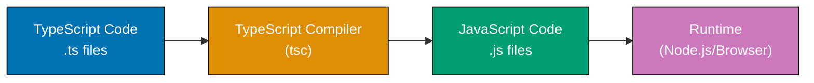
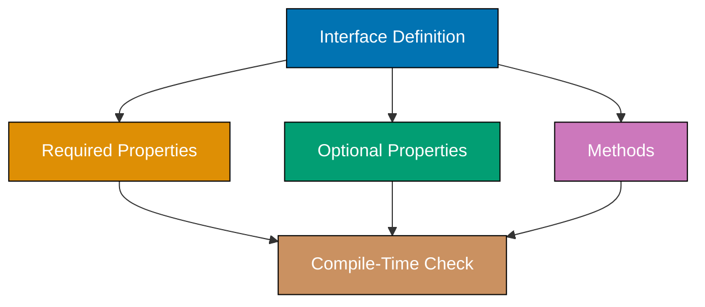
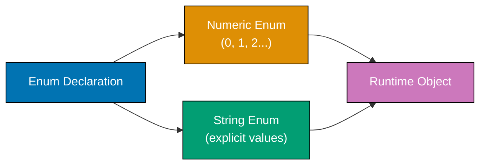
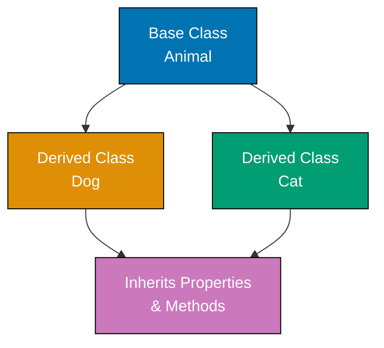

## Contoh 1: Basic Types dan Type Annotations

TypeScript adalah superset JavaScript yang bertipe statis yang menambahkan pengecekan tipe waktu kompilasi. Anda menulis tipe sebagai anotasi yang diverifikasi compiler sebelum menghasilkan JavaScript.



**Code**:

```typescript
// PRIMITIVE TYPES
let age: number = 25; // => age = 25 (type: number)
let name: string = "Alice"; // => name = "Alice" (type: string)
let isActive: boolean = true; // => isActive = true (type: boolean)
let value: null = null; // => value = null (type: null)
let notDefined: undefined = undefined; // => notDefined = undefined (type: undefined)

console.log(age, name, isActive); // => Output: 25 Alice true

// TYPE INFERENCE
let inferredNumber = 42; // => inferredNumber = 42 (type: number, inferred)
// => TypeScript infers type from initial value
let inferredString = "TypeScript"; // => inferredString = "TypeScript" (type: string, inferred)

// TYPE ANNOTATIONS OVERRIDE INFERENCE
let explicit: number = 100; // => explicit = 100 (type: number, explicit)
// => Annotation required for uninitialized variables

// Arrays
let numbers: number[] = [1, 2, 3]; // => numbers = [1, 2, 3] (type: number[])
let strings: Array<string> = ["a", "b"]; // => strings = ["a", "b"] (generic array syntax)

console.log(numbers[0]); // => Output: 1
```

**Poin Kunci**: TypeScript menambahkan anotasi tipe (`: type`) pada variabel JavaScript. Compiler menyimpulkan tipe saat memungkinkan tetapi mengizinkan anotasi eksplisit untuk kejelasan atau ketika inferensi tidak tersedia.

**Mengapa Penting**: Anotasi tipe menangkap error pada waktu kompilasi daripada runtime. Penelitian Microsoft menunjukkan bahwa TypeScript mendeteksi 15% bug sebelum kode dijalankan, mencegah crash produksi. Codebase besar seperti Visual Studio Code (300K+ baris), Angular, dan aplikasi Electron Slack menggunakan TypeScript untuk mempertahankan kualitas dalam skala. Pengecekan waktu kompilasi berarti error runtime lebih sedikit, autocomplete IDE lebih baik, dan refactoring lebih aman dibandingkan JavaScript.

## Contoh 2: Functions dan Parameter Types

Fungsi TypeScript dapat memiliki parameter bertipe dan nilai return. Arrow function dan sintaks fungsi tradisional keduanya mendukung anotasi tipe.

**Code**:

```typescript
// FUNCTION WITH TYPED PARAMETERS AND RETURN TYPE
function add(a: number, b: number): number {
  // => Parameters: a, b (both number)
  // => Return type: number (explicit)
  return a + b; // => Returns sum (must be number)
}

let result = add(5, 3); // => result = 8 (type: number, inferred from return)
console.log(result); // => Output: 8

// ARROW FUNCTION WITH TYPES
const multiply = (x: number, y: number): number => {
  // => Arrow function syntax
  // => Same type annotations as regular function
  return x * y; // => Returns product
};

let product = multiply(4, 7); // => product = 28
console.log(product); // => Output: 28

// OPTIONAL PARAMETERS
function greet(name: string, greeting?: string): string {
  // => greeting is optional (?: syntax)
  // => Optional params are type | undefined
  if (greeting) {
    // => Check if greeting provided
    return `${greeting}, ${name}!`; // => greeting = "Hello", returns "Hello, Alice!"
  }
  return `Hi, ${name}!`; // => Default greeting when no arg
}

console.log(greet("Alice", "Hello")); // => Output: Hello, Alice!
console.log(greet("Bob")); // => Output: Hi, Bob! (greeting undefined)

// DEFAULT PARAMETERS
function createUser(name: string, role: string = "user"): string {
  // => role defaults to "user"
  // => Default value sets type implicitly
  return `${name} (${role})`; // => Template literal concatenation
}

console.log(createUser("Charlie")); // => Output: Charlie (user)
console.log(createUser("Diana", "admin")); // => Output: Diana (admin)
```

**Poin Kunci**: Gunakan `: type` setelah parameter dan sebelum body fungsi untuk tipe return. Parameter opsional menggunakan sintaks `?:`, dan parameter default menyediakan nilai saat argumen dihilangkan.

**Mengapa Penting**: Signature fungsi bertipe mencegah seluruh kategori bug yang umum di JavaScript—memanggil fungsi dengan jumlah argumen salah, passing tipe salah, atau mengasumsikan nilai return yang tidak ada. Dalam aplikasi React produksi, props bertipe mencegah passing data invalid ke komponen. Dalam API Node.js, request handler bertipe menangkap parsing request invalid sebelum deployment. Function overload TypeScript memungkinkan mendefinisikan multiple call signature untuk API fleksibel sambil mempertahankan type safety.

## Contoh 3: Interface untuk Object Shapes

Interface mendefinisikan struktur objek—properti wajib, properti opsional, dan metode. Mereka adalah alat utama TypeScript untuk mendeskripsikan kontrak objek.



**Code**:

```typescript
// INTERFACE DEFINITION
interface User {
  // => Interface defines object shape
  id: number; // => Required property (must exist)
  name: string; // => Required property
  email?: string; // => Optional property (?: syntax)
  isActive: boolean; // => Required property
}

// OBJECT CONFORMING TO INTERFACE
const user1: User = {
  // => Object must match User interface
  id: 1, // => id provided (required)
  name: "Alice", // => name provided (required)
  email: "alice@example.com", // => email provided (optional)
  isActive: true, // => isActive provided (required)
}; // => All required props present, compiles successfully

console.log(user1.name); // => Output: Alice

// OMITTING OPTIONAL PROPERTY
const user2: User = {
  // => email omitted (allowed because optional)
  id: 2, // => id provided
  name: "Bob", // => name provided
  isActive: false, // => isActive provided
}; // => Compiles: optional props can be omitted

console.log(user2.email); // => Output: undefined (optional prop omitted)

// INTERFACE WITH METHODS
interface Calculator {
  // => Interface can include methods
  add(a: number, b: number): number; // => Method signature (not implementation)
  subtract(a: number, b: number): number;
}

const calc: Calculator = {
  // => Object implementing Calculator interface
  add(a, b) {
    // => Method implementation
    return a + b; // => Must return number (matches signature)
  },
  subtract(a, b) {
    // => Second method implementation
    return a - b; // => Must return number
  },
};

console.log(calc.add(10, 5)); // => Output: 15
```

**Poin Kunci**: Interface mendefinisikan kontrak objek dengan properti wajib, properti opsional (menggunakan `?:`), dan signature metode. Objek harus sesuai dengan struktur interface untuk memenuhi tipe.

**Mengapa Penting**: Interface memungkinkan structural typing—objek divalidasi berdasarkan bentuk, bukan inheritance. Ini mendukung filosofi "duck typing" TypeScript: jika berjalan seperti User dan berbicara seperti User, itu adalah User. Props komponen React adalah interface yang mendefinisikan bentuk data yang diharapkan. Tipe Request/Response Express adalah interface yang memastikan middleware menerima objek yang benar. Tim besar menggunakan interface sebagai kontrak antar modul, menangkap bug integrasi pada waktu kompilasi daripada produksi.

## Contoh 4: Type Aliases dan Union Types

Type alias membuat definisi tipe yang dapat digunakan kembali. Union type (`|`) memungkinkan nilai menjadi salah satu dari beberapa tipe, memungkinkan API yang fleksibel namun type-safe.

**Code**:

```typescript
// TYPE ALIAS FOR PRIMITIVE
type ID = number | string; // => ID can be number OR string (union type)
// => Type alias creates reusable type name

let userId: ID = 123; // => userId = 123 (number, matches ID)
let productId: ID = "prod-456"; // => productId = "prod-456" (string, matches ID)

console.log(userId, productId); // => Output: 123 prod-456

// TYPE ALIAS FOR OBJECT
type Point = {
  // => Type alias for object shape
  x: number; // => Required property
  y: number; // => Required property
};

const origin: Point = { x: 0, y: 0 }; // => origin matches Point type
console.log(origin); // => Output: { x: 0, y: 0 }

// UNION TYPE FOR FUNCTION PARAMETERS
function printId(id: number | string): void {
  // => id can be number OR string
  // => Return type: void (no return value)
  if (typeof id === "string") {
    // => Type guard: narrows id to string
    // => Inside this block, id is string
    console.log(`String ID: ${id.toUpperCase()}`); // => toUpperCase available (string method)
    // => Output: String ID: PROD-456
  } else {
    // => Type guard: narrows id to number
    console.log(`Number ID: ${id}`); // => id is number here
    // => Output: Number ID: 123
  }
}

printId(123); // => Calls with number
printId("prod-456"); // => Calls with string

// UNION TYPE WITH LITERAL TYPES
type Status = "pending" | "approved" | "rejected"; // => Literal type union (specific strings)
// => Only these 3 values allowed

let orderStatus: Status = "pending"; // => orderStatus = "pending" (matches literal)
console.log(orderStatus); // => Output: pending

// This would be a compile error:
// orderStatus = "unknown";              // => ERROR: "unknown" not in Status union
```

**Poin Kunci**: Type alias (`type Name = ...`) membuat definisi tipe yang dapat digunakan kembali. Union type (`A | B`) memungkinkan nilai menjadi salah satu dari beberapa tipe. Gunakan pemeriksaan `typeof` untuk mempersempit union type ke cabang spesifik.

**Mengapa Penting**: Union type memungkinkan API fleksibel sambil mempertahankan type safety. Redux action menggunakan union type untuk merepresentasikan berbagai bentuk action. API response menggunakan union `Success | Error` untuk tipe hasil. Generator kode GraphQL membuat union type untuk variasi skema. Pola ini menghilangkan defensive programming—alih-alih memeriksa `if (response.error)` di mana-mana, TypeScript memaksa penanganan semua kasus. Sistem tipe memandu Anda melalui setiap jalur kode, mencegah edge case yang terlupakan yang menyebabkan bug produksi.

## Contoh 5: Arrays dan Tuples

Array menyimpan beberapa nilai dengan tipe yang sama. Tuple adalah array dengan panjang tetap di mana setiap posisi memiliki tipe spesifik, berguna untuk mengembalikan beberapa nilai.

**Code**:

```typescript
// ARRAY OF NUMBERS
let numbers: number[] = [1, 2, 3, 4, 5]; // => numbers = [1, 2, 3, 4, 5] (type: number[])
// => All elements must be numbers

numbers.push(6); // => Appends 6 to end
// => numbers = [1, 2, 3, 4, 5, 6]
console.log(numbers); // => Output: [1, 2, 3, 4, 5, 6]

// GENERIC ARRAY SYNTAX
let strings: Array<string> = ["a", "b", "c"]; // => Alternative syntax (Array<T>)
// => Equivalent to string[]

console.log(strings[0]); // => Output: a

// TUPLE - FIXED LENGTH WITH SPECIFIC TYPES
let person: [string, number] = ["Alice", 30]; // => Tuple: [string, number]
// => Position 0 must be string, position 1 must be number

console.log(person[0]); // => Output: Alice (string)
console.log(person[1]); // => Output: 30 (number)

// TUPLE DESTRUCTURING
let [name, age] = person; // => Destructures tuple into variables
// => name = "Alice" (string), age = 30 (number)

console.log(name, age); // => Output: Alice 30

// TUPLE FOR FUNCTION RETURN
function getCoordinates(): [number, number] {
  // => Returns tuple [number, number]
  return [10, 20]; // => Returns [10, 20]
}

let [x, y] = getCoordinates(); // => Destructures into x, y
// => x = 10, y = 20
console.log(x, y); // => Output: 10 20

// ARRAY OF OBJECTS
interface Product {
  id: number;
  name: string;
}

let products: Product[] = [
  // => Array of Product interfaces
  { id: 1, name: "Laptop" }, // => Each element must match Product shape
  { id: 2, name: "Mouse" },
];

console.log(products[0].name); // => Output: Laptop
```

**Poin Kunci**: Array menyimpan beberapa nilai dengan satu tipe (`type[]` atau `Array<type>`). Tuple adalah array dengan panjang tetap dengan tipe spesifik per posisi (`[type1, type2]`), berguna untuk return multi-nilai.

**Mengapa Penting**: Tuple memecahkan masalah return multi-nilai JavaScript tanpa membuat objek wrapper. React hooks seperti `useState` mengembalikan tuple: `[state, setState]`. Sistem koordinat mengembalikan tuple `[x, y]`. Query database mengembalikan tuple `[error, result]`. Pola ini lebih efisien daripada objek untuk return multi-nilai sederhana dan memungkinkan destructuring posisional. Array typing mencegah pencampuran tipe yang tidak kompatibel—tidak ada lagi `[1, "two", true]` yang menyebabkan error runtime.

## Contoh 6: Enums untuk Named Constants

Enum mendefinisikan set konstanta bernama. Numeric enum auto-increment, string enum memerlukan nilai eksplisit. Mereka meningkatkan keterbacaan kode dengan mengganti magic number/string.



**Code**:

```typescript
// NUMERIC ENUM
enum Direction {
  // => Numeric enum (default)
  Up, // => Up = 0 (auto-assigned)
  Down, // => Down = 1 (auto-increments)
  Left, // => Left = 2
  Right, // => Right = 3
}

let move: Direction = Direction.Up; // => move = 0 (Direction.Up)
console.log(move); // => Output: 0

// REVERSE MAPPING
console.log(Direction[0]); // => Output: Up (reverse lookup: number -> name)
// => Numeric enums support bidirectional mapping

// ENUM WITH CUSTOM START VALUE
enum Status {
  // => Custom starting value
  Pending = 1, // => Pending = 1 (explicit)
  Approved, // => Approved = 2 (auto-increments)
  Rejected, // => Rejected = 3
}

console.log(Status.Approved); // => Output: 2

// STRING ENUM
enum LogLevel {
  // => String enum (no auto-increment)
  Error = "ERROR", // => Error = "ERROR" (explicit value required)
  Warning = "WARNING", // => Warning = "WARNING"
  Info = "INFO", // => Info = "INFO"
  Debug = "DEBUG", // => Debug = "DEBUG"
}

function log(level: LogLevel, message: string): void {
  // => level must be LogLevel enum
  console.log(`[${level}] ${message}`); // => Template literal with enum value
}

log(LogLevel.Error, "Database connection failed"); // => Output: [ERROR] Database connection failed
log(LogLevel.Info, "Server started"); // => Output: [INFO] Server started

// CONST ENUM (COMPILE-TIME ONLY)
const enum Color {
  // => const enum (no runtime object)
  Red = "RED", // => Values inlined at compile time
  Green = "GREEN",
  Blue = "BLUE",
}

let favorite: Color = Color.Blue; // => Compiles to: let favorite = "BLUE"
// => No runtime Color object created
console.log(favorite); // => Output: BLUE
```

**Poin Kunci**: Numeric enum auto-increment dari 0 (atau start kustom). String enum memerlukan nilai eksplisit. Gunakan enum untuk mengganti magic number/string dengan konstanta bernama untuk keterbacaan lebih baik.

**Mengapa Penting**: Enum mencegah typo dalam string literal yang menyebabkan bug runtime. Kode status API menjadi `HttpStatus.OK` alih-alih `200`. Tipe action Redux menjadi `ActionType.FETCH_USER` alih-alih `"FETCH_USER"`. State koneksi database menjadi `ConnectionState.Connected` alih-alih magic number. Compiler menangkap nilai enum invalid pada waktu build. Namun, string enum sering lebih disukai daripada numeric enum di produksi karena lebih debuggable—melihat `"ERROR"` di log lebih jelas daripada `0`.

## Contoh 7: Type Assertions dan Type Casting

Type assertion memberitahu compiler untuk memperlakukan nilai sebagai tipe spesifik ketika Anda tahu lebih banyak daripada yang dapat disimpulkan TypeScript. Gunakan dengan hemat karena mereka melewati pengecekan tipe.

**Code**:

```typescript
// TYPE ASSERTION WITH 'as' SYNTAX
let value: any = "Hello, TypeScript"; // => value has type 'any' (no type checking)
// => any type disables type safety

let length: number = (value as string).length; // => Asserts value is string
// => TypeScript allows .length access
// => length = 17 (string length)

console.log(length); // => Output: 17

// ANGLE BRACKET SYNTAX (ALTERNATIVE)
let length2: number = (<string>value).length; // => Alternative syntax (not in JSX)
// => Equivalent to 'as string'
// => Avoid in React (.tsx files)

console.log(length2); // => Output: 17

// TYPE ASSERTION WITH DOM ELEMENTS
const input = document.getElementById("username"); // => Returns HTMLElement | null
// => Generic element type

if (input) {
  // => Null check required
  // Type assertion to specific element type
  const inputElement = input as HTMLInputElement; // => Assert it's HTMLInputElement
  // => Enables access to .value property

  inputElement.value = "Alice"; // => Sets input value
  // => .value only exists on HTMLInputElement

  console.log(inputElement.value); // => Output: Alice
}

// NON-NULL ASSERTION OPERATOR
function getValue(): string | null {
  // => May return null
  return "data"; // => Returns "data" (not null)
}

let result = getValue(); // => result type: string | null
let upperCase = result!.toUpperCase(); // => ! asserts result is not null
// => Dangerous: runtime error if actually null
// => upperCase = "DATA"

console.log(upperCase); // => Output: DATA

// CONST ASSERTION
let point = { x: 10, y: 20 } as const; // => 'as const' makes object readonly
// => point type: { readonly x: 10; readonly y: 20 }
// => Properties become literal types

console.log(point.x); // => Output: 10
// point.x = 15;                         // => ERROR: Cannot assign to readonly property
```

**Poin Kunci**: Type assertion (`as Type` atau `<Type>`) memberitahu TypeScript untuk memperlakukan nilai sebagai tipe spesifik. Gunakan `!` untuk assert nilai non-null. Gunakan `as const` untuk objek readonly dengan literal type.

**Mengapa Penting**: Type assertion diperlukan saat bekerja dengan DOM API (TypeScript tidak bisa tahu `getElementById` mengembalikan HTMLInputElement), library eksternal tanpa tipe, atau migrasi JavaScript ke TypeScript. Namun, mereka berbahaya—mereka melewati pengecekan tipe dan dapat menyebabkan error runtime jika salah. Kode produksi meminimalkan assertion melalui typing yang lebih baik (generics, type guard, interface proper). Non-null assertion `!` sangat berisiko dan harus dihindari kecuali Anda yakin nilai ada.

## Contoh 8: Classes dan Constructors

Class TypeScript menambahkan access modifier (public, private, protected), properti bertipe, dan constructor parameter property ke class JavaScript.

**Code**:

```typescript
// CLASS WITH TYPED PROPERTIES
class Person {
  // => Class definition
  name: string; // => Public property (default)
  private age: number; // => Private property (only accessible in class)
  protected email: string; // => Protected property (accessible in subclasses)

  constructor(name: string, age: number, email: string) {
    // => Constructor with typed params
    this.name = name; // => Initialize name property
    this.age = age; // => Initialize private age
    this.email = email; // => Initialize protected email
  }

  getAge(): number {
    // => Public method returning number
    return this.age; // => Access private property within class
  }

  introduce(): void {
    // => Method with no return value
    console.log(`Hi, I'm ${this.name}, ${this.age} years old`);
  }
}

const person = new Person("Alice", 30, "alice@example.com"); // => Create instance
// => Calls constructor
person.introduce(); // => Output: Hi, I'm Alice, 30 years old

console.log(person.name); // => Output: Alice (public property accessible)
// console.log(person.age);              // => ERROR: age is private
console.log(person.getAge()); // => Output: 30 (access via public method)

// CONSTRUCTOR PARAMETER PROPERTIES
class User {
  // => Shorthand syntax
  constructor(
    public id: number, // => public modifier creates + initializes property
    public username: string, // => Equivalent to: this.username = username
    private password: string, // => private property created automatically
  ) {} // => Empty body (initialization handled by modifiers)
}

const user = new User(1, "alice", "secret123"); // => Creates User instance
console.log(user.id, user.username); // => Output: 1 alice
// console.log(user.password);           // => ERROR: password is private

// CLASS WITH STATIC MEMBERS
class MathHelper {
  // => Utility class
  static PI: number = 3.14159; // => Static property (shared across instances)

  static square(x: number): number {
    // => Static method (called on class, not instance)
    return x * x; // => Returns x squared
  }
}

console.log(MathHelper.PI); // => Output: 3.14159 (access via class name)
console.log(MathHelper.square(5)); // => Output: 25 (call via class name)
```

**Poin Kunci**: Class mendukung properti bertipe, access modifier (public, private, protected), dan constructor parameter property untuk inisialisasi ringkas. Gunakan `static` untuk member tingkat class yang dibagikan antar instance.

**Mengapa Penting**: Sistem class TypeScript menjembatani pemrograman berorientasi objek dan JavaScript. Angular menggunakan class untuk komponen dan service. NestJS menggunakan class dengan decorator untuk controller dan provider. Access modifier memaksa enkapsulasi—properti private tidak bisa bocor di luar class, mencegah mutasi tidak disengaja. Constructor parameter property mengurangi boilerplate dibandingkan Java/C#. Ini membuat class TypeScript lebih produktif sambil mempertahankan prinsip OOP.

## Contoh 9: Inheritance dan Method Overriding

Class dapat meng-extend class lain untuk mewarisi properti dan metode. Subclass dapat meng-override metode parent sambil mempertahankan type safety.



**Code**:

```typescript
// BASE CLASS
class Animal {
  // => Parent class
  constructor(public name: string) {} // => Public property via constructor param

  makeSound(): void {
    // => Method to override in subclasses
    console.log("Some generic sound");
  }

  move(): void {
    // => Method inherited by all subclasses
    console.log(`${this.name} is moving`);
  }
}

// DERIVED CLASS
class Dog extends Animal {
  // => Dog inherits from Animal
  // => Gets name property and move() method

  constructor(
    name: string,
    public breed: string,
  ) {
    // => Additional property
    super(name); // => Call parent constructor
    // => MUST call super() before using 'this'
  }

  makeSound(): void {
    // => Override parent method
    console.log("Woof! Woof!"); // => Dog-specific implementation
  }

  fetch(): void {
    // => Dog-specific method
    console.log(`${this.name} is fetching`);
  }
}

const dog = new Dog("Buddy", "Golden Retriever"); // => Create Dog instance
dog.makeSound(); // => Output: Woof! Woof! (overridden method)
dog.move(); // => Output: Buddy is moving (inherited method)
dog.fetch(); // => Output: Buddy is fetching (Dog method)

// ANOTHER DERIVED CLASS
class Cat extends Animal {
  // => Cat also inherits from Animal
  makeSound(): void {
    // => Override with Cat implementation
    console.log("Meow!");
  }
}

const cat = new Cat("Whiskers"); // => Create Cat instance
cat.makeSound(); // => Output: Meow! (Cat's override)
cat.move(); // => Output: Whiskers is moving (inherited)

// POLYMORPHISM
const animals: Animal[] = [dog, cat]; // => Array of Animal (base type)
// => Can hold Dog and Cat instances

animals.forEach((animal) => {
  // => Iterate over animals
  animal.makeSound(); // => Calls appropriate override
}); // => Output: Woof! Woof!
// => Output: Meow!
```

**Poin Kunci**: Gunakan `extends` untuk mewarisi dari base class. Panggil `super()` di constructor sebelum mengakses `this`. Override metode dengan mendefinisikan ulang di subclass. Polimorfisme memungkinkan memperlakukan subclass sebagai instance base class.

**Mengapa Penting**: Inheritance memungkinkan reuse kode dan desain polimorfik. React class component meng-extend `React.Component`. Class middleware Express meng-extend base `Middleware`. Model ORM database meng-extend class base `Model`. Namun, TypeScript dan JavaScript modern semakin menyukai komposisi daripada inheritance—interface dan mixin memberikan lebih banyak fleksibilitas daripada hierarki inheritance dalam. Lebih baik inheritance dangkal (1-2 level) daripada chain dalam yang menjadi rapuh.

## Contoh 10: Abstract Classes

Abstract class mendefinisikan implementasi parsial yang harus diselesaikan subclass. Mereka tidak dapat diinstansiasi langsung dan menggunakan metode `abstract` sebagai kontrak.

**Code**:

```typescript
// ABSTRACT CLASS
abstract class Shape {
  // => Cannot instantiate directly
  // => new Shape() would be ERROR

  constructor(public color: string) {} // => Constructor available to subclasses

  abstract area(): number; // => Abstract method (no implementation)
  // => Subclasses MUST implement this

  describe(): void {
    // => Concrete method (has implementation)
    console.log(`A ${this.color} shape with area ${this.area()}`);
    // => Calls abstract area() method
  }
}

// CONCRETE SUBCLASS
class Circle extends Shape {
  // => Must implement all abstract methods
  constructor(
    color: string,
    public radius: number,
  ) {
    super(color); // => Call parent constructor
  }

  area(): number {
    // => Implement required abstract method
    return Math.PI * this.radius ** 2; // => Returns circle area
  }
}

class Rectangle extends Shape {
  // => Another concrete subclass
  constructor(
    color: string,
    public width: number,
    public height: number,
  ) {
    super(color);
  }

  area(): number {
    // => Implement required abstract method
    return this.width * this.height; // => Returns rectangle area
  }
}

const circle = new Circle("red", 5); // => Create Circle instance
console.log(circle.area()); // => Output: 78.53981633974483
circle.describe(); // => Output: A red shape with area 78.53981633974483

const rectangle = new Rectangle("blue", 10, 20); // => Create Rectangle instance
console.log(rectangle.area()); // => Output: 200
rectangle.describe(); // => Output: A blue shape with area 200

// ARRAY OF ABSTRACT TYPE
const shapes: Shape[] = [circle, rectangle]; // => Array of abstract type
// => Holds concrete subclass instances

shapes.forEach((shape) => {
  // => Polymorphic iteration
  shape.describe(); // => Calls describe() on each shape
}); // => Output: A red shape with area 78.53...
// => Output: A blue shape with area 200
```

**Poin Kunci**: Abstract class menggunakan keyword `abstract` dan tidak dapat diinstansiasi. Metode abstract tidak memiliki implementasi dan harus diimplementasikan oleh concrete subclass. Campurkan metode abstract dan concrete untuk implementasi parsial.

**Mengapa Penting**: Abstract class memaksa kontrak di seluruh subclass sambil menyediakan implementasi bersama. Tidak seperti interface (yang hanya mendefinisikan struktur), abstract class dapat menyertakan kode kerja yang diwarisi subclass. Framework ORM menggunakan class abstract `Model` dengan metode concrete `save()` dan metode abstract `validate()`. Game engine menggunakan abstract `GameObject` dengan concrete `update()` dan abstract `render()`. Namun, banyak developer TypeScript lebih memilih interface daripada abstract class karena interface mendukung multiple inheritance dan lebih fleksibel.

## Contoh 11: Literal Types dan Type Narrowing

Literal type membatasi nilai pada literal spesifik. Type narrowing menggunakan control flow untuk mempersempit union type ke tipe lebih spesifik.

**Code**:

```typescript
// STRING LITERAL TYPE
type Direction = "north" | "south" | "east" | "west"; // => Only these 4 values allowed

function move(direction: Direction): void {
  // => Parameter must be one of 4 literals
  console.log(`Moving ${direction}`);
}

move("north"); // => Output: Moving north
// move("up");                           // => ERROR: "up" not in Direction type

// NUMERIC LITERAL TYPE
type DiceRoll = 1 | 2 | 3 | 4 | 5 | 6; // => Only integers 1-6 allowed

function rollDice(): DiceRoll {
  // => Must return 1-6
  return (Math.floor(Math.random() * 6) + 1) as DiceRoll; // => Type assertion needed
  // => Math.random() not typed as DiceRoll
}

console.log(rollDice()); // => Output: (random 1-6)

// TYPE NARROWING WITH typeof
function printValue(value: string | number): void {
  // => Union type parameter
  if (typeof value === "string") {
    // => Type guard: narrows to string
    console.log(value.toUpperCase()); // => value is string here
    // => toUpperCase() available
  } else {
    // => Type guard: narrows to number
    console.log(value.toFixed(2)); // => value is number here
    // => toFixed() available
  }
}

printValue("hello"); // => Output: HELLO
printValue(42.567); // => Output: 42.57

// TYPE NARROWING WITH instanceof
class Dog {
  bark(): void {
    console.log("Woof!");
  }
}

class Cat {
  meow(): void {
    console.log("Meow!");
  }
}

function makeSound(animal: Dog | Cat): void {
  // => Union of class types
  if (animal instanceof Dog) {
    // => instanceof narrows to Dog
    animal.bark(); // => bark() available (Dog method)
  } else {
    // => Must be Cat (exhaustive check)
    animal.meow(); // => meow() available (Cat method)
  }
}

makeSound(new Dog()); // => Output: Woof!
makeSound(new Cat()); // => Output: Meow!

// TYPE NARROWING WITH 'in' OPERATOR
interface Bird {
  fly(): void;
  layEggs(): void;
}

interface Fish {
  swim(): void;
  layEggs(): void;
}

function move2(animal: Bird | Fish): void {
  // => Both have layEggs, different movement
  if ("fly" in animal) {
    // => Check if 'fly' property exists
    // => Narrows to Bird
    animal.fly(); // => fly() available (Bird method)
  } else {
    // => Must be Fish
    animal.swim(); // => swim() available (Fish method)
  }
}
```

**Poin Kunci**: Literal type membatasi variabel pada nilai spesifik. Type narrowing menggunakan pemeriksaan `typeof`, `instanceof`, dan `in` untuk mempersempit union type. Analisis control flow TypeScript secara otomatis mempersempit tipe berdasarkan pemeriksaan kondisional.

**Mengapa Penting**: Literal type membuat enum compile-time tanpa overhead runtime. Tipe action Redux menggunakan union literal: `type Action = { type: "INCREMENT" } | { type: "DECREMENT" }`. Metode HTTP menggunakan literal: `type Method = "GET" | "POST" | "PUT" | "DELETE"`. Type narrowing menghilangkan defensive programming—tidak perlu pemeriksaan tipe runtime ketika TypeScript membuktikan tipe secara statis. Pola ini fundamental untuk discriminated union di TypeScript lanjutan.

## Contoh 12: Intersection Types

Intersection type (`&`) menggabungkan beberapa tipe menjadi satu. Nilai harus memenuhi semua tipe yang digabungkan secara bersamaan.

**Code**:

```typescript
// INTERSECTION OF INTERFACES
interface Loggable {
  // => Interface with logging capability
  log(): void;
}

interface Serializable {
  // => Interface with serialization
  serialize(): string;
}

type LoggableSerializable = Loggable & Serializable; // => Combines both interfaces
// => Must have log() AND serialize()

class User implements LoggableSerializable {
  // => Class must implement both
  constructor(
    public name: string,
    public email: string,
  ) {}

  log(): void {
    // => Implement Loggable.log()
    console.log(`User: ${this.name}`);
  }

  serialize(): string {
    // => Implement Serializable.serialize()
    return JSON.stringify({ name: this.name, email: this.email });
  }
}

const user = new User("Alice", "alice@example.com");
user.log(); // => Output: User: Alice
console.log(user.serialize()); // => Output: {"name":"Alice","email":"alice@example.com"}

// INTERSECTION OF TYPE ALIASES
type Point2D = { x: number; y: number }; // => 2D coordinates
type Label = { label: string }; // => Label property

type LabeledPoint = Point2D & Label; // => Combines both types
// => Must have x, y, AND label

const point: LabeledPoint = {
  // => Object satisfies intersection
  x: 10, // => From Point2D
  y: 20, // => From Point2D
  label: "Origin", // => From Label
};

console.log(point); // => Output: { x: 10, y: 20, label: 'Origin' }

// INTERSECTION WITH FUNCTION TYPES
type Logger = () => void; // => Function type (no params, void return)
type Formatter = (text: string) => string; // => Function type with params

type LoggerFormatter = Logger & Formatter; // => Intersection of function types
// => Function must match BOTH signatures
// => Practically impossible (conflicting signatures)

// PRACTICAL INTERSECTION - EXTENDING TYPES
type Entity = {
  // => Base entity type
  id: number;
  createdAt: Date;
};

type Nameable = {
  // => Adds name property
  name: string;
};

type User2 = Entity & Nameable; // => Combines Entity + Nameable
// => Has id, createdAt, AND name

const user2: User2 = {
  // => Object satisfies User2
  id: 1, // => From Entity
  createdAt: new Date(), // => From Entity
  name: "Bob", // => From Nameable
};

console.log(user2.name); // => Output: Bob
```

**Poin Kunci**: Intersection type (`A & B`) menggabungkan beberapa tipe—hasilnya harus memenuhi semua tipe secara bersamaan. Gunakan intersection untuk memperluas tipe dengan properti tambahan atau menggabungkan mixin.

**Mengapa Penting**: Intersection type memungkinkan pola mixin tanpa inheritance. React HOC (Higher-Order Component) menggunakan intersection untuk menambahkan props: `type EnhancedProps = BaseProps & WithAuth`. Redux connected component menggabungkan `OwnProps & StateProps & DispatchProps`. Komposisi utility type menggunakan intersection: `type ReadonlyPartial<T> = Readonly<T> & Partial<T>`. Tidak seperti union type (yang "either/or"), intersection adalah "both/and", memungkinkan komposisi tipe fleksibel.

## Contoh 13: Type Guards dengan User-Defined Functions

Fungsi type guard kustom menggunakan keyword `is` untuk mempersempit tipe. Mereka mengembalikan boolean yang digunakan TypeScript untuk control flow narrowing.

**Code**:

```typescript
// INTERFACE FOR TYPE GUARD EXAMPLE
interface Cat {
  // => Cat interface
  name: string;
  meow(): void;
}

interface Dog {
  // => Dog interface
  name: string;
  bark(): void;
}

// USER-DEFINED TYPE GUARD
function isCat(animal: Cat | Dog): animal is Cat {
  // => Type predicate: 'animal is Cat'
  // => Return type tells TypeScript about narrowing
  return (animal as Cat).meow !== undefined; // => Check if meow method exists
  // => Type assertion needed to access meow
}

function makeSound(animal: Cat | Dog): void {
  // => Union type parameter
  if (isCat(animal)) {
    // => User-defined type guard
    // => Inside block, TypeScript knows animal is Cat
    animal.meow(); // => meow() available (Cat method)
  } else {
    // => TypeScript knows animal is Dog
    animal.bark(); // => bark() available (Dog method)
  }
}

const cat: Cat = {
  // => Create Cat object
  name: "Whiskers",
  meow() {
    console.log("Meow!");
  },
};

const dog: Dog = {
  // => Create Dog object
  name: "Buddy",
  bark() {
    console.log("Woof!");
  },
};

makeSound(cat); // => Output: Meow!
makeSound(dog); // => Output: Woof!

// TYPE GUARD FOR PRIMITIVES
function isString(value: unknown): value is string {
  // => unknown type (safe any)
  // => Narrows to string
  return typeof value === "string"; // => Runtime check
}

function processValue(value: unknown): void {
  // => unknown type parameter
  if (isString(value)) {
    // => Type guard narrows to string
    console.log(value.toUpperCase()); // => toUpperCase() available
  } else {
    console.log("Not a string");
  }
}

processValue("hello"); // => Output: HELLO
processValue(42); // => Output: Not a string

// TYPE GUARD FOR ARRAY
function isStringArray(value: unknown): value is string[] {
  // => Narrows to string[]
  return Array.isArray(value) && value.every((item) => typeof item === "string");
  // => Check if array AND all elements are strings
}

function printStrings(value: unknown): void {
  if (isStringArray(value)) {
    // => Type guard narrows to string[]
    value.forEach((str) => console.log(str.toUpperCase())); // => str is string
  }
}

printStrings(["a", "b", "c"]); // => Output: A B C
```

**Poin Kunci**: User-defined type guard menggunakan sintaks return type `parameter is Type`. Return boolean fungsi memberitahu TypeScript untuk mempersempit tipe di blok kondisional. Gunakan tipe `unknown` untuk maximum type safety ketika tipe input benar-benar tidak diketahui.

**Mengapa Penting**: Type guard menghilangkan type assertion tidak aman di seluruh codebase. Parsing API response menggunakan guard seperti `isUser(data)` sebelum mengakses properti user. Event handling menggunakan `isMouseEvent(event)` untuk mengakses clientX/clientY dengan aman. Validasi form menggunakan `isValidEmail(value)` untuk mempersempit dari input unknown. Pola ini membuat analisis control flow TypeScript kuat—compiler membuktikan tipe secara statis, mencegah error runtime dari data invalid.

## Contoh 14: readonly Properties dan Readonly Utility Type

Modifier `readonly` mencegah reassignment properti. Utility type `Readonly<T>` membuat semua properti readonly.

**Code**:

```typescript
// READONLY PROPERTY
interface User {
  // => Interface with readonly property
  readonly id: number; // => id cannot be reassigned after initialization
  name: string; // => name is mutable
}

const user: User = {
  // => Create User object
  id: 1, // => id initialized
  name: "Alice", // => name initialized
};

user.name = "Bob"; // => ALLOWED: name is mutable
console.log(user.name); // => Output: Bob

// user.id = 2;                          // => ERROR: Cannot assign to readonly property

// READONLY ARRAY
const numbers: readonly number[] = [1, 2, 3]; // => Readonly array
console.log(numbers[0]); // => Output: 1

// numbers.push(4);                      // => ERROR: push doesn't exist on readonly array
// numbers[0] = 10;                      // => ERROR: Cannot assign to index

// READONLY<T> UTILITY TYPE
interface Point {
  // => Mutable interface
  x: number;
  y: number;
}

const point: Readonly<Point> = {
  // => Readonly<T> makes all properties readonly
  x: 10, // => x initialized
  y: 20, // => y initialized
};

console.log(point.x); // => Output: 10

// point.x = 15;                         // => ERROR: Cannot assign to readonly property
// point.y = 25;                         // => ERROR: Cannot assign to readonly property

// READONLY WITH ARRAYS AND OBJECTS
interface Config {
  database: {
    host: string;
    port: number;
  };
  features: string[];
}

const config: Readonly<Config> = {
  // => Top-level readonly
  database: { host: "localhost", port: 5432 },
  features: ["auth", "logging"],
};

// config.database = { host: "prod", port: 5432 };  // => ERROR: Cannot reassign database

// However, nested properties are still mutable:
config.database.host = "production"; // => ALLOWED: Readonly is shallow
config.features.push("metrics"); // => ALLOWED: Array methods still work

console.log(config.database.host); // => Output: production
console.log(config.features); // => Output: ["auth", "logging", "metrics"]

// DEEP READONLY (UTILITY TYPE)
type DeepReadonly<T> = {
  // => Recursive readonly type
  readonly [P in keyof T]: T[P] extends object ? DeepReadonly<T[P]> : T[P];
}; // => Makes all nested properties readonly

const deepConfig: DeepReadonly<Config> = {
  database: { host: "localhost", port: 5432 },
  features: ["auth"],
};

// deepConfig.database.host = "prod";    // => ERROR: Cannot assign (deep readonly)
```

**Poin Kunci**: Gunakan modifier `readonly` untuk properti individual. Gunakan utility type `Readonly<T>` untuk membuat semua properti readonly. Perhatikan bahwa `Readonly<T>` adalah shallow—objek nested tetap mutable kecuali menggunakan tipe rekursif.

**Mengapa Penting**: Immutabilitas mencegah mutasi tidak disengaja yang menyebabkan bug dalam struktur data bersama. Props React adalah readonly untuk mencegah komponen memodifikasi state parent. State Redux adalah readonly untuk memaksa unidirectional data flow. Objek konfigurasi menggunakan readonly untuk mencegah modifikasi runtime. Namun, `readonly` TypeScript hanya compile-time—tidak mencegah mutasi dalam runtime JavaScript. Untuk immutabilitas sejati, gunakan library seperti Immer atau paksa dengan validasi runtime.

## Contoh 15: Optional Chaining dan Nullish Coalescing

Optional chaining (`?.`) mengakses properti nested yang mungkin null/undefined dengan aman. Nullish coalescing (`??`) menyediakan nilai fallback untuk null/undefined (tapi bukan nilai falsy seperti 0 atau "").

**Code**:

```typescript
// OPTIONAL CHAINING WITH OBJECTS
interface User {
  // => User interface with optional address
  name: string;
  address?: {
    // => Optional nested object
    street?: string;
    city?: string;
  };
}

const user1: User = {
  // => User without address
  name: "Alice",
};

const user2: User = {
  // => User with partial address
  name: "Bob",
  address: {
    city: "New York", // => street is undefined
  },
};

// SAFE PROPERTY ACCESS
console.log(user1.address?.city); // => Output: undefined (address is undefined)
// => Optional chaining prevents error
console.log(user2.address?.city); // => Output: New York
console.log(user2.address?.street); // => Output: undefined (street is undefined)

// WITHOUT OPTIONAL CHAINING (OLD WAY)
// console.log(user1.address.city);      // => ERROR: Cannot read property 'city' of undefined

// OPTIONAL CHAINING WITH METHODS
interface Calculator {
  add?: (a: number, b: number) => number; // => Optional method
}

const calc1: Calculator = {
  // => Calculator with add method
  add: (a, b) => a + b,
};

const calc2: Calculator = {}; // => Calculator without add method

console.log(calc1.add?.(5, 3)); // => Output: 8 (method exists)
console.log(calc2.add?.(5, 3)); // => Output: undefined (method doesn't exist)
// => No error thrown

// OPTIONAL CHAINING WITH ARRAYS
interface Response {
  data?: string[]; // => Optional array
}

const response1: Response = {
  // => Response with data
  data: ["a", "b", "c"],
};

const response2: Response = {}; // => Response without data

console.log(response1.data?.[0]); // => Output: a
console.log(response2.data?.[0]); // => Output: undefined (data doesn't exist)

// NULLISH COALESCING
const value1: string | null = null; // => null value
const value2: string | undefined = undefined; // => undefined value
const value3: string = ""; // => Empty string (falsy but not nullish)
const value4: number = 0; // => Zero (falsy but not nullish)

console.log(value1 ?? "default"); // => Output: default (null is nullish)
console.log(value2 ?? "default"); // => Output: default (undefined is nullish)
console.log(value3 ?? "default"); // => Output: "" (empty string NOT nullish)
console.log(value4 ?? "default"); // => Output: 0 (zero NOT nullish)

// COMPARISON WITH LOGICAL OR (||)
console.log(value3 || "default"); // => Output: default ("" is falsy)
console.log(value4 || "default"); // => Output: default (0 is falsy)
// => || treats all falsy values as missing
// => ?? only treats null/undefined as missing

// COMBINING OPTIONAL CHAINING AND NULLISH COALESCING
const user3: User = { name: "Charlie" };

const city = user3.address?.city ?? "Unknown"; // => Chain together safely
// => Provides fallback for undefined
console.log(city); // => Output: Unknown
```

**Poin Kunci**: Optional chaining (`?.`) mengakses properti yang berpotensi null/undefined dengan aman tanpa error. Nullish coalescing (`??`) menyediakan default untuk null/undefined sambil mempertahankan nilai falsy seperti 0 dan "". Gabungkan keduanya untuk akses nested aman dengan fallback.

**Mengapa Penting**: Optional chaining menghilangkan pemeriksaan null defensif yang mengacaukan codebase. Sebelum `?.`, mengakses `user.address.city` memerlukan: `user && user.address && user.address.city`. Sekarang hanya `user?.address?.city`. API response menggunakan ini secara luas: `response?.data?.items?.[0]?.name`. Operator nullish coalescing memperbaiki bug logical OR (`||`) di mana `0` atau `""` diperlakukan sebagai nilai hilang. Ini kritis untuk konfigurasi: `const port = config.port ?? 3000` mempertahankan port 0 jika diset eksplisit, sementara `config.port || 3000` akan mengganti 0 dengan 3000.

## Contoh 16: Template Literal Types

Template literal type membuat string type dari pola string literal. Mereka memungkinkan validasi string presisi pada waktu kompilasi.

**Code**:

```typescript
// SIMPLE TEMPLATE LITERAL TYPE
type Greeting = `hello ${string}`; // => String must start with "hello "
// => Followed by any string

const validGreeting: Greeting = "hello world"; // => VALID: matches pattern
const invalidGreeting: Greeting = "hi world"; // => ERROR: doesn't start with "hello "

// TEMPLATE LITERAL WITH UNIONS
type Color = "red" | "blue" | "green"; // => Color union
type Quantity = "one" | "two" | "three"; // => Quantity union

type ColoredQuantity = `${Quantity} ${Color}`; // => Cartesian product of unions
// => Creates "one red" | "one blue" | ... | "three green"

const item: ColoredQuantity = "two blue"; // => VALID: matches pattern
console.log(item); // => Output: two blue

// CSS PROPERTY PATTERN
type CSSProperty = `${"margin" | "padding"}-${"top" | "bottom" | "left" | "right"}`;
// => Creates margin-top, margin-bottom, padding-left, etc.

const cssProperty: CSSProperty = "margin-top"; // => VALID
console.log(cssProperty); // => Output: margin-top

// EVENT HANDLER PATTERN
type EventName = "click" | "focus" | "blur"; // => Event types
type EventHandler = `on${Capitalize<EventName>}`; // => Creates onClick, onFocus, onBlur
// => Capitalize is built-in utility type

const handler: EventHandler = "onClick"; // => VALID: matches pattern
console.log(handler); // => Output: onClick

// API ENDPOINT PATTERN
type HttpMethod = "GET" | "POST" | "PUT" | "DELETE";
type Endpoint = `/api/${"users" | "products"}/${string}`; // => /api/users/* or /api/products/*

const apiUrl: Endpoint = "/api/users/123"; // => VALID
console.log(apiUrl); // => Output: /api/users/123

// COMBINING TEMPLATE LITERALS WITH MAPPED TYPES
type HTTPMethod = "GET" | "POST";
type Endpoint2 = "users" | "products";

type API = {
  [K in `${HTTPMethod} /${Endpoint2}`]: () => void; // => Creates "GET /users", "POST /products", etc.
};

const api: API = {
  // => Object with generated keys
  "GET /users": () => console.log("Fetching users"),
  "GET /products": () => console.log("Fetching products"),
  "POST /users": () => console.log("Creating user"),
  "POST /products": () => console.log("Creating product"),
};

api["GET /users"](); // => Output: Fetching users
```

**Poin Kunci**: Template literal type menggunakan backtick dengan placeholder `${}` untuk membuat pola string. Gabungkan dengan union untuk menghasilkan semua permutasi. Gunakan utility built-in seperti `Capitalize` untuk transformasi string.

**Mengapa Penting**: Template literal type memungkinkan validasi compile-time untuk pola string yang seharusnya memerlukan pemeriksaan runtime. Library CSS-in-JS menggunakannya untuk nama properti. Generator kode GraphQL membuat pola query. API route typing menggunakannya: `type Route = \`/${string}\``. Ini menangkap typo dalam konstanta string pada waktu build—tidak ada lagi bug`"onClick"`vs`"onclick"`. Pola ini sangat kuat dalam library yang menyediakan API type-safe di atas konfigurasi berbasis string.

## Contoh 17: keyof dan typeof Operators

`keyof` membuat union dari nama properti objek. `typeof` menyimpulkan tipe dari nilai. Bersama-sama mereka memungkinkan akses properti type-safe.

**Code**:

```typescript
// keyof OPERATOR
interface User {
  // => User interface
  id: number;
  name: string;
  email: string;
}

type UserKeys = keyof User; // => Creates "id" | "name" | "email"
// => Union of property names

function getUserProperty(user: User, key: UserKeys): string | number {
  // => Key must be valid property
  return user[key]; // => Type-safe property access
}

const user: User = {
  id: 1,
  name: "Alice",
  email: "alice@example.com",
};

console.log(getUserProperty(user, "name")); // => Output: Alice
// console.log(getUserProperty(user, "invalid"));  // => ERROR: "invalid" not in UserKeys

// typeof OPERATOR
const config = {
  // => JavaScript object
  host: "localhost",
  port: 3000,
  debug: true,
};

type Config = typeof config; // => Infers type from value
// => { host: string; port: number; debug: boolean }

function loadConfig(cfg: Config): void {
  // => Use inferred type
  console.log(`${cfg.host}:${cfg.port}`);
}

loadConfig(config); // => Output: localhost:3000

// COMBINING keyof AND typeof
const endpoints = {
  // => Endpoints object
  users: "/api/users",
  products: "/api/products",
  orders: "/api/orders",
};

type Endpoint = keyof typeof endpoints; // => "users" | "products" | "orders"
// => typeof gets type, keyof gets keys

function fetchData(endpoint: Endpoint): string {
  // => Type-safe endpoint parameter
  return endpoints[endpoint]; // => Access with valid key
}

console.log(fetchData("users")); // => Output: /api/users
// console.log(fetchData("invalid"));    // => ERROR: "invalid" not in Endpoint

// GENERIC PROPERTY ACCESS
function getProperty<T, K extends keyof T>(obj: T, key: K): T[K] {
  // => Generic function
  // => K must be key of T
  // => Return type is T[K]
  return obj[key]; // => Type-safe property access
}

interface Product {
  id: number;
  name: string;
  price: number;
}

const product: Product = {
  id: 1,
  name: "Laptop",
  price: 999,
};

const productName = getProperty(product, "name"); // => Type: string (inferred from Product["name"])
const productPrice = getProperty(product, "price"); // => Type: number (inferred from Product["price"])

console.log(productName); // => Output: Laptop
console.log(productPrice); // => Output: 999

// MAPPED TYPE WITH keyof
type ReadonlyUser = {
  // => Mapped type
  readonly [K in keyof User]: User[K]; // => Iterate over User keys
}; // => Makes all properties readonly

const readonlyUser: ReadonlyUser = {
  id: 1,
  name: "Bob",
  email: "bob@example.com",
};

// readonlyUser.name = "Charlie";        // => ERROR: Cannot assign to readonly property
```

**Poin Kunci**: `keyof T` membuat union dari nama properti dari tipe `T`. `typeof value` menyimpulkan tipe dari nilai JavaScript. Gunakan `K extends keyof T` dalam generic untuk akses properti type-safe.

**Mengapa Penting**: `keyof` memungkinkan akses properti type-safe tanpa hardcode nama properti. Library ORM menggunakan `keyof Model` untuk query type-safe. Library form menggunakan `keyof FormData` untuk validasi field. `typeof` menghilangkan definisi tipe duplikat—definisikan nilai JavaScript sekali, simpulkan tipenya. Ini fundamental untuk mapped type TypeScript dan generic constraint.

## Contoh 18: Partial, Required, Pick, Omit Utility Types

TypeScript menyediakan utility type built-in untuk mentransformasi tipe yang ada. Ini memungkinkan komposisi tipe fleksibel tanpa duplikasi.

**Code**:

```typescript
// BASE INTERFACE
interface User {
  // => Base User type
  id: number;
  name: string;
  email: string;
  age: number;
  address: string;
}

// PARTIAL<T> - MAKES ALL PROPERTIES OPTIONAL
type PartialUser = Partial<User>; // => All properties become optional
// => { id?: number; name?: string; ... }

function updateUser(id: number, updates: PartialUser): void {
  // => Can pass any subset
  console.log(`Updating user ${id}`, updates);
}

updateUser(1, { name: "Alice" }); // => VALID: only name provided
updateUser(2, { age: 30, email: "bob@example.com" }); // => VALID: partial update

// REQUIRED<T> - MAKES ALL PROPERTIES REQUIRED
interface Config {
  // => Config with optional properties
  host?: string;
  port?: number;
  debug?: boolean;
}

type RequiredConfig = Required<Config>; // => All properties become required
// => { host: string; port: number; debug: boolean }

const config: RequiredConfig = {
  // => Must provide all properties
  host: "localhost",
  port: 3000,
  debug: true,
};

console.log(config.host); // => Output: localhost

// PICK<T, K> - SELECT SPECIFIC PROPERTIES
type UserPreview = Pick<User, "id" | "name">; // => Only id and name
// => { id: number; name: string }

const preview: UserPreview = {
  // => Only picked properties allowed
  id: 1,
  name: "Alice",
};

console.log(preview); // => Output: { id: 1, name: 'Alice' }

// OMIT<T, K> - EXCLUDE SPECIFIC PROPERTIES
type UserWithoutEmail = Omit<User, "email">; // => All except email
// => { id, name, age, address }

const userWithoutEmail: UserWithoutEmail = {
  id: 1,
  name: "Bob",
  age: 25,
  address: "123 Main St",
};

console.log(userWithoutEmail); // => Output: { id: 1, name: 'Bob', age: 25, address: '123 Main St' }

// COMBINING UTILITY TYPES
type UserUpdate = Partial<Omit<User, "id">>; // => All properties optional except id removed
// => { name?: string; email?: string; age?: number; address?: string }

function patchUser(id: number, data: UserUpdate): void {
  console.log(`Patching user ${id}`, data);
}

patchUser(1, { name: "Charlie" }); // => VALID: partial update without id

// PICK WITH UNION
type ContactInfo = Pick<User, "email" | "address">; // => Email and address only

const contact: ContactInfo = {
  email: "diana@example.com",
  address: "456 Elm St",
};

console.log(contact); // => Output: { email: 'diana@example.com', address: '456 Elm St' }
```

**Poin Kunci**: `Partial<T>` membuat semua properti opsional. `Required<T>` membuat semua required. `Pick<T, K>` memilih properti spesifik. `Omit<T, K>` mengecualikan properti. Gabungkan untuk transformasi kompleks tanpa definisi tipe manual.

**Mengapa Penting**: Utility type menghilangkan boilerplate dan mencegah drift antara tipe terkait. Tipe API request/response menggunakan `Partial` untuk update. Model database menggunakan `Omit<User, "password">` untuk data publik. State form menggunakan `Required<FormData>` setelah validasi. Utility ini adalah fondasi API type-safe—mereka mengadaptasi tipe yang ada ke konteks spesifik tanpa duplikasi.

## Contoh 19: Record Utility Type

`Record<K, V>` membuat object type dengan kunci `K` dan nilai `V`. Berguna untuk membuat dictionary dan map dengan constraint tipe.

**Code**:

```typescript
// BASIC RECORD TYPE
type UserRole = "admin" | "user" | "guest"; // => Literal type union

type RolePermissions = Record<UserRole, string[]>; // => Object with UserRole keys, string[] values
// => { admin: string[], user: string[], guest: string[] }

const permissions: RolePermissions = {
  // => Must provide all roles
  admin: ["create", "read", "update", "delete"], // => Admin permissions
  user: ["create", "read", "update"], // => User permissions
  guest: ["read"], // => Guest permissions (limited)
};

console.log(permissions.admin); // => Output: ["create", "read", "update", "delete"]

// RECORD WITH NUMERIC KEYS
type StatusCode = 200 | 404 | 500; // => HTTP status codes

type StatusMessages = Record<StatusCode, string>; // => Map codes to messages

const messages: StatusMessages = {
  // => All codes must be provided
  200: "OK",
  404: "Not Found",
  500: "Internal Server Error",
};

console.log(messages[404]); // => Output: Not Found

// RECORD FOR CONFIGURATION
type Environment = "development" | "staging" | "production";

interface DatabaseConfig {
  // => Database connection config
  host: string;
  port: number;
}

type EnvironmentConfig = Record<Environment, DatabaseConfig>; // => Config per environment

const dbConfig: EnvironmentConfig = {
  development: {
    host: "localhost",
    port: 5432,
  },
  staging: {
    host: "staging.db.example.com",
    port: 5432,
  },
  production: {
    host: "prod.db.example.com",
    port: 5432,
  },
};

console.log(dbConfig.production.host); // => Output: prod.db.example.com

// RECORD WITH STRING INDEX
type Dictionary = Record<string, number>; // => Any string key, number value
// => Equivalent to { [key: string]: number }

const scores: Dictionary = {
  // => Can add any string keys
  alice: 95,
  bob: 87,
  charlie: 92,
};

console.log(scores.alice); // => Output: 95
scores.diana = 88; // => VALID: add new key
console.log(scores.diana); // => Output: 88

// RECORD VS INDEX SIGNATURE
interface ScoresIndex {
  // => Index signature approach
  [key: string]: number;
}

const scoresIndex: ScoresIndex = {
  // => Same behavior as Record<string, number>
  alice: 95,
  bob: 87,
};

// Both approaches equivalent for dynamic keys
// Record<K, V> is more concise for specific key types
```

**Poin Kunci**: `Record<K, V>` membuat object type dengan kunci dan nilai tipe spesifik. Gunakan untuk dictionary, map, dan objek konfigurasi. Lebih ringkas daripada index signature untuk set kunci spesifik.

**Mengapa Penting**: `Record` adalah pola standar untuk struktur data key-value dengan type safety. State Redux sering menggunakan `Record<string, User>` untuk normalized entity. Sistem konfigurasi menggunakan `Record<Environment, Config>`. File translasi menggunakan `Record<string, string>` untuk kunci i18n. Tipe memastikan semua kunci yang diharapkan ada (saat menggunakan union literal) atau memvalidasi tipe nilai untuk kunci dinamis.

## Contoh 20: Type Assertions vs Type Guards

Type assertion (`as`) memberitahu compiler untuk mempercayai Anda tentang tipe. Type guard membuktikan tipe melalui pemeriksaan runtime. Guard lebih aman daripada assertion.

**Code**:

```typescript
// TYPE ASSERTION (UNSAFE)
function getValueAssertion(): any {
  // => Returns any (no type safety)
  return "Hello"; // => Actually returns string
}

const value1 = getValueAssertion() as string; // => Assertion: trust me it's string
// => No runtime check
console.log(value1.toUpperCase()); // => Output: HELLO (works because actually string)

const value2 = getValueAssertion() as number; // => Assertion: trust me it's number
// => DANGER: actually string!
// console.log(value2.toFixed(2));       // => ERROR at runtime: toFixed not on string

// TYPE GUARD (SAFE)
function isString(value: unknown): value is string {
  // => Type predicate
  return typeof value === "string"; // => Runtime check
}

function getValueGuard(): unknown {
  // => Returns unknown (forces checking)
  return "Hello";
}

const value3 = getValueGuard(); // => value3 type: unknown

if (isString(value3)) {
  // => Type guard narrows to string
  console.log(value3.toUpperCase()); // => Output: HELLO (safe)
} else {
  console.log("Not a string");
}

// ASSERTION WITH DOM ELEMENTS (COMMON USE CASE)
const input1 = document.getElementById("username") as HTMLInputElement; // => Assertion
// => DANGER: might be null!
// input1.value = "Alice";               // => Crashes if element doesn't exist

// SAFER APPROACH WITH GUARD
const input2 = document.getElementById("username"); // => Type: HTMLElement | null

if (input2 instanceof HTMLInputElement) {
  // => Type guard with instanceof
  input2.value = "Alice"; // => Safe: null checked, type narrowed
  console.log(input2.value); // => Output: Alice
}

// ASSERTION FOR COMPLEX TYPES
interface User {
  id: number;
  name: string;
}

function getUser(): unknown {
  // => Returns unknown
  return { id: 1, name: "Bob" }; // => Actually returns User-like object
}

// UNSAFE ASSERTION
const user1 = getUser() as User; // => Assertion: no validation
console.log(user1.name); // => Output: Bob (works by luck)

// SAFE TYPE GUARD
function isUser(value: unknown): value is User {
  // => Type guard for User
  return (
    typeof value === "object" &&
    value !== null &&
    "id" in value &&
    "name" in value &&
    typeof (value as User).id === "number" &&
    typeof (value as User).name === "string"
  ); // => Validates all required properties
}

const maybeUser = getUser(); // => Type: unknown

if (isUser(maybeUser)) {
  // => Type guard validates at runtime
  console.log(maybeUser.name); // => Output: Bob (safe)
} else {
  console.log("Invalid user");
}

// WHEN ASSERTIONS ARE ACCEPTABLE
interface ApiResponse {
  // => Known API contract
  data: string;
}

const response = JSON.parse('{"data": "value"}') as ApiResponse; // => JSON.parse returns any
// => Assertion acceptable when API contract known
console.log(response.data); // => Output: value
```

**Poin Kunci**: Type assertion melewati pengecekan tipe—gunakan dengan hemat dan hanya saat Anda yakin tentang tipenya. Type guard membuktikan tipe melalui pemeriksaan runtime—mereka lebih aman. Lebih baik guard untuk data tidak terpercaya dan assertion untuk kontrak yang diketahui.

**Mengapa Penting**: Type assertion adalah "necessary evil" ketika sistem tipe TypeScript tidak bisa menyimpulkan dengan benar (DOM API, JSON parsing, migrasi dari JavaScript). Namun, mereka menonaktifkan type safety—compiler mempercayai Anda secara buta. Type guard menyediakan keamanan runtime dan narrowing compile-time. Kode produksi harus meminimalkan assertion melalui typing yang lebih baik (generic, guard, tipe proper). Perbedaannya kritis untuk integrasi API di mana bentuk data tidak pasti.

## Contoh 21: String, Number, Boolean Object Wrappers

JavaScript memiliki primitive type (`string`, `number`, `boolean`) dan object wrapper type (`String`, `Number`, `Boolean`). TypeScript membedakan keduanya—hampir selalu gunakan primitive.

**Code**:

```typescript
// PRIMITIVE TYPES (PREFERRED)
let str: string = "hello"; // => Primitive string (lowercase)
let num: number = 42; // => Primitive number
let bool: boolean = true; // => Primitive boolean

console.log(typeof str); // => Output: string (primitive)
console.log(typeof num); // => Output: number (primitive)
console.log(typeof bool); // => Output: boolean (primitive)

// OBJECT WRAPPER TYPES (AVOID)
let strObj: String = new String("hello"); // => Object wrapper (uppercase)
// => Type: String (object, not primitive)
let numObj: Number = new Number(42); // => Object wrapper for number
let boolObj: Boolean = new Boolean(true); // => Object wrapper for boolean

console.log(typeof strObj); // => Output: object (NOT string!)
console.log(typeof numObj); // => Output: object (NOT number!)
console.log(typeof boolObj); // => Output: object (NOT boolean!)

// INCOMPATIBILITY
// let str2: string = strObj;            // => ERROR: Type 'String' not assignable to 'string'
// => Object wrapper incompatible with primitive

// PRIMITIVE TO WRAPPER (AUTO-BOXING)
let primitive = "hello"; // => Primitive string
let length = primitive.length; // => Access .length property
// => JavaScript auto-boxes to String object temporarily
// => Then discards wrapper

console.log(length); // => Output: 5

// WRAPPER TO PRIMITIVE (EXPLICIT CONVERSION)
let wrapper = new String("world"); // => String object wrapper
let primitiveFromWrapper = wrapper.valueOf(); // => Extract primitive value
// => Returns string primitive

console.log(typeof primitiveFromWrapper); // => Output: string (primitive)

// COMPARISON BEHAVIOR
let prim1 = "test"; // => Primitive string
let prim2 = "test"; // => Another primitive string
console.log(prim1 === prim2); // => Output: true (value comparison)

let obj1 = new String("test"); // => String object
let obj2 = new String("test"); // => Another String object
console.log(obj1 === obj2); // => Output: false (reference comparison)
console.log(obj1.valueOf() === obj2.valueOf()); // => Output: true (compare primitives)

// BEST PRACTICE: ALWAYS USE PRIMITIVES
function greet(name: string): string {
  // => Use lowercase string
  return `Hello, ${name}`;
}

console.log(greet("Alice")); // => Output: Hello, Alice

// AVOID OBJECT WRAPPERS
// function badGreet(name: String): String {  // => AVOID: uppercase String
//     return new String(`Hello, ${name}`);    // => Returns object, not primitive
// }
```

**Poin Kunci**: Gunakan primitive type (`string`, `number`, `boolean`) bukan object wrapper (`String`, `Number`, `Boolean`). Primitive lebih cepat, menggunakan lebih sedikit memori, dan kompatibel dengan standard library. Object wrapper ada untuk kompatibilitas tetapi harus dihindari.

**Mengapa Penting**: Perbedaan primitive vs object menyebabkan bug halus. Object wrapper gagal pemeriksaan equality (`new String("a") !== new String("a")`), mengonsumsi lebih banyak memori, dan merusak kompatibilitas tipe. Type checker TypeScript memaksa primitive secara default, mencegah footgun ini. Namun, perbedaannya membingungkan pemula dari Java/C# di mana semua tipe adalah objek. Selalu gunakan nama tipe lowercase di TypeScript.

## Contoh 22: never Type dan Exhaustiveness Checking

Tipe `never` merepresentasikan nilai yang tidak pernah terjadi. Digunakan untuk fungsi yang tidak pernah return dan untuk exhaustive type checking dalam switch statement.

**Code**:

```typescript
// FUNCTION THAT NEVER RETURNS
function throwError(message: string): never {
  // => Return type: never
  // => Function never returns normally
  throw new Error(message); // => Throws exception
  // => Execution never reaches end
}

// Function using never
function processValue(value: string | number): string {
  if (typeof value === "string") {
    return value.toUpperCase(); // => Returns string
  } else if (typeof value === "number") {
    return value.toFixed(2); // => Returns string
  } else {
    throwError("Invalid type"); // => never type
    // => TypeScript knows this never returns
  }
}

// INFINITE LOOP (NEVER RETURNS)
function infiniteLoop(): never {
  // => Return type: never
  while (true) {
    // => Infinite loop
    console.log("Running forever");
  } // => Never exits
}

// EXHAUSTIVENESS CHECKING
type Shape = Circle | Square | Triangle; // => Union of shapes

interface Circle {
  kind: "circle";
  radius: number;
}

interface Square {
  kind: "square";
  sideLength: number;
}

interface Triangle {
  kind: "triangle";
  base: number;
  height: number;
}

function getArea(shape: Shape): number {
  // => Calculate area by shape
  switch (
    shape.kind // => Discriminated union pattern
  ) {
    case "circle":
      return Math.PI * shape.radius ** 2; // => Circle area
    case "square":
      return shape.sideLength ** 2; // => Square area
    case "triangle":
      return (shape.base * shape.height) / 2; // => Triangle area
    default:
      const exhaustiveCheck: never = shape; // => Ensures all cases handled
      // => If new shape added, this errors
      return exhaustiveCheck; // => Never reached
  }
}

const circle: Circle = { kind: "circle", radius: 5 };
console.log(getArea(circle)); // => Output: 78.53981633974483

// IF WE ADD A NEW SHAPE WITHOUT UPDATING SWITCH:
// type Shape = Circle | Square | Triangle | Rectangle;  // => Add Rectangle
// => The 'default' case would error: Type 'Rectangle' not assignable to 'never'
// => Compiler forces us to handle new case

// NEVER AS BOTTOM TYPE
let neverValue: never; // => never is bottom type
// => No value can be assigned
// neverValue = 5;                       // => ERROR: number not assignable to never
// neverValue = "text";                  // => ERROR: string not assignable to never

// However, never is assignable to everything
let str: string = throwError("oops"); // => never assignable to string
// => Function never returns anyway

// UNION WITH never
type Example1 = string | never; // => Simplifies to string
// => never removed from union
type Example2 = number | never | boolean; // => Simplifies to number | boolean
```

**Poin Kunci**: `never` merepresentasikan nilai tidak mungkin—fungsi yang tidak pernah return (throw atau infinite loop) atau kode yang tidak dapat dicapai. Gunakan di case `default` untuk exhaustiveness checking dalam discriminated union.

**Mengapa Penting**: Exhaustiveness checking mencegah bug saat menambahkan varian ke union. Jika Anda menambahkan shape type baru tetapi lupa menanganinya di `getArea`, compiler langsung error. Pola ini krusial untuk Redux reducer (menangani semua action type), API response handler (menangani semua status code), dan state machine (menangani semua state). Tipe `never` membuat impossible state unrepresentable, tenet inti dari desain type-safe.

## Contoh 23: unknown Type (Type-Safe any)

Tipe `unknown` adalah alternatif type-safe untuk `any`. Anda dapat assign nilai apa pun ke `unknown`, tetapi harus mempersempit tipe sebelum menggunakannya.

**Code**:

```typescript
// any TYPE (UNSAFE)
let anyValue: any = "hello"; // => any disables type checking
anyValue = 42; // => Can assign anything
anyValue.toUpperCase(); // => No error (but crashes if number!)
anyValue.foo.bar.baz; // => No error (crashes at runtime!)

// unknown TYPE (SAFE)
let unknownValue: unknown = "hello"; // => unknown accepts any value
unknownValue = 42; // => Can assign anything
// unknownValue.toUpperCase();           // => ERROR: Object is of type 'unknown'
// => Must narrow type first

// TYPE NARROWING WITH unknown
if (typeof unknownValue === "string") {
  // => Type guard narrows to string
  console.log(unknownValue.toUpperCase()); // => Output: HELLO (when string)
} else if (typeof unknownValue === "number") {
  // => Type guard narrows to number
  console.log(unknownValue.toFixed(2)); // => toFixed available (number)
}

// FUNCTION ACCEPTING unknown
function processInput(input: unknown): string {
  // => Safer than any
  if (typeof input === "string") {
    // => Must check type
    return input.toUpperCase(); // => Type narrowed to string
  } else if (typeof input === "number") {
    return input.toString(); // => Type narrowed to number
  } else {
    return "Unknown type"; // => Fallback for other types
  }
}

console.log(processInput("hello")); // => Output: HELLO
console.log(processInput(42)); // => Output: 42
console.log(processInput(true)); // => Output: Unknown type

// JSON PARSING (PRACTICAL USE CASE)
function parseJSON(json: string): unknown {
  // => Returns unknown (don't trust input)
  return JSON.parse(json); // => JSON.parse returns any
} // => Returning unknown forces callers to validate

const data = parseJSON('{"name": "Alice", "age": 30}'); // => Type: unknown

// Must validate before use
if (typeof data === "object" && data !== null && "name" in data && "age" in data) {
  const obj = data as { name: string; age: number }; // => Type assertion after validation
  console.log(obj.name); // => Output: Alice
}

// TYPE PREDICATE WITH unknown
function isUser(value: unknown): value is { id: number; name: string } {
  return (
    typeof value === "object" &&
    value !== null &&
    "id" in value &&
    "name" in value &&
    typeof (value as any).id === "number" &&
    typeof (value as any).name === "string"
  );
}

function processUser(value: unknown): void {
  if (isUser(value)) {
    // => Type guard narrows to User shape
    console.log(`User ID: ${value.id}, Name: ${value.name}`);
  } else {
    console.log("Not a user");
  }
}

processUser({ id: 1, name: "Bob" }); // => Output: User ID: 1, Name: Bob
processUser("invalid"); // => Output: Not a user

// unknown vs any IN UNIONS
type Value1 = string | any; // => Simplifies to any (loses type safety)
type Value2 = string | unknown; // => Simplifies to unknown (maintains safety)
```

**Poin Kunci**: Gunakan `unknown` alih-alih `any` saat Anda tidak tahu tipenya. `unknown` memerlukan type narrowing sebelum digunakan, mencegah error runtime. Ini adalah type-safe top type di TypeScript.

**Mengapa Penting**: `unknown` memaksa defensive programming untuk data tidak terpercaya. API response, JSON parsing, dan input user harus menggunakan `unknown` untuk mewajibkan validasi. Ini mencegah silent bug yang diizinkan `any`. Migrasi dari JavaScript sering dimulai dengan `any` di mana-mana; refactoring ke `unknown` menambahkan keamanan tanpa merusak fungsionalitas. Polanya: terima `unknown`, validasi, persempit, kemudian operasikan.

## Contoh 24: void, null, undefined Differences

TypeScript membedakan `void` (no return value), `null` (intentional absence), dan `undefined` (uninitialized atau missing). Memahami perbedaannya mencegah bug halus.

**Code**:

```typescript
// void TYPE - FUNCTION RETURNS NOTHING
function logMessage(message: string): void {
  // => Return type: void
  console.log(message); // => Side effect (logging)
  // => No return statement
}

logMessage("Hello"); // => Output: Hello

const result1 = logMessage("Test"); // => result1 type: void
console.log(result1); // => Output: undefined (void becomes undefined)

// void ALLOWS undefined RETURN
function doSomething(): void {
  // => Return type: void
  return undefined; // => ALLOWED: can return undefined
}

// But disallows other values
// function invalid(): void {
//     return "text";                    // => ERROR: Type 'string' not assignable to void
// }

// undefined TYPE - SPECIFICALLY UNINITIALIZED
let uninitializedValue: undefined; // => Type: undefined (no value assigned)
console.log(uninitializedValue); // => Output: undefined

function returnUndefined(): undefined {
  // => Must return undefined
  return undefined; // => Explicit undefined
}

// null TYPE - INTENTIONAL ABSENCE
let nullValue: null = null; // => Type: null (intentional no-value)

function findUser(id: number): User | null {
  // => May return null (not found)
  if (id === 1) {
    return { id: 1, name: "Alice" }; // => User found
  }
  return null; // => Not found (null)
}

const user1 = findUser(1); // => Type: User | null
const user2 = findUser(999); // => Type: User | null

console.log(user2); // => Output: null

// UNION WITH null AND undefined
function getValue(): string | null | undefined {
  // => Can return any of 3
  const random = Math.random();
  if (random < 0.33) {
    return "value"; // => Returns string
  } else if (random < 0.66) {
    return null; // => Returns null (intentional absence)
  } else {
    return undefined; // => Returns undefined (no value)
  }
}

// STRICTNULLCHECKS COMPILER OPTION
// With strictNullChecks enabled (recommended):
let str1: string = "hello"; // => string type
// str1 = null;                          // => ERROR: null not assignable to string
// str1 = undefined;                     // => ERROR: undefined not assignable to string

let str2: string | null = "hello"; // => Allows null
str2 = null; // => ALLOWED

let str3: string | undefined = "hello"; // => Allows undefined
str3 = undefined; // => ALLOWED

// OPTIONAL PARAMETERS (IMPLICITLY undefined)
function greet(name?: string): void {
  // => name type: string | undefined
  // => Optional params allow undefined
  if (name) {
    console.log(`Hello, ${name}`); // => name narrowed to string
  } else {
    console.log("Hello, stranger"); // => name is undefined
  }
}

greet("Alice"); // => Output: Hello, Alice
greet(); // => Output: Hello, stranger (undefined)

// COMPARISON
console.log(null == undefined); // => Output: true (loose equality)
console.log(null === undefined); // => Output: false (strict equality)

console.log(typeof null); // => Output: object (JavaScript quirk!)
console.log(typeof undefined); // => Output: undefined
```

**Poin Kunci**: `void` untuk fungsi tanpa return value (side effect saja). `undefined` berarti uninitialized atau missing. `null` berarti sengaja absen. Gunakan opsi compiler `strictNullChecks` untuk memaksa penanganan null/undefined eksplisit.

**Mengapa Penting**: Perbedaan void/null/undefined mencegah bug dari missing value. Query database mengembalikan `null` untuk not-found (intentional). Parameter opsional adalah `undefined` (omitted). Fungsi dengan side effect mengembalikan `void` (no meaningful value). Opsi compiler `strictNullChecks` menghilangkan error null reference miliaran dolar dengan memaksa pemeriksaan null eksplisit. Ini salah satu killer feature TypeScript dibanding JavaScript.

## Contoh 25: Type Predicates untuk Arrays

Type predicate dapat memfilter array sambil mempersempit tipe elemen. Ini memungkinkan operasi filtering type-safe.

**Code**:

```typescript
// FILTER WITHOUT TYPE PREDICATE
interface User {
  id: number;
  name: string;
}

interface Product {
  id: number;
  title: string;
}

const items: (User | Product)[] = [
  // => Array of mixed types
  { id: 1, name: "Alice" }, // => User
  { id: 2, title: "Laptop" }, // => Product
  { id: 3, name: "Bob" }, // => User
  { id: 4, title: "Mouse" }, // => Product
];

// Without type predicate
const filtered1 = items.filter((item) => "name" in item); // => Filter users
console.log(filtered1); // => Output: [{id: 1, name: 'Alice'}, {id: 3, name: 'Bob'}]
// => Type: (User | Product)[] (not narrowed!)

// TYPE PREDICATE FOR FILTERING
function isUser(item: User | Product): item is User {
  // => Type predicate
  return "name" in item; // => Check for 'name' property
}

const users = items.filter(isUser); // => Type narrowed to User[]
// => Not (User | Product)[]!

console.log(users[0].name); // => Output: Alice (name available, type-safe)

// ANOTHER TYPE PREDICATE
function isProduct(item: User | Product): item is Product {
  return "title" in item; // => Check for 'title' property
}

const products = items.filter(isProduct); // => Type narrowed to Product[]

console.log(products[0].title); // => Output: Laptop (title available)

// FILTERING null/undefined FROM ARRAYS
function isDefined<T>(value: T | null | undefined): value is T {
  // => Generic type predicate
  return value !== null && value !== undefined; // => Check for null/undefined
}

const maybeNumbers: (number | null | undefined)[] = [1, null, 2, undefined, 3];

const numbers = maybeNumbers.filter(isDefined); // => Type narrowed to number[]
// => null and undefined removed

console.log(numbers); // => Output: [1, 2, 3]
console.log(numbers[0].toFixed(2)); // => Output: 1.00 (type-safe)

// COMPLEX TYPE PREDICATE
interface Dog {
  type: "dog";
  bark(): void;
}

interface Cat {
  type: "cat";
  meow(): void;
}

type Animal = Dog | Cat;

const animals: Animal[] = [
  {
    type: "dog",
    bark() {
      console.log("Woof");
    },
  },
  {
    type: "cat",
    meow() {
      console.log("Meow");
    },
  },
  {
    type: "dog",
    bark() {
      console.log("Woof woof");
    },
  },
];

function isDog(animal: Animal): animal is Dog {
  // => Type predicate for Dog
  return animal.type === "dog"; // => Check discriminator property
}

const dogs = animals.filter(isDog); // => Type narrowed to Dog[]

dogs.forEach((dog) => dog.bark()); // => Output: Woof, Woof woof (type-safe)

// INLINE TYPE PREDICATE
const cats = animals.filter((animal): animal is Cat => animal.type === "cat");
// => Inline type predicate
// => Type narrowed to Cat[]

cats.forEach((cat) => cat.meow()); // => Output: Meow (type-safe)
```

**Poin Kunci**: Type predicate (`value is Type`) memungkinkan filtering type-safe. Gunakan untuk mempersempit tipe elemen array setelah operasi filter. Generic type predicate menangani filtering null/undefined secara universal.

**Mengapa Penting**: Array filtering tanpa type predicate kehilangan informasi tipe—`items.filter(x => "name" in x)` mengembalikan union type yang sama. Type predicate menyelesaikan ini dengan mengajarkan TypeScript tentang logika filter. Pola ini esensial untuk discriminated union, nullable array, dan koleksi mixed-type. Redux selector menggunakan pola ini: `state.items.filter(isLoaded)` mengembalikan `LoadedItem[]` bukan `Item[]`.

## Contoh 26: Discriminated Unions (Tagged Unions)

Discriminated union menggunakan properti literal umum (discriminator) untuk membedakan anggota union. Mereka memungkinkan pattern matching exhaustive.

**Code**:

```typescript
// DISCRIMINATED UNION
interface Circle {
  kind: "circle"; // => Discriminator (literal type)
  radius: number;
}

interface Square {
  kind: "square"; // => Discriminator
  sideLength: number;
}

interface Triangle {
  kind: "triangle"; // => Discriminator
  base: number;
  height: number;
}

type Shape = Circle | Square | Triangle; // => Union of shapes

// PATTERN MATCHING WITH DISCRIMINATOR
function getArea(shape: Shape): number {
  // => Calculate area by shape
  switch (
    shape.kind // => Switch on discriminator
  ) {
    case "circle":
      // TypeScript knows shape is Circle here
      return Math.PI * shape.radius ** 2; // => radius available
    case "square":
      // TypeScript knows shape is Square here
      return shape.sideLength ** 2; // => sideLength available
    case "triangle":
      // TypeScript knows shape is Triangle here
      return (shape.base * shape.height) / 2; // => base & height available
    default:
      const exhaustiveCheck: never = shape; // => Exhaustiveness check
      throw new Error(`Unhandled shape: ${exhaustiveCheck}`);
  }
}

const circle: Circle = { kind: "circle", radius: 5 };
const square: Square = { kind: "square", sideLength: 10 };
const triangle: Triangle = { kind: "triangle", base: 8, height: 6 };

console.log(getArea(circle)); // => Output: 78.53981633974483
console.log(getArea(square)); // => Output: 100
console.log(getArea(triangle)); // => Output: 24

// DISCRIMINATED UNION FOR API RESPONSES
interface SuccessResponse {
  status: "success"; // => Discriminator
  data: string[];
}

interface ErrorResponse {
  status: "error"; // => Discriminator
  errorMessage: string;
}

type ApiResponse = SuccessResponse | ErrorResponse;

function handleResponse(response: ApiResponse): void {
  if (response.status === "success") {
    // => Type narrowed to SuccessResponse
    console.log("Data:", response.data.join(", ")); // => data available
  } else {
    // => Type narrowed to ErrorResponse
    console.error("Error:", response.errorMessage); // => errorMessage available
  }
}

handleResponse({ status: "success", data: ["a", "b", "c"] }); // => Output: Data: a, b, c
handleResponse({ status: "error", errorMessage: "Not found" }); // => Output: Error: Not found

// DISCRIMINATED UNION FOR STATE MACHINE
interface Idle {
  state: "idle"; // => Discriminator
}

interface Loading {
  state: "loading"; // => Discriminator
  progress: number;
}

interface Success {
  state: "success"; // => Discriminator
  data: string;
}

interface Failure {
  state: "failure"; // => Discriminator
  error: string;
}

type AsyncState = Idle | Loading | Success | Failure;

function renderState(state: AsyncState): string {
  switch (state.state) {
    case "idle":
      return "Waiting to start...";
    case "loading":
      return `Loading... ${state.progress}%`; // => progress available
    case "success":
      return `Success: ${state.data}`; // => data available
    case "failure":
      return `Error: ${state.error}`; // => error available
    default:
      const exhaustive: never = state;
      return exhaustive;
  }
}

console.log(renderState({ state: "idle" })); // => Output: Waiting to start...
console.log(renderState({ state: "loading", progress: 50 })); // => Output: Loading... 50%
console.log(renderState({ state: "success", data: "Complete" })); // => Output: Success: Complete
console.log(renderState({ state: "failure", error: "Network issue" })); // => Output: Error: Network issue
```

**Poin Kunci**: Discriminated union menggunakan properti literal umum untuk membedakan anggota union. Switch pada discriminator untuk mempersempit tipe secara otomatis. Gunakan `never` di case default untuk exhaustiveness checking.

**Mengapa Penting**: Discriminated union adalah fondasi state management type-safe. Redux action menggunakan `type` sebagai discriminator. API response menggunakan `status`. Async state menggunakan `state`. Pola ini menghilangkan defensive programming—TypeScript membuktikan semua kasus ditangani pada waktu kompilasi. Menambahkan varian baru memicu error compiler di switch yang tidak ditangani, mencegah bug dari kasus terlupakan.

## Contoh 27: Index Signatures dan Mapped Types

Index signature memungkinkan objek dengan nama properti dinamis. Mapped type mentransformasi tipe yang ada dengan iterasi properti.

**Code**:

```typescript
// INDEX SIGNATURE
interface Dictionary {
  // => Dictionary with string keys
  [key: string]: number; // => Any string key maps to number value
}

const scores: Dictionary = {
  // => Can add any string keys
  alice: 95,
  bob: 87,
  charlie: 92,
};

console.log(scores.alice); // => Output: 95
scores.diana = 88; // => Add new key dynamically
console.log(scores.diana); // => Output: 88

// NUMERIC INDEX SIGNATURE
interface NumberDictionary {
  [index: number]: string; // => Numeric keys map to string values
}

const names: NumberDictionary = {
  0: "Alice",
  1: "Bob",
  2: "Charlie",
};

console.log(names[1]); // => Output: Bob

// MAPPED TYPE - READONLY
type Readonly<T> = {
  // => Makes all properties readonly
  readonly [P in keyof T]: T[P]; // => Iterate over T's keys
}; // => P is each property name

interface User {
  id: number;
  name: string;
}

type ReadonlyUser = Readonly<User>; // => All properties become readonly
// => { readonly id: number; readonly name: string }

const user: ReadonlyUser = {
  id: 1,
  name: "Alice",
};

// user.name = "Bob";                    // => ERROR: Cannot assign to readonly property

// MAPPED TYPE - OPTIONAL
type Optional<T> = {
  // => Makes all properties optional
  [P in keyof T]?: T[P]; // => Add ? to each property
};

type OptionalUser = Optional<User>; // => { id?: number; name?: string }

const partialUser: OptionalUser = {
  // => Can omit properties
  name: "Charlie", // => id omitted
};

console.log(partialUser); // => Output: { name: 'Charlie' }

// MAPPED TYPE - NULLABLE
type Nullable<T> = {
  // => Makes all properties nullable
  [P in keyof T]: T[P] | null; // => Union with null
};

type NullableUser = Nullable<User>; // => { id: number | null; name: string | null }

const nullableUser: NullableUser = {
  id: null, // => null allowed
  name: "Diana",
};

console.log(nullableUser); // => Output: { id: null, name: 'Diana' }

// MAPPED TYPE WITH KEY TRANSFORMATION
type Getters<T> = {
  // => Create getter methods
  [P in keyof T as `get${Capitalize<string & P>}`]: () => T[P];
}; // => Transform property names to getters

type UserGetters = Getters<User>; // => { getId: () => number; getName: () => string }

const userGetters: UserGetters = {
  getId: () => 1,
  getName: () => "Eve",
};

console.log(userGetters.getId()); // => Output: 1
console.log(userGetters.getName()); // => Output: Eve

// COMBINED INDEX SIGNATURE AND KNOWN PROPERTIES
interface FlexibleConfig {
  host: string; // => Required known property
  port: number; // => Required known property
  [key: string]: string | number; // => Additional dynamic properties
}

const config: FlexibleConfig = {
  host: "localhost",
  port: 3000,
  debug: true, // => ERROR: boolean not assignable
  timeout: 5000, // => ALLOWED: number matches signature
};
```

**Poin Kunci**: Index signature memungkinkan nama properti dinamis dengan constraint tipe. Mapped type iterasi key properti untuk mentransformasi tipe. Gunakan `in keyof` untuk iterasi dan `as` untuk transformasi kunci.

**Mengapa Penting**: Index signature menangani struktur data dinamis (dictionary, objek konfigurasi, translation map) sambil mempertahankan type safety. Mapped type mendukung utility type TypeScript (`Partial`, `Readonly`, `Pick`) dan memungkinkan transformasi tipe generic. Pola ini fundamental untuk props komponen generic React dan normalized state shape Redux.

## Contoh 28: Conditional Types

Conditional type memilih tipe berdasarkan kondisi menggunakan keyword `extends`. Mereka memungkinkan type-level programming untuk transformasi tipe lanjutan.

**Code**:

```typescript
// BASIC CONDITIONAL TYPE
type IsString<T> = T extends string ? true : false; // => If T extends string, return true type, else false

type Test1 = IsString<string>; // => Type: true
type Test2 = IsString<number>; // => Type: false

// CONDITIONAL TYPE WITH INFER
type ReturnType<T> = T extends (...args: any[]) => infer R ? R : never;
// => If T is function, infer return type R
// => Otherwise return never

function getString(): string {
  return "hello";
}

function getNumber(): number {
  return 42;
}

type StringReturn = ReturnType<typeof getString>; // => Type: string
type NumberReturn = ReturnType<typeof getNumber>; // => Type: number

// CONDITIONAL TYPE FOR UNWRAPPING
type Unwrap<T> = T extends Promise<infer U> ? U : T; // => Unwrap Promise type
// => If Promise<U>, return U
// => Otherwise return T as-is

type UnwrappedString = Unwrap<Promise<string>>; // => Type: string
type UnwrappedNumber = Unwrap<number>; // => Type: number (not Promise)

// CONDITIONAL TYPE FOR FILTERING
type NonNullable<T> = T extends null | undefined ? never : T; // => Remove null/undefined
// => If T is null or undefined, return never
// => Otherwise return T

type MaybeString = string | null | undefined;
type DefiniteString = NonNullable<MaybeString>; // => Type: string (null/undefined removed)

// CONDITIONAL TYPE WITH UNION DISTRIBUTION
type ToArray<T> = T extends any ? T[] : never; // => Distributes over union members
// => Each member wrapped in array

type StringOrNumber = string | number;
type ArrayTypes = ToArray<StringOrNumber>; // => Type: string[] | number[]
// => NOT (string | number)[]

// PRACTICAL EXAMPLE - API RESPONSE TYPE
interface SuccessResponse<T> {
  status: "success";
  data: T;
}

interface ErrorResponse {
  status: "error";
  error: string;
}

type ApiResponse<T> = SuccessResponse<T> | ErrorResponse;

type ExtractData<T> = T extends { data: infer D } ? D : never; // => Extract data property type

type UserData = ExtractData<ApiResponse<{ id: number; name: string }>>;
// => Type: { id: number; name: string }

// CONDITIONAL TYPE FOR FUNCTION ARGUMENTS
type Parameters<T> = T extends (...args: infer P) => any ? P : never; // => Extract parameter types

function greet(name: string, age: number): void {
  console.log(`${name} is ${age}`);
}

type GreetParams = Parameters<typeof greet>; // => Type: [string, number] (tuple)

const params: GreetParams = ["Alice", 30];
greet(...params); // => Output: Alice is 30
```

**Poin Kunci**: Conditional type menggunakan sintaks `T extends U ? X : Y` untuk kondisi type-level. Gunakan `infer` untuk mengekstrak tipe dari struktur kompleks. Conditional type mendistribusikan union type secara otomatis.

**Mengapa Penting**: Conditional type mendukung utility tipe lanjutan (`ReturnType`, `Parameters`, `NonNullable`). Mereka memungkinkan library generic menyimpulkan tipe dari function signature, Promise unwrapping, dan discriminated union handling. Inferensi prop React menggunakan conditional type. Generator kode GraphQL menggunakannya untuk mentransformasi schema type. Fitur ini membuat TypeScript Turing-complete pada type level.

## Contoh 29: Recursive Types

Recursive type mereferensikan dirinya sendiri dalam definisinya. Mereka memodelkan struktur data nested seperti tree, linked list, dan JSON.

**Code**:

```typescript
// RECURSIVE LINKED LIST
interface LinkedListNode<T> {
  value: T;
  next: LinkedListNode<T> | null; // => Self-reference
}

const node3: LinkedListNode<number> = { value: 3, next: null };
const node2: LinkedListNode<number> = { value: 2, next: node3 };
const node1: LinkedListNode<number> = { value: 1, next: node2 };

console.log(node1.value); // => Output: 1
console.log(node1.next?.value); // => Output: 2
console.log(node1.next?.next?.value); // => Output: 3

// RECURSIVE TREE
interface TreeNode<T> {
  value: T;
  children: TreeNode<T>[]; // => Array of self-references
}

const leaf1: TreeNode<string> = { value: "A", children: [] };
const leaf2: TreeNode<string> = { value: "B", children: [] };
const branch: TreeNode<string> = { value: "Root", children: [leaf1, leaf2] };

console.log(branch.value); // => Output: Root
console.log(branch.children[0].value); // => Output: A

// RECURSIVE JSON TYPE
type JSONValue = // => Recursive union
  | string
  | number
  | boolean
  | null
  | JSONValue[] // => Array of JSONValue
  | { [key: string]: JSONValue }; // => Object with JSONValue values

const jsonData: JSONValue = {
  name: "Alice",
  age: 30,
  active: true,
  address: {
    city: "New York",
    zip: 10001,
  },
  hobbies: ["reading", "coding"],
};

console.log(jsonData); // => Output: { name: 'Alice', age: 30, ... }

// RECURSIVE TYPE WITH CONSTRAINTS
type DeepReadonly<T> = {
  // => Recursive readonly
  readonly [P in keyof T]: T[P] extends object
    ? DeepReadonly<T[P]> // => Recursively apply to nested objects
    : T[P]; // => Primitives stay as-is
};

interface Config {
  database: {
    host: string;
    port: number;
  };
  features: string[];
}

type ReadonlyConfig = DeepReadonly<Config>;

const config: ReadonlyConfig = {
  database: { host: "localhost", port: 5432 },
  features: ["auth", "logging"],
};

// config.database.host = "prod";        // => ERROR: readonly property

// RECURSIVE FLATTEN TYPE
type Flatten<T> =
  T extends Array<infer U> // => If T is array
    ? Flatten<U> // => Recursively flatten
    : T; // => Base case: return T

type NestedArray = number[][][];
type Flattened = Flatten<NestedArray>; // => Type: number

// RECURSIVE PARTIAL TYPE
type DeepPartial<T> = {
  // => Recursive optional
  [P in keyof T]?: T[P] extends object
    ? DeepPartial<T[P]> // => Recursively apply to nested
    : T[P];
};

type PartialConfig = DeepPartial<Config>;

const partialConfig: PartialConfig = {
  database: {
    host: "localhost", // => port omitted (optional)
  },
};

console.log(partialConfig); // => Output: { database: { host: 'localhost' } }
```

**Poin Kunci**: Recursive type mereferensikan dirinya sendiri dalam definisi menggunakan nama tipe. Gunakan untuk struktur nested (tree, list, JSON). Gabungkan dengan conditional type untuk transformasi rekursif (DeepReadonly, DeepPartial).

**Mengapa Penting**: Recursive type memodelkan data nested dunia nyata—file system, DOM tree, organizational chart, konfigurasi nested. Sistem tipe TypeScript dapat mengekspresikan kedalaman nesting arbitrer sambil mempertahankan keamanan. Tipe skema GraphQL menggunakan struktur rekursif. Tree komponen React menggunakan tipe prop rekursif. Pola ini esensial untuk struktur data di mana kedalaman tidak diketahui pada waktu kompilasi.

## Contoh 30: Const Assertions

Const assertion (`as const`) membuat literal dan objek deeply readonly dengan literal type alih-alih widened type.

**Code**:

```typescript
// WITHOUT const ASSERTION
let str1 = "hello"; // => Type: string (widened from literal)
let num1 = 42; // => Type: number (widened)

str1 = "world"; // => ALLOWED: str1 is mutable string
num1 = 100; // => ALLOWED: num1 is mutable number

// WITH const ASSERTION
let str2 = "hello" as const; // => Type: "hello" (literal type)
let num2 = 42 as const; // => Type: 42 (literal type)

// str2 = "world";                       // => ERROR: Type '"world"' not assignable to '"hello"'
// num2 = 100;                           // => ERROR: Type '100' not assignable to '42'

// CONST ASSERTION ON OBJECTS
const point1 = { x: 10, y: 20 }; // => Type: { x: number; y: number }
point1.x = 15; // => ALLOWED: properties are mutable

const point2 = { x: 10, y: 20 } as const; // => Type: { readonly x: 10; readonly y: 20 }
// => Properties become readonly literals

// point2.x = 15;                        // => ERROR: Cannot assign to readonly property

// CONST ASSERTION ON ARRAYS
const arr1 = [1, 2, 3]; // => Type: number[]
arr1.push(4); // => ALLOWED: array is mutable

const arr2 = [1, 2, 3] as const; // => Type: readonly [1, 2, 3]
// => Becomes readonly tuple with literal types

// arr2.push(4);                         // => ERROR: push doesn't exist on readonly array
// arr2[0] = 10;                         // => ERROR: Cannot assign to readonly index

// CONST ASSERTION FOR ENUM-LIKE OBJECTS
const Colors = {
  // => Without as const
  Red: "red",
  Green: "green",
  Blue: "blue",
}; // => Type: { Red: string; Green: string; Blue: string }

const ColorsConst = {
  Red: "red",
  Green: "green",
  Blue: "blue",
} as const; // => Type: { readonly Red: "red"; readonly Green: "green"; readonly Blue: "blue" }

type Color = (typeof ColorsConst)[keyof typeof ColorsConst]; // => Type: "red" | "green" | "blue"

function setColor(color: Color): void {
  console.log(`Color set to ${color}`);
}

setColor(ColorsConst.Red); // => Output: Color set to red
// setColor("yellow");                   // => ERROR: "yellow" not in Color

// CONST ASSERTION WITH FUNCTION RETURN
function getCoords() {
  return { x: 10, y: 20 } as const; // => Return type: { readonly x: 10; readonly y: 20 }
}

const coords = getCoords(); // => Type inferred as readonly literals
console.log(coords.x); // => Output: 10
// coords.x = 15;                        // => ERROR: readonly property

// CONST ASSERTION FOR ROUTE CONFIGURATION
const routes = [
  { path: "/", component: "Home" },
  { path: "/about", component: "About" },
  { path: "/contact", component: "Contact" },
] as const; // => Readonly tuple with literal types

type Route = (typeof routes)[number]; // => Union of route objects
type RoutePath = (typeof routes)[number]["path"]; // => Type: "/" | "/about" | "/contact"

function navigateTo(path: RoutePath): void {
  console.log(`Navigating to ${path}`);
}

navigateTo("/about"); // => Output: Navigating to /about
// navigateTo("/unknown");               // => ERROR: "/unknown" not in RoutePath
```

**Poin Kunci**: `as const` mempersempit tipe ke literal type dan membuat objek/array deeply readonly. Gunakan untuk mencegah widening literal dan untuk membuat konfigurasi immutable.

**Mengapa Penting**: Const assertion menghilangkan type widening yang kehilangan presisi. Objek konfigurasi menjadi truly immutable—tidak ada mutasi tidak disengaja. Definisi route, action type, dan objek seperti enum menggunakan const assertion untuk membuat konstanta compile-time. Pola ini menjembatani gap antara `const` JavaScript (hanya mencegah reassignment) dan true immutability dengan literal type.
