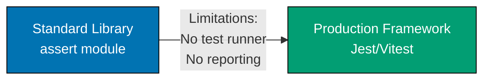

**Siap membangun sistem TypeScript produksi?** Panduan In-the-Field ini mengajarkan pola produksi dengan mengikuti prinsip **Standard Library First**, memastikan Anda memahami fundamental sebelum framework.

## Apa Itu "In the Field"?

Panduan In-the-Field mengajarkan pengembangan TypeScript produksi melalui pola implementasi dunia nyata. Berbeda dengan tutorial by-example yang mencapai 95% coverage bahasa, panduan ini fokus pada skenario produksi spesifik menggunakan framework, library, dan pola enterprise standar industri.

**Perbedaan kunci**: By-example mengajarkan TypeScript melalui kode. In-the-field mengajarkan **bagaimana membangun sistem produksi** dengan TypeScript.

## Filosofi Standard Library First

TypeScript dibangun di atas library standar JavaScript sambil menambahkan type safety. Progresi ini mengajarkan kapabilitas built-in sebelum memperkenalkan framework:

- **Testing** (`assert`) - Testing built-in sebelum Jest/Vitest
- **HTTP servers** (`http` module) - Node.js built-ins sebelum Express/Fastify
- **Build tools** (`tsc` compiler) - TypeScript compiler sebelum esbuild/Vite
- **Logging** (`console`) - Console methods sebelum Winston/Pino
- **JSON handling** (native `JSON`) - Parsing built-in sebelum validation libraries

**Pendekatan kami**: Pelajari library standar dulu, pahami kapan tidak mencukupi, lalu adopsi framework dengan pemahaman penuh tentang trade-off.

### Mengapa Penting

1. **Pemahaman fondasi** - Ketahui primitif sebelum abstraksi
2. **Seleksi framework terinformasi** - Pahami masalah yang diselesaikan framework
3. **Kesadaran masalah** - Lihat kompleksitas implementasi manual
4. **Independensi framework** - Pengetahuan inti transfer antar tools
5. **Pemahaman trade-off** - Kenali kapan framework menambah nilai vs overhead
6. **Kemampuan debugging** - Pahami apa yang framework lakukan di balik layar
7. **Keterampilan optimasi** - Kenali bottleneck performa dan peluang optimasi
8. **Pencegahan bencana produksi** - Hindari memory leak, masalah type, masalah performa dari penyalahgunaan framework

## Organisasi Panduan

30 panduan diorganisir ke dalam 7 kategori:

### 1. Foundation (5 panduan)

Tooling dan praktik pengembangan inti:

- [Test Driven Development](/id/belajar/software-engineering/programming-languages/typescript/in-the-field/test-driven-development) - assert → Jest/Vitest/Mocha
- [Behavior Driven Development](/id/belajar/software-engineering/programming-languages/typescript/in-the-field/behavior-driven-development) - Cucumber.js, pola BDD
- [Build Tools](/id/belajar/software-engineering/programming-languages/typescript/in-the-field/build-tools) - tsc → esbuild/Vite/Webpack
- [Linting And Formatting](/id/belajar/software-engineering/programming-languages/typescript/in-the-field/linting-and-formatting) - ESLint + Prettier
- [Logging](/id/belajar/software-engineering/programming-languages/typescript/in-the-field/logging) - console.log → Winston/Pino

### 2. Quality & Principles (5 panduan)

Kualitas software dan prinsip desain:

- [Design Principles](/id/belajar/software-engineering/programming-languages/typescript/in-the-field/design-principles) - SOLID di TypeScript
- [Best Practices](/id/belajar/software-engineering/programming-languages/typescript/in-the-field/best-practices) - Pola produksi
- [Type Safety](/id/belajar/software-engineering/programming-languages/typescript/in-the-field/type-safety) - Memanfaatkan type system TypeScript
- [Functional Programming](/id/belajar/software-engineering/programming-languages/typescript/in-the-field/functional-programming) - fp-ts, immutability
- [Anti Patterns](/id/belajar/software-engineering/programming-languages/typescript/in-the-field/anti-patterns) - Kesalahan umum TypeScript

### 3. Security (3 panduan)

Authentication, authorization, dan praktik keamanan:

- [Authentication](/id/belajar/software-engineering/programming-languages/typescript/in-the-field/authentication) - Basic Auth → JWT → OAuth2/OIDC
- [Security Practices](/id/belajar/software-engineering/programming-languages/typescript/in-the-field/security-practices) - Validasi input, OWASP, XSS/CSRF
- [Configuration](/id/belajar/software-engineering/programming-languages/typescript/in-the-field/configuration) - hardcoded → dotenv → config services

### 4. Data Management (4 panduan)

Database dan state management:

- [Sql Database](/id/belajar/software-engineering/programming-languages/typescript/in-the-field/sql-database) - raw queries → TypeORM/Prisma
- [Nosql Databases](/id/belajar/software-engineering/programming-languages/typescript/in-the-field/nosql-databases) - MongoDB native → Mongoose
- [Caching](/id/belajar/software-engineering/programming-languages/typescript/in-the-field/caching) - Map → node-cache → Redis
- [Dependency Injection](/id/belajar/software-engineering/programming-languages/typescript/in-the-field/dependency-injection) - manual → InversifyJS/TSyringe

### 5. Integration (3 panduan)

API dan integrasi layanan:

- [Rest Api](/id/belajar/software-engineering/programming-languages/typescript/in-the-field/rest-api) - http → Express/Fastify/Nest.js
- [Messaging](/id/belajar/software-engineering/programming-languages/typescript/in-the-field/messaging) - EventEmitter → Bull/Kafka
- [Json And Api Integration](/id/belajar/software-engineering/programming-languages/typescript/in-the-field/json-and-api-integration) - JSON parsing, HTTP clients

### 6. Advanced Patterns (6 panduan)

Pola programming lanjutan dan performa:

- [Reactive Programming](/id/belajar/software-engineering/programming-languages/typescript/in-the-field/reactive-programming) - Promises → RxJS
- [Concurrency And Parallelism](/id/belajar/software-engineering/programming-languages/typescript/in-the-field/concurrency-and-parallelism) - pola async, worker threads
- [Performance](/id/belajar/software-engineering/programming-languages/typescript/in-the-field/performance) - Profiling, optimasi V8, memory
- [Resilience Patterns](/id/belajar/software-engineering/programming-languages/typescript/in-the-field/resilience-patterns) - Retry, circuit breaker, fallback
- [Domain Driven Design](/id/belajar/software-engineering/programming-languages/typescript/in-the-field/domain-driven-design) - Pola taktis DDD
- [Finite State Machines](/id/belajar/software-engineering/programming-languages/typescript/in-the-field/finite-state-machines) - State pattern, XState

### 7. DevOps (4 panduan)

Deployment, automation, dan pola cloud:

- [Docker And Kubernetes](/id/belajar/software-engineering/programming-languages/typescript/in-the-field/docker-and-kubernetes) - Container deployment
- [Ci Cd](/id/belajar/software-engineering/programming-languages/typescript/in-the-field/ci-cd) - GitHub Actions/GitLab CI
- [Cloud Native Patterns](/id/belajar/software-engineering/programming-languages/typescript/in-the-field/cloud-native-patterns) - 12-factor app, microservices
- [Cli App](/id/belajar/software-engineering/programming-languages/typescript/in-the-field/cli-app) - Commander.js, Oclif

## Alur Pembelajaran Progresif

Setiap panduan mengikuti struktur ini:

1. **Mengapa Penting** - Konteks produksi dan skenario dunia nyata
2. **Standard Library First** - Pendekatan built-in dengan contoh beranotasi
3. **Limitasi** - Kapan library standar tidak mencukupi untuk produksi
4. **Production Framework** - Solusi standar industri dengan contoh
5. **Trade-off** - Tabel perbandingan jelas (kompleksitas, learning curve, maintenance)
6. **Best Practices** - Panduan actionable dengan contoh kode

### Contoh Progresi (Testing)



**Standard Library**: Modul `assert` menyediakan assertion dasar, tapi tanpa organisasi test atau reporting.

**Limitasi**: Tidak ada test discovery, tidak ada eksekusi paralel, tidak ada coverage reporting, invokasi test manual.

**Production Framework**: Jest (batteries-included), Vitest (integrasi Vite), atau Mocha (fleksibel) menyediakan test runner, assertion, mocking, dan coverage.

**Trade-off**: Pelajari pola `assert` dulu untuk memahami apa yang diabstraksi framework testing.

## Standar Anotasi Kode

Semua contoh kode mempertahankan **densitas anotasi 1.0-2.25** (baris komentar per baris kode) menggunakan notasi `// =>` untuk menjelaskan nilai, state, dan output.

**Contoh**:

```typescript
import assert from "assert";
// => Import assert from Node.js standard library
// => No external dependencies required

function add(a: number, b: number): number {
  // => Simple addition function
  // => Takes two numbers, returns their sum
  return a + b;
  // => Returns numeric result
}

assert.strictEqual(add(2, 3), 5);
// => assert.strictEqual checks exact equality (===)
// => Throws AssertionError if 2 + 3 !== 5
// => No output if assertion passes
```

**Densitas**: 5 baris kode, 8 baris anotasi = 1.6 density (dalam target 1.0-2.25)

## Mendapatkan Manfaat Maksimal dari Panduan In-the-Field

1. **Selesaikan by-example dulu**: Pengetahuan fondasi esensial untuk pola produksi
2. **Ikuti standard library first**: Tahan godaan langsung ke framework
3. **Pahami trade-off**: Tidak setiap proyek membutuhkan setiap framework
4. **Praktik progresif**: Mulai dengan library standar, tambahkan framework ketika justified
5. **Bandingkan pendekatan**: Gunakan tabel perbandingan untuk informed framework selection

## Resource Terkait

- [By Example](/id/belajar/software-engineering/programming-languages/typescript/by-example) - Tutorial code-first
- [Ikhtisar](/id/belajar/software-engineering/programming-languages/typescript/ikhtisar) - Alur pembelajaran TypeScript lengkap
