**Ingin menguasai fundamental Rust?** Tutorial komprehensif ini mencakup semuanya mulai dari variabel hingga testing, dengan penjelasan ekstensif tentang ownership system dan diagram visual.

## Cakupan

Tutorial ini mencakup **0-60%** dari pengetahuan Rust - fundamental lengkap termasuk penguasaan ownership.

## Prasyarat

- [Instalasi Awal](/id/learn/swe/prog-lang/rust/tutorials/instalasi-awal) selesai
- [Mulai Cepat](/id/learn/swe/prog-lang/rust/tutorials/mulai-cepat) direkomendasikan tapi tidak wajib
- Pengalaman programming membantu

## Hasil Pembelajaran

Setelah menyelesaikan tutorial ini, Anda akan:

- Menguasai ownership system Rust (stack vs heap, aturan ownership, move semantics)
- Memahami references dan borrowing (immutable dan mutable)
- Bekerja dengan dasar-dasar lifetimes
- Menggunakan slices secara efektif
- Mendefinisikan structs dengan methods dan associated functions
- Bekerja dengan enums dan pattern matching (Option, Result)
- Menangani error menggunakan panic! dan Result
- Menggunakan collections (Vec, String, HashMap) dengan kesadaran ownership
- Mengorganisir kode dengan modules dan packages
- Menulis comprehensive tests

Tutorial ini menekankan **ownership** - fitur paling khas dari Rust. Luangkan waktu untuk memahami ini dengan baik.

---

## Jalur Pembelajaran

```mermaid
graph TD
    A[Variables & Mutability] --> B[Tipe Data]
    B --> C[Functions]
    C --> D[Control Flow]
    D --> E[Ownership System ⭐]
    E --> F[References & Borrowing ⭐]
    F --> G[Slices]
    G --> H[Structs]
    H --> I[Enums & Pattern Matching]
    I --> J[Error Handling]
    J --> K[Collections]
    K --> L[Modules & Packages]
    L --> M[Testing]
    M --> N[Latihan]

    style E fill:#DE8F05,stroke:#000000,stroke-width:3px,color:#000000
    style F fill:#DE8F05,stroke:#000000,stroke-width:3px,color:#000000
    style N fill:#029E73,stroke:#000000,stroke-width:2px,color:#FFFFFF
```



**Palet Warna**: Orange (#DE8F05 - bagian ownership kritis), Teal (#029E73 - penyelesaian)

**⭐ Bagian terpenting**: Ownership System dan References & Borrowing - kuasai ini!

---

## Bagian 1: Variables dan Mutability

### Immutability Secara Default

Variabel Rust immutable secara default:

```rust
fn main() {
    let x = 5;
    println!("Nilai x adalah: {}", x);
    // x = 6;  // ❌ Compilation error: cannot assign twice to immutable variable
}
```

**Mengapa immutable secara default?**

- Mencegah bug yang tidak disengaja dari mutasi yang tidak terduga
- Memungkinkan optimisasi compiler
- Membuat kode concurrent lebih aman (tidak bisa mutate jika multiple threads read)
- Mendorong pemikiran tentang data ownership

### Mutability dengan mut

```rust
fn main() {
    let mut x = 5;
    println!("Nilai x adalah: {}", x);
    x = 6;  // ✅ Diperbolehkan
    println!("Nilai x adalah: {}", x);
}
```

**Output**:

```
Nilai x adalah: 5
Nilai x adalah: 6
```

**Best practice**: Gunakan `mut` hanya saat diperlukan. Immutability lebih aman.

### Shadowing

Buat variabel baru dengan nama yang sama:

```rust
fn main() {
    let x = 5;

    let x = x + 1;  // Shadow x sebelumnya

    {
        let x = x * 2;  // Shadow lagi dalam inner scope
        println!("Nilai x dalam inner scope adalah: {}", x);
    }

    println!("Nilai x adalah: {}", x);
}
```

**Output**:

```
Nilai x dalam inner scope adalah: 12
Nilai x adalah: 6
```

**Shadowing vs mutation**:

```rust
fn main() {
    // Shadowing memungkinkan perubahan tipe
    let spaces = "   ";
    let spaces = spaces.len();  // ✅ OK - tipe berbeda

    // Mutation tidak memungkinkan perubahan tipe
    let mut spaces = "   ";
    // spaces = spaces.len();  // ❌ Error - tidak bisa mengubah tipe
}
```

### Constants

```rust
const THREE_HOURS_IN_SECONDS: u32 = 60 * 60 * 3;

fn main() {
    println!("Tiga jam dalam detik: {}", THREE_HOURS_IN_SECONDS);
}
```

**Constants vs immutable variables**:

| Fitur        | Immutable Variable      | Constant                   |
| ------------ | ----------------------- | -------------------------- |
| Mutability   | Immutable (bisa shadow) | Selalu immutable           |
| Anotasi tipe | Opsional                | Wajib                      |
| Scope        | Block atau function     | Global diperbolehkan       |
| Inisialisasi | Ekspresi apapun         | Compile-time constant saja |
| Naming       | snake_case              | SCREAMING_SNAKE_CASE       |

---

## Bagian 2: Tipe Data

Rust adalah statically typed - tipe harus diketahui pada compile time.

### Scalar Types

#### Tipe Integer

```rust
fn main() {
    let a: i8 = -128;      // Signed 8-bit: -128 sampai 127
    let b: u8 = 255;       // Unsigned 8-bit: 0 sampai 255
    let c: i32 = -50000;   // Signed 32-bit (tipe integer default)
    let d: u64 = 1000000;  // Unsigned 64-bit

    println!("a: {}, b: {}, c: {}, d: {}", a, b, c, d);
}
```

**Tipe integer**:

| Panjang | Signed        | Unsigned |
| ------- | ------------- | -------- |
| 8-bit   | i8            | u8       |
| 16-bit  | i16           | u16      |
| 32-bit  | i32 (default) | u32      |
| 64-bit  | i64           | u64      |
| 128-bit | i128          | u128     |
| arch    | isize         | usize    |

**Integer literals**:

```rust
fn main() {
    let decimal = 98_222;       // Underscore untuk keterbacaan
    let hex = 0xff;             // Hexadecimal
    let octal = 0o77;           // Octal
    let binary = 0b1111_0000;   // Binary
    let byte = b'A';            // Byte (u8 saja)

    println!("dec: {}, hex: {}, oct: {}, bin: {}, byte: {}",
             decimal, hex, octal, binary, byte);
}
```

**Integer overflow**:

```rust
fn main() {
    let mut x: u8 = 255;
    // x = x + 1;  // Debug: panic, Release: wraps ke 0
    x = x.wrapping_add(1);  // Explicitly wrap: 0
    println!("x: {}", x);
}
```

#### Tipe Floating-Point

```rust
fn main() {
    let x = 2.0;      // f64 (default - double precision)
    let y: f32 = 3.0; // f32 (single precision)

    println!("x: {}, y: {}", x, y);
}
```

**Operasi floating-point**:

```rust
fn main() {
    let sum = 5.0 + 10.0;
    let difference = 95.5 - 4.3;
    let product = 4.0 * 30.0;
    let quotient = 56.7 / 32.2;
    let floored = 2 / 3;  // Integer division: 0

    println!("sum: {}, diff: {}, prod: {}, quot: {}, floor: {}",
             sum, difference, product, quotient, floored);
}
```

#### Tipe Boolean

```rust
fn main() {
    let t = true;
    let f: bool = false;

    if t {
        println!("t adalah true");
    }

    if !f {
        println!("f adalah false");
    }
}
```

#### Tipe Character

```rust
fn main() {
    let c = 'z';
    let z: char = 'ℤ';  // Unicode
    let heart_eyed_cat = '😻';  // Emoji

    println!("c: {}, z: {}, cat: {}", c, z, heart_eyed_cat);
}
```

**Catatan**: `char` adalah 4 bytes (Unicode Scalar Value), bukan ASCII.

### Compound Types

#### Tipe Tuple

```rust
fn main() {
    let tup: (i32, f64, u8) = (500, 6.4, 1);

    // Destructuring
    let (x, y, z) = tup;
    println!("Nilai y adalah: {}", y);

    // Akses langsung
    let five_hundred = tup.0;
    let six_point_four = tup.1;
    let one = tup.2;

    println!("Nilai: {}, {}, {}", five_hundred, six_point_four, one);
}
```

**Unit type** (tuple kosong):

```rust
fn main() {
    let unit = ();  // Unit type - merepresentasikan ketiadaan nilai
    println!("Unit: {:?}", unit);
}
```

Functions tanpa return value secara implisit mengembalikan `()`.

#### Tipe Array

```rust
fn main() {
    let a = [1, 2, 3, 4, 5];

    // Anotasi tipe: [type; length]
    let b: [i32; 5] = [1, 2, 3, 4, 5];

    // Inisialisasi dengan nilai yang sama
    let c = [3; 5];  // [3, 3, 3, 3, 3]

    // Mengakses elemen
    let first = a[0];
    let second = a[1];

    println!("First: {}, Second: {}", first, second);
}
```

**Pengecekan bounds array**:

```rust
fn main() {
    let a = [1, 2, 3, 4, 5];
    let index = 10;

    // let element = a[index];  // Runtime panic: index out of bounds
    let element = a.get(index);  // Mengembalikan Option<&i32>

    match element {
        Some(val) => println!("Element: {}", val),
        None => println!("Index out of bounds"),
    }
}
```

**Arrays vs Vectors**:

- **Arrays**: Ukuran tetap, stack-allocated, ukuran diketahui pada compile time
- **Vectors**: Ukuran dinamis, heap-allocated, growable

---

## Bagian 3: Functions

### Definisi Function

```rust
fn main() {
    println!("Hello, world!");
    another_function(5, 'h');
}

fn another_function(value: i32, unit_label: char) {
    println!("Pengukurannya adalah: {value}{unit_label}");
}
```

**Function naming**: snake_case secara konvensi.

### Parameters

```rust
fn print_labeled_measurement(value: i32, unit_label: char) {
    println!("Pengukurannya adalah: {value}{unit_label}");
}

fn main() {
    print_labeled_measurement(5, 'h');
}
```

**Anotasi tipe wajib** untuk parameters.

### Statements dan Expressions

**Statement**: Instruksi yang melakukan aksi, tidak mengembalikan nilai.

**Expression**: Evaluasi menjadi nilai.

```rust
fn main() {
    let y = {
        let x = 3;
        x + 1  // Expression (tanpa semicolon)
    };

    println!("Nilai y adalah: {y}");  // 4
}
```

**Perbedaan kunci**: Expressions tidak memiliki semicolons. Menambahkan semicolon membuatnya menjadi statement.

### Return Values

```rust
fn five() -> i32 {
    5  // Expression - implicit return
}

fn plus_one(x: i32) -> i32 {
    x + 1  // Expression
}

fn plus_one_explicit(x: i32) -> i32 {
    return x + 1;  // Explicit return (jarang)
}

fn main() {
    let x = five();
    println!("Nilai x adalah: {x}");

    let y = plus_one(5);
    println!("Nilai y adalah: {y}");
}
```

**Kesalahan umum**:

```rust
fn plus_one(x: i32) -> i32 {
    x + 1;  // ❌ Semicolon membuat ini statement, mengembalikan ()
}
```

Error: "expected `i32`, found `()`"

---

## Bagian 4: Control Flow

### if Expressions

```rust
fn main() {
    let number = 6;

    if number % 4 == 0 {
        println!("number habis dibagi 4");
    } else if number % 3 == 0 {
        println!("number habis dibagi 3");
    } else if number % 2 == 0 {
        println!("number habis dibagi 2");
    } else {
        println!("number tidak habis dibagi 4, 3, atau 2");
    }
}
```

**Kondisi harus bool**:

```rust
fn main() {
    let number = 3;

    // if number {  // ❌ Error: expected `bool`, found integer
    if number != 0 {  // ✅ Eksplisit boolean
        println!("number adalah sesuatu selain nol");
    }
}
```

### if dalam let Statement

```rust
fn main() {
    let condition = true;
    let number = if condition { 5 } else { 6 };

    println!("Nilai number adalah: {number}");
}
```

**Kedua branch harus mengembalikan tipe yang sama**:

```rust
fn main() {
    let condition = true;
    // let number = if condition { 5 } else { "six" };  // ❌ Tipe tidak cocok
    let number = if condition { 5 } else { 6 };  // ✅ Keduanya i32
}
```

### loop - Infinite Loop

```rust
fn main() {
    let mut counter = 0;

    let result = loop {
        counter += 1;

        if counter == 10 {
            break counter * 2;  // break dengan nilai
        }
    };

    println!("Hasilnya adalah: {result}");  // 20
}
```

### Loop Labels

```rust
fn main() {
    let mut count = 0;
    'counting_up: loop {
        println!("count = {count}");
        let mut remaining = 10;

        loop {
            println!("remaining = {remaining}");
            if remaining == 9 {
                break;  // Breaks inner loop
            }
            if count == 2 {
                break 'counting_up;  // Breaks outer loop
            }
            remaining -= 1;
        }

        count += 1;
    }
    println!("End count = {count}");
}
```

### while Loop

```rust
fn main() {
    let mut number = 3;

    while number != 0 {
        println!("{number}!");
        number -= 1;
    }

    println!("LIFTOFF!!!");
}
```

### for Loop

```rust
fn main() {
    let a = [10, 20, 30, 40, 50];

    for element in a {
        println!("nilainya adalah: {element}");
    }
}
```

**Counting dengan range**:

```rust
fn main() {
    for number in (1..4).rev() {  // Reverse range
        println!("{number}!");
    }
    println!("LIFTOFF!!!");
}
```

**Output**:

```
3!
2!
1!
LIFTOFF!!!
```

---

## Bagian 5: Ownership System

**Ownership** adalah fitur paling unik dan penting dari Rust. Ini memungkinkan memory safety tanpa garbage collection.

### Apa itu Ownership?

#### Latar Belakang Memory Management

Kebanyakan bahasa menangani memori dengan dua cara:

1. **Garbage Collection** (Java, Python, JavaScript): Runtime melacak memori, otomatis membebaskan memori yang tidak digunakan
2. **Manual Management** (C, C++): Programmer secara eksplisit mengalokasikan dan membebaskan memori

**Pendekatan Rust**: Ownership system menegakkan memory safety pada compile time dengan zero runtime cost.

#### Stack dan Heap

**Stack**:

- Akses cepat (LIFO - Last In, First Out)
- Ukuran tetap diketahui pada compile time
- Otomatis dikelola (nilai di-pop saat keluar scope)
- Menyimpan: integers, floats, booleans, chars, references, beberapa structs/enums

**Heap**:

- Akses lebih lambat (memory allocator mencari ruang)
- Ukuran dinamis (tumbuh/menyusut pada runtime)
- Harus dikelola secara eksplisit
- Menyimpan: String, Vec, Box, Rc, dll.

```rust
fn main() {
    let x = 5;  // Stack: i32 ukurannya tetap
    let s = String::from("hello");  // Heap: ukuran String bisa berubah
}
```

### Aturan Ownership

Tiga aturan ownership (hafalkan ini):

1. Setiap nilai dalam Rust memiliki **owner**
2. Hanya bisa ada **satu owner** pada satu waktu
3. Ketika owner keluar **dari scope**, nilai **di-drop** (memori dibebaskan)

### Variable Scope

```rust
fn main() {
    {                                // s tidak valid di sini, belum dideklarasikan
        let s = "hello";             // s valid dari titik ini ke depan
        // lakukan sesuatu dengan s
    }                                // scope berakhir, s tidak lagi valid
}
```

### Tipe String

String literal (`"hello"`) adalah immutable dan stack-allocated. Tipe `String` adalah mutable dan heap-allocated:

```rust
fn main() {
    let mut s = String::from("hello");
    s.push_str(", world!");  // Append ke String
    println!("{}", s);  // "hello, world!"
}
```

### Move Semantics

```rust
fn main() {
    let s1 = String::from("hello");
    let s2 = s1;  // s1 dipindahkan ke s2

    // println!("{}, world!", s1);  // ❌ Error: value borrowed after move
    println!("{}, world!", s2);  // ✅ s2 memiliki String
}
```

**Apa yang terjadi?**

```mermaid
graph LR
    A["s1<br/>ptr → heap"] -->|move| B["s2<br/>ptr → heap"]
    B --> C["s1 invalid<br/>tidak bisa digunakan lagi"]

    style A fill:#0173B2,stroke:#000000,stroke-width:2px,color:#FFFFFF
    style B fill:#029E73,stroke:#000000,stroke-width:2px,color:#FFFFFF
    style C fill:#DE8F05,stroke:#000000,stroke-width:2px,color:#000000
```



**Sebelum move**:

```
s1 → | ptr | len | capacity | → heap: "hello"
```

**Setelah move**:

```
s1     (invalid - moved)
s2 → | ptr | len | capacity | → heap: "hello"
```

**Mengapa move bukan copy?**

Jika Rust meng-copy data heap:

```rust
let s1 = String::from("hello");
let s2 = s1;  // Hipotesis: copy data heap
```

Ketika `s1` dan `s2` keluar dari scope, keduanya akan mencoba membebaskan memori heap yang sama (**double-free error**).

Rust menghindari ini dengan **moving** ownership dan meng-invalidate `s1`.

### Clone - Deep Copy

```rust
fn main() {
    let s1 = String::from("hello");
    let s2 = s1.clone();  // Deep copy data heap

    println!("s1 = {}, s2 = {}", s1, s2);  // ✅ Keduanya valid
}
```

**clone** secara eksplisit meng-copy data heap. Mahal - gunakan hanya jika diperlukan.

### Stack-Only Data: Copy

```rust
fn main() {
    let x = 5;
    let y = x;  // Copy (bukan move)

    println!("x = {}, y = {}", x, y);  // ✅ Keduanya valid
}
```

**Tipe yang mengimplementasikan Copy trait** (tipe stack sederhana):

- Integers: `i32`, `u64`, dll.
- Floats: `f32`, `f64`
- Booleans: `bool`
- Characters: `char`
- Tuples yang hanya berisi tipe Copy: `(i32, i32)`

**Tipe yang TIDAK mengimplementasikan Copy** (heap-allocated):

- `String`
- `Vec<T>`
- Structs yang berisi tipe non-Copy

**Aturan**: Jika tipe mengimplementasikan `Drop` (cleanup pada scope exit), tidak bisa mengimplementasikan `Copy`.

### Ownership dan Functions

**Passing ke function moves atau copies**:

```rust
fn main() {
    let s = String::from("hello");  // s masuk scope

    takes_ownership(s);             // nilai s pindah ke function
                                    // s tidak lagi valid di sini

    let x = 5;                      // x masuk scope

    makes_copy(x);                  // x akan pindah ke function,
                                    // tapi i32 adalah Copy, jadi masih ok menggunakan x

    println!("x = {}", x);  // ✅ x masih valid
    // println!("{}", s);   // ❌ Error: value moved
}

fn takes_ownership(some_string: String) {
    println!("{}", some_string);
}  // some_string keluar scope, `drop` dipanggil, memori dibebaskan

fn makes_copy(some_integer: i32) {
    println!("{}", some_integer);
}  // some_integer keluar scope, tidak ada yang spesial terjadi
```

### Return Values dan Ownership

```rust
fn main() {
    let s1 = gives_ownership();         // Function mengembalikan dan memindahkan nilai ke s1

    let s2 = String::from("hello");     // s2 masuk scope

    let s3 = takes_and_gives_back(s2);  // s2 dipindahkan ke function
                                        // return value pindah ke s3

    println!("s1 = {}, s3 = {}", s1, s3);
    // println!("{}", s2);  // ❌ Error: s2 was moved
}

fn gives_ownership() -> String {
    let some_string = String::from("yours");
    some_string  // Dikembalikan dan pindah keluar ke calling function
}

fn takes_and_gives_back(a_string: String) -> String {
    a_string  // Dikembalikan dan pindah keluar ke calling function
}
```

**Pola transfer ownership**:


**Masalah**: Mengambil ownership dan mengembalikan membosankan. Solusi: **References dan Borrowing**.

---

## Bagian 6: References dan Borrowing

**References** memungkinkan Anda merujuk ke nilai tanpa mengambil ownership.

### Immutable References

```rust
fn main() {
    let s1 = String::from("hello");

    let len = calculate_length(&s1);  // Borrow s1

    println!("Panjang '{}' adalah {}.", s1, len);  // s1 masih valid
}

fn calculate_length(s: &String) -> usize {  // s adalah reference ke String
    s.len()
}  // s keluar scope, tapi tidak drop String (tidak memilikinya)
```

**Visualisasi reference**:


**Layout memori**:

```
s1  → | ptr | len | capacity | → heap: "hello"
&s1 → pointer ke s1 (tidak memiliki data heap)
```

**`&` membuat reference**, `*` dereferences (jarang diperlukan secara eksplisit dalam Rust):

```rust
fn main() {
    let x = 5;
    let y = &x;  // y adalah reference ke x

    assert_eq!(5, x);
    assert_eq!(5, *y);  // Dereference y
}
```

### Mutable References

```rust
fn main() {
    let mut s = String::from("hello");

    change(&mut s);  // Mutable borrow

    println!("{}", s);  // "hello, world"
}

fn change(some_string: &mut String) {
    some_string.push_str(", world");
}
```

### Aturan Borrowing

**Dua Aturan Borrowing** (ditegakkan pada compile time):

1. Pada waktu tertentu, Anda bisa memiliki:
   - **Satu mutable reference** ATAU
   - **Sejumlah immutable references**
2. References harus selalu **valid** (tidak ada dangling references)

#### Aturan 1: Mencegah Data Races

**Tidak bisa memiliki mutable dan immutable references secara bersamaan**:

```rust
fn main() {
    let mut s = String::from("hello");

    let r1 = &s;  // ✅ Immutable borrow
    let r2 = &s;  // ✅ Multiple immutable borrows OK
    println!("{} dan {}", r1, r2);
    // r1 dan r2 tidak lagi digunakan setelah titik ini

    let r3 = &mut s;  // ✅ Mutable borrow OK (r1, r2 tidak lagi digunakan)
    r3.push_str(", world");
    println!("{}", r3);
}
```

**Mencoba mutable dan immutable secara bersamaan**:

```rust
fn main() {
    let mut s = String::from("hello");

    let r1 = &s;        // ✅ Immutable borrow
    let r2 = &s;        // ✅ Immutable borrow
    let r3 = &mut s;    // ❌ Error: cannot borrow as mutable

    println!("{}, {}, dan {}", r1, r2, r3);
}
```

Error: "cannot borrow `s` as mutable because it is also borrowed as immutable"

**Tidak bisa memiliki dua mutable references**:

```rust
fn main() {
    let mut s = String::from("hello");

    let r1 = &mut s;
    let r2 = &mut s;  // ❌ Error: cannot borrow as mutable more than once

    println!("{}, {}", r1, r2);
}
```

**Mengapa aturan ini?** Mencegah **data races** pada compile time:

- Tidak bisa memodifikasi data saat seseorang sedang membacanya (konflik mutable + immutable)
- Tidak bisa memiliki dua writer pada waktu yang sama (konflik dua mutable references)

**Borrowing berbasis scope**:

```rust
fn main() {
    let mut s = String::from("hello");

    {
        let r1 = &mut s;
        r1.push_str(", world");
    }  // r1 keluar scope di sini

    let r2 = &mut s;  // ✅ OK - r1 tidak lagi ada
    r2.push_str("!");
    println!("{}", r2);
}
```

#### Aturan 2: Tidak Ada Dangling References

```rust
fn dangle() -> &String {  // ❌ Error: missing lifetime specifier
    let s = String::from("hello");
    &s  // Mengembalikan reference ke s
}  // s keluar scope dan di-drop - reference akan invalid
```

Error: "this function's return type contains a borrowed value, but there is no value for it to be borrowed from"

**Fix**: Kembalikan owned value, bukan reference:

```rust
fn no_dangle() -> String {
    let s = String::from("hello");
    s  // Kembalikan owned String (ownership pindah ke caller)
}
```

**Visualisasi borrowing**:


**Insight kunci**: Aturan borrowing mencegah bug pada compile time. Tidak ada data races, tidak ada use-after-free, tidak ada null pointer dereferences!

---

## Bagian 7: Slices

**Slices** mereferensikan urutan elemen yang bersebelahan dalam collection.

### String Slices

```rust
fn main() {
    let s = String::from("hello world");

    let hello = &s[0..5];   // "hello"
    let world = &s[6..11];  // "world"

    println!("{} {}", hello, world);
}
```

**Sintaks range**:

```rust
fn main() {
    let s = String::from("hello");

    let slice = &s[0..2];   // "he"
    let slice = &s[..2];    // Sama: "he" (mulai dari awal)

    let len = s.len();
    let slice = &s[3..len]; // "lo"
    let slice = &s[3..];    // Sama: "lo" (sampai akhir)

    let slice = &s[0..len]; // "hello"
    let slice = &s[..];     // Sama: "hello" (seluruh string)
}
```

**Tipe string slice**: `&str`

```rust
fn first_word(s: &String) -> &str {
    let bytes = s.as_bytes();

    for (i, &item) in bytes.iter().enumerate() {
        if item == b' ' {
            return &s[0..i];  // Kembalikan slice ke kata pertama
        }
    }

    &s[..]  // Kembalikan seluruh string jika tidak ada spasi
}

fn main() {
    let s = String::from("hello world");
    let word = first_word(&s);
    println!("Kata pertama: {}", word);
}
```

### String Literals adalah Slices

```rust
let s = "Hello, world!";  // Tipe: &str (slice)
```

String literals adalah `&str` - immutable references ke data string yang dipanggang ke dalam binary.

### first_word yang Lebih Baik

```rust
fn first_word(s: &str) -> &str {  // Menerima &str bukan &String
    let bytes = s.as_bytes();

    for (i, &item) in bytes.iter().enumerate() {
        if item == b' ' {
            return &s[0..i];
        }
    }

    &s[..]
}

fn main() {
    let my_string = String::from("hello world");

    // Bekerja dengan slices dari `String`
    let word = first_word(&my_string[0..6]);
    let word = first_word(&my_string[..]);

    // Juga bekerja dengan references ke `String` (di-coerce ke slices)
    let word = first_word(&my_string);

    let my_string_literal = "hello world";

    // Bekerja dengan slices dari string literals
    let word = first_word(&my_string_literal[0..6]);
    let word = first_word(&my_string_literal[..]);

    // Bekerja dengan string literals langsung (mereka adalah &str)
    let word = first_word(my_string_literal);
}
```

### Slices Lain

Arrays juga bisa di-slice:

```rust
fn main() {
    let a = [1, 2, 3, 4, 5];
    let slice = &a[1..3];  // Tipe: &[i32]

    assert_eq!(slice, &[2, 3]);
}
```

**Tipe slice**: `&[T]` dimana `T` adalah tipe elemen.

---

## Bagian 8: Structs

### Mendefinisikan dan Instantiate Structs

```rust
struct User {
    active: bool,
    username: String,
    email: String,
    sign_in_count: u64,
}

fn main() {
    let user1 = User {
        active: true,
        username: String::from("someusername123"),
        email: String::from("someone@example.com"),
        sign_in_count: 1,
    };

    println!("Email user: {}", user1.email);
}
```

### Mutable Structs

```rust
fn main() {
    let mut user1 = User {
        active: true,
        username: String::from("someusername123"),
        email: String::from("someone@example.com"),
        sign_in_count: 1,
    };

    user1.email = String::from("anotheremail@example.com");
}
```

**Catatan**: Seluruh struct harus mutable (tidak bisa membuat hanya beberapa field mutable).

### Field Init Shorthand

```rust
fn build_user(email: String, username: String) -> User {
    User {
        active: true,
        username,  // Shorthand: sama dengan username: username
        email,     // Shorthand: sama dengan email: email
        sign_in_count: 1,
    }
}
```

### Struct Update Syntax

```rust
fn main() {
    let user1 = User {
        email: String::from("someone@example.com"),
        username: String::from("someusername123"),
        active: true,
        sign_in_count: 1,
    };

    let user2 = User {
        email: String::from("another@example.com"),
        ..user1  // Copy field sisanya dari user1
    };

    // Catatan: user1.username dan user1.email dipindahkan ke user2
    // user1.active dan user1.sign_in_count di-copy (mereka mengimplementasikan Copy)
}
```

### Tuple Structs

```rust
struct Color(i32, i32, i32);
struct Point(i32, i32, i32);

fn main() {
    let black = Color(0, 0, 0);
    let origin = Point(0, 0, 0);

    // black dan origin adalah tipe berbeda meskipun struktur sama
}
```

### Unit-Like Structs

```rust
struct AlwaysEqual;

fn main() {
    let subject = AlwaysEqual;
}
```

Berguna untuk mengimplementasikan traits tanpa data.

### Methods

```rust
#[derive(Debug)]
struct Rectangle {
    width: u32,
    height: u32,
}

impl Rectangle {
    fn area(&self) -> u32 {
        self.width * self.height
    }

    fn can_hold(&self, other: &Rectangle) -> bool {
        self.width > other.width && self.height > other.height
    }
}

fn main() {
    let rect1 = Rectangle {
        width: 30,
        height: 50,
    };

    println!("Area: {} piksel persegi", rect1.area());

    let rect2 = Rectangle {
        width: 10,
        height: 40,
    };

    println!("Bisakah rect1 menampung rect2? {}", rect1.can_hold(&rect2));
}
```

**Parameters method**:

- `&self`: Borrow self secara immutable
- `&mut self`: Borrow self secara mutable
- `self`: Ambil ownership dari self (jarang)

### Associated Functions

```rust
impl Rectangle {
    fn square(size: u32) -> Rectangle {
        Rectangle {
            width: size,
            height: size,
        }
    }
}

fn main() {
    let sq = Rectangle::square(3);
}
```

**Associated functions** tidak mengambil `self` - dipanggil dengan sintaks `::` (seperti `String::from`).

### Multiple impl Blocks

```rust
impl Rectangle {
    fn area(&self) -> u32 {
        self.width * self.height
    }
}

impl Rectangle {
    fn can_hold(&self, other: &Rectangle) -> bool {
        self.width > other.width && self.height > other.height
    }
}
```

Valid, tapi biasanya tidak diperlukan. Berguna untuk implementasi trait (dibahas dalam Intermediate).

---

## Bagian 9: Enums dan Pattern Matching

### Mendefinisikan Enums

```rust
enum IpAddrKind {
    V4,
    V6,
}

fn main() {
    let four = IpAddrKind::V4;
    let six = IpAddrKind::V6;

    route(IpAddrKind::V4);
    route(IpAddrKind::V6);
}

fn route(ip_kind: IpAddrKind) {
    // ...
}
```

### Enums dengan Data

```rust
enum IpAddr {
    V4(u8, u8, u8, u8),
    V6(String),
}

fn main() {
    let home = IpAddr::V4(127, 0, 0, 1);
    let loopback = IpAddr::V6(String::from("::1"));
}
```

**Setiap variant bisa memiliki tipe dan jumlah data berbeda**:

```rust
enum Message {
    Quit,                       // Tidak ada data
    Move { x: i32, y: i32 },    // Named fields (seperti struct)
    Write(String),              // String tunggal
    ChangeColor(i32, i32, i32), // Tiga i32
}
```

### Methods pada Enums

```rust
impl Message {
    fn call(&self) {
        // Method body didefinisikan di sini
    }
}

fn main() {
    let m = Message::Write(String::from("hello"));
    m.call();
}
```

### The Option Enum

Rust tidak memiliki null. Sebagai gantinya, `Option<T>`:

```rust
enum Option<T> {
    None,
    Some(T),
}
```

**Menggunakan Option**:

```rust
fn main() {
    let some_number = Some(5);
    let some_char = Some('e');
    let absent_number: Option<i32> = None;

    // Harus menangani None untuk mengakses nilai
    match some_number {
        Some(n) => println!("Number: {}", n),
        None => println!("Tidak ada number"),
    }
}
```

**Mengapa Option bukan null?**

```rust
fn main() {
    let x: i8 = 5;
    let y: Option<i8> = Some(5);

    // let sum = x + y;  // ❌ Error: tidak bisa menambahkan i8 dan Option<i8>
}
```

Harus secara eksplisit menangani kasus `None` - mencegah null pointer errors.

### The match Expression

```rust
enum Coin {
    Penny,
    Nickel,
    Dime,
    Quarter,
}

fn value_in_cents(coin: Coin) -> u8 {
    match coin {
        Coin::Penny => {
            println!("Lucky penny!");
            1
        }
        Coin::Nickel => 5,
        Coin::Dime => 10,
        Coin::Quarter => 25,
    }
}
```

### Patterns yang Bind ke Values

```rust
#[derive(Debug)]
enum UsState {
    Alabama,
    Alaska,
    // --snip--
}

enum Coin {
    Penny,
    Nickel,
    Dime,
    Quarter(UsState),
}

fn value_in_cents(coin: Coin) -> u8 {
    match coin {
        Coin::Penny => 1,
        Coin::Nickel => 5,
        Coin::Dime => 10,
        Coin::Quarter(state) => {
            println!("State quarter dari {:?}!", state);
            25
        }
    }
}

fn main() {
    value_in_cents(Coin::Quarter(UsState::Alaska));
}
```

### Matching dengan Option<T>

```rust
fn plus_one(x: Option<i32>) -> Option<i32> {
    match x {
        None => None,
        Some(i) => Some(i + 1),
    }
}

fn main() {
    let five = Some(5);
    let six = plus_one(five);
    let none = plus_one(None);
}
```

### Matches adalah Exhaustive

```rust
fn plus_one(x: Option<i32>) -> Option<i32> {
    match x {
        Some(i) => Some(i + 1),
        // ❌ Error: pattern `None` not covered
    }
}
```

Harus menangani semua kasus atau menggunakan catch-all.

### Catch-all Patterns

```rust
fn main() {
    let dice_roll = 9;

    match dice_roll {
        3 => add_fancy_hat(),
        7 => remove_fancy_hat(),
        other => move_player(other),  // Catch-all
    }

    match dice_roll {
        3 => add_fancy_hat(),
        7 => remove_fancy_hat(),
        _ => reroll(),  // Catch-all, abaikan nilai
    }
}

fn add_fancy_hat() {}
fn remove_fancy_hat() {}
fn move_player(num_spaces: u8) {}
fn reroll() {}
```

### if let Syntax

```rust
fn main() {
    let config_max = Some(3u8);

    match config_max {
        Some(max) => println!("Maksimum dikonfigurasi menjadi {}", max),
        _ => (),
    }

    // Setara dengan if let
    if let Some(max) = config_max {
        println!("Maksimum dikonfigurasi menjadi {}", max);
    }
}
```

**if let dengan else**:

```rust
fn main() {
    let mut count = 0;
    let coin = Coin::Quarter(UsState::Alaska);

    if let Coin::Quarter(state) = coin {
        println!("State quarter dari {:?}!", state);
    } else {
        count += 1;
    }
}
```

---

## Bagian 10: Error Handling

Rust mengelompokkan errors ke dalam dua kategori:

1. **Recoverable** (Result<T, E>): File tidak ditemukan, input tidak valid
2. **Unrecoverable** (panic!): Bugs, programmer errors

### Unrecoverable Errors dengan panic!

```rust
fn main() {
    panic!("crash and burn");
}
```

**panic! backtrace**:

```bash
$ RUST_BACKTRACE=1 cargo run
```

Menampilkan call stack ketika panic terjadi.

### Recoverable Errors dengan Result

```rust
enum Result<T, E> {
    Ok(T),
    Err(E),
}
```

**Membuka file**:

```rust
use std::fs::File;

fn main() {
    let greeting_file_result = File::open("hello.txt");

    let greeting_file = match greeting_file_result {
        Ok(file) => file,
        Err(error) => panic!("Masalah membuka file: {:?}", error),
    };
}
```

### Matching pada Different Errors

```rust
use std::fs::File;
use std::io::ErrorKind;

fn main() {
    let greeting_file_result = File::open("hello.txt");

    let greeting_file = match greeting_file_result {
        Ok(file) => file,
        Err(error) => match error.kind() {
            ErrorKind::NotFound => match File::create("hello.txt") {
                Ok(fc) => fc,
                Err(e) => panic!("Masalah membuat file: {:?}", e),
            },
            other_error => {
                panic!("Masalah membuka file: {:?}", other_error);
            }
        },
    };
}
```

### Shortcuts: unwrap dan expect

**unwrap**: Panics pada Err

```rust
use std::fs::File;

fn main() {
    let greeting_file = File::open("hello.txt").unwrap();
}
```

**expect**: Panics dengan pesan kustom

```rust
use std::fs::File;

fn main() {
    let greeting_file = File::open("hello.txt")
        .expect("hello.txt seharusnya termasuk dalam project ini");
}
```

### Propagating Errors

```rust
use std::fs::File;
use std::io::{self, Read};

fn read_username_from_file() -> Result<String, io::Error> {
    let username_file_result = File::open("hello.txt");

    let mut username_file = match username_file_result {
        Ok(file) => file,
        Err(e) => return Err(e),
    };

    let mut username = String::new();

    match username_file.read_to_string(&mut username) {
        Ok(_) => Ok(username),
        Err(e) => Err(e),
    }
}
```

### The ? Operator

```rust
use std::fs::File;
use std::io::{self, Read};

fn read_username_from_file() -> Result<String, io::Error> {
    let mut username_file = File::open("hello.txt")?;
    let mut username = String::new();
    username_file.read_to_string(&mut username)?;
    Ok(username)
}
```

**? operator**:

- Jika Ok: unwraps nilai dan melanjutkan
- Jika Err: mengembalikan Err dari function

**Chaining ? calls**:

```rust
use std::fs::File;
use std::io::{self, Read};

fn read_username_from_file() -> Result<String, io::Error> {
    let mut username = String::new();
    File::open("hello.txt")?.read_to_string(&mut username)?;
    Ok(username)
}
```

**Lebih pendek lagi dengan fs::read_to_string**:

```rust
use std::fs;
use std::io;

fn read_username_from_file() -> Result<String, io::Error> {
    fs::read_to_string("hello.txt")
}
```

### Dimana ? Bisa Digunakan

**? hanya bisa digunakan dalam functions yang mengembalikan Result atau Option**:

```rust
use std::fs::File;

fn main() {
    // ❌ Error: tidak bisa menggunakan ? dalam function yang mengembalikan ()
    let greeting_file = File::open("hello.txt")?;
}
```

**Fix**: main bisa mengembalikan Result:

```rust
use std::error::Error;
use std::fs::File;

fn main() -> Result<(), Box<dyn Error>> {
    let greeting_file = File::open("hello.txt")?;
    Ok(())
}
```

---

## Bagian 11: Collections

### Vec<T> - Vector

**Membuat vectors**:

```rust
fn main() {
    let v: Vec<i32> = Vec::new();  // Vector kosong

    let v = vec![1, 2, 3];  // vec! macro dengan nilai awal
}
```

**Mengupdate vectors**:

```rust
fn main() {
    let mut v = Vec::new();

    v.push(5);
    v.push(6);
    v.push(7);
    v.push(8);
}
```

**Membaca elemen**:

```rust
fn main() {
    let v = vec![1, 2, 3, 4, 5];

    let third: &i32 = &v[2];  // Sintaks index - panics jika out of bounds
    println!("Elemen ketiga adalah {third}");

    let third: Option<&i32> = v.get(2);  // get method - mengembalikan Option
    match third {
        Some(third) => println!("Elemen ketiga adalah {third}"),
        None => println!("Tidak ada elemen ketiga."),
    }
}
```

**Ownership dan borrowing dengan vectors**:

```rust
fn main() {
    let mut v = vec![1, 2, 3, 4, 5];

    let first = &v[0];  // Immutable borrow

    // v.push(6);  // ❌ Error: cannot borrow as mutable while immutable borrow exists

    println!("Elemen pertama adalah: {first}");
}
```

**Mengapa tidak bisa push saat memegang reference?** Vector mungkin perlu reallocate, meng-invalidate reference.

**Iterating atas vectors**:

```rust
fn main() {
    let v = vec![100, 32, 57];
    for i in &v {
        println!("{i}");
    }

    let mut v = vec![100, 32, 57];
    for i in &mut v {
        *i += 50;  // Dereference untuk memodifikasi
    }
}
```

**Menggunakan enums untuk menyimpan multiple types**:

```rust
enum SpreadsheetCell {
    Int(i32),
    Float(f64),
    Text(String),
}

fn main() {
    let row = vec![
        SpreadsheetCell::Int(3),
        SpreadsheetCell::Text(String::from("blue")),
        SpreadsheetCell::Float(10.12),
    ];
}
```

### String

**Membuat strings**:

```rust
fn main() {
    let mut s = String::new();

    let data = "initial contents";
    let s = data.to_string();
    let s = "initial contents".to_string();

    let s = String::from("initial contents");
}
```

**Mengupdate strings**:

```rust
fn main() {
    let mut s = String::from("foo");
    s.push_str("bar");  // Append &str
    s.push('!');        // Append char

    println!("{s}");  // "foobar!"
}
```

**Concatenation dengan +**:

```rust
fn main() {
    let s1 = String::from("Hello, ");
    let s2 = String::from("world!");
    let s3 = s1 + &s2;  // s1 dipindahkan, s2 di-borrow

    // println!("{s1}");  // ❌ Error: s1 was moved
    println!("{s3}");  // ✅
}
```

**format! macro**:

```rust
fn main() {
    let s1 = String::from("tic");
    let s2 = String::from("tac");
    let s3 = String::from("toe");

    let s = format!("{s1}-{s2}-{s3}");  // Tidak mengambil ownership

    println!("{s}");  // "tic-tac-toe"
}
```

**String indexing tidak bekerja**:

```rust
fn main() {
    let s1 = String::from("hello");
    // let h = s1[0];  // ❌ Error: String cannot be indexed by integer
}
```

**Mengapa?** Strings adalah UTF-8. Satu karakter mungkin adalah multiple bytes. Indexing bisa mengembalikan data yang tidak valid.

**Iterating atas strings**:

```rust
fn main() {
    for c in "नमस्ते".chars() {
        println!("{c}");
    }

    for b in "नमस्ते".bytes() {
        println!("{b}");
    }
}
```

### HashMap<K, V>

**Membuat hash maps**:

```rust
use std::collections::HashMap;

fn main() {
    let mut scores = HashMap::new();

    scores.insert(String::from("Blue"), 10);
    scores.insert(String::from("Yellow"), 50);
}
```

**Mengakses values**:

```rust
use std::collections::HashMap;

fn main() {
    let mut scores = HashMap::new();

    scores.insert(String::from("Blue"), 10);
    scores.insert(String::from("Yellow"), 50);

    let team_name = String::from("Blue");
    let score = scores.get(&team_name);  // Mengembalikan Option<&i32>

    match score {
        Some(s) => println!("Score: {s}"),
        None => println!("Team tidak ditemukan"),
    }
}
```

**Iterating**:

```rust
use std::collections::HashMap;

fn main() {
    let mut scores = HashMap::new();

    scores.insert(String::from("Blue"), 10);
    scores.insert(String::from("Yellow"), 50);

    for (key, value) in &scores {
        println!("{key}: {value}");
    }
}
```

**Ownership**:

```rust
use std::collections::HashMap;

fn main() {
    let field_name = String::from("Favorite color");
    let field_value = String::from("Blue");

    let mut map = HashMap::new();
    map.insert(field_name, field_value);
    // field_name dan field_value dipindahkan ke map

    // println!("{field_name}");  // ❌ Error: value moved
}
```

**Mengupdate values**:

```rust
use std::collections::HashMap;

fn main() {
    let mut scores = HashMap::new();

    scores.insert(String::from("Blue"), 10);
    scores.insert(String::from("Blue"), 25);  // Overwrites

    println!("{:?}", scores);  // {"Blue": 25}
}
```

**Insert jika key tidak ada**:

```rust
use std::collections::HashMap;

fn main() {
    let mut scores = HashMap::new();
    scores.insert(String::from("Blue"), 10);

    scores.entry(String::from("Yellow")).or_insert(50);
    scores.entry(String::from("Blue")).or_insert(50);  // Tidak overwrite

    println!("{:?}", scores);  // {"Yellow": 50, "Blue": 10}
}
```

**Update berdasarkan nilai lama**:

```rust
use std::collections::HashMap;

fn main() {
    let text = "hello world wonderful world";

    let mut map = HashMap::new();

    for word in text.split_whitespace() {
        let count = map.entry(word).or_insert(0);
        *count += 1;  // Dereference untuk memodifikasi value
    }

    println!("{:?}", map);  // {"world": 2, "hello": 1, "wonderful": 1}
}
```

---

## Bagian 12: Modules dan Packages

### Packages dan Crates

- **Package**: Satu atau lebih crates, berisi Cargo.toml
- **Crate**: Binary atau library
  - **Binary crate**: Program yang bisa dijalankan (memiliki `fn main`)
  - **Library crate**: Kode yang ditujukan untuk digunakan dalam program lain (tidak ada `fn main`)

**Aturan package**:

- Bisa berisi paling banyak satu library crate
- Bisa berisi sejumlah binary crates
- Harus berisi setidaknya satu crate (library atau binary)

### Module System

```rust
mod front_of_house {
    pub mod hosting {
        pub fn add_to_waitlist() {}
        fn seat_at_table() {}
    }

    mod serving {
        fn take_order() {}
        fn serve_order() {}
        fn take_payment() {}
    }
}

pub fn eat_at_restaurant() {
    // Absolute path
    crate::front_of_house::hosting::add_to_waitlist();

    // Relative path
    front_of_house::hosting::add_to_waitlist();
}
```

**Aturan privacy**:

- Items adalah private secara default
- Gunakan `pub` untuk membuat items public
- Child modules bisa menggunakan items dalam parent modules
- Parent modules tidak bisa menggunakan private items dalam child modules

### use Keyword

```rust
mod front_of_house {
    pub mod hosting {
        pub fn add_to_waitlist() {}
    }
}

use crate::front_of_house::hosting;

pub fn eat_at_restaurant() {
    hosting::add_to_waitlist();
}
```

**Idiomatic use**:

- Untuk functions: bawa parent module ke dalam scope
- Untuk structs/enums: bawa tipe itu sendiri ke dalam scope

```rust
use std::collections::HashMap;  // ✅ Idiomatic

fn main() {
    let mut map = HashMap::new();
    map.insert(1, 2);
}
```

**as keyword untuk konflik nama**:

```rust
use std::fmt::Result;
use std::io::Result as IoResult;

fn function1() -> Result {
    // --snip--
    Ok(())
}

fn function2() -> IoResult<()> {
    // --snip--
    Ok(())
}
```

---

## Bagian 13: Testing

### Menulis Tests

```rust
#[cfg(test)]
mod tests {
    #[test]
    fn it_works() {
        let result = 2 + 2;
        assert_eq!(result, 4);
    }

    #[test]
    fn another() {
        // panic!("Make this test fail");
    }
}
```

**Menjalankan tests**:

```bash
cargo test
```

### Test Functions

```rust
#[cfg(test)]
mod tests {
    use super::*;

    #[test]
    fn larger_can_hold_smaller() {
        let larger = Rectangle {
            width: 8,
            height: 7,
        };
        let smaller = Rectangle {
            width: 5,
            height: 1,
        };

        assert!(larger.can_hold(&smaller));
    }

    #[test]
    fn smaller_cannot_hold_larger() {
        let larger = Rectangle {
            width: 8,
            height: 7,
        };
        let smaller = Rectangle {
            width: 5,
            height: 1,
        };

        assert!(!smaller.can_hold(&larger));
    }
}

#[derive(Debug)]
struct Rectangle {
    width: u32,
    height: u32,
}

impl Rectangle {
    fn can_hold(&self, other: &Rectangle) -> bool {
        self.width > other.width && self.height > other.height
    }
}
```

### Checking Results dengan assert_eq! dan assert_ne!

```rust
pub fn add_two(a: i32) -> i32 {
    a + 2
}

#[cfg(test)]
mod tests {
    use super::*;

    #[test]
    fn it_adds_two() {
        assert_eq!(4, add_two(2));
    }

    #[test]
    fn it_doesnt_add_three() {
        assert_ne!(5, add_two(2));
    }
}
```

### Custom Failure Messages

```rust
#[test]
fn greeting_contains_name() {
    let result = greeting("Carol");
    assert!(
        result.contains("Carol"),
        "Greeting tidak berisi nama, nilainya adalah `{}`",
        result
    );
}

pub fn greeting(name: &str) -> String {
    String::from("Hello!")
}
```

### Checking untuk Panics dengan should_panic

```rust
pub struct Guess {
    value: i32,
}

impl Guess {
    pub fn new(value: i32) -> Guess {
        if value < 1 || value > 100 {
            panic!("Nilai Guess harus antara 1 dan 100, dapat {}.", value);
        }

        Guess { value }
    }
}

#[cfg(test)]
mod tests {
    use super::*;

    #[test]
    #[should_panic(expected = "less than or equal to 100")]
    fn greater_than_100() {
        Guess::new(200);
    }
}
```

### Menggunakan Result<T, E> dalam Tests

```rust
#[cfg(test)]
mod tests {
    #[test]
    fn it_works() -> Result<(), String> {
        if 2 + 2 == 4 {
            Ok(())
        } else {
            Err(String::from("two plus two does not equal four"))
        }
    }
}
```

**Catatan**: Tidak bisa menggunakan `#[should_panic]` dengan `Result<T, E>`. Gunakan `assert!(value.is_err())` sebagai gantinya.

---

## Ringkasan

Selamat! Anda telah menyelesaikan tutorial Rust Pemula, mencakup **0-60% dari pengetahuan Rust**.

### Yang Telah Anda Pelajari

1. ✅ **Variables dan Mutability**: Immutable secara default, `mut`, shadowing, constants
2. ✅ **Tipe Data**: Scalars (integers, floats, bool, char), compounds (tuples, arrays)
3. ✅ **Functions**: Expression-oriented, tipe parameter, return values
4. ✅ **Control Flow**: if, loop, while, for, match
5. ✅ **Ownership System** ⭐: Stack vs heap, aturan ownership, move semantics, Copy trait
6. ✅ **References dan Borrowing** ⭐: `&T`, `&mut T`, aturan borrowing, tidak ada dangling references
7. ✅ **Slices**: String slices (`&str`), array slices
8. ✅ **Structs**: Classic, tuple, unit structs, methods, associated functions
9. ✅ **Enums dan Pattern Matching**: Option, Result, match, if let
10. ✅ **Error Handling**: panic!, Result, `?` operator, unwrap, expect
11. ✅ **Collections**: Vec, String, HashMap dengan kesadaran ownership
12. ✅ **Modules dan Packages**: Module system, privacy, `use` keyword
13. ✅ **Testing**: Test functions, assertions, `should_panic`, integration tests

### Poin-Poin Penting

- **Ownership mencegah memory bugs pada compile time** (tidak perlu GC)
- **Aturan borrowing mencegah data races** (safe concurrency)
- **match memastikan penanganan exhaustive** (tidak ada null pointer errors)
- **? operator membuat error propagation ringkas** (clean error handling)
- **Rust default ke safety** (immutability, ownership, type checking)

---

## Langkah Selanjutnya

Siap melanjutkan?

### Tutorial Intermediate

**[Rust Intermediate](/id/learn/swe/prog-lang/rust/tutorials/intermediate)** mencakup:

- Generics dan trait bounds
- Deep-dive anotasi lifetime
- Smart pointers (Box, Rc, Arc, RefCell)
- Concurrency dengan threads dan channels
- Async/await dengan Tokio
- Iterators dan closures
- Pola error handling advanced

### Sumber Daya Praktis

- **[Rust Cookbook](/id/learn/swe/prog-lang/rust/how-to/cookbook)** - 30+ resep untuk tugas umum
- **[Panduan How-To](/id/learn/swe/prog-lang/rust/how-to)** - Panduan problem-solving

### Proyek Latihan

Bangun sesuatu untuk memperkuat pengetahuan Anda:

- CLI calculator dengan error handling
- File parser menggunakan Result dan error propagation
- Todo list manager dengan Vec dan HashMap
- Simple web scraper (preview konsep async)

### Sumber Daya Eksternal

- [Rust Book](https://doc.rust-lang.org/book/) - Panduan resmi komprehensif
- [Rust by Example](https://doc.rust-lang.org/rust-by-example/) - Contoh yang bisa dijalankan
- [Rustlings](https://github.com/rust-lang/rustlings) - Latihan kecil
- [Exercism Rust Track](https://exercism.org/tracks/rust) - Masalah latihan

---

**Anda telah menguasai fundamental Rust!** Lanjutkan ke [Tutorial Intermediate](/id/learn/swe/prog-lang/rust/tutorials/intermediate) untuk skill Rust production-ready.
