**Ingin membangun aplikasi Rust production-ready?** Tutorial ini mencakup fitur bahasa advanced yang diperlukan untuk pengembangan Rust di dunia nyata.

## Cakupan

Tutorial ini mencakup **60-85%** dari pengetahuan Rust - fitur dan pola production-grade.

## Prasyarat

- [Tutorial Pemula](/id/learn/swe/prog-lang/rust/tutorials/beginner) selesai
- Pemahaman kuat tentang ownership, borrowing, dan lifetimes
- Familiar dengan structs, enums, dan pattern matching
- Nyaman dengan Result dan error handling

## Hasil Pembelajaran

Setelah menyelesaikan tutorial ini, Anda akan:

- Menulis kode generic dengan type parameters dan trait bounds
- Mendesain dan mengimplementasikan traits untuk custom types
- Menguasai lifetime annotations untuk skenario borrowing kompleks
- Menggunakan smart pointers (Box, Rc, Arc, RefCell) secara efektif
- Membangun program concurrent dengan threads dan channels
- Menulis kode async dengan async/await dan Tokio
- Memanfaatkan iterators dan closures untuk pola functional
- Mengimplementasikan strategi error handling production
- Mengorganisir dan test proyek Rust production-grade

---

## Jalur Pembelajaran

```mermaid
graph TD
    A[Generics] --> B[Traits]
    B --> C[Lifetimes ⭐]
    C --> D[Smart Pointers]
    D --> E[Concurrency ⭐]
    E --> F[Async/Await ⭐]
    F --> G[Iterators & Closures]
    G --> H[Pola Error Handling]
    H --> I[Strategi Testing]

    style C fill:#DE8F05,stroke:#000000,stroke-width:3px,color:#000000
    style E fill:#DE8F05,stroke:#000000,stroke-width:3px,color:#000000
    style F fill:#DE8F05,stroke:#000000,stroke-width:3px,color:#000000
```



**Palet Warna**: Orange (#DE8F05 - bagian kritis untuk production Rust)

---

## Bagian 1: Generics

Generics memungkinkan Anda menulis kode yang bekerja dengan multiple types.

### Generic Functions

```rust
fn largest<T: PartialOrd>(list: &[T]) -> &T {
    let mut largest = &list[0];

    for item in list {
        if item > largest {
            largest = item;
        }
    }

    largest
}

fn main() {
    let number_list = vec![34, 50, 25, 100, 65];
    let result = largest(&number_list);
    println!("Number terbesar adalah {}", result);

    let char_list = vec!['y', 'm', 'a', 'q'];
    let result = largest(&char_list);
    println!("Char terbesar adalah {}", result);
}
```

**`<T: PartialOrd>`** adalah trait bound - `T` harus mengimplementasikan `PartialOrd` (comparison).

### Generic Structs

```rust
struct Point<T> {
    x: T,
    y: T,
}

fn main() {
    let integer = Point { x: 5, y: 10 };
    let float = Point { x: 1.0, y: 4.0 };
}
```

**Multiple type parameters**:

```rust
struct Point<T, U> {
    x: T,
    y: U,
}

fn main() {
    let both_integer = Point { x: 5, y: 10 };
    let both_float = Point { x: 1.0, y: 4.0 };
    let integer_and_float = Point { x: 5, y: 4.0 };
}
```

### Generic Enums

```rust
enum Option<T> {
    Some(T),
    None,
}

enum Result<T, E> {
    Ok(T),
    Err(E),
}
```

### Generic Methods

```rust
struct Point<T> {
    x: T,
    y: T,
}

impl<T> Point<T> {
    fn x(&self) -> &T {
        &self.x
    }
}

impl Point<f32> {
    fn distance_from_origin(&self) -> f32 {
        (self.x.powi(2) + self.y.powi(2)).sqrt()
    }
}

fn main() {
    let p = Point { x: 5, y: 10 };
    println!("p.x = {}", p.x());

    let p2 = Point { x: 3.0, y: 4.0 };
    println!("Jarak dari origin: {}", p2.distance_from_origin());
}
```

### Monomorphization

Rust menghasilkan kode khusus untuk setiap concrete type yang digunakan:

```rust
let integer = Some(5);
let float = Some(5.0);
```

Dikompilasi menjadi setara dengan:

```rust
enum Option_i32 {
    Some(i32),
    None,
}

enum Option_f64 {
    Some(f64),
    None,
}
```

**Zero-cost abstraction**: Generics tidak memiliki runtime overhead.

---

## Bagian 2: Traits

Traits mendefinisikan shared behavior - mirip dengan interfaces dalam bahasa lain.

### Mendefinisikan Traits

```rust
pub trait Summary {
    fn summarize(&self) -> String;
}

pub struct NewsArticle {
    pub headline: String,
    pub location: String,
    pub author: String,
    pub content: String,
}

impl Summary for NewsArticle {
    fn summarize(&self) -> String {
        format!("{}, oleh {} ({})", self.headline, self.author, self.location)
    }
}

pub struct Tweet {
    pub username: String,
    pub content: String,
    pub reply: bool,
    pub retweet: bool,
}

impl Summary for Tweet {
    fn summarize(&self) -> String {
        format!("{}: {}", self.username, self.content)
    }
}
```

### Default Implementations

```rust
pub trait Summary {
    fn summarize_author(&self) -> String;

    fn summarize(&self) -> String {
        format!("(Baca lebih lanjut dari {}...)", self.summarize_author())
    }
}

impl Summary for Tweet {
    fn summarize_author(&self) -> String {
        format!("@{}", self.username)
    }
    // Menggunakan default summarize implementation
}
```

### Traits sebagai Parameters

```rust
pub fn notify(item: &impl Summary) {
    println!("Breaking news! {}", item.summarize());
}
```

**Trait bound syntax**:

```rust
pub fn notify<T: Summary>(item: &T) {
    println!("Breaking news! {}", item.summarize());
}
```

**Multiple trait bounds**:

```rust
pub fn notify(item: &(impl Summary + Display)) {
    // ...
}

pub fn notify<T: Summary + Display>(item: &T) {
    // ...
}
```

**where clauses untuk bounds kompleks**:

```rust
fn some_function<T, U>(t: &T, u: &U) -> i32
where
    T: Display + Clone,
    U: Clone + Debug,
{
    // ...
}
```

### Mengembalikan Types yang Mengimplementasikan Traits

```rust
fn returns_summarizable() -> impl Summary {
    Tweet {
        username: String::from("horse_ebooks"),
        content: String::from("of course, as you probably already know, people"),
        reply: false,
        retweet: false,
    }
}
```

**Batasan**: Hanya bisa mengembalikan single concrete type:

```rust
fn returns_summarizable(switch: bool) -> impl Summary {
    if switch {
        NewsArticle { /* ... */ }  // ❌ Error
    } else {
        Tweet { /* ... */ }  // Tipe berbeda
    }
}
```

Solusi: Gunakan trait objects (dibahas dalam tutorial Advanced).

### Mengimplementasikan Traits pada Types

```rust
use std::fmt;

struct Point {
    x: i32,
    y: i32,
}

impl fmt::Display for Point {
    fn fmt(&self, f: &mut fmt::Formatter) -> fmt::Result {
        write!(f, "({}, {})", self.x, self.y)
    }
}

fn main() {
    let origin = Point { x: 0, y: 0 };
    println!("Origin: {}", origin);  // Menggunakan Display implementation
}
```

### Trait Bounds dengan Generic Implementations

```rust
use std::fmt::Display;

struct Pair<T> {
    x: T,
    y: T,
}

impl<T> Pair<T> {
    fn new(x: T, y: T) -> Self {
        Self { x, y }
    }
}

impl<T: Display + PartialOrd> Pair<T> {
    fn cmp_display(&self) {
        if self.x >= self.y {
            println!("Member terbesar adalah x = {}", self.x);
        } else {
            println!("Member terbesar adalah y = {}", self.y);
        }
    }
}
```

Hanya `Pair<T>` dimana `T` mengimplementasikan `Display` dan `PartialOrd` mendapat method `cmp_display`.

---

## Bagian 3: Lifetimes

Lifetime annotations mendeskripsikan berapa lama references valid.

### Mencegah Dangling References

```rust
fn main() {
    let r;

    {
        let x = 5;
        r = &x;  // ❌ Error: `x` tidak cukup lama
    }

    println!("r: {}", r);
}
```

Borrow checker Rust mencegah ini pada compile time.

### Lifetime Annotation Syntax

```rust
&i32        // sebuah reference
&'a i32     // sebuah reference dengan explicit lifetime
&'a mut i32 // sebuah mutable reference dengan explicit lifetime
```

**Lifetime parameters** mendeskripsikan hubungan antara lifetimes references.

### Lifetime Annotations dalam Functions

```rust
fn longest<'a>(x: &'a str, y: &'a str) -> &'a str {
    if x.len() > y.len() {
        x
    } else {
        y
    }
}

fn main() {
    let string1 = String::from("long string is long");
    let result;

    {
        let string2 = String::from("xyz");
        result = longest(string1.as_str(), string2.as_str());
        println!("String terpanjang adalah {}", result);
    }
}
```

**`'a` berarti**: Reference yang dikembalikan akan valid selama kedua input references valid.

### Lifetime Elision Rules

Rust bisa menyimpulkan lifetimes dalam banyak kasus:

```rust
fn first_word(s: &str) -> &str {  // Lifetimes disimpulkan
    let bytes = s.as_bytes();
    for (i, &item) in bytes.iter().enumerate() {
        if item == b' ' {
            return &s[0..i];
        }
    }
    &s[..]
}
```

**Aturan elision**:

1. Setiap reference parameter mendapat lifetime sendiri
2. Jika tepat satu input lifetime, output mendapat lifetime itu
3. Jika multiple input lifetimes dan satu adalah `&self` atau `&mut self`, output mendapat lifetime `self`

### Lifetime Annotations dalam Struct Definitions

```rust
struct ImportantExcerpt<'a> {
    part: &'a str,
}

fn main() {
    let novel = String::from("Call me Ishmael. Some years ago...");
    let first_sentence = novel.split('.').next().expect("Could not find a '.'");
    let i = ImportantExcerpt {
        part: first_sentence,
    };
}
```

**`ImportantExcerpt` tidak bisa hidup lebih lama dari reference yang dipegangnya.**

### Lifetime Annotations dalam Method Definitions

```rust
impl<'a> ImportantExcerpt<'a> {
    fn level(&self) -> i32 {
        3
    }

    fn announce_and_return_part(&self, announcement: &str) -> &str {
        println!("Perhatian: {}", announcement);
        self.part
    }
}
```

### The Static Lifetime

```rust
let s: &'static str = "Saya memiliki static lifetime.";
```

**`'static`** berarti reference hidup untuk seluruh durasi program.

String literals memiliki lifetime `'static` (disimpan dalam program binary).

**Hati-hati**: Kebanyakan masalah lifetime seharusnya tidak diselesaikan dengan `'static`.

### Visualisasi Lifetime


---

## Bagian 4: Smart Pointers

Smart pointers adalah struktur data yang bertindak seperti pointers tetapi memiliki metadata dan kemampuan tambahan.

### Box<T> - Heap Allocation

**Use cases**:

- Ketika Anda memiliki tipe yang ukurannya tidak bisa diketahui pada compile time
- Ketika Anda ingin transfer ownership sejumlah besar data tanpa copying
- Ketika Anda ingin nilai yang mengimplementasikan trait spesifik (trait objects)

**Penggunaan dasar**:

```rust
fn main() {
    let b = Box::new(5);
    println!("b = {}", b);
}
```

**Enabling recursive types**:

```rust
enum List {
    Cons(i32, Box<List>),
    Nil,
}

use List::{Cons, Nil};

fn main() {
    let list = Cons(1, Box::new(Cons(2, Box::new(Cons(3, Box::new(Nil))))));
}
```

Tanpa `Box`, `List` akan memiliki ukuran infinite.

### Rc<T> - Reference Counting

**Use case**: Multiple ownership dari heap data

```rust
use std::rc::Rc;

enum List {
    Cons(i32, Rc<List>),
    Nil,
}

use List::{Cons, Nil};

fn main() {
    let a = Rc::new(Cons(5, Rc::new(Cons(10, Rc::new(Nil)))));
    println!("count setelah membuat a = {}", Rc::strong_count(&a));

    let b = Cons(3, Rc::clone(&a));
    println!("count setelah membuat b = {}", Rc::strong_count(&a));

    {
        let c = Cons(4, Rc::clone(&a));
        println!("count setelah membuat c = {}", Rc::strong_count(&a));
    }

    println!("count setelah c keluar scope = {}", Rc::strong_count(&a));
}
```

**Output**:

```
count setelah membuat a = 1
count setelah membuat b = 2
count setelah membuat c = 3
count setelah c keluar scope = 2
```

**Catatan**: `Rc<T>` hanya untuk skenario single-threaded. Gunakan `Arc<T>` untuk multi-threaded.

### RefCell<T> - Interior Mutability

**Interior mutability**: Mutate data bahkan ketika ada immutable references ke data tersebut.

```rust
use std::cell::RefCell;

fn main() {
    let value = RefCell::new(5);

    *value.borrow_mut() += 10;  // Mutate melalui immutable RefCell

    println!("value: {:?}", value);
}
```

**Aturan borrowing ditegakkan pada runtime** bukan compile time:

```rust
use std::cell::RefCell;

fn main() {
    let value = RefCell::new(5);

    let borrowed1 = value.borrow_mut();
    let borrowed2 = value.borrow_mut();  // ❌ Panics pada runtime
}
```

**Menggabungkan Rc<T> dan RefCell<T>**:

```rust
use std::cell::RefCell;
use std::rc::Rc;

#[derive(Debug)]
enum List {
    Cons(Rc<RefCell<i32>>, Rc<List>),
    Nil,
}

use List::{Cons, Nil};

fn main() {
    let value = Rc::new(RefCell::new(5));

    let a = Rc::new(Cons(Rc::clone(&value), Rc::new(Nil)));
    let b = Cons(Rc::new(RefCell::new(3)), Rc::clone(&a));
    let c = Cons(Rc::new(RefCell::new(4)), Rc::clone(&a));

    *value.borrow_mut() += 10;

    println!("a setelah = {:?}", a);
    println!("b setelah = {:?}", b);
    println!("c setelah = {:?}", c);
}
```

### Arc<T> - Atomic Reference Counting

**Untuk skenario multi-threaded**:

```rust
use std::sync::Arc;
use std::thread;

fn main() {
    let counter = Arc::new(5);
    let mut handles = vec![];

    for _ in 0..10 {
        let counter = Arc::clone(&counter);
        let handle = thread::spawn(move || {
            println!("counter = {}", counter);
        });
        handles.push(handle);
    }

    for handle in handles {
        handle.join().unwrap();
    }
}
```

**Arc vs Rc**:

- `Rc<T>`: Single-threaded reference counting
- `Arc<T>`: Atomic (thread-safe) reference counting (sedikit lebih lambat)

---

## Bagian 5: Concurrency

Ownership dan type system Rust mencegah data races pada compile time.

### Membuat Threads

```rust
use std::thread;
use std::time::Duration;

fn main() {
    thread::spawn(|| {
        for i in 1..10 {
            println!("hi nomor {} dari spawned thread!", i);
            thread::sleep(Duration::from_millis(1));
        }
    });

    for i in 1..5 {
        println!("hi nomor {} dari main thread!", i);
        thread::sleep(Duration::from_millis(1));
    }
}
```

### Menunggu Threads dengan join

```rust
use std::thread;
use std::time::Duration;

fn main() {
    let handle = thread::spawn(|| {
        for i in 1..10 {
            println!("hi nomor {} dari spawned thread!", i);
            thread::sleep(Duration::from_millis(1));
        }
    });

    for i in 1..5 {
        println!("hi nomor {} dari main thread!", i);
        thread::sleep(Duration::from_millis(1));
    }

    handle.join().unwrap();  // Tunggu spawned thread selesai
}
```

### Menggunakan move Closures dengan Threads

```rust
use std::thread;

fn main() {
    let v = vec![1, 2, 3];

    let handle = thread::spawn(move || {
        println!("Ini vektornya: {:?}", v);
    });

    handle.join().unwrap();
}
```

**`move` keyword** memaksa closure mengambil ownership.

### Message Passing dengan Channels

```rust
use std::sync::mpsc;
use std::thread;

fn main() {
    let (tx, rx) = mpsc::channel();

    thread::spawn(move || {
        let val = String::from("hi");
        tx.send(val).unwrap();
    });

    let received = rx.recv().unwrap();
    println!("Dapat: {}", received);
}
```

**mpsc**: multiple producer, single consumer

**Mengirim multiple values**:

```rust
use std::sync::mpsc;
use std::thread;
use std::time::Duration;

fn main() {
    let (tx, rx) = mpsc::channel();

    thread::spawn(move || {
        let vals = vec![
            String::from("hi"),
            String::from("dari"),
            String::from("thread"),
            String::from("tersebut"),
        ];

        for val in vals {
            tx.send(val).unwrap();
            thread::sleep(Duration::from_secs(1));
        }
    });

    for received in rx {
        println!("Dapat: {}", received);
    }
}
```

**Multiple producers**:

```rust
use std::sync::mpsc;
use std::thread;

fn main() {
    let (tx, rx) = mpsc::channel();
    let tx1 = tx.clone();

    thread::spawn(move || {
        let vals = vec![String::from("hi"), String::from("dari"), String::from("thread")];
        for val in vals {
            tx1.send(val).unwrap();
        }
    });

    thread::spawn(move || {
        let vals = vec![String::from("lebih"), String::from("banyak pesan")];
        for val in vals {
            tx.send(val).unwrap();
        }
    });

    for received in rx {
        println!("Dapat: {}", received);
    }
}
```

### Shared-State Concurrency dengan Mutex

```rust
use std::sync::Mutex;

fn main() {
    let m = Mutex::new(5);

    {
        let mut num = m.lock().unwrap();
        *num = 6;
    }  // lock dilepas di sini

    println!("m = {:?}", m);
}
```

**Sharing Mutex<T> antar threads**:

```rust
use std::sync::{Arc, Mutex};
use std::thread;

fn main() {
    let counter = Arc::new(Mutex::new(0));
    let mut handles = vec![];

    for _ in 0..10 {
        let counter = Arc::clone(&counter);
        let handle = thread::spawn(move || {
            let mut num = counter.lock().unwrap();
            *num += 1;
        });
        handles.push(handle);
    }

    for handle in handles {
        handle.join().unwrap();
    }

    println!("Hasil: {}", *counter.lock().unwrap());
}
```

### Send dan Sync Traits

**Send**: Ownership bisa ditransfer antar threads

**Sync**: Aman untuk direferensikan dari multiple threads

Hampir semua types adalah `Send` dan `Sync`. Pengecualian:

- `Rc<T>`: Bukan `Send` atau `Sync`
- `RefCell<T>`: Bukan `Sync`

**Mengimplementasikan Send dan Sync secara manual adalah unsafe.**

---

## Bagian 6: Async/Await

Asynchronous programming untuk tugas yang I/O-bound.

### The Future Trait

```rust
trait Future {
    type Output;
    fn poll(self: Pin<&mut Self>, cx: &mut Context<'_>) -> Poll<Self::Output>;
}

enum Poll<T> {
    Ready(T),
    Pending,
}
```

**Jangan implementasikan secara manual** - gunakan keyword `async`.

### async Functions

```rust
async fn hello_world() {
    println!("Hello, world!");
}
```

Mengembalikan `Future`.

### await Keyword

```rust
use std::time::Duration;

async fn learn_song() -> String {
    tokio::time::sleep(Duration::from_secs(1)).await;
    String::from("🎵 Lagu Rust dipelajari!")
}

async fn sing_song(song: String) {
    println!("Menyanyi: {}", song);
}

async fn dance() {
    println!("💃 Menari!");
}

async fn learn_and_sing() {
    let song = learn_song().await;
    sing_song(song).await;
}

async fn async_main() {
    let f1 = learn_and_sing();
    let f2 = dance();

    tokio::join!(f1, f2);
}

#[tokio::main]
async fn main() {
    async_main().await;
}
```

**Tambahkan ke Cargo.toml**:

```toml
[dependencies]
tokio = { version = "1", features = ["full"] }
```

### Tokio Runtime

```rust
#[tokio::main]
async fn main() {
    println!("Hello dari Tokio!");
}
```

**`#[tokio::main]`** macro menyiapkan async runtime.

### Spawning Async Tasks

```rust
use tokio::task;

#[tokio::main]
async fn main() {
    let handle = task::spawn(async {
        // Async work di sini
        "hasil dari spawned task"
    });

    let result = handle.await.unwrap();
    println!("Dapat: {}", result);
}
```

### Async Channels

```rust
use tokio::sync::mpsc;

#[tokio::main]
async fn main() {
    let (tx, mut rx) = mpsc::channel(32);

    tokio::spawn(async move {
        tx.send("hello").await.unwrap();
    });

    if let Some(message) = rx.recv().await {
        println!("Dapat: {}", message);
    }
}
```

### Select

```rust
use tokio::time::{sleep, Duration};

#[tokio::main]
async fn main() {
    let sleep_future = sleep(Duration::from_secs(1));
    let mut count = 0;

    tokio::select! {
        _ = sleep_future => {
            println!("Sleep selesai");
        }
        _ = async {
            while count < 10 {
                count += 1;
            }
        } => {
            println!("Count selesai: {}", count);
        }
    }
}
```

**`tokio::select!`** menunggu multiple futures, melanjutkan saat yang pertama selesai.

---

## Bagian 7: Iterators dan Closures

### Closures

Anonymous functions yang menangkap environment mereka.

```rust
fn main() {
    let expensive_closure = |num| {
        println!("menghitung dengan lambat...");
        std::thread::sleep(std::time::Duration::from_secs(2));
        num
    };

    expensive_closure(5);
}
```

**Menangkap environment**:

```rust
fn main() {
    let x = vec![1, 2, 3];

    let equal_to_x = move |z| z == x;  // Mengambil ownership dari x

    // println!("tidak bisa menggunakan x di sini: {:?}", x);  // ❌ Error: x moved

    let y = vec![1, 2, 3];
    assert!(equal_to_x(y));
}
```

**Fn traits**:

- `FnOnce`: Mengkonsumsi captured variables
- `FnMut`: Mutably borrows
- `Fn`: Immutably borrows

### Iterator Trait

```rust
pub trait Iterator {
    type Item;
    fn next(&mut self) -> Option<Self::Item>;
}
```

**Menggunakan iterators**:

```rust
fn main() {
    let v1 = vec![1, 2, 3];
    let v1_iter = v1.iter();

    for val in v1_iter {
        println!("Dapat: {}", val);
    }
}
```

### Iterator Adapters

```rust
fn main() {
    let v1: Vec<i32> = vec![1, 2, 3];
    let v2: Vec<_> = v1.iter().map(|x| x + 1).collect();

    assert_eq!(v2, vec![2, 3, 4]);
}
```

**Adapter umum**:

- `map`: Transform setiap elemen
- `filter`: Simpan elemen yang matching predicate
- `take`: Ambil n elemen pertama
- `skip`: Skip n elemen pertama
- `enumerate`: Tambahkan index
- `zip`: Gabungkan dua iterators

### Consuming Adapters

```rust
fn main() {
    let v1 = vec![1, 2, 3];
    let total: i32 = v1.iter().sum();

    assert_eq!(total, 6);
}
```

**Consumer umum**:

- `sum`: Jumlahkan semua elemen
- `collect`: Kumpulkan ke collection
- `count`: Hitung elemen
- `fold`: Reduce menjadi single value

### Custom Iterators

```rust
struct Counter {
    count: u32,
}

impl Counter {
    fn new() -> Counter {
        Counter { count: 0 }
    }
}

impl Iterator for Counter {
    type Item = u32;

    fn next(&mut self) -> Option<Self::Item> {
        if self.count < 5 {
            self.count += 1;
            Some(self.count)
        } else {
            None
        }
    }
}

fn main() {
    let mut counter = Counter::new();
    assert_eq!(counter.next(), Some(1));
    assert_eq!(counter.next(), Some(2));
    assert_eq!(counter.next(), Some(3));
    assert_eq!(counter.next(), Some(4));
    assert_eq!(counter.next(), Some(5));
    assert_eq!(counter.next(), None);
}
```

---

## Bagian 8: Pola Error Handling

### Custom Error Types dengan thiserror

**Tambahkan ke Cargo.toml**:

```toml
[dependencies]
thiserror = "1.0"
```

**Definisikan custom error**:

```rust
use thiserror::Error;

#[derive(Error, Debug)]
pub enum DataStoreError {
    #[error("data store terputus")]
    Disconnect(#[from] std::io::Error),

    #[error("data untuk key `{0}` tidak tersedia")]
    Redaction(String),

    #[error("invalid header (expected {expected:?}, found {found:?})")]
    InvalidHeader {
        expected: String,
        found: String,
    },

    #[error("unknown data store error")]
    Unknown,
}
```

### Application Error Handling dengan anyhow

**Tambahkan ke Cargo.toml**:

```toml
[dependencies]
anyhow = "1.0"
```

**Penggunaan**:

```rust
use anyhow::{Context, Result};

fn get_cluster_info() -> Result<String> {
    let config = std::fs::read_to_string("cluster.json")
        .context("Gagal membaca cluster config")?;
    Ok(config)
}

fn main() -> Result<()> {
    let info = get_cluster_info()?;
    println!("Cluster info: {}", info);
    Ok(())
}
```

**anyhow vs thiserror**:

- **thiserror**: Untuk libraries (definisikan tipe error spesifik)
- **anyhow**: Untuk aplikasi (error handling yang fleksibel)

---

## Bagian 9: Strategi Testing

### Integration Tests

**tests/integration_test.rs**:

```rust
use my_crate;

#[test]
fn it_adds_two() {
    assert_eq!(4, my_crate::add_two(2));
}
```

**Jalankan integration tests**:

```bash
cargo test --test integration_test
```

### Documentation Tests

````rust
/// Menambahkan satu ke number yang diberikan.
///
/// # Examples
///
/// ```
/// let arg = 5;
/// let answer = my_crate::add_one(arg);
///
/// assert_eq!(6, answer);
/// ```
pub fn add_one(x: i32) -> i32 {
    x + 1
}
````

### Mengorganisir Tests

```
my_crate/
├── src/
│   ├── lib.rs
│   └── main.rs
└── tests/
    ├── common/
    │   └── mod.rs
    └── integration_test.rs
```

**tests/common/mod.rs**:

```rust
pub fn setup() {
    // Setup code yang shared antar tests
}
```

**tests/integration_test.rs**:

```rust
mod common;

#[test]
fn it_works() {
    common::setup();
    assert_eq!(2 + 2, 4);
}
```

---

## Ringkasan

Anda telah menyelesaikan Rust Intermediate, mencakup **60-85% dari pengetahuan Rust**!

### Yang Telah Anda Pelajari

1. ✅ **Generics**: Type parameters, trait bounds, monomorphization
2. ✅ **Traits**: Mendefinisikan behavior, default implementations, trait bounds
3. ✅ **Lifetimes**: Annotations, elision rules, struct lifetimes, 'static
4. ✅ **Smart Pointers**: Box, Rc, Arc, RefCell, interior mutability
5. ✅ **Concurrency**: Threads, channels, Mutex, Arc, Send/Sync
6. ✅ **Async/Await**: Tokio runtime, async functions, futures, select
7. ✅ **Iterators & Closures**: Iterator trait, adapters, consumers, Fn traits
8. ✅ **Error Handling**: thiserror, anyhow, context, strategi propagation
9. ✅ **Testing**: Integration tests, documentation tests, organisasi test

---

## Langkah Selanjutnya

### Tutorial Advanced

**[Rust Advanced](/id/learn/swe/prog-lang/rust/tutorials/advanced)** mencakup:

- Unsafe Rust dan FFI
- Macros (declarative dan procedural)
- Advanced trait patterns
- Memory layout dan optimization
- Type-level programming
- Kompilasi WebAssembly

### Sumber Daya Praktis

- **[Cookbook](/id/learn/swe/prog-lang/rust/how-to/cookbook)** - 30+ resep production-ready
- **[Panduan How-To](/id/learn/swe/prog-lang/rust/how-to)** - Pola domain-specific

### Bangun Proyek

- Concurrent web scraper dengan channels
- Async REST API dengan Actix atau Axum
- CLI tool dengan structured error handling
- Multi-threaded data processor

**Anda siap untuk production Rust!** Lanjutkan ke [Tutorial Advanced](/id/learn/swe/prog-lang/rust/tutorials/advanced) untuk penguasaan expert-level.
