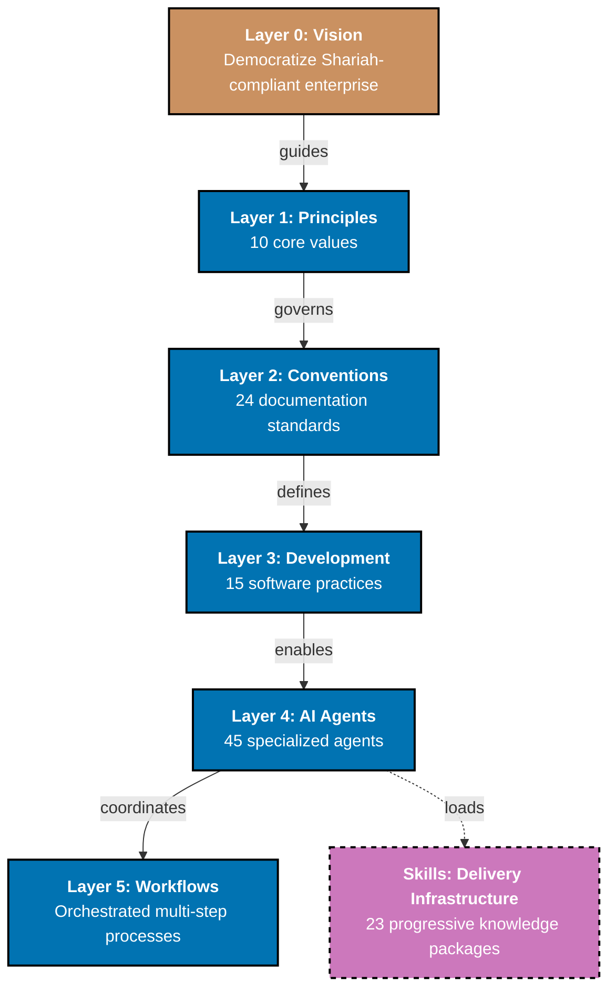

What started as an experiment in building foundations evolved into a comprehensive governance architecture that now governs how everything in this project gets made—from a single documentation file to a multi-agent workflow execution.

Here's what actually happened between December 14 and January 11.

## Architecture Taking Shape

The architecture has evolved from four layers to a comprehensive six-layer governance hierarchy. This evolution wasn't arbitrary—it emerged from a systematic audit of how rules flow from foundational values to execution decisions.

Layer 0 is Vision—the foundational WHY we exist (democratize Shariah-compliant enterprise). Layer 1 is Principles—the ten core values that guide every decision we make. Layer 2 is Conventions—the 24 documentation standards and rules that ensure consistency. Layer 3 is Development—the 15 software practices that govern how we write code. Layer 4 is AI Agents—the 45 specialized agents that enforce rules at scale. Layer 5 is Workflows—the orchestrated multi-step processes that coordinate agents.

What makes this architecture powerful is complete traceability. Every rule, every convention, every practice traces back to principles it serves, and every principle traces back to vision it fulfills. This prevents contradictory rules, orphaned policies, and governance drift. When we need to understand why a convention exists or decide how to handle a new situation, traceability chain provides the answer.

A critical architectural insight emerged during this period: Skills are delivery infrastructure, not a governance layer. They exist below Layer 4 (Agents) as knowledge packages that enable agents to do their work. This distinction matters—it keeps governance focused on rules and coordination, while Skills focus on knowledge delivery.

## Agent System Maturity

The AI agent system has grown from 20+ agents in December to 45 specialized agents today. This growth wasn't about quantity for its own sake—we added agents to address specific challenges as they emerged.

The agents now follow domain-prefixed naming that makes their purpose immediately clear: `docs-*` for documentation validation, `apps-ayokoding-web-*` for educational platform content, `apps-ose-platform-web-*` for landing page content, `readme-*` for README files, `plan-*` for project planning, `repo-governance-*` for repository-wide validation, and `repo-workflow-*` for multi-agent orchestration.

The three-step quality workflow has matured across seven agent families. When we need new documentation, a maker agent creates initial draft. A checker agent validates it and generates an audit report. A human reviews that report and decides which fixes to apply. A fixer agent applies to approved changes, with confidence levels (HIGH, MEDIUM, FALSE_POSITIVE) indicating how certain we are about each fix.

We implemented UUID chain tracking to enable parallel execution. When multiple validation runs happen simultaneously, UUID chains prevent collisions and ensure each audit report is uniquely identifiable. This is crucial for automated validation pipelines that run on every commit.

## Skills Infrastructure

We implemented 23 Skills that provide progressive knowledge delivery to agents. Skills are knowledge packages—reusable instructions that agents load when needed to understand how to perform specific tasks.

The Skills architecture uses domain prefixes matching agent naming patterns. This means when a `docs-checker` agent needs to validate content quality, it loads to `docs-applying-content-quality` skill. When a `repo-governance-checker` agent needs to understand to three-step quality workflow, it loads to `wow-applying-maker-checker-fixer` skill.

Permission-based skill access provides an additional layer of control. Agents use permission systems to specify which Skills they're allowed to use. This prevents unauthorized access and ensures agents only load Skills relevant to their domain.

Skills cover six domains: documentation (6 Skills), workflow/patterns (9 Skills), project planning (2 Skills), application development (2 Skills), AI agent development (3 Skills), and README writing (1 Skill). This comprehensive coverage enables agents to perform complex tasks while maintaining consistency.

The key innovation is on-demand loading. Agents don't auto-load Skills—when they encounter a task requiring specialized knowledge, they explicitly call to skill loading mechanism. This keeps agent code lightweight while providing access to extensive knowledge when needed.

## Content Quality Revolution

This period saw a revolution in content quality standards, particularly for ayokoding-web by-example tutorials. We established comprehensive quality levels with extensive annotation requirements.

By-example tutorials now require 40+ annotations per code example. That's not a typo—every example needs extensive inline commentary explaining what code does, why it works that way, what pitfalls to avoid, and how it relates to broader concepts. This density ensures experienced developers can learn efficiently without needing to read pages of theory.

We added "Why It Matters" and "Key Takeaways" sections to all by-example tutorials. "Why It Matters" connects to example to real-world scenarios—it explains why you'd actually use this technique in production code. "Key Takeaways" summarizes essential insights developers should remember.

Mermaid diagrams received comprehensive accessibility upgrades. We implemented TD (top-down) as default layout, added diagram splitting for mobile displays, established escaping rules for special characters in node labels, and codified mobile-optimized diagram standards. This ensures diagrams remain accessible to all users, regardless of device or screen size.

We achieved comprehensive status across multiple by-example tutorials including infrastructure tools (Ansible, Terraform), data (PostgreSQL, SQL), shell, Golang, and Elixir Phoenix. Comprehensive status means that tutorial meets all quality standards: proper annotation density, complete why-it-matters coverage, accessible diagrams, clear structure, and production-ready examples.

The annotation density process itself became systematic. We added pedagogical annotations explaining not just what code does, but why it matters, what alternatives exist, what patterns demonstrate best practices, and what traps to avoid. This transforms code examples from documentation into learning experiences.

## Major Plan Completions

Three major plans completed during this period, each representing significant infrastructure improvement.

**Rules Consolidation Plan** unified our repository-wide rules into 17 comprehensive Skills covering all agents. The audit found zero violations—45 agents, 17 Skills, complete consistency. This wasn't a rewrite—it was a systematic consolidation of existing rules into a coherent structure with complete traceability.

**Agent Simplification Plan** reduced complexity through architectural improvements. We implemented scope-prefixed naming for application-specific agents (apps-ayokoding-web-_, apps-ose-platform-web-_'), removed duplication between general and application-specific agents, and standardized agent documentation. The audit confirmed all 45 agents follow consistent patterns.

**Programming Language Parity Plan** completed Phase 3 validation across 7 programming languages (Golang, Java, Python, Kotlin, Rust, Elixir, Clojure). We fixed structural parity issues (cookbook weights, file naming, duplicate files), achieved content parity (tutorial expansions to 23-guide standard), and established quality parity (annotation standards, accessibility, cross-references). Every language now meets the same high bar.

## Development Infrastructure

The development infrastructure matured with new tools and automation.

Nx MCP server integration provides workspace understanding. When agents need to analyze project structure, understand dependencies, or run targeted tasks, they use Nx MCP tools instead of manually parsing files. This provides accurate, up-to-date information about the monorepo without manual maintenance.

ayokoding-cli received significant enhancements. We added navigation regeneration commands with 2-layer depth support, automatic title generation with language folder overrides, pre-commit integration for automated title and navigation updates, and test targets for quick validation. The CLI now handles routine maintenance tasks automatically.

Pre-commit automation reduced manual work. Titles update automatically when files move, navigation regenerates when structure changes, and formatting applies consistently before commits. This ensures that site remains in sync with content changes without manual intervention.

butler-cli joined the toolset as a simple utility app with a --say flag for testing and development. While small, it demonstrates our approach to building reusable utilities as needs emerge rather than pre-inventing solutions.

## Quality Gate Workflows

We established comprehensive quality gate workflows that combine automated validation with human oversight.

UUID chain tracking enables parallel execution. When multiple validation pipelines run simultaneously (e.g., one agent checking links, another checking accessibility, a third checking factual accuracy), UUID chains prevent report collisions and enable tracking which fixes came from which validation run.

Progressive report generation writes findings as they're discovered rather than waiting until the end. This means if a long-running validation crashes, you still have partial results to work with. It also enables real-time monitoring of validation progress.

Confidence-based fix application provides nuanced decision-making. HIGH confidence fixes apply automatically (e.g., fixing broken links, correcting indentation). MEDIUM confidence fixes require human review (e.g., rewriting for clarity, reorganizing structure). FALSE_POSITIVE findings get skipped entirely (e.g., valid exceptions to rules). This triage prevents automated fixes from introducing new problems while still handling routine issues automatically.

## Development Practices Maturing

The development practices we established in December have matured into robust conventions.

Trunk-based development is now the default. All work happens on the main branch with small, frequent commits. Pre-commit hooks enforce formatting, validation, and testing. This approach keeps the codebase in a constantly releasable state and prevents integration nightmares.

Commit message formatting follows Conventional Commits consistently. We use standard prefixes: `feat:` for new features, `fix:` for bug fixes, and `refactor:` for structural changes. This consistency enables automated analysis, changelog generation, and semantic versioning.

We established designated directories for temporary files. The `generated-reports/` directory holds validation and audit reports. The `local-temp/` directory stores miscellaneous temporary files. Both are gitignored to keep the repository clean while giving agents organized places to store their outputs.

Documentation-first approach remains fundamental. Every feature, every change, every decision gets documented before implementation. This prevents orphaned code, undocumented systems, and knowledge loss when team members transition.

## OpenCode: Strategic Foundation for Future Migration

One of most significant events this period was Anthropic's decision to block third-party use of Claude Code subscriptions. On January 9, 2026 at 02:20 UTC, OpenCode users encountered error messages stating that Claude credentials were "only authorized for use with Claude Code." This wasn't a bug—it was a deliberate policy change that locked out open-source alternatives.

The economic reality behind this decision became clear quickly. Claude Max subscriptions at $200/month provided unlimited token access. The same usage through metered APIs would cost $1,000+ per month. Third-party tools like OpenCode had enabled developers to access unlimited Claude power at consumer pricing while removing Claude Code's artificial rate limits. Anthropic closed this arbitrage loophole.

Community reaction was immediate and negative. GitHub issues exploded across multiple repositories: OpenCode (#7410), Clawdbot (#559), Oh My OpenCode (#626), and even Anthropic's own claude-code repository (#8046). Developers who'd built workflows around Claude subscriptions suddenly found themselves locked out with zero migration path.

This event crystallized a fundamental question: What happens when vendor you rely on decides to restrict access? For an open-source enterprise platform committed to building foundations for decades, vendor lock-in isn't acceptable.

OpenCode's approach offers a fundamentally different model. MIT-licensed open source code means no proprietary restrictions. Flexible agent and model selection means you're not locked into any single provider. Multi-provider support ensures if one vendor changes policy, alternatives exist.

**Strategic Positioning**:

- **Economic Context**: Claude Max at $200/month vs. $1,000+/month for API usage. Third-party tools enabled unlimited access at consumer pricing.
- **Community Impact**: Multiple repositories impacted with developers locked out of established workflows.
- **OpenCode Advantage**: MIT-licensed open source with no proprietary restrictions. Flexible agent and model selection. Multi-provider support for vendor independence.

**Implementation Status**:

- ✅ Full compatibility achieved with GLM-4.7 model configured as primary choice
- ✅ 4 Z.AI MCP servers added for image analysis: `zai-mcp-server` for general analysis, `extract_text_from_screenshot` for OCR, `diagnose_error_screenshot` for error diagnosis, `understand_technical_diagram` for architecture diagrams, and `analyze_data_visualization` for charts and metrics
- ✅ Dual-format maintenance ensuring all 45 agents work with both Claude Code and OpenCode platforms
- ✅ Skill permission system implemented for OpenCode agents with standardized reference documentation sections
- ✅ Model selection justifications documented across all agents with clear provider independence rationale
- ✅ OpenCode Adoption Plan completed with zero issues over 4 phases in 3 days

**Current State**: Dual-format maintenance is a temporary state that ensures our 45 agents work with both platforms. Agent files exist in both `.claude/agents/` and `.opencode/agents/` with synchronized documentation. This prevents disruption during the transition period.

**Future Migration**: Complete migration to OpenCode-only will eliminate `.claude/agents/` directory and consolidate all 45 agents into a single open-source format. This simplifies maintenance, ensures community contribution compatibility, and removes dependence on any proprietary tooling that could change without notice.

**Vendor Independence**: The OpenCode project is MIT-licensed, actively developed, and supports flexible model selection. GLM-4.7 demonstrated strong performance during this period. Alternative models (OpenAI GPT-5, MiniMax M2.1, open-source alternatives) remain available through OpenCode's multi-provider architecture. This means we can adapt to AI ecosystem without being locked into any vendor's decisions.

**Migration Timeline**: Depends on Phase 0 completion and transition to Phase 1 feature development. Strategic direction is clear: open-source foundations, open-source tools, open-source future.

The agent system currently supports both Claude Code and OpenCode formats through dual-format maintenance. When we eventually migrate fully to OpenCode, we'll eliminate dual-format maintenance while gaining long-term stability of a vendor-neutral platform.

## What's Actually Next

Phase 0 foundation work continues. We're still exploring architecture patterns for core platform components, designing security infrastructure, researching compliance frameworks, and establishing additional content quality standards. The documentation framework is mature, but foundational research remains ongoing.

Phase 1 will focus on ERP foundation. That means core modules for accounting, inventory, and basic HR functionality. It means implementing Sharia-compliance framework that makes this platform distinctive. It means production-ready authentication and authorization systems. It means establishing multi-tenancy architecture so one installation can serve multiple organizations. It means building deployment infrastructure that makes all of this actually usable in production.

We don't have a timeline for Phase 1. This is a life-long project, and we're optimizing for quality over speed. Each phase completes when its foundation is truly solid, not when we've hit some arbitrary deadline. We'd rather take extra time to get the architecture right than rush to production and spend years paying for shortcuts we took under pressure.

## Current Reality

Let's be clear about where we actually are. This is Phase 0, pre-alpha, foundational research and infrastructure. We've made substantial progress through systematic work. Nothing is production-ready. You can't download this and use it for anything real yet.

What we have is mature foundation infrastructure: a six-layer governance architecture with complete traceability, 45 specialized AI agents with proven patterns, 23 Skills for progressive knowledge delivery, 700+ documentation files organized by Diátaxis framework, two live websites with automated deployment pipelines, comprehensive content quality standards, robust development infrastructure including Nx MCP server and CLI tools, and quality gate workflows balancing automation with human oversight.

These aren't sexy features you can demo, but they're the mature foundations being built that will make everything else possible. The difference from December 14 is maturity—what was emerging then is established now. What was experimental then is proven now. What was tentative then is confident now.

We're building this entirely in the open. Every decision, every convention, every line of code is visible on [GitHub](https://github.com/wahidyankf/open-sharia-enterprise). You can watch our progress through regular updates on oseplatform.com, follow the repository, subscribe to our RSS feed, or read the detailed research and guides we publish on [ayokoding.com](https://ayokoding.com).

This transparency is intentional. Open source creates trust. Building in public enables collaboration. Sharing our research helps others avoid the mistakes we've already made. We believe this approach produces better software and builds stronger communities.

## Stay Updated

We publish platform updates every second Sunday of each month. These updates share our progress, challenges, and decisions as we build OSE Platform in the open. Subscribe to our RSS feed or check back regularly to follow along.

Systematic, methodical progress toward foundations that will support enterprise fintech for decades. We're in Phase 0, with mature governance architecture, robust agent systems, and proven content quality standards. We're not rushing. We're building it right.
