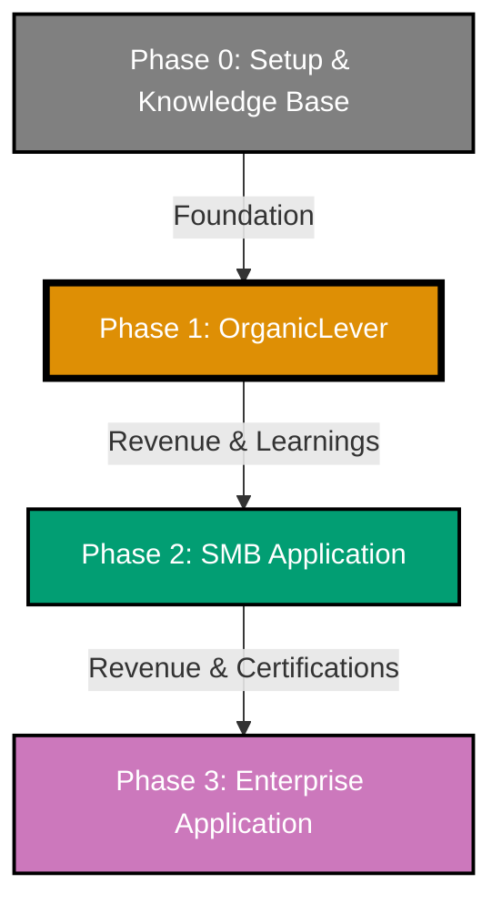

# About Open Sharia Enterprise

Open Sharia Enterprise (OSE) Platform is an **open-source** platform for building Sharia-compliant enterprise solutions. Built for Islamic finance institutions and Sharia-compliant businesses, starting with Indonesian regulations and expanding globally.

## The Opportunity

Islamic finance is a multi-trillion dollar industry growing at double-digit rates, creating massive demand for Sharia-compliant enterprise systems. While purpose-built platforms exist, they're typically proprietary and expensive. Many organizations still struggle with legacy systems retrofitted for Sharia compliance.

**The gap?** Accessible, open-source solutions with built-in compliance and radical transparency.

## Mission

Our mission is to democratize access to **trustworthy**, Sharia-compliant enterprise technology for organizations of all sizes, regardless of region or industry.

We're building an open-source platform with Sharia-compliance at its core—following a progressive complexity approach from individual users (Phase 1: OrganicLever productivity tracker) to SMB (Phase 2) to enterprise (Phase 3: full ERP and global expansion). Each phase generates revenue to fund the next, ensuring sustainable growth.

## Why Open Source Matters

**Transparency builds trust in Sharia-compliant systems.** Unlike expensive proprietary solutions, OSE Platform is accessible to all organizations—from small businesses to large enterprises.

### Trust Through Transparency

- **Community verification** - Anyone can review the code to verify Sharia compliance
- **Auditable by scholars** - Islamic finance experts can examine implementation details
- **No hidden mechanisms** - Complete transparency in financial calculations and processes
- **Trust through openness** - Open standards and shared knowledge drive innovation

### Accessible to All

- **No licensing fees** - Free to use, modify, and deploy for any organization
- **No vendor lock-in** - Own your data, control your infrastructure
- **Community-driven** - Benefits from collective expertise and contributions
- **Lower barriers** - Organizations of all sizes can access enterprise-grade solutions

### Open Standards

- **Interoperability** - Works with existing systems through open standards
- **Portable** - Not tied to specific vendors or proprietary formats
- **Extensible** - Customize for your organization's specific needs
- **Future-proof** - Community ensures long-term sustainability

## Development Approach

We're building OSE Platform **in the open from day one**, with transparency and knowledge-sharing as core principles.

### Built in the Open

- **Public development** - All code, discussions, and decisions happen publicly on GitHub
- **Security and compliance infrastructure developed in parallel** - Not bolted on later
- **Community-driven roadmap** - Transparent planning and prioritization
- **Open governance** - Clear decision-making processes and contribution guidelines

### Learning in Public

We share our OSE Platform journey through [**monthly updates**](/updates/) published every 2nd Sunday of the month. Technical insights and lessons learned are documented on [**AyoKoding**](https://ayokoding.com), our bilingual educational platform. This "learning in public" approach:

- **Monthly platform updates** - Progress, decisions, and direction posted every 2nd Sunday at [oseplatform.com/updates](/updates/)
- **Shares technical insights** - Tutorials, guides, and lessons learned on AyoKoding
- **Builds community expertise** - Help others learn from our experiences
- **Demonstrates transparency** - Show how decisions are made
- **Accelerates ecosystem growth** - Enable others to build on our foundation

## Development Roadmap

Our progressive complexity approach - start simple, test thoroughly, scale systematically:

### Phase 0: Repository Setup & Knowledge Base (Done)

Established repository infrastructure and launched initial websites:

- 🛠️ **Repository Infrastructure** - Development tooling, documentation, AI agents, governance, planning systems
- 🌐 **Website Launches** - ayokoding.com (educational) and oseplatform.com (marketing)
- 🔧 **CLI Tools** - ayokoding-cli and rhino-cli (Golang) for automation and repository management
- 🔐 **Golang Foundation** - Go forms the foundation for CLI tooling and information security infrastructure
- 📊 **Strategic Value** - Early online presence, audience building, deployment validation

### Phase 1: OrganicLever - Productivity Tracker (Current)

Building the first product application to test infrastructure at small scale:

- 📱 **Product** - organiclever.com (web) + Android + iOS apps — in active development
- ⚡ **Tech Stack** - Java + Spring Boot (API), Next.js + TypeScript (web), Flutter + Dart (mobile & web), Kubernetes (infrastructure)
- 📚 **Learning Focus** - Small-scale product patterns, deployment mastery, security practice
- 💰 **Revenue Generation** - Fund Phase 2 expansion and Phase 3 certification costs

### Phase 2: SMB Application (Small & Medium Business)

Building on Phase 1 foundation with moderate complexity:

- 🏢 **Scope** - TBD based on Phase 1 learnings
- 🔧 **Tech** - Likely additions: Elixir middleware, Kotlin or F#, modular services architecture
- ☸️ **Infrastructure** - Building on Phase 1 Kubernetes experience for multi-service orchestration
- 💰 **Critical Revenue** - Must fund Phase 3's significant certification budget

### Phase 3: Enterprise Application (Large Organizations)

Full enterprise capabilities with maximum scale:

- 🌐 **Scope** - Full ERP, financial services, multi-jurisdiction compliance
- 🏗️ **Architecture** - Distributed microservices, event-driven, service mesh
- 📜 **Certifications** - Multi-jurisdiction compliance, Sharia certifications, financial regulations (funded by Phase 1/2 success)
- 🌏 **Global Expansion** - International Islamic standards, cross-border operations

## Why This Approach?

- 📈 **Progressive Complexity** - Start simple (individuals), scale to moderate (SMB), then enterprise
- 🧪 **Real-World Testing** - Each phase validates with actual users before scaling up
- 💰 **Financial Sustainability** - Phase 3 requires significant certifications; Phase 1/2 revenue funds this
- 📚 **Knowledge Base Learning** - Test patterns at small scale before enterprise ERP
- 🔄 **Learn and Iterate** - Feedback from individual users (Phase 1) informs SMB (Phase 2); Phase 2 learnings inform enterprise
- 🎯 **Minimum Risk** - OrganicLever tests infrastructure without enterprise stakes
- 🛡️ **Security by Design** - Practice security early in low-stakes environment
- ⚖️ **Proven Foundation** - Each phase proves architecture works before adding complexity

## Core Principles

- 🕌 **Sharia-compliance as a foundation** - Built in from the ground up, not bolted on later
- 🔓 **Transparency and openness** - Code transparency builds trust
- 🌐 **Open source by default** - Radical transparency unless it compromises security/privacy
- 🤖 **AI-assisted development** - Leverage AI systematically to enhance productivity
- 🤝 **Community collaboration** - Accelerate development of accessible tools
- 🛡️ **Governance and security from day one** - Essential for enterprise solutions

## Project Status

⚠️ **PRE-ALPHA** - This project is in early development and **NOT ready for production use**.

**Current Phase: Phase 1 - OrganicLever (Productivity Tracker)**

Phase 0 foundations are complete. We are now actively building OrganicLever, the first product application:

**Phase 0 (Done):**

- ✅ ayokoding.com - Educational platform (live)
- ✅ oseplatform.com - Marketing website (this site, live)
- ✅ ayokoding-cli & rhino-cli - Golang CLI tools (live)

**Phase 1 (In Progress):**

- ✅ organiclever.com - Landing and promotional website (live)
- 🚧 OrganicLever App - Flutter mobile & web app (Android, iOS, web) in development
- 🚧 OrganicLever API - Spring Boot REST API backend in development

**Not Yet Available:**

- ❌ No stable APIs
- ❌ No security hardening
- ❌ Not accepting public contributions

## Technology

Our tech stack reflects the progressive complexity approach — chosen for proven reliability, open-source availability, and suitability at each phase:

- **Backend API** - Java + Spring Boot (REST API, enterprise-grade, battle-tested)
- **Web Frontend** - Next.js 14 + TypeScript (React, App Router, modern full-stack)
- **Mobile & Web App** - Flutter + Dart (Android, iOS, and web from a single codebase)
- **Educational Sites** - Hugo static sites (ayokoding.com, oseplatform.com)
- **CLI Tools** - Go (ayokoding-cli, rhino-cli — automation and repository management)
- **Future additions** - Elixir (middleware), Kotlin (JVM alternative) under evaluation for Phase 2

## License

This project is licensed under the **MIT License** - giving you complete freedom to use, modify, and distribute the code for any purpose, including commercial projects.

## Get Involved

While we're not yet accepting public contributions (pre-alpha), you can stay connected and support the project:

### Follow the Project

- **GitHub Repository**: [open-sharia-enterprise](https://github.com/wahidyankf/open-sharia-enterprise)
  - ⭐ Star the repository to show your support
  - 👀 Watch for updates and release announcements
  - 📋 Read the [detailed roadmap](https://github.com/wahidyankf/open-sharia-enterprise/blob/main/ROADMAP.md) and planning documents

### Learn and Explore

- **AyoKoding**: [ayokoding.com](https://ayokoding.com)
  - 📚 Educational content documenting our "learning in public" journey
  - 🎓 Tutorials, guides, and technical resources in Indonesian and English
  - 💡 Insights into building enterprise Sharia-compliant systems

### Spread the Word

- 📢 Share the project with your network
- 💬 Discuss with colleagues in Islamic finance and fintech
- 🤝 Connect with others interested in open-source Sharia-compliant solutions

## Key Resources

- **Main Repository**: [github.com/wahidyankf/open-sharia-enterprise](https://github.com/wahidyankf/open-sharia-enterprise)
- **Project Updates**: [oseplatform.com/updates](/updates/) - monthly, every 2nd Sunday
- **Educational Platform**: [ayokoding.com](https://ayokoding.com)
- **License**: MIT - complete freedom to use, modify, and distribute
