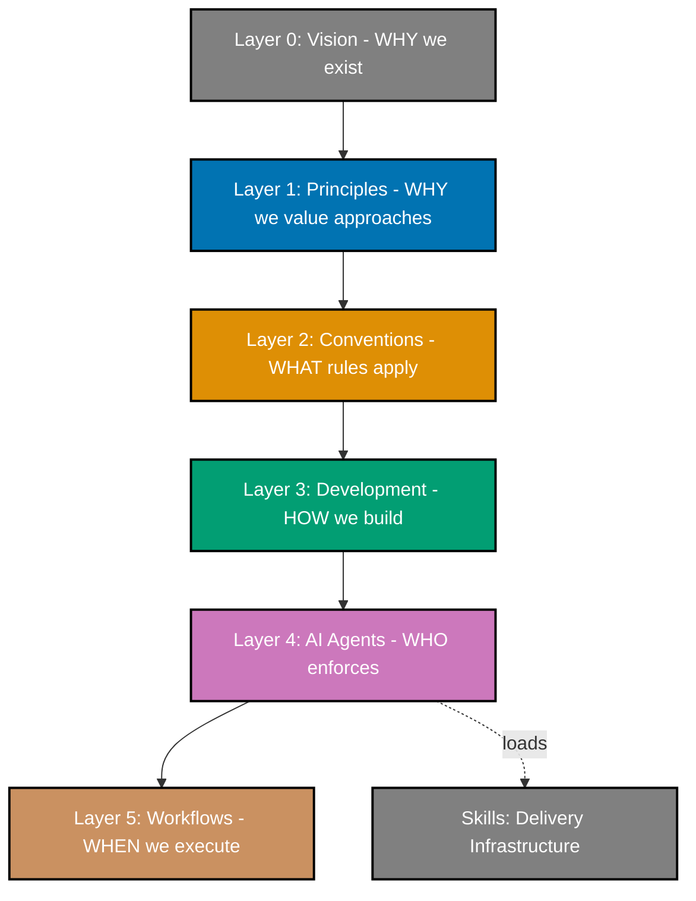

What started as an experiment in building foundations evolved into a comprehensive governance architecture that now governs how everything in `this project` gets made—from a single documentation file to a multi-agent workflow execution.

Here's what actually happened between December 14, 2025 and January 11, 2026.

## Governance Architecture Taking Shape

The architecture has evolved from four layers to a comprehensive six-layer governance hierarchy. This evolution wasn't arbitrary—it emerged from a structured review of how rules flow from foundational values to execution decisions.

Layer 0 is Vision—the foundational WHY we exist (democratize Shariah-compliant enterprise). Layer 1 is Principles—the ten core values that guide every decision we make. Layer 2 is Conventions—the 24 documentation standards and rules that ensure consistency. Layer 3 is Development—the 15 software practices that govern how we write code. Layer 4 is AI Agents—the 45 specialized agents that enforce rules at scale. Layer 5 is Workflows—the multi-step processes that coordinate `agents`.

**Six-Layer Governance Architecture:**

**Layer 0: Vision**

- Democratize Shariah-compliant enterprise
- WHY we exist

**Layer 1: Principles** (guided by Vision)

- 10 core values
- WHY we value approaches

**Layer 2: Conventions** (governed by Principles)

- 24 documentation standards
- WHAT rules apply

**Layer 3: Development** (defined by Conventions)

- 15 software practices
- HOW we build

**Layer 4: AI Agents** (enabled by Development)

- 45 specialized agents
- WHO enforces
- Coordinates Layer 5 and loads Skills

**Layer 5: Workflows** (coordinated by Layer 4)

- Multi-step processes
- WHEN we execute

**Skills: Delivery Infrastructure** (loaded by Layer 4)

- 23 knowledge packages
- Service relationship (not governance layer)

What makes this architecture powerful is complete traceability. Every rule, every convention, every practice traces back to principles it serves, and every principle traces back to vision it fulfills. This prevents contradictory rules, orphaned policies, and governance drift. When we need to understand why a convention exists or decide how to handle a new situation, traceability chain provides the answer.

A critical architectural insight emerged during this period: Skills are delivery infrastructure, not a governance layer. They exist below Layer 4 (Agents) as knowledge packages that enable agents to do their work. This distinction matters—it keeps governance focused on rules and coordination, while Skills focus on knowledge delivery.

## Content Quality Improvement

Building on the governance architecture foundation, we systematically improved content quality standards throughout December and early January, particularly for [`ayokoding-web`](https://ayokoding.com) by-example tutorials.

The work began with establishing comprehensive quality levels. By-example tutorials now require 40+ annotations per code example—extensive inline commentary explaining what code does, why it works, pitfalls to avoid, and broader concept connections. This density ensures efficient learning without pages of theory. We added "Why It Matters" sections connecting examples to real-world scenarios and "Key Takeaways" summarizing essential insights. Through December 21-31, we systematically enhanced multiple tutorials, transforming code examples from documentation into learning experiences with detailed commentary on alternatives, best practices, and traps.

Mermaid diagrams received comprehensive accessibility upgrades. We implemented TD (top-down) as default layout, added diagram splitting for mobile displays, established escaping rules for special characters in node labels, and codified mobile-optimized diagram standards. This ensures diagrams remain accessible to all users, regardless of device or screen size.

By January 2-3, we completed quality work across multiple by-example tutorials including infrastructure tools ([Ansible](https://ayokoding.com/en/learn/software-engineering/infrastructure/tools/ansible/tutorials/by-example), [Terraform](https://ayokoding.com/en/learn/software-engineering/infrastructure/tools/terraform/tutorials/by-example)), data ([PostgreSQL](https://ayokoding.com/en/learn/software-engineering/data/databases/postgresql/tutorials/by-example), [SQL](https://ayokoding.com/en/learn/software-engineering/data/databases/sql/tutorials/by-example)), [shell](https://ayokoding.com/en/learn/software-engineering/linux-platform/shell/tutorials/by-example), programming languages ([Golang](https://ayokoding.com/en/learn/software-engineering/programming-languages/golang/tutorials/by-example), [Java](https://ayokoding.com/en/learn/software-engineering/programming-languages/java/tutorials/by-example), [Python](https://ayokoding.com/en/learn/software-engineering/programming-languages/python/tutorials/by-example), [Kotlin](https://ayokoding.com/en/learn/software-engineering/programming-languages/kotlin/tutorials/by-example), [Rust](https://ayokoding.com/en/learn/software-engineering/programming-languages/rust/tutorials/by-example), [Elixir](https://ayokoding.com/en/learn/software-engineering/programming-languages/elixir/tutorials/by-example), [Clojure](https://ayokoding.com/en/learn/software-engineering/programming-languages/clojure/tutorials/by-example)), and [Elixir Phoenix](https://ayokoding.com/en/learn/software-engineering/web-platform/elixir-phoenix/tutorials/by-example). Completed tutorials meet all quality standards: proper annotation density, complete why-it-matters coverage, accessible diagrams, clear structure, and production-ready examples.

The Programming Language Parity Plan completed Phase 3 validation across 7 programming languages ([Golang](https://ayokoding.com/en/learn/software-engineering/programming-languages/golang/tutorials/by-example), [Java](https://ayokoding.com/en/learn/software-engineering/programming-languages/java/tutorials/by-example), [Python](https://ayokoding.com/en/learn/software-engineering/programming-languages/python/tutorials/by-example), [Kotlin](https://ayokoding.com/en/learn/software-engineering/programming-languages/kotlin/tutorials/by-example), [Rust](https://ayokoding.com/en/learn/software-engineering/programming-languages/rust/tutorials/by-example), [Elixir](https://ayokoding.com/en/learn/software-engineering/programming-languages/elixir/tutorials/by-example), [Clojure](https://ayokoding.com/en/learn/software-engineering/programming-languages/clojure/tutorials/by-example)). We fixed structural parity issues (cookbook weights, file naming, duplicate files), achieved content parity (tutorial expansions to 23-guide standard), and established quality parity (annotation standards, accessibility, cross-references). Every language now meets the same high bar.

## Agent System Improvement

The AI agent system has evolved through systematic growth and refinement. Starting from 20+ agents in December, the system expanded to 45 specialized agents through targeted additions addressing specific challenges as they emerged.

Mid-December saw the first wave of agent additions focused on content validation. The `ayokoding-structure-checker` and `ayokoding-link-checker` agents joined the system, followed by their corresponding fixers. These agents validated Hugo site structure, navigation depth, and linking conventions for the educational platform.

The three-step quality workflow matured across seven agent families during December: maker agents create initial drafts, checker agents validate and generate audit reports, humans review findings and approve fixes, fixer agents apply approved changes with confidence levels (HIGH, MEDIUM, FALSE_POSITIVE) indicating certainty. We implemented UUID chain tracking for parallel execution—when multiple validation runs happen simultaneously, UUID chains prevent collisions and ensure each audit report is uniquely identifiable, crucial for automated validation pipelines running on every commit.

January brought significant architectural refinement through the Agent Simplification Plan, implementing scope-prefixed naming (`docs-*` for documentation, `apps-ayokoding-web-*` for educational platform, `apps-ose-platform-web-*` for landing page, `readme-*` for README, `plan-*` for project planning). The final restructuring on January 11 unified governance and workflow agents—former `wow-rules-*` agents became `repo-governance-*` and `wow-workflow-*` became `repo-workflow-*`, explicitly separating repository-level concerns from application-specific agents. The audit confirmed all 45 agents follow consistent patterns, removing duplication and standardizing documentation.

## Skills Infrastructure

Building on the agent system foundation, we implemented 23 Skills that provide knowledge delivery to agents. Skills are knowledge packages—reusable instructions that agents load when needed to understand how to perform specific tasks.

The Skills implementation began with the Rules Consolidation Plan, unifying repository-wide rules into 23 comprehensive Skills covering all agents. The audit found zero violations—45 agents, 23 Skills, complete consistency. This wasn't a rewrite but systematic consolidation into a coherent structure with complete traceability. Skills use domain prefixes matching agent naming patterns—when `docs-checker` validates content quality, it loads `docs-applying-content-quality`; when `repo-governance-checker` needs three-step quality workflow, it loads `wow-applying-maker-checker-fixer`. Permission-based skill access prevents unauthorized access, ensuring agents only load relevant domain knowledge. Six domains are covered: documentation (6 Skills), workflow/patterns (9 Skills), project planning (2 Skills), application development (2 Skills), AI agent development (3 Skills), and README writing (1 Skill). The key innovation is on-demand loading—agents don't auto-load Skills but explicitly call the skill loading mechanism when encountering tasks requiring specialized knowledge, keeping agent code lightweight while providing extensive access when needed.

## Development Infrastructure

The development infrastructure matured with new tools and automation.

Nx MCP server integration provides workspace understanding. When agents need to analyze `project structure`, understand dependencies, or run targeted tasks, they use Nx MCP tools instead of manually parsing files. This provides accurate, up-to-date information about the `monorepo` without manual maintenance.

`ayokoding-cli` received significant enhancements with navigation regeneration commands (2-layer depth support), automatic title generation with language folder overrides, pre-commit integration for automated updates, and test targets for quick validation. The CLI now handles routine maintenance tasks automatically—titles update when files move, navigation regenerates when structure changes, and formatting applies consistently before commits, ensuring the site remains in sync with content changes without manual intervention.

## Quality Gate Workflows

We established comprehensive quality gate workflows combining automated validation with human oversight. UUID chain tracking enables parallel execution—when multiple validation pipelines run simultaneously (link checking, accessibility, factual accuracy), UUID chains prevent collisions and enable tracking which fixes came from which validation run. Progressive report generation writes findings as discovered rather than waiting until the end, providing partial results if validation crashes and enabling real-time monitoring. Confidence-based fix application provides nuanced decision-making: HIGH confidence fixes apply automatically (broken links, indentation), MEDIUM confidence fixes require human review (rewriting for clarity, reorganizing structure), and FALSE_POSITIVE findings get skipped entirely (valid rule exceptions), preventing automated fixes from introducing new problems while handling routine issues automatically.

## Development Practices Maturing

The development practices we established in December have matured into robust conventions.

Trunk-based development is now the default. All work happens on the `main branch` with small, frequent commits. Pre-commit hooks enforce formatting, validation, and testing. This approach keeps the `codebase` in a constantly releasable state and prevents integration nightmares.

Commit message formatting follows Conventional Commits consistently. We use standard prefixes: `feat:` for new features, `fix:` for bug fixes, and `refactor:` for structural changes. This consistency enables automated analysis, changelog generation, and semantic versioning.

We established designated directories for temporary files. The `generated-reports/` directory holds validation and audit reports. The `local-temp/` directory stores miscellaneous temporary files. Both are gitignored to keep the `repository` clean while giving agents organized places to store their outputs.

Documentation-first approach remains fundamental. Every feature, every change, every decision gets documented before implementation. This prevents orphaned code, undocumented systems, and knowledge loss when team members transition.

## OpenCode: Strategic Foundation for Future Migration

One of most significant events this period was Anthropic's decision to block third-party use of Claude Code subscriptions. On January 9, 2026 at 02:20 UTC, OpenCode users encountered error messages stating that Claude credentials were "only authorized for use with Claude Code." This wasn't a bug—it was a deliberate policy change that locked out open-source alternatives.

The economic reality behind this decision became clear quickly. Claude Max subscriptions at $200/month provided unlimited token access. The same usage through metered APIs would cost $1,000+ per month. Third-party tools like OpenCode had enabled developers to access unlimited Claude power at consumer pricing while removing Claude Code's artificial rate limits. Anthropic closed this pricing gap.

Community reaction was immediate and negative. GitHub issues exploded across multiple repositories: [OpenCode (#7410)](https://github.com/anomalyco/opencode/issues/7410), [Clawdbot (#559)](https://github.com/clawdbot/clawdbot/issues/559), [Oh My OpenCode (#626)](https://github.com/code-yeongyu/oh-my-opencode/issues/626), and even [Anthropic's own claude-code repository (#8046)](https://github.com/anthropics/claude-code/issues/8046). Developers who'd built workflows around Claude subscriptions suddenly found themselves locked out with zero migration path, crystallizing a fundamental question: what happens when the vendor you rely on decides to restrict access? For an open-source enterprise platform committed to building foundations for decades, vendor lock-in isn't acceptable.

OpenCode's fundamentally different model offers MIT-licensed open source code with no proprietary restrictions, flexible agent and model selection preventing provider lock-in, and multi-provider support ensuring alternatives exist if vendors change policies. **Strategic Positioning**: Claude Max at $200/month vs. $1,000+/month for API usage, with third-party tools enabling unlimited access at consumer pricing. This economic context, combined with widespread community impact, highlights OpenCode's advantage for vendor independence.

Implementation achieved full compatibility with GLM-4.7 model as primary choice, added 4 Z.AI MCP servers for image analysis (`zai-mcp-server`, `extract_text_from_screenshot`, `diagnose_error_screenshot`, `understand_technical_diagram`, `analyze_data_visualization`), integrated Perplexity MCP server for web search capabilities, maintained dual-format for all 45 agents working on both platforms, implemented Skill permission system with standardized documentation, documented model selection justifications with provider independence rationale, and completed OpenCode Adoption Plan with zero issues over 4 phases in 3 days. **Current State & Future**: Dual-format maintenance is a temporary state ensuring all 45 agents work with both platforms. Agent files exist in both `.claude/agents/` and `.opencode/agents/` with synchronized documentation to prevent disruption. Complete migration to OpenCode-only will, Insha Allah, eliminate `.claude/agents/` directory and consolidate all agents into a single open-source format within the next 4 weeks. This simplifies maintenance, ensures community contribution compatibility, and removes dependence on proprietary tooling that could change without notice.

The OpenCode project is MIT-licensed, actively developed, and supports flexible model selection through its multi-provider architecture. GLM-4.7 demonstrated strong performance during this period, with alternative models (OpenAI GPT-5, MiniMax M2.1, open-source alternatives) remaining available. This vendor independence means we can adapt to the AI ecosystem without being locked into any single provider's decisions—strategic direction is clear: open-source foundations, open-source tools, open-source future.

## What's Next

Phase 0 foundation work continues with architecture patterns for core platform components, security infrastructure design, compliance framework research, and additional content quality standards. The documentation framework is mature, but foundational research remains ongoing.

For the next four weeks, we'll, Insha Allah, focus on three priorities: complete migration to OpenCode and phase out Claude Code completely from the agent system, establish first service skeletons for LMS (Learning Management System for training and onboarding), Middleware (service communication and integration layer), and IAM (Identity and Access Management for authentication and authorization), and solidify CI/CD tooling with CI (Continuous Integration for automated testing) and CD (Continuous Deployment for automated production delivery) for these services.

We publish platform updates every second Sunday of each month, sharing our progress, challenges, and decisions as we build OSE Platform in the open. Subscribe to our RSS feed or check back regularly to follow along. Systematic, methodical progress toward foundations that will support enterprise fintech for decades. We're in Phase 0, with mature governance architecture, robust agent systems, and established content quality standards. We're not rushing. We're building it right.
