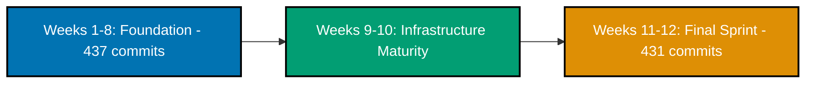
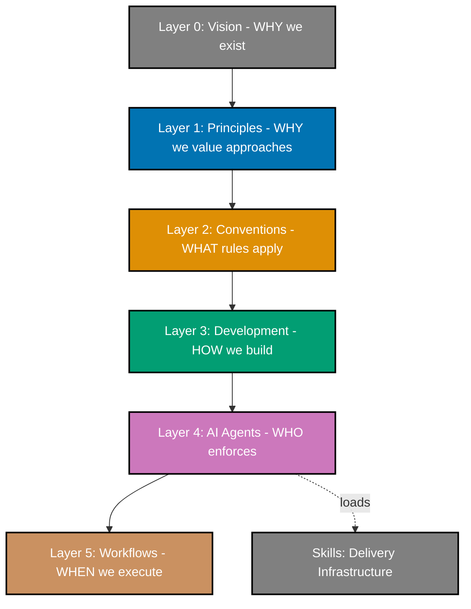
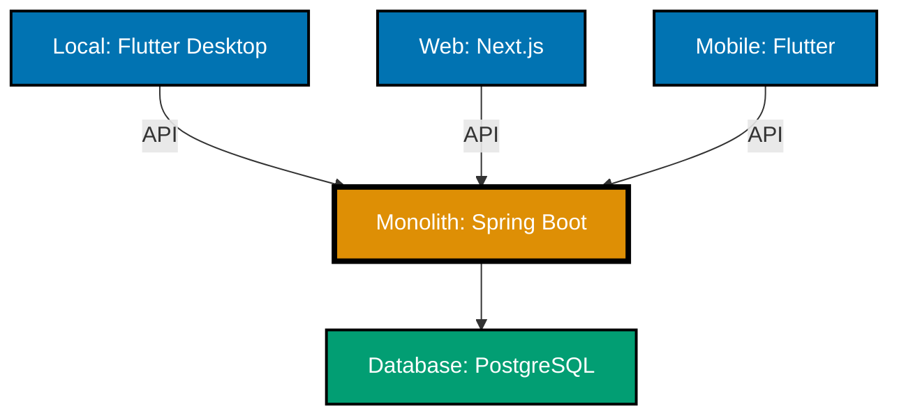

Phase 0 is complete. After twelve weeks of systematic foundation building—1,200+ commits establishing infrastructure, governance architecture, content quality, and operational systems—we've built a foundation strong enough for Phase 1. It's not perfect, but it's solid enough to support what comes next.

Phase 1 begins next week, Insha Allah.

## Why This Milestone Matters

Most software projects rush to build features. We took a different path. Phase 0 was about building the scaffolding before laying bricks—establishing conventions when changes are easy, not when production systems depend on our decisions.

The foundation is ready for Phase 1. We have:

- **Repository Infrastructure**: Nx monorepo, Volta version management, automated quality gates
- **Documentation Framework**: Diátaxis organization, six-layer governance, 26 standards
- **AI Agents System**: 56 specialized agents, 33 reusable skills, `maker-checker-fixer` workflow
- **Dual Websites**: [ayokoding.com](https://ayokoding.com) for education, [oseplatform.com](https://oseplatform.com) for platform updates
- **Content**: Production-quality across 9 programming languages
- **Practices**: Applied through twelve weeks of systematic work

Phase 1 is different. It's about solidifying infrastructure and gaining development experience with a real product in production. The OrganicLever productivity tracker will exercise the systems we built in Phase 0 while serving an immediate practical purpose. Once infrastructure is solid, revenue will fund Phase 2 expansion and contribute to Phase 3's certification budget (compliance, regulatory, security certifications across multiple jurisdictions), Insha Allah.

**Phase 0 Timeline:**

**Weeks 1-8: Foundation Establishment**

- Repository infrastructure
- Nx monorepo + Volta
- Diátaxis framework
- Dual websites
- Agent system 20→45
- Skills 0→23
- 3→7 languages
- Six-layer governance
- 437 commits

**Weeks 9-10: Infrastructure Maturity**

- C4 model adoption
- RHINO CLI 60x faster
- 50 agents, 27 skills
- 345k lines standards

**Weeks 11-12: The Final Sprint**

- Playwright E2E 85+ examples
- 9 languages production-ready
- 56 agents, 33 skills
- 100% annotation compliance
- 431 commits

## Weeks 1-8: Foundation Establishment

The first eight weeks focused on establishing the foundational infrastructure that would support everything built afterward. This period saw rapid iteration on core systems, architectural decisions, and tooling.

### Initial Infrastructure (Weeks 1-4)

The first four weeks established basic repository infrastructure with 440+ commits of methodical foundation work. We set up the Nx monorepo architecture, established the Diátaxis documentation framework, and launched both websites—[oseplatform.com](https://oseplatform.com) for platform updates and [ayokoding.com](https://ayokoding.com) for educational content. The AI agent system began with 20 experimental agents exploring `maker-checker-fixer` patterns.

This period was about testing concepts and establishing patterns. We weren't building features—we were building the systems that would let us build features efficiently later. The dual website deployment established our commitment to building in public (platform updates) while sharing knowledge openly (educational content).

### Automation and Content Expansion (Week 5)

Week 5 introduced `ayokoding-cli`, a Go-based tool for automated navigation generation across hundreds of content files. Repository cleanup removed demo applications, clarifying the boundary between production code and experimental work. The agent system grew to 37 specialized agents with new capabilities for navigation automation, structural validation, fact-checking, and social media content.

Educational content expanded—three new programming languages (Elixir, Kotlin, Rust) joined the platform, along with security tutorials (Gobuster) and reference documentation for Golang, Java, and Python. We established six core principles that would guide all future decisions and formalized a four-layer architecture model (principles → conventions/development → agents) that later evolved into our six-layer governance hierarchy.

### Governance Architecture Maturity (Week 8)

Week 8 marked the shift from exploration to production-ready systems. The six-layer governance architecture was established—Vision → Principles → Conventions → Development → AI Agents → Workflows—where each rule traces back to foundational values, preventing contradictions and governance drift.

**Six-Layer Governance Architecture:**

**Layer 0: Vision**

- WHY we exist
- Democratize Shariah-compliant enterprise

**Layer 1: Principles**

- WHY we value approaches
- 10 core principles

**Layer 2: Conventions**

- WHAT rules apply
- 26 documentation standards

**Layer 3: Development**

- HOW we build
- 15 software practices

**Layer 4: AI Agents**

- WHO enforces
- 56 specialized agents

**Layer 5: Workflows**

- WHEN we execute
- Orchestrated processes

**Skills Infrastructure** (supports Layer 4)

- 33 reusable knowledge packages
- Service relationship (not governance)

The AI agent system reached 45 specialized agents with scope-prefixed naming (`docs-*`, `apps-ayokoding-web-*`, `apps-ose-platform-web-*`, `readme-*`, `plan-*`) following consistent patterns. We implemented 23 `Skills` as delivery infrastructure—knowledge packages that agents load on-demand across six domains: documentation, workflow/patterns, project planning, application development, AI agent development, and README writing.

Content quality reached parity across seven programming languages (Golang, Java, Python, Kotlin, Rust, Elixir, Clojure). Every language achieved the same high standard: 40+ annotations per example, comprehensive "Why It Matters" sections, accessible diagrams, and production-ready code patterns. This standardization supported the annotation density improvements in Weeks 11-12.

## Weeks 9-10: Infrastructure Maturity

Weeks 9-10 brought strategic pivots and performance infrastructure that would enable the final sprint. These weeks focused on architectural clarity and tooling performance.

### Strategic Pivot and Architecture Focus (Week 9)

Week 9 brought a strategic pivot to architecture-first development. We began C4 model exploration (Context, Container, Component, Code) to establish clear architecture before building services. This decision to pause active service development (including the bootstrapped Dolphin-BE Learning Management System) in favor of architectural clarity prevented technical debt and established patterns that guide Phase 1 development.

Repository organization improved with the rules/ → governance/ rename at root, better reflecting the governance hierarchy's scope. Markdown quality infrastructure was established with markdownlint-cli2 achieving zero violations across all documentation. We returned to Claude Code as the primary AI development tool after evaluating OpenCode with GLM-4.7, maintaining dual-platform compatibility for quarterly reassessment.

Development infrastructure migrated to a home server devbox using Ansible and Cloudflare tunnels, cutting costs while enabling 24/7 AI agent operation for autonomous tasks. This infrastructure investment compounded throughout Phase 0, providing reliable development environments that persisted across work sessions.

### Performance and Standards Infrastructure (Week 10)

Week 10 established authoritative coding standards infrastructure—343 files (345k lines) in docs/explanation/software-engineering/ became the single source of truth for all coding decisions. This covered architecture (C4, Domain-Driven Design), practices (Test-Driven Development, Behavior-Driven Development), five programming languages, and three frameworks. We extended governance with eight-category validation and created five Skills plus five developer agents that cite these standards rather than hallucinating patterns.

The `rhino-cli` (Repository Hygiene & INtegration Orchestrator) replaced fragile Bash scripts with Go automation, achieving 25-60x performance improvement: validation operations that took 3-5 seconds now complete in 49-121ms. Four commands—`validate-claude` (49ms, 11 rules), `sync-agents` (121ms), `validate-sync`, and `validate-links`—integrate into pre-commit hooks, catching issues instantly rather than during CI minutes later. This infrastructure enables quality at scale through immediate feedback.

The agent system expanded to 50 specialized agents with 27 `Skills`. The complete ecosystem—345k lines of authoritative standards, `Skills` providing knowledge delivery, and agents implementing patterns—created a self-reinforcing quality system. AI agents reference verified patterns rather than relying on training data, ensuring consistency and preventing drift as the codebase grows.

## Weeks 11-12: The Final Sprint

The final two weeks focused on content quality, testing infrastructure, and programming language expansion. This sprint completed Phase 0's commitments and set the stage for Phase 1.

### Playwright E2E Testing Infrastructure

The most significant addition to our technical stack was comprehensive Playwright end-to-end testing infrastructure. We built 85+ production-ready examples across [by-example tutorials](https://ayokoding.com/en/learn/software-engineering/automation-testing/tools/playwright/tutorials/by-example) (comprehensive browser automation, testing patterns, debugging techniques) and [in-the-field guides](https://ayokoding.com/en/learn/software-engineering/automation-testing/tools/playwright/tutorials/in-the-field) (production integration with CI/CD, parallel testing, visual regression).

This infrastructure is needed for Phase 1. When we build OrganicLever's web application and mobile apps, we'll need automated testing to validate user interactions work correctly. Playwright provides that capability—the knowledge base is established, the patterns are documented, the examples are ready.

We also extended the `swe-e2e-test-developer` agent with Playwright knowledge and created matching TypeScript style guide documentation. The agent can now autonomously implement E2E tests following production patterns we established.

### Content Quality at Scale

Nine sequential waves of annotation density improvements brought all by-example content to 100% compliance with our 1.0-2.25 comments-per-line standard. This wasn't mass automation—each wave targeted specific programming languages, checked against documentation sources using `WebSearch`/`WebFetch` tools, and improved annotation quality.

The waves progressed systematically: TypeScript → Java → Elixir → Golang releases documentation → Java Spring Framework → Java Spring Boot → C# and F# (new languages) → Phoenix LiveView → comprehensive Elixir Phases 4-15 expansion. By February 8, every language met the same pedagogical standard: heavily annotated examples, why-it-matters sections, accessible diagrams, production-ready code.

Nine programming languages now have production-quality educational content: [TypeScript](https://ayokoding.com/en/learn/software-engineering/programming-languages/typescript/tutorials/by-example), [Java](https://ayokoding.com/en/learn/software-engineering/programming-languages/java/tutorials/by-example), [Elixir](https://ayokoding.com/en/learn/software-engineering/programming-languages/elixir/tutorials/by-example), [Golang](https://ayokoding.com/en/learn/software-engineering/programming-languages/golang/tutorials/by-example), [Python](https://ayokoding.com/en/learn/software-engineering/programming-languages/python/tutorials/by-example), [Kotlin](https://ayokoding.com/en/learn/software-engineering/programming-languages/kotlin/tutorials/by-example), [Rust](https://ayokoding.com/en/learn/software-engineering/programming-languages/rust/tutorials/by-example), [C#](https://ayokoding.com/en/learn/software-engineering/programming-languages/csharp/tutorials/by-example), and [F#](https://ayokoding.com/en/learn/software-engineering/programming-languages/fsharp/tutorials/by-example).

### Programming Language Expansion

TypeScript coverage reached parity with Java and Golang—fundamentals, advanced patterns, production-ready examples. Java achieved 100% by-example compliance with extensive Spring Framework and Spring Boot content (dependency injection, MVC, data access, Spring Data JPA, auto-configuration, production-ready features). Elixir expanded to full parity across 15 phases matching Java/Go quality. Golang release documentation covered six versions (1.23, 1.22, 1.21, 1.20, 1.19, 1.18) with comprehensive migration guides.

We added two new languages: C# with .NET fundamentals and F# with functional programming patterns. Phoenix LiveView received framework-specific content for real-time web applications. Every language follows the same pedagogical approach—heavily annotated by-example tutorials, production-focused in-the-field guides, accessible diagrams, consistent quality standards.

**Programming Language Coverage Expansion:**

**Week 5: 3 Languages**

- Elixir
- Kotlin
- Rust

**Week 8: 7 Languages** (added 4)

- Java
- Python
- Golang
- Clojure

**Week 12: 9 Languages** (added 2)

- TypeScript
- C#
- F#

**Production Quality Standard** (all languages)

- 1.0-2.25 annotation density per code example
- By-example tutorials (75-85 examples)
- In-the-field guides (20-40 guides)
- Accessible diagrams
- Bilingual navigation (Indonesian/English)

### Agent System Maturity

The developer agent system reached production maturity. We extended `swe-java-developer` with Spring Framework and Spring Boot `Skills`—the agent now understands dependency injection patterns, MVC architecture, data access, auto-configuration, and production-ready features. We extended `swe-elixir-developer` with Phoenix Framework and LiveView `Skills`—knowledge of routing, controllers, Ecto, real-time features, and deployment.

Both extensions followed the same pattern: create `Skills` from style guide documentation, integrate `Skills` into agent workflows, validate agent output meets production standards. The result is two developer agents capable of autonomous implementation following established patterns.

The full agent system now comprises 56 specialized agents organized into clear families: content creation (15 agents), validation (16 agents), fixing (14 agents), development (7 agents), operations (4 agents). Every agent follows `maker-checker-fixer` workflow patterns with confidence assessment and human oversight.

**AI Agent System Growth:**

**Week 1: Experimental**

- 20 Agents
- 0 Skills
- Initial exploration

**Week 8: Specialized**

- 45 Agents
- 23 Skills
- Domain-specific agents

**Week 10: Performance Focus**

- 50 Agents
- 27 Skills
- RHINO CLI optimization

**Week 12: Production Ready**

- 56 Agents
- 33 Skills
- Complete ecosystem

**Agent Organization** (56 total)

- Content Creation: 15 agents
- Validation: 16 agents
- Fixing: 14 agents
- Development: 7 agents
- Operations: 4 agents

**Maker-Checker-Fixer Workflow**

- Confidence Assessment (HIGH/MEDIUM/FALSE_POSITIVE)
- Human Oversight
- UUID chain tracking
- Progressive report generation

### Pedagogical Frameworks Formalized

We formalized the "in-the-field" convention (renamed from "in-practice") as our standard for production-grade tutorials. In-the-field guides contain 20-40 guides showing real-world implementation with standard library first principle, framework integration, production patterns, and enterprise-ready code.

This complements by-example tutorials (75-85 code examples with heavy annotation) to create a complete learning progression: learn fundamentals through annotated examples, then apply knowledge in production scenarios through in-the-field guides. Both tutorial types now have established standards, validation patterns, and agent support.

We also established the programming language documentation separation convention—OSE Platform style guides (docs/explanation/) focus on repository-specific conventions only, while AyoKoding educational content provides language tutorials. This prevents duplication and clarifies purpose: style guides govern our code, educational content teaches languages generally.

### Repository Structure Refinement

Major refactors improved clarity and consistency. The software-engineering directory reorganization (formerly just "software") better reflects scope. The programming-languages directory (formerly "prog-lang") uses full descriptive naming. Platform frameworks reorganized into tools subdirectories with standardized prefixes.

We resolved 161 broken links through validation, fixed inconsistent naming across 40+ files, and standardized directory structures. These refactors weren't cosmetic—they established patterns that scale as content grows and prevent the organizational drift that plagues long-lived repositories.

## Phase 0 Legacy: What We Built

**Repository Infrastructure**: Nx monorepo architecture with flat library structure, Volta for reproducible Node.js/npm versions, git hooks (pre-commit formatting, commit message validation, automated content updates), CI/CD pipelines for dual website deployment, automated quality gates running on every commit.

**Documentation Framework**: Diátaxis organization (tutorials, how-to, reference, explanation), six-layer governance hierarchy (vision → principles → conventions → development → agents → workflows), 26 documentation standards covering file naming, linking, indentation, emoji usage, diagrams, content quality. Every rule traces back to principles, every principle traces back to vision.

**AI Agents System**: 56 specialized agents organized into five families, 33 reusable `Skills` providing knowledge delivery, `maker-checker-fixer` workflow with confidence assessment (HIGH/MEDIUM/FALSE_POSITIVE), UUID chain tracking for parallel execution, progressive report generation, dual-platform compatibility (Claude Code + OpenCode).

**Dual Websites**: [ayokoding.com](https://ayokoding.com) (bilingual educational platform with Hugo + Hextra theme, programming tutorials, AI guides, security content), [oseplatform.com](https://oseplatform.com) (platform marketing website with Hugo + PaperMod theme, project updates, announcements, landing page). Both deployed via Vercel with automated pipelines.

**Content Quality Standards**: By-example tutorials with 1.0-2.25 annotation density per code example, in-the-field guides with 20-40 production-ready implementations, accessible diagrams using color-blind friendly palette meeting WCAG AA standards, bilingual navigation (Indonesian/English), level-based weight ordering, absolute path linking.

**Development Practices**: Trunk-based development (all work on main branch), Conventional Commits format enforced via hooks, documentation-first approach (document before implementing), automation over manual work (pre-commit hooks, content regeneration, quality validation), security planning from day one.

## Phase 1 Preview: OrganicLever Begins

**What**: Productivity tracking application for individual users—local client (highest priority), web application, Android app, iOS app (depending on device availability). Client priority: local → web → Android → iOS. Personal productivity tracking, time management, goal setting, performance insights, prayer time integration, cross-platform sync.

**Why**: Primary goal is solidifying infrastructure and gaining development experience—exercising the systems we built in Phase 0 (monorepo, agents, CI/CD, quality standards) in a real production environment. We're solving our own daily pain points around tracking and analyzing individual productivity, which provides a practical problem to work on. Revenue generation comes second, after infrastructure is solid, and will fund Phase 2 expansion and Phase 3 certification budget, Insha Allah. Low-risk environment for practicing deployment, security, and full-stack architecture before SMB/enterprise scale.

**Tech Stack**:

- **Backend**: Java + Spring Boot (testing acceptability for future financial applications in low-stakes environment)
- **Local Client** (highest priority): Flutter + Dart for desktop (Windows, macOS, Linux) or native desktop solution
- **Web Frontend**: Next.js + TypeScript initially for app and landing page; Flutter + Dart for web is possible depending on Flutter desktop/mobile experience
- **Mobile**: Flutter + Dart (Android before iOS; iOS depends on contributor device availability)
- **Messaging** (potential): NATS (lightweight messaging system for event-driven architecture, being evaluated)

**Client Priority**: Local → Web → Android → iOS

**Architecture**: Monolith ("until it hurts")—single deployable service appropriate for individual user scale. Simpler development, faster iteration, avoid premature optimization. We'll break it apart when scaling demands, not before.

**Phase 1 Tech Stack Architecture:**

**Client Applications:**

1. **Local Client** (Priority 1)
   - Flutter + Dart Desktop
   - Windows, macOS, Linux

2. **Web Frontend** (Priority 2)
   - Next.js + TypeScript (initial)
   - Flutter for web (possible)

3. **Mobile Apps** (Priority 3-4)
   - Flutter + Dart
   - Android before iOS

**Backend:**

- **Backend Monolith**
  - Java + Spring Boot
  - Single deployable service
  - Connects to:
    - Database (PostgreSQL)
    - Messaging (NATS - potential/optional)
    - Kubernetes Infrastructure

**Infrastructure:**

- **Kubernetes Infrastructure**
  - Container orchestration
  - Auto-scaling
  - Health checks
  - Rolling updates

- **Production CI/CD**
  - Automated testing
  - Build/release automation
  - Deployment pipelines

**Strategic Value:**

- Knowledge base fundamentals
- Revenue generation
- Deployment practice
- Security practice
- Tech stack validation
- Open source decision point

**Infrastructure**:

- **Kubernetes**: Learn container orchestration early in low-stakes environment. Master deployment, scaling, monitoring, and alerting. Even monoliths benefit from K8s auto-scaling, health checks, and rolling updates. Phase 2+ architecture decisions will be based on Phase 1 learnings.
- **Production CI/CD**: Automated testing and deployment pipelines, build/release automation for web + mobile, production deployment practices, rollback strategies. Foundation for whatever Phase 2+ requires, Insha Allah.

**Strategic Value** (Priority: Infrastructure/Experience First, Revenue Second):

- **Infrastructure Solidification**: Exercise Phase 0 systems (monorepo, agents, CI/CD, quality standards) in real production environment. Master deployment, scaling, monitoring, and operational practices with real users and real load.
- **Development Experience**: Build full-stack application (local client, web, mobile) to validate tech stack choices and development workflows before SMB/enterprise scale.
- **Deployment Practice**: Learn local client distribution, website deployment, and mobile app deployment (Google Play Store, Apple App Store if iOS device becomes available) before SMB/enterprise complexity.
- **Security Practice**: Learn and apply security measures in low-stakes environment with real production data and real users.
- **Architecture Validation**: Test local + web + mobile architecture before scaling to business applications. Validate patterns for Phase 2+.
- **Tech Stack Evaluation**: Validate Java + Spring Boot, Flutter, Next.js acceptability for future financial applications.
- **Knowledge Base Fundamentals**: Productivity tracking is essentially a small-scale knowledge base. Learn knowledge structuring, querying, retrieval at individual scale. Test patterns that will scale to Phase 3 ERP (core of enterprise, tightly related to knowledge base management), Insha Allah.
- **Open Source Strategy**: Open source as much infrastructure as possible, but security and compliance are the top priorities. Infrastructure will remain private when security or compliance requirements dictate.
- **Revenue Generation** (Secondary): Once infrastructure is solid, individual users fund Phase 2 expansion and Phase 3 certification budget, Insha Allah.

## Metrics That Matter

**Week 0 → Week 12 (What We Built That Supports Phase 1)**:

- **AI Development Infrastructure**: 0 → 56 specialized agents with 33 reusable `Skills` (will support Phase 1 development with `maker-checker-fixer` workflow)
- **E2E Testing Infrastructure**: 0 → 85+ Playwright examples (will test web and mobile applications)
- **Educational Platform**: 0 → 9 programming languages with production-quality content (TypeScript, Java, Elixir, Golang, Python, Kotlin, Rust, C#, F#)
- **Live Platforms**: 0 → 2 websites deployed ([ayokoding.com](https://ayokoding.com) for education, [oseplatform.com](https://oseplatform.com) for platform updates)
- **Governance Foundation**: No governance → 6-layer hierarchy with 26 documentation standards (quality foundation for all future work)
- **Architecture Framework**: No framework → C4 model adopted (will guide Phase 1 system design)

## What's Actually Next

**Week 13 (February 9-15)**: Initial exploration phase for OrganicLever, Insha Allah.

- Skeleton scaffolding (project structure, basic setup)
- Architecture and system design (C4 model, component relationships)
- Technology stack validation (confirming Java/Spring Boot, Next.js, Flutter choices)
- Development environment exploration

**Timeline**: Target launch in 12 weeks (3 months), Insha Allah. But no hard deadlines—we'll be there when we're there. Quality over speed. Build it right, test thoroughly, deploy confidently.

**Philosophy**: We spent twelve weeks building foundations in Phase 0 because rushing to production with weak foundations is expensive. The same philosophy continues in Phase 1—we'll take the time needed to build OrganicLever properly. The 12-week target guides our pace, but quality comes first. This is a life-long project optimizing for quality over arbitrary deadlines.

## Building in the Open

Phase 0 complete. Foundation established, documentation in place, standards defined, systems operational. Twelve weeks of systematic work.

Phase 1 begins next week, Insha Allah. Real product, real users, real revenue. Applying what we built while funding future phases.

Every decision, every line of code, every commit visible on [GitHub](https://github.com/wahidyankf/open-sharia-enterprise). Regular updates published here on oseplatform.com every second Sunday. Educational content shared on [ayokoding.com](https://ayokoding.com). Building in public, learning shared.

We publish platform updates every second Sunday of each month. Subscribe to our RSS feed or check back regularly to follow along as we begin Phase 1, Insha Allah.

Twelve weeks of Phase 0 complete. The real work begins next week, Insha Allah.
