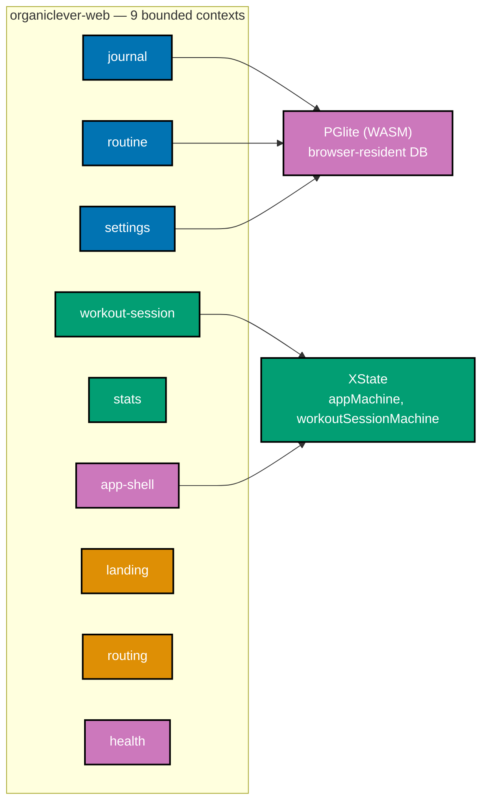
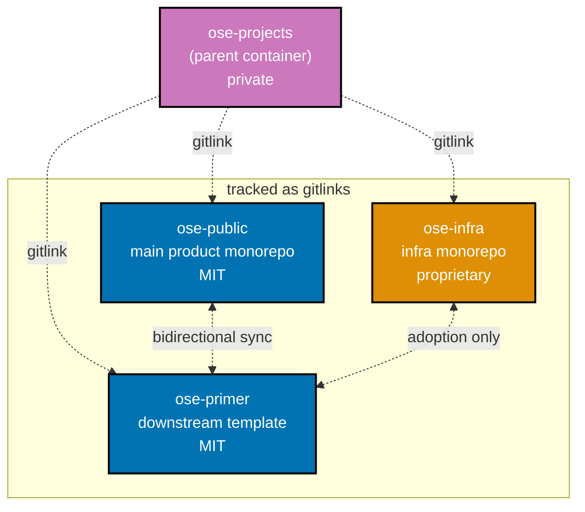

Five weeks ago we said the polyglot experiment was over and the focus was narrowing to ship. The narrowing went further than we expected. The F# backend that was the chosen production stack is now an empty scaffold. OrganicLever's data layer moved into the browser. The eleven demo backends that defined the previous update no longer live in this repo at all. The single repository that held everything in Phase 0 became a parent container tracking three sibling repositories. And the FSL-1.1-MIT license—introduced four weeks ago with a long rationale—was reverted to MIT after a strategic reassessment.

This update covers 1,346 commits across four repositories between 2026-04-05 19:55 +07 and 2026-05-10 20:00 +07. Most of those commits are not new features. They are the work of cutting things apart cleanly: extracting demo apps without losing history, splitting infrastructure without breaking automation, restructuring an application's bounded contexts without losing the test suite, and enforcing the new conventions through tooling rather than discipline.

## License: MIT, Reverted From FSL-1.1-MIT

On 2026-04-22—seventeen days after the previous update introduced FSL-1.1-MIT—the project reverted to MIT. The reasoning is documented in [`docs/explanation/software-engineering/licensing/mit-license-rationale.md`](https://github.com/wahidyankf/ose-public/blob/main/docs/explanation/software-engineering/licensing/mit-license-rationale.md) on the public repo. The previous post was edited inline with a notice marking that section as a historical record.

`ose-public` is MIT throughout. `ose-primer`—the new downstream template described below—is also MIT throughout. `ose-infra`, in contrast, migrated to a proprietary license on 2026-04-13. The split is intentional: code intended for public reuse stays MIT; the operational infrastructure that runs the platform stays private.

## OrganicLever: Pivot to Local-First

The previous update declared F#/Giraffe as the chosen backend and Next.js + Effect-TS as the chosen web frontend. The Effect-TS half held. The F# backend did not.

On 2026-04-21, OrganicLever pivoted to local-first mode. The data layer moved out of a network-attached PostgreSQL database and into the browser, using [PGlite](https://pglite.dev/) (a WASM build of PostgreSQL) loaded dynamically into Next.js. Authentication, OAuth, JWT plumbing, server-side schema migrations, and the entire authentication Gherkin suite were dropped from `organiclever-be` over the course of 2026-04-26. The F# project still exists in `apps/organiclever-be/`—the build still runs, the tests still pass—but it has no entities, no auth, no domain logic. It is a kept-warm scaffold while the local-first model is exercised.

What replaced it on the client is substantial:

- **PGlite runtime** with shared initialization, dynamic import, and test-stable timeouts under coverage measurement
- **Phase 0 journal foundation**: domain types, stores, seed data, i18n, stats helpers, and a v2 migration on top of the prior provisional storage
- **Journal UI**: `AddEntryButton`, `EntryFormSheet`, `JournalList`, `EntryCard`, plus reading/learning/meal/focus/custom entry loggers
- **App shell at `/app`**: `AppRoot` replacing the provisional `JournalPage`, with `TabBar`, `SideNav`, an `appMachine` (XState), and routed sub-screens for `EditRoutine`, `History`, `Progress`, `Settings`, `WorkoutScreen`, and `FinishScreen`
- **Workout session**: `workoutSessionMachine` orchestrating the active workout flow
- **PWA basics**: `manifest.json` and Apple meta tags
- **Landing page** at `organiclever-web` with CTA buttons routing into `/app`

The promotional landing site (`www.organiclever.com`) and the journal app share a single Next.js project. The CTA on the landing page navigates into the local-first app directly—no separate deployment, no cross-domain handoff.

### Nine Bounded Contexts

The local-first pivot was the trigger to restructure `organiclever-web` along DDD lines. Between 2026-05-02 and 2026-05-03, the codebase was reorganized into nine bounded contexts under `apps/organiclever-web/src/contexts/`:

```
contexts/
├── app-shell/        application, presentation
├── health/           infrastructure
├── journal/          application, domain, infrastructure, presentation
├── landing/          presentation
├── routine/          application, domain, infrastructure, presentation
├── routing/          presentation
├── settings/         application, domain, infrastructure, presentation
├── stats/            application, domain, presentation
└── workout-session/  application, domain, presentation
```

Each context has the layers it actually uses—not every context has all four. ESLint module-boundary rules were flipped from warning to error so cross-context imports must go through a published API. Coverage thresholds for `organiclever-web` were raised to 75% across all metrics on 2026-05-06. The status remains explicitly Pre-Alpha.



### C4 + DDD Across Web Apps

The DDD restructure isn't just `organiclever-web`. The same C4 + DDD specs format—bounded-context registries, ubiquitous-language glossaries, API slug ownership, and i18n bounded-context ownership—was adopted in `oseplatform-web`, `ayokoding-web`, and `wahidyankf-web` between 2026-05-09 and 2026-05-10. `rhino-cli` gained matching `ddd bc validate` and `ddd ul validate` subcommands that enforce structural and glossary parity between specs and code; the rhino-cli section below covers the validator design.

## Three-Repo Split

Phase 0 and early Phase 1 lived in a single repository. As of this period, the codebase is four cooperating Git repositories:



- **`ose-public`** — the main product monorepo. Public on GitHub, MIT. Hosts `organiclever-*`, `ayokoding-web`, `oseplatform-web`, `wahidyankf-web`, and the polyglot CLI tools `rhino-cli`, `ayokoding-cli`, `oseplatform-cli`. 705 commits this period.
- **`ose-infra`** — operational infrastructure. Forked from `ose-public` and now distinct, private, proprietary-licensed. Hosts the self-hosted GitHub Actions runner stack, `coralpolyp` (a new app described below), and infrastructure-only governance. 172 commits.
- **`ose-primer`** — a public, MIT-licensed downstream template carrying the polyglot demo apps, governance scaffolding, AI agents and skills, and rhino-cli itself for teams to bootstrap their own OSE-style monorepos. New as a distinct entity this period. 258 commits.
- **`ose-projects`** — the parent container. Created on 2026-04-06—one day after the previous update. Tracks the three subrepos as bare gitlinks (mode `160000`, no `.gitmodules`). 211 commits.

### `ose-projects` Was Brand New

`ose-projects` did not exist when the previous update was published. Its root commit is 2026-04-06 21:15:09 +0700, and everything in it has been written since. The parent's job is orchestration: cross-repo plans, shared session settings (`additionalDirectories` for cross-repo file visibility from a single Claude Code or OpenCode session), generated-socials authoring (this update's LinkedIn companion will be drafted here), and bidirectional sync orchestration with `ose-primer`.

The parent grew its own AI agent set—11 in total: `plan-maker`, `plan-checker`, `plan-fixer`, `plan-executor`, `plan-execution-checker`, `repo-rules-maker`, `repo-rules-checker`, `repo-rules-fixer`, `repo-ose-primer-adoption-maker`, `repo-ose-primer-propagation-maker`, and `social-monthly-update-maker`. None of these existed before 2026-04-06. The parent also adopted `rhino-cli` and `golang-commons` from `ose-primer` on 2026-04-26 so the parent's own pre-commit and pre-push hooks run the same validators as the subrepos.

### `ose-infra` Diverging

`ose-infra` shares its root commit with `ose-public`—same hash, same date in November 2025—because it was forked from `ose-public`. The divergence accelerated this period:

- **Self-hosted GitHub Actions runner** (`gha-runner`): multi-arch Docker image, `launchd` supervisor, per-container resource caps (2 CPU / 8 GB), concurrency tuning (default 3), stale-runner cleanup, JIT registration. Most of `ose-infra`'s 15 `fix(ci)` commits this period are runner stability work—port conflicts, BuildKit toggles, timeout calibration, e2e cleanup. The runner now serves `ose-infra`'s CI exclusively; `ose-public` still uses GitHub-hosted `ubuntu-latest`.
- **`coralpolyp`** — a new app inside `ose-infra`. Rust/Axum backend with a health endpoint, Next.js + Effect TS frontend, Playwright BE+FE E2E suites, Docker dev and CI stacks, and C4 + Gherkin + OpenAPI specs. Scaffolded 2026-04-13. The product purpose is intentionally not in scope for a public update.
- **License**: migrated to proprietary on 2026-04-13.
- **Demo apps removed**: all `a-demo-*` apps, specs, and infra were removed from `ose-infra` on 2026-04-14.

## Polyglot Demos Extracted to `ose-primer`

The eleven demo backends, three demo frontends, and one fullstack demo that defined the previous update have been extracted from `ose-public` to `ose-primer`. The extraction was tracked under the `ose-primer-separation` plan (now archived) and verified via a parity gate before deletion from `ose-public`.

What moved (renamed in two steps: 2026-04-18 `a-demo-*` → `demo-*` during extraction; 2026-04-26 `demo-*` → `crud-*` to clarify CRUD family scope):

```
ose-primer/apps/
├── crud-be-clojure-pedestal      crud-be-elixir-phoenix
├── crud-be-csharp-aspnetcore     crud-be-fsharp-giraffe
├── crud-be-golang-gin            crud-be-java-springboot
├── crud-be-java-vertx            crud-be-kotlin-ktor
├── crud-be-python-fastapi        crud-be-rust-axum
├── crud-be-ts-effect             crud-be-e2e
├── crud-fe-dart-flutterweb       crud-fe-ts-nextjs
├── crud-fe-ts-tanstack-start     crud-fe-e2e
├── crud-fs-ts-nextjs             rhino-cli
ose-primer/libs/
├── clojure-openapi-codegen       elixir-cabbage
├── elixir-gherkin                elixir-openapi-codegen
├── golang-commons                ts-ui
├── ts-ui-tokens
```

`ose-public/libs/` is correspondingly smaller: `clojure-openapi-codegen`, `golang-commons`, `hugo-commons`, `ts-ui`, `ts-ui-tokens`. The three Elixir libraries that existed only to support the polyglot demos moved to `ose-primer` along with the demos themselves.

### Bidirectional Sync, Asymmetric Rules

`ose-public` and `ose-primer` are kept aligned through two AI agents (`repo-ose-primer-propagation-maker` outbound, `repo-ose-primer-adoption-maker` inbound), a shared skill (`repo-syncing-with-ose-primer`), and a classifier convention (`governance/conventions/structure/ose-primer-sync.md`) that labels every parent path as `propagate`, `adopt`, `bidirectional`, or `neither`.

The publish path is intentionally asymmetric. `ose-public` and `ose-infra` follow Trunk-Based Development: direct commits to `main` are the default, draft PRs are optional for review-warranting changes. `ose-primer` is non-negotiable PR-only: no direct commits to `main`, ever. Apply-mode propagation opens a draft PR against `wahidyankf/ose-primer:main` and never bypasses that gate. The asymmetry exists because `ose-primer` is a template—anyone can clone it, and a clean linear history matters more there than developer velocity.

`ose-infra` ↔ `ose-primer` is adoption-only for now: `ose-infra` can pull generic improvements down from `ose-primer`, but does not push back. A future plan may make it bidirectional if and when justified.

## `wahidyankf-web` Joins the Monorepo

A fourth web app entered `ose-public` on 2026-04-19: [`wahidyankf-web`](https://www.wahidyankf.com/), Wahidyan Kresna Fridayoka's personal portfolio. Scaffolded as an Nx app, ported from an external source, wired to a `prod-wahidyankf-web` environment branch with a Vercel deploy workflow and a dedicated `apps-wahidyankf-web-deployer` agent. Playwright-BDD E2E tests live in `wahidyankf-web-fe-e2e`. Several reusable React components—`HighlightText`, `ScrollToTop`, `SearchComponent`, `ThemeToggle`—were migrated out of `wahidyankf-web` into `libs/ts-ui` on 2026-04-23 so the other web apps can use them too.

The portfolio itself is at <https://www.wahidyankf.com/>. Content was synced with the LinkedIn profile on the same day as the scaffold.

## `ts-ui`: One Shared Component Library, Two Token Systems

`libs/ts-ui` and `libs/ts-ui-tokens` existed before this period—they were introduced in late March—but most of their components didn't. The April-21 cluster added:

- `Sheet`, `AppHeader`, `Toggle`, `Icon` (with 34 OrganicLever SVG icons)
- `HuePicker`, `InfoTip`, `StatCard`, `TabBar`, `SideNav`
- Alert variants for `success`, `warning`, `info`
- Button variants for `teal`, `sage`, plus an `xl` size

April 25 added `Textarea` and `Badge`. April 23 brought in the four migrated components from `wahidyankf-web`.

`ts-ui-tokens` gained an OrganicLever-specific warm OKLCH token system on 2026-04-21, and `organiclever-web` was wired to use it along with Nunito and JetBrains Mono fonts the same day. `oseplatform-web`, `ayokoding-web`, and `wahidyankf-web` continue to use the existing token set.

## `rhino-cli`: From Scaffolding Helper to Governance Engine

`rhino-cli` (the Repository Hygiene & INtegration Orchestrator) absorbed most of the new automation work this period. It now runs as a pre-commit and pre-push validator across all four repositories (parent and three subrepos) and gates the PR quality flow on GitHub.

Capabilities added since 2026-04-05:

- **`docs validate-mermaid`** — Mermaid diagram extractor + parser + graph + validator + reporter. Detects subgraph density violations, applies width constraints, scans `docs/`, `plans/`, `governance/`, `apps/*/content/`, and `apps/*/README.md`. Has `--staged-only` and `--changed-only` modes.
- **`agents validate-naming` / `workflows validate-naming`** — enforce the agent and workflow filename conventions (`<scope>(-<qualifier>)*-<role>` and `<scope>(-<qualifier>)*-<type>`).
- **`ddd bc validate` / `ddd ul validate`** — DDD structural and ubiquitous-language glossary parity between `specs/` and code. Wired into `test:quick` for `organiclever-web` and three other web apps. (Restructured under a `ddd` subcommand on 2026-05-09.)
- **`specs validate-tree` / `validate-counts` / `validate-links` / `validate-adoption`** — specs structure and content validators with drift placeholders.
- **`governance vendor-audit`** — scans `governance/` for vendor-specific terminology that violates the [vendor-independence convention](https://github.com/wahidyankf/ose-public/blob/main/governance/conventions/structure/governance-vendor-independence.md). 229 violations were remediated as part of `ose-primer`'s adoption of the convention; `ose-public` and `ose-projects` followed.
- **`validate:cross-vendor-parity`** — enforces that AI agent definitions and tool permissions stay aligned across `.claude/agents/` and `.opencode/agents/` after the OpenCode Go provider migration.
- **`doctor`** improvements — pins `golangci-lint`, enforces strict Go linting (`godot` + `revive` linters added on 2026-05-10), expands tool verification coverage.
- **`env init` / `env backup` / `env restore`** had landed previously; `--scope minimal` and `--fix --dry-run` continued to evolve.

Three new repository-wide AI agent triplets back the validators: `repo-rules-maker/checker/fixer`, `repo-parity-checker/fixer`, and the two `repo-ose-primer-*-maker` agents. The validators run in iterative quality-gate workflows that loop check-fix-verify until two consecutive zero-finding passes (default `max-iterations=7`, strict mode).

## OpenCode and Tooling

The repo maintains dual compatibility with Claude Code (primary) and OpenCode (secondary, auto-synced). Two infrastructure changes this period:

- **OpenCode Go provider migration** — `.opencode/agents/*.md` model frontmatter migrated from generic OpenCode IDs to `opencode-go/minimax-m2.7` (planning- and execution-grade) and `opencode-go/glm-5` (fast). `rhino-cli`'s `ConvertModel` translator and the `claude-to-opencode` sync target were updated to match. The plural canonical path `.opencode/agents/` (not legacy `.opencode/agent/`) is now enforced.
- **`caveman` token compression** — installed 2026-05-03 as an OpenCode skill. Compresses agent prose output ~75% via terse caveman-speak. Stacks with RTK (CLI output filtering) for compounded savings without affecting code, commit messages, or PR descriptions, which are emitted in normal English.

## `ayokoding-web`: New Tutorials

`ayokoding-web` continued its educational mission with several new tutorial series:

- **XState v5 by-example** (2026-04-29) — 80 examples, 42 diagrams
- **7 new by-example tutorials** (2026-04-29) — 595 annotated examples in total across the batch
- **Compilers and Interpreters section** (2026-04-20) — including a six-part Lisp interpreter in Go
- **OOP polyglot + FP F# tutorials** (2026-05-09) — replacing the previous DDD by-example track with a more explicit cross-paradigm comparison

The tutorial production pattern is industrialized through the `apps-ayokoding-web-by-example-maker/checker/fixer` and `apps-ayokoding-web-in-the-field-maker/checker/fixer` agent triplets, which were used to draft and validate the new content.

## Conventions Added

Several governance conventions were added or formalized this period across the three relevant repos:

- **Test-Driven Development** (`ose-public`, propagated to `ose-primer` 2026-05-04) — Red → Green → Refactor required for code changes; plan delivery checklists must express code items as TDD-shaped steps.
- **No-date-metadata** (`ose-primer` 2026-04-25, adopted to `ose-public`) — strip manual `lastUpdated`/date fields from non-website governance files; rely on git history.
- **Git-push-default** (`ose-primer` 2026-04-25, propagated) — direct push to `main` for `ose-public` and `ose-infra`; PR-only for `ose-primer`.
- **Plan anti-hallucination** (`ose-public` 2026-05-03, adopted to `ose-primer` 2026-05-04) — plans must cite concrete files, line numbers, and grep-able anchors rather than invented file paths.
- **Worktree-path** — overrides the upstream coding-agent default. Worktrees in `ose-public` land at `worktrees/<name>/` (repo root); `ose-projects`, `ose-infra`, and `ose-primer` worktrees land at `<repo>/.claude/worktrees/<name>/`. Routed by a repo-local `WorktreeCreate` hook.
- **Quality-gate-defaults** (`ose-infra` 2026-04-26, adopted) — strict mode and `max-iterations=7` are the defaults; lax/normal/ocd are explicit overrides.
- **Post-push CI verification** — after pushing app or lib code to `origin main`, trigger relevant GitHub workflows and verify they pass before declaring work done.
- **CI-monitoring rate-limit** — check status every 3–5 minutes via background wakeup; back off ~35 minutes on HTTP 403; never tight-loop poll.

## Numerical Snapshot

What changed in five weeks:

- **Repositories**: 1 self-contained monorepo → 4 cooperating repos (parent + 3 subrepos)
- **Commits this period**: 705 (`ose-public`) + 172 (`ose-infra`) + 258 (`ose-primer`) + 211 (`ose-projects`) = 1,346 total
- **`ose-public` apps**: dropped 11 demo backends + 3 demo frontends + 1 fullstack demo (now in `ose-primer`); added `wahidyankf-web` + `wahidyankf-web-fe-e2e`
- **`ose-public` libs**: 8 → 5 (Elixir trio relocated to `ose-primer`)
- **`ose-infra` apps**: added `coralpolyp` (Rust/Axum BE + Next.js/Effect-TS FE + BE/FE E2E)
- **`organiclever-web` bounded contexts**: 0 → 9 (DDD restructure)
- **`organiclever-be` scope**: auth + OAuth + JWT + initial-schema migration + entities → empty scaffold (kept warm)
- **OrganicLever data layer**: PostgreSQL (server) → PGlite (browser, WASM)
- **License (`ose-public`, `ose-primer`)**: FSL-1.1-MIT → MIT
- **License (`ose-infra`)**: MIT → proprietary
- **`rhino-cli` validators added**: `docs validate-mermaid`, `agents validate-naming`, `workflows validate-naming`, `ddd bc validate`, `ddd ul validate`, `specs validate-tree/counts/links/adoption`, `governance vendor-audit`, `validate:cross-vendor-parity`
- **Parent AI agents**: 0 → 11 (5 plan-family, 3 repo-rules-family, 2 ose-primer-sync makers, 1 social-monthly-update-maker)
- **`ts-ui` components added**: 15 (`Sheet`, `AppHeader`, `Toggle`, `Icon`, `HuePicker`, `InfoTip`, `StatCard`, `TabBar`, `SideNav`, `Textarea`, `Badge`, `HighlightText`, `ScrollToTop`, `SearchComponent`, `ThemeToggle`) plus alert/button variants

## What's Next

Five lines of work continue over the next month:

- **Codebase stabilization, including BDD and DDD hardening** — the past five weeks introduced large structural change: local-first pivot, three-repo split, demo extraction, DDD restructure, and a new web app. The next month is biased toward consolidation rather than expansion: tightening edges, fixing flake, retiring scaffolding, and letting the new structure settle before adding more on top. BDD and DDD specifically need their own hardening pass: closing remaining Gherkin step coverage gaps, sharpening bounded-context boundaries and ubiquitous-language glossaries across all four web apps, and tightening the `rhino-cli` validators (`spec-coverage`, `ddd bc validate`, `ddd ul validate`, `specs validate-tree/counts/links/adoption`) so spec-vs-code drift is caught at pre-push rather than later.
- **More development experiments using Chinese LLM models** — the OpenCode Go provider migration brought MiniMax M2.7 and GLM 5 into the agent loop alongside the existing Anthropic-backed Claude Code path. The next month extends that exploration: comparing model output quality on real plan execution, validator iteration loops, and code generation; calibrating which capability tier each model fits; and stress-testing cost and latency in everyday workflows.
- **OrganicLever local-first feature build-out** — workout sessions, journal v3, history and progress views, settings, sync (eventually), and offline-first edge cases. Pre-Alpha will become Alpha when the daily flow is usable end-to-end.
- **`ose-infra` continuous deployment** — the staging branch already auto-deploys; promotion to production environment branches is the next step. The previous update flagged CD as the priority and that has not changed; the local-first pivot consumed time that would otherwise have gone to it.
- **`ose-primer` template hardening** — remaining classifier rows to settle, `pdf-chat-apps` demo family already in `plans/in-progress/`, and template parity checks running on every propagation.

Every commit visible on [GitHub](https://github.com/wahidyankf/ose-public). `ose-primer` at <https://github.com/wahidyankf/ose-primer>. Updates published here on oseplatform.com, with educational content on [ayokoding.com](https://ayokoding.com) and the personal portfolio at [wahidyankf.com](https://www.wahidyankf.com/).

We continue to publish platform updates roughly monthly. Subscribe to the RSS feed or check back as Phase 1 continues, Insha Allah.
