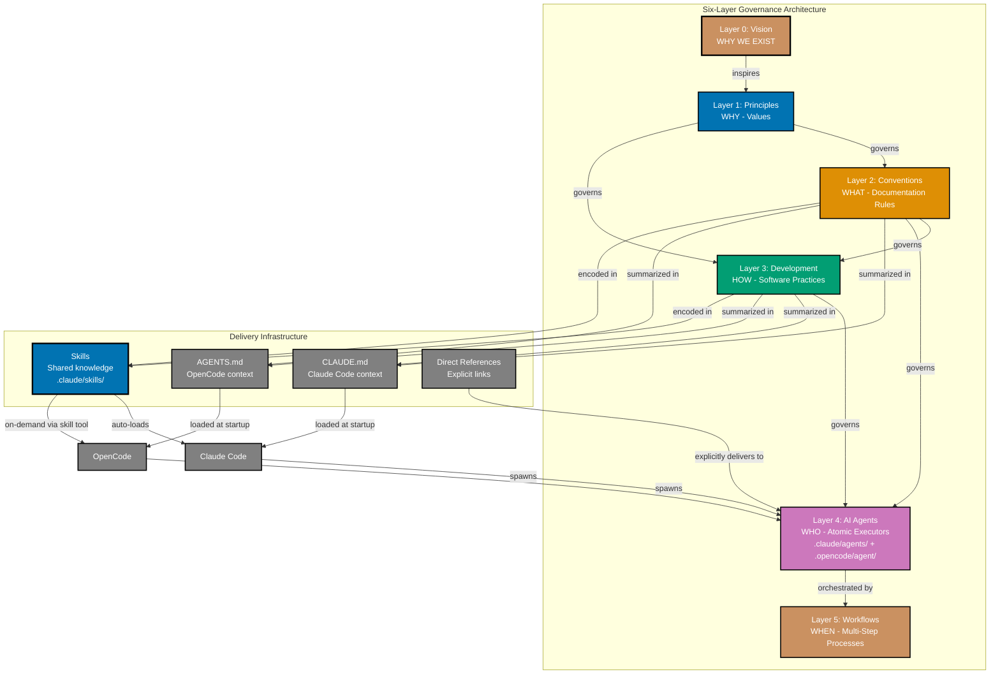

# Explanation

**Understanding-oriented documentation** that provides background, context, and conceptual knowledge about the open-sharia-enterprise project.

## What is Explanation Documentation?

Per the [Diátaxis framework](./rules/conventions/meta/ex-ru-co-me__diataxis-framework.md), Explanation documentation:

- **Deepens understanding** of concepts, design decisions, and systems
- **Answers "why?"** questions and provides context
- **Clarifies background** and alternative approaches
- **Discusses trade-offs** and decision rationale

This is distinct from:

- **Tutorials** (learning by doing)
- **How-to Guides** (solving specific problems)
- **Reference** (technical specifications)

## Documentation Scope

This directory contains conceptual documentation across multiple areas:

- **Repository Governance** - How we organize, validate, and enforce standards
- **Project Architecture** - System design and technical decisions
- **Domain Concepts** - Shariah-compliant enterprise principles and Islamic business foundations
- **Technical Background** - Technologies, patterns, and frameworks used in the project

---

## 🏛️ Repository Governance

### Six-Layer Governance Architecture

The repository follows a **six-layer governance architecture** where each layer builds on the foundation of the layer above. See [Repository Governance Architecture](./ex-ru__repository-governance-architecture.md) for comprehensive explanation.



**Documentation Layers**:

**All governance layers are now organized under [Rules](./rules/README.md)**:

0. **[Vision](./rules/vision/README.md)** (WHY WE EXIST) - Foundational purpose that **inspires** everything
   - WHY the project exists, WHAT change we seek
   - Nearly immutable - changes only if mission fundamentally shifts
   - **Vision**: Democratize Shariah-compliant enterprise, making ethical Islamic business solutions accessible to everyone

1. **[Core Principles](./rules/principles/README.md)** (WHY) - Foundational values that **govern** everything
   - The WHY behind our decisions (serve the vision)
   - 10 principles across 3 categories (General, Content, Software Engineering)
   - Examples: Simplicity Over Complexity, Accessibility First, Documentation First, Automation Over Manual, Explicit Over Implicit, Immutability Over Mutability, Pure Functions Over Side Effects, Reproducibility First, No Time Estimates, Progressive Disclosure
   - Each principle includes "Vision Supported" section
   - **Role**: Governance layer - all lower layers must align with these principles

2. **[Conventions](./rules/conventions/README.md)** (WHAT) - How we **write and structure documentation**
   - Documentation format, style, and organization rules implementing principles
   - File naming, linking, content quality implementing principles
   - Applies to: docs/, Hugo content, plans/, README files
   - **Role**: Documentation rules layer - implements principles in concrete WHAT standards
   - **Implemented by**: AI agents (docs**maker, docs**checker, etc.)

3. **[Development](./rules/development/README.md)** (HOW) - How we **develop software and systems**
   - Software development practices implementing principles
   - Build processes, tooling, workflows implementing principles
   - Applies to: source code, Hugo themes/layouts, build systems, AI agents
   - **Role**: Software practices layer - implements principles in concrete HOW standards
   - **Implemented by**: AI agents (swe**hugo**developer, plan\_\_executor, etc.) and automation (git hooks, build tools)

4. **AI Agents** (WHO) - Automated implementers in `.claude/agents/`
   - Enforce conventions from layer 2 (documentation rules)
   - Enforce practices from layer 3 (software standards)
   - Validate compliance and apply fixes
   - **Role**: Implementation and enforcement layer - ensures principles are followed

5. **[Workflows](./rules/workflows/README.md)** (WHEN) - Multi-step orchestrated processes
   - Compose AI agents into reusable sequences
   - Define goals, steps, termination criteria
   - Support sequential, parallel, conditional execution
   - **Role**: Orchestration layer - coordinates agents to achieve complex goals
   - **Example**: Maker-Checker-Fixer workflow orchestrates creation, validation, fixing

**Delivery Infrastructure** (not governance layers):

- **CLAUDE.md / AGENTS.md** - Project instructions loaded at startup (Claude Code / OpenCode)
- **[Skills](../.claude/skills/README.md)** - Progressive knowledge packages that serve agents (18 shared Skills)
- **Direct References** - Explicit links to convention docs in agent prompts

These deliver knowledge to agents but don't govern them. Skills SERVE agents with on-demand depth, they don't enforce rules.

**Complete Architecture**: See [Repository Governance Architecture](./ex-ru__repository-governance-architecture.md) for layer characteristics, delivery infrastructure details, complete traceability examples, usage guidance, and verification methods.

## 🧪 The Layer Test: Where Does My Document Belong?

Use these questions to determine the correct directory for a new document:

### Principles Test

**Question**: Can you ask "**WHY do we value this?**" about the content?

- ✅ **YES** → Place in `rules/principles/` - It's a foundational value
- ❌ **NO** → It's not a principle, continue to next test

**Examples**:

- "Why do we value simplicity?" → Principle (Simplicity Over Complexity)
- "Why do we value accessibility?" → Principle (Accessibility First)
- "How do I format markdown?" → Not a principle (it's a convention)

### Conventions Test

**Question**: Can you ask "**WHAT are the documentation rules?**" about the content?

- ✅ **YES** → Place in `rules/conventions/` - It's a documentation standard
- ❌ **NO** → It's not a convention, continue to next test

**Examples**:

- "What are the file naming rules?" → Convention (File Naming)
- "What are the linking standards?" → Convention (Linking)
- "How do I develop Hugo themes?" → Not a convention (it's a development practice)

### Development Test

**Question**: Can you ask "**HOW do we develop software?**" about the content?

- ✅ **YES** → Place in `rules/development/` - It's a software practice
- ❌ **NO** → It's not a development practice, continue to next test

**Examples**:

- "How do I commit code?" → Development (Commit Messages)
- "How do I develop Hugo themes?" → Development (Hugo Development)
- "Why do we automate?" → Not a development practice (it's a principle)

### Workflows Test

**Question**: Can you ask "**WHEN do we orchestrate multiple agents?**" about the content?

- ✅ **YES** → Place in `rules/workflows/` - It's a multi-step process
- ❌ **NO** → It doesn't belong in explanation/ - consider how-to/ or reference/

**Examples**:

- "When do we run maker, checker, and fixer in sequence?" → Workflow (Maker-Checker-Fixer)
- "When do we validate all documentation?" → Workflow (Full Docs Validation)
- "How does a single agent work?" → Not a workflow (it's about agents, covered in development/)

### Quick Decision Tree

```
Is it about WHY we value something?
├─ YES → rules/principles/
└─ NO → Is it about WHAT documentation rules to follow?
    ├─ YES → rules/conventions/
    └─ NO → Is it about HOW to develop software?
        ├─ YES → rules/development/
        └─ NO → Is it about WHEN to orchestrate multiple agents?
            ├─ YES → rules/workflows/
            └─ NO → Wrong category (try how-to/ or reference/)
```

---

## 📋 Documentation Index

### Repository Governance

**Core Architecture:**

- [Repository Governance Architecture](./ex-ru__repository-governance-architecture.md) - Comprehensive guide to the six-layer architecture (Vision → Principles → Conventions → Development → Agents → Workflows)

**Governance Layers:**

- **[Rules](./rules/README.md)** - All governance layers organized together
  - [Vision](./rules/vision/README.md) - Layer 0: Foundational purpose (WHY we exist)
  - [Core Principles](./rules/principles/README.md) - Layer 1: Foundational values guiding all conventions and development
  - [Conventions](./rules/conventions/README.md) - Layer 2: Documentation writing and organization standards
  - [Development](./rules/development/README.md) - Layer 3: Software development practices and workflows
  - [Workflows](./rules/workflows/README.md) - Layer 5: Multi-step orchestrated processes composing AI agents

### Project Architecture

_Documentation for overall system architecture and design decisions to be added as the project evolves._

### Domain Concepts

_Documentation for Shariah-compliant enterprise principles and Islamic business foundations to be added as the project evolves._

### Technical Background

_Documentation for key technologies, patterns, and frameworks to be added as the project evolves._

---

**Last Updated**: 2026-01-04
