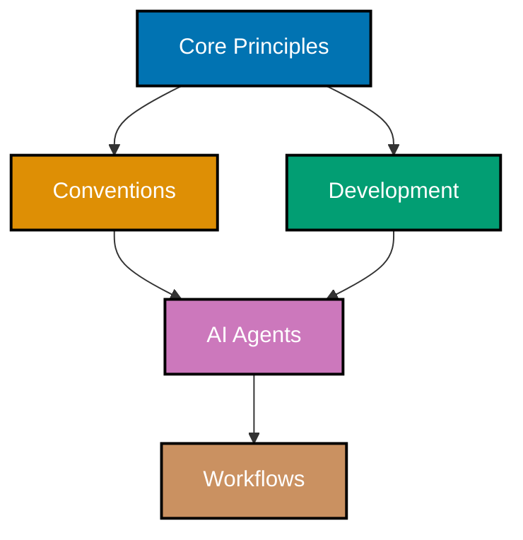

# Explanation

Conceptual documentation for the open-sharia-enterprise project. These documents provide context, deep dives, and understanding of how systems work and why design decisions were made.

## 🎯 Understanding the Hierarchy



**Documentation Layers** (Hierarchy):

1. **[Core Principles](./principles/README.md)** (WHY) - Foundational values that **govern** everything
   - The **why** behind our decisions
   - Immutable principles that conventions and development must respect
   - Six principles: Explicit Over Implicit, Accessibility First, Simplicity Over Complexity, Automation Over Manual, Progressive Disclosure, No Time Estimates
   - **Role**: Governance layer - all lower layers must align with these principles

2. **[Conventions](./conventions/README.md)** (WHAT) - How we **write and structure documentation**
   - Documentation format, style, and organization rules
   - Markdown writing standards implementing principles
   - File naming, linking, and content quality implementing principles
   - Applies to: docs/, Hugo content, plans/, README files
   - **Role**: Documentation rules layer - implements principles in concrete WHAT standards
   - **Implemented by**: AI agents (docs-maker, docs-checker, etc.)

3. **[Development](./development/README.md)** (HOW) - How we **develop software and systems**
   - Software development practices implementing principles
   - Build processes, tooling, and workflows implementing principles
   - Testing, deployment, and code management implementing principles
   - Applies to: source code, Hugo themes/layouts, build systems, AI agents
   - **Role**: Software practices layer - implements principles in concrete HOW standards
   - **Implemented by**: AI agents (hugo-developer, plan-executor, etc.) and automation (git hooks, build tools)

4. **AI Agents** (WHO) - Automated implementers in `.claude/agents/`
   - Enforce conventions from layer 2 (documentation rules)
   - Enforce practices from layer 3 (software standards)
   - Validate compliance and apply fixes
   - **Role**: Implementation and enforcement layer - ensures principles are followed

5. **[Workflows](./workflows/README.md)** (WHEN) - Multi-step orchestrated processes
   - Compose AI agents into reusable sequences
   - Define goals, steps, and termination criteria
   - Support sequential, parallel, and conditional execution
   - Include human approval checkpoints
   - **Role**: Orchestration layer - coordinates agents to achieve complex goals
   - **Example**: Maker-Checker-Fixer workflow orchestrates creation, validation, and fixing

**Traceability**: Every rule should trace through the hierarchy: Principle (WHY) → Convention/Practice (WHAT/HOW) → Agent (WHO) → Workflow (WHEN). See [Core Principles](./principles/README.md) for complete traceability examples.

## 🧪 The Layer Test: Where Does My Document Belong?

Use these questions to determine the correct directory for a new document:

### Principles Test

**Question**: Can you ask "**WHY do we value this?**" about the content?

- ✅ **YES** → Place in `principles/` - It's a foundational value
- ❌ **NO** → It's not a principle, continue to next test

**Examples**:

- "Why do we value simplicity?" → Principle (Simplicity Over Complexity)
- "Why do we value accessibility?" → Principle (Accessibility First)
- "How do I format markdown?" → Not a principle (it's a convention)

### Conventions Test

**Question**: Can you ask "**WHAT are the documentation rules?**" about the content?

- ✅ **YES** → Place in `conventions/` - It's a documentation standard
- ❌ **NO** → It's not a convention, continue to next test

**Examples**:

- "What are the file naming rules?" → Convention (File Naming)
- "What are the linking standards?" → Convention (Linking)
- "How do I develop Hugo themes?" → Not a convention (it's a development practice)

### Development Test

**Question**: Can you ask "**HOW do we develop software?**" about the content?

- ✅ **YES** → Place in `development/` - It's a software practice
- ❌ **NO** → It's not a development practice, continue to next test

**Examples**:

- "How do I commit code?" → Development (Commit Messages)
- "How do I develop Hugo themes?" → Development (Hugo Development)
- "Why do we automate?" → Not a development practice (it's a principle)

### Workflows Test

**Question**: Can you ask "**WHEN do we orchestrate multiple agents?**" about the content?

- ✅ **YES** → Place in `workflows/` - It's a multi-step process
- ❌ **NO** → It doesn't belong in explanation/ - consider how-to/ or reference/

**Examples**:

- "When do we run maker, checker, and fixer in sequence?" → Workflow (Maker-Checker-Fixer)
- "When do we validate all documentation?" → Workflow (Full Docs Validation)
- "How does a single agent work?" → Not a workflow (it's about agents, covered in development/)

### Quick Decision Tree

```
Is it about WHY we value something?
├─ YES → principles/
└─ NO → Is it about WHAT documentation rules to follow?
    ├─ YES → conventions/
    └─ NO → Is it about HOW to develop software?
        ├─ YES → development/
        └─ NO → Is it about WHEN to orchestrate multiple agents?
            ├─ YES → workflows/
            └─ NO → Wrong category (try how-to/ or reference/)
```

## 📋 Contents

- [Core Principles](./principles/README.md) - Foundational principles guiding all conventions and development
- [Conventions](./conventions/README.md) - Documentation writing and organization standards
- [Development](./development/README.md) - Software development practices and workflows
- [Workflows](./workflows/README.md) - Multi-step orchestrated processes composing AI agents

---

**Last Updated**: 2025-12-23
