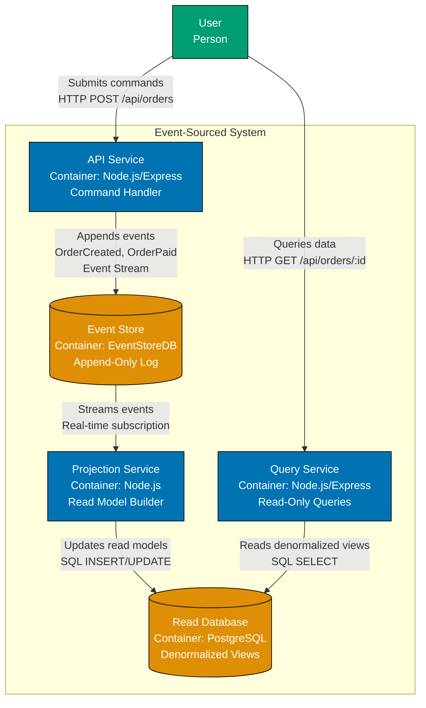
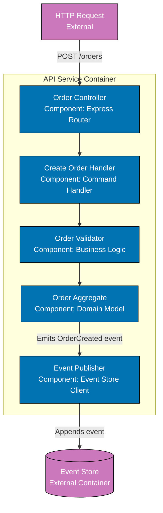
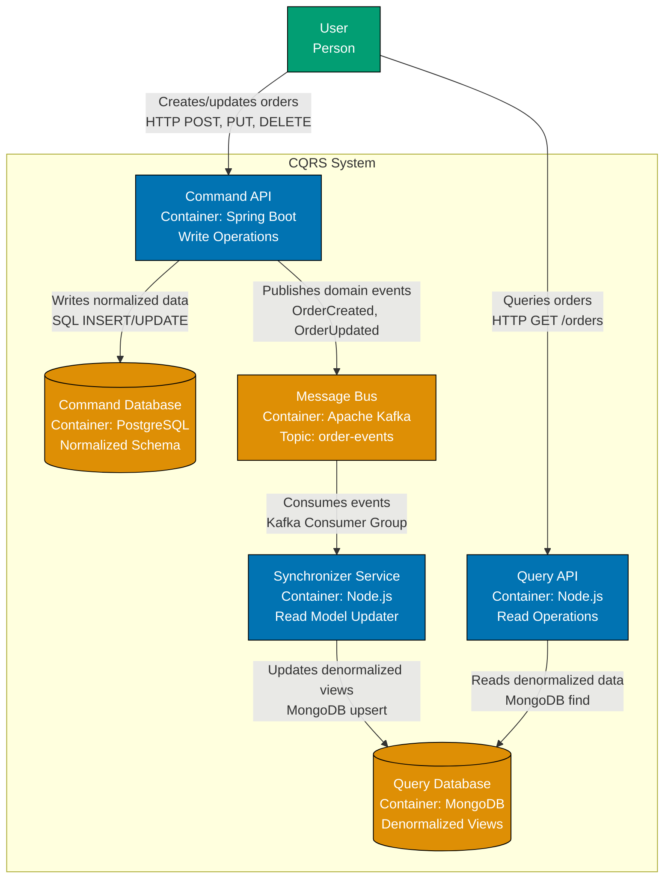
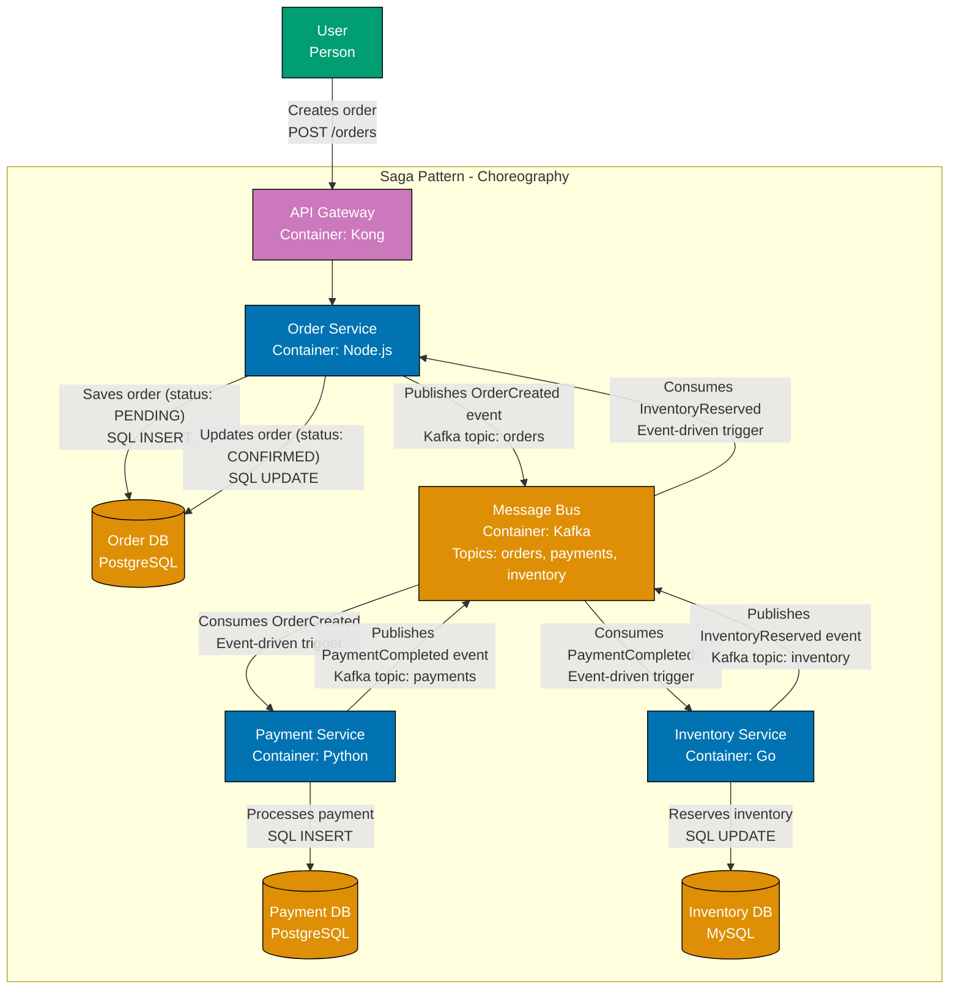
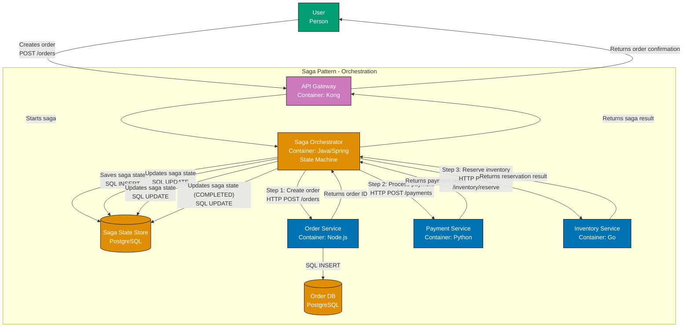
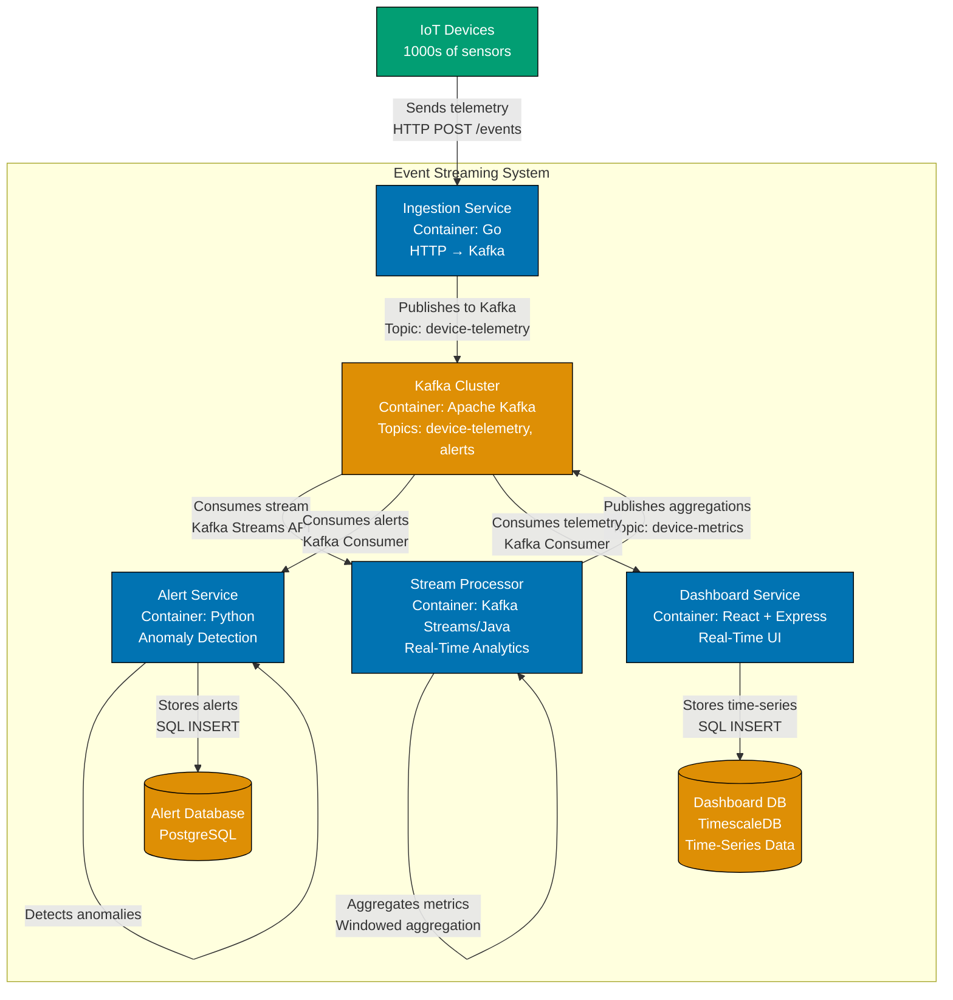
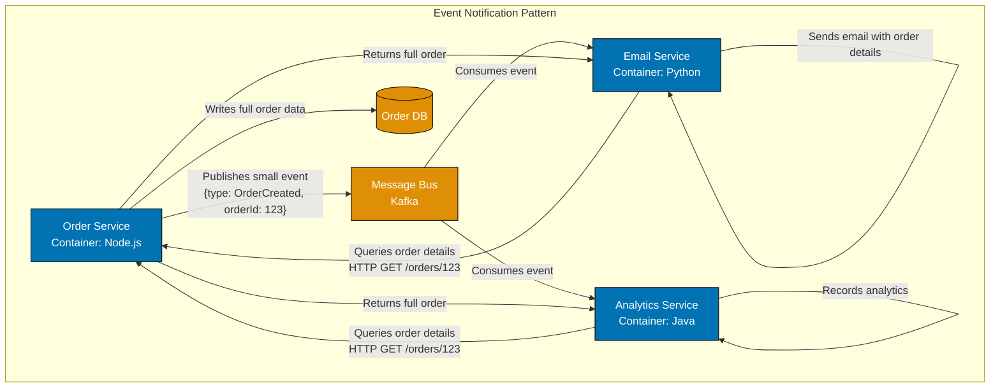
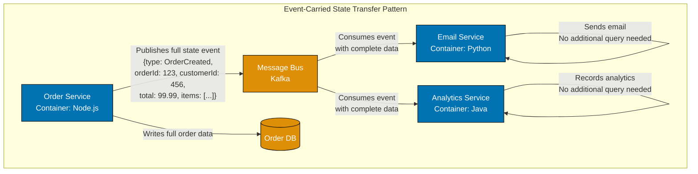

# C4 for Event-Driven Architectures

Comprehensive guide for applying C4 model to event-driven systems, including event sourcing, CQRS, saga patterns, and event streaming.

## Overview

Event-driven architectures (EDA) present unique challenges for C4 diagrams. Unlike request-response systems with clear synchronous flows, event-driven systems communicate asynchronously through events, making temporal relationships and data flow less obvious.

**Why Event-Driven Patterns Matter**:

- **Scalability**: Services can process events independently at their own pace
- **Decoupling**: Event publishers don't need to know about event consumers
- **Resilience**: Services can continue processing events even if other services are temporarily down
- **Flexibility**: New event consumers can be added without modifying publishers
- **Audit Trail**: Events naturally provide history of state changes

**Challenges for C4 Diagrams**:

- **Temporal Complexity**: Event order and timing crucial but hard to show in static diagrams
- **Indirect Relationships**: Services communicate through events, not direct calls
- **Message Broker Visibility**: Should message broker be a container or infrastructure?
- **Event vs. Command**: Different semantic meanings requiring distinct visualization
- **Eventual Consistency**: State synchronization across services not immediately obvious

This guide shows how to effectively represent event-driven patterns using C4 model diagrams.

## Event-Driven Patterns in C4 Levels

Event-driven architecture manifests differently at each C4 level. Understanding how to represent events at each zoom level ensures clear, actionable documentation.

**Level 1: System Context** - Events as System Interactions

At Context level, event-driven systems typically show external event sources and sinks:

- **External Event Publishers**: Systems that send events into your system (IoT devices, third-party webhooks, legacy systems)
- **External Event Consumers**: Systems that consume events from your system (analytics platforms, audit logs, downstream systems)
- **Event-Driven Integrations**: Asynchronous communication with external systems

**Example**: IoT platform receives device events, processes them, and publishes alerts to external monitoring systems.

**Level 2: Container** - Events as Inter-Container Communication

At Container level, show:

- **Message Broker**: Explicit container (Kafka, RabbitMQ, AWS SQS/SNS)
- **Event-Driven Services**: Services that publish and consume events
- **Event Stores**: Databases storing events (if event sourcing)
- **Read Models**: Separate databases for queries (if CQRS)

**Key Decision**: Show event broker as infrastructure or as explicit container? Recommend explicit container if broker is self-hosted (Kafka cluster), infrastructure if managed service (AWS EventBridge).

**Level 3: Component** - Events as Inter-Component Messages

At Component level, show:

- **Event Publishers**: Components that emit events
- **Event Consumers**: Components that handle events
- **Event Handlers**: Specific handler functions/classes for event types
- **Saga Orchestrators/Coordinators**: Components managing multi-step event-driven workflows

**Level 4: Code** - Events as Domain Objects

At Code level, show:

- **Event Classes**: Class diagrams showing event structure
- **Event Handlers**: Handler classes and their relationships
- **Aggregate Roots**: Domain objects that emit events (DDD pattern)

## Pattern 1: Event Sourcing

**Concept**:

Event sourcing stores state changes as a sequence of events rather than storing current state directly. Current state is derived by replaying all events.

**Key Characteristics**:

- Events are immutable - never deleted or modified
- Events stored in append-only event store
- Current state reconstructed by replaying events
- Complete audit trail of all state changes
- Time travel possible (replay events to any point)

**C4 Representation**:

### Container Diagram: Event Sourcing Architecture



**Diagram Explanation**:

- **API Service**: Receives commands (create order, pay order), validates, appends events to Event Store
- **Event Store**: Append-only log of all events (OrderCreated, OrderPaid, OrderShipped), source of truth
- **Projection Service**: Consumes events from Event Store, builds denormalized read models
- **Read Database**: Optimized for queries (e.g., order history view, customer orders view)
- **Query Service**: Handles all read requests, queries Read Database only

**Write Path**: User → API → Event Store
**Read Path**: User → Query Service → Read Database

### Component Diagram: Event Sourcing Command Handler



**Key Lessons for Event Sourcing**:

- Show Event Store as explicit container (critical infrastructure)
- Separate write path (commands → events) from read path (queries → read models)
- Label event types explicitly (OrderCreated, OrderPaid) on relationships
- Show projection/denormalization process clearly
- Indicate append-only nature of Event Store in description

## Pattern 2: CQRS (Command Query Responsibility Segregation)

**Concept**:

CQRS separates read and write models. Write side handles commands and enforces business rules. Read side provides optimized query models.

**Key Characteristics**:

- Write model optimized for business logic (normalized, transactional)
- Read model optimized for queries (denormalized, fast reads)
- Eventually consistent (write and read models synchronized asynchronously)
- Often combined with event sourcing (but can be used independently)

**C4 Representation**:

### Container Diagram: CQRS Architecture



**Diagram Explanation**:

- **Command API**: Handles write operations (create, update, delete), enforces business rules
- **Command Database**: Normalized schema optimized for transactional writes
- **Query API**: Handles read operations (list, search, filter), no business logic
- **Query Database**: Denormalized schema optimized for fast reads
- **Synchronizer**: Keeps read model in sync with write model via events
- **Message Bus**: Decouples write side from read side, enables eventual consistency

**Write Path**: User → Command API → Command DB → Message Bus
**Read Path**: User → Query API → Query DB
**Sync Path**: Message Bus → Synchronizer → Query DB

**Key Lessons for CQRS**:

- Show write and read sides as separate containers
- Make message bus explicit (critical for synchronization)
- Label database purposes (normalized vs. denormalized)
- Indicate eventual consistency with asynchronous message flow
- Show synchronizer as dedicated service (not just read side responsibility)

## Pattern 3: Saga Pattern

**Concept**:

Saga pattern coordinates long-running transactions across multiple microservices. Since distributed transactions (2PC) are problematic, sagas use a series of local transactions with compensating actions for rollback.

**Two Approaches**:

1. **Choreography**: Services react to events, no central coordinator
2. **Orchestration**: Central orchestrator directs workflow

**C4 Representation**:

### Container Diagram: Saga Choreography (Event-Driven Coordination)



**Choreography Explanation**:

- No central coordinator - each service reacts to events
- **Flow**: OrderCreated → PaymentCompleted → InventoryReserved → Order Confirmed
- **Compensation**: If payment fails, Payment Service publishes PaymentFailed event, Order Service marks order as cancelled
- **Pros**: Loose coupling, no single point of failure
- **Cons**: Hard to understand flow, complex error handling, no global view of saga state

### Container Diagram: Saga Orchestration (Centralized Coordination)



**Orchestration Explanation**:

- Central orchestrator controls workflow
- **Flow**: Orchestrator → Create Order → Process Payment → Reserve Inventory → Complete
- **Compensation**: If inventory fails, orchestrator calls compensation APIs (refund payment, cancel order)
- **Pros**: Clear workflow, easier to understand, centralized error handling
- **Cons**: Orchestrator is single point of failure, tight coupling

**Key Lessons for Saga Patterns**:

- **Choreography**: Show message bus as central hub, no single orchestrator
- **Orchestration**: Show orchestrator as explicit container with state store
- Label saga steps numerically or sequentially
- Show compensation paths (use dashed lines or different colors)
- Indicate saga state storage (persistent state crucial for recovery)

## Pattern 4: Event Streaming

**Concept**:

Event streaming processes continuous streams of events in real-time. Unlike traditional message queues (consume once), event streams are durable logs that multiple consumers can read from different positions.

**Key Characteristics**:

- Events stored durably in log (Kafka topics, AWS Kinesis)
- Multiple consumers can read same stream independently
- Event replay possible (reprocess historical events)
- Stream processing (windowing, aggregations, joins)

**C4 Representation**:

### Container Diagram: Event Streaming Architecture



**Streaming Explanation**:

- **Ingestion Service**: Receives IoT telemetry, publishes to Kafka
- **Kafka Cluster**: Durable event log, multiple topics for different event types
- **Stream Processor**: Real-time aggregations (Kafka Streams), outputs to new Kafka topic
- **Alert Service**: Consumes stream, detects anomalies, stores alerts
- **Dashboard Service**: Consumes stream, stores time-series for visualization

**Key Streaming Concepts**:

- Multiple consumers read same stream independently
- Stream processor outputs to new stream (Kafka topic chaining)
- Time-series database for historical queries

**Key Lessons for Event Streaming**:

- Show Kafka/Kinesis as central hub with multiple topics
- Indicate stream processing (aggregations, windowing) as separate container
- Show multiple independent consumers (parallel processing)
- Label topics explicitly (device-telemetry, device-metrics, alerts)
- Use time-series database for historical queries (TimescaleDB, InfluxDB)

## Pattern 5: Event Notification vs. Event-Carried State Transfer

**Concept**:

Two fundamentally different approaches to event-driven communication:

1. **Event Notification**: Event contains minimal data (ID, event type), consumers fetch details from origin service
2. **Event-Carried State Transfer**: Event contains complete state, consumers have all data needed without additional queries

**Comparison**:

| Aspect                    | Event Notification                                                        | Event-Carried State Transfer                                                      |
| ------------------------- | ------------------------------------------------------------------------- | --------------------------------------------------------------------------------- |
| **Event Size**            | Small (IDs, event type)                                                   | Large (complete entity state)                                                     |
| **Consumer Dependencies** | High - consumers query origin service                                     | Low - consumers self-sufficient                                                   |
| **Origin Service Load**   | High - many queries from consumers                                        | Low - consumers don't query origin                                                |
| **Data Consistency**      | Always fresh (consumer fetches current state)                             | Eventually consistent (event may be stale)                                        |
| **Network Calls**         | Many (event + query per consumer)                                         | One (event only)                                                                  |
| **Origin Availability**   | Required (consumers need to query)                                        | Not required (consumers have all data)                                            |
| **Coupling**              | Tight (consumers depend on origin API)                                    | Loose (consumers independent)                                                     |
| **Use Case**              | Low-volume events, fresh data critical, origin service highly available   | High-volume events, origin service availability issues, consumer autonomy desired |
| **Example**               | `{type: "OrderCreated", orderId: "123"}` → consumer fetches order details | `{type: "OrderCreated", orderId: "123", customerId: "456", total: 99.99}`         |

**C4 Representation**:

### Event Notification Pattern



### Event-Carried State Transfer Pattern



**Key Lessons**:

- **Event Notification**: Show query-back arrows from consumers to origin service
- **Event-Carried State Transfer**: No query-back arrows, consumers self-sufficient
- Label event payload explicitly to show difference
- Indicate trade-offs in diagram notes (tight coupling vs. stale data)

## Labeling Conventions for Event-Driven Diagrams

Effective labeling is critical for event-driven diagrams since relationships are less intuitive than synchronous request-response.

**Event Relationship Labels**:

**Format**: `[Publishes/Consumes] [Event Type] [Additional Context]`

**Examples**:

- `Publishes OrderCreated event via Kafka topic: orders`
- `Consumes PaymentCompleted event via Kafka Consumer Group: order-processors`
- `Streams device telemetry events via Kafka topic: device-data`
- `Subscribes to InventoryUpdated events via RabbitMQ exchange: inventory`

**Best Practices**:

1. **Use Specific Event Names**: Avoid "sends message" or "publishes event" - use actual event type (OrderCreated, PaymentFailed)
2. **Include Topic/Queue Name**: Show Kafka topic, RabbitMQ exchange, AWS SNS topic name
3. **Indicate Direction**: "Publishes" (producer), "Consumes" (consumer), "Subscribes" (active subscription)
4. **Show Consumer Groups**: For Kafka, indicate consumer group if multiple consumers compete (vs. broadcast)
5. **Distinguish Event Types**:
   - **Commands**: Imperative (CreateOrder, ProcessPayment)
   - **Events**: Past tense (OrderCreated, PaymentProcessed)
   - **Queries**: Question form (GetOrderStatus)

**Color Coding** (optional but recommended):

- **Command Messages**: Orange (`#DE8F05`)
- **Event Messages**: Teal (`#029E73`)
- **Query Messages**: Purple (`#CC78BC`)

**Example Labels**:

```text
Good Labels:
✓ "Publishes OrderCreated event via Kafka topic: orders"
✓ "Consumes PaymentFailed events via Consumer Group: order-handlers"
✓ "Streams device-telemetry events via Kafka Streams API"
✓ "Subscribes to InventoryReserved events via RabbitMQ queue: notifications"

Avoid:
✗ "sends data"
✗ "publishes event"
✗ "uses Kafka"
✗ "message"
```

## Common Mistakes (Event-Driven Specific Anti-Patterns)

### Anti-Pattern 1: Showing Message Broker as Infrastructure Only

**Problem**: Hiding message broker in infrastructure layer makes event flow invisible.

**Solution**: Show message broker as explicit container (Kafka, RabbitMQ, AWS SQS).

### Anti-Pattern 2: Not Showing Event Types

**Problem**: Generic "publishes event" relationships don't communicate what events exist.

**Solution**: Label relationships with specific event types (OrderCreated, PaymentFailed).

### Anti-Pattern 3: Mixing Synchronous and Asynchronous Without Distinction

**Problem**: HTTP calls and event publishing look identical, causing confusion.

**Solution**: Use different line styles (solid for sync, dashed for async) or explicit labels ("HTTP POST" vs. "Publishes event").

### Anti-Pattern 4: Ignoring Eventual Consistency

**Problem**: Event-driven diagrams imply immediate consistency when reality is eventual.

**Solution**: Add notes indicating "eventually consistent" or show explicit synchronization delays.

### Anti-Pattern 5: Not Showing Compensating Actions

**Problem**: Saga diagrams show happy path only, ignoring failure scenarios.

**Solution**: Show compensating actions with dashed lines or separate error flow diagram.

### Anti-Pattern 6: Overloading Single Diagram with All Event Flows

**Problem**: Showing every event type in one Container diagram creates visual clutter.

**Solution**: Create multiple focused diagrams:

- One Container diagram showing services and message broker
- Separate Dynamic diagrams for specific event flows (order creation saga, payment failure compensation)

### Anti-Pattern 7: Not Distinguishing Event Notification vs. Event-Carried State Transfer

**Problem**: Both patterns show "publishes event" but have different coupling implications.

**Solution**: Explicitly label event payload size or show query-back arrows for Event Notification pattern.

## Summary

**Key Principles for Event-Driven C4 Diagrams**:

1. **Make Message Broker Explicit**: Show Kafka, RabbitMQ, etc. as containers, not just infrastructure
2. **Label Event Types**: Use specific event names (OrderCreated, PaymentFailed), not generic "event"
3. **Show Eventual Consistency**: Indicate asynchronous flows and potential delays
4. **Separate Concerns**: Create focused diagrams (Container for structure, Dynamic for specific flows)
5. **Distinguish Patterns**: Event Sourcing, CQRS, Saga, and Streaming each have distinct visual patterns
6. **Include Compensation**: Show error handling and compensating actions in Saga patterns
7. **Use Consistent Labeling**: "Publishes [EventType] via [Topic/Queue]" format

**Progressive Disclosure for Event-Driven Systems**:

- **Context**: Show external event sources/sinks, indicate "event-driven integration"
- **Container**: Show message broker, event-driven services, event stores
- **Component**: Show event publishers, consumers, handlers, saga orchestrators
- **Dynamic**: Show specific event flows with sequence diagrams

**When to Create Multiple Diagrams**:

- **One Container Diagram**: Overall event-driven architecture (all services + message broker)
- **Multiple Dynamic Diagrams**: One per critical event flow (order creation saga, payment failure, etc.)
- **Deployment Diagram**: Show message broker infrastructure (Kafka cluster, Zookeeper, etc.)

Event-driven architectures are complex, but clear C4 diagrams make them understandable and maintainable.
