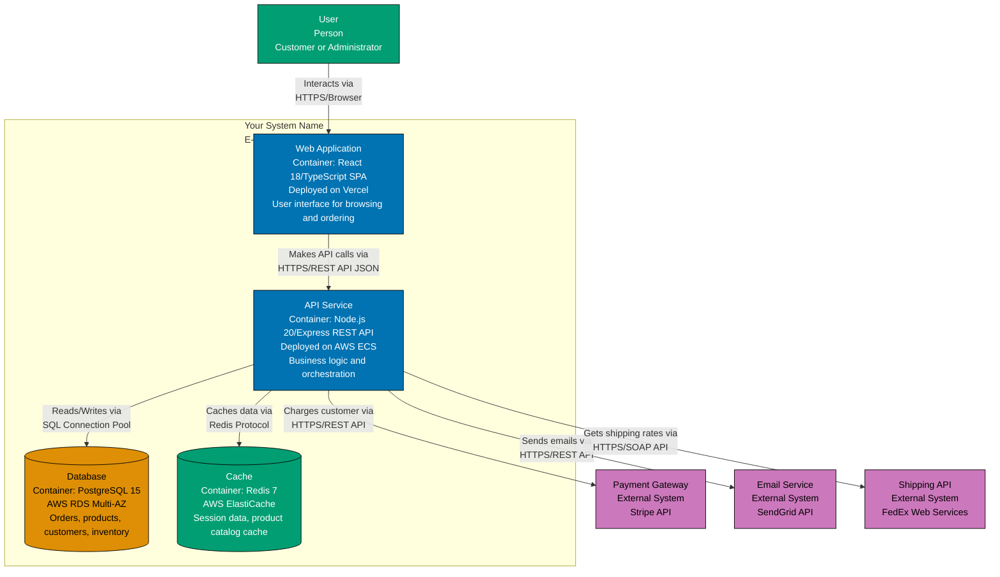

# [Your System Name] - Architecture Documentation

Complete architecture documentation for **[Your System Name]** using the C4 model.

## Table of Contents

- [System Overview](#system-overview)
- [Level 1: System Context](#level-1-system-context)
- [Level 2: Container Diagram](#level-2-container-diagram)
- [Level 3: Component Diagram (Optional)](#level-3-component-diagram-optional)
- [Deployment Overview](#deployment-overview)
- [Technology Decisions](#technology-decisions)

## System Overview

**[Your System Name]** is a [brief description of what the system does and why it exists].

**Key Features**:

- [Feature 1: e.g., Order management]
- [Feature 2: e.g., Payment processing]
- [Feature 3: e.g., Inventory tracking]

**Target Audience**: [Who uses this system: customers, internal staff, partners, etc.]

## Level 1: System Context

Shows how **[Your System Name]** fits into the broader ecosystem.

### System Context Diagram

```mermaid
graph TD
    %% Define people (actors/users)
    Customer[Customer<br/>Person<br/>Places orders and tracks shipments]
    Admin[Administrator<br/>Person<br/>Manages products and users]

    %% Define your system (the system in scope)
    YourSystem[[Your System Name]<br/>Software System<br/>E-commerce platform for online shopping]

    %% Define external systems
    PaymentGateway[Payment Gateway<br/>External Software System<br/>Processes credit card payments]
    EmailService[Email Service<br/>External Software System<br/>Sends transactional emails]
    ShippingAPI[Shipping API<br/>External Software System<br/>Provides shipping rates and tracking]

    %% Define relationships
    Customer -->|Browses products<br/>Places orders via HTTPS| YourSystem
    Admin -->|Manages inventory<br/>Views reports via HTTPS| YourSystem

    YourSystem -->|Charges customer via<br/>HTTPS/REST API| PaymentGateway
    YourSystem -->|Sends order confirmations via<br/>HTTPS/REST API| EmailService
    YourSystem -->|Retrieves shipping rates via<br/>HTTPS/REST API| ShippingAPI

    %% Apply WCAG-compliant colors
    style Customer fill:#029E73,stroke:#000000,color:#ffffff
    style Admin fill:#029E73,stroke:#000000,color:#ffffff
    style YourSystem fill:#0173B2,stroke:#000000,color:#ffffff
    style PaymentGateway fill:#CC78BC,stroke:#000000,color:#ffffff
    style EmailService fill:#CC78BC,stroke:#000000,color:#ffffff
    style ShippingAPI fill:#CC78BC,stroke:#000000,color:#ffffff
```

### System Scope

**In Scope (What this system does)**:

- [Responsibility 1: e.g., Product catalog management]
- [Responsibility 2: e.g., Order processing and fulfillment]
- [Responsibility 3: e.g., Customer account management]

**Out of Scope (What this system does NOT do)**:

- [External dependency: e.g., Payment processing - handled by Payment Gateway]
- [External dependency: e.g., Email delivery - handled by Email Service]
- [External dependency: e.g., Shipping logistics - handled by third-party carriers]

## Level 2: Container Diagram

Shows the high-level technical building blocks of **[Your System Name]**.

### Container Diagram



### Container Descriptions

#### Web Application

- **Technology**: React 18 with TypeScript, deployed on Vercel CDN
- **Responsibilities**:
  - Single-page application (SPA) for product browsing
  - Client-side form validation
  - Routing and navigation
  - Responsive UI for desktop and mobile
- **Communication**: Makes HTTPS/REST API calls to API Service

#### API Service

- **Technology**: Node.js 20 with Express framework, deployed on AWS ECS Fargate
- **Responsibilities**:
  - Business logic for order processing
  - Authentication and authorization (JWT)
  - Data validation and transformation
  - Orchestration of external service calls
- **Communication**:
  - Exposes REST API for Web Application
  - Calls PostgreSQL for persistence
  - Calls Redis for caching
  - Integrates with payment gateway, email service, shipping API

#### Database

- **Technology**: PostgreSQL 15 on AWS RDS (Multi-AZ for high availability)
- **Responsibilities**:
  - Stores orders, products, customers, inventory
  - Enforces data integrity via constraints and foreign keys
  - Provides transaction support for order processing
- **Communication**: Accessed via SQL from API Service

#### Cache

- **Technology**: Redis 7 on AWS ElastiCache
- **Responsibilities**:
  - Caches frequently accessed product catalog
  - Stores user session data
  - Improves read performance by reducing database load
- **Communication**: Accessed via Redis protocol from API Service

## Level 3: Component Diagram (Optional)

**Note**: Component diagrams are optional. Only create them for complex containers that need detailed documentation. For most systems, Context + Container diagrams are sufficient.

If you need a Component diagram, use the [Blank Component Diagram Template](./blank-component-diagram.md) to document the internal structure of one container (typically the API Service).

### When to Create Component Diagrams

- **Yes**: Complex business logic requiring detailed documentation
- **Yes**: Large team needing clear component boundaries
- **Yes**: Onboarding new developers to specific container
- **No**: Simple CRUD applications
- **No**: Small teams familiar with codebase

## Deployment Overview

**[Your System Name]** is deployed to **AWS Cloud** in the **us-east-1** region.

### Deployment Summary

| Container       | Deployment Target     | Scaling Strategy | Instances    |
| --------------- | --------------------- | ---------------- | ------------ |
| Web Application | Vercel CDN            | Automatic (CDN)  | Global edge  |
| API Service     | AWS ECS Fargate       | Horizontal       | 2-10 tasks   |
| Database        | AWS RDS PostgreSQL    | Vertical         | 1 (Multi-AZ) |
| Cache           | AWS ElastiCache Redis | Cluster mode     | 3 shards     |

### High Availability

- **Multi-AZ Database**: PostgreSQL RDS deployed across two Availability Zones for failover
- **Auto-Scaling**: API Service scales based on CPU utilization (target: 70%)
- **Load Balancing**: Application Load Balancer distributes traffic to API Service tasks
- **CDN**: Web Application served from Vercel's global CDN

For detailed infrastructure mapping, see [Deployment Diagram Template](./blank-deployment-diagram.md).

## Technology Decisions

### Why React for Web Application?

- **Rationale**: [Explain choice: e.g., Large ecosystem, developer familiarity, component reusability]
- **Alternatives Considered**: [e.g., Vue.js, Angular, Svelte]
- **Trade-offs**: [e.g., Bundle size vs. developer experience]

### Why Node.js/Express for API Service?

- **Rationale**: [Explain choice: e.g., JavaScript everywhere, async I/O, rapid development]
- **Alternatives Considered**: [e.g., Python/FastAPI, Java/Spring Boot, Go]
- **Trade-offs**: [e.g., Performance vs. ecosystem maturity]

### Why PostgreSQL for Database?

- **Rationale**: [Explain choice: e.g., ACID transactions, relational model fits domain, proven reliability]
- **Alternatives Considered**: [e.g., MySQL, MongoDB, DynamoDB]
- **Trade-offs**: [e.g., Vertical scaling limitations vs. relational guarantees]

### Why Redis for Cache?

- **Rationale**: [Explain choice: e.g., In-memory performance, data structure support, cluster mode]
- **Alternatives Considered**: [e.g., Memcached, AWS ElastiCache for Memcached]
- **Trade-offs**: [e.g., Memory cost vs. read performance]

## Key Architecture Decisions

### Decision 1: Stateless API Service

**Decision**: API Service is stateless; all session data stored in Redis

**Rationale**:

- Enables horizontal scaling (any instance can serve any request)
- Simplifies deployment (no sticky sessions needed)
- Supports graceful shutdowns during deployments

**Trade-offs**:

- Adds dependency on Redis (single point of failure without cluster mode)
- Overhead for session lookup on every request

### Decision 2: External Payment Processing

**Decision**: Use Stripe API for payment processing instead of building in-house

**Rationale**:

- PCI DSS compliance handled by Stripe
- Reduces security risk (no storage of sensitive payment data)
- Faster time-to-market

**Trade-offs**:

- Vendor lock-in to Stripe
- Transaction fees per payment
- Dependency on external service availability

### Decision 3: Eventual Consistency for Inventory

**Decision**: Inventory updates are eventually consistent (not real-time)

**Rationale**:

- Improves performance (cache-first reads)
- Reduces database load
- Acceptable for product catalog (not financial data)

**Trade-offs**:

- Potential overselling during cache lag (mitigated by background jobs)
- Requires cache invalidation strategy

## Future Enhancements

- [Enhancement 1: e.g., Add real-time order tracking with WebSockets]
- [Enhancement 2: e.g., Implement event-driven architecture with message queue]
- [Enhancement 3: e.g., Add multi-region deployment for global customers]

## Related Documentation

- **[Blank Context Diagram](./blank-context-diagram.md)** - Template for creating system context diagrams
- **[Blank Container Diagram](./blank-container-diagram.md)** - Template for creating container diagrams
- **[Blank Component Diagram](./blank-component-diagram.md)** - Template for creating component diagrams
- **[Blank Deployment Diagram](./blank-deployment-diagram.md)** - Template for creating deployment diagrams
- **[Color Palette Reference](./color-palette.md)** - WCAG-compliant color palette
- **[C4 Model Overview](../README.md)** - Introduction to C4 architecture model

---

**Template Instructions**:

1. Replace `[Your System Name]` with your actual system name throughout the document
2. Update "System Overview" with your system's purpose and features
3. Customize System Context Diagram:
   - Replace User placeholders with actual user roles
   - Replace External System placeholders with actual external systems
   - Update relationship labels
4. Customize Container Diagram:
   - Replace container placeholders with actual containers
   - Update technology stacks
   - Add or remove containers as needed (most systems have 2-6 containers)
5. Fill in "Container Descriptions" with detailed responsibilities
6. Update "Deployment Overview" with your actual deployment strategy
7. Fill in "Technology Decisions" explaining why you chose each technology
8. Document key architecture decisions and trade-offs
9. Update frontmatter (title, description, tags, created/updated dates)
10. Delete this template instructions section when done

**See**: [C4 Model Overview](../README.md) for comprehensive guidance on using the C4 model.
