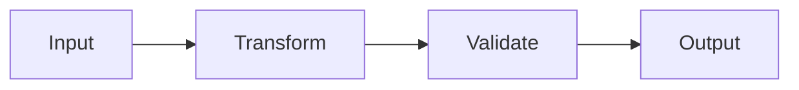
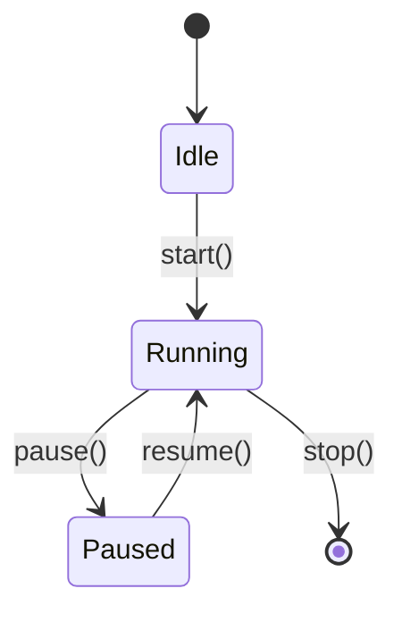
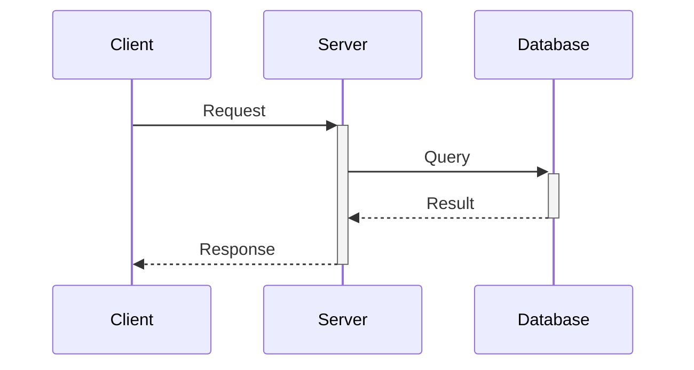
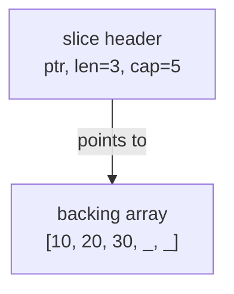

## Purpose

This convention defines standards for creating **by-example tutorials** - code-first learning materials that teach programming languages and frameworks through 75-90 heavily annotated, self-contained, runnable examples achieving 95% coverage.

By-example tutorials target experienced developers switching languages or frameworks who prefer learning through working code rather than narrative explanations.

## Core Characteristics

### 1. Code-First Approach

**Philosophy**: Show the code first, run it second, understand through direct interaction.

Examples prioritize:

- Working, runnable code over explanatory text
- Inline annotations over separate documentation
- Immediate execution over theoretical discussion
- Pattern demonstration over concept explanation

### 2. Coverage Target: 95%

**What 95% means**: Depth and breadth of language/framework features needed for production work.

**Included in 95%**:

- Core syntax and semantics
- Standard library essentials
- Production patterns and best practices
- Common frameworks and tools
- Modern language features
- Testing and debugging
- Concurrency and parallelism
- Error handling patterns
- Performance considerations

**Excluded from 95% (the remaining 5%)**:

- Rare edge cases
- Framework internals and source code
- Specialized libraries outside standard use
- Language implementation details
- Platform-specific advanced features
- Deprecated features

**Coverage verification**: The ayokoding-web-by-example-checker agent validates coverage against comprehensive checklists for each language/framework.

### 3. Example Count: 75-90 Total

**Target range**: 75-90 examples per language or framework

**Distribution across levels**:

- **Beginner**: 25-30 examples (0-40% coverage) - Fundamentals and syntax
- **Intermediate**: 25-30 examples (40-75% coverage) - Production patterns
- **Advanced**: 25-30 examples (75-95% coverage) - Expert mastery

**Rationale**:

- 60 examples (previous target) provided good coverage but left gaps
- 75-90 examples allows more granular progression and comprehensive reference
- Equal distribution ensures balanced depth at each level
- Beyond 90 becomes maintenance burden without proportional value gain

## Example Structure

Every example follows a **mandatory five-part format**:

### Part 1: Brief Explanation (2-3 sentences)

**Purpose**: Provide context and motivation

**Must answer**:

- What is this concept/pattern?
- Why does it matter in production code?
- When should you use it?

**Example**:

```markdown
### Example 23: Context-Aware Cancellation

Go's `context` package provides a standardized way to pass cancellation signals, deadlines, and request-scoped values across API boundaries. Context enables graceful shutdown of operations when requests are cancelled or time out, preventing resource leaks in production systems.
```

### Part 2: Mermaid Diagram (when appropriate)

**When to include**:

- Data flow between components is non-obvious
- State transitions need visualization
- Concurrency patterns involve multiple goroutines/processes
- Request/response cycles span multiple layers
- Memory layout or pointer relationships clarify behavior
- Architecture patterns benefit from visual representation

**When NOT to include**:

- Simple syntax demonstrations (variable declaration, basic loops)
- Single-function examples with clear linear flow
- Trivial transformations or calculations

**Diagram requirements**:

- Use color-blind friendly palette: Blue #0173B2, Orange #DE8F05, Teal #029E73, Purple #CC78BC, Brown #CA9161
- Include descriptive labels on nodes and edges
- Keep diagrams focused on the specific concept (avoid overwhelming detail)
- Use appropriate diagram type (graph LR/TD, sequenceDiagram, stateDiagram)

### Part 3: Heavily Annotated Code

**Core requirement**: Every significant line must have an inline comment

**CRITICAL REQUIREMENT: Annotation Density Target**

- **Minimum**: 40+ annotations per example
- **Intermediate/Advanced optimal**: 75+ annotations per example
- **Measurement**: Count `// =>` or `# =>` instances in code blocks
- **Reference implementation**: Elixir intermediate Examples 31-37 (~56 annotations/example average)

**Annotation Quality Over Quantity**:

While annotation count is a measurable target, quality matters more:

- Every significant line should explain state changes, return values, or execution flow
- Annotations should teach WHY code behaves this way, not just WHAT it does
- Focus on completeness: intermediate states, types, side effects, timing (compile vs runtime)

**Comment annotations use `// =>` or `# =>` notation**:

```go
x := 10                          // => x is now 10 (type: int)
y := x * 2                       // => y is 20 (x remains unchanged at 10)
result := transform(y)           // => result is "20-transformed" (string)
fmt.Println(result)              // => Output: 20-transformed
```

**Required annotations**:

- **Annotation density**: Target 40+ annotations per example (75+ for intermediate/advanced)
- **Pattern matching**: Document which branch matched and why
- **Execution flow**: Show control flow decisions (which if/case branch taken)

- **Variable states**: Show value and type after assignment
- **Intermediate values**: Document values at each transformation step
- **Function outputs**: Show return values inline
- **Side effects**: Document mutations, I/O operations, state changes
- **Expected outputs**: Show stdout/stderr content with `=> Output:` prefix
- **Timing (compile vs runtime)**: Distinguish compile-time checks from runtime execution
- **Best practices**: Use ✅ GOOD vs ❌ BAD indicators for pattern comparisons
- **Error cases**: Document when errors occur and how they're handled

**Code organization**:

- Include full imports (no "assume this is imported")
- Define helper functions if needed for self-containment
- Use descriptive variable names (avoid single-letter unless idiomatic)
- Format code with language-standard tools (gofmt, mix format, etc.)

### Part 4: Key Takeaway (1-2 sentences)

**Purpose**: Distill the core insight to its essence

**Must highlight**:

- The most important pattern or concept
- When to apply this in production
- Common pitfalls to avoid

**Example**:

```markdown
**Key Takeaway**: Use `context.WithTimeout` for operations that must complete within a deadline, and always pass context as the first parameter to functions that perform I/O or long-running operations to enable cancellation.
```

### Part 5: Why It Matters (2-3 sentences, 50-100 words)

**Purpose**: Connect the concept to production relevance and real-world impact

**Must explain**:

- Why professionals care about this in real systems (sentence 1: production relevance)
- How it compares to alternatives or what problems it solves (sentence 2: comparative insight)
- Consequences for quality/performance/safety/scalability (sentence 3: practical impact)

**Quality guidelines**:

- **Active voice**: Use concrete, active language
- **Length**: 50-100 words (2-3 sentences)
- **Contextual**: Specific to the concept, NOT generic statements
- **Production-focused**: Reference real usage, companies, or measurable impacts

**Example**:

```markdown
**Why It Matters**: Goroutines enable servers to handle 10,000+ concurrent connections on a single machine with minimal memory overhead (2KB stack per goroutine vs 1MB+ per thread in Java), making Go the language of choice for high-throughput network services like Kubernetes, Docker, and Prometheus. The channel-based communication model prevents race conditions that plague shared-memory concurrency, while select statements enable sophisticated timeout and cancellation patterns essential for production resilience.
```

## Self-Containment Rules

**Critical requirement**: Examples must be copy-paste-runnable within their chapter scope.

### Beginner Level Self-Containment

**Rule**: Each example is completely standalone

**Requirements**:

- Full package declaration and imports
- All helper functions defined in-place
- No references to previous examples
- Runnable with single command (go run, iex, java, etc.)

**Example structure**:

```go
package main

import (
    "fmt"
    "strings"
)

// Helper function defined inline
func helper(s string) string {
    return strings.ToUpper(s)
}

func main() {
    result := helper("go")  // => result is "GO"
    fmt.Println(result)     // => Output: GO
}
```

### Intermediate Level Self-Containment

**Rule**: Examples assume beginner concepts but include all necessary code

**Allowed assumptions**:

- Reader knows basic syntax (covered in beginner)
- Reader understands fundamental types and control flow
- Reader can run basic commands

**Requirements**:

- Full imports and necessary helper code
- Can reference beginner concepts conceptually ("as we saw with slices")
- Must be runnable without referring to previous examples
- Include type definitions and setup code needed

### Advanced Level Self-Containment

**Rule**: Examples assume beginner + intermediate knowledge but remain runnable

**Allowed assumptions**:

- Reader knows language fundamentals and production patterns
- Reader understands framework basics and architecture
- Reader can navigate documentation for context

**Requirements**:

- Full runnable code with imports and setup
- Can reference patterns by name ("using the middleware pattern")
- Include all interfaces, types, and configurations needed
- Provide complete example even if building on earlier concepts

### Cross-Reference Guidelines

**Acceptable cross-references**:

```markdown
This builds on the middleware pattern from Example 30, but here's the complete code including the middleware setup...
```

**Unacceptable cross-references**:

```markdown
Use the `handleRequest` function from Example 12 (code not shown).
```

**Golden rule**: If you delete all other examples, this example should still compile and run.

## Educational Comment Standards

### Output Annotation Pattern

Use `// =>` or `# =>` to show outputs, states, and intermediate values:

```go
// Variable assignment
age := 25                        // => age is 25 (type: int)

// Transformation
doubled := age * 2               // => doubled is 50 (age still 25)

// Function call with return
greeting := fmt.Sprintf("Age: %d", doubled)
                                 // => greeting is "Age: 50" (string)

// Output to stdout
fmt.Println(greeting)            // => Output: Age: 50

// Multiple returns
result, err := parseValue("42")  // => result is 42, err is nil

// Error case
result, err := parseValue("bad") // => result is 0, err is "invalid input"
```

### State Documentation Pattern

Show how state changes through execution:

```go
// Initial state
counter := 0                     // => counter is 0

// First increment
counter++                        // => counter is now 1

// Conditional modification
if counter > 0 {
    counter *= 10                // => counter is now 10 (condition was true)
}

// Final state
fmt.Println(counter)             // => Output: 10
```

### Collection Annotation Pattern

Show collection contents at each step:

```go
// Initialize
nums := []int{1, 2, 3}           // => nums is [1, 2, 3] (len=3, cap=3)

// Append
nums = append(nums, 4)           // => nums is [1, 2, 3, 4] (len=4, cap=6)

// Slice
subset := nums[1:3]              // => subset is [2, 3] (len=2, cap=5)
                                 // => nums unchanged: [1, 2, 3, 4]

// Modify slice
subset[0] = 99                   // => subset is [99, 3]
                                 // => nums is [1, 99, 3, 4] (backing array shared!)
```

### Concurrency Annotation Pattern

Document goroutine execution and channel operations:

```go
// Channel creation
ch := make(chan int)             // => ch is unbuffered channel (blocks on send until receive)

// Goroutine spawn
go func() {
    ch <- 42                     // => Blocks until main goroutine receives
}()                              // => Goroutine now running concurrently

// Receive
value := <-ch                    // => Blocks until goroutine sends, then value is 42
fmt.Println(value)               // => Output: 42
```

## Mermaid Diagram Guidelines

### When to Include Diagrams

**INCLUDE diagram when**:

- **Data flow** spans multiple functions/components
- **State machines** have multiple states and transitions
- **Concurrency** involves multiple goroutines/processes/actors
- **Request flow** traverses multiple layers (HTTP → router → controller → model)
- **Memory layout** clarifies pointer behavior or data structures
- **Pipeline patterns** show data transformation stages
- **Error propagation** shows error handling across function calls

**SKIP diagram when**:

- Single function with linear execution
- Simple variable assignment or calculation
- Trivial control flow (basic if/else, simple loops)
- Concept is clearer from code alone

### Diagram Frequency Target

**Guideline**: 30-50% of examples should include diagrams

**Beginner level**: ~30% (simpler concepts, fewer diagrams needed)
**Intermediate level**: ~40% (more complex patterns benefit from visualization)
**Advanced level**: ~50% (complex architectures require visual aids)

### Diagram Types by Use Case

**Data flow**: `graph LR` or `graph TD`



**State transitions**: `stateDiagram-v2`



**Sequence of operations**: `sequenceDiagram`



**Memory layout**: `graph TD` with annotations



### Color-Blind Friendly Palette

**Mandatory colors** (WCAG AA compliant):

- **Blue** #0173B2 - Primary elements, starting states
- **Orange** #DE8F05 - Secondary elements, processing states
- **Teal** #029E73 - Success states, outputs
- **Purple** #CC78BC - Alternative paths, options
- **Brown** #CA9161 - Neutral elements, helpers

**Forbidden colors**: Red, green, yellow (not color-blind accessible)

**Comment syntax**: Use `%%` for comments (NOT `%%{ }%%` which causes syntax errors)


## Coverage Progression by Level

### Beginner (0-40% coverage)

**Focus**: Language/framework fundamentals and core syntax

**Topics**:

- Variable declaration and types
- Control flow (if, loops, switch)
- Functions and methods
- Basic data structures (arrays, slices, maps, structs)
- Error handling basics
- Package/module structure
- Basic testing
- Standard library essentials

**Example count**: 25-30 examples

### Intermediate (40-75% coverage)

**Focus**: Production patterns and framework features

**Topics**:

- Advanced data structures and patterns
- Concurrency primitives
- I/O and networking
- HTTP clients and servers
- Database access patterns
- Testing strategies (integration, mocking)
- Common frameworks and libraries
- Error wrapping and custom errors
- Configuration and environment handling

**Example count**: 25-30 examples

### Advanced (75-95% coverage)

**Focus**: Expert mastery and optimization

**Topics**:

- Advanced concurrency patterns (pipelines, fan-out/fan-in)
- Performance optimization and profiling
- Reflection and metaprogramming
- Generic programming (where applicable)
- Advanced framework features
- Production deployment patterns
- Observability (metrics, tracing, logging)
- Security patterns
- Internals and debugging
- Best practices synthesis

**Example count**: 25-30 examples

## File Naming and Organization

### Directory Structure

```
content/
└── en/
    └── learn/
        └── software-engineering/
            └── programming-language/
                └── {language}/
                    └── tutorials/
                        └── by-example/
                            ├── _index.md          # Landing page
                            ├── overview.md        # What is by-example, how to use
                            ├── beginner.md        # Examples 1-25/30
                            ├── intermediate.md    # Examples 26-50/60
                            └── advanced.md        # Examples 51-75/90
```

### File Naming Pattern

- `overview.md`: Always named "Overview" (weight: 10000000)
- `beginner.md`: Always named "Beginner" (weight: 10000001)
- `intermediate.md`: Always named "Intermediate" (weight: 10000002)
- `advanced.md`: Always named "Advanced" (weight: 10000003)

### Example Numbering

**Sequential numbering across all levels**: Examples 1-75/90

**Beginner**: Examples 1-25 or 1-30
**Intermediate**: Examples 26-50 or 31-60
**Advanced**: Examples 51-75 or 61-90

**Rationale**: Sequential numbering creates a unified reference system across the entire tutorial series.

## Frontmatter Requirements

### Overview Page

```yaml
---
title: "Overview"
date: YYYY-MM-DDTHH:MM:SS+07:00
draft: false
weight: 10000000
description: "Learn {Language/Framework} through {N}+ annotated code examples covering 95% of the language - ideal for experienced developers"
tags: ["language-tag", "tutorial", "by-example", "examples", "code-first"]
---
```

### Tutorial Level Pages

```yaml
---
title: "Beginner" | "Intermediate" | "Advanced"
date: YYYY-MM-DDTHH:MM:SS+07:00
draft: false
weight: 10000001 | 10000002 | 10000003
description: "Examples {range}: {Topic summary} ({coverage}% coverage)"
tags: ["language-tag", "tutorial", "by-example", "level-tag", "topic-tags"]
---
```

## Quality Checklist

Before publishing by-example content, verify:

### Coverage

- [ ] 75-90 total examples across three levels
- [ ] Each level has 25-30 examples
- [ ] 95% coverage of language/framework achieved
- [ ] Coverage gaps documented and justified

### Self-Containment

- [ ] Every beginner example is fully standalone
- [ ] Every intermediate example runs without external references
- [ ] Every advanced example is copy-paste-runnable
- [ ] All imports and helper code included

### Code Quality

- [ ] Every significant line has inline comment
- [ ] Annotation density meets target (40+ per example, 75+ for intermediate/advanced)
- [ ] Annotations explain WHY (not just WHAT)
- [ ] Pattern matching branches documented (which matched, why)
- [ ] Execution flow decisions shown (if/case branches, timing)
- [ ] Best practices indicated (✅ GOOD vs ❌ BAD where relevant)
- [ ] `// =>` or `# =>` notation shows outputs and states
- [ ] Variable states documented at each step
- [ ] Code is formatted with standard tools
- [ ] Examples compile/run successfully

### Educational Value

- [ ] Brief explanation (2-3 sentences) present
- [ ] Key takeaway (1-2 sentences) present
- [ ] Comments explain WHY, not just WHAT
- [ ] Production relevance clear

### Diagrams

- [ ] 30-50% of examples include Mermaid diagrams
- [ ] Diagrams use color-blind friendly palette
- [ ] Diagrams clarify non-obvious concepts
- [ ] No diagrams for trivial examples

### Structure

- [ ] Five-part format followed consistently
- [ ] Examples numbered sequentially
- [ ] File naming convention followed
- [ ] Frontmatter complete and accurate

## Validation and Enforcement

### Automated Validation

The **ayokoding-web-by-example-checker** agent validates:

- Coverage percentage against target (95%)
- Example count within range (75-90)
- Self-containment (imports present, runnable)
- Comment annotation density (40+ per example, 75+ optimal)
- Comment annotation quality (`// =>` notation, explains WHY)
- Diagram presence frequency (30-50%)
- Color-blind palette compliance
- Frontmatter completeness

### Quality Gate Workflow

The **by-example-quality-gate** workflow orchestrates:

1. **ayokoding-web-by-example-maker**: Creates/updates examples
2. **ayokoding-web-by-example-checker**: Validates against standards
3. **User review**: Reviews audit report
4. **ayokoding-web-by-example-fixer**: Applies validated fixes

## Relationship to Other Tutorial Types

By-example tutorials complement other learning approaches:

| Type              | Coverage         | Approach                | Target Audience            |
| ----------------- | ---------------- | ----------------------- | -------------------------- |
| **Initial Setup** | 0-5%             | Environment setup       | All users                  |
| **Quick Start**   | 5-30%            | Project-based           | Newcomers                  |
| **Beginner**      | 0-60%            | Narrative explanations  | Complete beginners         |
| **By Example**    | **95%**          | **Code-first examples** | **Experienced developers** |
| **Intermediate**  | 60-85%           | Production patterns     | Past basics                |
| **Advanced**      | 85-95%           | Expert topics           | Experienced users          |
| **Cookbook**      | Problem-specific | Recipe solutions        | All levels                 |

**Key distinction**: By-example achieves 95% coverage through examples while beginner achieves 60% through narrative. Advanced tutorials reach 85-95% through deep dives into specialized topics.

## Cross-Language Consistency

When creating by-example tutorials for multiple languages:

**Maintain consistency in**:

- Overall structure (overview + 3 levels)
- Example count range (75-90)
- Coverage target (95%)
- Four-part example format
- Self-containment rules
- Comment annotation patterns

**Allow variation in**:

- Language-specific idioms and patterns
- Framework-specific features
- Standard library organization
- Testing approaches
- Tooling and ecosystem

## Principles Implemented/Respected

This convention implements and respects:

- **[Automation Over Manual](../principles/software-engineering/ex-pr-se__automation-over-manual.md)**: Automated validation via ayokoding-web-by-example-checker agent
- **[Progressive Disclosure](../principles/content/ex-pr-co__progressive-disclosure.md)**: Content organized in complexity levels (beginner/intermediate/advanced)
- **[No Time Estimates](../principles/content/ex-pr-co__no-time-estimates.md)**: Uses coverage percentages instead of time-based estimates
- **[Accessibility First](../principles/content/ex-pr-co__accessibility-first.md)**: Color-blind friendly diagrams and accessible formatting
- **[Explicit Over Implicit](../principles/software-engineering/ex-pr-se__explicit-over-implicit.md)**: Self-contained examples with explicit imports and clear context

## Scope

### What This Convention Covers

- **By Example tutorial structure** - 75-90 annotated code examples
- **Target audience** - Experienced developers (95% topic coverage)
- **Example annotation** - How to explain code examples effectively
- **Code organization** - How to sequence examples for learning
- **Example selection** - Which examples to include
- **Dual-path integration** - How By Example works with by-concept tutorials

### What This Convention Does NOT Cover

- **General tutorial standards** - Covered in [Tutorials Convention](./ex-co__tutorials.md)
- [ ] Why It Matters section present (2-3 sentences)
- [ ] Why It Matters is production-focused (not generic)
- [ ] Why It Matters is 50-100 words
- **Tutorial naming** - Covered in [Tutorial Naming Convention](./ex-co__tutorial-naming.md)
- **Hugo implementation** - Hextra specifics in [ayokoding-web convention](./ex-co__hugo-content-ayokoding.md)
- **Code quality** - Source code standards in development conventions

## Related Documentation

- [Tutorial Naming Convention](./ex-co__tutorial-naming.md): Tutorial type definitions and naming standards
- [Content Quality Principles](./ex-co__content-quality.md): General content quality standards
- [Diagrams Convention](./ex-co__diagrams.md): Mermaid diagram standards
- [Color Accessibility Convention](./ex-co__color-accessibility.md): Color-blind friendly palette
- [Diátaxis Framework](./ex-co__diataxis-framework.md): Tutorial categorization framework
