# Content Quality Principles

This convention establishes universal content quality standards for **ALL markdown content** in this repository.

## Principles Implemented

This convention implements the following core principles:

- **[Accessibility First](../principles/content/ex-pr-co__accessibility-first.md)**: Requires alt text for images, proper heading hierarchy, WCAG AA color contrast, semantic HTML structure, and screen reader support. Accessibility is not optional - it's a baseline requirement for all content.

- **[No Time Estimates](../principles/content/ex-pr-co__no-time-estimates.md)**: Explicitly forbids time-based framing ("takes 30 minutes", "2-3 weeks to complete"). Focus on outcomes and deliverables, not arbitrary time constraints that create pressure.

## Scope

These principles apply to markdown content in:

- **docs/** - Documentation (tutorials, how-to guides, reference, explanations)
- **Hugo sites** - ayokoding-web and ose-platform-web content
- **plans/** - Project planning documents
- **Repository root files** - README.md, CONTRIBUTING.md, SECURITY.md, etc.

**Universal Application**: Every markdown file in this repository should follow these quality principles, regardless of location or purpose.

```mermaid
%% Color Palette: Blue #0173B2, Orange #DE8F05, Teal #029E73, Purple #CC78BC, Brown #CA9161 %%
graph TD
    A[Content Quality Principles] --> B[Writing Style & Tone]
    A --> C[Heading Hierarchy]
    A --> D[Accessibility Standards]
    A --> E[Formatting Conventions]

    B --> B1[Active Voice]
    B --> B2[Professional Tone]
    B --> B3[Clarity & Conciseness]
    B --> B4[Audience Awareness]

    C --> C1[Single H1 Rule]
    C --> C2[Proper Nesting H2-H6]
    C --> C3[Descriptive Headings]
    C --> C4[Semantic Structure]

    D --> D1[Alt Text Required]
    D --> D2[Semantic HTML]
    D --> D3[ARIA Labels]
    D --> D4[Color Contrast]
    D --> D5[Screen Reader Support]

    E --> E1[Code Block Formatting]
    E --> E2[Text Formatting]
    E --> E3[List Formatting]
    E --> E4[Blockquotes & Callouts]
    E --> E5[Table Formatting]
    E --> E6[Line Length Guidelines]

    style A fill:#0173B2,stroke:#000,color:#fff
    style B fill:#DE8F05,stroke:#000,color:#000
    style C fill:#029E73,stroke:#000,color:#fff
    style D fill:#CC78BC,stroke:#000,color:#000
    style E fill:#CA9161,stroke:#000,color:#000
```



## Writing Style and Tone

### Active Voice

**Prefer active voice** over passive voice for clarity and directness.

✅ **Good (Active Voice)**:

```markdown
The agent validates the content against the convention.
```

❌ **Avoid (Passive Voice)**:

```markdown
The content is validated against the convention by the agent.
```

**Exception**: Passive voice is acceptable when:

- The actor is unknown or irrelevant
- Emphasizing the action over the actor
- Scientific or formal contexts require it

**Example of acceptable passive voice**:

```markdown
The configuration file is automatically generated during setup.
```

### Professional Tone

Maintain a **professional yet approachable** tone throughout all content.

**Key Principles**:

- Be respectful and inclusive
- Avoid slang, jargon (unless defined), or colloquialisms
- Use technical terms correctly and consistently
- Assume readers are intelligent but may lack context

✅ **Good (Professional Tone)**:

```markdown
To configure the authentication system, update the `auth.config.js` file
with your OAuth2 credentials. Refer to the [Authentication Guide](./auth-guide.md)
for detailed instructions.
```

❌ **Avoid (Too Casual)**:

```markdown
Just throw your OAuth2 stuff into `auth.config.js` and you're good to go!
```

❌ **Avoid (Too Formal/Stuffy)**:

```markdown
It is incumbent upon the developer to ensure proper configuration of the
aforementioned authentication system by means of modifying the designated
configuration file.
```

### Clarity and Conciseness

**Write clearly and concisely** - say what you mean with minimal words.

**Guidelines**:

- **One idea per sentence** - Complex ideas need multiple sentences
- **Short paragraphs** - 3-5 sentences maximum for web readability
- **Remove filler words** - "basically", "actually", "just", "simply"
- **Use concrete examples** - Show, don't just tell
- **Define acronyms** - First use should be spelled out

✅ **Good (Clear and Concise)**:

````markdown
The API returns a JSON response with status code 200 on success.

```json
{
  "status": "success",
  "data": { ... }
}
```
````

````

❌ **Avoid (Wordy and Vague)**:

```markdown
Basically, what happens is that when the API call actually completes
successfully, it will simply return back a JSON-formatted response that
contains the status code of 200, which indicates success.
````

### Audience Awareness

**Know your audience** and write for their experience level.

**For Beginners**:

- Explain concepts before using them
- Provide step-by-step instructions
- Include more examples and visuals
- Define technical terms

**For Intermediate/Advanced**:

- Assume foundational knowledge
- Focus on nuances and edge cases
- Provide links to prerequisites instead of explaining basics
- Use technical terminology appropriately

**Example (Tutorial for Beginners)**:

```markdown
## What is an API?

An API (Application Programming Interface) is a way for two programs to
communicate with each other. Think of it like a waiter in a restaurant:
you (the client) tell the waiter (the API) what you want, and the waiter
brings your order from the kitchen (the server).

In this tutorial, we'll build a simple API that responds to requests...
```

**Example (Reference for Advanced)**:

```markdown
## API Authentication

Endpoint authentication uses OAuth 2.0 authorization code flow with PKCE.
Token lifetime: 3600s (configurable via `TOKEN_EXPIRY` env var).
Refresh tokens supported with sliding expiration.
```

## Heading Hierarchy

### Single H1 Rule

**Every markdown file MUST have exactly ONE H1 heading** - the document title.

✅ **Correct (Single H1)**:

```markdown
# User Authentication Guide

## Overview

This guide covers authentication implementation.

## Setup

Follow these steps to set up authentication...
```

❌ **Incorrect (Multiple H1s)**:

```markdown
# User Authentication Guide

# Overview

This guide covers authentication implementation.

# Setup

Follow these steps...
```

**Why**: Single H1 provides clear document hierarchy for screen readers and SEO.

### Proper Heading Nesting

**Headings MUST follow semantic hierarchy** - don't skip levels.

✅ **Correct Nesting**:

```markdown
# Document Title (H1)

## Section (H2)

### Subsection (H3)

#### Detail (H4)

## Another Section (H2)

### Another Subsection (H3)
```

❌ **Incorrect (Skipped Levels)**:

```markdown
# Document Title (H1)

### Subsection (H3) <!-- WRONG! Skipped H2 -->

##### Detail (H5) <!-- WRONG! Skipped H4 -->
```

**Why**: Proper nesting creates logical structure for screen readers and document outlines.

### Descriptive Headings

**Headings MUST be descriptive and specific** - avoid vague titles.

✅ **Good (Descriptive)**:

```markdown
## Installing Dependencies with npm

## Configuring Authentication Settings

## Troubleshooting Database Connection Errors
```

❌ **Avoid (Vague)**:

```markdown
## Installation

## Configuration

## Troubleshooting
```

**Why**: Descriptive headings improve scannability and help readers find information quickly.

### Semantic Structure

**Use headings for structure, NOT for styling** - headings convey document hierarchy.

❌ **Incorrect (Using Heading for Emphasis)**:

```markdown
This is important content.

#### NOTICE: READ THIS CAREFULLY <!-- WRONG! This isn't a section heading -->

More content continues here...
```

✅ **Correct (Use Blockquote or Callout)**:

```markdown
This is important content.

> **NOTICE**: Read this carefully - this is a critical step.

More content continues here...
```

## Accessibility Standards

### Alt Text for Images

**ALL images MUST have descriptive alt text** for screen readers and accessibility.

✅ **Good Alt Text**:

```markdown


```

❌ **Bad Alt Text**:

```markdown
 <!-- Too vague -->

 <!-- Not descriptive -->
```

**Alt Text Guidelines**:

- **Describe the content** - What does the image show?
- **Explain the purpose** - Why is this image here?
- **Keep it concise** - Aim for 1-2 sentences (screen readers)
- **Avoid "image of" or "picture of"** - It's implied
- **Include text from image** - If image contains important text

**Decorative Images**: Use empty alt text `` for purely decorative images that don't add information.

### Semantic HTML

**Use semantic HTML elements** appropriately in markdown.

✅ **Good (Semantic)**:

```markdown
## Section Title <!-- Semantic heading -->

> **Note**: This is a callout using blockquote <!-- Semantic blockquote -->

- Unordered list item <!-- Semantic list -->
- Another item

1. Ordered list item <!-- Semantic ordered list -->
2. Next step
```

❌ **Avoid (Non-Semantic)**:

```markdown
**Section Title** <!-- Using bold instead of heading -->

**Note**: This is a callout <!-- Just bold text, not semantic blockquote -->

**•** List item <!-- Manual bullets instead of list syntax -->
**•** Another item
```

**Why**: Semantic HTML provides meaning and structure for screen readers and assistive technologies.

### ARIA Labels and Accessibility Attributes

**Use ARIA labels when HTML alone is insufficient** for accessibility.

**When to use ARIA**:

- Complex interactive components
- Custom widgets or controls
- Additional context for screen readers
- Landmark regions in documentation

**Example (Using HTML with ARIA in documentation)**:

```html
<details>
  <summary aria-label="Expand to see advanced configuration options">
    Advanced Configuration
  </summary>
  <p>Advanced options content here...</p>
</details>
```

**Note**: In most cases, proper markdown structure provides sufficient accessibility. Use ARIA sparingly and only when semantic HTML is insufficient.

### Color Contrast

**Ensure sufficient color contrast** in diagrams and custom styling.

**Reference**: [Color Accessibility Convention](./ex-co__color-accessibility.md)

**Requirements**:

- **Text contrast**: Minimum 4.5:1 ratio for normal text (WCAG AA)
- **Large text contrast**: Minimum 3:1 ratio for large text (≥18pt)
- **Non-text contrast**: Minimum 3:1 ratio for UI components and diagrams

**Use Accessible Color Palette** in all Mermaid diagrams:

- Blue: `#0173B2`
- Orange: `#DE8F05`
- Teal: `#029E73`
- Purple: `#CC78BC`
- Brown: `#CA9161`

**Never rely on color alone** to convey information - use text labels, patterns, or icons as well.

### Screen Reader Considerations

**Structure content for screen reader comprehension**.

**Best Practices**:

1. **Logical reading order** - Content flows naturally from top to bottom
2. **Descriptive link text** - Links describe destination, not "click here"
3. **Table headers** - Use header rows in tables for column identification
4. **List structure** - Use proper list syntax (not manual bullets)
5. **Heading hierarchy** - Proper H1-H6 nesting for document outline

✅ **Good (Descriptive Link Text)**:

```markdown
See the [Authentication Guide](./auth-guide.md) for setup instructions.
```

❌ **Avoid (Generic Link Text)**:

```markdown
For setup instructions, click [here](./auth-guide.md).
```

## Formatting Conventions

### Code Block Formatting

**Code blocks follow language-specific indentation standards**.

**JavaScript/TypeScript** (2 spaces):

```javascript
function authenticate(user) {
  if (user.isValid) {
    return generateToken(user);
  }
  return null;
}
```

**Python** (4 spaces):

```python
def authenticate(user):
    if user.is_valid:
        return generate_token(user)
    return None
```

**YAML** (2 spaces):

```yaml
config:
  authentication:
    enabled: true
    provider: oauth2
```

**Guidelines**:

- **Always specify language** - Use syntax highlighting (e.g., ` ```javascript `)
- **Keep code examples minimal** - Show only relevant code
- **Include context** - Brief explanation before code block
- **Use realistic examples** - Actual patterns, not abstract foo/bar

### Text Formatting

**Use text formatting purposefully and consistently**.

#### Bold Text

Use **bold** (`**text**`) for:

- **Key terms** on first mention
- **Important concepts** that need emphasis
- **UI element names** (buttons, menus)
- **Status labels** (Required, Optional)

✅ **Good Use of Bold**:

```markdown
The **authentication token** expires after 1 hour. Click the **Login** button
to sign in.
```

❌ **Overuse of Bold**:

```markdown
The **authentication token** **expires** after **1 hour**. **Click** the
**Login button** to **sign in**.
```

#### Italic Text

Use _italic_ (`*text*`) for:

- _Emphasis_ on specific words
- _Foreign terms_ or _Latin phrases_ (e.g., _et cetera_)
- _Variable names_ in prose (when not using code syntax)
- _Titles of books or publications_

✅ **Good Use of Italic**:

```markdown
The _environment_ variable must be set _before_ running the application.
```

#### Inline Code

Use inline code (`` `code` ``) for:

- `variable names`
- `function names`
- `file paths`
- `command names`
- `configuration keys`
- `HTTP status codes` (e.g., `200`, `404`)

✅ **Good Use of Inline Code**:

```markdown
Set the `API_KEY` environment variable in your `.env` file. Run the
`npm install` command to install dependencies.
```

#### Strikethrough

Use ~~strikethrough~~ (`~~text~~`) for:

- Deprecated features (with replacement noted)
- Corrections in changelog or updates

✅ **Good Use of Strikethrough**:

```markdown
~~Use `legacy-auth`~~ **Deprecated** - Use `oauth2-auth` instead.
```

### List Formatting

**Use appropriate list types** for content structure.

#### Unordered Lists

Use for:

- Items without specific order
- Feature lists
- Option lists
- Related items of equal importance

```markdown
Key features:

- User authentication
- Role-based access control
- Session management
- Audit logging
```

#### Ordered Lists

Use for:

- Sequential steps
- Ranked items
- Processes with specific order
- Prerequisites with dependencies

```markdown
Setup steps:

1. Install Node.js 18 or higher
2. Clone the repository
3. Run `npm install`
4. Configure environment variables
5. Start the development server
```

#### Nested Lists

**Use proper nesting** with 2-space or 4-space indentation:

```markdown
Project structure:

- src/
  - components/
    - auth/
      - Login.tsx
      - Signup.tsx
  - utils/
    - validation.ts
- tests/
  - unit/
  - integration/
```

#### Checklist Format

Use checkboxes for task lists:

```markdown
Setup checklist:

- [x] Install dependencies
- [x] Configure database
- [ ] Set up authentication
- [ ] Deploy to production
```

### Blockquotes and Callouts

**Use blockquotes for quotations and callouts**.

#### Simple Blockquote

```markdown
> "Good documentation is like good code - it should be clear, concise, and
> maintainable." — Anonymous Developer
```

#### Callout Boxes

Use blockquotes with emoji or labels for callouts:

```markdown
> **Note**: Configuration changes require server restart.

> ⚠️ **Warning**: Deleting this file will remove all user data permanently.

> ✅ **Success**: Your authentication is now properly configured.

> 💡 **Tip**: Use environment variables for sensitive configuration.
```

**Callout Types**:

- **Note** / 📝: General information
- **Warning** / ⚠️: Caution required
- **Success** / ✅: Confirmation or best practice
- **Tip** / 💡: Helpful suggestion
- **Important** / ❗: Critical information

### Table Formatting

**Use tables for structured data comparison**.

#### Basic Table

```markdown
| Feature         | Free Tier | Pro Tier  |
| --------------- | --------- | --------- |
| Users           | 5         | Unlimited |
| Storage         | 1 GB      | 100 GB    |
| API Calls/month | 1,000     | Unlimited |
| Support         | Community | Priority  |
```

**Table Guidelines**:

- **Align headers** with content using pipes and dashes
- **Keep cells concise** - Long content makes tables hard to read
- **Use header row** - First row should describe columns
- **Consider alternatives** - For complex data, use lists or separate sections

#### Table Alignment

```markdown
| Left Aligned | Center Aligned | Right Aligned |
| :----------- | :------------: | ------------: |
| Default      |    Centered    |       Numbers |
| Text         |      Text      |        123.45 |
```

**Alignment Syntax**:

- Left: `:---` (default)
- Center: `:---:`
- Right: `---:`

### Line Length and Readability

**Optimize line length for readability**.

**Guidelines**:

- **Prose text**: Aim for 80-100 characters per line (hard limit: 120)
- **Code blocks**: Follow language conventions (often 80-120 chars)
- **Tables**: May exceed line length (tables are wider by nature)
- **URLs**: Don't break URLs for line length

**Why**: Studies show ~80 characters per line optimizes reading speed and comprehension.

✅ **Good (Readable Line Length)**:

```markdown
Authentication tokens expire after 1 hour of inactivity. To extend the
session, the client must send a refresh token before expiration. Failed
refresh attempts result in automatic logout.
```

❌ **Avoid (Too Long)**:

```markdown
Authentication tokens expire after 1 hour of inactivity and to extend the session the client must send a refresh token before expiration otherwise failed refresh attempts will result in automatic logout and the user will need to log in again.
```

### Paragraph Structure

**Structure paragraphs for web readability**.

**Guidelines**:

- **One main idea per paragraph** - Split complex ideas into multiple paragraphs
- **3-5 sentences maximum** - Short paragraphs are easier to scan on screens
- **Topic sentence first** - Lead with the main point
- **Blank line between paragraphs** - Visual separation improves scannability

### No Time Estimates

**Do NOT include time estimates in educational or tutorial content.**

**Rationale**:

- Time estimates create artificial pressure on learners
- Everyone learns at different speeds
- Focus should be on WHAT learners accomplish, not HOW LONG it takes
- Makes content evergreen (no need to update time claims)
- Reduces anxiety and creates pressure-free learning environment

**Forbidden Time Estimates**:

❌ **Avoid (time-based claims)**:

```markdown
This tutorial takes 2-3 hours to complete.
Estimated time: 45 minutes
Duration: 1-2 hrs
You'll learn this in 30 minutes.
Time needed: 20 min
```

✅ **Good (focus on outcomes, not duration)**:

```markdown
By the end of this tutorial, you'll be able to...
This tutorial covers the fundamentals of...
You'll learn how to build a complete application.
Coverage: 60-85% of domain knowledge (intermediate depth)
```

**Exception - Coverage Percentages Allowed**:

Coverage percentages are allowed because they indicate **depth/scope**, not **time**:

- ✅ "Coverage: 0-5%" (indicates initial setup scope)
- ✅ "Coverage: 60-85%" (indicates intermediate depth)
- ✅ "Coverage: 85-95%" (indicates advanced depth)

**Where This Applies**:

- All tutorial content (`docs/tutorials/`)
- Educational content in Hugo sites (ayokoding-web learning content)
- How-to guides that teach concepts
- Reference documentation with learning components

**Where This Does NOT Apply**:

- Project planning documents (`plans/`) - can estimate implementation time
- Development task tracking - can estimate effort
- Meeting agendas - can allocate time slots

✅ **Good (Well-Structured Paragraphs)**:

```markdown
Authentication tokens provide secure access to protected resources. Each
token includes user identity, permissions, and expiration time.

Tokens expire after 1 hour of inactivity. Before expiration, clients can
request a new token using the refresh token endpoint. This extends the
session without requiring re-authentication.

Failed refresh attempts trigger automatic logout. The user must log in
again to continue. This security measure prevents unauthorized access
attempts.
```

❌ **Avoid (Wall of Text)**:

```markdown
Authentication tokens provide secure access to protected resources and
each token includes user identity, permissions, and expiration time and
tokens expire after 1 hour of inactivity so before expiration clients can
request a new token using the refresh token endpoint which extends the
session without requiring re-authentication but if refresh attempts fail
then automatic logout is triggered and the user must log in again to
continue which is a security measure that prevents unauthorized access
attempts.
```

## Quality Checklist

Before committing markdown content, verify:

- [ ] **Writing Style**
  - Active voice used (passive only when appropriate)
  - Professional yet approachable tone
  - Clear and concise language (no filler words)
  - Audience-appropriate complexity level

- [ ] **Heading Hierarchy**
  - Single H1 (document title)
  - Proper H2-H6 nesting (no skipped levels)
  - Descriptive heading text
  - Headings used for structure, not styling

- [ ] **Accessibility**
  - All images have descriptive alt text
  - Semantic HTML elements used correctly
  - Color not sole means of conveying information
  - Descriptive link text (not "click here")
  - Proper table headers and list structure

- [ ] **Formatting**
  - Code blocks specify language
  - Text formatting used purposefully (not overused)
  - Lists use proper markdown syntax
  - Blockquotes and callouts formatted consistently
  - Tables aligned and readable
  - Mermaid diagrams use correct comment syntax (`%%`, not `%%{ }%%`)

- [ ] **Readability**
  - Lines ≤80-100 characters (prose)
  - Paragraphs ≤3-5 sentences
  - Blank lines between paragraphs
  - Logical flow and structure

## Related Conventions

**Universal Conventions (apply to all markdown)**:

- [Mathematical Notation Convention](./ex-co__mathematical-notation.md) - LaTeX in markdown
- [Color Accessibility Convention](./ex-co__color-accessibility.md) - Accessible color palette for diagrams
- [Diagrams and Schema Convention](./ex-co__diagrams.md) - Mermaid diagram standards (includes comment syntax requirements)
- [Emoji Usage Convention](./ex-co__emoji-usage.md) - Semantic emoji use

**Context-Specific Conventions**:

- [Hugo Content Convention - Shared](./ex-co__hugo-content-shared.md) - Shared Hugo content standards
- [Hugo Content Convention - ayokoding](./ex-co__hugo-content-ayokoding.md) - ayokoding-web specific standards
- [Hugo Content Convention - OSE Platform](./ex-co__hugo-content-ose-platform.md) - ose-platform-web specific standards
- [File Naming Convention](./ex-co__file-naming-convention.md) - File naming standards
- [Linking Convention](./ex-co__linking-convention.md) - Internal and external linking
- [Tutorial Convention](./ex-co__tutorials.md) - Tutorial structure and pedagogy
- [Diátaxis Framework](./ex-co__diataxis-framework.md) - Documentation organization

## References

**Web Content Accessibility Guidelines (WCAG)**:

- [WCAG 2.1 Level AA](https://www.w3.org/WAI/WCAG21/quickref/)
- [WebAIM: Writing for Screen Readers](https://webaim.org/articles/screenreader/)
- [WebAIM: Contrast Checker](https://webaim.org/resources/contrastchecker/)

**Writing Guides**:

- [Microsoft Writing Style Guide](https://learn.microsoft.com/en-us/style-guide/welcome/)
- [Google Developer Documentation Style Guide](https://developers.google.com/style)
- [The Chicago Manual of Style](https://www.chicagomanualofstyle.org/)

**Markdown References**:

- [CommonMark Spec](https://commonmark.org/)
- [GitHub Flavored Markdown](https://github.github.com/gfm/)
