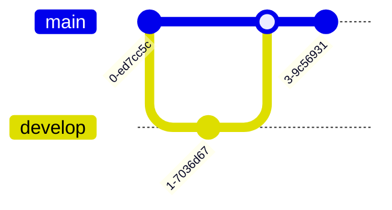
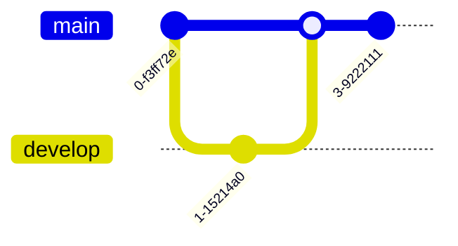

# Diagram and Schema Convention

This document defines when and how to use different diagram formats in the open-sharia-enterprise project. Understanding the appropriate format for each context ensures diagrams render consistently across all platforms where our documentation is viewed.

## 🎯 The Core Principle

The choice between Mermaid diagrams and ASCII art depends on **where the file lives** and **who will read it**:

- **Inside `docs/` directory**: Use Mermaid diagrams for rich, native rendering in Obsidian
- **Outside `docs/` directory**: Use ASCII art for maximum compatibility across all platforms

## 💡 Why This Matters

Different tools render diagrams differently. By following location-based conventions, we ensure diagrams always display correctly regardless of where they're viewed.

### Obsidian Vault Context

The `docs/` directory is our Obsidian vault - a rich markdown environment with native Mermaid support. Obsidian users expect beautiful, interactive diagrams that take full advantage of the tool's capabilities.

### Universal Compatibility Context

Files like `README.md`, `CLAUDE.md`, and other root-level documentation are viewed across diverse platforms: GitHub web interface, text editors, terminals, mobile apps, and CI/CD logs. ASCII art renders consistently everywhere without requiring special rendering support.

## 🎨 Mermaid Diagrams: For `docs/` Directory

### When to Use

Use Mermaid diagrams for **all files inside the `docs/` directory**:

```
docs/
├── tutorials/          ← Use Mermaid
├── how-to/            ← Use Mermaid
├── reference/         ← Use Mermaid
├── explanation/       ← Use Mermaid
└── journals/          ← Use Mermaid
```

### Why Mermaid?

1. **Native Rendering** - Obsidian renders Mermaid natively without plugins
2. **Rich Visuals** - Professional-looking diagrams with colors, shapes, and styling
3. **Interactive** - Diagrams can be zoomed and inspected
4. **Maintainable** - Text-based source is easy to version control and edit
5. **Powerful** - Supports flowcharts, sequence diagrams, class diagrams, entity relationships, state diagrams, and more

### Mermaid Syntax

Mermaid diagrams are defined in code blocks with the `mermaid` language identifier:

````markdown

````

### Common Mermaid Diagram Types

#### Flowchart

Perfect for processes, workflows, and decision trees:

````markdown

````


#### Sequence Diagram

Shows interactions between components over time:

````markdown

````


#### Class Diagram

Represents object-oriented structures and relationships:

````markdown

````


#### Entity Relationship Diagram

Shows database schema relationships:

````markdown

````


#### State Diagram

Illustrates state transitions in systems:

````markdown

````


#### Git Graph

Shows branch and merge history:

````markdown

````



### Mermaid Best Practices

1. **Keep it Simple** - Complex diagrams become hard to maintain
2. **Use Descriptive Labels** - Clear node names improve readability
3. **Add Comments** - Explain complex logic with inline comments
4. **Test Rendering** - Preview in Obsidian before committing
5. **Version Control Friendly** - Use consistent formatting for easier diffs

### Mermaid Resources

- [Official Mermaid Documentation](https://mermaid.js.org/)
- [Mermaid Live Editor](https://mermaid.live/) - Test diagrams online
- [Obsidian Mermaid Docs](https://help.obsidian.md/Editing+and+formatting/Advanced+formatting+syntax#Diagram)

## 📝 ASCII Art: For Files Outside `docs/`

### When to Use

Use ASCII art for **all files outside the `docs/` directory**:

```
open-sharia-enterprise/
├── README.md          ← Use ASCII art
├── CLAUDE.md          ← Use ASCII art
├── CONTRIBUTING.md    ← Use ASCII art
├── plans/            ← Use ASCII art
│   ├── in-progress/
│   ├── backlog/
│   └── done/
├── .github/
│   └── *.md          ← Use ASCII art
└── docs/             ← Use Mermaid (see above)
```

### Why ASCII Art?

1. **Universal Compatibility** - Renders identically everywhere (GitHub, terminals, text editors)
2. **No Dependencies** - No special rendering engines required
3. **Predictable** - WYSIWYG - what you type is what everyone sees
4. **Lightweight** - Fast to load, minimal bandwidth
5. **Accessible** - Screen readers and text-based browsers handle it well

### Important: Plans Folder

The `plans/` folder is located at the repository root (NOT inside `docs/`) and contains temporary project planning documents. Since it's outside the Obsidian vault, **all files within `plans/` must use ASCII art** for any diagrams or schemas.

This applies to:

- `plans/in-progress/*/README.md`
- `plans/in-progress/*/requirements.md`
- `plans/in-progress/*/tech-docs.md`
- `plans/in-progress/*/delivery.md`
- And equivalent files in `plans/backlog/` and `plans/done/`

**Rationale**: The `plans/` folder is a root-level working documents folder (like `.claude/`, `.husky/`). It is NOT part of the Obsidian vault (`docs/`). ASCII art ensures universal compatibility for files outside the documentation vault, maintaining consistency with other root-level files.

### ASCII Art Use Cases

#### Directory Structure

Perfect for showing file and folder hierarchies:

```
open-sharia-enterprise/
├── .claude/                   # Claude Code configuration
│   └── agents/               # Specialized AI agents
├── docs/                      # Documentation (Diátaxis framework)
│   ├── tutorials/            # Learning-oriented guides
│   ├── how-to/               # Problem-oriented guides
│   ├── reference/            # Technical reference
│   └── explanation/          # Conceptual documentation
├── src/                       # Source code
├── package.json              # Node.js manifest
└── README.md                 # Project README
```

#### Simple Diagrams

Basic flowcharts and relationships:

```
┌─────────────┐
│   Request   │
└──────┬──────┘
       │
       ▼
┌─────────────┐     ┌─────────────┐
│ Validation  │────▶│   Process   │
└─────────────┘     └──────┬──────┘
                           │
                           ▼
                    ┌─────────────┐
                    │  Response   │
                    └─────────────┘
```

#### Process Flow

Sequential steps with connectors:

```
User Action
    │
    ├──▶ Authentication Check
    │        │
    │        ├─ Success ──▶ Process Request ──▶ Return Result
    │        │
    │        └─ Failure ──▶ Return 401
    │
    └──▶ Log Event
```

#### Component Relationships

System architecture overview:

```
┌──────────────────────────────────────┐
│           Frontend (React)           │
└────────────┬─────────────────────────┘
             │
             ▼
┌──────────────────────────────────────┐
│         API Gateway (Express)        │
└─────┬──────────────┬─────────────────┘
      │              │
      ▼              ▼
┌─────────┐    ┌─────────────┐
│ Auth    │    │  Business   │
│ Service │    │  Logic      │
└─────────┘    └──────┬──────┘
                      │
                      ▼
               ┌─────────────┐
               │  Database   │
               └─────────────┘
```

#### Tables and Matrices

Structured data representation:

```
┌──────────────┬────────────┬──────────────┐
│   Category   │   Prefix   │   Example    │
├──────────────┼────────────┼──────────────┤
│  Tutorials   │    tu__    │  tu__start.md│
│  How-To      │    ht__    │  ht__api.md  │
│  Reference   │    re__    │  re__spec.md │
│  Explanation │    ex__    │  ex__arch.md │
└──────────────┴────────────┴──────────────┘
```

### ASCII Art Best Practices

1. **Use Box-Drawing Characters** - `┌─┐│└┘├┤┬┴┼` for clean borders
2. **Consistent Spacing** - Align elements for better readability
3. **Test in Monospace** - Verify rendering in fixed-width fonts
4. **Keep it Simple** - Complex ASCII art is hard to maintain
5. **Comment Structure** - Add text labels for clarity

### ASCII Art Character Sets

Common characters for drawing:

```
Box Drawing:
┌ ┬ ┐   ╔ ╦ ╗
├ ┼ ┤   ╠ ╬ ╣
└ ┴ ┘   ╚ ╩ ╝
─ │     ═ ║

Arrows:
→ ← ↑ ↓ ↔ ↕
▶ ◀ ▲ ▼

Connectors:
┬ ┴ ├ ┤ ┼
╭ ╮ ╰ ╯
```

### ASCII Art Tools

- Manual creation in text editor with monospace font
- Online generators (limited utility)
- Terminal tools like `figlet` for text banners

## 🔍 Decision Matrix

Use this quick reference to choose the right format:

| File Location     | Use         | Reason                                  |
| ----------------- | ----------- | --------------------------------------- |
| `docs/**/*.md`    | **Mermaid** | Native Obsidian rendering, rich visuals |
| `README.md`       | **ASCII**   | GitHub web, terminal, universal access  |
| `CLAUDE.md`       | **ASCII**   | AI agents, text editors, terminals      |
| `plans/**/*.md`   | **ASCII**   | Working documents, universal access     |
| `.github/**/*.md` | **ASCII**   | GitHub Actions logs, PR reviews         |
| `CONTRIBUTING.md` | **ASCII**   | First-time contributors, all platforms  |

## 🧪 Examples in Context

### Example 1: API Flow in Documentation

**File**: `docs/explanation/architecture/ex-ar__request-flow.md`

**Use Mermaid**:

````markdown
## Request Processing Flow


````

### Example 2: Project Structure in README

**File**: `README.md`

**Use ASCII Art**:

```markdown
## Project Structure
```

open-sharia-enterprise/
├── .claude/ # Claude Code configuration
├── docs/ # Documentation
│ ├── tutorials/ # Step-by-step guides
│ ├── how-to/ # Problem solutions
│ ├── reference/ # Technical specs
│ └── explanation/ # Concepts
├── src/ # Source code
└── package.json # Dependencies

```

```

### Example 3: State Machine in Tutorial

**File**: `docs/tutorials/transactions/tu-tr__transaction-lifecycle.md`

**Use Mermaid**:

````markdown
## Transaction States


````

### Example 4: Component Architecture in CLAUDE.md

**File**: `CLAUDE.md`

**Use ASCII Art**:

```markdown
## Agent Architecture
```

┌──────────────────────────────────────┐
│ Claude Code (Main Agent) │
└────────────┬─────────────────────────┘
│
├──▶ doc-writer.md (Documentation)
│
├──▶ repo-rules-checker.md (Validation)
│
└──▶ repo-rules-updater.md (Propagation)

```

```

## Mixing Formats (Avoid)

**Don't mix formats within a single context**. If your file is in `docs/`, use Mermaid consistently. If outside `docs/`, use ASCII art throughout.

❌ **Bad** (mixing in `docs/explanation/ex-ar__system.md`):

````markdown


```
A --> B
```
````

✅ **Good** (consistent Mermaid in `docs/`):

````markdown


````

## Migration Strategy

### Converting ASCII to Mermaid

When moving diagrams from root files to `docs/`:

1. Identify the diagram type (flowchart, sequence, etc.)
2. Use appropriate Mermaid syntax
3. Test rendering in Obsidian
4. Verify all relationships preserved

**Before** (`README.md`):

```
A → B → C
```

**After** (`docs/explanation/ex-ar__flow.md`):

````markdown

````

### Converting Mermaid to ASCII

When moving diagrams from `docs/` to root files:

1. Simplify complex relationships
2. Use box-drawing characters
3. Test in plain text editor
4. Verify readability in terminal

**Before** (`docs/tutorials/tu__flow.md`):

````markdown

````

**After** (`README.md`):

```
┌───────┐
│ Start │
└───┬───┘
    │
    ▼
┌─────────┐
│ Process │
└────┬────┘
     │
     ▼
┌─────┐
│ End │
└─────┘
```

## Verification Checklist

Before committing documentation with diagrams:

- [ ] File location determines format (Mermaid in `docs/`, ASCII elsewhere)
- [ ] Mermaid diagrams tested in Obsidian preview
- [ ] ASCII art verified in monospace font
- [ ] No format mixing within single file
- [ ] All labels and text are clear and readable
- [ ] Complex diagrams simplified where possible
- [ ] Diagram serves the documentation purpose

## 🔗 Related Documentation

- [File Naming Convention](./ex-co__file-naming-convention.md) - How to name documentation files
- [Linking Convention](./ex-co__linking-convention.md) - How to link between files
- [Diátaxis Framework](./ex-co__diataxis-framework.md) - Documentation organization principles
- [Conventions Index](./README.md) - Overview of all conventions

## 🌐 External Resources

- [Mermaid Official Documentation](https://mermaid.js.org/)
- [Mermaid Live Editor](https://mermaid.live/)
- [ASCII Art Generator](https://www.asciiart.eu/)
- [Box Drawing Unicode Characters](https://en.wikipedia.org/wiki/Box-drawing_characters)

---

**Last Updated**: 2025-11-26
