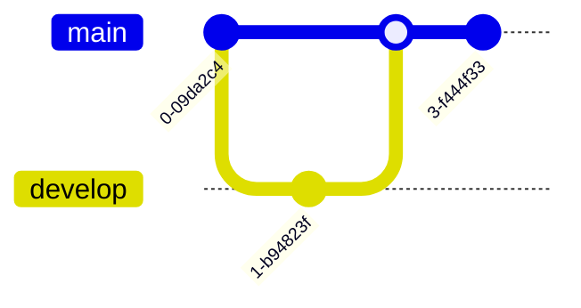
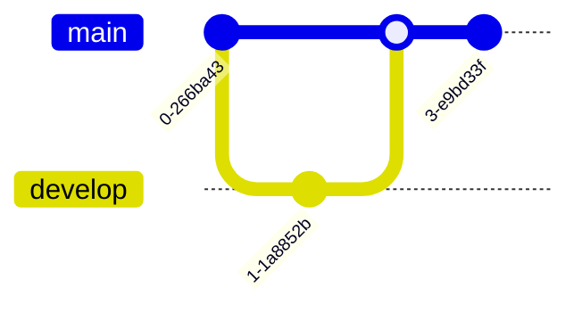

# Diagram and Schema Convention

This document defines when and how to use different diagram formats in the open-sharia-enterprise project. Understanding the appropriate format for each context ensures diagrams render consistently across all platforms where our documentation is viewed.

## 🎯 The Core Principle

**Mermaid diagrams are the primary and preferred format for all markdown files** in this repository, both inside and outside the `docs/` directory.

- **All markdown files**: Use Mermaid diagrams as the primary format
- **ASCII art**: Optional fallback for edge cases where Mermaid isn't supported (rarely needed)

## 💡 Why Mermaid First?

Mermaid diagram support has become ubiquitous across modern development tools:

### Wide Platform Support

- **GitHub**: Native Mermaid rendering in markdown files (since May 2021)
- **Text Editors**: VS Code, IntelliJ IDEA, Sublime Text (via plugins/extensions)
- **Obsidian**: Native rendering without plugins
- **Documentation Platforms**: GitLab, Notion, Confluence all support Mermaid
- **Mobile Apps**: GitHub mobile, Obsidian mobile render Mermaid correctly

### Advantages Over ASCII Art

1. **Professional Appearance**: Clean, crisp diagrams with proper styling
2. **Maintainability**: Text-based source is easier to edit than ASCII positioning
3. **Expressiveness**: Supports complex relationships (sequence diagrams, entity relationships, state machines)
4. **Interactive**: Many platforms allow zooming and inspection
5. **Accessible**: Screen readers can parse the source text structure

### When ASCII Art Is Still Useful

ASCII art is now **optional** and only recommended for rare edge cases:

- Terminal-only environments without rich markdown support
- Extremely limited bandwidth scenarios where rendering is disabled
- Simple directory tree structures (where ASCII is clearer than Mermaid)

**In practice**: Most users will view markdown files through GitHub, Obsidian, or modern text editors, all of which support Mermaid.

## 🎨 Mermaid Diagrams: Primary Format for All Markdown Files

### When to Use

Use Mermaid diagrams for **all markdown files** in the repository:

```
open-sharia-enterprise/
├── README.md              ← Use Mermaid
├── CLAUDE.md             ← Use Mermaid
├── CONTRIBUTING.md       ← Use Mermaid
├── docs/                 ← Use Mermaid
│   ├── tutorials/
│   ├── how-to/
│   ├── reference/
│   ├── explanation/
│   └── journals/
├── plans/                ← Use Mermaid
│   ├── in-progress/
│   ├── backlog/
│   └── done/
└── .github/              ← Use Mermaid
    └── *.md
```

### Why Mermaid?

1. **Universal Support** - GitHub, Obsidian, VS Code, and most platforms render Mermaid natively
2. **Rich Visuals** - Professional-looking diagrams with colors, shapes, and styling
3. **Interactive** - Diagrams can be zoomed and inspected
4. **Maintainable** - Text-based source is easy to version control and edit
5. **Powerful** - Supports flowcharts, sequence diagrams, class diagrams, entity relationships, state diagrams, and more
6. **Mobile-Friendly** - Renders beautifully on mobile devices (when using vertical orientation)

### Mermaid Syntax

Mermaid diagrams are defined in code blocks with the `mermaid` language identifier:

````markdown

````

### Common Mermaid Diagram Types

#### Flowchart

Perfect for processes, workflows, and decision trees:

````markdown

````


#### Sequence Diagram

Shows interactions between components over time:

````markdown

````


#### Class Diagram

Represents object-oriented structures and relationships:

````markdown

````


#### Entity Relationship Diagram

Shows database schema relationships:

````markdown

````


#### State Diagram

Illustrates state transitions in systems:

````markdown

````


#### Git Graph

Shows branch and merge history:

````markdown

````



### Diagram Orientation

**Mobile-First Orientation**: Diagrams should be styled vertically (top to bottom or bottom to top) for optimal mobile viewing:

- **Preferred**: `graph TD` (top-down) or `graph BT` (bottom-top)
- **Avoid when possible**: `graph LR` (left-right) or `graph RL` (right-left)
- **Exception**: Use horizontal orientation when vertical layout would significantly harm clarity or readability

**Rationale**: Mobile devices have vertical screens. Vertical diagrams are easier to view without horizontal scrolling.

**Example**:


### Mermaid Best Practices

1. **Keep it Simple** - Complex diagrams become hard to maintain
2. **Use Descriptive Labels** - Clear node names improve readability
3. **Add Comments** - Explain complex logic with inline comments
4. **Test Rendering** - Preview in Obsidian before committing
5. **Version Control Friendly** - Use consistent formatting for easier diffs
6. **Prefer Vertical Orientation** - Use top-down or bottom-top layouts for mobile-friendly viewing
7. **Use Color-Blind Friendly Colors** - Ensure diagrams are accessible to all users (see Color Accessibility below)

### Color Accessibility for Color Blindness

**CRITICAL REQUIREMENT**: All Mermaid diagrams MUST use color-blind friendly colors that work in both light and dark modes.

**Master Reference**: See [Color Accessibility Convention](./ex-co__color-accessibility.md) for the complete authoritative guide to color usage, including verified accessible palette, WCAG standards, testing methodology, and implementation details. This section provides a summary for diagram-specific context.

#### Why This Matters

Approximately 8% of males and 0.5% of females have some form of color blindness. Accessible diagrams benefit everyone with clearer, more professional appearance and ensure compliance with accessibility standards.

#### Color Blindness Types to Support

1. **Protanopia (red-blind)**: Cannot distinguish red/green, sees reds and greens as brownish-yellow
2. **Deuteranopia (green-blind)**: Cannot distinguish red/green, sees reds and greens as brownish-yellow
3. **Tritanopia (blue-yellow blind)**: Cannot distinguish blue/yellow, sees blues as pink and yellows as light pink

#### Accessible Color Palette

Use ONLY these proven accessible colors for Mermaid diagram elements:

**Recommended Colors (safe for all color blindness types):**

- **Blue**: `#0173B2` - Safe for all types, works in light and dark mode
- **Orange**: `#DE8F05` - Safe for all types, works in light and dark mode
- **Teal**: `#029E73` - Safe for all types, works in light and dark mode
- **Purple**: `#CC78BC` - Safe for all types, works in light and dark mode
- **Brown**: `#CA9161` - Safe for all types, works in light and dark mode
- **Black**: `#000000` - Safe for borders and text on light backgrounds
- **White**: `#FFFFFF` - Safe for text on dark backgrounds
- **Gray**: `#808080` - Safe for secondary elements

**DO NOT USE:**

- ❌ Red (`#FF0000`, `#E74C3C`, `#DC143C`) - Invisible to protanopia/deuteranopia
- ❌ Green (`#00FF00`, `#27AE60`, `#2ECC71`) - Invisible to protanopia/deuteranopia
- ❌ Yellow (`#FFFF00`, `#F1C40F`) - Invisible to tritanopia
- ❌ Light red/pink (`#FF69B4`, `#FFC0CB`) - Problematic for tritanopia
- ❌ Bright magenta (`#FF00FF`) - Problematic for all types

#### Dark and Light Mode Compliance

All colors must provide sufficient contrast in BOTH rendering modes:

**Light mode background**: White (`#FFFFFF`)
**Dark mode background**: Dark gray/black (`#1E1E2E`)

**Contrast Requirements (WCAG AA):**

- Minimum contrast ratio: **4.5:1** for normal text
- Large text (18pt+ or 14pt+ bold): **3:1**
- Element borders must be distinguishable by shape + color, not color alone

#### Shape Differentiation (Required)

**Never rely on color alone.** Always use multiple visual cues:

- Different node shapes (rectangle, circle, diamond, hexagon)
- Different line styles (solid, dashed, dotted)
- Clear text labels
- Icons or symbols where appropriate

#### Implementation Example

**Good Example (accessible):**

````markdown
<!-- Uses accessible colors: blue (#0173B2), orange (#DE8F05), teal (#029E73) -->


````

**Bad Example (not accessible):**

````markdown
<!-- Uses inaccessible colors: red and green -->

```mermaid
graph TD
		A["Success"]:::green
		B["Error"]:::red

		classDef green fill:#00FF00,stroke:#000000  ❌ Invisible to protanopia/deuteranopia
		classDef red fill:#FF0000,stroke:#000000    ❌ Invisible to protanopia/deuteranopia
```
````

#### Testing Requirements

All diagrams SHOULD be tested with color blindness simulators before publishing:

- **Simulators**: [Coblis Color Blindness Simulator](https://www.color-blindness.com/coblis-color-blindness-simulator/)
- **Contrast Checker**: [WebAIM Contrast Checker](https://webaim.org/resources/contrastchecker/)

**Testing Process:**

1. Create diagram with accessible color palette
2. Test in at least one color blindness simulator (protanopia, deuteranopia, or tritanopia)
3. Verify contrast ratios meet WCAG AA standards
4. Confirm shape differentiation is sufficient

#### Documentation Requirements

For each diagram using colors:

1. **Add comment** above diagram explaining the color scheme
   - Example: `<!-- Uses colors #0173B2 (blue), #DE8F05 (orange) for accessibility -->`
2. **Include labels** that don't rely solely on color
3. **Test verification** noted in diagram documentation (if applicable)

#### Key Implementation Points

When creating Mermaid diagrams:

- Use hex color codes (not CSS color names like "red", "green")
- Always include black borders (`#000000`) for shape definition
- Use white text (`#FFFFFF`) for dark-filled backgrounds
- Use black text (`#000000`) for light-filled backgrounds
- Define colors in `classDef` sections, not inline
- Ensure contrast ratios meet WCAG AA (4.5:1 for normal text)

### Mermaid Resources

- [Official Mermaid Documentation](https://mermaid.js.org/)
- [Mermaid Live Editor](https://mermaid.live/) - Test diagrams online
- [Obsidian Mermaid Docs](https://help.obsidian.md/Editing+and+formatting/Advanced+formatting+syntax#Diagram)
- [Coblis Color Blindness Simulator](https://www.color-blindness.com/coblis-color-blindness-simulator/) - Test diagrams for accessibility
- [WebAIM Contrast Checker](https://webaim.org/resources/contrastchecker/) - Verify WCAG compliance

## 📝 ASCII Art: Optional Fallback

### When to Use

ASCII art is now **optional** and should only be used when:

- **Directory tree structures**: Simple file/folder hierarchies (ASCII is often clearer than Mermaid for this specific use case)
- **Terminal-only contexts**: Rare situations where rich markdown rendering is completely unavailable
- **Personal preference**: When you find ASCII art clearer for a specific simple diagram

**Default recommendation**: Use Mermaid for all diagrams unless you have a specific reason to use ASCII art.

### Why ASCII Art Is Now Optional

With widespread Mermaid support across GitHub, Obsidian, VS Code, and other platforms, the original rationale for requiring ASCII art in files outside `docs/` no longer applies:

1. **GitHub Support**: GitHub has supported Mermaid natively since May 2021
2. **Editor Support**: Modern text editors (VS Code, IntelliJ, Sublime) all support Mermaid previews
3. **Mobile Support**: GitHub mobile and Obsidian mobile render Mermaid correctly
4. **Better Maintainability**: Mermaid is easier to update than manually positioned ASCII art

**Previous approach**: We required ASCII art for files outside `docs/` (README.md, CLAUDE.md, plans/) to ensure universal compatibility.

**Current approach**: Use Mermaid everywhere. ASCII art is a fallback option, not a requirement.

### ASCII Art Use Cases

#### Directory Structure

Perfect for showing file and folder hierarchies:

```
open-sharia-enterprise/
├── .claude/                   # Claude Code configuration
│   └── agents/               # Specialized AI agents
├── docs/                      # Documentation (Diátaxis framework)
│   ├── tutorials/            # Learning-oriented guides
│   ├── how-to/               # Problem-oriented guides
│   ├── reference/            # Technical reference
│   └── explanation/          # Conceptual documentation
├── src/                       # Source code
├── package.json              # Node.js manifest
└── README.md                 # Project README
```

#### Simple Diagrams

Basic flowcharts and relationships:

```
┌─────────────┐
│   Request   │
└──────┬──────┘
       │
       ▼
┌─────────────┐     ┌─────────────┐
│ Validation  │────▶│   Process   │
└─────────────┘     └──────┬──────┘
                           │
                           ▼
                    ┌─────────────┐
                    │  Response   │
                    └─────────────┘
```

#### Process Flow

Sequential steps with connectors:

```
User Action
    │
    ├──▶ Authentication Check
    │        │
    │        ├─ Success ──▶ Process Request ──▶ Return Result
    │        │
    │        └─ Failure ──▶ Return 401
    │
    └──▶ Log Event
```

#### Component Relationships

System architecture overview:

```
┌──────────────────────────────────────┐
│           Frontend (React)           │
└────────────┬─────────────────────────┘
             │
             ▼
┌──────────────────────────────────────┐
│         API Gateway (Express)        │
└─────┬──────────────┬─────────────────┘
      │              │
      ▼              ▼
┌─────────┐    ┌─────────────┐
│ Auth    │    │  Business   │
│ Service │    │  Logic      │
└─────────┘    └──────┬──────┘
                      │
                      ▼
               ┌─────────────┐
               │  Database   │
               └─────────────┘
```

#### Tables and Matrices

Structured data representation:

```
┌──────────────┬────────────┬──────────────┐
│   Category   │   Prefix   │   Example    │
├──────────────┼────────────┼──────────────┤
│  Tutorials   │    tu__    │  tu__start.md│
│  How-To      │   hoto__   │ hoto__api.md │
│  Reference   │    re__    │  re__spec.md │
│  Explanation │    ex__    │  ex__arch.md │
└──────────────┴────────────┴──────────────┘
```

### ASCII Art Best Practices

1. **Use Box-Drawing Characters** - `┌─┐│└┘├┤┬┴┼` for clean borders
2. **Consistent Spacing** - Align elements for better readability
3. **Test in Monospace** - Verify rendering in fixed-width fonts
4. **Keep it Simple** - Complex ASCII art is hard to maintain
5. **Comment Structure** - Add text labels for clarity

### ASCII Art Character Sets

Common characters for drawing:

```
Box Drawing:
┌ ┬ ┐   ╔ ╦ ╗
├ ┼ ┤   ╠ ╬ ╣
└ ┴ ┘   ╚ ╩ ╝
─ │     ═ ║

Arrows:
→ ← ↑ ↓ ↔ ↕
▶ ◀ ▲ ▼

Connectors:
┬ ┴ ├ ┤ ┼
╭ ╮ ╰ ╯
```

### ASCII Art Tools

- Manual creation in text editor with monospace font
- Online generators (limited utility)
- Terminal tools like `figlet` for text banners

## 🔍 Decision Matrix

Use this quick reference to choose the right format:

| File Location     | Primary Format | Alternative       | Notes                                           |
| ----------------- | -------------- | ----------------- | ----------------------------------------------- |
| `docs/**/*.md`    | **Mermaid**    | ASCII (optional)  | Native Obsidian rendering, rich visuals         |
| `README.md`       | **Mermaid**    | ASCII (optional)  | GitHub renders Mermaid natively                 |
| `CLAUDE.md`       | **Mermaid**    | ASCII (optional)  | Modern text editors support Mermaid             |
| `plans/**/*.md`   | **Mermaid**    | ASCII (optional)  | GitHub and editors render Mermaid               |
| `.github/**/*.md` | **Mermaid**    | ASCII (optional)  | GitHub Actions and web UI support Mermaid       |
| `CONTRIBUTING.md` | **Mermaid**    | ASCII (optional)  | Contributors use GitHub web or modern editors   |
| Directory trees   | **ASCII**      | Mermaid (complex) | ASCII is clearer for simple file/folder listing |

## 🧪 Examples in Context

### Example 1: API Flow in Documentation

**File**: `docs/explanation/architecture/ex-ar__request-flow.md`

**Use Mermaid**:

````markdown
## Request Processing Flow


````

### Example 2: Project Structure in README

**File**: `README.md`

**Recommended: Use Mermaid for Complex Diagrams**:

````markdown
## Project Architecture


````

**Alternative: Use ASCII for Simple Directory Trees**:

```markdown
## Project Structure

open-sharia-enterprise/
├── .claude/ # Claude Code configuration
├── docs/ # Documentation
│ ├── tutorials/ # Step-by-step guides
│ ├── how-to/ # Problem solutions
│ └── reference/ # Technical specs
├── src/ # Source code
└── package.json # Dependencies
```

### Example 3: State Machine in Tutorial

**File**: `docs/tutorials/transactions/tu-tr__transaction-lifecycle.md`

**Use Mermaid**:

````markdown
## Transaction States


````

### Example 4: Component Architecture in CLAUDE.md

**File**: `CLAUDE.md`

**Recommended: Use Mermaid**:

````markdown
## Agent Architecture


````

**Alternative: Use ASCII for Simple Hierarchies**:

```markdown
## Agent Architecture

Claude Code (Main Agent)
├── docs-maker.md (Documentation)
├── repo-rules-checker.md (Validation)
├── repo-rules-updater.md (Propagation)
└── plan-maker.md (Planning)
```

## Mixing Formats

**Prefer consistency within a single file**. Choose Mermaid as your primary format and use it throughout the file unless you have a specific reason to use ASCII art.

❌ **Avoid mixing unnecessarily**:

````markdown
## System Flow

```mermaid
graph TD
    A --> B
```

## Directory Structure

```
A
└── B
```

## Another Flow

A --> B (plain text - no format!)
````

✅ **Good - consistent Mermaid**:

````markdown
## System Flow

```mermaid
graph TD
    A[Component A] --> B[Component B]
```

## State Transitions

```mermaid
stateDiagram-v2
    [*] --> Active
    Active --> Inactive
```
````

✅ **Acceptable - intentional format choice**:

````markdown
## Architecture Diagram

```mermaid
graph TD
    A[API] --> B[Database]
```

## Project Structure (simple tree)

```
project/
├── src/
└── docs/
```
````

**Rationale**: Mermaid is preferred, but ASCII directory trees are acceptable when they're clearer for simple file/folder listings.

## Migration Strategy

### Upgrading ASCII to Mermaid (Recommended)

Since Mermaid is now the primary format, consider upgrading existing ASCII art diagrams to Mermaid for better maintainability and visual quality:

**When to upgrade**:

- Complex flowcharts or architecture diagrams currently in ASCII
- Diagrams that are hard to update due to ASCII positioning
- When adding new content to a file with ASCII diagrams (good time to upgrade all diagrams)

**When to keep ASCII**:

- Simple directory tree structures (ASCII is clearer)
- If the ASCII diagram is simple and works perfectly well

**Upgrade process**:

1. Identify the diagram type (flowchart, sequence, state machine, etc.)
2. Use appropriate Mermaid syntax
3. Test rendering on GitHub preview or Obsidian
4. Verify all relationships and labels are preserved
5. Keep vertical orientation (top-down or bottom-top) for mobile-friendliness

**Example upgrade**:

**Before (ASCII)**:

```
┌───────┐
│ Start │
└───┬───┘
    │
    ▼
┌─────────┐
│ Process │
└────┬────┘
     │
     ▼
┌─────┐
│ End │
└─────┘
```

**After (Mermaid - vertical orientation)**:

````markdown
```mermaid
graph TD
    A[Start] --> B[Process]
    B --> C[End]
```
````

### No Need to Convert Mermaid to ASCII

With widespread Mermaid support, there's no reason to convert Mermaid diagrams to ASCII art. If you encounter a situation where Mermaid doesn't render, consider:

1. Using a different viewing platform (GitHub web, VS Code, Obsidian)
2. Updating your editor/viewer to support Mermaid
3. Only in extreme edge cases: create an ASCII fallback

## Verification Checklist

Before committing documentation with diagrams:

- [ ] Primary format is Mermaid (unless specific reason for ASCII)
- [ ] Mermaid diagrams use vertical orientation (TD or BT) for mobile-friendliness
- [ ] Mermaid diagrams use color-blind friendly colors (only accessible palette)
- [ ] Colors work in both light and dark mode
- [ ] Shape differentiation used (not relying on color alone)
- [ ] Contrast ratios meet WCAG AA standards (4.5:1 for text)
- [ ] Color scheme documented in comment above diagram
- [ ] Mermaid diagrams tested in GitHub preview or Obsidian
- [ ] ASCII art (if used) verified in monospace font
- [ ] Format choice is intentional (not mixing Mermaid and ASCII unnecessarily)
- [ ] All labels and text are clear and readable
- [ ] Complex diagrams simplified where possible
- [ ] Diagram serves the documentation purpose
- [ ] Vertical orientation preferred (horizontal only if clarity requires it)

## 🔗 Related Documentation

- [Color Accessibility Convention](./ex-co__color-accessibility.md) - Master reference for accessible color palette, WCAG standards, and testing tools (comprehensive guide for all color usage)
- [File Naming Convention](./ex-co__file-naming-convention.md) - How to name documentation files
- [Linking Convention](./ex-co__linking-convention.md) - How to link between files
- [Diátaxis Framework](./ex-co__diataxis-framework.md) - Documentation organization principles
- [Conventions Index](./README.md) - Overview of all conventions

## 🌐 External Resources

- [Mermaid Official Documentation](https://mermaid.js.org/)
- [Mermaid Live Editor](https://mermaid.live/)
- [ASCII Art Generator](https://www.asciiart.eu/)
- [Box Drawing Unicode Characters](https://en.wikipedia.org/wiki/Box-drawing_characters)

---

**Last Updated**: 2025-12-04
