# Hugo Content Convention

This convention establishes comprehensive standards for creating and maintaining Hugo content in two repository sites:

- **ayokoding-web** - Educational platform using Hextra theme
- **ose-platform-web** - Project landing page using PaperMod theme

## Overview

Hugo content in this repository follows a layered convention approach:

1. **Inherited Conventions** (7) - Standards from docs/ that apply to Hugo content
2. **Adapted Conventions** (5) - Standards modified for Hugo's requirements
3. **Hugo-Specific Conventions** (6) - Unique to Hugo static site generation
4. **Theme-Specific Differences** (2) - Hextra vs PaperMod theme variations
5. **Site-Specific Differences** (2) - ayokoding-web vs ose-platform-web patterns

```mermaid
%% Color Palette: Blue #0173B2, Orange #DE8F05, Teal #029E73, Purple #CC78BC, Brown #CA9161 %%
graph TD
    A[Hugo Content Creation] --> B[Inherited Conventions<br/>7 standards from docs/]
    A --> C[Adapted Conventions<br/>5 modified standards]
    A --> D[Hugo-Specific Conventions<br/>6 unique to Hugo]
    A --> E[Theme-Specific Differences<br/>Hextra vs PaperMod]
    A --> F[Site-Specific Differences<br/>ayokoding vs ose-platform]

    B --> B1[Mathematical Notation]
    B --> B2[Color Accessibility]
    B --> B3[Diagrams]
    B --> B4[Emoji Usage]
    B --> B5[Timestamp Format]
    B --> B6[Tutorial Convention]
    B --> B7[Tutorial Naming]

    C --> C1[Indentation]
    C --> C2[Linking]
    C --> C3[File Naming]
    C --> C4[Frontmatter]
    C --> C5[Date Format]

    D --> D1[Archetypes]
    D --> D2[Shortcodes]
    D --> D3[Taxonomy]
    D --> D4[Asset Organization]
    D --> D5[Content Types]
    D --> D6[URL Structure]

    E --> E1[Hextra: FlexSearch, Tailwind]
    E --> E2[PaperMod: Share, Analytics]

    F --> F1[ayokoding: Bilingual, Learning]
    F --> F2[ose-platform: English, Updates]

    style B fill:#0173B2,stroke:#000,color:#fff
    style C fill:#DE8F05,stroke:#000,color:#000
    style D fill:#029E73,stroke:#000,color:#fff
    style E fill:#CC78BC,stroke:#000,color:#000
    style F fill:#CA9161,stroke:#000,color:#000
```



## Inherited Conventions

These conventions from `docs/` directory apply to Hugo content without modification.

### 1. Mathematical Notation Convention

**Reference**: [Mathematical Notation Convention](./ex-co__mathematical-notation.md)

**Application to Hugo**: Use LaTeX notation for all mathematical equations and formulas in Hugo content.

- **Inline math**: `$...$` for inline equations (e.g., $r_f$, $\beta$)
- **Display math**: `$$...$$` for block equations
- **Applies to**: Learning content in ayokoding-web (tutorials, technical explanations)

**Example (ayokoding-web learning content)**:

```markdown
The risk-free rate $r_f$ is typically represented using the formula:

$$
r_f = r_{real} + \pi
$$

where $\pi$ represents the expected inflation rate.
```

**Important**: Do NOT use LaTeX inside code blocks, Mermaid diagrams, or ASCII art.

### 2. Color Accessibility Convention

**Reference**: [Color Accessibility Convention](./ex-co__color-accessibility.md)

**Application to Hugo**: All Mermaid diagrams in Hugo content MUST use the verified accessible color palette.

**Accessible Color Palette**:

- Blue: `#0173B2`
- Orange: `#DE8F05`
- Teal: `#029E73`
- Purple: `#CC78BC`
- Brown: `#CA9161`

**Applies to**: All diagrams in both sites (ayokoding-web and ose-platform-web)

**Example**:

````markdown

````

````

**Never use**: Red, green, or yellow (invisible to color blindness types)

### 3. Diagrams Convention

**Reference**: [Diagrams and Schema Convention](./ex-co__diagrams.md)

**Application to Hugo**: Use Mermaid diagrams as primary format. Prefer vertical orientation (top-down) for mobile-friendly viewing.

**Applies to**: All visual content in both sites

**Diagram Types**:
- Flowcharts for processes
- Sequence diagrams for interactions
- Class diagrams for architecture
- State diagrams for workflows

**Example (ayokoding-web tutorial)**:

```markdown
```mermaid
%% Color Palette: Blue #0173B2, Orange #DE8F05, Teal #029E73, Purple #CC78BC, Brown #CA9161 %%
flowchart TD
    A[User Request] --> B{Authentication?}
    B -->|Yes| C[Access Granted]
    B -->|No| D[Access Denied]

    style A fill:#0173B2,stroke:#000,color:#fff
    style B fill:#DE8F05,stroke:#000,color:#000
    style C fill:#029E73,stroke:#000,color:#fff
    style D fill:#CC78BC,stroke:#000,color:#000
````

````

### 4. Emoji Usage Convention

**Reference**: [Emoji Usage Convention](./ex-co__emoji-usage.md)

**Application to Hugo**: Selective use of semantic emojis to enhance document scannability.

**Applies to**: Both ayokoding-web and ose-platform-web content

**Allowed Usage**:
- Section markers (✅ Success, ❌ Error, ⚠️ Warning)
- Status indicators (🚀 Launch, 🔧 Maintenance, 📊 Analytics)
- Category icons (📚 Tutorial, 🎯 Goal, 💡 Tip)

**Example (ose-platform-web update)**:

```markdown
## Release Update 🚀

✅ **Completed Features**
- User authentication system
- Dashboard analytics

⚠️ **Known Issues**
- Search optimization in progress
````

**Forbidden**: Overuse, decorative emojis without semantic meaning

### 5. Timestamp Format Convention

**Reference**: [Timestamp Format Convention](./ex-co__timestamp-format.md)

**Application to Hugo**: All timestamps MUST use ISO 8601 format with UTC+7 timezone.

**Format**: `YYYY-MM-DDTHH:MM:SS+07:00`

**Applies to**: All frontmatter date fields in both sites

**Example**:

```yaml
---
title: "Getting Started with Hugo"
date: 2025-12-07T14:30:00+07:00
lastmod: 2025-12-07T15:45:00+07:00
---
```

**Important**: Hugo's frontmatter parser requires this exact format. Do NOT omit the timezone offset.

### 6. Tutorial Convention

**Reference**: [Tutorial Convention](./ex-co__tutorials.md)

**Application to Hugo**: Applies to learning content in ayokoding-web only.

**Scope**: `apps/ayokoding-web/content/id/belajar/` and `apps/ayokoding-web/content/en/learn/`

**Key Requirements**:

- Progressive scaffolding (build on previous knowledge)
- Hands-on elements (code examples, exercises)
- Visual aids (diagrams, screenshots, code blocks)
- Clear learning objectives
- Narrative flow with context

**Example (ayokoding-web tutorial structure)**:

```markdown
---
title: "Building Your First API with Node.js"
date: 2025-12-07T10:00:00+07:00
draft: false
description: "Step-by-step tutorial for creating a REST API"
weight: 10
tags: ["nodejs", "api", "tutorial"]
categories: ["learn"]
author: "Wahid Fajar"
---

## What You'll Learn

By the end of this tutorial, you'll be able to:

- Create a basic Express.js server
- Define REST API endpoints
- Handle JSON requests and responses

## Prerequisites

Before starting, ensure you have:

- Node.js 18+ installed
- Basic JavaScript knowledge
- A code editor (VS Code recommended)

## Step 1: Project Setup

Let's start by creating a new project...
```

### 7. Tutorial Naming Convention

**Reference**: [Tutorial Naming Convention](./ex-co__tutorial-naming.md)

**Application to Hugo**: Use standardized tutorial types in ayokoding-web learning content.

**Scope**: ayokoding-web only (ose-platform-web does not use tutorials)

**Tutorial Types**:

- **Initial Setup** (0-5%) - Quick "Hello World" verification
- **Quick Start** (5-30%) - Learn enough to explore independently
- **Beginner** (0-60%) - Comprehensive foundation from scratch
- **Intermediate** (60-85%) - Professional-level expertise
- **Advanced** (85-95%) - Expert-level mastery
- **Cookbook** (Practical) - Day-to-day recipes and real-world problems

**Note**: Coverage percentages indicate depth/scope, NOT time required. See "No Time Estimates" convention below.

**Example (ayokoding-web file naming)**:

```
content/id/belajar/nodejs/
├── initial-setup.md           # Initial Setup tutorial
├── quick-start.md             # Quick Start tutorial
├── beginner-guide.md          # Beginner tutorial
└── cookbook/
    └── error-handling.md      # Cookbook recipe
```

### 8. No Time Estimates in Educational Content

**Reference**: [Content Quality Principles - No Time Estimates](./ex-co__content-quality.md#no-time-estimates)

**Application to Hugo**: Do NOT include time estimates in educational/tutorial content.

**Scope**: ayokoding-web learning content (`content/en/learn/`, `content/id/belajar/`)

**Rationale**:

- Time estimates create artificial pressure on learners
- Everyone learns at different speeds
- Focus on WHAT learners accomplish, not HOW LONG it takes
- Makes content evergreen (no need to update time claims)

**Forbidden in Hugo Content**:

❌ **Avoid**:

```markdown
This tutorial takes 2-3 hours to complete.
Duration: 45 minutes
Learn this in 30 minutes.
```

✅ **Good**:

```markdown
By the end of this tutorial, you'll be able to...
Coverage: 60-85% of domain knowledge (intermediate depth)
```

**Exception - Coverage Percentages Allowed**:

Coverage percentages indicate **depth/scope**, not **time**, so they're allowed:

- ✅ "Coverage: 0-5%" (initial setup scope)
- ✅ "Coverage: 60-85%" (intermediate depth)

## Adapted Conventions

These conventions from `docs/` are modified for Hugo's specific requirements.

### 1. Indentation Convention

**Reference**: [Journals Format Convention (Indentation)](./ex-co__journals-format.md)

**Adaptation for Hugo**:

- **YAML Frontmatter**: MUST use 2 spaces per indentation level (NOT tabs)
- **Markdown Content**: Standard markdown indentation (spaces or tabs acceptable)
- **Code Blocks**: Follow language-specific indentation (see convention doc)

**Why different from docs/?**

- docs/ uses TABs for markdown bullets (Logseq compatibility)
- Hugo content is published web content, not Obsidian vault
- Standard markdown practices apply

**Example (correct indentation)**:

```yaml
---
title: "My Post"
tags:
  - nodejs # 2 spaces before dash
  - javascript # 2 spaces before dash
categories:
  - tutorials
---
Content starts here with standard markdown indentation.

- Bullet points use spaces or tabs (both acceptable)
- Nested bullets follow standard markdown
```

❌ **Incorrect (tabs in frontmatter)**:

```yaml
---
title: "My Post"
tags:
	- nodejs        # TAB before dash - WRONG!
	- javascript
---
```

### 2. Linking Convention

**Reference**: [Linking Convention](./ex-co__linking-convention.md)

**Adaptation for Hugo**:

- **Internal Links**: Use absolute paths starting with `/` (e.g., `/learn/path`) WITHOUT `.md` extension
- **External Links**: Standard markdown `[text](url)`
- **Asset Links**: Reference `/images/` path (served from `static/`)

**Why different from docs/?**

- docs/ uses `.md` extensions for Obsidian compatibility
- Hugo generates URLs without `.md` extensions
- Using `.md` in Hugo links breaks in production builds

#### Internal Link Path Format

**CRITICAL RULE**: Always use **absolute paths** starting with `/` for internal content links. Never use relative paths (`./` or `../`).

**Why absolute paths?**

Hugo renders the same navigation content in different page contexts (sidebar, mobile menu, homepage). Relative links resolve differently depending on where they're rendered:

- From `/en/learn/` page: `./ai/` → `/en/learn/ai/` ✅
- From `/en/` homepage: `./ai/` → `/en/ai/` ❌ (broken)

Absolute paths work correctly from **any page context**.

**Correct (absolute paths)**:

```markdown
<!-- Hugo ref shortcode (recommended for validation) -->

Check out our [getting started guide]()

<!-- Absolute path without .md (works in all contexts) -->

[Chat with PDF](/learn/ai/chat-with-pdf)
[Software Engineering](/learn/swe)
[About Us](/about)

<!-- External link (standard markdown) -->

Visit [Hugo Documentation](https://gohugo.io/documentation/)

<!-- Image from static/ directory -->


```

❌ **Incorrect (relative paths or .md extension)**:

```markdown
<!-- WRONG! Relative paths break in different rendering contexts -->

[Chat with PDF](./ai/chat-with-pdf/)
[Software Engineering](../swe/)
[Advanced Guide](../../advanced/)

<!-- WRONG! Using .md extension breaks in production -->

[Tutorial](/learn/tutorial.md)
[Guide](./guide.md)
```

**Language Prefix**: Hugo handles language prefix automatically. Never include `/en/` or `/id/` in internal links:

```markdown
✅ Good: [Tutorial](/learn/nodejs)
❌ Bad: [Tutorial](/en/learn/nodejs) <!-- Hugo adds language prefix -->
```

**Lesson Learned**: This rule was discovered after navigation links broke on mobile in ayokoding-web. Links in `_index.md` files (navigation sections) must use absolute paths to ensure they work correctly when rendered in sidebar, mobile menu, and homepage contexts.

### 3. File Naming Convention

**Reference**: [File Naming Convention](./ex-co__file-naming-convention.md)

**Adaptation for Hugo**:

- **Content Files**: Use simple slugs or date-prefixed slugs (no prefix encoding)
- **Section Files**: Use `_index.md` for directory listings
- **URL Generation**: Hugo uses filename (minus extension) as URL slug

**Patterns**:

```
Hugo Content Naming Patterns:

1. Simple slug (most common):
   getting-started.md
   advanced-tutorial.md

2. Date-prefixed (blog posts):
   2025-12-07-release-update.md
   2025-11-15-feature-announcement.md

3. Section index:
   _index.md (lists content in directory)

4. Multi-language:
   about.id.md (Indonesian)
   about.en.md (English)
```

**Example (ayokoding-web structure)**:

```
content/
├── id/
│   ├── _index.md                      # Indonesian homepage
│   ├── belajar/
│   │   ├── _index.md                  # Learning section index
│   │   └── nodejs/
│   │       ├── _index.md              # Node.js topic index
│   │       ├── getting-started.md     # Simple slug
│   │       └── advanced-patterns.md   # Simple slug
└── en/
    └── learn/
        └── nodejs/
            └── getting-started.md     # English version
```

**Example (ose-platform-web structure)**:

```
content/
├── updates/
│   ├── _index.md                                 # Updates section index
│   ├── 2025-12-07-initial-release.md            # Date-prefixed
│   └── 2025-11-20-platform-announcement.md      # Date-prefixed
└── about.md                                      # Simple slug
```

### 4. Frontmatter Convention

**Format**: YAML (both sites use YAML, not TOML)

**Universal Required Fields**:

- `title` - Page title (string)
- `date` - Publication date (ISO 8601 with UTC+7)
- `draft` - Draft status (boolean)

**Common Optional Fields**:

- `description` - Page description (recommended 150-160 chars for SEO)
- `tags` - Content tags (array)
- `categories` - Content categories (array)
- `weight` - Page ordering (integer)

**Site-Specific Fields**: See "Site-Specific Differences" section below

**Important Site-Specific Rules**:

- **ayokoding-web**:
  - **Default**: Do NOT include `author:` field in frontmatter (site-level author configuration in `hugo.yaml` handles this globally via `params.author: "Wahidyan Kresna Fridayoka"`)
  - **Exceptions**: Author field IS allowed in:
    - `apps/ayokoding-web/content/en/rants/` - English rants may have different authors
    - `apps/ayokoding-web/content/id/celoteh/` - Indonesian rants may have different authors
  - **Rationale**: Site-level author handles most content; rants/celoteh may have guest contributors
- **ose-platform-web**: `author:` field is allowed and used per-post

**Example (ayokoding-web learning content)**:

```yaml
---
title: "Getting Started with TypeScript"
date: 2025-12-07T10:00:00+07:00
draft: false
description: "Learn TypeScript fundamentals and start building type-safe applications"
weight: 10
tags: ["typescript", "javascript", "tutorial"]
categories: ["learn"]
# Note: No author field - uses site-level config (params.author in hugo.yaml)
---
```

**Example (ose-platform-web update)**:

```yaml
---
title: "Platform Beta Release"
date: 2025-12-07T14:30:00+07:00
draft: false
tags: ["release", "announcement"]
categories: ["updates"]
summary: "Introducing the beta version of OSE Platform"
---
```

### 5. Date Format Convention

**Reference**: [Timestamp Format Convention](./ex-co__timestamp-format.md)

**Adaptation for Hugo**: Same as inherited convention, but emphasized here due to critical importance.

**REQUIRED Format**: `YYYY-MM-DDTHH:MM:SS+07:00` (ISO 8601 with UTC+7)

**Hugo Frontmatter Fields Using This Format**:

- `date` - Publication date (required)
- `lastmod` - Last modification date
- `publishDate` - Future publish date
- `expiryDate` - Content expiration date

**Example**:

```yaml
---
title: "My Post"
date: 2025-12-07T14:30:00+07:00
lastmod: 2025-12-07T15:45:00+07:00
---
```

**Why This Matters**:

- Hugo's frontmatter parser expects ISO 8601 format
- Timezone is REQUIRED for accurate timestamps
- UTC+7 is Western Indonesian Time (WIB) - repository standard

## Hugo-Specific Conventions

These conventions are unique to Hugo static site generation.

### 1. Archetypes

**Definition**: Content templates used to generate new files with pre-populated frontmatter.

**Location**: `archetypes/` directory in each Hugo site

**Usage**: `hugo new content/path/to/file.md --kind archetype-name`

**ayokoding-web Archetypes**:

1. **learn.md** - Educational/tutorial content (no author field - uses site-level config)

   ```yaml
   ---
   title: "{{ replace .File.ContentBaseName "-" " " | title }}"
   date: {{ .Date }}
   draft: true
   description: ""
   weight: 10
   tags: []
   categories: ["learn"]
   # Note: No author field - uses site-level config (params.author in hugo.yaml)
   ---
   ```

2. **celoteh.md** - Personal essays/rants (author field allowed - may have guest contributors)

   ```yaml
   ---
   title: "{{ replace .File.ContentBaseName "-" " " | title }}"
   date: {{ .Date }}
   draft: true
   description: ""
   tags: []
   categories: ["celoteh"]
   author: "Author Name"  # Optional - allowed in rants/celoteh directories
   ---
   ```

3. **konten-video.md** - Video content (no author field - uses site-level config)

   ```yaml
   ---
   title: "{{ replace .File.ContentBaseName "-" " " | title }}"
   date: {{ .Date }}
   draft: true
   description: ""
   tags: []
   categories: ["video"]
   videoUrl: ""
   # Note: No author field - uses site-level config (params.author in hugo.yaml)
   ---
   ```

4. **\_index.md** - Section index pages (title must match parent folder name exactly)
5. **default.md** - Default template

**ose-platform-web Archetypes**:

1. **default.md** - All content (updates, about)
   ```yaml
   ---
   title: "{{ replace .File.ContentBaseName "-" " " | title }}"
   date: {{ .Date }}
   draft: false
   tags: []
   categories: []
   summary: ""
   ---
   ```

### 2. Shortcodes

**Definition**: Reusable content snippets that generate HTML dynamically.

**Hugo Built-in Shortcodes**:

- `` - Internal content reference
- `` - Relative content reference
- `` - Image with caption
- `` - Syntax highlighting
- `` - Embed YouTube video
- `` - Embed tweet

**Hextra Theme Shortcodes** (ayokoding-web):

- `` - Highlighted callout boxes
- `` - Card grid layout
- `` - Collapsible content
- `` - File/directory tree visualization
- `` - Icon insertion
- `` - Numbered step sequence
- `` - Tabbed content

**Example (ayokoding-web using Hextra shortcodes)**:

```markdown

This is an informational callout using Hextra's callout shortcode.




### Step 1: Install Dependencies

Run `npm install` to install required packages.

### Step 2: Configure Settings

Edit the configuration file...


```

**PaperMod Theme Shortcodes** (ose-platform-web):

PaperMod is minimal and relies primarily on Hugo's built-in shortcodes:

```markdown


Check out our [getting started guide]()
```

### 3. Taxonomy

**Definition**: Classification system for content (tags, categories, series).

**Universal Taxonomy** (both sites):

- **tags**: Granular topics (e.g., "nodejs", "api", "tutorial")
- **categories**: Broad content groupings (e.g., "learn", "updates")

**Site-Specific Taxonomy**:

**ayokoding-web**:

- `categories: ["learn"]` - Educational content
- `categories: ["celoteh"]` - Personal essays
- `categories: ["video"]` - Video content

**ose-platform-web**:

- `categories: ["updates"]` - Platform updates
- `series: ["getting-started"]` - Multi-part series (optional)

**Example (ayokoding-web)**:

```yaml
---
title: "Understanding Async/Await in JavaScript"
tags: ["javascript", "async", "promises", "tutorial"]
categories: ["learn"]
---
```

**Example (ose-platform-web)**:

```yaml
---
title: "Platform Architecture Overview - Part 1"
tags: ["architecture", "system-design"]
categories: ["updates"]
series: ["platform-architecture"]
---
```

### 4. Asset Organization

**Static Assets Location**: `static/` directory (served at site root)

**Recommended Structure**:

```
static/
├── images/
│   ├── screenshots/
│   ├── diagrams/
│   ├── logos/
│   └── posts/
│       └── 2025/
│           └── 12/
│               └── post-specific-image.png
├── casts/                    # Asciinema recordings (ose-platform-web)
├── downloads/                # Downloadable files
└── fonts/                    # Custom fonts (if needed)
```

**Image References in Content**:

```markdown
<!-- Absolute path from static/ root -->


<!-- Using Hugo figure shortcode -->


```

**Alt Text Requirement**: All images MUST have descriptive alt text for accessibility.

### 5. Content Types

**Regular Content Files**: `file-name.md`

- Individual pages or posts
- Display full content
- Appear in lists and navigation

**Section Index Files**: `_index.md`

- List pages for a directory
- Can include intro content
- Generate taxonomy pages

**Index File Title Rule** (ayokoding-web):

- The `title` field in `_index.md` frontmatter MUST exactly match the parent folder name (case-sensitive)
- **Rationale**: Consistency and simplicity in navigation structure
- **Example**: File at `/content/en/learn/swe/lang/_index.md` must have `title: Lang` (not "Programming Languages")

✅ **Good**:

```yaml
# File: content/en/learn/swe/lang/_index.md
---
title: Lang # Matches parent folder name exactly
---
```

❌ **Bad**:

```yaml
# File: content/en/learn/swe/lang/_index.md
---
title: Programming Languages # WRONG! Doesn't match folder name
---
```

**Uppercase Convention**: Folder names determine titles. If folder is `lang`, title is `Lang` (capitalize first letter). If folder is `business-law`, title is `Business-law` (capitalize only first word's first letter).

**Example Mappings**:

- Folder `lang` → Title `Lang`
- Folder `swe` → Title `Swe`
- Folder `business-law` → Title `Business-law`
- Folder `crash-courses` → Title `Crash-courses`

**Index File Navigation Depth** (ayokoding-web):

- `_index.md` files MUST display navigation links **3 layers deep** (parent + children + grandchildren)
- **Layer 1**: Parent section/category (current level)
- **Layer 2**: Children (immediate subsections)
- **Layer 3**: Grandchildren (subsections of children)
- **Rationale**: Provides comprehensive navigation hierarchy, helps users discover deeply nested content without clicking through multiple pages, improves content discoverability and UX
- **Applies to**: All `_index.md` files in `apps/ayokoding-web/content/en/learn/` and `apps/ayokoding-web/content/id/belajar/`

✅ **Good (3 layers deep)**:

```markdown
<!-- File: apps/ayokoding-web/content/en/learn/_index.md -->

- [Software Engineering](/learn/swe)
  - [Programming Languages](/learn/swe/prog-lang)
    - [JavaScript](/learn/swe/prog-lang/javascript)
    - [TypeScript](/learn/swe/prog-lang/typescript)
  - [System Design](/learn/swe/system-design)
    - [Fundamentals](/learn/swe/system-design/fundamentals)
- [AI Engineering](/learn/ai)
  - [Chat with PDF](/learn/ai/chat-with-pdf)
- [Human](/learn/human)
  - [Tools](/learn/human/tools)
    - [CliftonStrengths](/learn/human/tools/cliftonstrengths)
```

❌ **Bad (only 2 layers - missing grandchildren)**:

```markdown
<!-- WRONG! Stops at children, doesn't show grandchildren -->

- [Software Engineering](/learn/swe)
  - [Programming Languages](/learn/swe/prog-lang)
  - [System Design](/learn/swe/system-design)
- [AI Engineering](/learn/ai)
  - [Chat with PDF](/learn/ai/chat-with-pdf)
```

❌ **Bad (only 1 layer - no hierarchy)**:

```markdown
<!-- WRONG! No children or grandchildren shown -->

- [Software Engineering](/learn/swe)
- [AI Engineering](/learn/ai)
- [Human](/learn/human)
```

**Important**: This rule applies to navigation sections in `_index.md` files. Regular content pages do not require this hierarchy depth.

**Example (ayokoding-web directory structure)**:

```
content/id/belajar/
├── _index.md                           # Learning section index
├── nodejs/
│   ├── _index.md                       # Node.js topic index
│   ├── getting-started.md              # Regular content
│   └── advanced-patterns.md            # Regular content
└── typescript/
    ├── _index.md                       # TypeScript topic index
    └── basics.md                       # Regular content
```

**\_index.md vs Regular Content**:

```yaml
# _index.md (section index)
---
title: "Node.js Learning Resources"
description: "Comprehensive Node.js tutorials and guides"
---
Browse our Node.js learning materials below.
# regular file (e.g., getting-started.md)
---
title: "Getting Started with Node.js"
date: 2025-12-07T10:00:00+07:00
draft: false
---
This tutorial covers...
```

### 6. URL Structure

**Hugo URL Generation**:

- Filename (minus extension) becomes URL slug
- Directory structure reflects URL path
- Configured via `hugo.yaml` (permalink patterns)

**ayokoding-web URL Patterns**:

```
content/id/belajar/nodejs/getting-started.md
→ URL: https://ayokoding.com/id/belajar/nodejs/getting-started

content/en/learn/typescript/basics.md
→ URL: https://ayokoding.com/en/learn/typescript/basics
```

**ose-platform-web URL Patterns**:

```
content/updates/2025-12-07-initial-release.md
→ URL: https://oseplatform.com/updates/2025-12-07-initial-release

content/about.md
→ URL: https://oseplatform.com/about
```

**Custom URLs** (using frontmatter):

```yaml
---
title: "About Us"
url: "/about/" # Override default URL
slug: "company-info" # Override slug only (keeps path)
---
```

## Theme-Specific Differences

### Hextra Theme (ayokoding-web)

**Official Documentation**: [Hextra Docs](https://imfing.github.io/hextra/docs/)
**GitHub**: [imfing/hextra](https://github.com/imfing/hextra)
**Last Updated**: 2025-09-06 | **GitHub Stars**: 1,789

**Description**: Modern, fast, batteries-included Hugo theme built with Tailwind CSS for documentation, blogs, and static websites.

**Key Features**:

- **Search**: Offline full-text search via FlexSearch (no additional configuration)
- **Design**: Tailwind CSS with responsive layout and dark mode support
- **Performance**: Lightning-fast static-site generator, no JavaScript/Node.js required
- **Content**: Markdown, syntax highlighting, LaTeX math formulae, diagrams, shortcodes
- **Multilingual**: Built-in multi-language support (English, Farsi, Japanese, Simplified Chinese)
- **Navigation**: Auto-generated table of contents, breadcrumbs, pagination, sidebar
- **SEO**: Out-of-the-box SEO tags, Open Graph, Twitter Cards

**Hextra-Specific Frontmatter Fields**:

```yaml
---
title: "Page Title"
sidebar:
  exclude: true # Exclude from left sidebar
toc: false # Disable table of contents
editURL: "https://..." # Custom edit link
excludeSearch: true # Exclude from FlexSearch index
noindex: true # Block Google Search indexing
params:
  images: ["image-url"] # Open Graph images
  audio: "audio-file.mp3" # Open Graph audio
  videos: ["video-url"] # Open Graph videos
---
```

**Hextra Shortcodes**:

```markdown

Important information here









### Step 1

First step content

### Step 2

Second step content

```

**Content Structure**:

- Main sidebar auto-generates from content directory structure
- Blog posts organized by year/month: `content/posts/2025/02/post-name.md`
- Navigation via `prev`/`next` frontmatter fields

### PaperMod Theme (ose-platform-web)

**Official Documentation**: [PaperMod Site](https://adityatelange.github.io/hugo-PaperMod/)
**GitHub**: [adityatelange/hugo-PaperMod](https://github.com/adityatelange/hugo-PaperMod)
**Last Updated**: 2025-10-26 | **GitHub Stars**: 12,755
**Theme Version Compatibility**: Targets v7.0+, compatible with v8.0

**Description**: Fast, clean, responsive Hugo theme based on hugo-paper, focused on simplicity with useful features.

**Key Features**:

- **Design**: Clean, simple, fast, and responsive
- **Theme Support**: Light/dark mode with localStorage preference
- **Navigation**: Smooth scrolling, breadcrumbs, archive, search
- **Social**: Share buttons for multiple platforms
- **SEO**: Built-in SEO optimization
- **Accessibility**: Reduced-motion support, semantic HTML
- **Analytics**: Google Analytics, Bing, Yandex site verification

**PaperMod-Specific Frontmatter Fields**:

```yaml
---
title: "Post Title"
date: 2025-12-07T14:30:00+07:00
draft: false
description: "Post description" # Subtitle/description
summary: "Brief summary" # For list pages
showtoc: true # Enable table of contents
tocopen: false # ToC collapsed by default
hidemeta: false # Show post metadata
comments: true # Show comments section
searchHidden: false # Include in search
hideSummary: false # Show in lists
author: "Author Name" # Single or multiple authors
weight: 1 # Page order/pin position
canonicalURL: "https://..." # Canonical link
robotsNoIndex: false # Exclude from indexing
cover:
  image: "/images/cover.png" # Cover image
  caption: "Image caption" # Cover caption
  alt: "Image description" # Alt text
  relative: false # Use relative paths
  responsiveImages: true # Generate responsive variants
  hidden: false # Hide on current page
tags: ["tag1", "tag2"]
categories: ["updates"]
---
```

**PaperMod Site Configuration** (hugo.yaml examples):

```yaml
params:
  env: production
  ShowReadingTime: true
  ShowShareButtons: true
  ShowCodeCopyButtons: true
  ShowPostNavLinks: true
  ShowBreadCrumbs: true
  defaultTheme: auto # light/dark/auto
  ShareButtons: # Customize share platforms
    - twitter
    - linkedin
    - reddit
```

**Content Organization**:

- Simple flat structure for updates and about pages
- Standard Hugo content organization
- Clean URL structure

### Theme Comparison Table

| Aspect           | Hextra (ayokoding-web)                               | PaperMod (ose-platform-web)            |
| ---------------- | ---------------------------------------------------- | -------------------------------------- |
| **Style**        | Documentation/educational (Tailwind CSS)             | Clean blog/landing page                |
| **GitHub Stars** | 1,789                                                | 12,755                                 |
| **Last Updated** | 2025-09-06                                           | 2025-10-26                             |
| **Search**       | FlexSearch (offline)                                 | Fuse.js search                         |
| **Shortcodes**   | callout, cards, details, filetree, icon, steps, tabs | Relies on Hugo built-ins               |
| **Navigation**   | Auto-sidebar, prev/next, breadcrumbs                 | Breadcrumbs, archive, smooth scrolling |
| **SEO**          | Open Graph, Twitter Cards                            | Built-in SEO optimization              |
| **Multilingual** | Built-in support                                     | Supported                              |
| **Complexity**   | Feature-rich, many options                           | Simple, minimal configuration          |
| **Best For**     | Documentation, technical learning content            | Blog, portfolio, project landing page  |

## Site-Specific Differences

### ayokoding-web (Educational Platform)

**Theme**: Hextra
**Purpose**: Bilingual educational platform for Indonesian developers
**Languages**: Indonesian (id) and English (en)

**Content Structure**:

```
content/
├── id/                                    # Indonesian content
│   ├── _index.md
│   ├── belajar/                           # Learning (Indonesian)
│   │   ├── _index.md
│   │   ├── nodejs/
│   │   └── typescript/
│   ├── celoteh/                           # Personal essays (Indonesian)
│   └── konten-video/                      # Video content (Indonesian)
└── en/                                    # English content
    ├── _index.md
    ├── learn/                             # Learning (English)
    ├── rants/                             # Personal essays (English)
    └── video-content/                     # Video content (English)
```

**Archetypes** (5 total):

1. `learn.md` - Educational/tutorial content
2. `celoteh.md` - Personal essays/rants
3. `konten-video.md` - Video content
4. `_index.md` - Section index pages
5. `default.md` - Default template

**Frontmatter Pattern** (learn archetype - no author field):

```yaml
---
title: "Understanding TypeScript Generics"
date: 2025-12-07T10:00:00+07:00
draft: false
description: "Master TypeScript generics with practical examples"
weight: 15
tags: ["typescript", "generics", "advanced"]
categories: ["learn"]
# Note: No author field - uses site-level config (params.author: "Wahidyan Kresna Fridayoka")
---
```

**Frontmatter Pattern** (celoteh archetype - author field optional):

```yaml
---
title: "Why I Switched to Neovim"
date: 2025-12-07T11:30:00+07:00
draft: false
description: "Personal reflections on developer tooling"
tags: ["tools", "productivity", "opinion"]
categories: ["celoteh"]
author: "Wahidyan Kresna Fridayoka" # Optional - allowed in rants/celoteh only
---
```

**Asset Organization**:

```
static/
└── images/
    ├── learn/
    │   └── typescript/
    ├── celoteh/
    └── video-content/
```

**Taxonomy**:

- **tags**: Granular topics (e.g., "nodejs", "api", "tutorial", "beginner")
- **categories**: Fixed set - `["learn"]`, `["celoteh"]`, `["video"]`

**Tutorial Content** (applies Tutorial Convention):

- Located in `id/belajar/` (Indonesian) and `en/learn/` (English)
- Follows Tutorial Naming Convention (Initial Setup, Quick Start, Beginner, etc.)
- Uses progressive scaffolding and hands-on elements
- Includes visual aids and code examples

### ose-platform-web (Project Landing Page)

**Theme**: PaperMod v7.0+ (compatible with v8.0)
**Purpose**: English-only project landing page with progress updates
**Languages**: English only

**Content Structure**:

```
content/
├── updates/                               # Platform updates
│   ├── _index.md
│   ├── 2025-12-07-initial-release.md
│   └── 2025-11-20-announcement.md
└── about.md                               # About page
```

**Archetypes** (1 total):

1. `default.md` - All content types

**Frontmatter Pattern** (updates):

```yaml
---
title: "OSE Platform Beta Release"
date: 2025-12-07T14:30:00+07:00
draft: false
tags: ["release", "beta", "announcement"]
categories: ["updates"]
summary: "Introducing the beta version of Open Sharia Enterprise Platform"
showtoc: true
cover:
  image: "/images/beta-release.png"
  alt: "OSE Platform Dashboard Screenshot"
---
```

**Frontmatter Pattern** (about page):

```yaml
---
title: "About OSE Platform"
url: "/about/"
summary: "Learn about Open Sharia Enterprise Platform"
showtoc: false
---
```

**Asset Organization**:

```
static/
├── images/
│   ├── updates/
│   └── about/
└── casts/                    # Asciinema recordings
```

**Taxonomy**:

- **tags**: Flexible topics (e.g., "release", "feature", "announcement")
- **categories**: Primarily `["updates"]`
- **series**: Optional multi-part series (e.g., "platform-architecture")

**No Tutorial Content**: Does not use Tutorial Convention (updates and about pages only)

### Site Comparison Table

| Aspect                     | ayokoding-web                                            | ose-platform-web                           |
| -------------------------- | -------------------------------------------------------- | ------------------------------------------ |
| **Theme**                  | Hextra                                                   | PaperMod                                   |
| **Languages**              | Bilingual (Indonesian/English)                           | English only                               |
| **Content Types**          | Learning, essays, video content                          | Updates, about page                        |
| **Content Structure**      | Deep hierarchy (learn/archived/crash-courses/...)        | Flat (updates/, about.md)                  |
| **Archetypes**             | 5 types (learn, celoteh, konten-video, \_index, default) | 1 type (default)                           |
| **Primary Purpose**        | Educational platform for developers                      | Project landing & progress updates         |
| **Target Audience**        | Indonesian developers (bilingual)                        | Enterprise users (international)           |
| **Tutorial Content**       | Yes (id/belajar/, en/learn/)                             | No (not applicable)                        |
| **Navigation**             | Auto-sidebar, prev/next, breadcrumbs                     | Breadcrumbs, archive, smooth scrolling     |
| **Frontmatter Complexity** | More fields (weight, categories, author, sidebar)        | Simpler (tags, categories, summary, cover) |

## Configuration Highlights

This section documents important hugo.yaml configuration patterns for both sites.

### ayokoding-web Configuration (Hextra Theme)

**Language Configuration**:

```yaml
defaultContentLanguage: id
defaultContentLanguageInSubdir: true

languages:
  id:
    languageName: "Bahasa Indonesia"
    languageCode: "id-ID"
    weight: 1
  en:
    languageName: "English"
    languageCode: "en-US"
    weight: 2
```

**Key Points**:

- Default language is Indonesian (`id`)
- Both languages get subdirectories (`/id/`, `/en/`)
- Language codes use ISO format (`id-ID`, `en-US`)

**Module Mounts** (content organization):

```yaml
module:
  imports:
    - path: github.com/imfing/hextra
  mounts:
    - source: content/en
      target: content
      lang: en
    - source: content/id
      target: content
      lang: id
```

**LaTeX Math Rendering**:

```yaml
markup:
  goldmark:
    extensions:
      passthrough:
        delimiters:
          block: [["$$", "$$"]]
          inline: [["$", "$"]]
        enable: true

params:
  math:
    enable: true
    engine: katex
```

**FlexSearch Configuration** (offline search):

```yaml
params:
  search:
    enable: true
    type: flexsearch
    flexsearch:
      index: content # Index full content
      tokenize: full # Full tokenization
```

**SEO & Author Configuration**:

```yaml
params:
  # Site-level author (used when content doesn't have author field)
  author: "Wahidyan Kresna Fridayoka"

  # Default Open Graph image
  images:
    - /logo.png

  # Social media profiles
  social:
    threads: "https://www.threads.net/@wahidyankf"
    github: "https://github.com/wahidyankf/open-sharia-enterprise"
    youtube: "https://www.youtube.com/@AyoKoding"
```

**Important**: The `params.author` field serves as the default author for ALL content. Individual content files should NOT include `author:` in frontmatter unless they have guest contributors (rants/celoteh only).

**Sitemap & SEO**:

```yaml
sitemap:
  changefreq: weekly
  filename: sitemap.xml
  priority: 0.5

services:
  googleAnalytics:
    ID: G-1NHDR7S3GV

privacy:
  googleAnalytics:
    anonymizeIP: true
    respectDoNotTrack: true
```

### ose-platform-web Configuration (PaperMod Theme)

**Basic Configuration**:

```yaml
baseURL: "https://oseplatform.com/"
title: "OSE Platform"
languageCode: "en-us"
defaultContentLanguage: "en"

theme: "PaperMod"
```

**PaperMod-Specific Parameters**:

```yaml
params:
  env: production
  author: "OSE Platform Team"

  # Content display
  ShowReadingTime: true
  ShowShareButtons: true
  ShowCodeCopyButtons: true
  ShowPostNavLinks: true
  ShowBreadCrumbs: true

  # Theme
  defaultTheme: auto # light/dark/auto

  # Social sharing
  ShareButtons:
    - twitter
    - linkedin
    - reddit
```

**Home Page Configuration**:

```yaml
params:
  homeInfoParams:
    Title: "Welcome to OSE Platform"
    Content: "Open Sharia Enterprise Platform documentation and updates"

  socialIcons:
    - name: github
      url: "https://github.com/wahidyankf/open-sharia-enterprise"
    - name: twitter
      url: "https://twitter.com/oseplatform"
```

**Cover Image Defaults**:

```yaml
params:
  cover:
    responsiveImages: true
    hidden: false
    linkFullImages: true
```

### Configuration Comparison

| Aspect               | ayokoding-web (Hextra)                   | ose-platform-web (PaperMod)        |
| -------------------- | ---------------------------------------- | ---------------------------------- |
| **Language Support** | Bilingual (id/en) with subdirs           | English only                       |
| **Theme Import**     | Hugo module (`github.com/imfing/hextra`) | Traditional theme folder           |
| **Search**           | FlexSearch (offline, content indexing)   | Fuse.js (default PaperMod search)  |
| **Math Rendering**   | KaTeX (LaTeX passthrough enabled)        | Not configured                     |
| **Author Config**    | `params.author` (site-level default)     | `params.author` (per-post typical) |
| **Social Sharing**   | Via theme defaults                       | Configurable ShareButtons          |
| **Analytics**        | Google Analytics (anonymized)            | Google Analytics (standard)        |
| **Content Mounting** | Custom mounts per language               | Standard Hugo content directory    |
| **Home Page**        | Auto-generated from content              | homeInfoParams configuration       |
| **Cover Images**     | Not emphasized                           | Built-in cover image support       |

## Content Creation Workflow

### Creating New Content (ayokoding-web)

```bash
# Create learning content (Indonesian)
hugo new content/id/belajar/nodejs/getting-started.md --kind learn

# Create learning content (English)
hugo new content/en/learn/nodejs/getting-started.md --kind learn

# Create personal essay (Indonesian)
hugo new content/id/celoteh/my-thoughts.md --kind celoteh

# Create section index
hugo new content/id/belajar/rust/_index.md --kind _index
```

### Creating New Content (ose-platform-web)

```bash
# Create update post
hugo new content/updates/2025-12-07-feature-release.md

# Create about page
hugo new content/about.md
```

### Content Validation Checklist

Before publishing, verify:

- [ ] Frontmatter uses YAML format with 2-space indentation
- [ ] Date format is `YYYY-MM-DDTHH:MM:SS+07:00`
- [ ] Description length is 150-160 characters (if present)
- [ ] Internal links use ref/relref or paths without `.md` extension
- [ ] All images have descriptive alt text
- [ ] Mermaid diagrams use accessible color palette
- [ ] Tags and categories are properly formatted arrays
- [ ] Draft status is set correctly (`draft: true/false`)
- [ ] Content follows site-specific archetype patterns
- [ ] Assets are organized in appropriate `static/` subdirectories

## References

**Inherited Conventions**:

- [Mathematical Notation Convention](./ex-co__mathematical-notation.md)
- [Color Accessibility Convention](./ex-co__color-accessibility.md)
- [Diagrams and Schema Convention](./ex-co__diagrams.md)
- [Emoji Usage Convention](./ex-co__emoji-usage.md)
- [Timestamp Format Convention](./ex-co__timestamp-format.md)
- [Tutorial Convention](./ex-co__tutorials.md)
- [Tutorial Naming Convention](./ex-co__tutorial-naming.md)

**Related Conventions**:

- [File Naming Convention](./ex-co__file-naming-convention.md)
- [Linking Convention](./ex-co__linking-convention.md)
- [Journals Format Convention](./ex-co__journals-format.md) (indentation reference)

**External Resources**:

- [Hugo Documentation](https://gohugo.io/documentation/)
- [Hextra Theme Documentation](https://imfing.github.io/hextra/docs/)
- [PaperMod Theme Documentation](https://adityatelange.github.io/hugo-PaperMod/)

**AI Agents for Hugo Content**:

- [ayokoding-content-maker](../../.claude/agents/ayokoding-content-maker.md) - Creates ayokoding-web content
- [ayokoding-content-checker](../../.claude/agents/ayokoding-content-checker.md) - Validates ayokoding-web content
- [ose-platform-web-content-maker](../../.claude/agents/ose-platform-web-content-maker.md) - Creates ose-platform-web content
- [ose-platform-web-content-checker](../../.claude/agents/ose-platform-web-content-checker.md) - Validates ose-platform-web content
