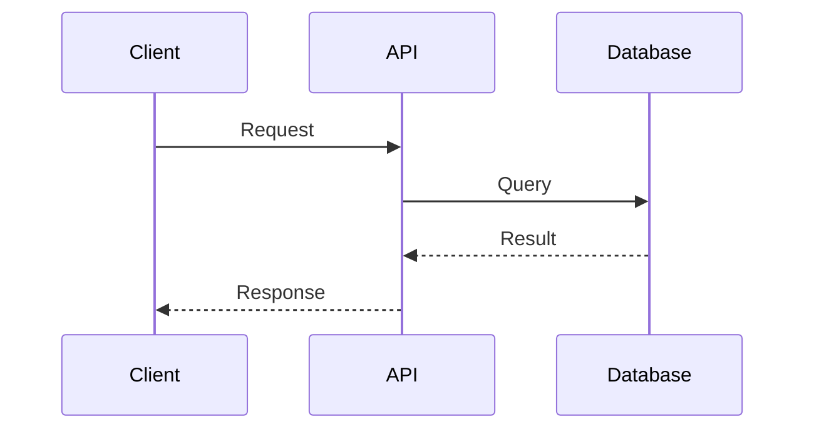

# Journals Format Convention

This document defines the Logseq-style outliner format used for all journal entries in the `docs/journals/` directory. Unlike formal documentation which uses traditional markdown structure, journals use a bullet-based outliner format optimized for quick capture, research notes, and progressive thinking.

## 📋 Overview

The journals format serves three critical purposes:

1. **Quick Capture** - Rapidly document thoughts, findings, and insights without formal structure overhead
2. **Progressive Elaboration** - Easily nest and reorganize ideas as understanding evolves
3. **Knowledge Connectivity** - Build a knowledge graph through markdown links while maintaining flexibility

## 🎯 Scope

This format convention applies **exclusively to files in `docs/journals/`**:

- `docs/journals/YYYY-MM/YYYY-MM-DD.md` - Daily research notes
- `docs/journals/YYYY-MM/summary.md` - Monthly project summaries (optional)

**Not applicable to:**

- Formal documentation (`tutorials/`, `how-to/`, `reference/`, `explanation/`) - Uses traditional markdown structure
- Plans (`plans/` folder) - Uses traditional markdown structure
- Root-level files (`README.md`, `CLAUDE.md`, etc.) - Uses traditional markdown structure

## 💡 The Core Principle

Journals use **Logseq-style outliner format** where content is structured as nested bullets rather than traditional paragraphs and sections. This format:

- Optimizes for speed of capture over polish
- Enables non-linear thinking and exploration
- Simplifies reorganization and refactoring of ideas
- Works seamlessly in both Obsidian and Logseq

### Why Outliner Format for Journals?

**Traditional markdown** (used in formal docs) is excellent for:

- Polished, linear content
- Long-form writing
- Published documentation

**Outliner format** (used in journals) excels at:

- Research notes and daily logs
- Evolving understanding of topics
- Quick capture during exploration
- Progressive elaboration of concepts

This distinction keeps journals agile and explorative while maintaining formal documentation standards elsewhere.

## 📝 Basic Structure

### Daily Entry Template

```markdown
- Research topic or area #tag1 #tag2
  - Key finding or insight
    - Supporting detail or evidence
    - Related observation
  - Another key point
    - Nested elaboration
- Different research area #tag3
  - Finding
  - Question or next step
    - Potential approach
- Connections and synthesis
  - Link to previous work: [heading](./YYYY-MM-DD.md#heading)
  - Reference to plan: [Plan](../../plans/in-progress/project/README.md)
```

### Core Rules

1. **No H1 heading** - Do NOT include `# YYYY-MM-DD` at the start (Obsidian displays filename as page title, creating visual duplication)
2. **Start directly with content** - First line should be a bullet point or content (not a heading)
3. **Everything is bullets** - All content uses bullet points (`-`)
4. **Nest freely** - Use indentation to show relationships and hierarchy
5. **No subheadings** - Don't use `##`, `###`, etc. Use bullet text to identify topics
6. **Tags anywhere** - Use `#tags` inline within bullets
7. **Link liberally** - Connect to other entries and documents

## 🧪 Detailed Examples

### Example 1: Research Session

```markdown
- Exploring authentication patterns for microservices #auth #microservices #research
  - OAuth 2.0 seems most suitable for our use case
    - Authorization code flow for web apps
    - Client credentials flow for service-to-service
    - Need to evaluate token storage strategies
      - HttpOnly cookies vs localStorage
      - Security implications of each approach
  - Key security considerations
    - Token expiration and refresh strategy
    - PKCE extension for public clients
    - Scope management for fine-grained permissions
  - Questions to resolve
    - Should we use opaque tokens or JWT?
    - How to handle token revocation?
    - Integration with existing session management?
- Related to previous work on [api-security](./2025-11-20.md#api-security)
- See also: [Auth System Plan](../../plans/in-progress/2025-11-24__auth-system/README.md)
- Next steps
  - Prototype OAuth flow with PKCE
  - Evaluate token storage options
  - Review security best practices documentation

#authentication #oauth #security
```

### Example 2: Daily Development Log

```markdown
- Fixed bug in transaction validation #bugfix #transactions
  - Issue: Validation was failing for edge case with zero amounts
    - Root cause: Strict inequality check `amount > 0`
    - Should allow zero for some transaction types
  - Solution: Added transaction type checking before amount validation
    - Refunds and corrections can have zero amount
    - Regular transactions must be positive
  - Commits: `a1b2c3d`, `e4f5g6h`
  - Tests added to prevent regression
- Database indexing improvements #performance #database
  - Added composite index on `(user_id, created_at)`
    - Query performance improved by 85%
    - Checked with EXPLAIN ANALYZE
  - Need to monitor index size growth
    - Currently 45MB for 1M records
    - Set up alert if exceeds 100MB
- Team discussion: API versioning strategy #architecture #api
  - Consensus: Use URL-based versioning (`/v1/`, `/v2/`)
    - Simpler than header-based for clients
    - Clear deprecation path
  - Document in [API Versioning](../../explanation/architecture/ex-ar__api-versioning.md)
- Blocker: Waiting for infrastructure team
  - Need Redis cluster for session storage
  - Ticket: INFRA-123
  - Expected: End of week

#development #progress #blockers
```

### Example 3: Conceptual Exploration

```markdown
- Deep dive: Event sourcing pattern #architecture #event-sourcing #learning
  - Core concept: Store all changes as immutable events
    - Events are the source of truth
    - Current state is derived by replaying events
    - Enables time travel and audit trails
  - Relationship to CQRS (Command Query Responsibility Segregation)
    - Often used together but not required
    - CQRS separates read and write models
    - Event sourcing provides the write model naturally
    - Different projections serve as read models
  - Benefits I'm seeing
    - Complete audit history by design
    - Easy to add new views of data (just replay events)
    - Debugging is easier (replay to any point in time)
    - Natural fit for event-driven architectures
  - Challenges and concerns
    - Schema evolution is complex
      - How to handle old events with new code?
      - Upcasting vs versioned handlers
    - Eventual consistency requires different thinking
      - Users expect immediate feedback
      - Need to design UX around async operations
    - Snapshot strategy needed for performance
      - Can't replay millions of events on every read
      - When and how to create snapshots?
  - Technology options
    - Specialized: EventStore, Axon Framework
    - General purpose: PostgreSQL with JSONB, Kafka
    - Evaluation criteria
      - Query capabilities on event stream
      - Subscription/projection support
      - Operational complexity
- Connections to current work
  - Could solve audit requirements for financial transactions
  - See [transaction-audit](./2025-11-18.md#transaction-audit) for current approach
  - Relates to [immutable-data-structures](./2025-11-15.md#immutable-data-structures)
- Resources explored
  - Martin Fowler's article on Event Sourcing
  - Greg Young's Event Store documentation
  - Practical examples in open-source projects
- Next exploration
  - Build small prototype with PostgreSQL
  - Compare with current audit logging approach
  - Evaluate effort vs benefit for our use case

#learning #architecture #patterns
```

### Example 4: Meeting Notes

```markdown
- Architecture review meeting #meeting #architecture
  - Attendees: Alice, Bob, Carol, Dan
  - Topic: Microservices communication patterns
    - Current state: REST APIs between services
      - Working but becoming chatty
      - Cascade failures are a concern
      - Distributed tracing helps but doesn't prevent issues
    - Proposals discussed
      - Option A: Introduce event bus (Kafka)
        - Pros: Decoupling, async by default, event log
        - Cons: Operational complexity, eventual consistency
        - Alice +1, Bob +1, Carol neutral, Dan concerned about ops
      - Option B: GraphQL federation
        - Pros: Single entry point, efficient queries
        - Cons: Learning curve, different paradigm
        - Carol +1, others neutral
      - Option C: Keep REST, add circuit breakers
        - Pros: Minimal change, addresses failures
        - Cons: Doesn't solve chattiness
        - Dan +1 (interim solution)
    - Decision: Pilot event bus for new features
      - Keep existing REST for now
      - New async workflows use Kafka
      - Revisit in 3 months with data
      - Dan to set up Kafka cluster (INFRA-124)
  - Action items
    - Alice: Document event schemas in registry
    - Bob: Prototype order processing with events
    - Carol: Design monitoring for event flows
    - Dan: Kafka setup and access controls
    - All: Review event sourcing patterns [event-sourcing](./2025-11-26.md#event-sourcing)
  - Next meeting: 2025-12-03 (review pilot progress)
- Follow-up thoughts after meeting
  - Need to think through backwards compatibility
    - What if we need to rollback to REST?
    - Dual-write during transition?
  - How does this affect testing strategy?
    - Integration tests become harder
    - Need contract testing for events
  - Document concerns in [Event System Plan](../../plans/in-progress/2025-11-20__event-system/README.md)

#meeting #decisions #action-items
```

### Example 5: Monthly Summary

```markdown
- Overview: November 2025 #monthly-summary #2025-11
  - Primary focus: Authentication system design and implementation
  - Major milestone: OAuth 2.0 integration completed
  - Team productivity: High, minimal blockers
  - Overall assessment: On track, slightly ahead of schedule

- Key achievements #achievements
  - OAuth 2.0 integration complete #authentication
    - Authorization code flow implemented and tested
    - PKCE extension added for public clients
    - Token refresh mechanism working
    - Commits: `a1b2c3d`, `e4f5g6h`, `i9j0k1l`
    - Details: [oauth-implementation](./2025-11-22.md#oauth-implementation)
    - Status: Deployed to staging, production pending security review
  - Security framework established #security
    - JWT token handling with HttpOnly cookies
    - Token validation middleware integrated
    - Role-based access control (RBAC) foundation laid
    - Project: [Auth System Plan](../../plans/in-progress/2025-11-15__auth-system/README.md)
    - Research: [token-security](./2025-11-20.md#token-security)
  - Database performance improvements #performance
    - Query optimization reduced latency by 60%
    - Composite indexes added for common queries
    - Connection pooling tuned for current load
    - Monitoring: Response time p95 now under 100ms
  - API versioning strategy finalized #architecture
    - Team consensus on URL-based versioning
    - Migration path for v1 to v2 documented
    - Deprecated endpoints scheduled for removal Q1 2026
    - Documentation: [API Versioning](../../explanation/architecture/ex-ar__api-versioning.md)

- Active projects #projects
  - Authentication System (2025-11-15\_\_auth-system) #auth
    - Status: 85% complete (was 40% at start of month)
    - Progress this month
      - OAuth flow implemented and tested
      - Token management working
      - Basic RBAC in place
      - Security review scheduled
    - Remaining work
      - Multi-factor authentication (MFA)
      - Admin console for user management
      - Additional audit logging
    - Blockers: None currently
    - Next milestone: MFA implementation (target: 2025-12-15)
    - Reference: [Auth System Plan](../../plans/in-progress/2025-11-15__auth-system/README.md)
  - Event System Architecture (2025-11-20\_\_event-system) #architecture
    - Status: Planning phase (30% of planning complete)
    - Progress this month
      - Technology evaluation (Kafka vs alternatives)
      - Initial architecture design
      - Team consensus on pilot approach
    - Next steps
      - Complete technical design
      - Set up Kafka infrastructure (INFRA-124)
      - Prototype order processing workflow
    - Blockers: Waiting on infrastructure team for Kafka setup
    - Reference: [Event System Plan](../../plans/in-progress/2025-11-20__event-system/README.md)

- Research themes #research
  - OAuth 2.0 and OpenID Connect #authentication
    - Deep dive into authorization flows
    - PKCE extension for public clients
    - Token lifecycle management
    - Key entries: [oauth-basics](./2025-11-15.md#oauth-basics), [pkce](./2025-11-18.md#pkce), [token-refresh](./2025-11-22.md#token-refresh)
  - Event Sourcing and CQRS #architecture
    - Conceptual exploration of event-driven patterns
    - Evaluated for audit requirements
    - Technology options comparison
    - Key entries: [event-sourcing](./2025-11-26.md#event-sourcing), [cqrs-pattern](./2025-11-24.md#cqrs-pattern)
  - Database indexing strategies #performance
    - Composite indexes for query optimization
    - Index maintenance and monitoring
    - Balance between read and write performance
    - Key entries: [indexing-basics](./2025-11-10.md#indexing-basics), [composite-indexes](./2025-11-20.md#composite-indexes)
  - Security best practices #security
    - Token storage (HttpOnly cookies vs localStorage)
    - XSS and CSRF protection strategies
    - Secure session management
    - Key entries: [token-storage-decision](./2025-11-18.md#token-storage-decision), [csrf-protection](./2025-11-25.md#csrf-protection)

- Challenges and learnings #challenges #learnings
  - Challenge: Token storage security #security
    - Initial approach: localStorage for tokens
    - Problem: Vulnerable to XSS attacks
    - Solution: Migrated to HttpOnly cookies
    - Learning: Security decisions need deeper research upfront
    - Reference: [token-storage-decision](./2025-11-18.md#token-storage-decision)
  - Challenge: Database query performance degradation #performance
    - Symptom: p95 latency increased from 50ms to 300ms
    - Root cause: Missing indexes on frequently queried columns
    - Solution: Added composite indexes after EXPLAIN ANALYZE
    - Learning: Need proactive monitoring of query patterns
    - Reference: [performance-investigation](./2025-11-20.md#performance-investigation)
  - Challenge: Team alignment on event-driven architecture #architecture #teamwork
    - Diverse opinions on implementation approach
    - Some team members concerned about complexity
    - Resolution: Pilot approach to gather real data
    - Learning: Incremental adoption reduces risk and builds consensus
    - Reference: [meeting](./2025-11-26.md#meeting)
  - Technical debt accumulation #technical-debt
    - Old REST endpoints need refactoring
    - Test coverage gaps in legacy code
    - Documentation lagging behind implementation
    - Plan: Allocate 20% of Q1 2026 to debt reduction

- Metrics and statistics #metrics
  - Code commits: 87 commits this month
    - Average: 3.9 commits per working day
    - Contributors: 4 active developers
    - Lines changed: +15,234 / -3,567
  - Pull requests: 23 PRs merged
    - Average review time: 4.2 hours
    - Average PR size: 287 lines changed
  - Tests: Test coverage increased from 68% to 74%
    - Unit tests: 342 tests (was 298)
    - Integration tests: 56 tests (was 48)
    - E2E tests: 12 tests (was 10)
  - Deployments: 15 staging deployments, 3 production deployments
  - Incidents: 2 minor incidents (both resolved < 1 hour)
    - INC-2025-11-001: Rate limiting triggered false positives
    - INC-2025-11-002: Cache invalidation caused stale data

- Team and collaboration #team
  - Team morale: High
    - Good progress on authentication system
    - Productive architecture discussions
    - Effective collaboration patterns emerging
  - Knowledge sharing
    - 2 lunch-and-learn sessions (OAuth, Event Sourcing)
    - Pair programming on complex features
    - Journal sharing for research topics
  - Process improvements
    - Adopted daily standup format (async Slack thread)
    - Weekly architecture review meetings working well
    - Code review turnaround time improved

- Next month focus (December 2025) #next-month #planning
  - Priority 1: Complete authentication system
    - Implement MFA (TOTP and SMS)
    - Build admin console for user management
    - Security audit and penetration testing
    - Target: Production ready by 2025-12-20
  - Priority 2: Event system pilot
    - Complete Kafka infrastructure setup
    - Prototype order processing with events
    - Establish event schema governance
    - Target: Pilot running by 2025-12-31
  - Priority 3: Documentation sprint
    - Update API documentation for new auth endpoints
    - Document event-driven architecture decisions
    - Create runbooks for operational procedures
    - Target: All docs current by 2025-12-15
  - Priority 4: Technical debt reduction
    - Refactor legacy REST endpoints
    - Improve test coverage in critical paths
    - Address security scan findings
    - Allocate: 1 day per week per developer

- Retrospective notes #retrospective
  - What went well
    - OAuth implementation went smoother than expected
    - Team collaboration and communication strong
    - Research approach (journal + prototypes) worked well
  - What could improve
    - Earlier identification of performance issues
    - More proactive documentation during development
    - Better estimation for infrastructure dependencies
  - Action items for next month
    - Set up automated performance regression tests
    - Establish "docs before merge" policy
    - Earlier engagement with infrastructure team

#monthly-summary #2025-11 #authentication #architecture #performance
```

## Formatting Rules

### Bullet Style

- Use single dash (`-`) followed by space for all bullets
- Indent with 2 spaces for each nesting level
- No blank lines between bullets (unless separating major topics)
- Keep bullet content concise - one thought per bullet

```markdown
✅ Good:

- Main point
  - Nested detail
  - Another detail
    - Deeper elaboration

❌ Bad:

- Main point (wrong bullet character)
  - Nested detail (4 spaces instead of 2)

  - Another detail (unnecessary blank lines)
```

### Heading Usage

- **No headings in journal entries**: Don't use `#`, `##`, `###`, etc.
- **Start directly with bullets**: First line should be content (Obsidian shows filename as title)
- **Topic identification**: Use bullet text, tags, or bold text to identify topics

```markdown
✅ Good:

- Authentication research #auth
  - OAuth 2.0 findings
  - Token management

❌ Bad:

# 2025-11-26

- Authentication research #auth
  - OAuth 2.0 findings

❌ Also Bad:

## Authentication Research

### OAuth 2.0

Text in paragraphs...
```

### Emphasis and Formatting

- **Bold** for key concepts: `**concept name**`
- _Italics_ for subtle emphasis: `_note this_`
- `Code` for technical terms: `` `variable_name` ``
- Tags anywhere: `#tag-name`
- Links anywhere: `[text](./path.md)` (GitHub-compatible markdown links)

### Tags

- Use inline within bullets: `- Research on authentication #auth #security`
- Multiple tags per bullet are fine: `#tag1 #tag2 #tag3`
- Can also add tag block at end of entry for discoverability
- Use kebab-case for multi-word tags: `#event-sourcing` not `#event_sourcing`

### Links

Use GitHub-compatible markdown links (also works in Obsidian):

```markdown
- Link to another entry: [2025-11-20](./2025-11-20.md)
- Link to section: [api-security](./2025-11-20.md#api-security)
- Link to plan: [Project Plan](../../plans/in-progress/project/README.md)
- Link to docs: [API Guide](../../explanation/architecture/ex-ar__api.md)
- External link: [OAuth 2.0 Spec](https://oauth.net/2/)
```

**Key points:**

- Always use `[text](./path.md)` format, not `[[wikilinks]]`
- Always include `.md` extension in links
- Use relative paths from the current file
- Link text should be descriptive

See [Linking Convention](./ex-co__linking-convention.md) for complete linking standards.

## Nested Structure Best Practices

### Depth Guidelines

- **0-2 levels**: Ideal for most content (clear and scannable)
- **3-4 levels**: Acceptable for complex topics (use judiciously)
- **5+ levels**: Generally too deep (consider splitting or restructuring)

### When to Nest

**Good reasons to nest:**

- Supporting details for a claim
- Sub-steps in a process
- Related observations
- Evidence or examples

**Poor reasons to nest:**

- Unrelated tangents (create separate top-level bullet)
- Different topics (separate them)
- Just because you can (keep it flat when possible)

### Example: Effective Nesting

```markdown
- OAuth 2.0 implementation complete #auth
  - Authorization code flow tested
    - PKCE extension working correctly
    - Tested with public and confidential clients
  - Token management operational
    - Access tokens expire in 15 minutes
    - Refresh tokens valid for 30 days
    - Token rotation on refresh working
  - Next: Security review scheduled for 2025-11-28

- Database optimization showed major improvements #performance
  - Added composite index on (user_id, created_at)
    - Query time reduced from 450ms to 65ms (86% improvement)
    - Index size: 45MB for 1M records
  - Connection pool tuned
    - Max connections: 50 (was 20)
    - Min idle: 10 (was 5)
    - Max wait time: 3s (was 30s)
  - Monitoring setup
    - Alert on p95 > 200ms
    - Dashboard created in Grafana
```

## 🔄 Common Patterns

### Research Notes Pattern

```markdown
- Topic being researched #research #topic-area
  - Key finding or insight
    - Supporting evidence or detail
    - Related observation
  - Questions raised
    - Potential answer or approach
  - Connections to previous work
    - [section](./previous-entry.md#section)
  - Next steps or follow-up
```

### Development Log Pattern

```markdown
- Feature or bugfix completed #development #feature-name
  - What was done
    - Implementation details
    - Commits: `hash1`, `hash2`
  - Why this approach
  - Tests added
  - Related issues or tickets
```

### Meeting Notes Pattern

```markdown
- Meeting topic #meeting
  - Attendees: Alice, Bob, Carol
  - Discussion points
    - Point 1
      - Alice's perspective
      - Bob's concern
    - Point 2
  - Decisions made
    - Decision with reasoning
  - Action items
    - Person: Task (deadline)
```

### Learning/Exploration Pattern

```markdown
- Concept or technology explored #learning
  - What it is
  - How it works
    - Key mechanisms
    - Important details
  - Benefits
  - Challenges
  - Evaluation for our use case
  - Resources consulted
  - Next exploration steps
```

## Integration with Other Conventions

### With Linking Convention

Journals use GitHub-compatible markdown links as defined in [Linking Convention](./ex-co__linking-convention.md):

- Always include `.md` extension
- Use relative paths
- Link to specific headings with `#heading-slug`
- Test links actually work

### With Diagram Convention

Since `docs/journals/` is inside the `docs/` directory (Obsidian vault), use **Mermaid diagrams** for any technical diagrams. See [Diagram Convention](./ex-co__diagrams.md).

Example:

````markdown
- System architecture exploration #architecture
  - Request flow designed



- Next: Implement and test this flow
````

### With File Naming Convention

Journals use date-based naming, exempt from the prefix system:

- Daily entries: `YYYY-MM/YYYY-MM-DD.md` (not `jo-YYYY-MM__YYYY-MM-DD.md`)
- Monthly summaries: `YYYY-MM/summary.md` (not `jo-YYYY-MM__summary.md`)

See [File Naming Convention](./ex-co__file-naming-convention.md#special-cases) for details.

## 📊 Comparison: Journals vs Formal Documentation

| Aspect        | Journals (`docs/journals/`)               | Formal Docs (`tutorials/`, `how-to/`, `reference/`, `explanation/`) |
| ------------- | ----------------------------------------- | ------------------------------------------------------------------- |
| **Format**    | Logseq-style outliner (bullets only)      | Traditional markdown (headings, paragraphs)                         |
| **Purpose**   | Research, exploration, daily logs         | Polished, published documentation                                   |
| **Structure** | Flexible, nested bullets                  | Hierarchical sections with headings                                 |
| **Style**     | Informal, first-person, stream of thought | Formal, instructional, well-organized                               |
| **Headings**  | No headings (filename serves as title)    | Multiple heading levels                                             |
| **Content**   | Temporal, evolving understanding          | Canonical, authoritative                                            |
| **Audience**  | Self, team (internal)                     | Users, developers (internal + external)                             |
| **Lifecycle** | Grows continuously, rarely edited         | Carefully written, maintained, versioned                            |

## Tooling Compatibility

### Obsidian

- Native support for bullet-based format
- Outliner plugins enhance experience (folding, zooming, etc.)
- Markdown links work perfectly
- Mermaid diagrams render inline
- Daily notes plugin integrates with `YYYY-MM/YYYY-MM-DD.md` structure

### Logseq

- Designed specifically for outliner format
- Bullet-based structure is native
- Markdown links supported
- Can open `docs/journals/` as a graph
- Block references and embeds work

### GitHub

- Renders as standard markdown with bullets
- Links work as expected
- Mermaid diagrams render correctly
- Readable in web interface and PR diffs

### Text Editors (VS Code, Vim, etc.)

- Works as plain markdown
- Syntax highlighting for bullets and links
- Easy to edit and refactor
- Grep and search work normally

## Migration from Traditional Format

If you have existing journals in traditional markdown format, here's how to convert:

### Before (Traditional Markdown)

```markdown
# 2025-11-26

## Authentication Research

Today I explored OAuth 2.0 for our authentication system. The authorization code flow seems most appropriate.

Key findings:

- PKCE extension is important for public clients
- Token refresh mechanism needs careful implementation

### Questions

How should we handle token revocation?

### Next Steps

- Prototype the OAuth flow
- Research token storage options

#authentication #oauth
```

### After (Logseq-Style Outliner)

```markdown
- Authentication research #authentication #oauth
  - Explored OAuth 2.0 for our authentication system
  - Authorization code flow most appropriate
  - Key findings
    - PKCE extension important for public clients
    - Token refresh mechanism needs careful implementation
  - Questions
    - How should we handle token revocation?
  - Next steps
    - Prototype the OAuth flow
    - Research token storage options
```

### Conversion Process

1. Remove the H1 date heading (Obsidian will show filename as title)
2. Convert all H2/H3/etc to bullets or bold text
3. Convert paragraphs to bullets (split if needed)
4. Nest logically based on content relationships
5. Move tags inline or keep at end
6. Verify all links still work

## Verification Checklist

Before committing journal entries:

- [ ] File is in `docs/journals/YYYY-MM/` folder
- [ ] Filename is `YYYY-MM-DD.md` (for daily) or `summary.md` (for monthly)
- [ ] **No H1 heading at start** - File starts directly with content (no `# YYYY-MM-DD`)
- [ ] No headings used anywhere (`#`, `##`, `###`, etc.)
- [ ] All content is in bullet format
- [ ] Nesting uses 2-space indentation
- [ ] Tags use kebab-case (`#tag-name`)
- [ ] All links are GitHub-compatible with `.md` extension
- [ ] Any diagrams use Mermaid (since file is in `docs/` directory)
- [ ] Bullets are concise and well-nested

## 🔗 Related Documentation

- [Linking Convention](./ex-co__linking-convention.md) - How to create GitHub-compatible markdown links
- [Diagram Convention](./ex-co__diagrams.md) - When to use Mermaid vs ASCII art
- [File Naming Convention](./ex-co__file-naming-convention.md) - File naming rules (journals are exempt from prefix system)
- [Diátaxis Framework](./ex-co__diataxis-framework.md) - How formal documentation is organized (separate from journals)
- [Conventions Index](./README.md) - Overview of all conventions

## 🌐 External Resources

- [Logseq Documentation](https://docs.logseq.com/) - Outliner format inspiration
- [Obsidian Outliner Plugin](https://github.com/vslinko/obsidian-outliner) - Enhanced outliner experience in Obsidian
- [Markdown Bullets Spec](https://spec.commonmark.org/0.30/#list-items) - CommonMark list items specification

---

**Last Updated**: 2025-11-26
