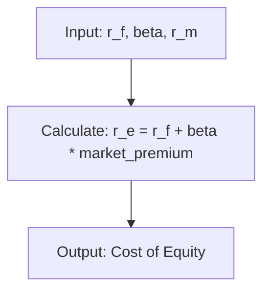

# Mathematical Notation Convention

This document defines how to write mathematical equations and formulas in the open-sharia-enterprise project. Using LaTeX notation ensures mathematical expressions render correctly and consistently across all documentation platforms.

## 📋 Overview

Mathematical notation appears throughout fintech documentation - from financial formulas like WACC and CAPM to statistical models and algorithmic complexity analysis. This convention ensures all mathematical expressions are:

1. **Readable** - Clear notation that renders properly
2. **Consistent** - Same syntax across all documentation
3. **Compatible** - Works in both Obsidian and GitHub
4. **Maintainable** - Easy to edit and version control

## 🎯 The Core Principle

**Use LaTeX notation for all mathematical equations and formulas in documentation.**

GitHub has supported LaTeX math rendering in markdown since May 2022, and Obsidian has native support. This makes LaTeX the universal standard for mathematical notation in modern documentation.

## 💡 Why LaTeX?

### Universal Rendering

LaTeX math notation renders natively in:

- **Obsidian** - Native MathJax support (immediate preview)
- **GitHub** - Native rendering since May 2022 (web interface and mobile)
- **VS Code** - With Markdown Preview Enhanced extension
- **Most modern markdown viewers** - Wide ecosystem support

### Professional Quality

LaTeX produces publication-quality mathematical notation:

- **Proper spacing** - Automatic spacing for operators, variables, and functions
- **Symbol library** - Comprehensive set of mathematical symbols
- **Nested structures** - Fractions, subscripts, superscripts, matrices
- **Standards-compliant** - Follows mathematical typesetting conventions

### Version Control Friendly

LaTeX is plain text, making it:

- **Diff-friendly** - Easy to see changes in git
- **Searchable** - Full-text search works on formulas
- **Maintainable** - No binary image files to manage

## 📝 LaTeX Syntax

### Inline Math

Use single dollar signs `$...$` for inline mathematical expressions within text:

```markdown
The cost of equity $r_e$ is calculated using the formula $r_e = r_f + \beta \times (r_m - r_f)$.
```

**Renders as:**

The cost of equity $r_e$ is calculated using the formula $r_e = r_f + \beta \times (r_m - r_f)$.

**When to use inline math:**

- Variables within sentences ($x$, $r_f$, $\beta$)
- Simple expressions embedded in text ($a + b$, $n^2$)
- Mathematical terms in running text

### Display Math

Use double dollar signs `$$...$$` for standalone equations on their own line:

```markdown
The Weighted Average Cost of Capital (WACC) formula:

$$
WACC = \frac{E}{V} \times r_e + \frac{D}{V} \times r_d \times (1 - T_c)
$$
```

**Renders as:**

The Weighted Average Cost of Capital (WACC) formula:

$$
WACC = \frac{E}{V} \times r_e + \frac{D}{V} \times r_d \times (1 - T_c)
$$

**When to use display math:**

- Important formulas that deserve emphasis
- Complex multi-line expressions
- Equations that should stand out visually
- Formulas that need to be referenced or cited

### ⚠️ Critical: Delimiter Placement Rules

**Single `$` delimiters MUST be inline (on the same line as text):**

```markdown
✅ Correct - Inline math:
The cost of equity $r_e$ is calculated using CAPM.

❌ Incorrect - Single $ on its own line:
$
r_e = r_f + \beta \times (r_m - r_f)
$
```

**Display-level equations MUST use `$$` delimiters:**

```markdown
✅ Correct - Display math:

$$
r_e = r_f + \beta \times (r_m - r_f)
$$

❌ Incorrect - Single $ for display:
$
r_e = r_f + \beta \times (r_m - r_f)
$
```

**All `\begin{align}` blocks MUST use `$$` delimiters:**

```markdown
✅ Correct - align with $$:

$$
\begin{align}
WACC &= \frac{E}{V} \times r_e + \frac{D}{V} \times r_d \times (1 - T_c) \\
     &= 0.645 \times 11.4\% + 0.355 \times 3.41\% \\
     &= 8.56\%
\end{align}
$$

❌ Incorrect - align with single $:
$
\begin{align}
WACC &= \frac{E}{V} \times r_e + \frac{D}{V} \times r_d \times (1 - T_c)
\end{align}
$
```

**Why this matters:**

Single `$` on its own line breaks rendering in both GitHub and Obsidian - the LaTeX code displays as raw text instead of rendered math. This is the #1 most common LaTeX rendering issue.

**Rule of thumb:**

- **Inline math** (within text): `$x + y$` on same line as text
- **Display math** (standalone): `$$...$$` on separate lines
- **Multi-line equations**: Always use `$$` with `\begin{align}`

## ✅ Where to Use LaTeX

### Documentation Files in `docs/`

Use LaTeX for all mathematical notation in:

- **Tutorials** (`docs/tutorials/`) - Teaching mathematical concepts
- **How-To Guides** (`docs/how-to/`) - Calculation procedures
- **Reference** (`docs/reference/`) - Formula specifications
- **Explanation** (`docs/explanation/`) - Mathematical reasoning

**Example** (tutorial):

```markdown
## Calculating Net Present Value (NPV)

The NPV formula discounts future cash flows to present value:

$$
NPV = \sum_{t=0}^{n} \frac{CF_t}{(1 + r)^t}
$$

Where:

- $CF_t$ = cash flow at time $t$
- $r$ = discount rate
- $n$ = number of periods
```

### README Files

Use LaTeX in README files throughout the repository:

```markdown
## Performance Metrics

Our algorithm achieves $O(n \log n)$ time complexity and $O(n)$ space complexity.
```

### Plans Documentation

Use LaTeX in planning documents (`plans/`) when describing technical requirements:

```markdown
## Performance Requirements

The system must calculate portfolio returns using:

$$
R_p = \sum_{i=1}^{n} w_i \times R_i
$$

Where $w_i$ are portfolio weights and $R_i$ are asset returns.
```

## ❌ Where NOT to Use LaTeX

### Code Blocks

Inside code blocks, use plain text or code-appropriate notation:

```python
# ✅ Correct - Plain text in code
def calculate_wacc(equity, debt, cost_of_equity, cost_of_debt, tax_rate):
    """
    Calculate WACC = (E/V) * r_e + (D/V) * r_d * (1 - T_c)
    """
    total_value = equity + debt
    wacc = (equity / total_value) * cost_of_equity + \
           (debt / total_value) * cost_of_debt * (1 - tax_rate)
    return wacc
```

```python
# ❌ Incorrect - Don't use LaTeX in code
def calculate_wacc(equity, debt, cost_of_equity, cost_of_debt, tax_rate):
    """
    Calculate $WACC = \frac{E}{V} \times r_e + \frac{D}{V} \times r_d \times (1 - T_c)$
    """
    # LaTeX doesn't render in code blocks
```

### Mermaid Diagrams

Mermaid diagrams don't process LaTeX. Use plain text notation:



### ASCII Art Diagrams

In ASCII diagrams (for files outside `docs/`), use plain text:

```
Formula: WACC = (E/V) * r_e + (D/V) * r_d * (1 - T_c)
                 │      │       │      │         │
                 │      │       │      │         └─ Tax rate
                 │      │       │      └─ Cost of debt
                 │      │       └─ Debt ratio
                 │      └─ Cost of equity
                 └─ Equity ratio
```

### Configuration Files

Never use LaTeX in JSON, YAML, or configuration files:

```yaml
# ✅ Correct - Plain text
financial_formulas:
  wacc: "(E/V) * r_e + (D/V) * r_d * (1 - T_c)"
```

```yaml
# ❌ Incorrect
financial_formulas:
  wacc: "$WACC = \\frac{E}{V} \\times r_e + \\frac{D}{V} \\times r_d \\times (1 - T_c)$"
```

## 🎨 Common LaTeX Patterns

### Subscripts and Superscripts

Use `_` for subscripts and `^` for superscripts:

```markdown
- Single character: $r_f$, $x^2$
- Multiple characters (use braces): $r_{free}$, $x^{2n}$
- Combined: $x_i^2$, $r_{i,t}^{adjusted}$
```

**Renders as:**

- Single character: $r_f$, $x^2$
- Multiple characters (use braces): $r_{free}$, $x^{2n}$
- Combined: $x_i^2$, $r_{i,t}^{adjusted}$

### Greek Letters

Precede with backslash:

```markdown
Common in finance:

- $\alpha$ (alpha) - excess return
- $\beta$ (beta) - systematic risk
- $\gamma$ (gamma) - risk aversion
- $\delta$ (delta) - change/derivative
- $\sigma$ (sigma) - standard deviation
- $\mu$ (mu) - mean/expected value
- $\pi$ (pi) - profit
- $\rho$ (rho) - correlation coefficient
```

**Renders as:**

Common in finance:

- $\alpha$ (alpha) - excess return
- $\beta$ (beta) - systematic risk
- $\gamma$ (gamma) - risk aversion
- $\delta$ (delta) - change/derivative
- $\sigma$ (sigma) - standard deviation
- $\mu$ (mu) - mean/expected value
- $\pi$ (pi) - profit
- $\rho$ (rho) - correlation coefficient

### Fractions

Use `\frac{numerator}{denominator}`:

```markdown
Simple fraction: $\frac{E}{V}$

Complex fraction: $\frac{E}{E + D}$

Nested: $\frac{1}{1 + \frac{r}{n}}$
```

**Renders as:**

Simple fraction: $\frac{E}{V}$

Complex fraction: $\frac{E}{E + D}$

Nested: $\frac{1}{1 + \frac{r}{n}}$

### Summations and Products

Use `\sum` and `\prod`:

```markdown
Sum: $\sum_{i=1}^{n} x_i$

Weighted sum: $\sum_{i=1}^{n} w_i \times r_i$

Product: $\prod_{i=1}^{n} (1 + r_i)$
```

**Renders as:**

Sum: $\sum_{i=1}^{n} x_i$

Weighted sum: $\sum_{i=1}^{n} w_i \times r_i$

Product: $\prod_{i=1}^{n} (1 + r_i)$

### Square Roots

Use `\sqrt`:

```markdown
Square root: $\sqrt{x}$

Nth root: $\sqrt[n]{x}$

Complex: $\sqrt{(x_1 - \mu)^2 + (x_2 - \mu)^2}$
```

**Renders as:**

Square root: $\sqrt{x}$

Nth root: $\sqrt[n]{x}$

Complex: $\sqrt{(x_1 - \mu)^2 + (x_2 - \mu)^2}$

### Mathematical Operators

Common operators:

```markdown
- Multiplication: $a \times b$ or $a \cdot b$
- Division: $a \div b$ or $\frac{a}{b}$
- Plus/minus: $\pm$
- Not equal: $\neq$
- Less/greater: $\leq$, $\geq$
- Approximately: $\approx$
- Infinity: $\infty$
```

**Renders as:**

- Multiplication: $a \times b$ or $a \cdot b$
- Division: $a \div b$ or $\frac{a}{b}$
- Plus/minus: $\pm$
- Not equal: $\neq$
- Less/greater: $\leq$, $\geq$
- Approximately: $\approx$
- Infinity: $\infty$

## 💰 Finance Formula Examples

### Weighted Average Cost of Capital (WACC)

```markdown
## WACC Formula

$$
WACC = \frac{E}{V} \times r_e + \frac{D}{V} \times r_d \times (1 - T_c)
$$

Where:

- $E$ = market value of equity
- $D$ = market value of debt
- $V$ = total market value of capital ($V = E + D$)
- $r_e$ = cost of equity
- $r_d$ = cost of debt
- $T_c$ = corporate tax rate
```

**Renders as:**

## WACC Formula

$$
WACC = \frac{E}{V} \times r_e + \frac{D}{V} \times r_d \times (1 - T_c)
$$

Where:

- $E$ = market value of equity
- $D$ = market value of debt
- $V$ = total market value of capital ($V = E + D$)
- $r_e$ = cost of equity
- $r_d$ = cost of debt
- $T_c$ = corporate tax rate

### Capital Asset Pricing Model (CAPM)

```markdown
## CAPM Formula

The cost of equity is calculated using CAPM:

$$
r_e = r_f + \beta \times (r_m - r_f)
$$

Where:

- $r_e$ = expected return on equity (cost of equity)
- $r_f$ = risk-free rate
- $\beta$ = beta coefficient (systematic risk)
- $r_m$ = expected market return
- $(r_m - r_f)$ = market risk premium
```

**Renders as:**

## CAPM Formula

The cost of equity is calculated using CAPM:

$$
r_e = r_f + \beta \times (r_m - r_f)
$$

Where:

- $r_e$ = expected return on equity (cost of equity)
- $r_f$ = risk-free rate
- $\beta$ = beta coefficient (systematic risk)
- $r_m$ = expected market return
- $(r_m - r_f)$ = market risk premium

### Net Present Value (NPV)

```markdown
## NPV Formula

$$
NPV = \sum_{t=0}^{n} \frac{CF_t}{(1 + r)^t}
$$

Or expanded:

$$
NPV = \frac{CF_0}{(1 + r)^0} + \frac{CF_1}{(1 + r)^1} + \frac{CF_2}{(1 + r)^2} + \cdots + \frac{CF_n}{(1 + r)^n}
$$

Where:

- $CF_t$ = cash flow at time $t$
- $r$ = discount rate (typically WACC)
- $n$ = project lifetime in periods
- $t$ = time period ($t = 0$ is present)
```

**Renders as:**

## NPV Formula

$$
NPV = \sum_{t=0}^{n} \frac{CF_t}{(1 + r)^t}
$$

Or expanded:

$$
NPV = \frac{CF_0}{(1 + r)^0} + \frac{CF_1}{(1 + r)^1} + \frac{CF_2}{(1 + r)^2} + \cdots + \frac{CF_n}{(1 + r)^n}
$$

Where:

- $CF_t$ = cash flow at time $t$
- $r$ = discount rate (typically WACC)
- $n$ = project lifetime in periods
- $t$ = time period ($t = 0$ is present)

### Sharpe Ratio

```markdown
## Sharpe Ratio Formula

Measures risk-adjusted return:

$$
Sharpe = \frac{r_p - r_f}{\sigma_p}
$$

Where:

- $r_p$ = portfolio return
- $r_f$ = risk-free rate
- $\sigma_p$ = standard deviation of portfolio returns
```

**Renders as:**

## Sharpe Ratio Formula

Measures risk-adjusted return:

$$
Sharpe = \frac{r_p - r_f}{\sigma_p}
$$

Where:

- $r_p$ = portfolio return
- $r_f$ = risk-free rate
- $\sigma_p$ = standard deviation of portfolio returns

### Compound Interest

```markdown
## Compound Interest Formula

Future value with compound interest:

$$
FV = PV \times (1 + r)^n
$$

With continuous compounding:

$$
FV = PV \times e^{rt}
$$

Where:

- $FV$ = future value
- $PV$ = present value
- $r$ = interest rate per period
- $n$ = number of periods
- $t$ = time
- $e$ = Euler's number ($\approx 2.71828$)
```

**Renders as:**

## Compound Interest Formula

Future value with compound interest:

$$
FV = PV \times (1 + r)^n
$$

With continuous compounding:

$$
FV = PV \times e^{rt}
$$

Where:

- $FV$ = future value
- $PV$ = present value
- $r$ = interest rate per period
- $n$ = number of periods
- $t$ = time
- $e$ = Euler's number ($\approx 2.71828$)

## 🧪 Testing LaTeX Rendering

### In Obsidian

1. **Edit mode**: LaTeX appears as source code (`$...$` or `$$...$$`)
2. **Reading mode**: LaTeX renders as formatted mathematical notation
3. **Toggle**: Press `Cmd/Ctrl + E` to switch between edit and reading modes

**Verification**: Open any documentation file with LaTeX and toggle to reading mode. Formulas should render clearly with proper spacing and symbols.

### On GitHub

1. **View any markdown file** on GitHub web interface
2. **LaTeX renders automatically** - no special configuration needed
3. **Works on mobile** - GitHub mobile app also supports LaTeX rendering

**Verification**: View this convention document on GitHub. All formulas should render properly in the web interface.

### Common Rendering Issues

**Problem**: LaTeX displays as raw text instead of rendering

**Cause**: Single `$` delimiter used for display math

**Example of broken code:**

```markdown
$
WACC = \frac{E}{V} \times r_e
$
```

**Solution**: Use double `$$` for display math:

```markdown
$$
WACC = \frac{E}{V} \times r_e
$$
```

**Applies to:**

- Any equation on its own line
- All `\begin{align}` blocks
- Display-level formulas

---

**Problem**: Formula doesn't render (shows raw LaTeX code)

**Causes**:

- Missing dollar signs (`$` or `$$`)
- Unescaped backslashes in markdown preview
- Unsupported LaTeX commands (rare, most standard commands work)

**Solution**: Check syntax, ensure proper dollar sign placement, verify no typos in command names.

**Problem**: Spacing looks wrong

**Causes**:

- Using `*` instead of `\times` for multiplication
- Missing braces around multi-character subscripts/superscripts

**Solution**: Use `\times` or `\cdot` for multiplication, add braces: `$r_{free}^{adjusted}$`

## 📚 Best Practices

### Define Variables

Always define variables after displaying a formula:

```markdown
$$
r_e = r_f + \beta \times (r_m - r_f)
$$

Where:

- $r_e$ = cost of equity
- $r_f$ = risk-free rate
- $\beta$ = beta coefficient
```

**Why**: Readers may not know standard notation. Explicit definitions ensure clarity.

### Use Consistent Notation

Choose notation conventions and stick to them:

- **Time periods**: Use $t$ consistently (not mixing $t$, $n$, $i$)
- **Returns**: Use $r$ for rates, $R$ for returns
- **Weights**: Use $w$ for portfolio weights
- **Volatility**: Use $\sigma$ for standard deviation

**Why**: Consistency reduces cognitive load and prevents confusion.

### Format Complex Formulas

Break multi-line formulas for readability:

```markdown
$$
\begin{align}
NPV &= \sum_{t=0}^{n} \frac{CF_t}{(1 + r)^t} \\
    &= -I_0 + \frac{CF_1}{1+r} + \frac{CF_2}{(1+r)^2} + \cdots + \frac{CF_n}{(1+r)^n}
\end{align}
$$
```

**Why**: Multi-line alignment improves readability for complex derivations.

### Use Semantic HTML When Needed

For very complex layouts, consider tables alongside LaTeX:

```markdown
| Variable | Symbol | Unit    |
| -------- | ------ | ------- |
| Equity   | $E$    | USD     |
| Debt     | $D$    | USD     |
| WACC     | $WACC$ | Percent |
```

### Balance Precision and Clarity

Don't over-complicate notation:

```markdown
✅ Good:
$$r_e = r_f + \beta \times MRP$$

❌ Too complex:
$$r_{e,adjusted,t} = r_{f,t} + \beta_{asset,market,t} \times (r_{m,expected,t} - r_{f,t})$$
```

**Why**: Simpler notation is easier to understand. Add subscripts only when necessary to distinguish different variables.

## 🔄 Migration Strategy

### New Documentation

All new documentation MUST use LaTeX for mathematical notation:

- Write formulas in LaTeX from the start
- Define variables clearly
- Test rendering in both Obsidian and GitHub

### Existing Documentation

Update existing docs **when modified** (not retroactively):

- If editing a document with plain text math, convert to LaTeX
- Don't create standalone PRs just to convert notation
- Gradual migration as documents are naturally updated

**Why**: Avoid unnecessary churn. Convert to LaTeX when there's a natural reason to edit the file.

### Converting Plain Text to LaTeX

**Before** (plain text):

```markdown
The WACC formula is: WACC = (E/V) _ r_e + (D/V) _ r_d \* (1 - T_c)
```

**After** (LaTeX):

```markdown
The WACC formula is:

$$
WACC = \frac{E}{V} \times r_e + \frac{D}{V} \times r_d \times (1 - T_c)
$$

Where:

- $E$ = market value of equity
- $D$ = market value of debt
- $V$ = total market value ($V = E + D$)
- $r_e$ = cost of equity
- $r_d$ = cost of debt
- $T_c$ = corporate tax rate
```

**Process**:

1. Identify mathematical expressions in plain text
2. Convert to inline `$...$` or display `$$...$$`
3. Add variable definitions
4. Test rendering
5. Commit with descriptive message: `docs: convert math notation to LaTeX`

## 📖 LaTeX Reference

### Essential Commands

| Command           | Usage              | Renders           |
| ----------------- | ------------------ | ----------------- |
| `\frac{a}{b}`     | Fraction           | $\frac{a}{b}$     |
| `x^2`             | Superscript        | $x^2$             |
| `x_i`             | Subscript          | $x_i$             |
| `\sqrt{x}`        | Square root        | $\sqrt{x}$        |
| `\sum_{i=1}^{n}`  | Summation          | $\sum_{i=1}^{n}$  |
| `\prod_{i=1}^{n}` | Product            | $\prod_{i=1}^{n}$ |
| `\times`          | Multiplication     | $\times$          |
| `\cdot`           | Dot multiplication | $\cdot$           |
| `\leq`, `\geq`    | Less/greater equal | $\leq$, $\geq$    |
| `\neq`            | Not equal          | $\neq$            |
| `\approx`         | Approximately      | $\approx$         |
| `\pm`             | Plus-minus         | $\pm$             |
| `\infty`          | Infinity           | $\infty$          |
| `\alpha`, `\beta` | Greek letters      | $\alpha$, $\beta$ |

### Alignment (Multi-line)

```markdown
$$
\begin{align}
WACC &= \frac{E}{V} \times r_e + \frac{D}{V} \times r_d \times (1 - T_c) \\
     &= \text{Equity weight} \times \text{Cost of equity} \\
     &\quad + \text{Debt weight} \times \text{After-tax cost of debt}
\end{align}
$$
```

### Text in Formulas

Use `\text{...}` for descriptive text within formulas:

```markdown
$$
\text{Profit} = \text{Revenue} - \text{Costs}
$$
```

### Common Finance Symbols

| Symbol    | LaTeX Command | Usage                     |
| --------- | ------------- | ------------------------- |
| $\alpha$  | `\alpha`      | Alpha, excess return      |
| $\beta$   | `\beta`       | Beta, systematic risk     |
| $\Delta$  | `\Delta`      | Change, difference        |
| $\sigma$  | `\sigma`      | Standard deviation        |
| $\mu$     | `\mu`         | Mean, expected value      |
| $\pi$     | `\pi`         | Profit, pi constant       |
| $\rho$    | `\rho`        | Correlation               |
| $\lambda$ | `\lambda`     | Lambda, adjustment factor |

## ✅ Validation Checklist

When adding or reviewing mathematical notation:

- [ ] All mathematical expressions use LaTeX syntax
- [ ] Inline math uses `$...$` for terms within text
- [ ] Display math uses `$$...$$` for standalone equations
- [ ] Single `$` delimiters are ONLY used inline (on same line as text)
- [ ] Display-level equations use `$$` delimiters (on separate lines)
- [ ] All `\begin{align}` blocks use `$$` delimiters (not single `$`)
- [ ] Variables are defined after formulas
- [ ] Notation is consistent throughout the document
- [ ] Formulas render correctly in Obsidian reading mode
- [ ] No LaTeX inside code blocks (use plain text)
- [ ] No LaTeX inside Mermaid diagrams (use plain text)
- [ ] Complex formulas have clear alignment and structure
- [ ] All Greek letters, fractions, and summations use proper commands

## 🌐 Important Notes

### Browser Compatibility

LaTeX rendering works in all modern browsers:

- **Chrome/Edge** - Full support
- **Firefox** - Full support
- **Safari** - Full support (macOS and iOS)
- **Mobile browsers** - Full support on GitHub mobile app

No special configuration or extensions needed.

### Performance

LaTeX rendering is fast and lightweight:

- **Client-side rendering** - MathJax/KaTeX in browser
- **No server-side processing** - Pure markdown with math syntax
- **Cacheable** - Rendered math is cached by browsers

Large documents with many formulas render quickly in both Obsidian and GitHub.

### Accessibility

LaTeX math has good accessibility:

- **Screen readers** - MathJax provides screen reader support
- **Zoom** - Math scales properly with page zoom
- **Copy-paste** - Can copy LaTeX source from rendered math
- **Search** - Full-text search works on LaTeX source

### Version History

- **2025-12-02** - Initial convention document created
- LaTeX math support verified in GitHub (since May 2022) and Obsidian (native)

## 🔗 Related Conventions

- [Diagram and Schema Convention](./ex-co__diagrams.md) - When to use Mermaid diagrams vs ASCII art (plain text for diagrams, LaTeX for math)
- [Emoji Usage Convention](./ex-co__emoji-usage.md) - Semantic emoji usage in documentation
- [File Naming Convention](./ex-co__file-naming-convention.md) - How to name documentation files
- [Conventions Index](./README.md) - Overview of all conventions

## 🌐 External Resources

- [LaTeX Mathematics Wikibook](https://en.wikibooks.org/wiki/LaTeX/Mathematics) - Comprehensive LaTeX math reference
- [Detexify](https://detexify.kirelabs.org/classify.html) - Draw a symbol to find its LaTeX command
- [MathJax Documentation](https://www.mathjax.org/) - Rendering engine used by many platforms
- [GitHub Math Support Announcement](https://github.blog/2022-05-19-math-support-in-markdown/) - Official GitHub blog post (May 2022)
- [Obsidian Math Documentation](https://help.obsidian.md/Editing+and+formatting/Advanced+formatting+syntax#Math) - Official Obsidian math formatting guide

---

**Last Updated**: 2025-12-02
