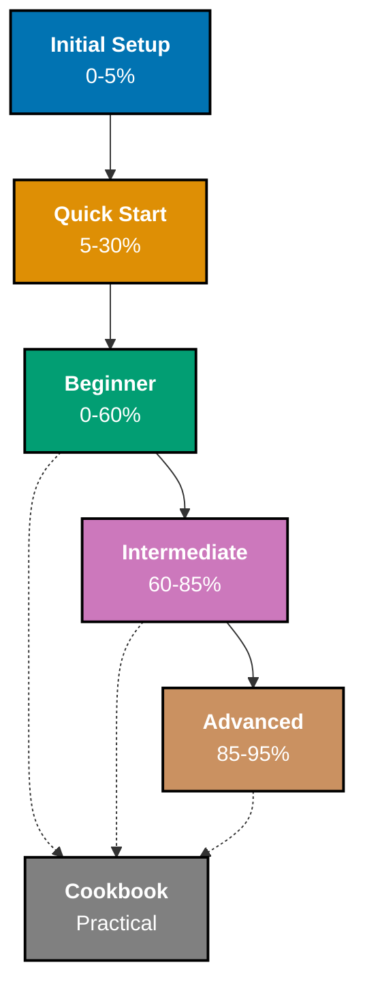
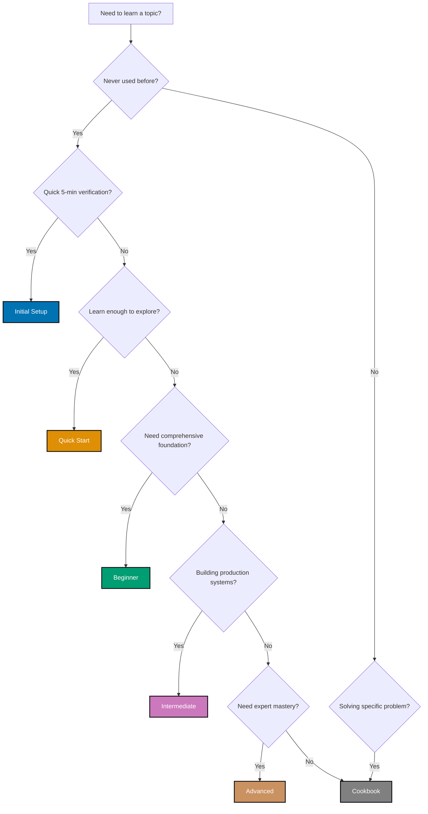

# Tutorial Naming Convention

This document defines the standard tutorial types and naming conventions used across the open-sharia-enterprise documentation. Each tutorial type represents a specific learning depth and audience, ensuring learners can easily find content appropriate for their skill level.

## Principles Implemented

This convention implements the following core principles:

- **[Progressive Disclosure](../principles/content/ex-pr-co__progressive-disclosure.md)**: Six tutorial levels (Initial Setup through Cookbook) provide graduated learning paths. Beginners start simple (0-5% coverage), advanced users access deep content (85-95%). Each level is complete and useful on its own.

- **[No Time Estimates](../principles/content/ex-pr-co__no-time-estimates.md)**: Tutorial levels defined by knowledge coverage percentages (0-5%, 5-30%, etc.) instead of completion time. Focus is on WHAT you'll learn and HOW DEEP, not how long it takes.

- **[Explicit Over Implicit](../principles/software-engineering/ex-pr-se__explicit-over-implicit.md)**: Tutorial names explicitly state their level and scope ("Initial Setup", "Beginner Tutorial", "Advanced Guide"). No guessing about difficulty or depth - it's clear from the title.

## 🎯 Purpose

**Why standardize tutorial naming?**

- **Clarity** - Learners immediately understand the tutorial's depth and scope
- **Consistency** - All tutorials follow the same naming and structure patterns
- **Discoverability** - Easy to find the right tutorial for your current skill level
- **Progression** - Clear learning path from beginner to advanced topics
- **Expectations** - Learners know what to expect before starting

## 📊 Tutorial Types Overview

**Legend**:

- Solid arrows (→) show linear progression within the "Full Set" (5 sequential levels)
- Dotted arrows (⋯→) show cookbook can be used at multiple levels (parallel track)
- Percentages indicate depth of domain knowledge coverage

**Full Set vs Cookbook**:

- **Full Set**: The 5 sequential learning levels (Initial Setup → Quick Start → Beginner → Intermediate → Advanced) that provide comprehensive mastery from 0% to 95% coverage
- **Cookbook**: A parallel, practical reference track (not part of the Full Set) for solving specific problems at any skill level

---

## 📚 Tutorial Type Definitions

### 🚀 Initial Setup

**Coverage**: 0-5% of domain knowledge
**Goal**: Get up and running quickly

**Description**:
Minimal tutorial to get you running your first program or using a tool. In programming languages and frameworks, this means running "Hello World" and understanding the most basic syntax.

**Content includes**:

- Installation instructions
- Basic environment setup
- First "Hello World" program
- Verification that setup works correctly

**What it does NOT include**:

- In-depth explanations of concepts
- Multiple examples or variations
- Advanced features or patterns
- Best practices or optimization

**Example titles**:

- "Initial Setup for Go"
- "Initial Setup for React"
- "Initial Setup for PostgreSQL"

**When to use**: When someone needs to verify they can run code before committing to deeper learning.

---

### ⚡ Quick Start

**Coverage**: 5-30% of domain knowledge
**Goal**: Learn enough to explore independently

**Description**:
Teaches the core concepts and syntax needed to start exploring the domain independently. After completing a quick start, learners can read documentation, try examples, and solve simple problems on their own.

**Content includes**:

- Core language syntax or tool features
- Fundamental concepts and terminology
- Basic examples demonstrating key features
- Enough knowledge to read official documentation
- Foundation for independent exploration

**What it does NOT include**:

- Comprehensive coverage of all features
- Advanced patterns or edge cases
- Production-ready best practices
- Deep dives into internals

**Example titles**:

- "Quick Start Guide to Golang"
- "React Quick Start"
- "Docker Quick Start"

**When to use**: When someone wants to quickly understand a language/tool's fundamentals and start experimenting independently.

---

### 🟢 Beginner

**Coverage**: 0-60% of domain knowledge
**Goal**: Comprehensive foundation from zero to working knowledge

**Description**:
Teaches everything from absolute basics to solid working knowledge. Covers the most important 60% of features that you'll use in 90% of real-world scenarios. After completion, learners can build real projects and solve common problems.

**Content includes**:

- Everything in Initial Setup and Quick Start
- Comprehensive coverage of core features
- Multiple examples and practice exercises
- Common patterns and idioms
- Error handling and debugging basics
- Testing fundamentals
- Practical real-world examples

**What it does NOT include**:

- Advanced optimization techniques
- Complex architectural patterns
- Edge cases and specialized scenarios
- Deep internals or theory

**Example titles**:

- "Complete Beginner's Guide to Go"
- "React for Beginners: Zero to Hero"
- "Accounting Fundamentals for Beginners"

**When to use**: When someone is completely new to a domain and wants comprehensive, structured learning from scratch.

---

### 🟡 Intermediate

**Coverage**: 60-85% of domain knowledge
**Goal**: Professional-level expertise for production systems

**Description**:
Builds on beginner knowledge to cover professional techniques, optimization, and architectural patterns. Focuses on the 25% of features needed for production systems, complex applications, and team collaboration.

**Prerequisites**: Completed beginner-level tutorial or equivalent experience

**Content includes**:

- Advanced features and patterns
- Performance optimization techniques
- Architectural best practices
- Testing strategies (integration, e2e)
- Security considerations
- Production deployment concerns
- Team collaboration patterns
- Code organization at scale

**What it does NOT include**:

- Cutting-edge experimental features
- Highly specialized techniques
- Framework/library internals
- Research-level topics

**Example titles**:

- "Intermediate Go: Production-Ready Applications"
- "Advanced React Patterns"
- "Intermediate PostgreSQL: Query Optimization"

**When to use**: When someone has working knowledge but needs to build production systems or work on professional teams.

---

### 🔴 Advanced

**Coverage**: 85-95% of domain knowledge
**Goal**: Expert-level mastery of advanced techniques

**Description**:
Covers advanced techniques, edge cases, and sophisticated patterns used by experts. The final 5% (specialized research topics) is addressed in separate specialized tutorials.

**Prerequisites**: Completed intermediate-level tutorial or significant professional experience

**Content includes**:

- Advanced optimization techniques
- Complex architectural patterns
- Edge cases and corner scenarios
- Performance profiling and tuning
- Advanced debugging techniques
- System design trade-offs
- Cutting-edge features and proposals
- Framework/tool internals

**What it does NOT include**:

- Research-level topics (covered in specialized tutorials)
- Experimental/unstable features
- Topics requiring academic background

**Example titles**:

- "Advanced Go: Concurrency Patterns and Optimization"
- "Advanced React: Internals and Performance"
- "Advanced PostgreSQL: Internals and Tuning"

**When to use**: When someone needs expert-level knowledge for complex systems, performance-critical applications, or teaching others.

---

### 🧪 Cookbook

**Coverage**: Practical recipes (not depth-based)
**Goal**: Solve day-to-day and real-world problems

**Description**:
Collection of practical recipes and patterns for solving common real-world problems. Not organized by difficulty level, but by problem type. Can be used at beginner, intermediate, or advanced levels.

**Prerequisites**: Varies by recipe (usually beginner or intermediate level)

**Content includes**:

- Problem-focused recipes ("How do I...")
- Copy-paste-ready code examples
- Real-world scenarios and solutions
- Common gotchas and workarounds
- Best practices for specific tasks
- Performance tips for common operations
- Troubleshooting guides

**What it does NOT include**:

- Comprehensive explanations of concepts
- Linear learning progression
- Foundational knowledge building

**Example titles**:

- "Golang Cookbook: Practical Recipes"
- "React Cookbook: Common Patterns"
- "PostgreSQL Cookbook: Query Patterns"

**When to use**: When someone needs quick solutions to specific problems rather than comprehensive learning.

---

## 🎓 Choosing the Right Tutorial Type

### Decision Tree

### Quick Reference Table

| Tutorial Type     | Coverage  | Use When                            |
| ----------------- | --------- | ----------------------------------- |
| **Initial Setup** | 0-5%      | Need quick verification setup works |
| **Quick Start**   | 5-30%     | Want to explore independently       |
| **Beginner**      | 0-60%     | Complete beginner, need foundation  |
| **Intermediate**  | 60-85%    | Building production systems         |
| **Advanced**      | 85-95%    | Need expert-level mastery           |
| **Cookbook**      | Practical | Solving specific problems           |

**Note**: The first 5 types (Initial Setup through Advanced) form the "Full Set" - a sequential learning path from 0% to 95% coverage. Cookbook is a parallel track for practical problem-solving.

---

## 📝 Naming Examples

### Programming Languages

- **Initial Setup for Python**
- **Python Quick Start**
- **Python for Beginners: Complete Guide**
- **Intermediate Python: Professional Techniques**
- **Advanced Python: Internals and Optimization**
- **Python Cookbook: Practical Recipes**

### Frameworks and Tools

- **Initial Setup for React**
- **React Quick Start**
- **React for Beginners**
- **Intermediate React: Production Patterns**
- **Advanced React: Performance and Internals**
- **React Cookbook: Common Solutions**

### Domain Topics

- **Initial Setup for Accounting**
- **Accounting Quick Start**
- **Accounting for Beginners**
- **Intermediate Accounting: Financial Reporting**
- **Advanced Accounting: Complex Transactions**
- **Accounting Cookbook: Common Scenarios**

---

## ✅ Best Practices

### DO ✓

- **Use consistent naming** - Follow the standard tutorial type names
- **Match content to type** - Ensure coverage aligns with tutorial type definition
- **State prerequisites** - Clearly list what learners need before starting
- **Focus on learning outcomes** - Emphasize WHAT learners will achieve, not HOW LONG it takes
- **Use coverage percentages** - Indicate depth (0-5%, 60-85%, etc.) to set expectations
- **Provide practical examples** - Real-world scenarios, not toy problems
- **Test with target audience** - Validate content matches the intended level

### DON'T ✗

- **Mix tutorial types** - Don't combine "Beginner + Intermediate" in one tutorial
- **Skip prerequisite tutorials** - Each level builds on previous ones
- **Include time estimates** - No "X hours" or "X minutes" (people learn at different speeds)
- **Use jargon without explanation** - Define terms appropriate to the level
- **Create arbitrary levels** - Stick to the six standard types
- **Make cookbooks too basic** - Cookbook assumes working knowledge

---

## 🔗 Related Documentation

- [Tutorial Convention](./ex-co__tutorials.md) - Standards for tutorial structure and content
- [Diátaxis Framework](./ex-co__diataxis-framework.md) - Understanding the tutorial category in documentation
- [Tutorials Index](../../tutorials/README.md) - All available tutorials organized by type
- [File Naming Convention](./ex-co__file-naming-convention.md) - How to name tutorial files

---

**Last Updated**: 2025-12-03
