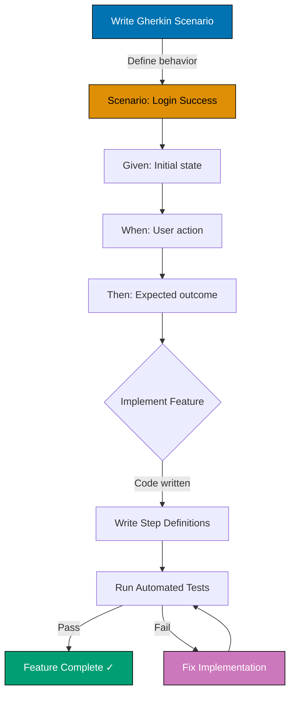

# Acceptance Criteria Convention

This convention defines how to write testable acceptance criteria using **Gherkin format** for plans, specifications, and requirements documentation.

## Purpose

Acceptance criteria define the conditions that must be met for a feature, story, or requirement to be considered complete. Using structured Gherkin format provides:

- **Clear communication**: Unambiguous requirements understood by all stakeholders
- **Test automation**: Direct translation to automated tests (BDD frameworks)
- **Living documentation**: Scenarios serve as executable specifications
- **Testability**: Forces concrete, verifiable conditions
- **Shared language**: Business and technical teams use same terminology

## Gherkin Format

Gherkin uses natural language with specific keywords to structure acceptance criteria as scenarios.

### Core Keywords

**Scenario**: Describes a specific behavior or outcome

```gherkin
Scenario: User successfully logs in with valid credentials
```

**Given**: Sets up the initial context or preconditions

```gherkin
Given a user with email "user@example.com" and password "securepass123"
And the user is on the login page
```

**When**: Describes the action or event being tested

```gherkin
When the user enters their email and password
And clicks the "Login" button
```

**Then**: Specifies the expected outcome or result

```gherkin
Then the user should be redirected to the dashboard
And see a welcome message "Welcome back, User!"
And the session should be authenticated
```

**And/But**: Connects multiple conditions (same semantic level as previous keyword)

```gherkin
Given a user is logged in
And has admin privileges
But has not completed onboarding
```

### Complete Syntax

```gherkin
Scenario: [Concise description of behavior]
	Given [initial context]
	And [additional context]
	When [action occurs]
	And [additional action]
	Then [expected outcome]
	And [additional outcome]
	But [constraint or exception]
```

## Best Practices

### 1. Be Specific with Concrete Values

✅ **Good**:

```gherkin
Given a cart with 3 items totaling $150.00
When the user applies discount code "SAVE20"
Then the total should be reduced to $120.00
```

❌ **Bad**:

```gherkin
Given a cart with items
When the user applies a discount
Then the total should be less
```

### 2. One Scenario Per Behavior

✅ **Good**:

```gherkin
Scenario: User login succeeds with valid credentials
Scenario: User login fails with invalid password
Scenario: User login fails with non-existent email
```

❌ **Bad**:

```gherkin
Scenario: User login (covers success, wrong password, wrong email, etc.)
```

### 3. Use Present Tense

✅ **Good**: `When the user clicks the button`
❌ **Bad**: `When the user clicked the button` or `When the user will click`

### 4. Focus on Behavior, Not Implementation

✅ **Good**:

```gherkin
When the user submits the registration form
Then an account should be created
```

❌ **Bad**:

```gherkin
When the user clicks submit button triggering handleSubmit() function
Then a POST request to /api/users endpoint should create a database record
```

### 5. Make It Testable

✅ **Good**:

```gherkin
Then the success message "Account created!" should be displayed
And the user should receive a confirmation email within 5 minutes
```

❌ **Bad**:

```gherkin
Then the user should feel confident their account was created
```

### 6. Use Data Tables for Multiple Inputs

```gherkin
Scenario Outline: Password validation
	Given a user enters password "<password>"
	Then validation should return "<result>"
	And show message "<message>"

	Examples:
		| password   | result | message                          |
		| abc        | fail   | Password must be at least 8 chars |
		| abcd1234   | fail   | Password must include uppercase   |
		| Abcd1234   | pass   | Password meets requirements       |
```

## Common Patterns

### CRUD Operations

**Create**:

```gherkin
Scenario: Create new project
	Given the user is logged in
	When the user creates a project with name "My Project"
	And sets visibility to "Private"
	Then the project should appear in the projects list
	And the user should be set as owner
```

**Read**:

```gherkin
Scenario: View project details
	Given a project "My Project" exists
	When the user navigates to the project page
	Then the project name should be displayed
	And the project metadata should be visible
```

**Update**:

```gherkin
Scenario: Update project settings
	Given a project "My Project" exists with visibility "Private"
	When the user changes visibility to "Public"
	And saves the changes
	Then the project visibility should be "Public"
	And other users should be able to find the project
```

**Delete**:

```gherkin
Scenario: Delete project
	Given a project "My Project" exists
	When the user deletes the project
	And confirms the deletion
	Then the project should be removed from the database
	And the user should be redirected to the projects list
```

### Authentication & Authorization

```gherkin
Scenario: Admin user accesses admin panel
	Given a user with role "Admin"
	And the user is logged in
	When the user navigates to "/admin"
	Then the admin panel should be accessible

Scenario: Regular user cannot access admin panel
	Given a user with role "Member"
	And the user is logged in
	When the user attempts to navigate to "/admin"
	Then access should be denied with 403 Forbidden
	And the user should see "Insufficient permissions" message
```

### Error Handling

```gherkin
Scenario: Handle network timeout gracefully
	Given the API server is unresponsive
	When the user submits a form
	And waits more than 30 seconds
	Then a timeout error should be displayed
	And the form data should be preserved
	And the user should be prompted to retry
```

## Real-World Examples

### Example 1: User Authentication (from 2025-11-24\_\_init-monorepo)

```gherkin
Scenario: User successfully creates account with valid information
	Given the registration page is loaded
	When the user enters email "newuser@example.com"
	And enters password "SecurePass123!"
	And enters password confirmation "SecurePass123!"
	And accepts terms of service
	And clicks "Create Account"
	Then account should be created in database
	And confirmation email should be sent to "newuser@example.com"
	And user should be redirected to dashboard
	And session should be authenticated
```

### Example 2: Content Validation (from 2025-12-03\_\_golang-full-set-tutorials)

```gherkin
Scenario: Tutorial content passes quality validation
	Given a tutorial file "01-hello-world.md"
	When the validator checks the tutorial
	Then frontmatter should include required fields (title, description, level, topics)
	And code examples should be syntax-highlighted
	And all internal links should be valid
	And no broken external links should exist
	And Mermaid diagrams should use accessible color palette
```

## Anti-Patterns

### ❌ Vague or Ambiguous Language

```gherkin
Then the system should work correctly
Then performance should be acceptable
Then users should be happy
```

**Better**: Define specific, measurable criteria

### ❌ Testing Implementation Details

```gherkin
Then the Redux store should be updated
Then the database transaction should commit
Then the cache should be invalidated
```

**Better**: Focus on observable behavior from user perspective

### ❌ Multiple Behaviors in One Scenario

```gherkin
Scenario: Complete user workflow
	[50 lines covering registration, login, profile update, logout]
```

**Better**: Split into separate scenarios (one behavior each)

### ❌ Missing Context

```gherkin
When the button is clicked
Then something happens
```

**Better**: Specify which button, what context, what exact outcome

## When to Use Acceptance Criteria

### ✅ Project Plans

- **Requirements files** (`plans/*/requirements.md`): Define acceptance criteria for each user story
- **Delivery checklists**: Validate implementation against Gherkin scenarios
- See [Plans Organization Convention](../conventions/ex-co__plans-organization.md)

### ✅ Feature Specifications

- **Feature docs**: Describe expected behavior for new features
- **RFC documents**: Define acceptance criteria for proposed changes
- **ADRs**: Specify outcomes of architectural decisions

### ✅ API Documentation

- **Endpoint specifications**: Describe request/response scenarios
- **Error handling**: Define error conditions and responses
- **Integration scenarios**: Describe cross-service behavior

### ✅ Test Documentation

- **Test plans**: Structure test cases as Gherkin scenarios
- **QA checklists**: Verify manual testing scenarios
- **Regression test suites**: Document scenarios to prevent regressions

## Integration with Test Automation

Gherkin scenarios can be directly translated to automated tests using BDD frameworks:

### JavaScript/TypeScript

**Cucumber.js**:

```javascript
// features/login.feature
Scenario: User login with valid credentials
  Given a user with email "user@example.com"
  When the user logs in with correct password
  Then the user should be authenticated

// step-definitions/login.steps.js
Given('a user with email {string}', async (email) => {
  await createUser({ email });
});

When('the user logs in with correct password', async () => {
  await loginPage.login(user.email, user.password);
});

Then('the user should be authenticated', async () => {
  expect(await session.isAuthenticated()).toBe(true);
});
```

**Jest-Cucumber**:

```javascript
import { defineFeature, loadFeature } from "jest-cucumber";
const feature = loadFeature("./features/login.feature");

defineFeature(feature, (test) => {
  test("User login with valid credentials", ({ given, when, then }) => {
    given('a user with email "user@example.com"', () => {
      // Setup code
    });
    // ... when, then implementations
  });
});
```

### Python

**Behave**:

```python
# features/login.feature (Gherkin)
# features/steps/login.py
@given('a user with email "{email}"')
def step_impl(context, email):
  context.user = create_user(email=email)

@when('the user logs in with correct password')
def step_impl(context):
  context.response = login(context.user.email, context.user.password)

@then('the user should be authenticated')
def step_impl(context):
  assert context.response.authenticated == True
```

### Go

**Godog**:

```go
// features/login.feature (Gherkin)
// login_test.go
func (s *Suite) aUserWithEmail(email string) error {
	s.user = createUser(email)
	return nil
}

func (s *Suite) theUserLogsInWithCorrectPassword() error {
	s.response = login(s.user.Email, s.user.Password)
	return nil
}

func (s *Suite) theUserShouldBeAuthenticated() error {
	if !s.response.Authenticated {
		return fmt.Errorf("expected user to be authenticated")
	}
	return nil
}
```

## Mermaid Diagram: Gherkin Workflow

<!-- Uses accessible colors: blue (#0173B2), orange (#DE8F05), teal (#029E73) -->



## Related Conventions

- [Plans Organization Convention](../conventions/ex-co__plans-organization.md) - Where to use acceptance criteria in plans
- [Tutorial Convention](../conventions/ex-co__tutorials.md) - Acceptance criteria for tutorial quality
- [Content Quality Principles](../conventions/ex-co__content-quality.md) - Writing clear, testable content

## Summary

**Use Gherkin format for acceptance criteria to**:

- ✅ Ensure requirements are clear and unambiguous
- ✅ Enable direct translation to automated tests
- ✅ Create living documentation that stays up-to-date
- ✅ Facilitate communication between business and technical teams
- ✅ Force concrete, testable conditions

**Follow best practices**:

- Be specific with concrete values
- One scenario per behavior
- Use present tense
- Focus on behavior, not implementation
- Make it testable
- Use data tables for multiple inputs

**Apply to**:

- Project plans and requirements
- Feature specifications and RFCs
- API documentation
- Test documentation and QA checklists
