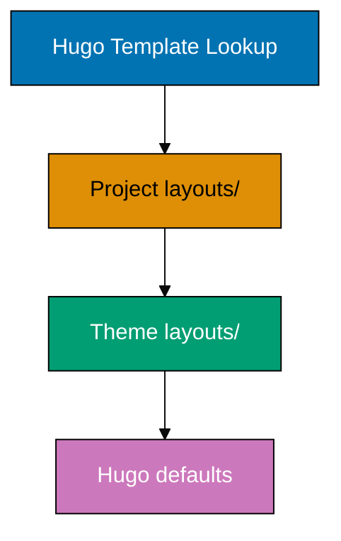
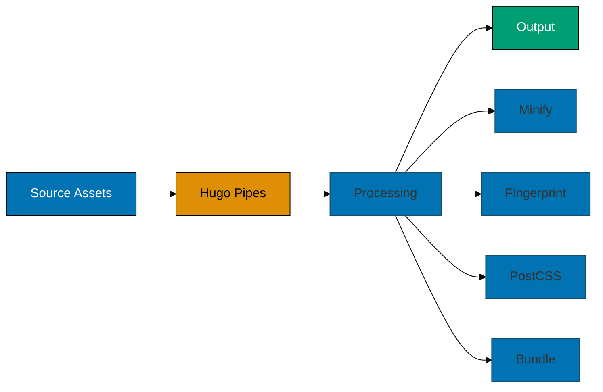

# Hugo Development Convention

Standards for developing the non-content aspects of Hugo websites in this repository. This convention covers theme customization, layout development, asset management, configuration, and build processes for **ayokoding-web** (Hextra theme) and **ose-platform-web** (PaperMod theme).

## Principles Respected

This practice respects the following core principles:

- **[Accessibility First](../principles/content/ex-pr-co__accessibility-first.md)**: Theme development enforces WCAG compliance, semantic HTML, keyboard navigation, screen reader support, and color-blind friendly palettes. Accessibility is built into the infrastructure, not added as an afterthought.

- **[Explicit Over Implicit](../principles/software-engineering/ex-pr-se__explicit-over-implicit.md)**: Hugo's template lookup order is explicitly documented. Configuration in `hugo.yaml` uses clear, stated values - no reliance on undocumented defaults. Theme overrides are visible in `layouts/` directory structure.

## 📋 Purpose

This convention defines standards for:

- **Theme Development** - Customizing and extending Hextra and PaperMod themes
- **Layout Organization** - Creating and organizing Hugo templates
- **Asset Management** - Processing CSS, JavaScript, and images
- **Configuration** - Managing hugo.yaml and environment-specific settings
- **i18n/l10n** - Implementing internationalization and localization
- **Performance** - Optimizing site speed and build times
- **SEO** - Implementing search engine optimization in templates
- **Accessibility** - Ensuring WCAG compliance in theme code
- **Build & Deployment** - Managing build scripts and deployment configuration

## 🎯 Scope

**This Convention Applies To:**

- `apps/ayokoding-web/` - Educational platform (Hextra theme)
- `apps/ose-platform-web/` - Project landing page (PaperMod theme v7.0+)

**Files In Scope:**

- `layouts/` - Custom templates and partials
- `assets/` - CSS, JavaScript, images (processed by Hugo Pipes)
- `static/` - Static files served as-is
- `hugo.yaml` - Hugo configuration
- `i18n/` - Translation files
- `archetypes/` - Content templates
- `data/` - Data files (JSON, YAML, TOML)
- `build.sh` - Build scripts
- `vercel.json` - Deployment configuration

**Out of Scope (See Hugo Content Convention):**

- `content/` - Markdown content files (handled by content agents)
- Content frontmatter - Content metadata (handled by content agents)
- Writing style - Content quality (handled by content checkers)

## 🔗 Related Conventions

This convention builds upon and references:

- [Hugo Content Convention - Shared](../conventions/ex-co__hugo-content-shared.md) - Shared content standards (complementary)
- [Hugo Content Convention - ayokoding](../conventions/ex-co__hugo-content-ayokoding.md) - ayokoding-web content standards
- [Hugo Content Convention - OSE Platform](../conventions/ex-co__hugo-content-ose-platform.md) - ose-platform-web content standards
- [Color Accessibility Convention](../conventions/ex-co__color-accessibility.md) - Accessible color palette for themes
- [Diagram Convention](../conventions/ex-co__diagrams.md) - Mermaid diagrams in documentation
- [Content Quality Principles](../conventions/ex-co__content-quality.md) - Universal markdown standards

## 🏗️ Theme Development

### Theme Hierarchy

Hugo uses a cascading override system. Understanding the lookup order is critical:



**Priority Order** (highest to lowest):

1. **Project layouts/** - Your custom templates (highest priority)
2. **Theme layouts/** - Theme's templates
3. **Hugo defaults** - Built-in templates

### Customization Strategies

**Override Individual Files:**

```
apps/ayokoding-web/
├── layouts/
│   ├── _default/
│   │   └── baseof.html       # Overrides theme's baseof.html
│   └── partials/
│       └── head/custom.html   # Overrides theme's custom head
└── themes/hextra/
    └── layouts/               # Original theme files (DO NOT modify)
```

**When to Override vs Fork:**

| Scenario                            | Strategy                                      | Rationale                    |
| ----------------------------------- | --------------------------------------------- | ---------------------------- |
| Minor customization (colors, fonts) | Override via `assets/` or `layouts/partials/` | Easier theme updates         |
| Custom component                    | Create new partial in `layouts/partials/`     | Isolated, maintainable       |
| Major theme changes                 | Consider forking theme                        | Full control, harder updates |
| Bug fix                             | Override temporarily, PR to upstream          | Contribute back              |

### ayokoding-web (Hextra Theme) Specifics

**Theme Repository:** `imfing/hextra`

**Key Override Points:**

- `layouts/partials/head/custom.html` - Custom head tags
- `layouts/partials/footer/custom.html` - Custom footer
- `assets/css/custom.css` - Custom styles
- `assets/js/custom.js` - Custom JavaScript

**Hextra Shortcodes to Understand:**

- `` - Alert boxes
- `` - Card grids
- `` - Step-by-step instructions
- `` - Tabbed content

**Hextra Configuration Params:**

```yaml
params:
  navbar:
    displayTitle: true
    displayLogo: true
  footer:
    displayCopyright: true
    displayPoweredBy: false
  theme:
    default: system # light, dark, or system
    displayToggle: true
```

### ose-platform-web (PaperMod Theme v7.0+) Specifics

**Theme Repository:** `adityatelange/hugo-PaperMod`

**Theme Location:** `themes/PaperMod/` (Git submodule)

**Key Override Points:**

- `layouts/partials/extend_head.html` - Custom head tags
- `layouts/partials/extend_footer.html` - Custom footer
- `assets/css/extended/custom.css` - Extended styles (recommended)
- `layouts/_default/single.html` - Custom single page layout (if needed)

**PaperMod Configuration Params:**

```yaml
params:
  ShowReadingTime: true
  ShowShareButtons: true
  ShowPostNavLinks: true
  ShowBreadCrumbs: true
  ShowCodeCopyButtons: true
  ShowWordCount: true
  UseHugoToc: true
  disableSpecial1stPost: false
  disableScrollToTop: false
  comments: false
  hidemeta: false
  hideSummary: false
  showtoc: true
  tocopen: false
```

**Cover Images (PaperMod):**

```yaml
cover:
  image: "/images/cover.jpg"
  alt: "Cover image description"
  caption: "Image caption"
  relative: false # Set to true for page bundle images
  hidden: false # Hide image on post but show in lists
```

## 📐 Layout Organization

### Directory Structure

```
layouts/
├── _default/
│   ├── baseof.html        # Base template (wraps all pages)
│   ├── list.html          # List pages (sections, taxonomies)
│   ├── single.html        # Single pages (individual posts)
│   └── terms.html         # Taxonomy term pages
├── partials/
│   ├── head.html          # HTML head
│   ├── header.html        # Site header
│   ├── footer.html        # Site footer
│   └── custom/
│       └── mypartial.html # Custom reusable components
├── shortcodes/
│   └── myshortcode.html   # Custom shortcodes
└── index.html             # Homepage template
```

### Template Hierarchy

Hugo uses a specific lookup order for templates. Understanding this prevents confusion:

**For a blog post** (`content/blog/my-post.md`):

1. `layouts/blog/single.html`
2. `layouts/_default/single.html`
3. `themes/{theme}/layouts/blog/single.html`
4. `themes/{theme}/layouts/_default/single.html`

**For a list page** (`content/blog/_index.md`):

1. `layouts/blog/list.html`
2. `layouts/_default/list.html`
3. `themes/{theme}/layouts/blog/list.html`
4. `themes/{theme}/layouts/_default/list.html`

### Naming Conventions

**Template Files:**

- `baseof.html` - Base template (lowercase, one word)
- `single.html` - Single page template
- `list.html` - List page template
- `terms.html` - Taxonomy terms template

**Partial Files:**

- `head.html` - Lowercase, descriptive
- `site-header.html` - Kebab-case for multi-word
- `article-meta.html` - Kebab-case preferred

**Shortcode Files:**

- `callout.html` - Lowercase, one word preferred
- `code-block.html` - Kebab-case for multi-word
- Use descriptive, action-oriented names

### Partial Templates Best Practices

**Creating Reusable Partials:**

```html
<!-- layouts/partials/custom/article-card.html -->
{{- $article := . -}}
<article class="article-card">
  <h2><a href="{{ $article.RelPermalink }}">{{ $article.Title }}</a></h2>
  <p>{{ $article.Summary }}</p>
  <time datetime="{{ $article.Date.Format "2006-01-02" }}">
    {{ $article.Date.Format "January 2, 2006" }}
  </time>
</article>
```

**Using Partials:**

```html
<!-- In any template -->
{{ range .Pages }} {{ partial "custom/article-card.html" . }} {{ end }}
```

**Partial Context:**

- `.` - Current context (page, data, custom)
- `dict` - Pass multiple values: `{{ partial "name.html" (dict "page" . "param" $value) }}`

## 🎨 Asset Pipeline

### Hugo Pipes Overview

Hugo Pipes processes assets at build time. Use for CSS, JavaScript, images.



### CSS Processing

**Location:** `assets/css/`

**PostCSS Configuration** (`postcss.config.js`):

```javascript
module.exports = {
  plugins: {
    autoprefixer: {},
    cssnano: {
      preset: "default",
    },
  },
};
```

**In Templates:**

```html
<!-- layouts/partials/head.html -->
{{ $css := resources.Get "css/main.css" }} {{ $css = $css | resources.PostCSS }}
{{ if hugo.IsProduction }} {{ $css = $css | minify | fingerprint }} {{ end }}
<link rel="stylesheet" href="{{ $css.RelPermalink }}" />
```

**SCSS/SASS:**

```html
{{ $scss := resources.Get "scss/main.scss" }} {{ $css := $scss | resources.ToCSS
| minify | fingerprint }}
<link rel="stylesheet" href="{{ $css.RelPermalink }}" />
```

### JavaScript Processing

**Location:** `assets/js/`

**Bundling:**

```html
{{ $js := resources.Get "js/main.js" }} {{ $js = $js | js.Build }} {{ if
hugo.IsProduction }} {{ $js = $js | minify | fingerprint }} {{ end }}
<script src="{{ $js.RelPermalink }}"></script>
```

**ES6 Modules:**

```javascript
// assets/js/main.js
import { myFunction } from "./utils.js";

myFunction();
```

### Image Processing

**Resize Images:**

```html
{{ $image := resources.Get "images/hero.jpg" }} {{ $resized := $image.Resize
"800x" }} 
```

**Responsive Images:**

```html
{{ $image := resources.Get "images/hero.jpg" }} {{ $small := $image.Resize
"400x" }} {{ $medium := $image.Resize "800x" }} {{ $large := $image.Resize
"1200x" }}


```

**WebP Conversion:**

```html
{{ $image := resources.Get "images/photo.jpg" }} {{ $webp := $image.Resize "800x
webp" }}
<picture>
  <source srcset="{{ $webp.RelPermalink }}" type="image/webp" />
  
</picture>
```

### Asset Organization

```
assets/
├── css/
│   ├── main.css           # Main stylesheet
│   ├── custom.css         # Site-specific styles
│   └── components/        # Component-specific styles
│       ├── nav.css
│       └── footer.css
├── js/
│   ├── main.js            # Main JavaScript
│   ├── utils.js           # Utility functions
│   └── components/        # Component-specific JS
│       └── search.js
└── images/
    ├── logo.svg           # Site logo
    └── hero.jpg           # Hero images
```

**Static vs Assets:**

- **`assets/`** - Files processed by Hugo Pipes (CSS, JS, images needing processing)
- **`static/`** - Files served as-is (fonts, favicons, robots.txt, third-party libraries)

## ⚙️ Configuration Management

### hugo.yaml Structure

**Organized Configuration:**

```yaml
# Basic Settings
baseURL: "https://ayokoding.com/"
title: "Ayo Koding"
languageCode: "id"
defaultContentLanguage: "id"

# Build Settings
enableRobotsTXT: true
enableGitInfo: true
enableEmoji: true

# Markup Configuration
markup:
  goldmark:
    renderer:
      unsafe: true # Allow raw HTML in markdown
  highlight:
    style: "monokai"
    lineNos: true
    codeFences: true

# Output Formats
outputs:
  home:
    - HTML
    - RSS
    - JSON # For search index

# Taxonomies
taxonomies:
  tag: tags
  category: categories
  series: series

# Languages (for multilingual sites)
languages:
  id:
    languageName: "Bahasa Indonesia"
    weight: 1
    params:
      description: "Platform belajar coding"
  en:
    languageName: "English"
    weight: 2
    params:
      description: "Coding learning platform"

# Menu Configuration
menu:
  main:
    - name: "Blog"
      url: "/blog/"
      weight: 1
    - name: "Tutorial"
      url: "/tutorial/"
      weight: 2
    - name: "About"
      url: "/about/"
      weight: 3

# Site Params (theme-specific)
params:
  # SEO
  description: "Platform belajar coding untuk developer Indonesia"
  author: "Your Name"

  # Social Links
  social:
    twitter: "https://twitter.com/yourusername"
    github: "https://github.com/yourusername"

  # Analytics
  googleAnalytics: "G-XXXXXXXXXX"

  # Theme-specific params
  # (See theme documentation)
```

### Environment-Specific Configuration

**Production** (`hugo.yaml`):

```yaml
baseURL: "https://ayokoding.com/"
buildFuture: false
buildDrafts: false
```

**Development** (`config/development/hugo.yaml`):

```yaml
baseURL: "http://localhost:1313/"
buildFuture: true
buildDrafts: true
enableLiveReload: true
```

**Load Environment Config:**

```bash
# Development
hugo server --environment development

# Production
hugo --environment production
```

### Module Configuration

**Using Hugo Modules:**

```yaml
module:
  imports:
    - path: github.com/imfing/hextra
      disabled: false
  mounts:
    - source: "static"
      target: "static"
    - source: "layouts"
      target: "layouts"
```

## 🌍 Internationalization (i18n)

### Translation Files

**Location:** `i18n/`

**Structure:**

```
i18n/
├── id.yaml       # Indonesian
└── en.yaml       # English
```

**Translation File Format** (`i18n/id.yaml`):

```yaml
# Navigation
- id: home
  translation: "Beranda"
- id: blog
  translation: "Blog"
- id: about
  translation: "Tentang"

# Common phrases
- id: readMore
  translation: "Baca Selengkapnya"
- id: publishedOn
  translation: "Dipublikasikan pada"

# Pluralization
- id: minuteRead
  translation:
    one: "{{ .Count }} menit baca"
    other: "{{ .Count }} menit baca"
```

**Using Translations in Templates:**

```html
<!-- Simple translation -->
<a href="/">{{ i18n "home" }}</a>

<!-- Translation with count -->
<span>{{ i18n "minuteRead" .ReadingTime }}</span>

<!-- Fallback if translation missing -->
<span>{{ i18n "unknown" | default "Default Text" }}</span>
```

### Language Switching

**Menu for Language Selection:**

```html
<!-- layouts/partials/language-switcher.html -->
<nav class="language-switcher">
  {{ range .Site.Languages }} {{ if ne . $.Site.Language }}
  <a href="{{ .Lang | relLangURL }}">{{ .LanguageName }}</a>
  {{ end }} {{ end }}
</nav>
```

### Multilingual Content

**Content Structure:**

```
content/
├── blog/
│   ├── my-post.id.md    # Indonesian version
│   └── my-post.en.md    # English version
└── _index.id.md         # Indonesian home
    _index.en.md         # English home
```

**Automatic Language Detection:**

```html
<!-- In baseof.html -->
<html lang="{{ .Site.Language.Lang }}"></html>
```

## 🚀 Performance Optimization

### Image Optimization

**Always Process Images:**

```html
<!-- ❌ Bad: Using original large image -->


<!-- ✅ Good: Resized and optimized -->
{{ $image := resources.Get "images/hero.jpg" }} {{ $resized := $image.Resize
"800x webp q85" }}

```

**Lazy Loading:**

```html

```

### Asset Minification

**Always Minify in Production:**

```html
{{ $css := resources.Get "css/main.css" | resources.PostCSS }} {{ if
hugo.IsProduction }} {{ $css = $css | minify | fingerprint }} {{ end }}
<link rel="stylesheet" href="{{ $css.RelPermalink }}" />
```

### Caching Strategy

**Fingerprinting for Cache Busting:**

```html
{{ $js := resources.Get "js/main.js" | js.Build | minify | fingerprint }}
<!-- Generates: /js/main.a1b2c3d4.min.js -->
<script src="{{ $js.RelPermalink }}"></script>
```

**Cache-Control Headers** (Vercel):

```json
{
  "headers": [
    {
      "source": "/assets/(.*)",
      "headers": [
        {
          "key": "Cache-Control",
          "value": "public, max-age=31536000, immutable"
        }
      ]
    }
  ]
}
```

### Build Optimization

**Reduce Build Time:**

```yaml
# hugo.yaml
caches:
  getjson:
    maxAge: 10m
  getcsv:
    maxAge: 10m
  images:
    maxAge: 24h

build:
  useResourceCacheWhen: "fallback"
```

## 🔍 SEO Best Practices

### Meta Tags

**Essential Meta Tags** (`layouts/partials/head.html`):

```html
<!-- Basic Meta -->
<meta charset="utf-8" />
<meta name="viewport" content="width=device-width, initial-scale=1" />
<meta
  name="description"
  content="{{ .Description | default .Site.Params.description }}"
/>
<meta name="author" content="{{ .Site.Params.author }}" />

<!-- Open Graph -->
<meta property="og:title" content="{{ .Title }}" />
<meta
  property="og:description"
  content="{{ .Description | default .Site.Params.description }}"
/>
<meta
  property="og:type"
  content="{{ if .IsPage }}article{{ else }}website{{ end }}"
/>
<meta property="og:url" content="{{ .Permalink }}" />
{{ with .Params.cover.image }}
<meta property="og:image" content="{{ . | absURL }}" />
{{ end }}

<!-- Twitter Card -->
<meta name="twitter:card" content="summary_large_image" />
<meta name="twitter:title" content="{{ .Title }}" />
<meta
  name="twitter:description"
  content="{{ .Description | default .Site.Params.description }}"
/>
{{ with .Site.Params.social.twitter }}
<meta name="twitter:site" content="@{{ . }}" />
{{ end }}

<!-- Canonical URL -->
<link rel="canonical" href="{{ .Permalink }}" />
```

### Structured Data (JSON-LD)

**Article Schema:**

```html
<!-- layouts/partials/structured-data.html -->
{{ if .IsPage }}
<script type="application/ld+json">
  {
    "@context": "https://schema.org",
    "@type": "Article",
    "headline": {{ .Title }},
    "description": {{ .Description }},
    "datePublished": {{ .Date.Format "2006-01-02T15:04:05Z07:00" }},
    "dateModified": {{ .Lastmod.Format "2006-01-02T15:04:05Z07:00" }},
    "author": {
      "@type": "Person",
      "name": {{ .Site.Params.author }}
    },
    "publisher": {
      "@type": "Organization",
      "name": {{ .Site.Title }},
      "logo": {
        "@type": "ImageObject",
        "url": {{ .Site.Params.logo | absURL }}
      }
    }
  }
</script>
{{ end }}
```

### Sitemap Configuration

**Custom Sitemap** (`layouts/sitemap.xml`):

```xml
{{ printf "<?xml version=\"1.0\" encoding=\"utf-8\" standalone=\"yes\"?>" | safeHTML }}
<urlset xmlns="http://www.sitemaps.org/schemas/sitemap/0.9">
  {{ range .Data.Pages }}
  <url>
    <loc>{{ .Permalink }}</loc>
    {{ if not .Lastmod.IsZero }}
    <lastmod>{{ .Lastmod.Format "2006-01-02T15:04:05Z07:00" }}</lastmod>
    {{ end }}
    {{ with .Sitemap.ChangeFreq }}
    <changefreq>{{ . }}</changefreq>
    {{ end }}
    {{ if ge .Sitemap.Priority 0.0 }}
    <priority>{{ .Sitemap.Priority }}</priority>
    {{ end }}
  </url>
  {{ end }}
</urlset>
```

### robots.txt

**Location:** `layouts/robots.txt`

```
User-agent: *
{{ if hugo.IsProduction }}
Allow: /
{{ else }}
Disallow: /
{{ end }}

Sitemap: {{ .Site.BaseURL }}sitemap.xml
```

## ♿ Accessibility (WCAG Compliance)

### Semantic HTML

**Use Proper HTML5 Elements:**

```html
<!-- ✅ Good: Semantic structure -->
<article>
  <header>
    <h1>Article Title</h1>
    <time datetime="2025-12-07">December 7, 2025</time>
  </header>
  <main>
    <p>Article content...</p>
  </main>
  <footer>
    <nav aria-label="Article navigation">
      <!-- Navigation links -->
    </nav>
  </footer>
</article>

<!-- ❌ Bad: Divs everywhere -->
<div class="article">
  <div class="header">
    <div class="title">Article Title</div>
  </div>
</div>
```

### ARIA Labels

**Navigation with ARIA:**

```html
<nav aria-label="Main navigation">
  <ul>
    <li><a href="/">Home</a></li>
    <li><a href="/blog/">Blog</a></li>
  </ul>
</nav>

<nav aria-label="Breadcrumb">
  <ol>
    <li><a href="/">Home</a></li>
    <li><a href="/blog/">Blog</a></li>
    <li aria-current="page">Current Post</li>
  </ol>
</nav>
```

**Skip Links:**

```html
<!-- layouts/partials/header.html -->
<a href="#main-content" class="skip-link">Skip to main content</a>

<!-- layouts/_default/baseof.html -->
<main id="main-content" tabindex="-1">{{ block "main" . }}{{ end }}</main>
```

### Color Contrast

**Use Accessible Color Palette:**

Refer to [Color Accessibility Convention](../conventions/ex-co__color-accessibility.md) for the verified accessible palette:

- Blue: `#0173B2`
- Orange: `#DE8F05`
- Teal: `#029E73`
- Purple: `#CC78BC`
- Brown: `#CA9161`

**Check Contrast Ratios:**

- **Normal text:** Minimum 4.5:1
- **Large text (18pt+):** Minimum 3:1
- **Interactive elements:** Minimum 3:1

### Alt Text for Images

**Always Provide Descriptive Alt Text:**

```html
<!-- ✅ Good: Descriptive alt text -->


<!-- ❌ Bad: Generic alt text -->


<!-- Decorative images -->

```

### Keyboard Navigation

**Ensure Keyboard Accessibility:**

```html
<!-- ✅ Good: Proper focus management -->
<button type="button" aria-label="Open menu" aria-expanded="false">Menu</button>

<!-- Visible focus indicator in CSS -->
<style>
  :focus {
    outline: 2px solid #0173b2;
    outline-offset: 2px;
  }
</style>
```

## 🛠️ Shortcode Development

### When to Create Shortcodes

**Create shortcodes for:**

- Reusable content components
- Complex HTML structures
- Interactive elements
- Third-party embeds

**Don't create shortcodes for:**

- Simple text formatting (use markdown)
- One-off elements
- Content that should be in data files

### Shortcode Types

**Inline Shortcode:**

```html
<!-- layouts/shortcodes/highlight.html -->
<mark class="highlight">{{ .Inner }}</mark>

<!-- Usage: -->
This is important text
```

**Block Shortcode:**

```html
<!-- layouts/shortcodes/note.html -->
<div class="note note--{{ .Get "type" | default "info" }}">
  {{ .Inner | .Page.RenderString }}
</div>

<!-- Usage: -->

This is a warning message with **markdown** support.

```

**Shortcode with Parameters:**

```html
<!-- layouts/shortcodes/youtube.html -->
<div class="video-embed">
  <iframe
    src="https://www.youtube.com/embed/{{ .Get 0 }}"
    title="YouTube video"
    frameborder="0"
    allow="accelerometer; autoplay; clipboard-write; encrypted-media; gyroscope; picture-in-picture"
    allowfullscreen>
  </iframe>
</div>

<!-- Usage: -->

```

### Shortcode Best Practices

**Named vs Positional Parameters:**

```html
<!-- Named parameters (preferred for multiple params) -->


<!-- Positional parameters (OK for 1-2 params) -->

```

**Access Parameters:**

```html
{{ .Get "src" }}
<!-- Named parameter -->
{{ .Get 0 }}
<!-- First positional parameter -->
{{ .Inner }}
<!-- Content between opening/closing tags -->
{{ .Page.RenderString }}
<!-- Render markdown in .Inner -->
```

**Error Handling:**

```html
{{ with .Get "src" }}
  
{{ else }}
  {{ errorf "image shortcode missing required 'src' parameter" }}
{{ end }}
```

## 🏗️ Build and Deployment

### Build Scripts

**Location:** `apps/{site}/build.sh`

**Standard Build Script:**

```bash
#!/bin/bash
set -e  # Exit on error

echo "Building Hugo site..."

# Install dependencies (if needed)
# npm install

# Build with Hugo
hugo --gc --minify

echo "Build complete!"
```

**Make Executable:**

```bash
chmod +x build.sh
```

### Vercel Configuration

**Location:** `apps/{site}/vercel.json`

**Standard Configuration:**

```json
{
  "buildCommand": "cd apps/ayokoding-web && bash build.sh",
  "outputDirectory": "apps/ayokoding-web/public",
  "framework": "hugo",
  "env": {
    "HUGO_VERSION": "0.139.4"
  },
  "headers": [
    {
      "source": "/assets/(.*)",
      "headers": [
        {
          "key": "Cache-Control",
          "value": "public, max-age=31536000, immutable"
        }
      ]
    },
    {
      "source": "/(.*).html",
      "headers": [
        {
          "key": "Cache-Control",
          "value": "public, max-age=0, must-revalidate"
        }
      ]
    }
  ],
  "redirects": [
    {
      "source": "/old-path",
      "destination": "/new-path",
      "permanent": true
    }
  ]
}
```

### Environment Variables

**In Vercel Dashboard:**

- `HUGO_VERSION` - Hugo version to use
- `NODE_VERSION` - Node.js version (for PostCSS)
- `HUGO_ENV` - `production` for production build

**Access in Templates:**

```html
{{ if eq (getenv "HUGO_ENV") "production" }}
<!-- Production-only code -->
{{ end }}
```

### Deployment Workflow

**ayokoding-web:**

1. Make changes in `main` branch
2. Test locally: `hugo server`
3. Commit and push to `main`
4. Deploy: Synchronize `prod-ayokoding-web` branch with `main`
5. Push `prod-ayokoding-web` to trigger Vercel deployment

**ose-platform-web:**

1. Make changes in `main` branch
2. Test locally: `hugo server`
3. Commit and push to `main`
4. Deploy: Synchronize `prod-ose-platform-web` branch with `main`
5. Push `prod-ose-platform-web` to trigger Vercel deployment

**Use Deployment Agents:**

- `ayokoding-deployer` - Automates ayokoding-web deployment
- `ose-platform-web-deployer` - Automates ose-platform-web deployment

## 🧪 Testing and Validation

### Local Testing

**Development Server:**

```bash
cd apps/ayokoding-web
hugo server -D  # Include drafts
```

**Test Build:**

```bash
hugo --gc --minify
```

**Check for Errors:**

```bash
hugo --gc --minify --printPathWarnings
```

### Validation Checklist

**Before Deployment:**

- [ ] All links work (no 404s)
- [ ] Images load correctly
- [ ] CSS and JS processed correctly
- [ ] Build completes without errors
- [ ] No broken shortcodes
- [ ] Multilingual content synced (if applicable)
- [ ] Meta tags correct
- [ ] Sitemap generated
- [ ] robots.txt correct

**Performance:**

- [ ] Images optimized and resized
- [ ] Assets minified in production
- [ ] Fingerprinting enabled
- [ ] Lazy loading implemented
- [ ] No console errors

**Accessibility:**

- [ ] All images have alt text
- [ ] Proper heading hierarchy
- [ ] Keyboard navigation works
- [ ] Color contrast meets WCAG AA
- [ ] Semantic HTML used

## 📚 Hugo Commands Reference

### Common Commands

**Development:**

```bash
hugo server                    # Start dev server
hugo server -D                 # Include drafts
hugo server --bind 0.0.0.0     # Allow external access
hugo server --disableFastRender # Disable fast render
```

**Building:**

```bash
hugo                           # Build site (output to public/)
hugo --gc                      # Run garbage collection
hugo --minify                  # Minify output
hugo --environment production  # Use production config
```

**Content:**

```bash
hugo new blog/my-post.md       # Create new content
hugo new --kind tutorial tutorial/my-tutorial.md  # Use archetype
```

**Information:**

```bash
hugo version                   # Show Hugo version
hugo env                       # Show Hugo environment
hugo list all                  # List all content
hugo list drafts               # List draft content
```

**Module Management:**

```bash
hugo mod init github.com/user/repo    # Initialize module
hugo mod get -u                        # Update all modules
hugo mod get -u github.com/user/repo  # Update specific module
hugo mod tidy                          # Remove unused modules
```

## ✅ Best Practices

Following these best practices ensures maintainable, performant, and accessible Hugo sites.

### 1. Use Hugo Extended Version

**Always install hugo-extended:**

```bash
# Check your version
hugo version

# Should show: hugo v0.139.4+extended
```

**Why:** Hugo extended includes SCSS/SASS support, essential for modern theme development.

**Source:** [Guide to Using Hugo in 2024 and 2025](https://strapi.io/blog/guide-to-using-hugo-site-generator)

### 2. Assets Directory for Processed Files

**Use `assets/` for Hugo Pipes processing:**

```
assets/           # Files processed by Hugo Pipes
├── css/
├── js/
└── images/       # Images needing resize/optimize

static/           # Files served as-is (no processing)
├── fonts/
├── favicon.ico
└── robots.txt
```

**Why:** Hugo Pipes only works on files in `assets/` directory. Files in `static/` are copied as-is.

**Source:** [Hugo Pipes Revolution](https://www.regisphilibert.com/blog/2018/07/hugo-pipes-and-asset-processing-pipeline/)

### 3. Leverage Hugo Pipes Caching

**Cache processed assets:**

```html
{{ $css := resources.Get "css/main.css" | resources.PostCSS }} {{ if
hugo.IsProduction }} {{ $css = $css | minify | fingerprint }} {{ end }}
<link rel="stylesheet" href="{{ $css.RelPermalink }}" />
```

**Why:** Hugo Pipes caches processed assets. The pipe chain is only invoked the first time, then loaded from cache on subsequent builds.

**Performance Impact:** Can save thousands of processing cycles on large sites.

**Source:** [Hugo Pipes](https://gohugo.io/hugo-pipes/)

### 4. Commit resources/\_gen to Git

**Include processed images in Git:**

```bash
# Add to .gitignore (remove resources/_gen if it's there)
# /resources/_gen/images  # ❌ Don't ignore this

# Commit the cache
git add resources/_gen
git commit -m "chore: add Hugo resources cache"
```

**Why:** Pre-processed images dramatically speed up builds, especially on CI/CD.

**Performance Gain:** Build times can drop from 6 minutes to 1 minute (90%+ faster).

**Source:** [Better performance with Hugo Pipes](https://byteplumbing.net/2021/10/better-performance-with-hugo-pipes/)

### 5. Use Partials for Reusable Components

**Create modular partials:**

```html
<!-- layouts/partials/components/card.html -->
{{ $title := .title }} {{ $description := .description }}
<div class="card">
  <h3>{{ $title }}</h3>
  <p>{{ $description }}</p>
</div>

<!-- Use in layouts and shortcodes -->
{{ partial "components/card.html" (dict "title" "My Title" "description"
"Description") }}
```

**Why:** Partials can be used in both layouts and shortcodes, promoting reusability.

**Source:** [HUGO component Reuse](https://shubhadip.medium.com/hugo-component-reuse-cc8cff8bf7f8)

### 6. Use `hugo new` Command

**Always use archetypes:**

```bash
# ✅ Correct: Uses archetype
hugo new blog/my-post.md

# ❌ Avoid: Manual file creation
touch content/blog/my-post.md
```

**Why:** `hugo new` automatically populates frontmatter from archetypes, ensuring consistency.

**Source:** [4 Hugo Beginner Mistakes](https://www.brewinstallbuzzwords.com/posts/hugo-beginner-mistakes/)

### 7. Image Processing for All Images

**Always resize and optimize:**

```html
<!-- ❌ Bad: Using original -->


<!-- ✅ Good: Resized and optimized -->
{{ $image := resources.Get "images/photo.jpg" }} {{ $resized := $image.Resize
"800x webp q85" }}

```

**Why:** Hugo can resize and convert images faster than any other SSG. Use this capability.

**Performance:** Reduces image size by 60-80% on average.

**Sources:**

- [Responsive and optimized images with Hugo](https://www.brycewray.com/posts/2022/06/responsive-optimized-images-hugo/)
- [Image processing](https://gohugo.io/content-management/image-processing/)

### 8. Validate Shortcode Parameters

**Always validate required parameters:**

```html
<!-- layouts/shortcodes/image.html -->
{{ $src := .Get "src" }} {{ if not $src }} {{ errorf "image shortcode missing
required 'src' parameter in %s" .Position }} {{ end }} {{ $alt := .Get "alt" |
default "Image" }}

```

**Why:** Provides clear error messages during development instead of silent failures.

**Source:** [Creating Custom Hugo Shortcodes](https://www.koszek.com/til/hugo-shortcodes/)

### 9. Use Hugo Modules for Theme Components

**Modular, version-controlled components:**

```yaml
# hugo.yaml
module:
  imports:
    - path: github.com/imfing/hextra
```

**Why:** Hugo modules allow version control, easier updates, and better dependency management.

**Source:** [Best practices for theme development & Hugo Modules](https://discourse.gohugo.io/t/best-practices-for-theme-development-hugo-modules/30568)

### 10. Fingerprint Assets in Production

**Cache busting with fingerprinting:**

```html
{{ $js := resources.Get "js/main.js" | js.Build }} {{ if hugo.IsProduction }} {{
$js = $js | minify | fingerprint }} {{ end }}
<!-- Generates: /js/main.a1b2c3d4.min.js -->
<script src="{{ $js.RelPermalink }}"></script>
```

**Why:** Fingerprinting generates unique filenames based on content hash, enabling long cache times while ensuring users get updated assets.

**Source:** [Hugo Pipes](https://gohugo.io/hugo-pipes/)

## ⚠️ Antipatterns to Avoid

These common mistakes can cause maintenance headaches, performance issues, or broken builds.

### 1. ❌ Editing Theme Files Directly

**Antipattern:**

```bash
# ❌ Bad: Editing theme files directly
vim themes/hextra/layouts/_default/baseof.html
```

**Problem:**

- Breaks theme updates
- Loses changes when theme is updated
- Merges conflicts with upstream

**Solution:**

```bash
# ✅ Good: Override in your layouts directory
cp themes/hextra/layouts/_default/baseof.html layouts/_default/baseof.html
# Now edit layouts/_default/baseof.html
```

**Why:** Hugo checks your `layouts/` directory first before looking in theme. Your files take precedence.

**Source:** [Hugo - Customizing a Theme](https://bwaycer.github.io/hugo_tutorial.hugo/themes/customizing/)

### 2. ❌ Not Cleaning Destination Directory

**Antipattern:**

```bash
# ❌ Bad: Building without cleaning
hugo
```

**Problem:** Old files from previous builds remain in `public/`, potentially deploying deleted content or old drafts.

**Solution:**

```bash
# ✅ Good: Always clean before building
hugo --gc --minify

# Or in build script
rm -rf public/
hugo --gc --minify
```

**Why:** Hugo only generates new content and overwrites existing files. Deleted or draft files aren't automatically removed.

**Source:** [4 Hugo Beginner Mistakes](https://www.brewinstallbuzzwords.com/posts/hugo-beginner-mistakes/)

### 3. ❌ Using Static for Processed Assets

**Antipattern:**

```
static/
├── css/main.css      # ❌ Should be in assets/
├── js/app.js         # ❌ Should be in assets/
└── images/large.jpg  # ❌ Should be in assets/ for processing
```

**Problem:** Files in `static/` bypass Hugo Pipes processing - no minification, fingerprinting, or image optimization.

**Solution:**

```
assets/
├── css/main.css      # ✅ Processed with PostCSS/minify
├── js/app.js         # ✅ Bundled and minified
└── images/large.jpg  # ✅ Resized and optimized

static/
├── fonts/            # ✅ Served as-is (correct)
├── favicon.ico       # ✅ Served as-is (correct)
└── robots.txt        # ✅ Served as-is (correct)
```

**Why:** `assets/` files are processed; `static/` files are served as-is.

**Source:** [Hugo Pipes Introduction](https://gohugo.io/hugo-pipes/introduction/)

### 4. ❌ Not Using .RelPermalink for Assets

**Antipattern:**

```html
<!-- ❌ Bad: Hardcoded path -->
<link rel="stylesheet" href="/css/main.css" />
```

**Problem:**

- Doesn't work with CDN or subdirectory deployments
- Misses Hugo's asset pipeline benefits
- No cache busting

**Solution:**

```html
<!-- ✅ Good: Use RelPermalink -->
{{ $css := resources.Get "css/main.css" | resources.PostCSS | minify |
fingerprint }}
<link rel="stylesheet" href="{{ $css.RelPermalink }}" />
```

**Why:** `.RelPermalink` generates correct URLs and triggers Hugo Pipes processing.

**Source:** [Hugo Pipes](https://gohugo.io/hugo-pipes/)

### 5. ❌ Ignoring Build Warnings

**Antipattern:**

```bash
hugo
# ...
# WARN: template not found
# ... build complete
# (Ignoring warnings)
```

**Problem:** Warnings indicate real issues that will cause problems in production.

**Solution:**

```bash
# ✅ Good: Check and fix all warnings
hugo --printPathWarnings
hugo --printUnusedTemplates

# Fail build on warnings in CI
hugo --logLevel warn
```

**Why:** Warnings today become errors tomorrow. Fix them immediately.

### 6. ❌ Not Specifying Language in Code Blocks

**Antipattern:**

```html
<!-- layouts/partials/code.html -->
<pre><code>{{ .Inner }}</code></pre>
```

**Problem:** No syntax highlighting, poor accessibility, no language indicator for screen readers.

**Solution:**

```html
<!-- ✅ Good: Specify language -->
<pre><code class="language-{{ .Get 0 }}">{{ .Inner }}</code></pre>

<!-- Or use Hugo's built-in highlight -->
{{ highlight .Inner (.Get 0) "" }}
```

**Why:** Syntax highlighting improves readability; language specification helps accessibility.

### 7. ❌ Hardcoding URLs

**Antipattern:**

```html
<!-- ❌ Bad: Hardcoded URL -->
<a href="https://mysite.com/blog/post-1/">Read more</a>
```

**Problem:** Breaks when changing domains, using localhost, or deploying to staging.

**Solution:**

```html
<!-- ✅ Good: Use .Permalink or relref -->
{{ $page := .Site.GetPage "/blog/post-1" }}
<a href="{{ $page.Permalink }}">Read more</a>

<!-- Or use relref for links -->
<a href="{{ ref . "/blog/post-1" }}">Read more</a>
```

**Why:** Hugo generates correct URLs for all environments.

### 8. ❌ Not Using Lazy Loading for Images

**Antipattern:**

```html
<!-- ❌ Bad: All images load immediately -->

```

**Problem:** Slows initial page load, wastes bandwidth for images below fold.

**Solution:**

```html
<!-- ✅ Good: Lazy load images -->

```

**Why:** Browser only loads images as they enter viewport, dramatically improving performance.

**Performance:** Can improve Largest Contentful Paint by 3+ seconds.

**Source:** [How to Add Image Processing to Your Hugo Website](https://alexlakatos.com/web/2020/07/17/hugo-image-processing/)

### 9. ❌ Creating Single-Use Shortcodes

**Antipattern:**

```html
<!-- layouts/shortcodes/specific-blog-post-header.html -->
<!-- Only used once in one specific blog post -->
<div class="special-header-only-for-post-123">
  <!-- Complex one-off layout -->
</div>
```

**Problem:** Adds complexity for no reusability benefit.

**Solution:**

```markdown
<!-- ✅ Good: Use HTML directly in markdown for one-offs -->
<div class="special-header">
  <!-- One-off layout directly in content -->
</div>
```

**Why:** Shortcodes are for reusable components. One-off layouts belong in content or partials.

**Source:** [Head to Head: Shortcodes vs Partials in Hugo](https://jpdroege.com/blog/hugo-shortcodes-partials/)

### 10. ❌ Skipping Environment-Specific Builds

**Antipattern:**

```bash
# ❌ Bad: Same build for dev and prod
hugo
```

**Problem:** Development builds include drafts, future posts, verbose logs. Production builds need minification, no drafts.

**Solution:**

```bash
# ✅ Good: Different builds for different environments

# Development
hugo server -D  # Include drafts

# Production
hugo --gc --minify --environment production
```

**Why:** Optimize for each environment's needs.

## 🧪 Testing and Quality Assurance

Before deploying Hugo site changes to production, complete this comprehensive testing checklist to ensure quality, performance, and accessibility standards are met.

### Build Testing

**✅ Pre-deployment Build Checks:**

```bash
# 1. Clean build test
rm -rf public/ resources/_gen/
hugo --gc --minify --environment production

# 2. Check for errors
echo $?  # Should output: 0 (success)

# 3. Verify output
ls -lh public/  # Ensure public/ directory created

# 4. Check warnings
hugo --printPathWarnings --printUnusedTemplates
# Fix all warnings before proceeding
```

**Checklist:**

- [ ] Build completes without errors (`exit code 0`)
- [ ] No WARN messages in build output
- [ ] `public/` directory generated successfully
- [ ] All expected pages present in `public/`
- [ ] No unused templates reported
- [ ] No path warnings reported

### Local Development Testing

**✅ Development Server Checks:**

```bash
# Start development server with drafts
hugo server -D --bind 0.0.0.0 --port 1313

# Open browser to http://localhost:1313
```

**Checklist:**

- [ ] Server starts without errors
- [ ] Homepage loads correctly
- [ ] All navigation links work (no 404s)
- [ ] All internal links work
- [ ] Images load correctly
- [ ] CSS styles applied
- [ ] JavaScript works (no console errors)
- [ ] Search functionality works (if applicable)
- [ ] Language switcher works (for multilingual sites)
- [ ] Mobile responsive design works
- [ ] No broken shortcodes

### Performance Testing

**✅ Performance Benchmarks:**

**1. Lighthouse Audit:**

```bash
# Use Chrome DevTools → Lighthouse
# Or use CLI:
npm install -g lighthouse
lighthouse http://localhost:1313 --output html --output-path ./lighthouse-report.html
```

**Target Scores (minimum):**

- Performance: 90+
- Accessibility: 95+
- Best Practices: 90+
- SEO: 95+

**2. Build Speed:**

```bash
# Measure build time
time hugo --gc --minify
```

**Targets:**

- Small sites (<100 pages): <5 seconds
- Medium sites (100-1000 pages): <30 seconds
- Large sites (>1000 pages): <2 minutes

**3. Page Load Speed:**

- First Contentful Paint (FCP): <1.8s
- Largest Contentful Paint (LCP): <2.5s
- Time to Interactive (TTI): <3.8s
- Cumulative Layout Shift (CLS): <0.1
- First Input Delay (FID): <100ms

**Checklist:**

- [ ] Lighthouse Performance score ≥ 90
- [ ] Lighthouse Accessibility score ≥ 95
- [ ] Lighthouse SEO score ≥ 95
- [ ] Build time within targets
- [ ] All images optimized and resized
- [ ] CSS and JS minified
- [ ] Assets fingerprinted
- [ ] Lazy loading implemented
- [ ] No render-blocking resources
- [ ] Core Web Vitals pass

### Accessibility Testing

**✅ WCAG AA Compliance:**

**1. Automated Testing:**

```bash
# Install axe-core CLI
npm install -g @axe-core/cli

# Run accessibility audit
axe http://localhost:1313 --exit
```

**2. Manual Testing:**

**Keyboard Navigation:**

- [ ] Tab through all interactive elements
- [ ] All focusable elements have visible focus indicators
- [ ] No keyboard traps
- [ ] Skip links work

**Screen Reader Testing:**

- [ ] Test with VoiceOver (macOS) or NVDA (Windows)
- [ ] All images have descriptive alt text
- [ ] Headings in logical order (H1 → H2 → H3)
- [ ] ARIA labels present where needed
- [ ] Form fields have labels
- [ ] Links have descriptive text (not "click here")

**Color Contrast:**

- [ ] Text meets 4.5:1 contrast ratio (normal text)
- [ ] Large text meets 3:1 contrast ratio
- [ ] Interactive elements meet 3:1 contrast ratio
- [ ] Use accessible color palette only

**Checklist:**

- [ ] Zero axe-core violations
- [ ] Keyboard navigation works fully
- [ ] Screen reader can access all content
- [ ] All images have alt text
- [ ] Proper heading hierarchy (single H1)
- [ ] Color contrast meets WCAG AA
- [ ] No color-only information
- [ ] Semantic HTML used

### SEO Testing

**✅ Search Engine Optimization:**

**1. Meta Tags Validation:**

```bash
# Check meta tags in generated HTML
grep -r "og:title\|og:description\|og:image" public/

# Verify canonical URLs
grep -r "rel=\"canonical\"" public/
```

**2. Structured Data:**

```bash
# Validate JSON-LD
# Visit: https://search.google.com/test/rich-results
# Or use schema.org validator
```

**Checklist:**

- [ ] Every page has unique `<title>` tag
- [ ] Every page has meta description
- [ ] Open Graph tags present (og:title, og:description, og:image)
- [ ] Twitter Card tags present
- [ ] Canonical URLs set correctly
- [ ] Structured data (JSON-LD) valid
- [ ] Sitemap.xml generated
- [ ] robots.txt correct
- [ ] No broken links
- [ ] URLs are SEO-friendly (no ugly slugs)
- [ ] Image alt text descriptive

### Browser Compatibility Testing

**✅ Cross-Browser Checks:**

**Test in:**

- [ ] Chrome (latest)
- [ ] Firefox (latest)
- [ ] Safari (latest)
- [ ] Edge (latest)
- [ ] Mobile Safari (iOS)
- [ ] Chrome Mobile (Android)

**Verify:**

- [ ] Layout renders correctly
- [ ] All features work
- [ ] No JavaScript errors
- [ ] CSS applied correctly
- [ ] Fonts load properly

### Content Validation

**✅ Content Quality Checks:**

**1. Link Checking:**

```bash
# Use docs-link-checker agent
# Or use htmltest
npm install -g htmltest
htmltest public/
```

**2. Spelling and Grammar:**

- [ ] Run spell checker on content
- [ ] Review for grammar errors
- [ ] Check for typos in code examples

**Checklist:**

- [ ] All internal links work
- [ ] All external links work (not broken)
- [ ] No 404 errors
- [ ] No spelling errors
- [ ] Grammar correct
- [ ] Code examples tested
- [ ] Frontmatter valid
- [ ] Dates in correct format (YYYY-MM-DDTHH:MM:SS+07:00)

### Security Testing

**✅ Security Checks:**

**1. Content Security:**

- [ ] No hardcoded secrets or API keys
- [ ] No sensitive information in HTML comments
- [ ] No debug information exposed

**2. HTTPS:**

- [ ] Site serves over HTTPS
- [ ] No mixed content warnings
- [ ] All external resources use HTTPS

**3. Headers:**

```bash
# Check security headers (on deployed site)
curl -I https://yourdomain.com
```

- [ ] `X-Content-Type-Options: nosniff`
- [ ] `X-Frame-Options: DENY` or `SAMEORIGIN`
- [ ] `Referrer-Policy` set
- [ ] `Permissions-Policy` set (optional)

### Deployment Readiness

**✅ Pre-Deployment Final Checks:**

**1. Environment Configuration:**

- [ ] `hugo.yaml` production settings correct
- [ ] `baseURL` matches production domain
- [ ] Draft pages excluded (`buildDrafts: false`)
- [ ] Future posts excluded (`buildFuture: false`)
- [ ] Analytics configured correctly

**2. Build Configuration:**

- [ ] `build.sh` tested and works
- [ ] `vercel.json` configuration correct
- [ ] Environment variables set (HUGO_VERSION, NODE_VERSION)
- [ ] Build output directory correct

**3. Git Status:**

- [ ] All changes committed
- [ ] Working directory clean
- [ ] On correct branch (main)
- [ ] Remote up to date

**4. Final Build Test:**

```bash
# Test production build locally
hugo --gc --minify --environment production
cd public/
python3 -m http.server 8000
# Visit http://localhost:8000 and verify everything works
```

**Checklist:**

- [ ] Production build succeeds
- [ ] Site works when served from `public/`
- [ ] All URLs work
- [ ] Analytics tracking works
- [ ] No console errors
- [ ] Ready for deployment

### Post-Deployment Verification

**✅ After Deployment:**

**1. Smoke Testing:**

- [ ] Homepage loads
- [ ] Navigation works
- [ ] Search works
- [ ] Forms work (if any)
- [ ] Contact page works

**2. Monitoring:**

- [ ] Check analytics for traffic
- [ ] Monitor for 404 errors
- [ ] Check server logs
- [ ] Verify CDN caching

**3. Performance:**

- [ ] Run Lighthouse on production URL
- [ ] Check Core Web Vitals
- [ ] Verify page load speeds

### Testing Tools Reference

**Recommended Tools:**

- **Build Testing:** Hugo CLI, Bash scripts
- **Performance:** Lighthouse, WebPageTest, GTmetrix
- **Accessibility:** axe DevTools, WAVE, Pa11y
- **SEO:** Google Rich Results Test, Schema.org Validator
- **Links:** htmltest, docs-link-checker agent
- **Browser Testing:** BrowserStack, LambdaTest
- **Monitoring:** Google Analytics, Plausible, Vercel Analytics

### Quick Testing Script

**Automated Pre-Deployment Test:**

```bash
#!/bin/bash
# test-hugo-site.sh

set -e  # Exit on error

echo "🧪 Testing Hugo Site..."

echo "1. Clean build..."
rm -rf public/ resources/_gen/
hugo --gc --minify --environment production

echo "2. Check for warnings..."
hugo --printPathWarnings --printUnusedTemplates | grep -i warn && exit 1 || echo "✅ No warnings"

echo "3. Verify output..."
[ -d public/ ] && echo "✅ public/ directory exists" || exit 1

echo "4. Count generated pages..."
PAGE_COUNT=$(find public -name "*.html" | wc -l)
echo "✅ Generated $PAGE_COUNT pages"

echo "5. Check for broken links (sample)..."
# Add link checker here if available

echo "✅ All tests passed! Ready for deployment."
```

**Usage:**

```bash
chmod +x test-hugo-site.sh
./test-hugo-site.sh
```

## 🔧 Troubleshooting

### Common Issues

**Issue: Changes not showing in dev server**

```bash
# Solution: Restart with --disableFastRender
hugo server --disableFastRender
```

**Issue: CSS not loading**

```bash
# Check asset processing in template:
{{ $css := resources.Get "css/main.css" }}
{{ if not $css }}
  {{ errorf "CSS file not found: css/main.css" }}
{{ end }}
```

**Issue: Shortcode not rendering**

```html
<!-- Check shortcode syntax in content: -->
Correct: 
Wrong:   {}  <!-- Only for shortcodes that return markdown -->
```

**Issue: Build fails on Vercel**

- Check `HUGO_VERSION` environment variable
- Verify `build.sh` is executable
- Check file paths in `vercel.json`
- Review build logs for specific errors

## 📖 References

### Official Documentation

- [Hugo Official Docs](https://gohugo.io/documentation/) - Complete Hugo documentation
- [Hugo Templates](https://gohugo.io/templates/) - Template documentation
- [Hugo Functions](https://gohugo.io/functions/) - Function reference
- [Hugo Pipes](https://gohugo.io/hugo-pipes/) - Asset processing

### Theme Documentation

- [Hextra Documentation](https://imfing.github.io/hextra/) - Hextra theme docs
- [PaperMod Documentation](https://adityatelange.github.io/hugo-PaperMod/) - PaperMod theme docs

### Tools

- [Hugo Themes](https://themes.gohugo.io/) - Theme showcase
- [Hugo Discourse](https://discourse.gohugo.io/) - Community forum
- [WebPageTest](https://www.webpagetest.org/) - Performance testing
- [WAVE](https://wave.webaim.org/) - Accessibility checker

### Related Conventions

- [Hugo Content Convention - Shared](../conventions/ex-co__hugo-content-shared.md) - Shared content standards
- [Hugo Content Convention - ayokoding](../conventions/ex-co__hugo-content-ayokoding.md) - ayokoding-web content standards
- [Hugo Content Convention - OSE Platform](../conventions/ex-co__hugo-content-ose-platform.md) - ose-platform-web content standards
- [Color Accessibility Convention](../conventions/ex-co__color-accessibility.md) - Accessible colors
- [Content Quality Principles](../conventions/ex-co__content-quality.md) - Universal standards

---

**Last Updated:** 2025-12-07
