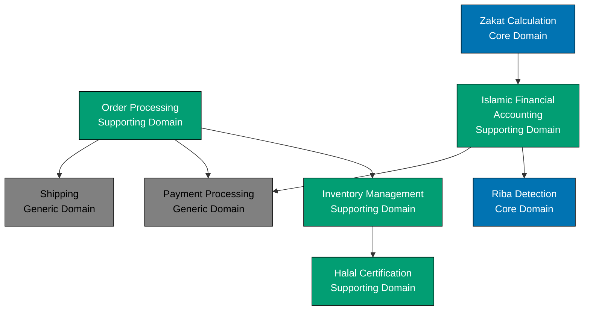

# Bounded Contexts

## What is a Bounded Context?

A **Bounded Context** is a central pattern in Domain-Driven Design that defines an explicit boundary within which a particular domain model is valid. Within this boundary, all terms, definitions, and rules have specific, unambiguous meanings. Outside this boundary, those same terms may mean something entirely different.

Think of a bounded context as a conceptual fence around a portion of your system where a specific model applies. The model inside one bounded context is independent and isolated from models in other bounded contexts, even when they deal with related concepts.

**Key Characteristics:**

- **Explicit boundaries**: Clear definition of where the model applies
- **Unified model**: Internally consistent domain model
- **Ubiquitous language**: Shared vocabulary valid within the boundary
- **Team ownership**: Often aligned with team boundaries
- **Independent evolution**: Can change without affecting other contexts

## Why Bounded Contexts Matter

### The Problem: Unified Models Don't Scale

In large systems, attempting to create a single unified model across the entire domain leads to:

**1. Ambiguity and Confusion**

The same term means different things in different parts of the business:

- "Customer" in Sales: potential buyer with contact information
- "Customer" in Support: existing user with support tickets and history
- "Customer" in Billing: account holder with payment methods and invoices
- "Customer" in Shipping: delivery recipient with address and preferences

Forcing a single "Customer" entity to satisfy all these perspectives creates an bloated, confusing model.

**2. Tight Coupling**

When all parts of the system share the same model, changes in one area ripple across the entire codebase. Adding a field for billing breaks the sales module.

**3. Coordination Overhead**

Teams must coordinate every model change, slowing development and creating bottlenecks.

**4. Inappropriate Complexity**

Each context inherits complexity from all other contexts, even when irrelevant. The shipping module doesn't need credit card validation logic.

### The Solution: Bounded Contexts

Bounded Contexts solve these problems by:

**1. Eliminating Ambiguity**

Each context has its own model optimized for its specific needs:

- **Zakat Calculation Context**: `ZakatAssessment` with nisab thresholds and Islamic wealth rules
- **Inventory Management Context**: `Product` with halal certifications and stock levels
- **Order Processing Context**: `Order` with line items and fulfillment status

Each model is clear and unambiguous within its boundary.

**2. Reducing Coupling**

Contexts integrate through well-defined interfaces (APIs, events, shared data). Internal changes don't leak across boundaries.

**3. Enabling Team Autonomy**

Each team owns one or more bounded contexts, making decisions independently and moving at their own pace.

**4. Managing Complexity**

Each context contains only the complexity relevant to its subdomain. Complexity is isolated, not distributed throughout the system.

## Identifying Bounded Contexts

Finding the right boundaries is one of DDD's most challenging aspects. Use these techniques:

### 1. Follow Ubiquitous Language Boundaries

When the same word means different things, you've crossed a bounded context boundary.

**Example: "Account" in Islamic Finance**

- **Accounting Context**: `Account` = ledger account (assets, liabilities, equity)
- **Customer Management Context**: `Account` = customer profile with contact information
- **Islamic Finance Context**: `IslamicFinancialAccount` = Sharia-compliant investment account

Solution: Three bounded contexts, each with its own "Account" concept.

### 2. Identify Business Capabilities

Bounded contexts often align with distinct business capabilities or organizational functions.

**Example: E-commerce Capabilities**

- **Product Catalog**: Browse and search products
- **Shopping Cart**: Add items, calculate totals
- **Order Fulfillment**: Process orders, manage inventory, ship products
- **Customer Support**: Handle inquiries, track issues
- **Billing**: Invoice, payment processing

Each capability suggests a potential bounded context.

### 3. Look for Different Rules and Policies

When business rules change significantly, you've likely crossed boundaries.

**Example: Sharia-Compliant Business**

- **Halal Certification Context**: Rules for verifying product compliance (ingredients, processing, supply chain)
- **Zakat Calculation Context**: Rules for calculating Islamic almsgiving (nisab thresholds, wealth types, lunar calendar)
- **Riba Detection Context**: Rules for identifying prohibited interest-bearing transactions

Different rule sets → different bounded contexts.

### 4. Listen to Domain Experts

Domain experts naturally think in bounded contexts, even if they don't use that term. Listen for phrases like:

- "In shipping, we call that..."
- "The finance team defines that differently..."
- "From an inventory perspective..."

These signal context boundaries.

### 5. Analyze Team Structure

Conway's Law: "Organizations design systems that mirror their communication structures."

If teams are already organized by business area, use that as a starting point for bounded contexts.

### 6. Examine Data Ownership

Who is the authoritative source for each piece of information?

- **Product Catalog**: owns product descriptions, images, categories
- **Inventory**: owns stock levels, warehouse locations
- **Pricing**: owns prices, discounts, promotions

Different data ownership → potential bounded contexts.

## Defining Bounded Contexts

Once identified, document each bounded context clearly:

### 1. Name

Choose a name from the Ubiquitous Language that clearly communicates the context's purpose.

**Good Names**: Zakat Calculation, Halal Certification, Order Fulfillment
**Poor Names**: Module A, Domain Service, Business Logic

### 2. Description

Briefly describe what the context does and its business purpose.

**Example**:

> **Zakat Calculation Context** - Calculates Islamic almsgiving (zakat) obligations for wealth holders based on nisab thresholds, wealth types, and Hijri calendar cycles. Ensures compliance with Islamic jurisprudence rules.

### 3. Ubiquitous Language

List key terms and their definitions within this context.

**Example for Zakat Calculation**:

- **Nisab**: Minimum threshold of wealth required before zakat becomes obligatory
- **Hawl**: Complete lunar year during which wealth is held
- **Zakatable Assets**: Wealth subject to zakat (gold, silver, cash, business inventory)
- **Zakat Rate**: Percentage of wealth due as zakat (typically 2.5%)

### 4. Core Concepts

Identify the main entities, value objects, and aggregates.

**Example**:

- Aggregates: `ZakatAssessment`
- Entities: `WealthDeclaration`
- Value Objects: `NisabAmount`, `ZakatRate`, `HijriDate`, `Money`

### 5. Responsibilities

What business capabilities does this context provide?

- Calculate zakat owed based on declared wealth
- Determine nisab threshold for current year
- Track hawl (lunar year) completion
- Validate wealth declarations for completeness

### 6. Boundaries

What is explicitly out of scope?

- Payment processing (handled by Billing Context)
- Wealth tracking (handled by Accounting Context)
- Tax calculations (handled by Tax Compliance Context)

## Bounded Contexts in Sharia-Compliant Systems

Let's examine bounded contexts for an Islamic e-commerce platform:



### Zakat Calculation (Core Domain)

**Purpose**: Calculate Islamic almsgiving obligations

**Key Concepts**:

- `ZakatAssessment`: Aggregate root representing a zakat calculation
- `NisabAmount`: Value object for minimum threshold
- `WealthType`: Enumeration (cash, gold, silver, business inventory, agricultural produce)

**Responsibilities**:

- Determine nisab threshold based on current gold/silver prices
- Calculate zakat owed (typically 2.5% of zakatable wealth)
- Track hawl completion (lunar year)
- Validate wealth declarations

**Integration Points**:

- Consumes wealth data from Islamic Financial Accounting
- Publishes `ZakatCalculated` events

### Halal Certification (Supporting Domain)

**Purpose**: Verify product compliance with Islamic law

**Key Concepts**:

- `Product`: Aggregate root with certification status
- `HalalCertification`: Value object with issuing authority and expiry
- `CertificationAuthority`: Entity representing certifying bodies

**Responsibilities**:

- Track halal certifications for products
- Validate certification authority credentials
- Monitor certification expiry
- Verify supply chain compliance

**Integration Points**:

- Provides halal status to Inventory Management
- Consumes product data from Inventory Management
- Publishes `ProductCertified`, `CertificationExpired` events

### Riba Detection (Core Domain)

**Purpose**: Identify and prevent interest-bearing transactions

**Key Concepts**:

- `Transaction`: Aggregate root representing a financial transaction
- `RibaIndicator`: Value object scoring riba risk
- `ContractType`: Enumeration (murabaha, musharaka, cash sale)

**Responsibilities**:

- Analyze transactions for riba indicators
- Validate Islamic contract structures
- Flag suspicious patterns
- Generate compliance reports

**Integration Points**:

- Consumes transaction data from Islamic Financial Accounting
- Publishes `RibaDetected`, `TransactionApproved` events

### Order Processing (Supporting Domain)

**Purpose**: Manage customer orders from placement to fulfillment

**Key Concepts**:

- `Order`: Aggregate root
- `OrderLine`: Entity within order
- `OrderStatus`: Value object

**Responsibilities**:

- Accept and validate orders
- Calculate order totals
- Coordinate fulfillment
- Track order status

**Integration Points**:

- Consumes product and inventory data
- Triggers payment processing
- Initiates shipping

**Note**: "Order" means different things in different contexts:

- In Order Processing: `Order` = customer purchase with line items
- In Islamic Financial Accounting: `Order` = formal instruction for financial transaction
- No confusion because each context has clear boundaries

## Bounded Context Patterns

### Size Considerations

**How big should a bounded context be?**

There's no fixed answer, but consider:

**Too Small** (Over-fragmentation):

- Excessive integration complexity
- Too many network calls
- Difficult to maintain consistency
- Team coordination overhead

**Too Large** (Under-fragmentation):

- Multiple teams editing same codebase
- Ambiguous model
- Slow deployment cycles
- Difficult to understand and modify

**Right-Sized Indicators**:

- Team of 3-9 developers can own it
- Can be deployed independently
- Has a clear, focused purpose
- Minimal coordination with other contexts required
- Changes are mostly internal

### Monolith vs. Microservices

Bounded contexts are logical boundaries, not physical deployment units.

**Modular Monolith**:

- Multiple bounded contexts in single deployment
- Logical separation via packages/modules
- Shared database with private schemas
- Good starting point for new systems

```
apps/ose-platform/
  ├── src/
  │   ├── zakat-calculation/    # Bounded context
  │   ├── halal-certification/  # Bounded context
  │   └── riba-detection/       # Bounded context
  └── database/
      ├── zakat_schema/         # Private to zakat context
      ├── halal_schema/         # Private to halal context
      └── riba_schema/          # Private to riba context
```

**Microservices**:

- Each bounded context as independent service
- Physical separation with separate databases
- Network integration via APIs or messaging
- Extract from monolith when needed

```
infrastructure/
  ├── zakat-calculation-service/
  ├── halal-certification-service/
  └── riba-detection-service/
```

**Migration Path**: Start with modular monolith, extract to microservices when scaling or team autonomy demands it.

## Bounded Context Canvas

Document each bounded context using the [Bounded Context Canvas template](./ex-ddd__19-templates/bounded-context-canvas.md):

- **Name** and **Description**
- **Strategic Classification** (Core, Supporting, Generic)
- **Business Decisions** (what makes this context special?)
- **Ubiquitous Language** (key terms)
- **Model Components** (aggregates, entities, value objects)
- **Dependencies** (inbound and outbound)
- **Events** (published and consumed)

See [Bounded Context Canvas Template](./ex-ddd__19-templates/bounded-context-canvas.md) for a complete template.

## Integration Between Bounded Contexts

Bounded contexts must integrate, but through carefully designed interfaces. See [Context Mapping](./ex-ddd__04-context-mapping.md) for 9 integration patterns including:

- **Shared Kernel**: Two contexts share a subset of the model
- **Customer/Supplier**: Upstream context serves downstream needs
- **Conformist**: Downstream conforms to upstream model
- **Anti-Corruption Layer**: Translation layer protects downstream model
- **Partnership**: Two teams collaborate on shared goals

## Common Mistakes

### 1. Anemic Bounded Contexts

**Problem**: Contexts with only CRUD operations and no business logic.

**Solution**: Each context should encode meaningful business rules. If a context is just data access, it's probably not a real bounded context.

### 2. Shared Database Without Boundaries

**Problem**: Multiple contexts directly accessing the same database tables.

**Solution**: Use database views, private schemas, or separate databases to enforce boundaries even in a monolith.

### 3. Premature Microservice Extraction

**Problem**: Starting with microservices before understanding context boundaries.

**Solution**: Begin with a modular monolith. Extract microservices only when you understand the stable boundaries.

### 4. Ignoring Conway's Law

**Problem**: Bounded contexts that don't align with team structure.

**Solution**: Align contexts with teams, or reorganize teams to match natural context boundaries.

### 5. Too Many Contexts

**Problem**: Over-fragmenting the domain into dozens of tiny contexts.

**Solution**: Start with fewer, larger contexts. Split them only when clear benefits emerge (team autonomy, deployment independence).

## Relationship to C4 Architecture

Bounded contexts map naturally to C4 model levels:

- **C4 System Context**: Context map showing all bounded contexts and external systems
- **C4 Container**: Often one container per bounded context (in microservices)
- **C4 Component**: Aggregates within a bounded context

See [DDD and C4 Integration](./ex-ddd__17-ddd-and-c4-integration.md) for detailed mapping.

## Bounded Contexts in Nx Monorepo

In our Nx workspace, bounded contexts can be organized as:

**Applications** (`apps/`):

- Each deployable app can contain one or more bounded contexts
- Example: `apps/ose-platform/` contains multiple contexts as modules

**Libraries** (`libs/`):

- Shared kernel components usable across contexts
- Domain primitives (Money, HijriDate, HalalCertification)
- Infrastructure abstractions

```
open-sharia-enterprise/
├── apps/
│   └── ose-platform/
│       ├── src/
│       │   ├── zakat-calculation/    # Bounded Context
│       │   ├── halal-certification/  # Bounded Context
│       │   └── riba-detection/       # Bounded Context
└── libs/
    ├── ts-domain-primitives/         # Shared Kernel
    │   ├── money/
    │   ├── hijri-date/
    │   └── halal-certification/
    └── ts-shared-infrastructure/     # Infrastructure
```

## Summary

Bounded Contexts are the cornerstone of strategic DDD:

- **Define explicit boundaries** where a model is valid
- **Eliminate ambiguity** by allowing different models in different contexts
- **Reduce coupling** through well-defined integration points
- **Enable team autonomy** with clear ownership
- **Manage complexity** by isolating concerns

Identifying the right boundaries is challenging but critical. Use Ubiquitous Language, business capabilities, team structure, and domain expert insights to find natural seams in your domain.

Once identified, document each context clearly and integrate them through the patterns described in [Context Mapping](./ex-ddd__04-context-mapping.md).

## Next Steps

- **[Context Mapping](./ex-ddd__04-context-mapping.md)** - Learn 9 patterns for integrating bounded contexts
- **[Subdomains](./ex-ddd__05-subdomains.md)** - Classify contexts as Core, Supporting, or Generic
- **[Strategic Design Process](./ex-ddd__06-strategic-design-process.md)** - Run Event Storming workshops to discover contexts
- **[Bounded Context Canvas Template](./ex-ddd__19-templates/bounded-context-canvas.md)** - Document your contexts

## References

- Eric Evans, "Domain-Driven Design" (2003) - Chapter on Bounded Contexts
- Vaughn Vernon, "Implementing Domain-Driven Design" (2013) - Chapters 2-3
- Martin Fowler, ["Bounded Context"](https://martinfowler.com/bliki/BoundedContext.html)
- [Context Mapper](https://contextmapper.org/) - Tool for modeling bounded contexts
